# 【双语字幕+资料下载】威斯康星 STAT453 ｜ 深度学习和生成模型导论(2021最新·完整版) - P155：L19.2.1- 在 PyTorch 中实现字符 RNN(概念) - ShowMeAI - BV1ub4y127jj

All right。 So we are now slowly getting to our code implementation of the character R and N N Pytor。

 And like I mentioned at the end of the previous video， we will split this into two parts。

 So this video will be on some conceptual。😊，Yeah， aspects about the implementation。

 some I would say things that help us understanding the implementation。

 And then the next video will be the actual code example。

 So there's one thing I wanted to talk about。 that's the LSTM class。

 We have used that before when we implemented the R and N for classification。 But yeah。

 there was a question also on Piazza and I made this ugly drawing trying to better explain the inputs and outputs。

 And I realized this is like one of the really obscure things in Pytorch。

 It's not so obvious what's going on there because yeah there are lots of inputs and outputs to the LSDM And I wanted to yeah explain this again for everyone And spoiler。

 there's also an LSTM cell class that I also wanted to explain。

 especially the difference between the LSTM cell and the LSDM class。

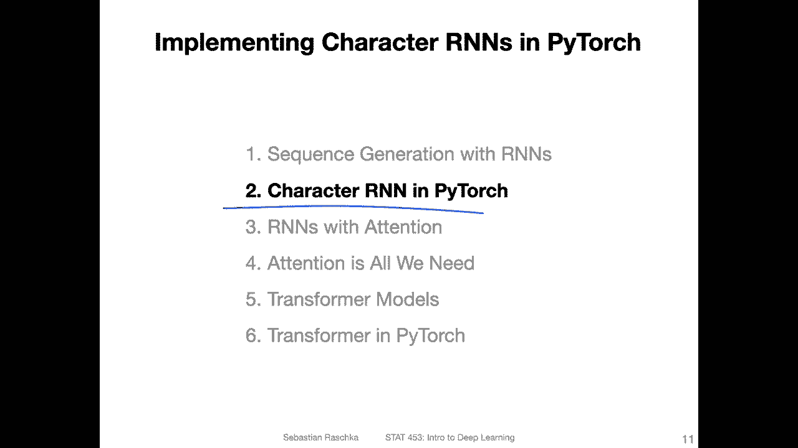

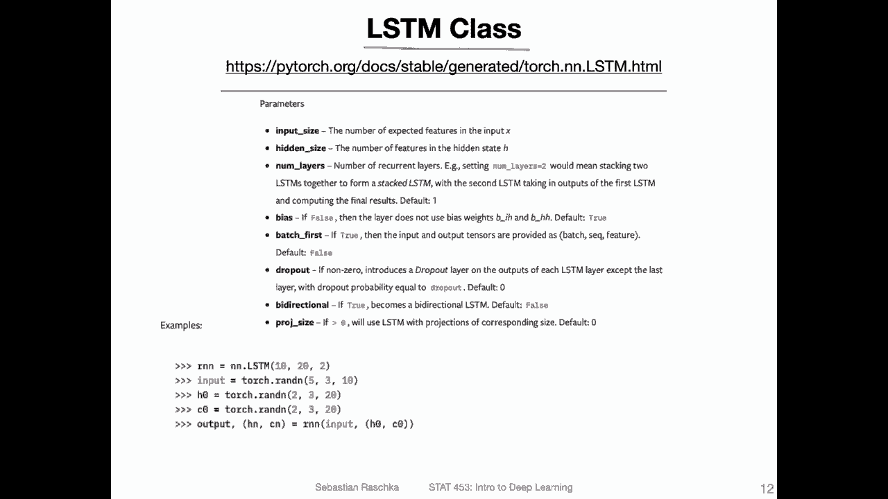

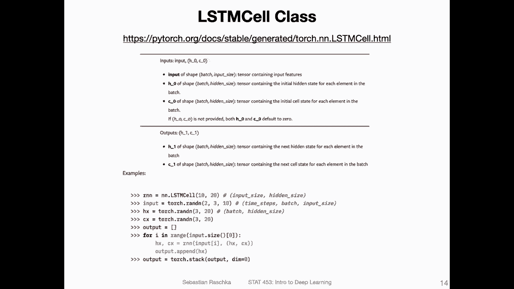

Pytorch。 But yeah one thing at a time。 So we used this LSTM class before when we implemented the R and N for classification。

 and yeah， there are lots of things going on with that one。 So here just looking at the example。

 they initialize the LSDM。 So there are three values。 if we look up the values here in the usage。

 It's the input size， the number of expected features。

 essentially the hidden size and the number of layers。

 So usually usually but previously we used only one hidden layer。

 but we can also of course use multiple hidden layers。

 I will have a visualization showing you how that looks like in the next slide。

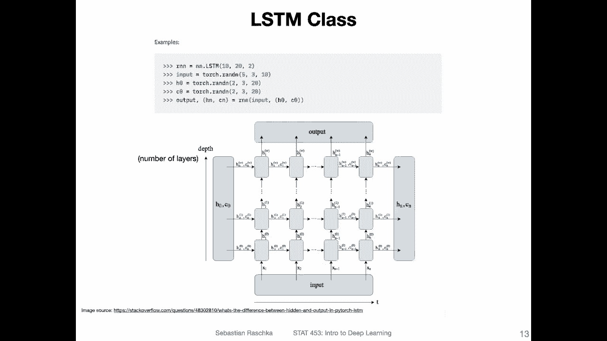

But we are focusing on that。 So we have， let's say， initialized our LSTM and then。Here。

 it's getting used， and it receives。2 inputs， so。The input。

 and then the second input is this tuple here consisting of H 0 and C 0。 So what are。H 0 and C 0。

 These are our initial。Hidden state and cell state here。

So here they use random numbers for everything， but usually we initialize the initial states with zeros。

But here， it doesn't really matter here。 They just want to try or ill try illustrating how。

 how inputs might look like from the dimension perspective。 So what， what they essentially look like。

 what dimensions we need。 In any case， So there are these inputs and also as output， there's。

An output here， And also a tuple。With what called H N and C N here， where this is。

The hidden state of the last。Time step and the cell stayed after the last time step。

So I had this relatively ugly drawing and piazza。 I actually searched on the internet a little bit to find a better visualization and I found the following here on stack overflow。

 which illustrates this nicely what everything here is so。

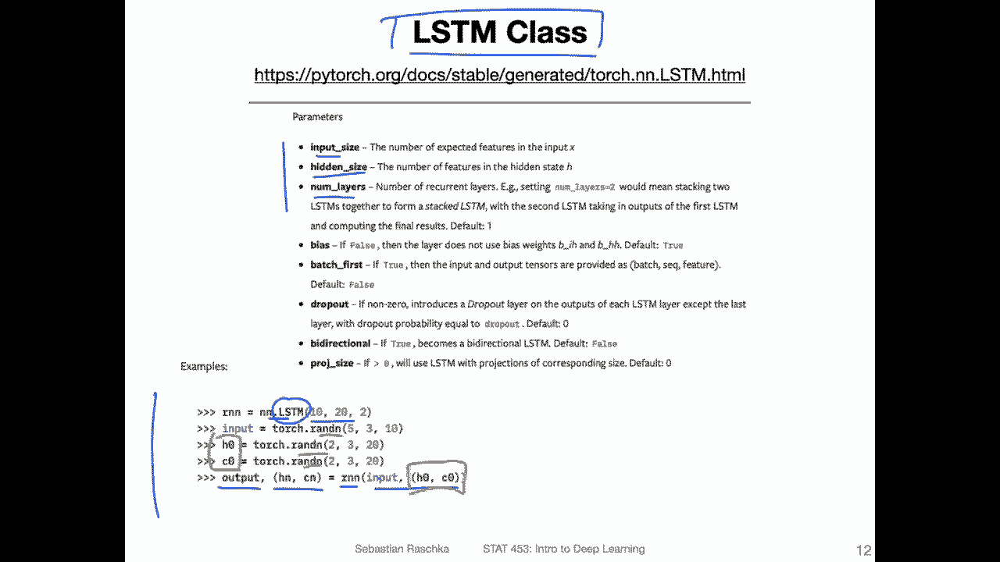

The input here。Which goes into the R N can yeah really think of it as your data input。

Where is this whole。So maybe I should use a different color。

 This whole thing should represent your LSTM， where。Here， this is the depth， the number of layers。

 so。This would be。Layer 1。Layer 2， and。Yeah，3。 So previously in the code examples。

 we only used one layer。 But of course， yeah， we can have multiple layers。 It's just。

 you can see that it's。Just one layer on top of each other。 right， So previously， we only had。

In the actual code example in the lecture， we only had this this one hidden layer。

 but we also talked about that we can have an arbitrary number of hidden layers similar to how we can have an arbitrary number of layers in a convolutional network or an multilayer perceptron。

O。So this is our input here at the bottom。Right， and now H 0 and C 0。 me also use a different colour。

 maybe yellow。 So these are。Here along。Initial states that go into the Estian。

So here the two is for the number of layers。Okay， and then。The outputs。From the R and N， this is。

Also for each time step。 So there's one output for each time step， similar to how there's one。

Input for each time step。In addition to that， it also returns。Here。The hidden state and cell state。

For the last。Time step。So technically， what we could do is we could have， let's say， another RN。Call。

 let' say， some input sequence 2。Together， select we had it here together with now here this H N。

And see， And if we wanted to， for example， if we want to reuse that part， for example。Alright， so。

But this yeah， this is conceptually what we get out， so。This and this， these are our outputs。And。

This is our input here。

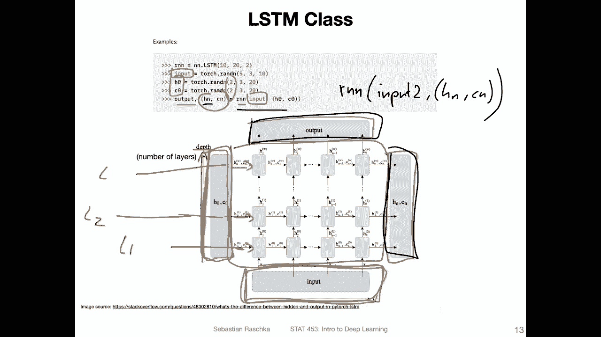

Now， the LSTM cell classes。It's kind of like part of the LSTM。 It's a smaller unit like LSTM cell is。

 is only a small unit， and we can actually use both either the LSTM or the LSTM cell for implementing the character R and N and I have。

Use both， and I will also provide you with code examples for both。 but to be honest。

 I think using the LSDM cell class is a little bit more natural。Becauseuse the way we compute。

The labels， it's a little bit more easy to do that。

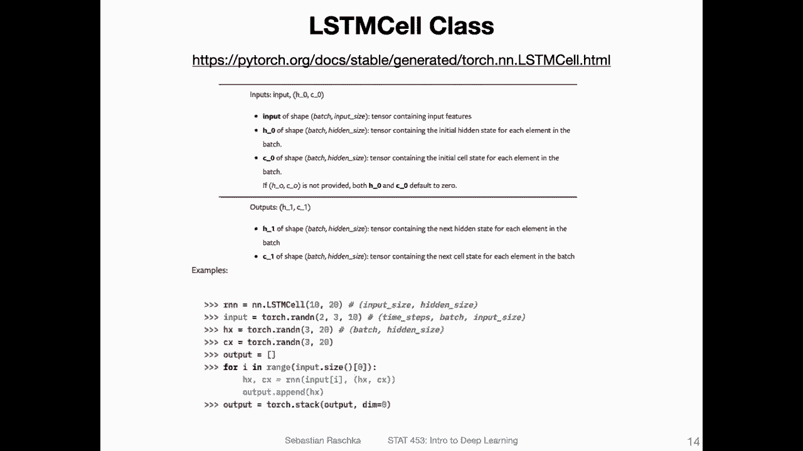

And also， for generating data。So the LSTM cell， how it works。

 is that it is just representing one small unit of what you have seen before。

 so the LSTM cell is naturally only one layer instead of setting the number of layers。

 we would have to stack them on top of each other。And。

Using the figure that I showed you before in the red box， this is essentially what。

Represents the LSDM cell。 So it only receives one characterize the input。

Then for the one layer of the hidden。The initial hidden and cell state， and it only outputs。

One output here。And then the hidden and cell set for the next state。

 So why that is more useful is in a way for computing the loss， essentially that you can。

Get one thing at a time， essentially， instead of running。The whole thing， and。

If we would use the LSDM class， we would have to provide one character at a time as input and it's kind of wasteful doing that so。

Handling wise， I find the LSTM cell a little bit more easy to use for this purpose。 But， of course。

 you can use both。 You can。

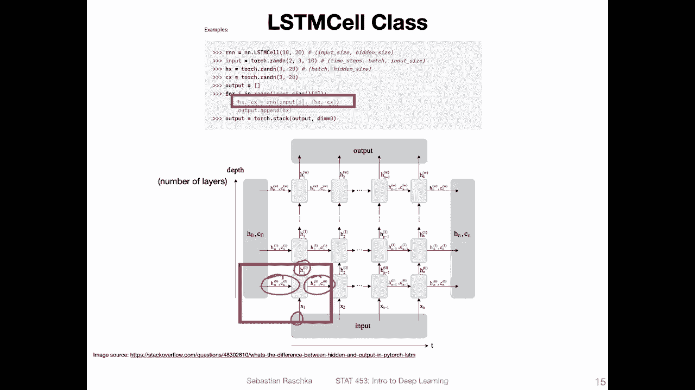

You can also for the character earn end， for example， run this character on in here。With。😔，Only one。

 one input here， multiple layers。 you can also run it like that by only having an input of one input。

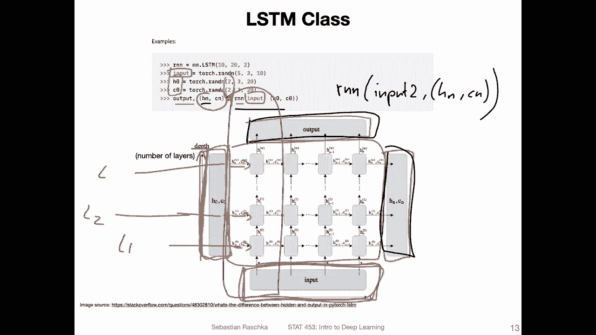

But if you， if we want to do this in the first place， we can also just use the LSDM cell and use。

 use that one。 It's， it's this smaller unit here。Essential， if we was， would only use one layer。

 we would then。Use this output here， put it to a fully connected layer to get the class label predictions and then compute the loss and then go on to the next character and so forth。

And here we are going to do that in the code example in the next video。

So one more thing we are talking here about the many too many where we have。

Or we want to create text。 So predicting the next word。

 if you are interested in another type of many too many architecture， for instance。

 language translation I found they have actually a great tutorial on the Pythtorch website so we are not going to talk about language to language translation because yeah。

 theres already a great tutorial and it would be kind of boring for me just to reproduce this tutorial So maybe if you're interested。

 you can just check it out and work through it step by step So the next video we will。

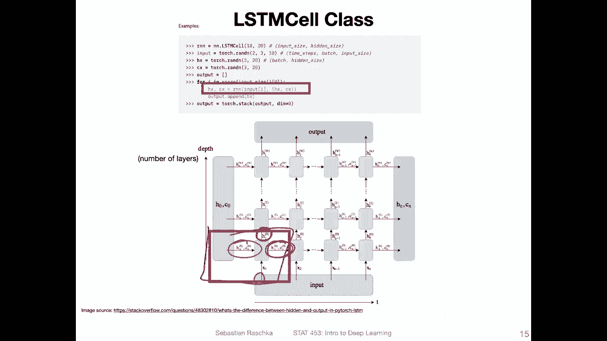

Oops， in the next video， we will focus on the character level R an N generating new text。

 and we will be using this LSDM cell class。

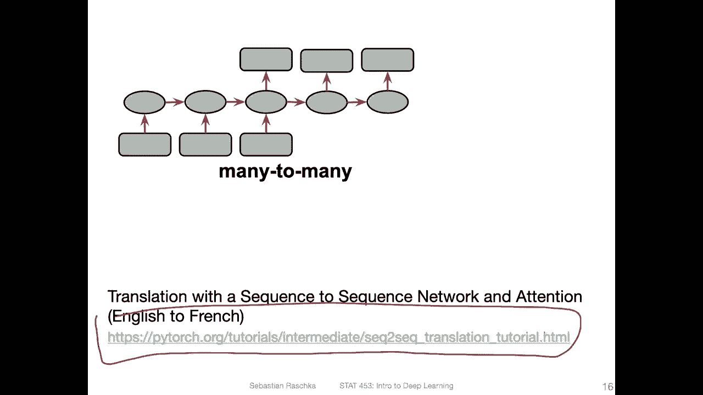

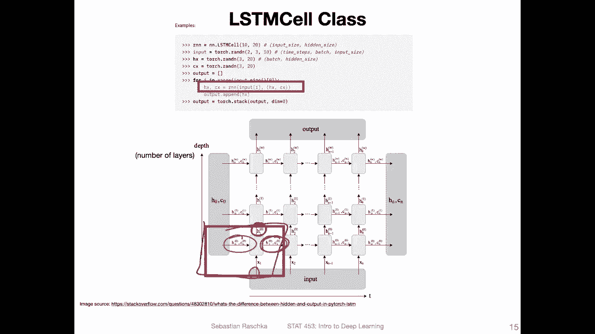