# 【双语字幕+资料下载】威斯康星 STAT453 ｜ 深度学习和生成模型导论(2021最新·完整版) - P156：L19.2.2- 在 PyTorch 中实现字符 RNN(代码示例) - ShowMeAI - BV1ub4y127jj

All right， let's now take a look at a code implementation regarding the character R and N that we talked about in the previous video。

 So in the previous video， it gave you some overview of the LSTM and the LSTM cell。

And I prepared two notebooks。 One is based on using。

 I can maybe just scroll down for now on using the LSDM class。 and one is based on using。

The LSTM cell class， personally， I think for this type of model。

 it makes more sense to use the LSTM cell。 It's a little bit， I think， more intuitive。

So going back to what I talked about in the previous video。 So here that's the LSDM cell class。

 And we will， we will only consider。One layer。 I mean， we can easily extend it for multiple layers。

 but we will only have one layer， so。Let's blend that part out。And。We will essentially。

 so if you consider this part， we will receive one initial hidden state and one initial cell state。

Together with that input token like this， it will receive one input token hidden。State， cell state。

 and then produce one output， and this output will go to a fully connected layer to do the character prediction。

Then we will move to the next input。 So here， the next input， it will receive。

The hidden stayed from the previous time step and the cell stayed from the previous type step。

Together with a new character， and then it will produce again。

 an output that goes to a fully connected layer to predict the next character。

Then we will go on here again， it will receive receive the hidden state and the cell state from the previous time step。

The current times of input， output something and so forth。 So that's how the NTM cell class works。

Alright， But before we get to this part， the LSTM cell class， let's start at the top。

 Let me even'cause it's quite fast to run。 Let me even。

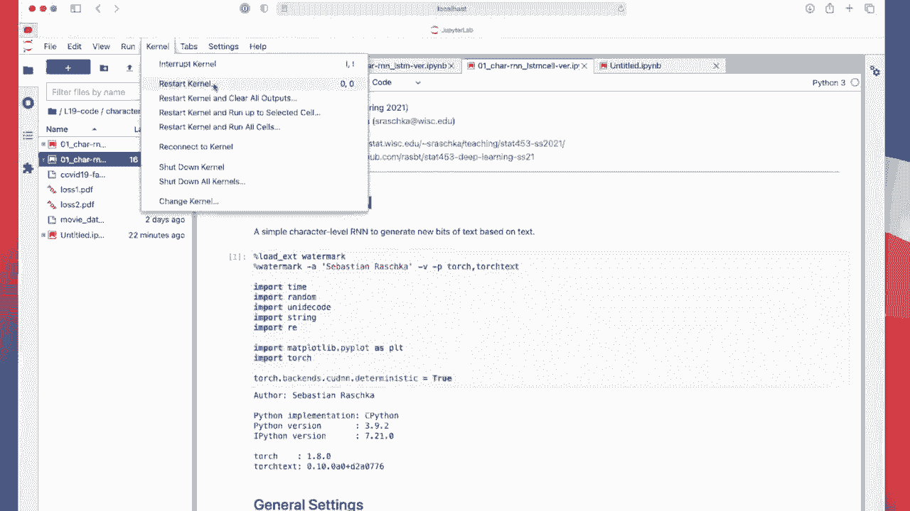

Run this from scratch。 We haven't done this in a long time。 Alright， so， I mean， from scratch。

 I mean， by executing it as we go here。

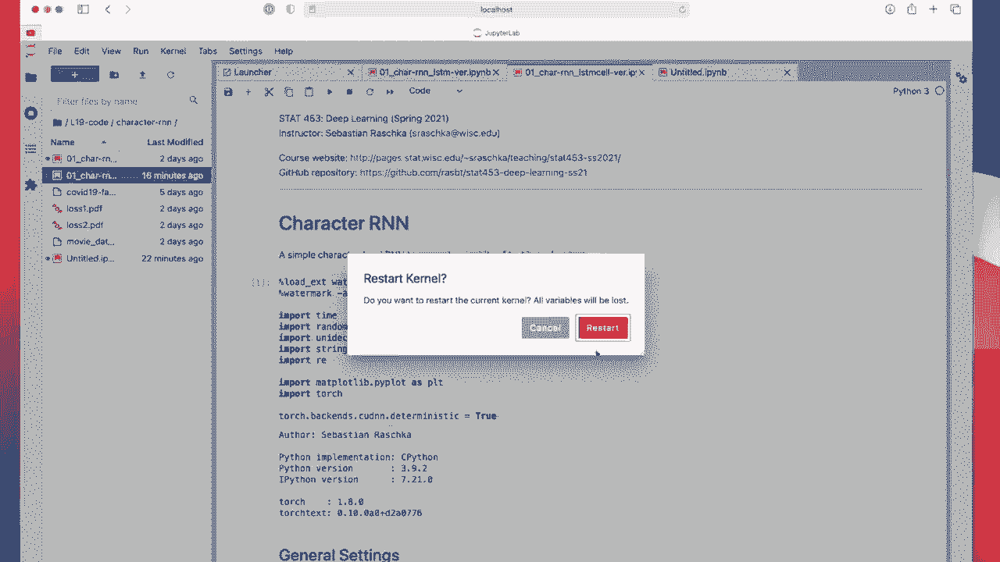

So we start by implementing oh by just importing some libraries。

 So here I didn't use any helper files I try to keep everything in the notebook because the code here is relatively short。

And simple。So here I have some hypoparmeters like the text portion size。

 So how long a typical text portion is。The number of iteration for iterations for training。

 So here we don't use epochs。 We just use iterations。嗯。Learning rate， the size of the embedding。

And the size of the hidden layer。Okay， let's execute that。I' runningning this on a CPU。

I actually had problems running this on the GPU。 I think there's a buck in Pytorch。

 so it runs fine on the CPU， but on the GPU it will restart the kernel And if I run this in my terminal without to put an notebook。

 it gives a segmentation fold and my suspicion is that。Yeah， it's a back in Pyth and。

Because it's maybe related to the fact that it's loading the data too fast。 And there's some。

 it's trying to。Access a memory in the GPU that is not free yet。 So actually， this shouldn't happen。

 So I， I believe there's a bug somewhere。But anyways， it's quite fast so we can。Run this on the CPU。

Okay， so we use this as our character set from the string。Python library。

 So string is like standard library in Python for string related things。

And we will use all printable characters。 So a bunch of them， actually， how many are there。It same。

100。So we will want use a set of 100 printable characters So numbers， lower case。

 upper case letters and special characters。Yeah， so actually， yeah。 So we will use。

Has the data set the CoVd 19 FAQ from the University of Wisconsin website？

I went actually to that website， and extracted all。On the FAQ questions here。 So I， as you can see。

 there was a lot of。Text， so I just copied everything into a text file。 So this is our training set。

 Its all Covid 19 related。Questions on our university website。嗯。Okay。

 so here I'm just opening and loading the text file。So in total， we have。

84000 characters in our textites， like a small book， almost。ok。

So here I have a function for getting a random portion of the text of。Size。Text length， so。

Do I have this text portion， sorry。My text portion size 200， so it gets。

Text of the portion size 200 from the whole text here， randomly。

So this will be our yeah training batch。Okay， so yeah those random portions。

 so you can see some letters are chopped off。 but for all our simple case here， it's good enough。

 So again， this is not perfect。 So you may in real world application。

 you may want to implement the function that it has like a complete sentences or something like that。

Should't just keep things simple。 This is just a simple function just getting 200 characters at a time。

Then I have a function converting the characters here to tensrs。

So here this is just getting the index for the characters。 So if we have 100 characters。

 it gets the index right， So a would be index 10 and so forth。

 So it's converting the strings into numbers that we can work with in Pythtorch。And。

This is putting those things together。 So this is for drawing a random sample for training。

 So this is just getting a random text portion in string format。

 This is for converting a string to integers and this does both。 It's getting the random portion。

 right。Converts that into integers。And then it also gets our labels。

 So the labels are the inputs shifted by one character because here our task is， yeah。

 to predict the next character in the sequence， right， So if I do that and draw my random sample。

 So my random samples are 0，94，24 and so forth。 And you can see。The target is shifted just by one。

 right， Because if we are here and we want to predict the next character， the next character is 94。

 And from here， the next character is 24 and so forth in interteger representation。 So this is our。

Or batch of features。And this is our， well， these are our labels。Kim。

So here's now our R R N implementation。So I just have something to keep track of the hidden size。

 This is our embedding layer that goes from the integer。

 the character integer to the embedding vector， a real value vector of size。 Let me see of size。100。

 and the hidden dimension is 128。Okay， so we have the embedding size and then the LDM cell。

Takes vectors of size，128。And has a hidden size of1 sorry， of 100 and has a hidden size of 128。

 So if I go back to my slides。

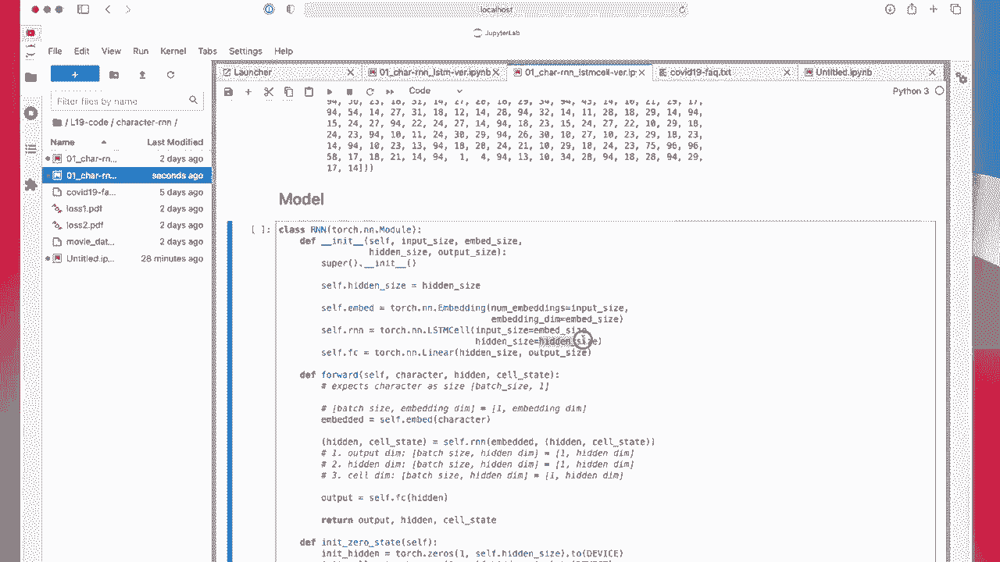

Maybe using this representation here。 So our text we had here a one hot encoding。This is， yeah。

 when we want to compute the loss。We use actually just an integer here。

 So here this would be the integer 2， the integer 0， and integer 1。 if you look at this here。

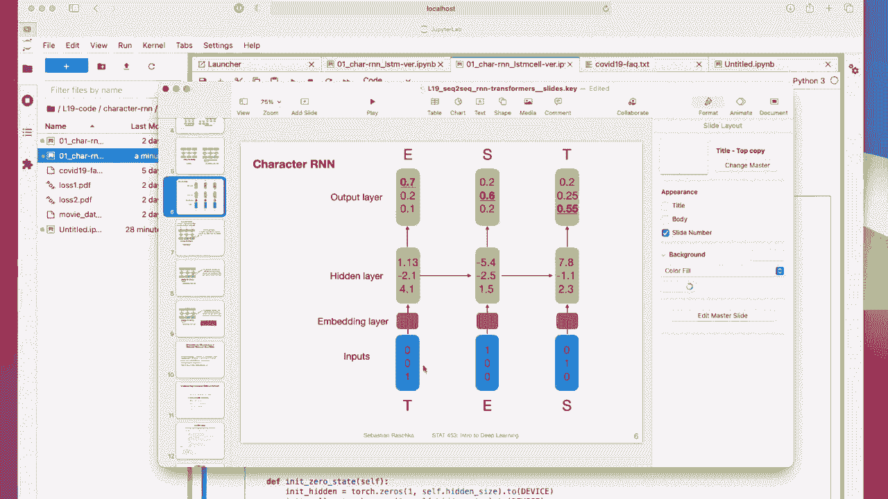

Right， so this one in， in this figure would correspond to an S， for example。

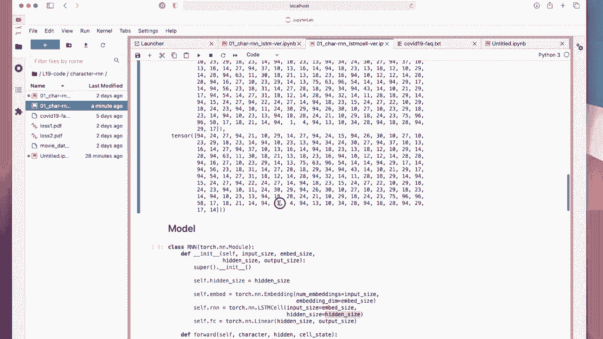

And then the embedding layer will output。100 dimensional。

Vectome and the hidden layer will be a 128 dimensional vector。So let's see how we use that actually。

 in the forward pass。So in the forward pass， we first put the character through the embedding。

 So this will be。Accepting batch size and bedding dimensionality。

 we use only one character at a time。 So it will be one times thebedding dimensionality。

 which is in our case 100。Then we give to the R and N， which is an LCDM cell。

 We give the embedded vector， which is。The 1 times 100， together with a hidden。

State and the cell state from the previous iteration。So this， if we are here。Essentially。

 or maybe use the other representation again。 So if we。Let's say the first step here。

So we are currently running here the this R and N。 It will get the hidden state and the cell state from the previous iteration。

 This is these two。 And these， we provide them via。By the forward pass as input。

 So these will go into this one and these will return a new set of hidden and cell states。

 So here these are the inputs， and then they return these outputs here， these two for the next round。

And then this is computing our。Lodges for the softm， for the cross entropis。So。This one output here。

 This is essentially this one through a fully connected layer。 So this will be。

It's clearer like this。So it， this will be。Like this。

So we'll be giving us one output where here we have。A fully connected there in between。

Gives us one output。

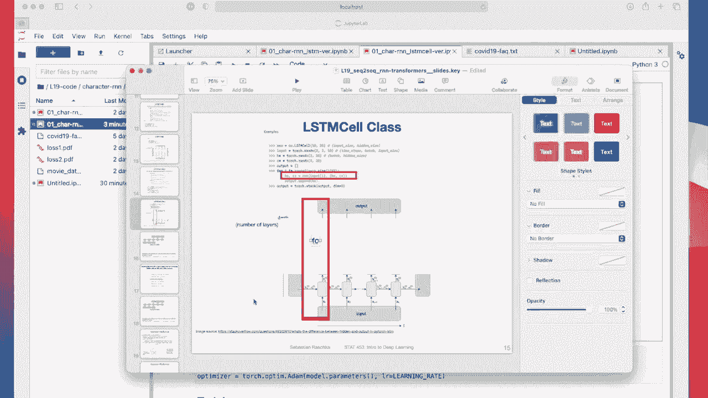

Okay， and we return the output because we use it for computing the loss。And also。

 when we want to take a look at the text so that we can generate some text。The next character。

And then also， when we want to generate text， of course。

 we have to feed the output back into the input。 So if I go back。

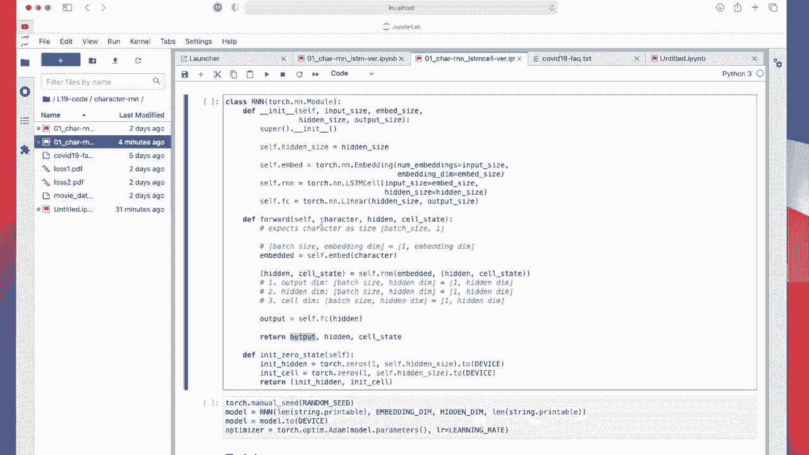

There's too many slides here。 When I go back here， this visualization， this is for training。

 but for generating text， we feed the output here so we get this input。

 produce an output and the output gets fed to the next time step is input so that we can generate new text。

Yeah， anything else。 Yeah， just the dimensionality for reference。嗯。Anything out。

This is not right here。 I think this should be。Definitely not this one。 It should be the。

Number of characters。Oh， but here I said hidden say output size would be yeah， the output size。Okay。

Yeah， and we would。 So we one more thing。 We have this initialization of the zero state。

 So here we have to start somewhere， right， so。If I go back to my。Visualization。Here。そう。

Me rid of one of those。So here we don't have initial input。 input the input is here。

 so we have to have some some zero state here。 and this is here my my zeros just。

 just some initial state。Okay， and alright， then let's get started。 So actually， the output size。

 I should mention， this is the same size as the input size。Yeah， so let's initialize the R and N。

 So as input size is the length of the number of characters。 it's 100。

So the output size would be also 100。 And in between， we have the embedding and hidden dimension。

I'm using atom。Just simple。Here's an evaluation function。

 Let me get to the evaluation function in a second。 Let me first。Bundus。Then， run this。

Can already execute this。 But I will talk about this after。

 after talking about the main training loop， because the evaluation function here。It's actually used。

Resuced on。Here， so it's just one tiny part of the training function。

So let's talk about the big picture training function first。 So I'm just iterating 5000 times。

5000 steps。Then， I have。My initialization here。 So this is for initializing my zero state。

 So this is for initializing here these initial states。 I can actually make this bigger， right。

So this is for initializing these zero states here。This for each iteration。

 So each so each iteration will go through one text portion of size 200。 So for each text portion。

 we initialize that as0， this is our beginning of the text。What we do is we set the loss to 0。

Draw a random sample。So again， the random sample will be like this， just some text。

 some random text portion。And the target shifted by one value here。We put it on the GPU。In our case。

 nothing happens because we use the CPU。Then for each character in the text portion size。

This is where we do the step putting it through the model。 So here。

 this is just for making the dimensional nuity， right， because this is。Just one single value。

 But as you recall， we want。One times sorry， batch size times 1。 So it should be a 2 d tensor。

 So we are doing unsqueed adding an empty dimension。We provide the hidden from here。

 the cell state from here， these initial cell states。 So in the first round。

 these will be the initial ones。 But then we are also outputting them， right。

 So it will feed by right back。 So in an acceleration。

These will be used from the previous iterations that will feed right back， and we are。

Computing the loss， we are just adding the loss here。

So we are computing the loss between the outputs and the targets one at a time。

And then we just normalize by the text portion size。 So we have， we have， it's just the average。

 the mean。Mean over the batch size， if you will， because。We add， let's say，200 losses。

 and then we divide by 200 just averaging。 it's。Just so that。

Works better with the learning rate so we can change the takes portion sizes and shouldn't have to worry about changing the learning rate。

Then we call backward， make a step， an update step， and that is it。

 So here we just have some logging。In some more logging， it will create a P D F with a plot。

 the loss plot so we can take a look at it during training。There's also a tool called Tensor board。

 which is actually pretty useful， but we already have so many things to talk about and code examples and everything I don't want to make it more complicated。

 so we are just using matpllip here。But yeah， the in one last interesting part before I run this is the evaluation function。

 So instead of just printing out the loss。 in addition to that， I'm also evaluating the model。

 So what do I mean by that， I'm letting it generate text。 So let's take a look。

This is my evaluation function。Soう。We initialize it to the zero state， then we。

Build up some hidden state。 We are priming this， essentially。

So what that means is we are providing some prime。Character。

 this is like some starting character here。 placeholder A。 I actually use T H。

 So all texts will start with T H that we are generating。 It's just， I mean。

 it's arbitrary could be anything。So all texts will start with T， H。And then here we are priming it。

 We are building up some hidden states so that the model stabilizes。 So we are doing this for。

The letters in the prime range。 So we only have two letters， right， we can have actually more。

 We can have some real words。Spills up a。Oh。

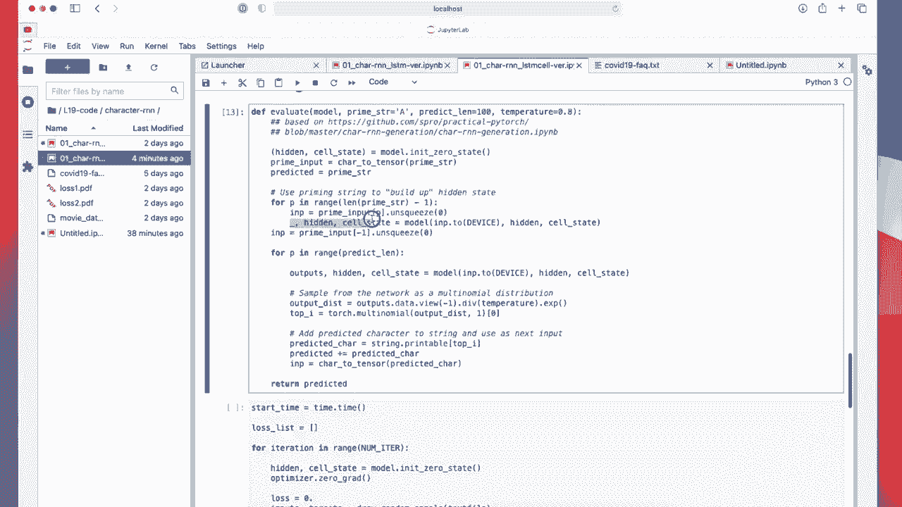

Sa state。 So it's just， it's just essentially running in this case， through two of these， right，1，2。

 And then we get to this part。

And， for each。In the prediction length， we are generating text of size 100。

We are just running it as before。 So again， there's nothing special yet。

 It's just running the model similar to how we run it in the training loop。The new part now， though。

 is。This part。So， here。Could I've also actually written it simpler like this。 If it' just a division。

So we are dividing by a temperature。 So what is the temperature， So， first of all。

Outputs are our logics。 So if we go back to our model here。These are just here。

 we don't use any softm because the softm is usually used in a cross entropy function。So。

 here we have。Just our loits。And then we compute， I mean。

 we are not really computing the softm as a normalization factor in the softm， right。

 So we are usually normalizing by the sum of all of these for each class here。 We are lazy。

 We don't do that。 We just take E to the power of。So essentially， it's E to the power of。

TheLos divided by the temperature。And the higher the temperature is。So maybe the other way around。

 if I have los and I have a small number， like the temperature is usually a value between 0。And one。

 and， I should say， why， what's the temperature here， this like。

I think it's inspired by energy based models， but which is turn in turn inspired by the Bsman distribution。

But it's essentially。How sharp our distribution is in this case。 So if we have a small value here。

 like 01。All the values will become larger。Yes， we will get larger values。 If we have a value1。1 1。0。

 they will be softer。So。We have here that a real main interesting part。

 We will here have this multinoial function， which is essentially a function that randomly samples from a multinoial distribution。

Using these， you can think of them as weights or probabilities and。This is on。

The number of samples we draw。So here we are drawing one。one。Character。From the predictions。

 So outputs will be the lodges for all 100 characters， because we have。哦。1 are different characters。

 So logics will be。哦。Values， if we have soft next， these would be all the probabilities corresponding。

Corresponding to these characters。And here we are randomly sampling， so。If we so we expect。

 expectation would be sampling。The character， although we would most often sample the character corresponding to the highest probability。

And。We can soften this by having a 1。0。 This is a standard setting temperature of 1。0。

 If if we use no temperature， this would be or regular values， But if we use a smaller value。

 let's say。1。 this will be a sharper distribution。 So the most。

The character with the highest value will be sampled more often。 So even more often， so。

We can actually set the temperature very， very small。

And then it will essentially be like not sampling at all。

 It will always sample the character with the highest probabilityity。 in that way， it's。

More like deterministic。 So you can think of it like that， the higher the temperature。

 the more diversity in the output in the generated text you will get。

So if you want to have more diverse text， you， you can lower the temperature。 It's， it's kind of。

 you can increase the temperature。 If you want to have no randomness， you lower the temperature。

 Higher temperature means more diversity。 You can think of it also as。

 as kind of like heat in a biological system where you， if you heat up the。The system。

 you have more kinetic energy。 Everything is symbolic。Wiggling around and things like that。

So here we have like  point8。 It's like a trade off。 but it's a hyper parametermeter， if you have。

Higher temperature， there will be more mistakes。Not also more diverse text。 It's like a trade off。

Okay。Can play around with that if you like when you do the training。

 but let's just use the ones that I use to begin with。 So it's running now。

 it gets a pretty high loss。 And this is the initial text。 Notice that it starts with a T H。

 But the rest is like Gib gok。 It's nothing reasonable in here is' just an arbitrary text。But yeah。

 it already finished the next iteration。 Let's take a look at that。Still not anything useful。

 You can see it learned something， right， So you can see， okay， these。This is an actual word here。

So it's learning something。 Let's take a look at the next one。Oh， okay， we have。Some real words here。

Kind of learning something。没有。You can see students。So again， this is trained on the Covid FAQ。Which。

Its more mostly readable text。K。😔，Yeah， it's getting， it's getting a little bit better。I mean。

 of course， this is like not real text。 It's not a very sophisticated iron。 And it's just one layer。

 very simple， very small text。 Also， I mean， it just learned for one minute， right so。

But you can see that it actually。Seems to learn something If you think about it started from this。

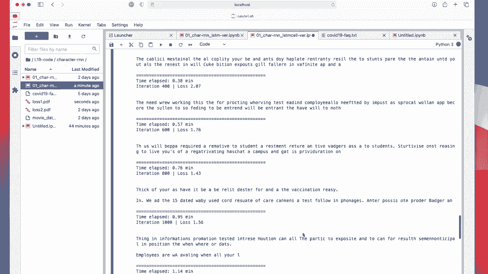

Had then went to this。 And now， it's kind of。

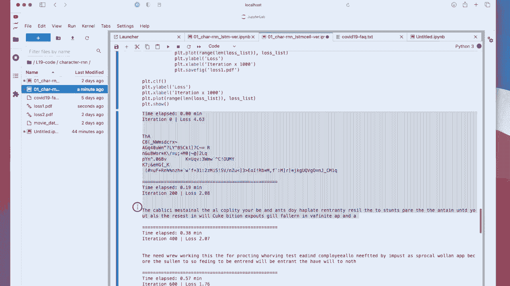

Talking about。Sa a beger。Bdges app notification system。 So it's， it's kind of learning things， right。

Wisconsin。Covid-19 testing。Yeah， it will have to run way longer to get some sensible inputs。 Again。

 there are also many hyperparmeter to tune can have more layers。

 You can change the temperature and these types of things。To get better results。 But I think。

 feel like， I mean， given that I'm on the CPU just running it for two minutes。

 it's quite cool that it can。😊。

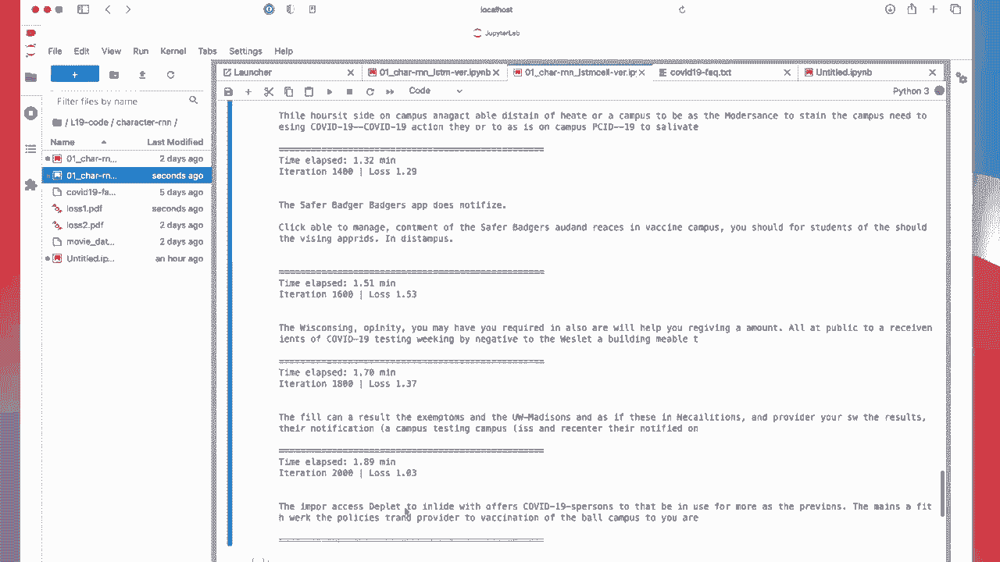

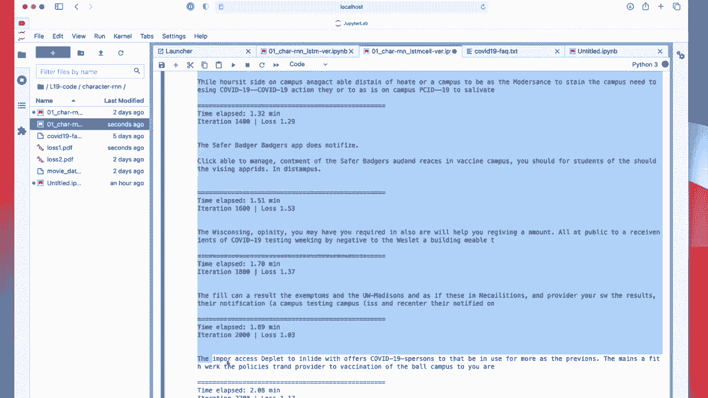

Yeah， can create text that is not total nonsense。 I mean， it's total nonsense nonsense， to be honest。

 but。We can identify individual words。 So that's actually quite cool。 Okay， so let me。

 let me stop it right here。 was a long video。 And in the next video， we will。😊。

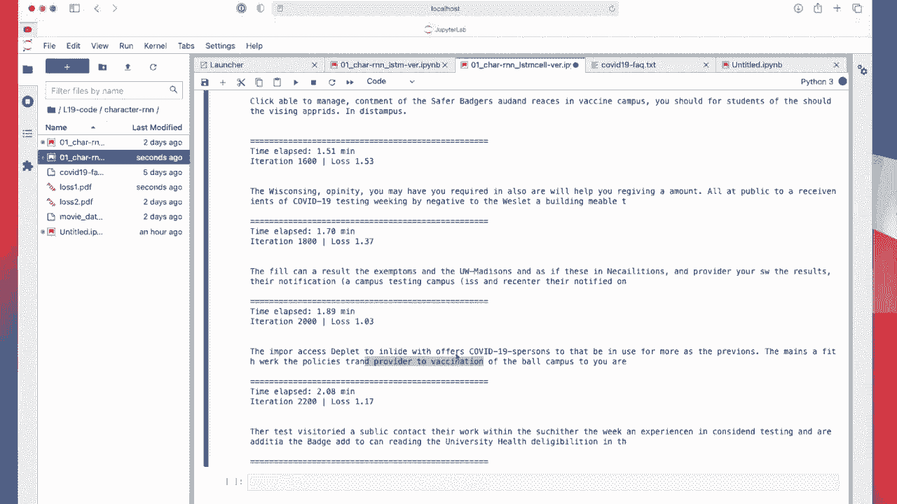

Take a next step， talking about how we can outfit our ends with the so called attention mechanism。

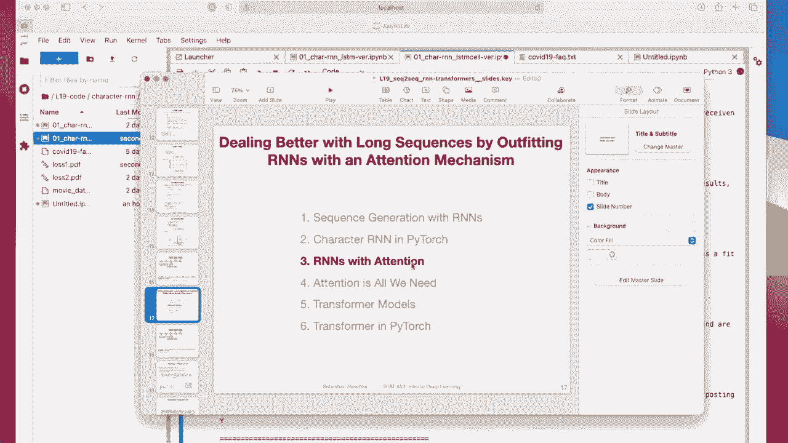