# P157：L19.3- 具有注意力机制的 RNN - ShowMeAI - BV1ub4y127jj

Alright so for this video I have a fun idea so some people complained that RNNs and LSTMs are not complicated enough„ÄÇ

 so in this video we are going to make them a little bit more complicated„ÄÇ

 so in particular we are going to talk about recurrent neural networks with a socalled attention mechanism that helps at dealing better with long sequences when we have tasks such as language translation„ÄÇ

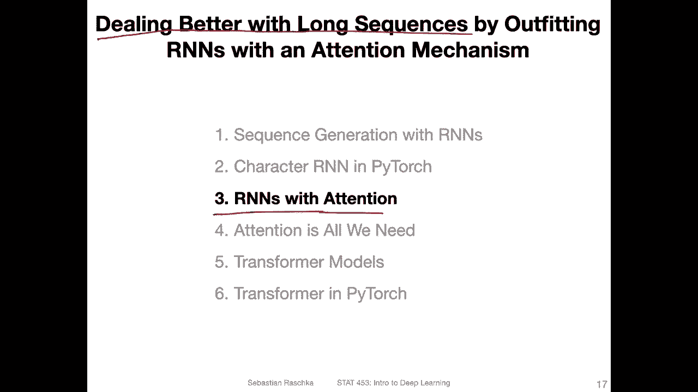

So just to yeah recap how language translation looks like„ÄÇ

 So this is a many too many architecture for language translation„ÄÇ

 So we have an input sentence and this input sentence gets parsed gets parsed into one hidden state so„ÄÇ

This whole part is， essentially。Encoding the input sentence。

 which is why it's also sometimes called as the encoder„ÄÇPart of the RnN„ÄÇ

 similar to how you call the first layers of an auto encoder„ÄÇ

 the encoder because it's compressing the input into one， let's say hidden state。And then。We have。

This。Deder part of the R N， which takes in the hidden state， and then produces。

The translated sentence„ÄÇIf you are interested in playing around with an example„ÄÇ

 I haven't made one for this class， but theres an excellent tutorial here on the PitWatch website that you can check out。

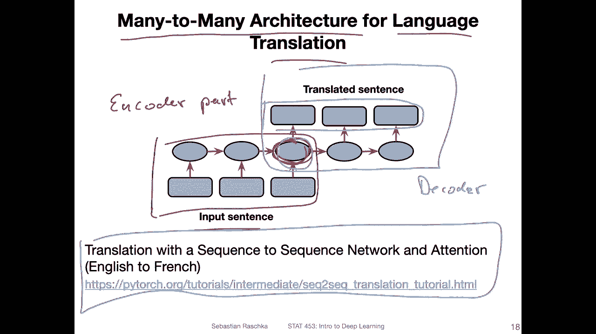

But before I show you how the attention mechanism works„ÄÇ

 let me give you an example of a language translation task„ÄÇ

 So here I'm translating one input sentence to an output sentence„ÄÇ

 So the input sentence is the English sentence today is a great day， and I'm translating it to。

Hotaist and Goar attack„ÄÇ So I'm not sure if you can guess which language it is„ÄÇ

 maybe a fun question for Piazza。 In any case， one thing。

In this particular sentence is that it actually translates word by word„ÄÇ

 so if you would take a dictionary。You could technically just translate it， whoops。Word for word。

 So if you have a sentence like that， you could almost use the many to many R N that we learned about in the previous lecture。

 the。One where we have the inputs。Then。The hidden states。Then， the outputs。And we technically。

Could just have the setup like this， like a。Many too many set up where。

We are translating word by word„ÄÇBut this doesn't work for all sentences„ÄÇ

This is why we have this delete set up， where we usually。Don't have these parts。

And this one goes into„ÄÇThe decoder„ÄÇAnd the decota then produces the outputs just based on the last state„ÄÇ

 because for some sentences， theres not this one to one correlation between input and output work。

 So for instance， heres another example sentence its if you have ever studied a foreign language。

 you have probably encountered a false friend at some point and here„ÄÇ

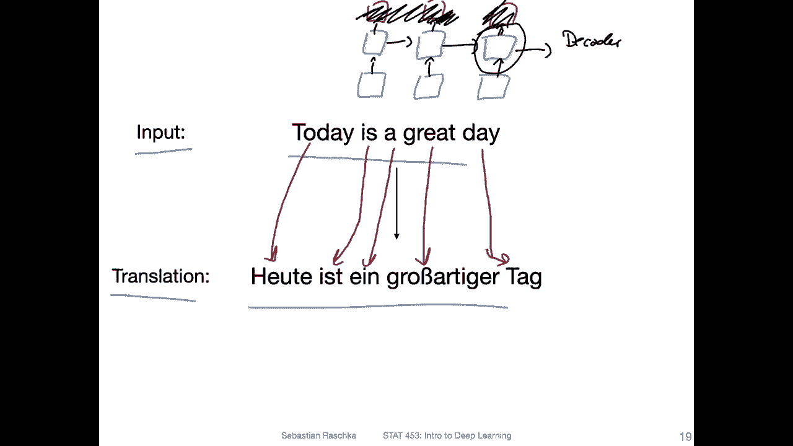

This is the translation。 So one thing that happens is， for instance， this one， these two words。

Become one word。 It's called fpair， and。Another thing I can spot here is that the you you have and here also。

 it translates one time to this word。So actually， the combination of these two。

 which are farther apart„ÄÇAnd then„ÄÇFor this Monday is no corresponding word really„ÄÇAnd„ÄÇüòî„ÄÇ

This one corresponds to this one。 So in this way， here， it's not so obvious。

 Like we don't have this one to one mapping„ÄÇ So things might be shifted a little bit around in that sentence„ÄÇ

 depending on the grammar„ÄÇ So it's not„ÄÇ

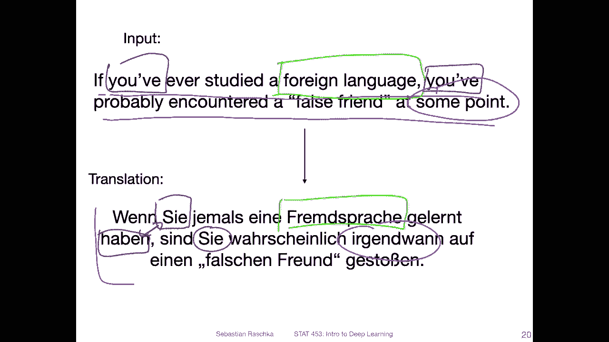

Super straightforward to use an architecture， like。

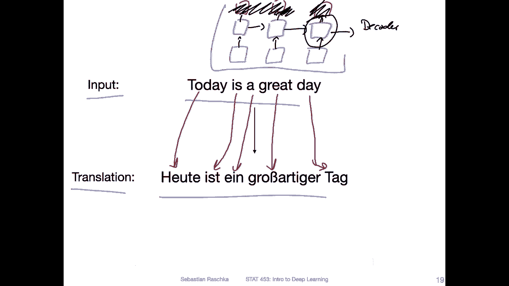

The original one that I had before here because we can't just map input to output„ÄÇ

Which is why we have this set up this many too many set up where we have„ÄÇ

The input sentence that gets passed into this hidden representation„ÄÇ

 And then we have something that creates the output so the„ÄÇEncodeder„ÄÇAnd the decoder network„ÄÇHowever„ÄÇ

 then one challenge is really that the network has to compress all the information into this one hidden state right„ÄÇ

 So essentially it's like reading the whole sentence here„ÄÇ

 it's reading the complete sentence and after reading the sentence„ÄÇ

 it's starting to translate So how do we make sure that the network even remembers right„ÄÇ

 So if it reaches this point， it has to contain all the information of the whole sentence and this can be actually quite challenging。

 I mean， even for instance， for you if you think about a sentence like。

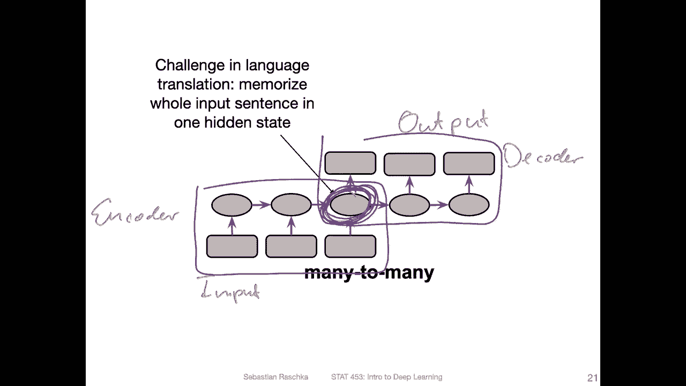

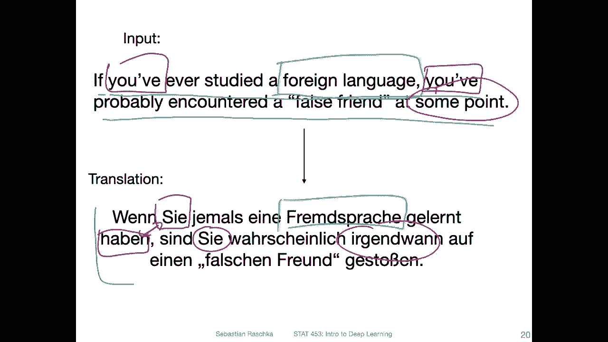

Like this it's maybe easy because it's just four words so you can memorize them and then translate them„ÄÇ

 but let's say you have a longer sentence like that and I read this out loud and then I tell you in one minute you have to translate it but you're not allowed to look at the whole sentence anymore So in that way I think also you would have a challenge memorizing all the words in that sentence because it's a lot of words„ÄÇ

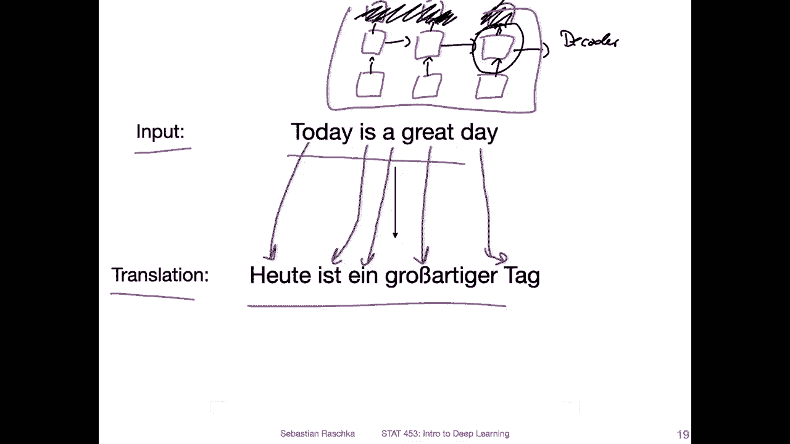

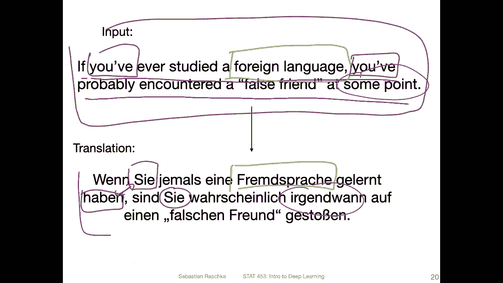

So the same for the R and N， it will probably be challenged to have all the necessary information in the hidden state。

 the longer the sentence becomes„ÄÇ

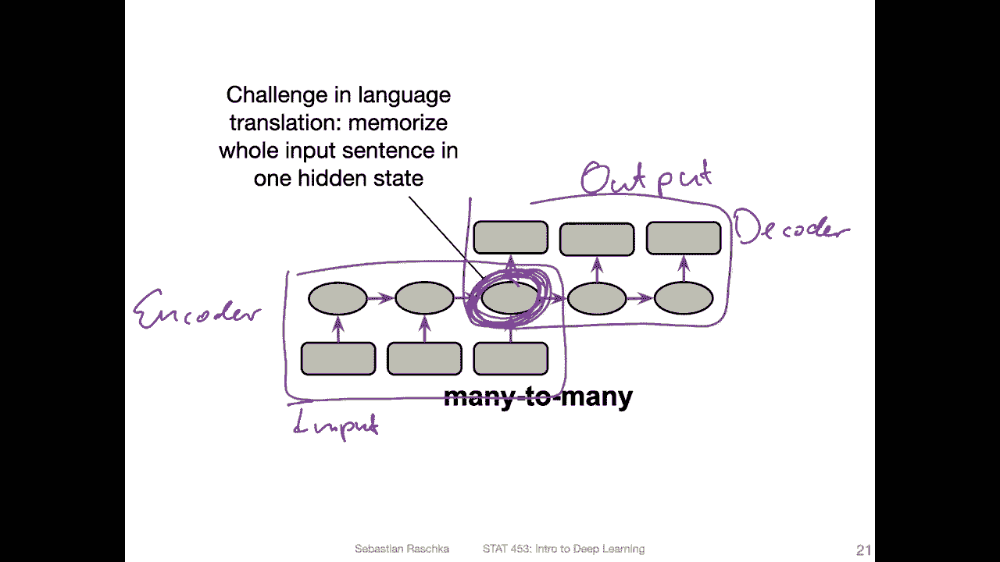

So this is why researchers worked on this so called attention mechanism to address this issue of having poor performance on long sentences„ÄÇ

So。Here， this is going back to the paper by Baranau and cos and。As far as I know。

 this is the first paper that really proposed this attention mechanism„ÄÇ

 but I may be wrong there may have been other papers， but this is at least the one。

 the first one I am aware of„ÄÇAnd„ÄÇThe key idea here is essentially that it's a mechanism that allows the model to automatically soft search for parts of a source sentence„ÄÇ

That are。Relevant for predicting a target word， so。

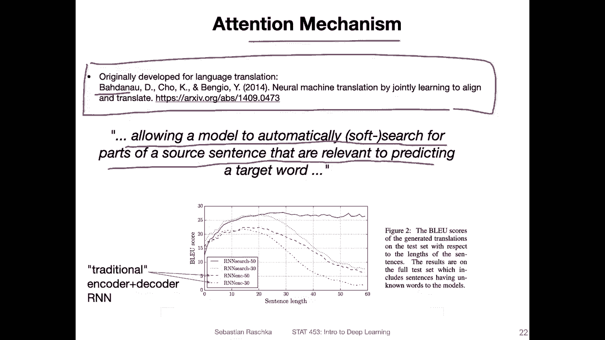

If I go back one more time to my sentence here， So let's say it's currently at that point translating this sentence。

 oops， it's allowed to look。

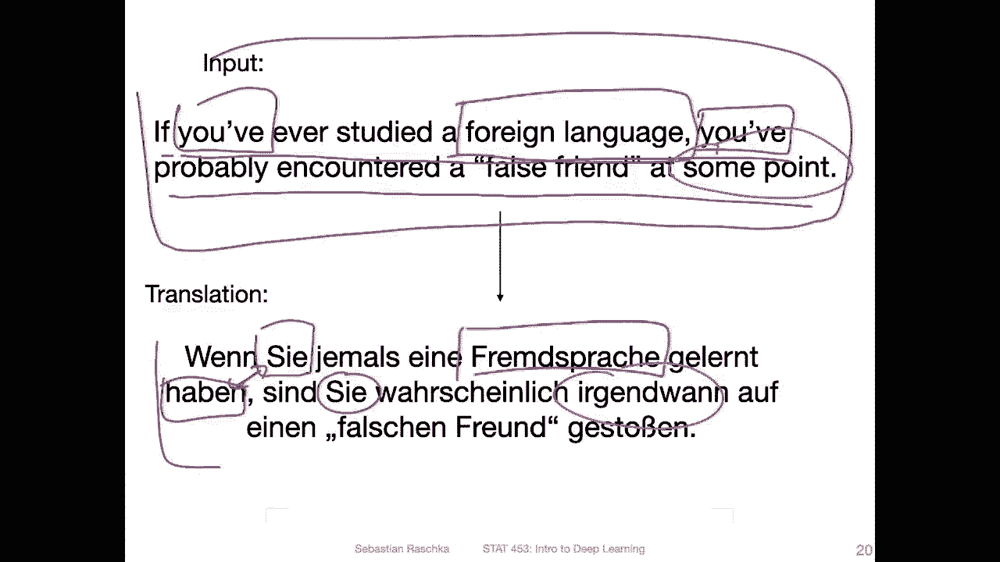

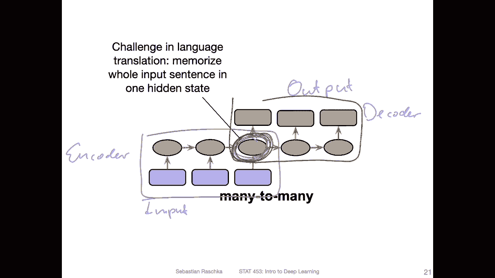

Like in the original sentence， which words are most。

Most important it it has access to the whole sentence at each time step。Essential， that's the idea。

 And some words are more important than others。 So， for instance。

 this might have a very low attention， like 0 and。This one is kind of relevant。

 It has maybe attention close to one„ÄÇ if we have an attention value between 0 and 1„ÄÇ

 So we have high and low attention for different words„ÄÇ So that at each time step the the model„ÄÇ

We be allowed to take a look at different parts of the sentence„ÄÇ that's like the new idea here„ÄÇ

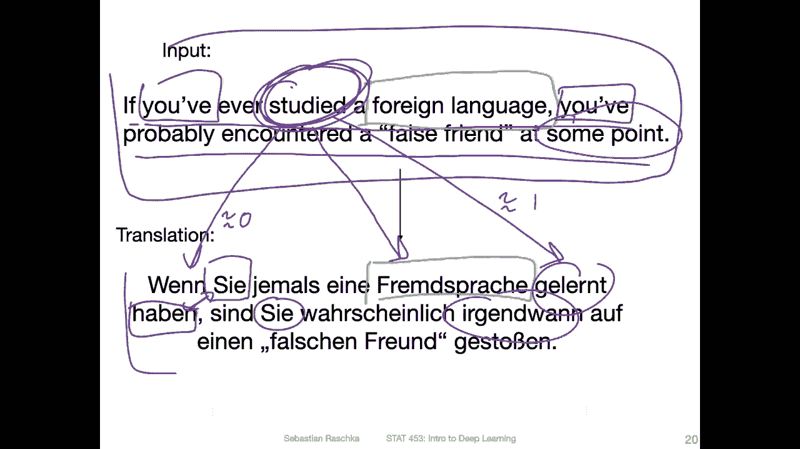

And„ÄÇAt the bottom here is an illustration of how they evaluated the performance„ÄÇ

 So there is something called the thing it's called blue score， and this is a score for computing。

 how good the quality of the translation is„ÄÇSo we won't go into too much detail of how that works for here for this lecture„ÄÇ

Just assume a higher blue score is better„ÄÇBetter if it's high„ÄÇAnd„ÄÇ

What you can see here is the sentence length„ÄÇ So they did experiments with different sentence lengths„ÄÇ

 And you can see that for。These two networks， these are。Abbreviated R N， ink，30 and 50。 So these are。

These are。Essentially， encoder networks like regular。 they are actually traditional R and N networks。

 So it's just like a shortcut for these networks„ÄÇ and the 30 and 50 is how much access they have„ÄÇ

To the input， I think。And you can see that the performance yet drops。

Ds dramatically for sentence lengths， larger than 30。

So you can see it gets good performance in this region， but if you get longer sentences。Ler than 50。

Words， then the performance declines。 But when they use this。Tension mechanism here。 they。

 they get good performance， even for longer sentences。 So here the takeaway is that。

They find that the performance for longer sentences is better if they use this so called attention mechanism„ÄÇ

 So how does the attention mechanism work， That is what I will show you in the next couple of slides。

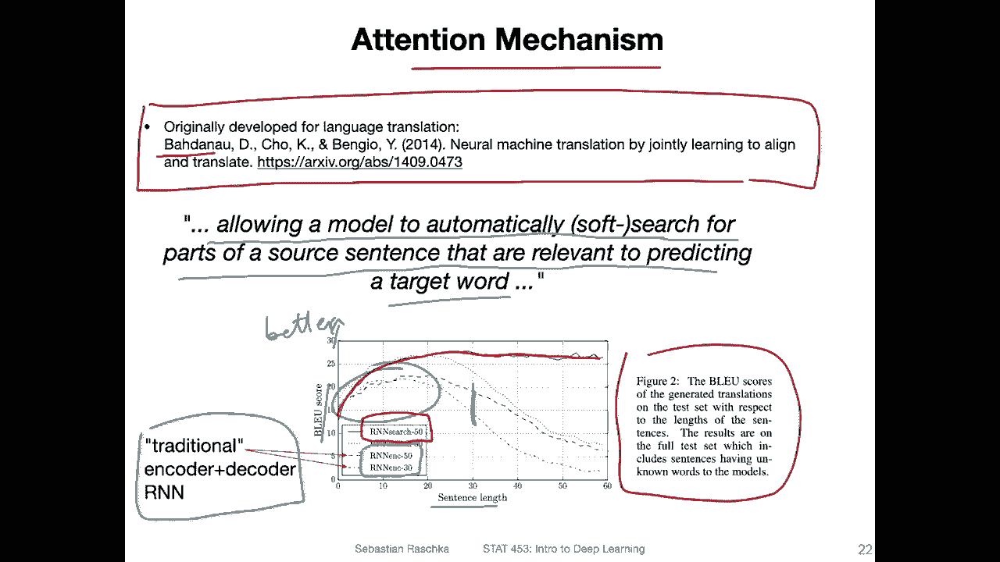

Yeah， so as I mentioned before， for each word， there will be a certain context provided。

 so the network will be allowed to look at the input sentence and„ÄÇ

See which words are important for translating a given word so„ÄÇSummarise„ÄÇ

 it would be assigning an attention weight to each word„ÄÇ

So that we know how much attention the model should pay to each word„ÄÇ

 so for each word the networks learns a certain context„ÄÇ

 so what is for this particular word what is the context of words that is relevant for translating this？

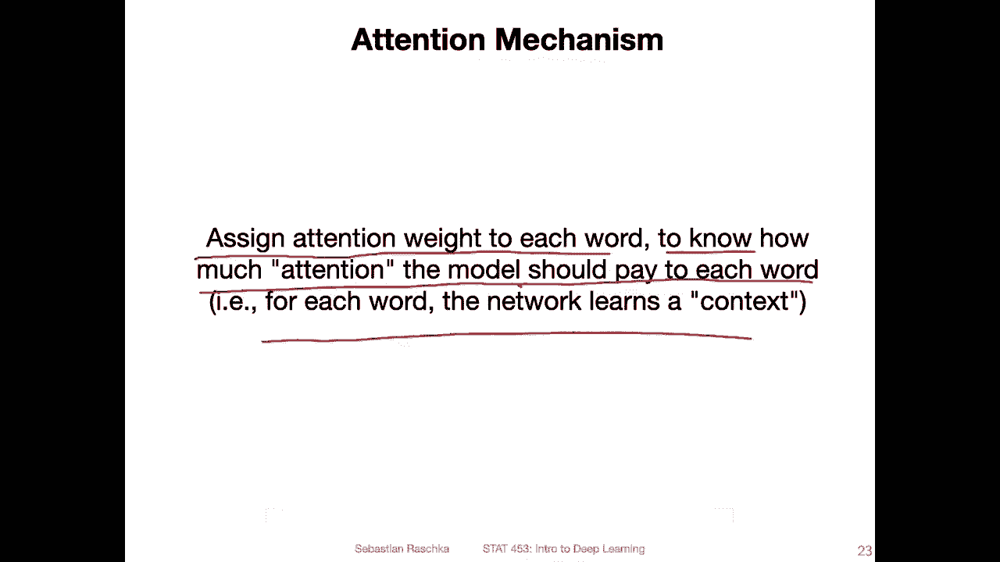

So here's a figure from the paper„ÄÇOutlining the whole mechanism in one slide„ÄÇ

 So one thing to notice is that there are„ÄÇ2 R ends„ÄÇ So this is all my annotation„ÄÇ

 But this is what I got out of this figure„ÄÇ So there are two R Ns„ÄÇ First of all„ÄÇ

 they have a bidirectional R N„ÄÇ We haven't talked about bidirectional R ends„ÄÇ

 but it's a very simple concept„ÄÇ It's just running the„ÄÇRecurrent neural network forward and backward„ÄÇ

 or you can also think of it running the recurrent neural network twice one time in the regular order and one time by having the sentence„ÄÇ

Put in in the reverse order„ÄÇSo„ÄÇIf we have the sequences or the input sentence„ÄÇX1 to X T„ÄÇ

 This is our input sentence。 So one。R and N runs this forward like a regular R n from x1， x 2。

 x 3 and to x T„ÄÇ So it produces these hidden states corresponding to it„ÄÇ

 And then you can also have a。The same concept running backwards。 So you just reverse the order， so。

This is shown at the bottom。 So you start with X T when you go to x 3， T，2 and 1。

 So you are just going backwards essentially。So yeah， this is a bidirectional RN。

It produces these hidden states„ÄÇ And from the hidden states„ÄÇ

 there will be these attention weights that will be computed„ÄÇ I will„ÄÇ

Show you how that works in the next couple of slides„ÄÇ But here's just the overview„ÄÇ

 So we have a bi direction R N„ÄÇThen we compute these attention weights„ÄÇAnd these go into our„ÄÇ

R and N that does the translation now„ÄÇ So I call this the regular R and N because it's not bidirectional„ÄÇ

 It's， it's more like a regular R and N works like we talked about before。

 except now that it also receives„ÄÇThese attention weights as input„ÄÇ

 So not only the attention weights， the attention weights weighted。 So here， in this case。

 the attention weight weighted with this。With this stuff here， so with this hidden state。

 I will show you how this gets computed in the next couple of slides„ÄÇAnd then yeah„ÄÇ

 it also receives the hidden state from the previous slide„ÄÇ

 So here this is maybe a little bit confusing， but it's the S。

 the S is just a letter that they used to denote the hidden state of this other of the second R N because here we already used the word the letter H and they didn't want to use the same letter„ÄÇ

 I guess for here and here because then it would be a little bit also confusing So here S„ÄÇIt's also„ÄÇ

 the hidden。Hidden state， but no the hidden state of the second are in。

And then these are the translated words„ÄÇ

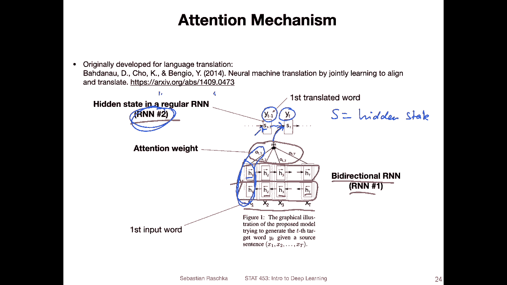

So here in this illustration I'm trying to simplify or at least try to explain what's going on in the previous figure in a little different way„ÄÇ

 So I haven't mentioned before what we do now with the hidden states of the bidirectional R andN„ÄÇ

 so when we have the bidirectional RN I mentioned we are running it forward and backward to obtain these hidden representations„ÄÇ

 but now we have two sets of hidden activations， one from the forward pass， it's called that F1。

And at this point„ÄÇ and then we also have the backward  one„ÄÇ let's call it B1„ÄÇ

 So how do we combine the two。 So in practice， it's very simple。 we just concatenate those。

 So we have just a hidden state that is twice the size of a regular hidden state from just the forward pass„ÄÇ

 because yeah， we are just concatenating those。 So the concatenator。 Then let's call that H1。

 This is our hidden activation„ÄÇAnd yeah here I'm trying to illustrate how the attention mechanism works„ÄÇ

 It combines multiple things„ÄÇ It combines these hidden states„ÄÇFrom the bidirectional R N„ÄÇ

And the activation， I sorry， the attention weights。 So these are。The attention。Wait。

 send these are the hidden„ÄÇActivations„ÄÇOf the bidirectional R N„ÄÇ And this is the hidden„ÄÇActation„ÄÇ

SoLet's call this decoder。Oops。Decoder。R N， okay。そう。For a regular RnN。

 what happens is that we provide the original word as input if you think back of our word RnN at the very beginning of this lecture„ÄÇ

 we would provide a word X1 here as input and then we let's say predict the next word for the many too many one for language translation„ÄÇ

 we wouldn't have any input here， we would just use the hidden state from the previous time step when we are in the decoding part。

So here， what's new is compared to a regular word R and N where we get this x1， the word is input。

 we now take in„ÄÇA context vector„ÄÇ So this context vector provides information about the whole sequence„ÄÇ

 not just x1， the whole sequence， the whole input sequence in a regular Rn N。

 This would be encoded in the previous hidden state。So if we at time step1， this would be of course。

0， but now imagine we are， let's say at the fifth time step。

 so the fifth time step would combine in the hidden state or the previous four time steps„ÄÇ

But it's like a very compressed version and information might get lost„ÄÇ

And for each word also in the sequence„ÄÇDifferent other words might be important„ÄÇ

 So it's kind of hard for a given time step to really ensure that right now it captures the important information for this current word„ÄÇ

 But then for the next one， it captures other important information。

 So it's easy to to forget what information was important from a previous time step and so forth„ÄÇ

 So to solve this problem， we have this context vector that allows us to take a look at the whole input sequence。

 So to illustrate this again。Remove this。Annotation， we have this C1 here and this C1。Is computed by。

Taking all the attentions multiplied by each hidden state， or。This multiplied， plus。This multiplied。

Plus these multiplied„ÄÇ So it might happen that a word is not very important„ÄÇ So in this case„ÄÇ

 if the word is not important， what would happen is that the attention weight would be。

 let's say close to 0， then it would not， let's say use this word。

 Other words might be more important， so the attention weight is larger。

And here's how the context vector is computed。 It's， yeah， summing over。

The tension weights alpha multiplied by these hidden activations„ÄÇ That's how„ÄÇ

How we compute this context vector。 Now， how do we compute this attention weight itself， I mean。

 we talked about the hidden activation， right， So the hidden activation is。

Just the concatenation of the forward and backward hidden activation。 Now， how do we compute this。

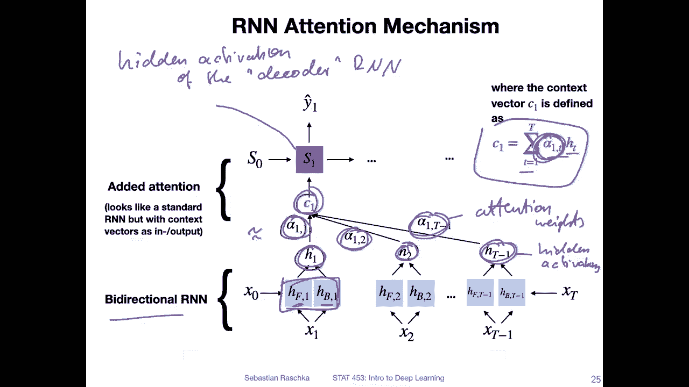

Attention weight。So the attention weight is computed by using another neural network， for instance。

Mtilayer perceptron。So。Let's maybe before we get to that， take a look at this current time step S1。

 So what does the current time step„ÄÇGet as information„ÄÇ So it gets as information„ÄÇ

 essentially this information from the hidden state hidden activations from the previous time step„ÄÇ

 And then we also have this。Hid an activation from the current time step， right， x1， so this is。

Previous hidden„ÄÇActation of„ÄÇPrevious„ÄÇTime„ÄÇStep„ÄÇAnd this is the hidden„ÄÇActation of the current„ÄÇ

Time step and„ÄÇThis network here gets takes both as input„ÄÇ

 the information from the current time step and the information from the previous time step and then outputs a score E„ÄÇ

 This is a while„ÄÇUnormalized„ÄÇAttention weight„ÄÇAnd this unmalized attention rate is put through„ÄÇOh„ÄÇ

 softftm。Function to normalize it so that the attention weights。嗯。Some up to one， right。

 So after softm， as you are familiar with。We would have。It should be。😔，Should be over with T。

 I guess。So， they should sum up。To one。And yeah， so this is how we compute these attention weights。

And yeah， there might be larger and smaller attention weights， given how important each word is。

 So it's， it's a form the attention weight depends on both。The current time input and。

The previous hidden state„ÄÇ So the attention ratess might be different if we look at a different word„ÄÇ

 if we have maybe attention rates that say that this is。t8，1 and 。1 for the current word。

For for this context vector here„ÄÇIt might be different if we compute C2„ÄÇ

 it might happen that this word here， the first one is not that important。

 the second word is more important and so forth， so at each time step might be different words that are important。

So but yeah， the bottom line is that this attention mechanism allows the network to kind of get information from the whole input sequence at each time step in addition to just this compressed information from this hidden state。

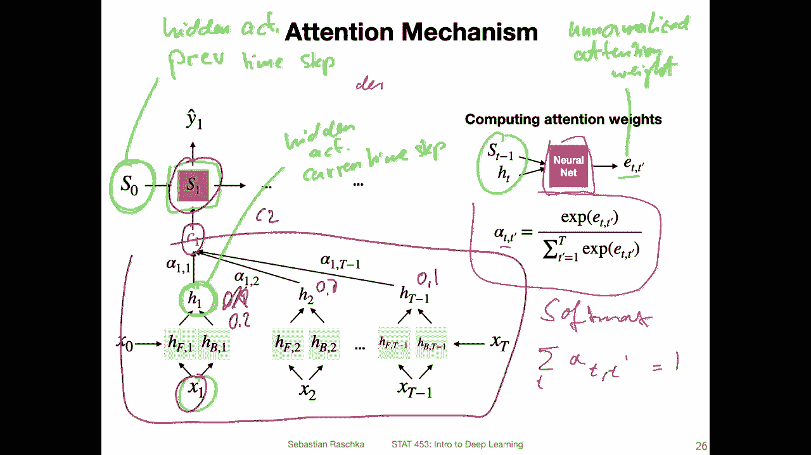

Alright， so to finish it up， here's another figure from the paper where they visualize the attention weights since the attention weights are values between。

0 and 1， my guess， is the white ones here correspond to a high attention rate of one and the black ones here correspond to a low attention rate of 0。

So I guess this is。1， and this is a0 here。So， here you have。Actually， not， I think。

They translated from English to French„ÄÇMight be wrong„ÄÇ I might be misremembering„ÄÇ

 So let's say this is our input„ÄÇAnd this is„ÄÇOutput„ÄÇ

And then you can see for each word how much attention the network pays。When translating， so。

When translating， let's say the L here， it pays most attention to the， but also something to s。

And so forth。 And you can see for some。Likeake。The number here 1992， 1992。

 it really only pays attention„ÄÇ You can see that„ÄÇIt only pays attention„ÄÇTo this number„ÄÇ

 which makes sense， right。So in this way， what you can see is the strong value。

Attention value in the diagonal， which means that it's kind of like a one to one translation in that way。

 but not always there are some cases where it pays attention to words that are also far apart in that sentence right so this is the attention mechanism and in the next video we will build on this idea„ÄÇ

By taking away the R and N part， because it turns out we just went from a very complicated model。

 The R and N added attention， but actually we don't need the R N at all。

 We can maybe also get good results with just attention„ÄÇ And that is the topic of the next video„ÄÇ

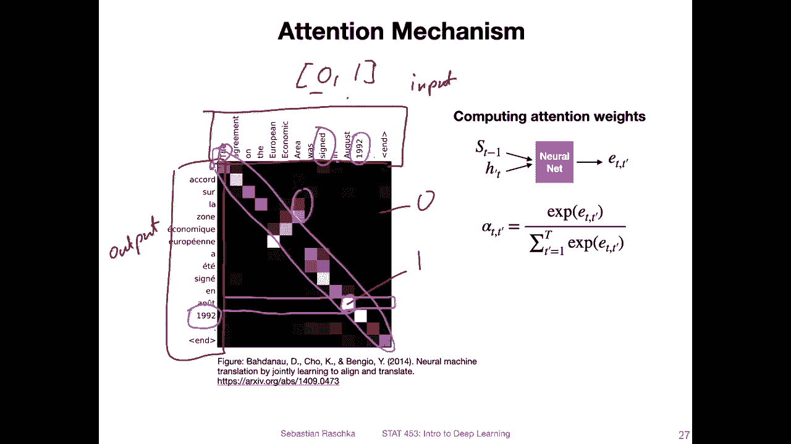