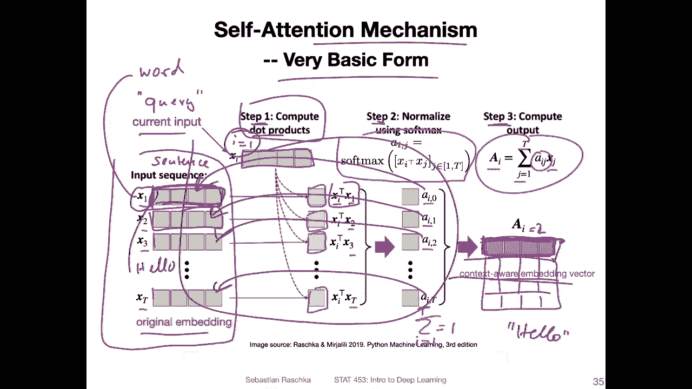

# 【双语字幕+资料下载】威斯康星 STAT453 ｜ 深度学习和生成模型导论(2021最新·完整版) - P158：L19.4.1- 在没有 RNN 的情况下使用注意力：一种基本的自我注意力形式 - ShowMeAI - BV1ub4y127jj

All right， in the previous video， we talked about recurrent neural networks with attention。

 So this attention mechanism helps the recurrent neural networks to deal better with long sequences。

 Now， we have doing something crazy and remove the recurrent neural network part。

 So we are going to take a look at a model that just uses attention without the R N part。😊。

So this particular type of attention we are going to look at is also called selfatten and this is the foundation behind or one of the main principles behind the so-called transformer networks that we are also taking a look at so these transformer models are currently state of the art models for long sequence modeling and working with text data。

So since there are lots of small topics to introduce instead of making one very long video。

 I decided to split this up further into subsections。

 so in this video we are going to take a look at a broad concept。

And then introduce a very basic form of self attention just for educational purposes to understand the underlying principle behind self attention。

 and then we are going to take a look at the more sophisticated form that is found in this in the original transformer model。

And this original transform model also has a concept called multi head attention。

 And after we cover these， we will then。Take a look at how these these concepts are combined。

Into the transformer model。And I will also introduce。一三。Interesting insights about that。

 And also talk about some popular nowadays， popular flavors of that。And finally。

 we will end with the implementation of transform models in pythtorch。

Okay， so。This is here just a recap of what we covered in the previous video。 So we had this。

R an end with the attention mechanism。 and how this worked was that we had。For each generated word。

 So we had this。Orn n here， we call this R N number one。 And we have this bidirectional R n。

So for each time step， the R N here was creating an output word。

 and in addition to just receiving the previous hidden state。

It was also receiving this context vector， which was depending on the whole sequence input here。

 So we had。The soil sequence here。 So the hidden representations here。

And then we multiplied them by these。Attention waits here。

So the attention weights were a normalized version of values computed by a neural network。

 So this was what we covered in the previous video。 So the key idea was that we， we had。

The whole sequence in a weighted form， as input。

Now we are going to remove all sequential parts from that model。

 So were getting rid of all the sequential parts。 we don't use any recurrence， no convolution。

 nothing like that， nothing that really is specific for processing input sequentially and。

We are going to work towards this so called transformer model。

 which only relies on the self attention mechanism。

 and the self attention mechanism processes the whole sequence all at once。

 And this is actually also great for parallelization。 actually。

 transform models are pretty expensive to train， but they are better at utilizing。

OrMiple GP U because you can train in parallel with。R and N， you generate one thing at a time， right。

 And so you can't run these in parallel because you have to， for this not to compute this。

 you have to have finished this part。 So transform us a little bit better or a lot better at parallellying computations。

And similar to the R and N， the many to many one。 we will also have an encode and a decoder part。

 But instead of here using RN or LSTMs， we use something called stacked attention layers。

 So this is what we are working towards2。 This is the big picture like adding to these parts。

 and we are going to do this one step at a time。

The basic foundation for these slides is this paper。

 it's called attentionten is All You and this was yeah the foundational groundbreaking paper in 2017 that introduced the original transformoma architecture which outperformed any other method out there up to this point。

So and since then， since 2018， the field of natural language processing with transformers has grown tremendously。

 so you can see it starts also relatively small， so here。When the y axis。

 this is the number of parameters in。In millions， I think。Yi。

It's always unfortunate when people don't label the Y axis， but I。

Think what they meant here in this article was。Parameters and millions。And this one would be 8。3。

Billion。Parameters， so you can see there's a huge growth curve。Tms of the sizes of these models。

 but also a huge growth in popularity。 So I don't have here in this video。

 but there are also papers like review papers that show the number of citations。

 often transformers are cited。 and how many models are out there and it's also an exponential growth。

 So it's a very， very popular field。 But of course。

 this is something that is not feasible for normal human being to train 8。3 billion parameters。

 Then nowaday is also models or research groups focusing on developing small transform models。

 In any case， this is just like big picture showing that transform models are interesting。

 there are many different flavors。 We are talking about this foundational one attention is all you need and if you are interested。

You can follow up with yeah some other models later I will also briefly talk about GT2 and the BRT model。

 which are also kind of foundational models， the main concept behind that because they are they are using cell supervised learning techniques that have been also then adopted in other types of transformers。

Okay， coming back。To。The self attention mechanism。 So before I talk about the self attention mechanism that is used in the transformers。

 I wanted to cover a very basic form of that just to yeah introduce the topic slowly。

So this very basic form， we can think of it as a procedure consisting of three steps。

 so the first step is deriving the attention weights。

 which are a form of similarity or compatibility between a current input。

 So current input in the sequence， one sequence element， you can think of it as。A word。

In the sentence and all other inputs， so。The similarity between a given word and all the other words in the sentence。

So once we I will show you how we derive the weights in the next slide。 So once we have the weights。

 we normalize them via the softmax function。 This is similar to what we have done in the R and N。

 by the way， when we computed the normalized attention weights。And then we will instead step4 here。

 compute the attention value from the normalized weights。And the corresponding inputs。

So this whole thing looks very similar to what I've shown you before with the R and N。

 So the R and N attention mechanism。 So also here， we have as the attention。Value here。

We have awaited some here。So。This year， ex Jane。Is an input a word。

We assume we have T words in our sentence。 and so for each word。We have。And attention weight。

So let's call this word J to J T。 So we have T words in our sentence and then。No。

 it's a little bit unfortunate because I was hiding this。So。Word J。 And this one here。

 you can see this is I J。So， the I is for the I。Workt。So this is an attention weight。

For the relationship between the I word and word J。 And you use that to compute this。

Attention value for the Ih input for the I word in the sentence。

 So it's maybe a little bit denseier in terms of information。 So let's look at this step by step。

 and I will also show you how these attention weights these as here are computed。

So here at the top， I have， again， what I've showed you on the previous slide where we compute the output corresponding to the I input to the I word。

 So if I every time I write input here， I input， I mean。For instance。

 a sentence and I input would be the I word。And。How do we now compute these attention rates。

 So in this simple， very basic form of self attention， just for introductory purposes。

 let's assume we compute this as the Dutch product。Between。Here。The I input word and word J。

 So let's say。Wt。喂。And。😔，Wt G。And then we repeat that for all the inputs in the sentence。

 for all the words， the T words。So， we get。二系。1。E I2 E。3 up to E my。停。And when we compute。

The normalized form using the soft next function。So then all these。

The normalized ones will sum up to one。

And these will be then our attention rates。Yeah， so to summarize the previous slides。

 here is a visual representation of what we have just talked about。So， assume we have。

This input sequence here。 So here the input sequence， you can think of it as a sentence。

And each x here， each vector represents a word。So I said vector， because this is an embedding。

 So an embedding of the word。 And yeah， we have talked about this in the context of R and ends where we。

 for instance， convert the word into an integer index and then we retrieve the embedding from an embedding matrix。

 So the embedding is essentially just a continuous valued vector。For each particular word。

And then we compute in step one， the similarity。With let's call that the query， the current input。

Let's call it。😔，Quered。And。Here， for instance， I。Could be one。 So the first。First word here。

 for instance， So we would do that with every word， but we would start， let's say。

 with the first word， then walk through step 1， step 2， step 3。

 and then we would move on to the second word and do the same thing with step 1， step 2 and step 3。

 So here。The output is AI equals  one for the first step。 And then for the second step， it's 2。

 And then we would stack them all up。 so we would。Get， essentially。Matrix here。

I'm getting a little bit ahead of myself here， so expanding one thing at a time so we use this or we can use a dot product to compute the similarity why a dot product well it's just one way we we can compute this compatibility or similarity between the vectors we could also consider other functions like cosine similarity it's essentially in just a normalized dot product。

 but let's say keep things simple's we use a dot product so we compute the dot product here between。

The query， X I and each other word in the sentence， right， So notice it's x1 here， X2。

 So for each one， we compute this。Similarity， which is a scalar。 right， So each。

 each thing here is a scalar single number。And then we put that through the softm function so that they are normalized。

 we have now our normalized attention scores here。Which are then values between 0 and 1。

 and they sum up to one。I'm sorry， it should be。T here。Okay， from。I equals 12 T。um。Anyways， so。

 and then we sum them up here。 So we have the。Attention values， which is。A vector。Right。

 because x X J is select as xj are our inputs words。 So we are going here from X J to X T。

 So we are going over all the inputs here。 So we are now waitinging the inputs。With this。

Corresponding。A， so what we are doing is we weight this input， and then。We added。

To this weighted input and add it to this weighted input and add it to this weighted input。

And then this gives us a vector， right， because we are adding them。In this vector。Iす。

Essentially just like a word embedding， except that it contains no information about the whole sequence。

 so this original word embedding here only contains information about the word itself。

So no matter where the word is in this sentence and no matter what the sentence looks like to start with the。

The word that' say， the word。Hello。Would always have the same embedding when we put it into the model。

 that's also in R and N， when we have the embedding， we always have the same value。

 no matter where it is in the sentence。If it's the first word， the second word， the last word。

 and no matter what the other words are。 But now， in contrast here， oh well。Our output here。

If we have the query。S word 1。It is also a representation of this word。 Let's say hello。

Except it contains information about hello in the context of all the other words， right。

 Because we have this。This waiting step here going on。

 So we have now a more powerful context to where a benddding vector。So。What we did is essentially。

 in terms of。Yeah， extracting information instead of just considering each word individually we we now have。

Representations of words aware of its context。 So this is like what I call a very simple basic form of self attentiontention。

 This is， of course， not what is used in the transformer， but it's just to introduce the topic。

 So in then in the next video we will look at the more sophisticated version。 But I think， yeah。

 this one kind of summarizes the whole concept。 I the whole concept， but。

One of the main ideas behind attention。Like deriving the context。 All right， so in the next video。

 let's take a look at the more sophisticated version then。

