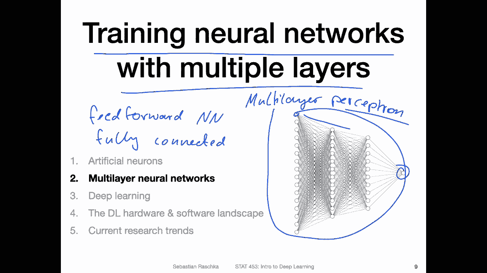
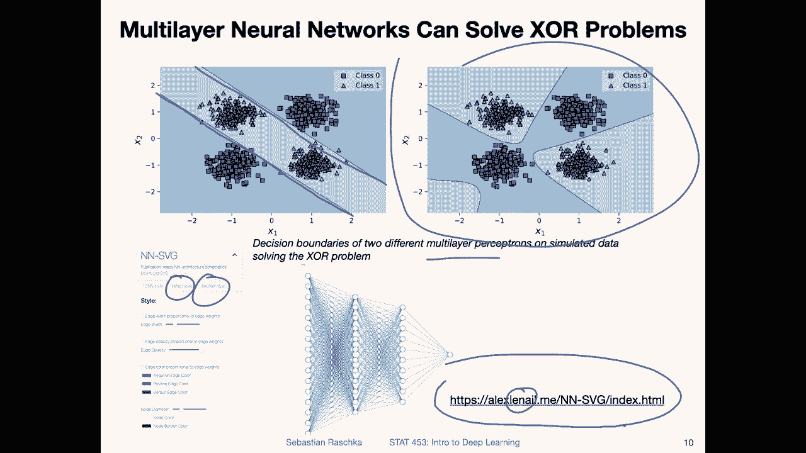
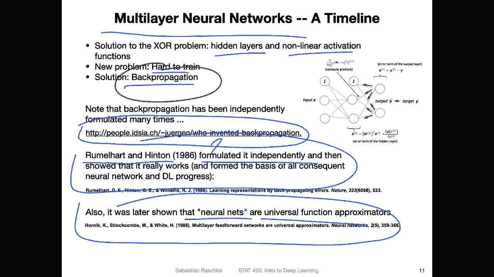
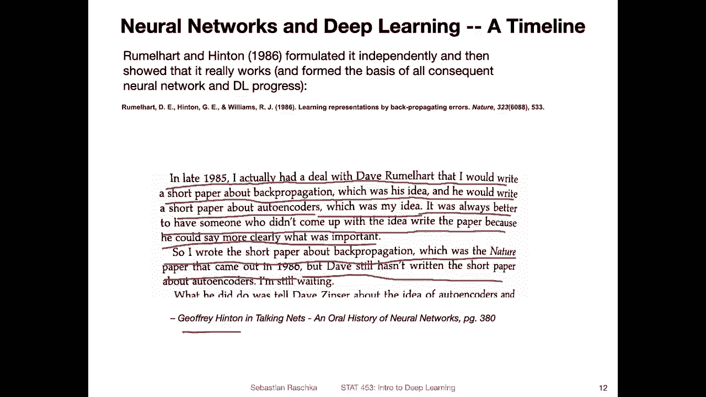
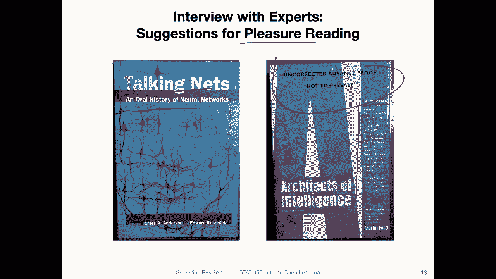
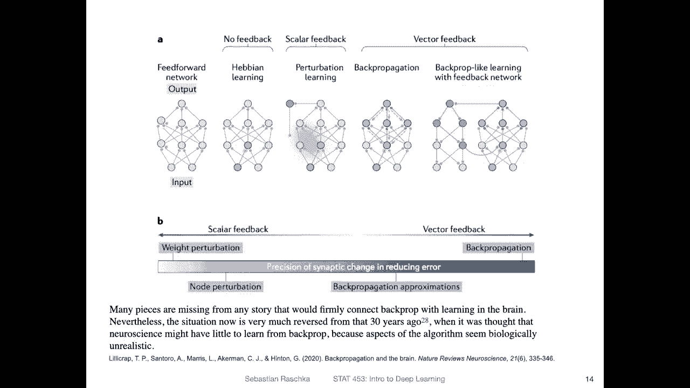
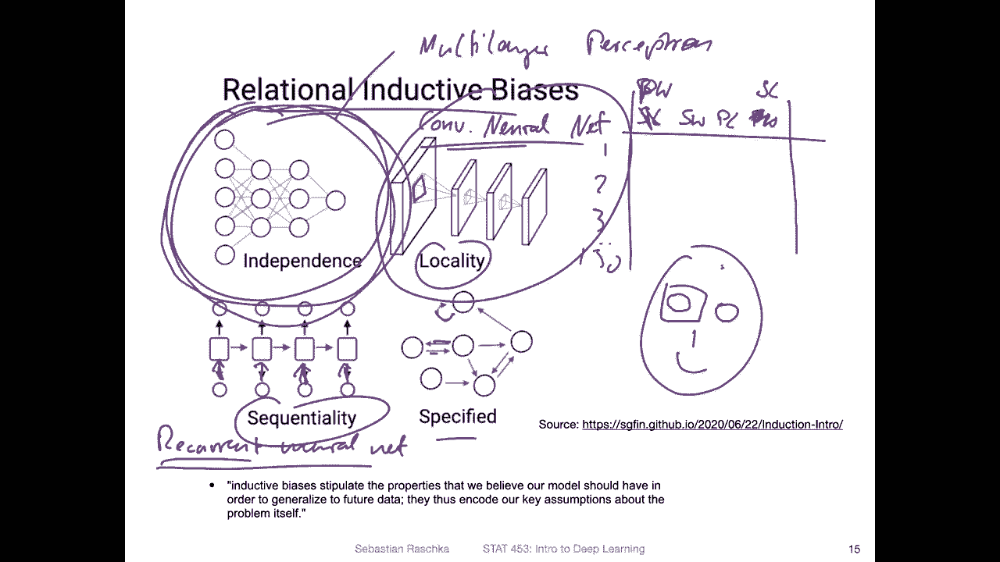
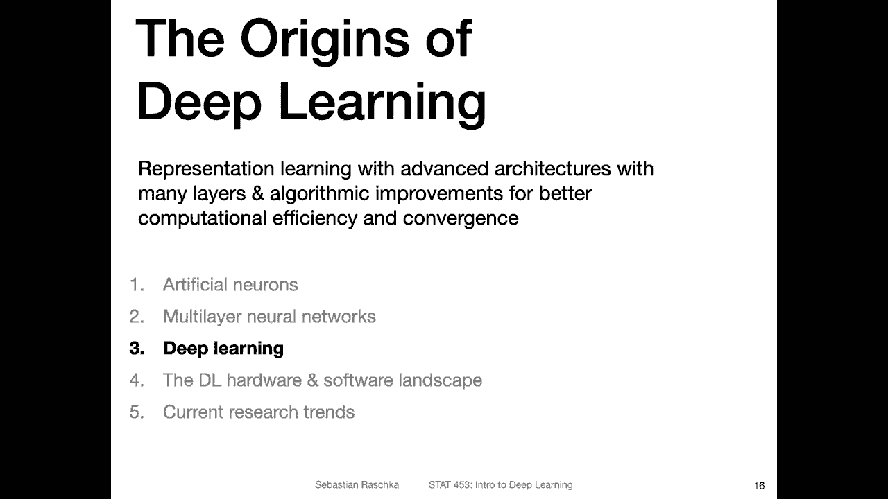

# P15：L2.2- 多层网络 - ShowMeAI - BV1ub4y127jj

Alright， let's now talk about training neural networks with multiple layers。

 So here on the right hand side， I'm showing you a so called multi layer。Perceptron。Which is。

Sometimes also called or it's feet forward。Neer network。 And it is also a fully。

Connected in neural network。 So there are two properties here describing that the data data flow is like forward。

Only one direction。 And then it's also fully connected。

 That means that each unit here is fully connected。

To another unit and also notice the word perceptron。

 although this type of network is not that closely related to the perceptron because there is another thing going on here。

 It's not shown in this figure， but we have nonlinear activation functions and what that means we will cover this in way more detail in a future lecture So no need to memorize that here。

But yeah， so what this architecture allows us to do is now to solve the XO problem。

 So the reasons why this can solve the XO problem， even though there's only one output note here is that it has multiple layers and also that it has nonlinear activation functions。

 So these two aspects make it able to solve the XO problem。

 So here Ive generated some toy data and I applied a real multilayer perceptron for this data and I trained two multilay perceptrons with a slightly different numbers of hidden units and you can see in both ways on the neural network came up with solutions for this XO problem。

 So on the left hand side it learned solving the XO problem by just having these。

2 parallel binary boundaries。 I found this very interesting， to be honest。 So yeah。

 it looks very organized and very efficient。 Another way the network could solve the X O problem was here was shown here on the right hand side。

 So yeah I just changed the number of hidden units a little bit。

 And you can see the solution is quite different。 And， of course。

 there are infinitely many solutions to this problem using yeah， multi layerer new network。

So we will again talk about this in way more detail later on。

 but if you are interested also later in this course。

 if you are interested in drawing neural network architecture figures， for example。

 for your report or proposal and so forth， here is actually a very nice tool by Alex Liil， I think。

Actually， I don't know if this is the last name or if it's related to AI or something。

 So I think the first name of this person is Alex。 The last name I don't know。

 but this is a very nice tool that lets you quickly draw yeah simple drawings of neural networks。

 they also have。Drawings for the Lineette style and Alex Alexnet style networks。

 which are convolutional in networks， which will be covered also later in this course。

Yeah， moving on。 So a little bit more about the multi layer neural networks。

 So they have now the solution to our X problem with the hidden layers and the non nonlinear activation functions。

 However， there was a new problem when this network architecture was proposed and the problem was。

That it was hard to train。 So initially there was no yeah training algorithm for that。

 So one solution that was proposed at some point was back propagations。

 It has been proposed several independent times。 So there is actually an article by Yo Schmtubba who wrote about who invented it first。

 So there are different resources or literature。Sitted here， which you may find interesting。

 So it's a yeah blog post listing all the different ways or inventors of back propagation or things related to back propagation。

The paper that made it really popular， though， in that showed that it actually works for training multilay perceptrons was by Ruelhart and Hinton in 1986。

 So this was an independent formulation。 So they formulated it independently。 So by that。

 I mean they were not aware of the previous literature so。

And this was also the paper then that yeah made made this really popular where because they really showed that this actually works in practice。

And also later， it was shown that neural nets such as the multilay preor here with one hidden layer。

 if it's abitrarily large， is able to approximate arbitrary function so it can approximate any arbitrary function with certain precision if the hidden layer has a relatively a very large size。

But of course， that the ability to approximate an arbitrary function doesn't mean it's easy to do that。

 So it's still hard to train a network in certain cases So there are other architectures。

 we will learn about them later。 which are suited for or better suited for certain types of problems。

 But again， this was like a big breakthrough because now there is this algorithm for training multilayer neural networks very efficiently。

 and yeah spoiler。 So this algorithm is also still used in common architectures。

 It's still our most yeah efficient and most popular algorithm for training neural networks。

 So it has stood the test of time so far。

Yeah， and here's a little fun fact about the backproagation algorithm by Ruelhard and Hinton。

 So I read this in an interview book where Jofininton talked about how they came up with it。

 So he said in late 1985 I actually had a deal with Dave Ruelhar that I would write a short paper about back propagation。

 which was his idea。 and he would write a short paper about autoens， which was my idea。

 It was always better to have someone who didn't come up with the idea。

 write the paper because he could say more clearly what was important。

 So I wrote a short paper about back propagation， which was the nature paper that came out in 1986。

 So Dave still hasn't written a short paper about autoens。 I'm still waiting。

So this was from a book the Talking Nets。 It's a little bit old。

 but it's still yeah interesting if you' are interested。

 It's like an interview book like outlining the oral history of neural networks。

 by interviews with people who worked on neural networks in the last century and then there was also another interesting book architects of intelligence。

 It's more recent from I think it's from 2018 which I read last year。

 it was also very entertaining it's like a lot of interviews also with Jofin and many other people famous deep learning researchers。

 So it was another enjoyable read So if you're interested for pleasure reading this is actually a particular fun book because also they ask everyone to give a prediction when AI can be invented and there's no clear consensus So some people say the artificial general intelligence that I talked about last lecture will never be invented something it's like a 100 years old and so forth so it was actually an interesting read。

like that。Okay。

Yeah， back propagation is not the only algorithm for parameterizing neural networks such as the multi layerer perceptron。

So there are other types of algorithms。 So here this is from a paper by Lily Cr， Sanenttorro。

 mirrors， Akaman and Hiton。Where they discussed back propagation and the brain basically discussing how similar the learning algorithm in a human brain could be to back propagation。

 Of course， yeah we don't know the answer yet we know that the brain is probably not using the back propagation that we are using in for training neural networks。

 however it may use something that is somewhat similar to back propagation。

 but yeah I want to go into a discussion about the neuroscience and how similar it is to how the human brain works。

 but yeah but I found interesting is here this a brief overview of the different types of learning algorithms that we could use for training in neural networks So for example they would be heavy in learning。

So say you are interested in this in this note here updating this connection here。

 heavy and learning does not involve feedback， so with feedback here it meant that if you do a prediction and then you look at the error。

 you usually update the network such that the error is minimized。But if there's no feedback， yeah。

 it's not really minimising the error。 What happens and have been learning is that the connection is strengthened。

 the more often it is used for making a prediction。 So it's not necessarily yeah。

 improving the error。 You can think of it。 maybe if you are playing。

Let's say if you're playing tennis and you make a wrong move。

 but no one teaches you that it is wrong and you make the move more often and more often and more often。

 So if you repeatedly repeatedly make the wrong move in tennis and no one teaches you that this is wrong。

 it will be harder to unlearn it later and it doesn't mean you become better at tennis。

 if you do a wrong move that is not hitting the ball over the go over the net， for example。

 So another。Type of learning is pertuubation learning。

 So you make a perturbation like you put up a weight and see if it's better or not， if it's better。

 then yeah you keep the weight。 Otherwise you discard it。 It's also not very efficient。

 This is actually very， very slow。Yeah， back propagation is actually very efficient and it's also very good for minimizing the errors。

 so there's another type of learning algorithm where it's similar to back propagation。

 but instead of doing back propagation like back propagating the errorss。

 it's involving a second network。But according to that paper also they admit that back propagation is sufficient。

 the most efficient algorithm for minimizing the error。

 although it may not be what the human brain uses， but in practice when we develop computers and predictive algorithms we care about yeah low error。

 good predictions and so forth， so that's why we are still using back propagation because we haven't found anything yet that works better than back propagation。

But this was we had just a short overview in this course， of course， when we talk about new networks。

 we will be focused on back propagation。Here was a nice figure I just saw this weekend from a paper discussing relational inductive biases and other types of biases。

 so I like this figure because it kind of outlines the different types of neural network architectures that are commonly used。

 So we have our multi layerer neural network or multi layerer。

Perceptron that I briefly talked about in this video。

And here we assume that the data columns are independent。

 So this would be a network that you can use with a tabular data set that we discussed in the previous week。

 So， for example， when you think back of your iris data where you have iris flowers。

Up to 1 of 50 Irish flows。 And then you had the Sepal length。

 Sepal width pital length and petal width， and then a class table， so。

This would be something as an input to the multilayer perceptron and it doesn't really matter in what order these columns are。

 I mean once you train the network of course then the order matters because it was trained on this table。

 but before training it doesn't matter whether let's say on the simple length is here。It could be。

 you can have actually a petol。With here and the S length here is there' is no difference。

 You could learn the same network if the columns are in a different order。

 So there is no assumption about dependence of these features。In contrast。

So called convolutional networks。 I will introduce them in the next video。Convolutionional neural。

 Let me abbreviate it， net's。They have one assumption that is locality。

 There's another assumption equivariance， which equivariance。 but focusing on the locality now。

 it's basically assuming there is some structure。 This is usually used for image analysis because you can think of it as neighbouring pixels are are being related to each other for example。

 So if you， if you have a image of a person。 So let's say two eyes nose interface。 so。

TheThese pixels are clearly related because they all include the eye， right。

 So shuffling these pixels， putting one pixel up here， for example， doesn't really make sense。

 So in that way， theres some locality assumption。 So here in terms of relational inductive basis。

 you can think of the assumption you make of the data when， when you use a certain architecture。

 Well there is something called。A recurrent。Neurural network。And this one assumes， for example。

 if these are that's like actually in a little bit maybe unfortunate。

 I'm not sure why these  errors are pointing down。Maybe be more clear if they would be pointing up as the inputs。

In any case， so this would be assumption where you assume the inputs are。Sequentialally related。

 So there's the order relationship， a sequential relationship。So。

Recurrent neural networks are thus useful for text where you have words in a certain order。

 It wouldn't make sense to shuffle words in a sentence because then a sentence wouldn't make sense anymore in the same way it doesn't make sense to shuffle pixel in an image。

 because then you lose the relationship between the images。

 multilayer doesn't have such an assumption。 So in that way。

 it is very powerful you can learn a lot of things I mean。

 just briefly mention that it can be regarded as a universal function approximator。 However。

 of course， it's also more challenging if you don't have any prior assumptions。 So in that way。

 leveraging these prior assumptions that such such as locality or sequentiality can actually make the learning easier。

 And that is also one of the key ideas behind deep learning in the next video talk about deep learning how deep learning evolved from simple multilayer networks。

Okay， lastly， there's a last architecture here。 It's called specified。 but， of course。

 this is not a particular neural network architecture This is here referring to the fact that someone hand codes things。

 how things are related。 And this is something。 yeah that I。

I don't think it's easily be implemented so you would have to hand code this which is very tedious。

 so something like that is currently not used in practice indeed deep learning。

 so usually we use recurrent neural networks and col networks for images and text and for tabular data we can use multilayer percepts。

Okay， so the next lecture I will briefly talk about deep learning。

 the origin of the of the name and some developments how deep learning evolved from multilayer networks。

