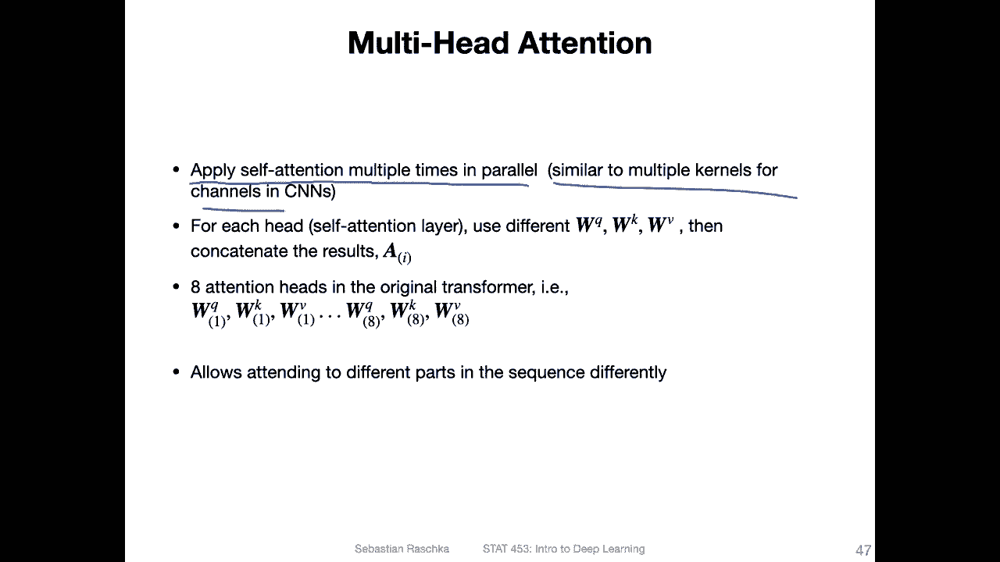

# P160：L19.4.3- 多头注意力 - ShowMeAI - BV1ub4y127jj

Yeah， now that we spend so much work on understanding this scaled do product attention mechanism in the previous video。

 let's rest on our laurels and just。Extend this multiple times。

 which we will call multi head attention。So it's also part of the transformer model。

 which we will eventually get to。 So for now let's focus on the multi head attention though。

 So in the previous video I showed you this where we computed this attention matrix。

And we can think of this as。1。Attention。Hat。And yeah， surprise， surprise。

 multi head attention is this thing here just multiple times using a different weight matrices。

So to summarize we are now going to apply self-atten multiple times in parallel。

 similar to how we use multiple kernels for the different channels in the CNnNs。

 So remember when we talked about CNNNs we had， for instance。

 input image with three color channels and we went from three channels to 64 channels for example。

 So for that we used 64 kernels in parallel these would be for example three by3 by three kernels when we had 64 of those So in that in a similar manner we can also use multiple of these processes here。

 these multiple attention heads， I'm not sure why it's called head。

 but let's just use the original terminology we can use multiple of these attention heads to compute。

Things in parallel and yet to attend different parts of the sequence differently。 So for each head。

 we use different weight matrices。 So we had three weight matrices for the query。

 the key and the value and we will use different ones now。

 and then we will concatenate those the results of those。 So it will be more clear in the next slide。

 I guess。So in the original attention is all unique paper， they had eight attention heads。So。

Essentially， they had8。Times 3 matrices。 So each attention had had a set of the query key and value matrix。

 and we had eight of those sets。And this allows the model to attend to different parts in the sequence differently for each hat。

It's similar to the concept behind color channels， essentially。

Or output channels。Okay， so。Again， so this is our scaled dot product attention that we talked about。

 That's essentially this。And here is the multi head attention。

 That's just a screenshot from the original paper。 and you can kind of guess what's going on here。

 So here in the center。Is this scared to product attention。 It's essentially this one。Summarized。

But you can see。This is just stacked， so you have a stacking here。So you repeat this eight times。

 whereas in the original paper， they add this eight times。So the linear。Corresponds。

 as my guess to the matrix multiplication。Between the weight matrices and the inputs。

Okay。Yeah， the input sequence is t times 512 dimensional， like we talked before。And。

In the transformer model that we will be talking about in the next video， they use。

512 for the input embedding size。And for the value size for， So when we have the weight matrix。

 sorry。DV， so we will have the dimensionality of that would be。D times。DV， where D。Yes。512， so。这事实。

T E divided by age。 That's the number of attention heads。Since this 64。And。

This is such that when you multiply it by the number of attention heads。

 you get the input and input embedding size back。And that is useful when you want to use something like skip connections and you have a skip connection is like。

 if you remember。Like this。 So we have a layer x plus x， the input。

 so you have to have the same dimension otherwise the addition doesn't work。Okay。

So the concatetuation here is， we have。Donan。The scaled dot product attention， if I go back。

Here， a scaled dot product attention is t times D dimensional。

Right， it's one scale to dot product attention。 So it's one。

One of these here is T times D dimensional。So one of these， essentially。Now we have each of them。

 right， so we。Repeat this age times， for instance， in the original paper eight times。

 and then we concatenate。 So what we will get is。This year， eight times， so we will get。Or H times。

 So we'll get DV times H。 And if Dv is 64， we will get。512 dimensional。And put back here。So， again。

 one。One attention head is T times TV。We concatenate and get this T times 512 here in this concatetnation step。

So that's essentially what's going on in the。And the multi head attention。

 we repeat this multiple times， this scale do product attention each time with different weight matrices。

 and then we concatennate the results。

Few more things。 So there's another matrix involved here。 So you can see there's this linear matrix。

 So this linear matrix。It's just to provide more parameters for learning， for instance。

 so we have the concatenation and this matrix is Dv times h dimensional and then we have an output dimension and the output dimension is equal to the rows and the columns is the same number so it's a quadratic matrix。

 so the output would be also 5 12 here。

Okay and this is it for multihead attention， pretty simple concept it's essentially just applying the scaled dot product attention mechanism multiple times in parallel。

 concatetnating the results， putting it through another fully connected layer and yeah that's it so and now we have talked about all these concepts but we haven't learned yet how they fit together into a model and this is the transformer model which will be the topic of the next video。

