# P161：L19.5.1- Transformer 架构 - ShowMeAI - BV1ub4y127jj

Yes， so in the previous three videos we laid the groundwork for understanding how the transformer model in the attention is all you paper works。

 so we started with a basic form of selfatten for introductory purposes and then we discussed the scaled dot product attention found in the attention is all you need paper and then we talked about multi head attention that is running multiple of these scale dot product attentions in parallel and these are all components of the transformer model of the original。

哦。Vanilla。Transformer model。

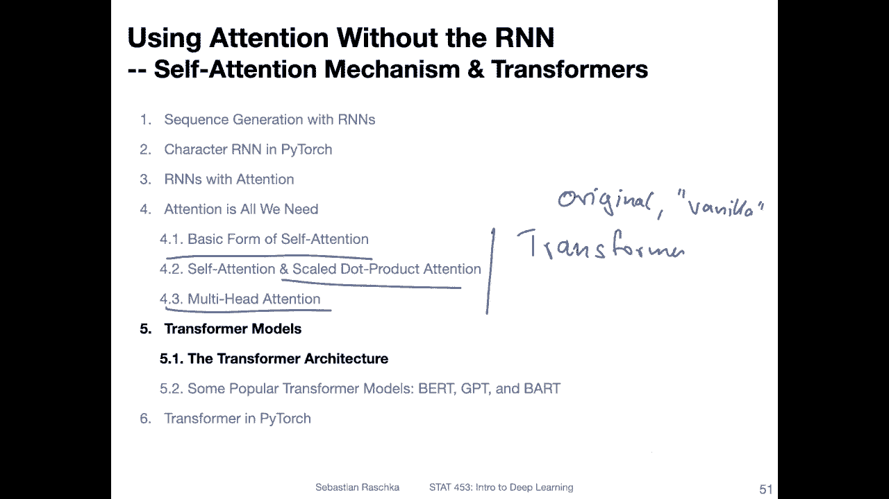

Wwhich is found in the attention is all unique paper and in this video we will go over yeah。

 the architecture a little bit in more detail how the architecture of the transformer looks like。

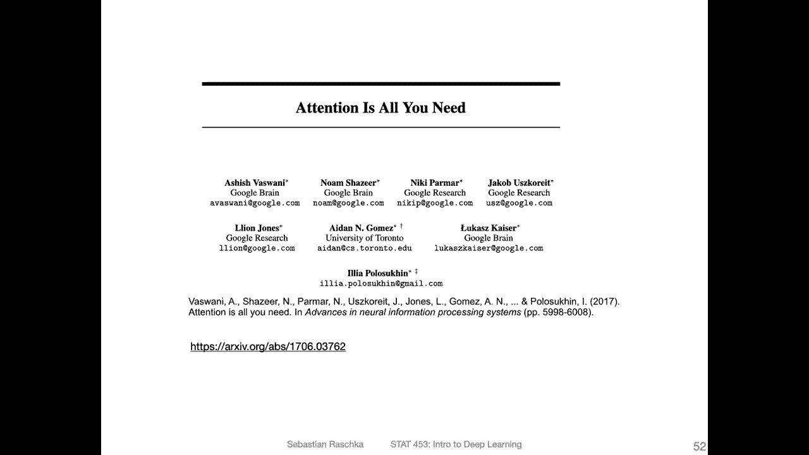

But before we get to the transformer， let me just briefly recap the scaled dot product attention because it's part of the transformer and so that we have it fresh in our memory and the second reason is because I spend so much time making this slide I would at least like to talk about it for a little bit so it was not all for nothing。

 Allright， so on the left hand side here that is just the summary of the scaled dot product attention from the original attention is all you need paper。

I structured it into five steps here so that we can talk about step by step so step one is constructing the queries。

 the keys and the values， so imagine you have an input X which the rows the different words so let's say the first row is word1 and the second row is word 2 of course in real data case you have many more words but so that I can fit everything under the slide we keep the example here small and then the columns is the the embedding size here。

The word emittdding size。We multiply it by a matrix WQ that is a matrix that is updated during big propagation。

 and this produces the queries。So still， the first row corresponds to word 1 and the second row corresponds to word 2。

 We repeat this whole process to get the keys and the values。 And in the original paper。

 the dimensionality here of these。It's all the same。Yeah。

 the only difference also here between computing the queries。

 the keys and the values is that we are using different weight matrices。

But we are using the same inputs， of course。Alright， so we have now the queries。

 the keys and the values。 And then in step 2， we do the matrix multiplication between the queries and the keys。

 So that is down here。 So if we consider the first word， we multiply it。

AndWe compute the dot product with the first word here。

 because the first column here is also the first word because we have the transpose。

So this one would be then really the relationship between the first word with itself。And then。

 for instance， first row and a second column would be the relationship between the first word and the second word and so forth。

So we can really think of this as something that kept just the yeah relationships between the words if you think of the dot product as a similarity or a compatibility measure here。

And then in step 3， we are scaling， so we are scaling by。Square root of decay。

 So decay is the size of the keys here。That is to prevent， yeah， the softm from。Yeah。

 being too sharp because if we have large dot products or very negative dot products。

 very positive of every negative ones， then we will be at the end of the softm having values close to 1 and close to 0。

 which does result in small gradients。 It's not so good for training。Step 4。

 we then't actually apply the soft mix。So I'm just calling softm in that to normalize。

And then in the last step， step 5， we multiply our relationships here with the values。

So then what we will end up with as for the first here。

 that's like the the relationships of the first word。Corresponding to the whole context。

 So still the first was still corresponding to the first word。

 but now it contains information of all the other words。This you can think of as aing。

 We are waitinging it with the other words， for instance， if we consider。This when it's。

Make this cleaner here。 So if we consider the first row。And this one， like I said。

 kept just the relationship between。Word 1 and word 2。

 So this is word 1 and word word 1 and word 1 and word 2。 So it's all the relationships for word 1。

And then here， the first elements of word 1 and2。And this kept just then。

Word one essentially with the relationships with word one and 2。So that makes sense。

 And then we continue。 so we do that for all the other positions here。And and with this here。

 So it's essentially incorporating information about the other word， about word1， but also word 2。

 If we had a longer sentence， it would be a little bit more interesting because then we would have。

Yeah， a larger context here。 but essentially， yeah。

 it's about incorporating the context for each word， the context of the sentence。

so that's the idea between the scaled dot product attention。

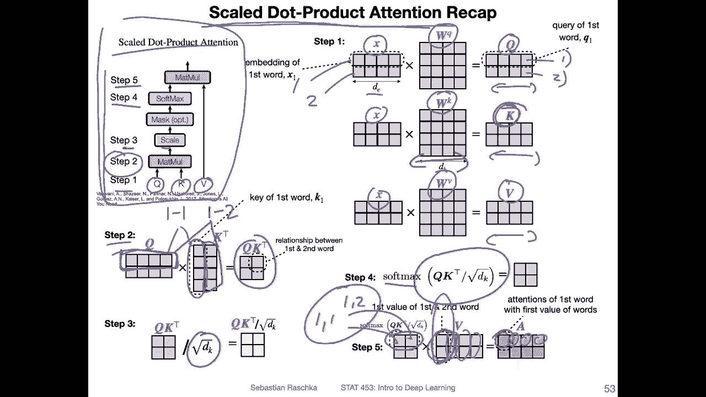

So then we had multi head attention， so what is multi head attention again multi head attention is repeating this whole process in parallel。

 So this is again from the original paper， so we are now repeating this age times and then concatenate the results。

And then apply a fully connected layer。So here I try to visualize that by having three matrices instead of one。

 so we get three queries and so forth。 and that's of course， also true for the keys and the values。

And you can think of them as different slices or different layers， and you can compute all of these。

Each month in in parallel。Then you concatenate them。 So you get these A's。 If I go back one night。

 So you get。H times this a。 And then you concatenate those。And then you multiply it by。

Oh weight matrix。 And this is the。

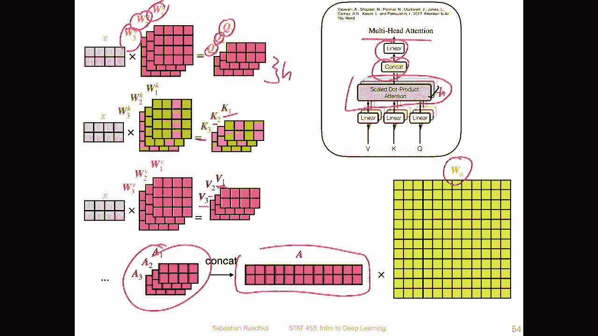

The fully connected part here。Yeah， so here it is here that's the transformer architecture。

 And yeah I know it looks pretty complicated at first glance。 there are lots of little details。

 but we will be able to understand it by tackling it one thing at a time。

 So I made a couple of slides where I will explain all these little details going on here。

So in this slide， let's start with a big picture so we can see。

The big picture is that we have two parts， an encoder。And decoder here。And。The encoder receives。

Input words so that could be a sentence。 It will reproduce。

 well will yeah representation of that that is then passed。To the decoder。Together with。Outputs。

 shifted outputs。 I will get back to that later in a later slide。

But the big goal here is that it will produce the output probabilities for the words to be generated。

 So it's generating a sentence and you can think of it as， let's say， translating a sentence。

 It reads an input sentence， and then it translates the sentence by generating one word at a time。

And there are some familiar parts to it。 So first of all。

 notice we have the multi head attention here。 That is what we have talked about in the previous slide so much。

 So that's the multi head attention from the previous slide that we talked about。

 It also appears here。And here there's actually a masked version。

 we will talk about the masked version also in a separate slide。

Other things you might notice here is also， yeah that we have。Skip connections。

 So these skip connections are essentially the residual connections that we talked about in the residual network in the CNN N lectures。

 similar concept where we add the input to the output of。Something that went through a layer， right。

 so what we are doing here。Is we are， let's say taking this one， this input here。

 and we are adding it at this stage after the multi head attention layers。

We're doing the same thing here。 So here we are optionally skipping the feet forward network， so。

For instance， if this is not learning anything useful。

 then we will have just forwarded the input here。 So this skip connection is essentially adding it。

And this is also why。Here we have certain dimensions。 So originally， the input and bendning here is。

The sentence length T。Times。512。 So we have a input embedding size of 512 and the original paper。

 they define it as 512。 and what comes out of here of the multi attention is also a 512 dimensional yeah embedding that is so that we can then add those together。

 So that's why we have the same dimensions， same is true for here and here。

 So the multilayer perceptron。Layers here， the feet forward or multi layer preceptron layers。

 They also they are matrix， essentially W O， which is 500。12 is the number of columns。

So it's 512 times 512。What else Yeah， I think this is maybe it for this slide。

 so I don't want like I said， I don't want to talk too much about every detail in one particular slide because then it gets to cramped。

 maybe one more thing highlighting here， there are more residual connections also in the decoder。

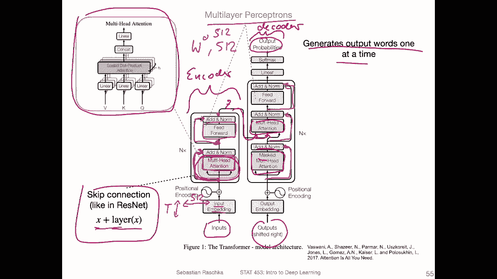

Speaking of which。 so the encoder and decoder parts are also repeated。

 So you can maybe see here in a small font。 There is this N X。

 So this just means that they are repeating the encoder blocks and decoder blocks a couple of times。

So， in fact， in the original paper， they repeat that six times。 so we have six encodes。

And six decoders。The structure of the encoders and the decoders is the same is just repeated。

 There is no weight sharing。 They are separate， so they are separate encoders。

 but they have exactly the same structure， and the same is true for the decoders。

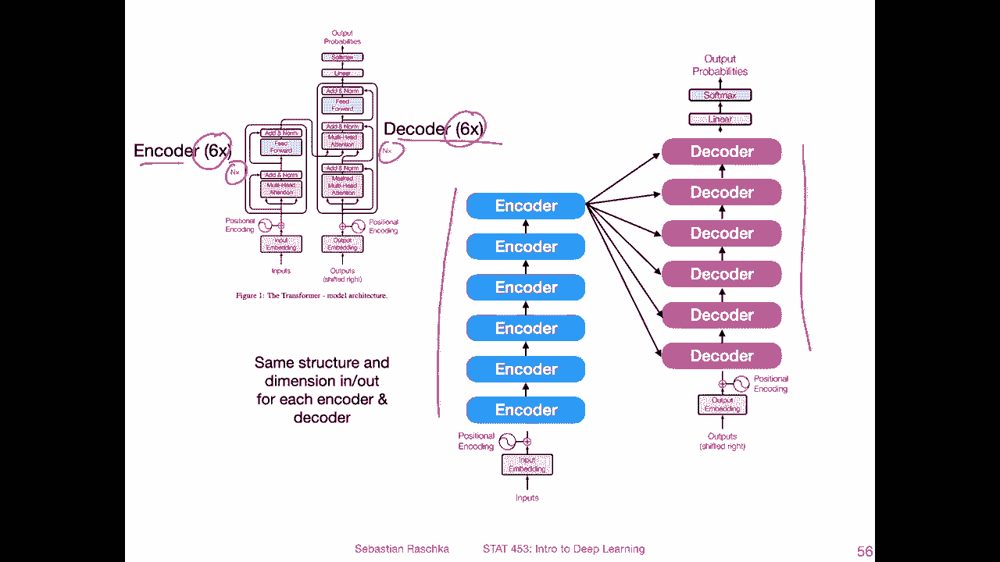

So next let's talk about masked multihead attention so what's that now do we need another video about masked multihead attention don't worry it's essentially the same concept as the multihead attention except we are masking some inputs in the sequence so essentially it's about masking subsequent sequence elements so here the decota is generating one word at a time。

And。Let's say we are having a sentence consisting of 10 words。 We are currently generating word 5。

 So we would be at this stage masking words 6，7，8，9 and 10 that are already present in the training dataset set。

 So if we have a training dataset， we have access to the full sequence。

 but we are masking those words that。That are not generated yet， essentially。

 So this will allow the model to attend to positions up to and including the current position and how this masking works is by。

Setting values as input to the softm to minus infinity so that when softmax processes them。

 there will be zeros，0 probabilities。 So this might look a little bit obscure。

 So I made another slide illustrating this masking one second。

 So let's consider we have the input sentence。 I like plans。

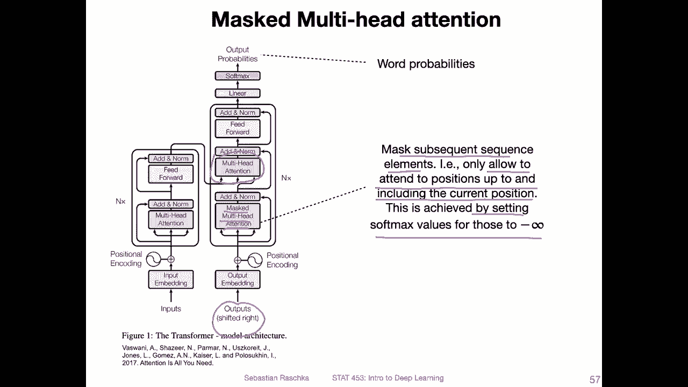

And we want to translate it into German。 So the correct German translation would be Ihma Flson。

And this is known during training。 When we're training this transform， we know the correct。

Transation。But yeah， when we are training it， we are training the model to produce one word at a time。

The input is provided as full。 it will produce an representation of that input。

But then let's say we have already generated the word eh。

And we are currently about to predict the word the second word， this is what we want to predict next。

We are giving the model the whole sequence here' as input。But。

It would be kind of cheating if we would show the model。These two words。

 because these have to be generated， we assume right now only the first word is generated。

So it would be cheating by just giving access to these words to the model here at this stage。

 So we are masking them。 So here that's what I try to illustrate。We are masking these words。

 so it doesn't have access to them yet。Once it has， let's say， generated these two words。

 we will unmask this work and only let mask the last word that it has to generate and so forth。Yeah。

 one more detail here。The output size。What we are predicting here。

 this is one computationally expensive step because the outputs here are the predicted probabilities for each word in the dictionary。

 So if you have a dictionary， if you think back of the R andN。

 the examples of the RN when we had the word RN for classification。

 I think we had a dictionary size of 20000。 So we have。20，000 probabilities for each word。

 and then we pick the word with the highest probability。And get the index for that。

 And then this is our predicted word at this given position。

So it's by the highest Somax probability in an autoregressive fashion which means essentially one word at a time and the output size here of this linear layer is the other word dictionary size like I mentioned which goes to the Somax for normalization and then we pick the largest one and then yeah the learning is by a cross entropy here。

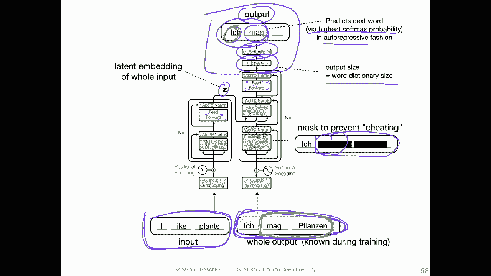

Alright， let's now talk about this positional encoding here so there is something that is added to the input embeddings。

So if we think about the scaled dot product， the self attention。

How it works is that we are essentially relating each word。

 the query to all the other words in a sentence that's a self-attention part。

 but there is no notion of where the word is located in that sentence。

 So it's kind of invariant towards where the word is in the sentence。

 we are relating it to all the other words， but it doesn't really matter。

 if it's the first word of the sentence， the last word and so forth， we could get the same values。

 it's kind of the same concept like with multilayer perceptrons。

 it's not really aware of the position in the sentence， right。

 So if we would shuffle like I talked about before in a previous lecture。

 if we would shuffle all the columns in the data set。

 We could technically still learn the same multilayer perceptron。

So here it's about making the model behave slightly differently if the word is in different positions of the sentence。

So here they have this notion of the synenooidal position encoding。

 which is added as a vector of small values to the word embedding vector so。

They are using a sine and cosine。Function here， and。They are like。

Ratherther than like somewhere like this。They are not totally overlapping。

 They are a little bit positions by one position to the right and so forth。 And essentially。

 it's about capturing。This， so。There will be essentially a vector depending on which position。

 So if we have different functions。Or values of sine and cosine。

 And then we have the different positions in the text。 Let's say 1，2，3， form。Sth and fourth。

Then we will be extracting this， which is a unique pattern for that position。 So， for instance。

 just for simplicity， we would have two values here。

 and these two values are different in position one compared to position。3， for example。

And we are just， yeah， using that as a simple way of providing some position information。

 This is just to， to kind of。You get different results depending on where in the sentence the word is located。

And it is all there is to it， essentially。Yeah， just as a reminder， also。

 the input size and the output size are the same。 This is so that we。Can repeat。

This six times and then also have the skip connections。

 I had should have edit this information maybe earlier， but that's also fine here。

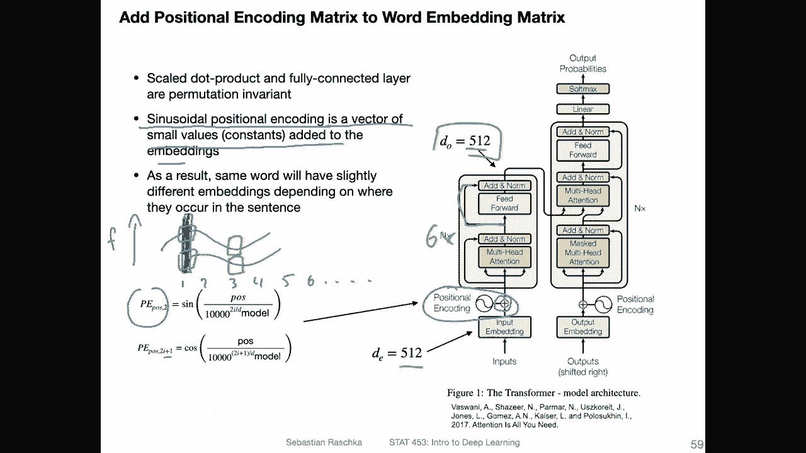

Okay， so next， let's talk about these addd and norm layers。

 So what are those we can find them here everywhere in the network。 And yeah， the ad。

Corresponds to the residual the skip connections that I yet just mentioned again on the previous slide。

 But what is now the norm part。 So the norm corresponds to layer normalization。

 we haven't talked about that yet。 So I wanted to actually talk about it in the convolutional neural network lectures。

 but they were already so long that I decided to skip that。

 But it is essentially related to batch normalization。

 Here's a visualization of the different common forms of normalization and convolutional networks。

 It's from a paper called group normalization。 So we are focusing now on。

 let's say batch normalization。And this is here shown in the context of convolutional networks。

 where as you remember， we are normalizing across the batch dimension so you can actually。

 so here they have that separate the height and width and the color channels。So， here。Essentially。

 you can think of H and W as the features。And the。For yeah one one channel。

 and then you have the different channels here。 and then N is the batch size。 And here。

 the blue part。This。How or where we get the， how we normalize here。

 we are normalizing across across N。 So we are getting。The mean。And sigma for the normalization。

From the batch dimension。In layer normalization here， we are getting it across。

The layer or channel dimension。So in this case， when you think of the multi head attention。

 we would do it across these attention heads essentially。So we have， like I mentioned before。

 multiple attention heads， right， I think it's eight in the original paper。

 So we have eight attention heads， so we would be normalizing across the attention heads。

 computing the mean and sigma。 and then the whole process is essentially similar to batch normalization。

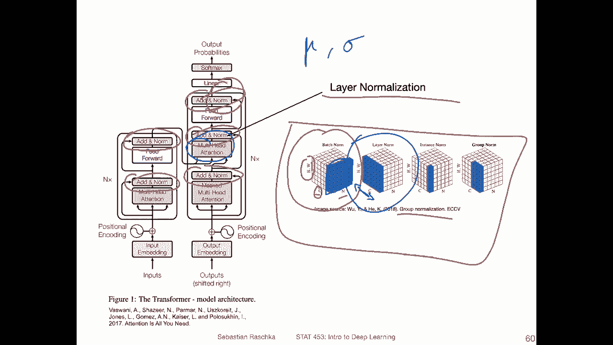

Lastly， and to finish things up， here's an example of how attention values look like from the original paper。

 So if you think of attention values as values between 0 and1， the attention mask。

 So if you think back of the Q K。SomeT。And then， normalized。So if you and then through the okay。

's through the softm。So if you think of these。We can look at the attention values for each word towards each other word right and this is what's shown here。

 So for instance， when you look at the word law， it's kind of strongly connected。

 So the saturation here of the calluse is how strongly it is connected so you can see it's mostly connected to these here it's the strongest connection。

 maybe this one has a slight connection also to things further away here。

 but very weak connection to the missing to the middle parts here。So yeah。

 this is just a visualization。 And here in this visualization， it's shown for attention head。

Let's see。five。And hit。6， and you can see that it's actually not redundant to have multiple attention heads。

 You can see this pattern here is very different， let's say， from this pattern so。

The attention head is actually having different attention heads is actually useful。

 so it's learning different things in these different attention heads。Okay。

 so this was probably a very long video now on how the transformer architecture looks like in the next video。

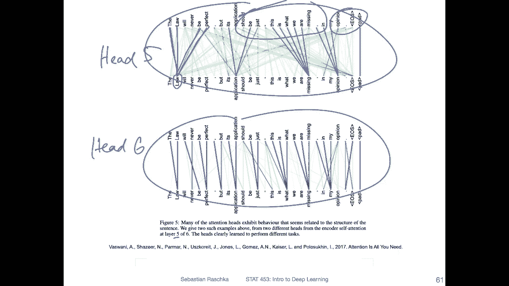

I will talk also about some other more modern transformer architectures on a epic big picture level。

 so there have been these， for instance， popular models like Bir， GT and Bd。

 Of course there are many， many， many more， but these are yeah one of the popular ones。

 the most popular ones。 I will briefly talk about those and then we will end this lecture with an implementation and Pytorch。

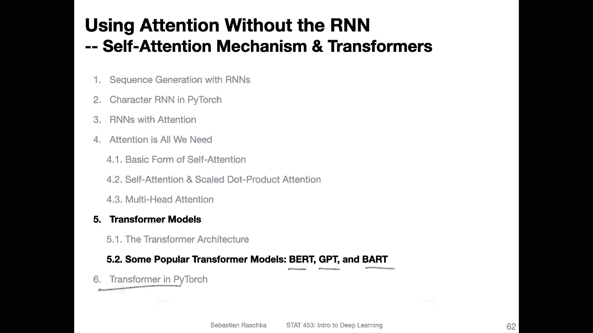