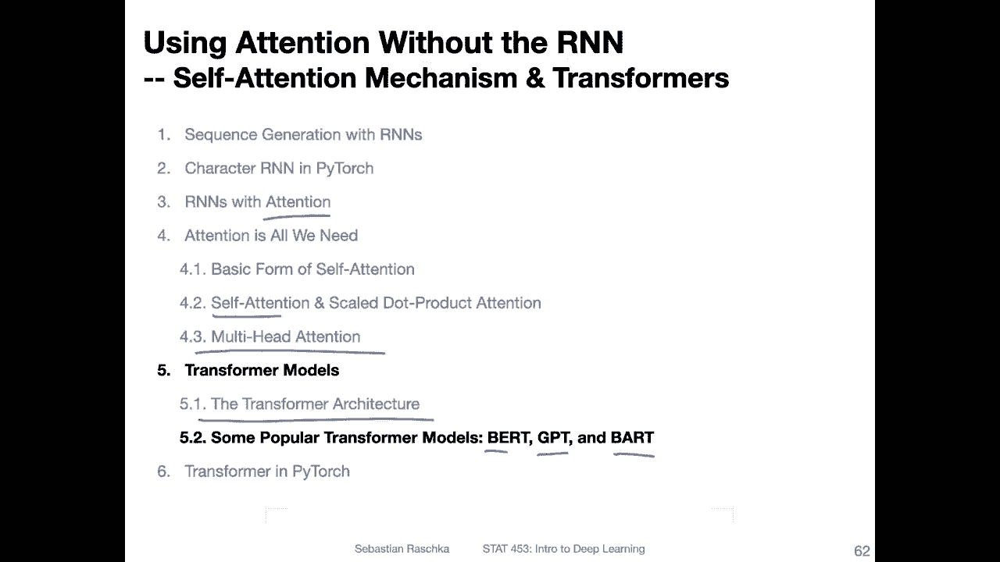
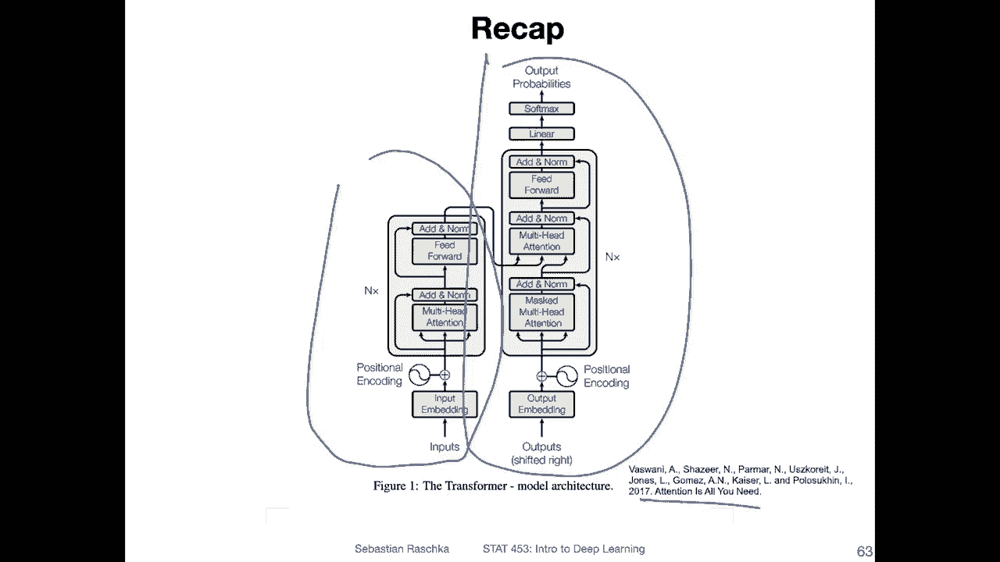
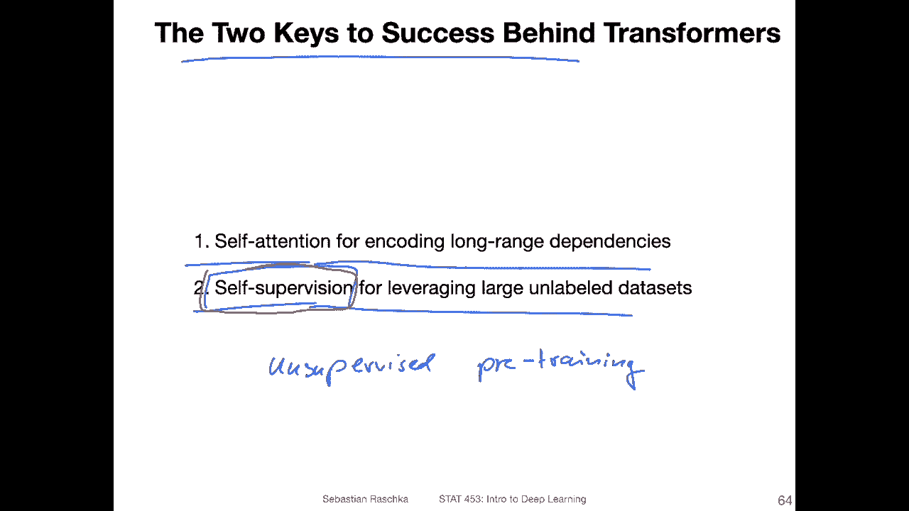
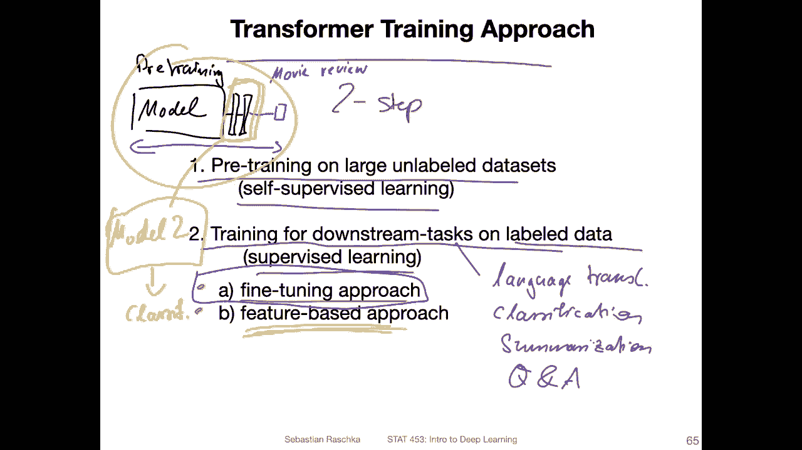
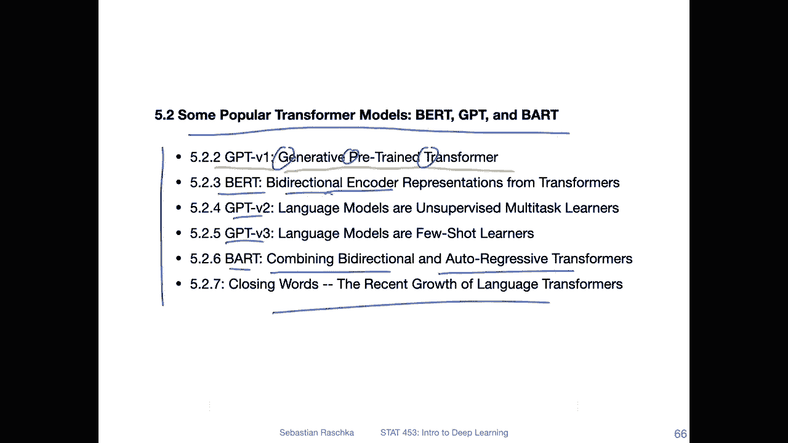

# 【双语字幕+资料下载】威斯康星 STAT453 ｜ 深度学习和生成模型导论(2021最新·完整版) - P162：L19.5.2.1- 一些流行的Transformer 模型：BERT、GPT 和 BART【概述】 - ShowMeAI - BV1ub4y127jj

Yeah， now that we learned about attention， self attention。

 multi head attention and how that fits together in the transformer architecture。

 let's now look at some of the popular methods based on this transformer architecture。 For example。

 there are the bird model， different types of bird models， And then also GT， G version 1。

2 and 3 and the bar model， which combines bird and G。

And all of these models have kind of interesting ideas。

 It's the models themselves are not very complicated。

 They are essentially small modifications of this transformer， But yeah。

 I think it might be interesting to talk about these because they are also very popular。

 If you look at the， yeah， news and things like that。 People like to talk about these models。

 And I think it's just interesting to。 Yeah， briefly go over them and how they are different from each other。

Yeah， just to briefly recap， this is the transformer architecture。

 The original one from the attention is all you need paper。 and these methods we will talk about。

 like B and G are based on this。 fundamental architecture。 Of course， they make some modifications。

 but fundamentally。Let's say Bt borrows from the encoder part and G borrows from the decor part。

 and we will then see in the upcoming videos how the these models relate to this model。

 but big picture wise。

I would say the two keys to success behind all these transfer models are still the self attention mechanism for encoding these long range dependencies or contexts。

And the other one is。Yeah， cell supervision for leveraging large， unlabeled data sets。

 So this is also often called on unsupervised。Pre training。

So originally it was called unsupervised pretraining。 Nowadays。

 the word selfsvision or self-servised learning has become more popular。

 and we talked about this a little bit in in previous lectures。

 it's essentially about taking a large unlabeled dataset and then constructing the label from that data from the structure of that data。

 instead of having someone labeling these yeah。A training instances manually。

 which is very expensive。So one task that we have seen before， for instance。

 in the transform model is。Yet， predicting the next word。 it's still。A supervised approach。

 because we are still using a classification loss for predicting the next word。 But yeah。

 in contrast to regular supervised learning， we。Extract this label from the text itself。

 It's essentially the next word。 We can extract it from the。Text itself。 This is why it's called。Yes。

 self supervised learning because it's， yeah， it's creating the label itself in a sense。 So it's。

 yeah， it's not the human who creates the label or some other process。

 It's essentially just from the structure of the data。

Soう。The training approach behind transformers can then also be separated into a tool。Step process。

 So the first step is。Pre training the model on a large unlabeled data set。

 the salable learning part。 And the second part is then。Training it on。

Label data sets on usually smaller label data sets for downstream tasks。

 So downstream tasks would be let a language。Translation， some form of。Classification。

Text summarization。Maybe question。With question answering， let's say call that Q And A。And so forth。

 So there are many possible downstream tasks that you can。

Use for a language model or have for a language model。 And for this。

 you would then have a smaller labeled dataset set for superviss learning。 For example。

 think of the movie review dataset that we used before。

 so pretrain could be pretraining the model on thousands of books that we have in a selfsvissed fashion。

 and then we can use our small movie review dataset which only consists of hundred000 reviews。

And then， yeah， train the model on that one。 It's kind of related to transfer learning。

 which we also talked about before。 So， and there are also two。

Main approaches to this training for downstream tasks，1 is。Fine tuning based。

Which is updating the whole model。 and one is the so called feature based approach。

So for the fine tuning one， think about it like this。 you are training， let's say you are model。

On the using sales sub based learning， the pre training。

So usually the model also has some fully connected layers and so forth at the end。

And this is your regular， let's say transform hall model。And then for the fine tuning。

 you have a classification task。 for instance， let's say you are movie。Review。Classification。

 So you add another classification layer to this， and then you train the model on this， yeah。

 supervised learning data set。 and you update the whole model。

 All the parameters are updated during training。 This would be the fine tuning based approach。

The feature based approach here is kind of related to that。

 but instead of fine tuning or updating the whole model， you essentially extract。This。

Ebeddings from the last layers could be the last layer， the last four layers and so forth。 I mean。

 there are different methods。 We will also take a look at that that was done or experimented with in the bird paper。

 but。The idea is that you use these embeddings and you assume these are now these context embeddings。

 which are better than， let's say， regular word embeddings because they contain the context of the sentence。

So you have these and then。You don't update the model。 you just generate that。

 let's say for the whole test set and then you train a new model that it could be a simple model。

 could be logistic regression in the bird paper they used even an LSTM for that。

 You train another model。 Let's called that model。Te。For the classification。For example。

 for the movie review classification， but here you don't， you don't update the pretrain model。

 you just take these embeddings as fixed embeddings and then just use them as feature inputs to a new model。

 So that's the feature based approach。We will talk more about this when we talk about the bird model though。

 so this is just the overview。

So in the next upcoming videos， I will talk about these different types of models。 Originally。

 I wanted to cover everything in one video， but then I realized it's a little bit too much material。

 but yeah， of course this is optional material you don't have to watch this。 It's up to you。

 but the topics I will cover in the upcoming videos are the original G。Model。

 it's called generative pretrain transformer。 That's why the name GT， like GT。

Then we will talk about BRT， it's a bidirectional encoder。Here。

 and then we will talk about GT version 2 and version 3。 So the G models are unidirectional。

 It's the next word prediction and bird is bidirectional。It's the main difference。

 And then the bard model is combining both the bidirectional aspects from B with the unidirectional autoregressive behavior of the GT model。

And then I will say a few more things about transformers and the landscape computational efficiency and so forth。

 and then after that we will take a look outside the code example。

 but yeah the upcoming videos regarding the popular transform models， B GT bard。

 we will have six videos ahead where I will discuss them a little bit。

