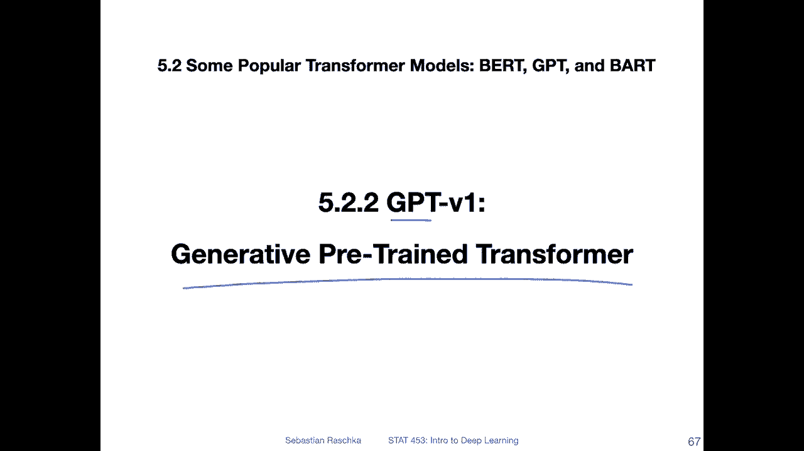
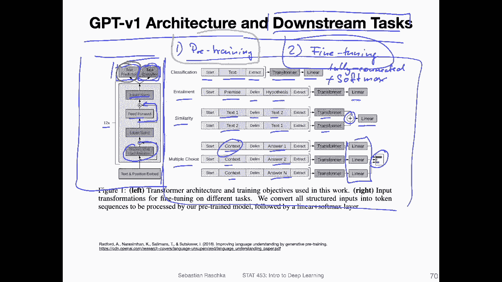
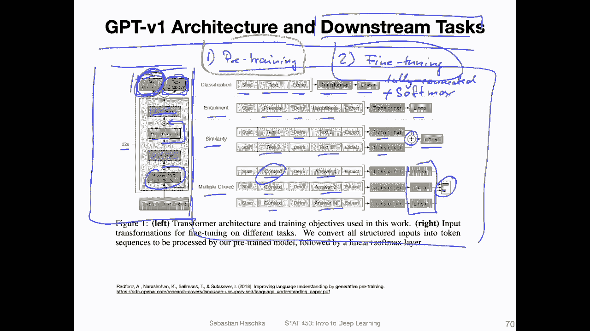
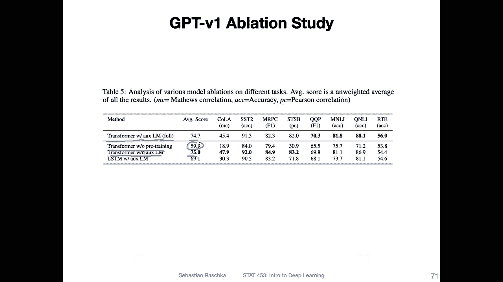
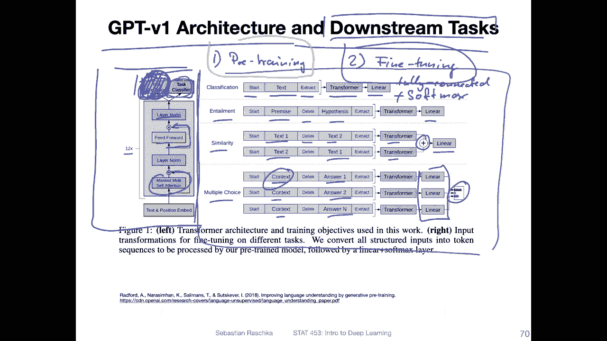
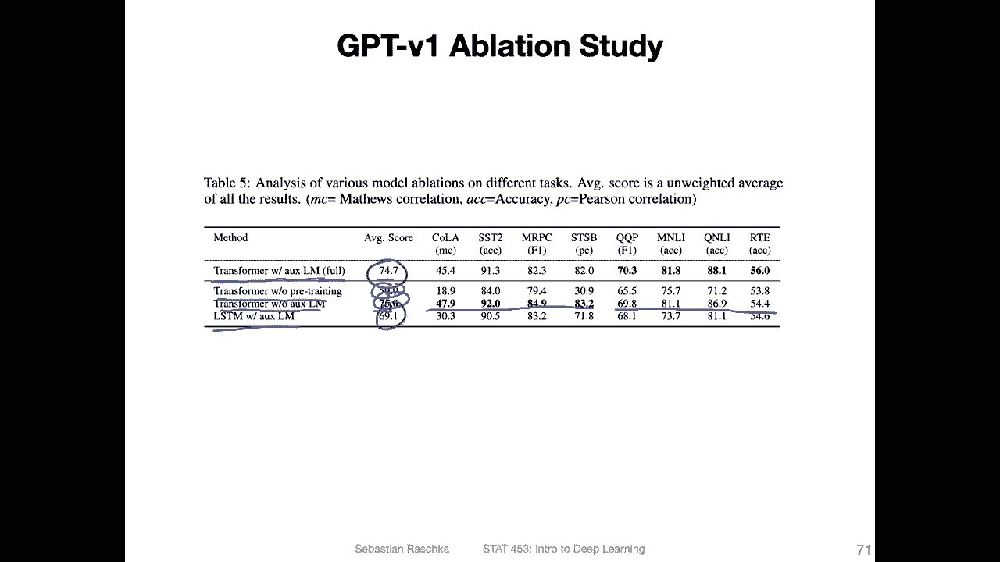

# 【双语字幕+资料下载】威斯康星 STAT453 ｜ 深度学习和生成模型导论(2021最新·完整版) - P163：L19.5.2.2- GPT-v1：成式预训练transformer - ShowMeAI - BV1ub4y127jj

Alright， let's begin our Transer model series with the generative pretrain transformer model。

 also known as G。

So there are multiple GPT models all developed at Open AI。

 and what they have in common is that they are all unidirectional。

 so they are mainly trained to predict the next word in the sentence。

And there are three versions up to the point when I'm recording this。

 so there was the original GBT version 1， which came out in 2018。

Tad 110 million parametersmeter that is G version2 with 1。

5 billion parametersmeter more than 10 times larger。

And that came out in 2019 and then G3 with 175 billion parameters in 2020。So in this video。

 we will focus on GT version 1， and I will have separate videos on version 2 and version 3。

So one of the main ideas behind the GPT model is what they hypothesize is that the lack of labeled data is one of the main bottlenecks behind scaling up the performance of large language models。

So， they。Proposed the two step training process in this paper。

 they refer to it as semi supervised learning in general。

 semi supervised learning essentially means leveraging labeled and unlabeled data。

So here this semiservised process is this two step process that I briefly outlined in the previous video where the first step is the pretraining and the second step is the fine tuning so here they refer to it as generative pretraining this is when they use a large unlabeled data set。

For pre training， the transformer model。 So nowadays。

 that's also called yes self supervised learning。And then in the second。

 in a discriminative fine tuning step， they use a smaller label data specific to the task that you might be interested in。

 for instance， let's say movie review classification and this is then supervised learning using the pretrained model。

 it's essentially a form of transfer learning。So the pre training itself。

 so the step one happened on a dataset that they collected， they call it the book corpus data。

 which consists of 7000 unpublished books。And the architecture they used is based on the decoder architecture of the original transformer model that we talked about。

 the one that was proposed in the attention is all you paper。

Yeah here's the visualization of the GT architecture and the different downstream tasks for fine tuning。

 so let's start with the architecture first so here on the left hand side。

And you can see this just looks like the transformer and the attention is all you need paper。

 the original transformer。 So you have also the skip connections here。

 you have the layer nom in between a feet forward layer。

 you have the masked multi head self attention layers and so forth。

 So in that way it's just the decoder from the original transformer paper。

Except that they have here 12 transformer blocks instead of the six transformer blocks they had and the attention is all you need paper。

そう。Another thing here is that you can see there are two boxes here as the output。

One is called text prediction and one is the task classifier。 So again， first。

 there is a pre training happening with the next word prediction。And then， after the pre training。

You have the fine tuning。On the different downstream tasks。 So one task you are interested in。So。

 and you can。 so first of all， this box， I think， should symbolize this pre training task。

 which is the next word prediction。Yeah， they call it text prediction。 and the。Task classifier。

 I think， should symbolize the downstream task for fine tuning。However。During fine tuning。

 so after the pre training has completed， you can keep the text prediction and train both at the same time。

 so you can have a loss for training to predict the next word while you are also updating the model for the task predictions。

 So we have two different linear layers here， One is。

For the next word prediction and one is for the task prediction。

 And they experimented whether this is good or bad。

 And I will show you the results in the next slide， like， whether for fine tuning。

 they should keep this or not。 So right now， though， let's just focus on the different tasks。

 So let's assume we have completed the pretraining for the next word prediction。

 And now we have fine tuning for the different tasks。 So on the right hand side。

This here are visualizations for the different tasks they looked at and how the input has to be formatted。

 So， for instance， for classification。They provide a start token。

 the main text and an extraction token。 It's like an end token， almost。

And the end of sequence token essentially， and then they put this through the transformer。

And have a additional linear layer and output layer。So it would be fully。Connected layer fall。

Clasification， you could then use Somax。Actation is the last activation。

 And then use across entropis for training that is's just like a classifier， essentially。

And then they have another task called entailment， I think that's like implication， like in math。

 implication， my goodological statement。So you have a premise delimminator and。Hypothesis。

I think it's also essentially a classification， like a true false。嗯。Another one is similarity here。

 So comparing whether two texts are similar or not or how similar they are measuring the similararity。

So here they provide text one。The separator and takes two。

And then also maybe to keep things symmetric， text2， followed by text 1。

They put both through the same transformer and up the embeddings。

 then put that through a fully connected layer， and my guess is they then have something like maybe a L2 distance or something that they minimize between similar texts and maximize between different texts。

And then there's also one multiple choice class task where they have the context with a possible answer。

 again context with another answer and the context with a different answer。

 so we have n answers and possible answers， and it's essentially also a classification task。

So then these different embeddings， and then you have a classifier choosing the one that is most likely the answer for that context。

Alright， so again， but the main idea here is that you have two steps， one is the pre training。

 you train that on the next work prediction， and then you have the fine tuning where you fine tune on these downstream tasks。

And here they did an Appation study looking at whether the performance is better or worse if you remove the next word prediction when you do the fine tuning。

So。Here they call that the transformer with the auxiliary language model。 So that's the full model。

 So the auxiliary language model is essentially this text prediction here。

And get yeah， pretty， let's say， a pretty good performance and which score of 74。

7 that they computed here。And then。The transformer without pre training。

 So just doing the fine tuning without pre training。

 And you can see that the transformer model without。

The pre training is significantly or substantially worse， right， So the pre training really helps。

Then they have a transformer without the auxiliary language model can see it's even a little bit better。

So， if you， essentially。If you pretrain the model。On the next word prediction and then get rid of this。

For the fine tuning and then just focus on the fine tuning can see it is even a little bit better。

 but not on all tasks。 So it's better on some tasks， but not on others。

And then just for comparison， they had a regular LSTM。You can also see that SM here。It's worse than。

对。Fu model。Okay， so this is G version 1 by today's standards。

 this is already a very old model because that's already a GP version 2 and 3。

But it's a good model to start with and in the next video before we cover the other GPPT models。

 let's discuss the birdRT model which has a slightly different approach to using a transformer I'm covering this one before covering the other GPPT versions because in the bird paper they specifically compare their model to GT1 So it's in a way it's the coronological order we have GT version1 bird GPT version 2 and 3 like in aron coronological order Okay so the next video will be then on the bird model。

