# 【双语字幕+资料下载】威斯康星 STAT453 ｜ 深度学习和生成模型导论(2021最新·完整版) - P164：L19.5.2.3- BERT- 来自transformer的双向编码器表示 - ShowMeAI - BV1ub4y127jj

Yeah， so in the previous video we discussed G version 1。

 which was a unidirectional transformer model where the pretrain task was the next word prediction。

 so it was processing the inputs in a left word fashion like from left to right and Bt is transformer that is a bidirectional one。

 so B stands for bidirectional encoder representations from transformers。

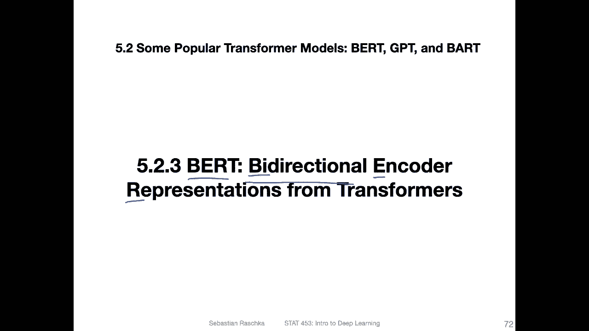

So BRT was developed around 2018 by Google research and like I said before the main concept is this bidirectional nature。

 so the bidirectional pretraining using masking that is not going from left to right。

 but it's just randomly masking it's essentially a very simple concept I will have a slide on that illustrating how that works So the main architecture is essentially identical to the original Transer and GP so both both based on the original transformer paper with a multihead attention and so forth except。

Now that they have the spy direction。

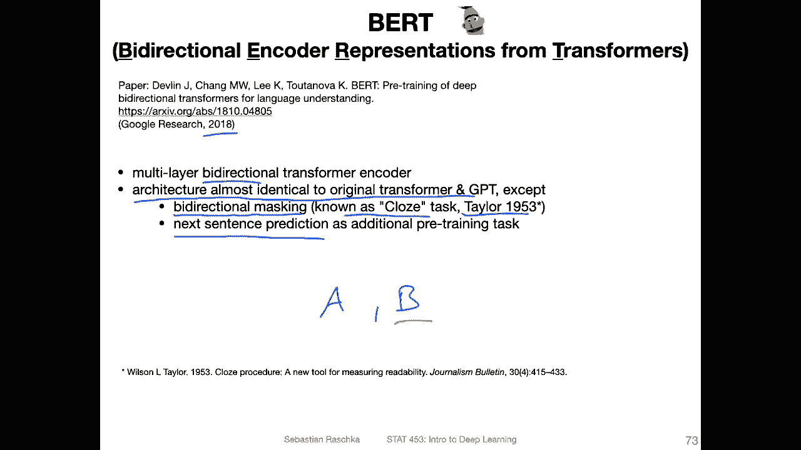

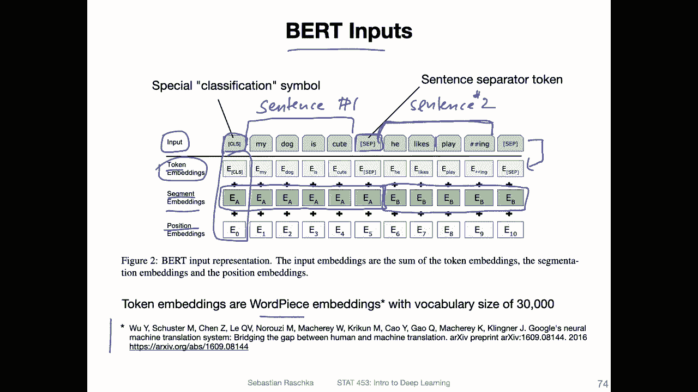

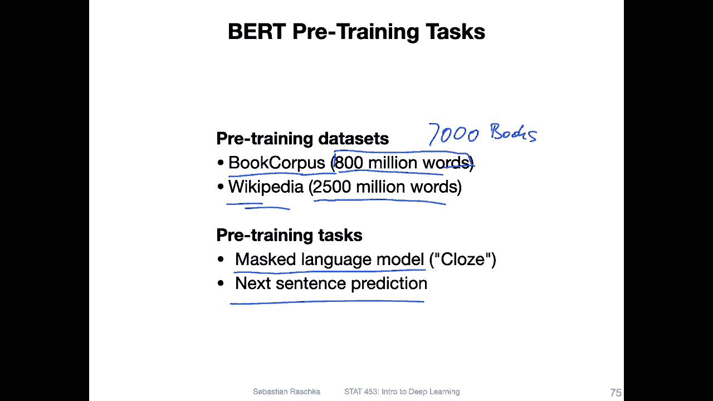

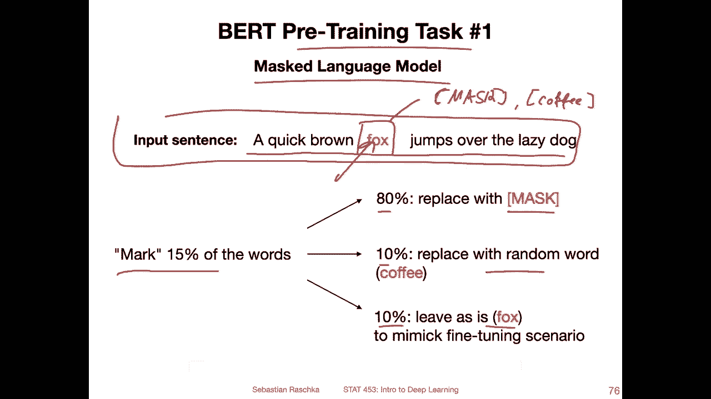

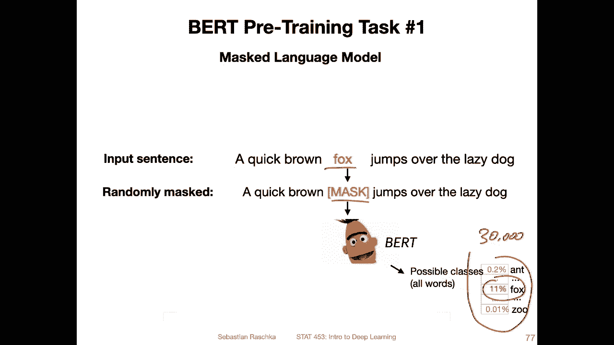

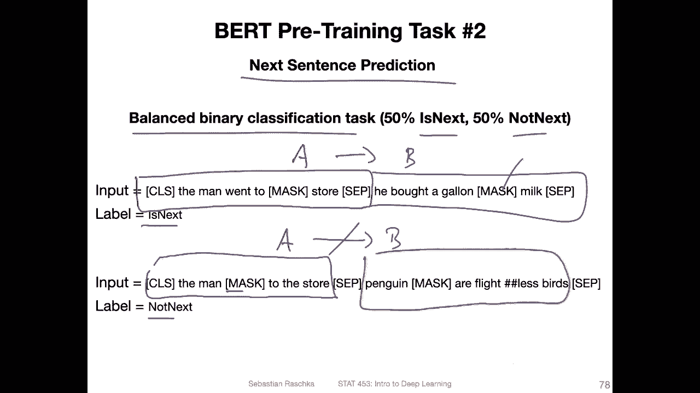

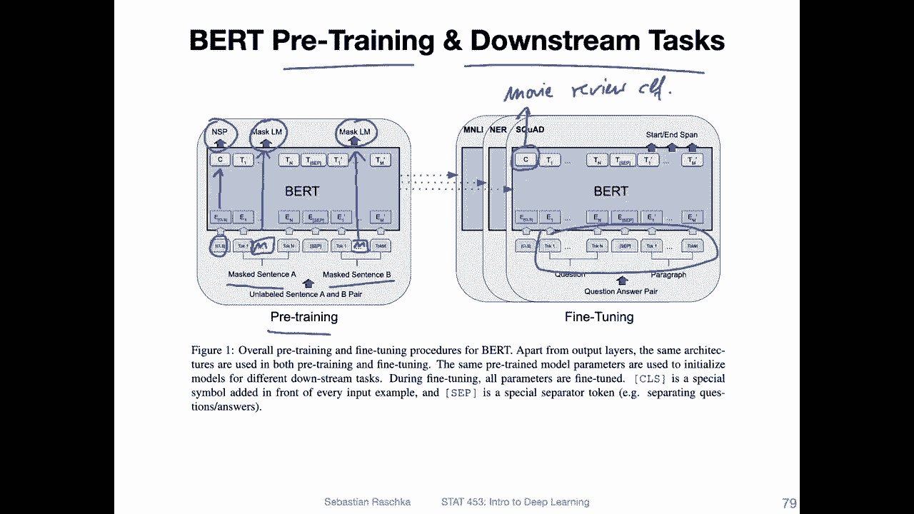

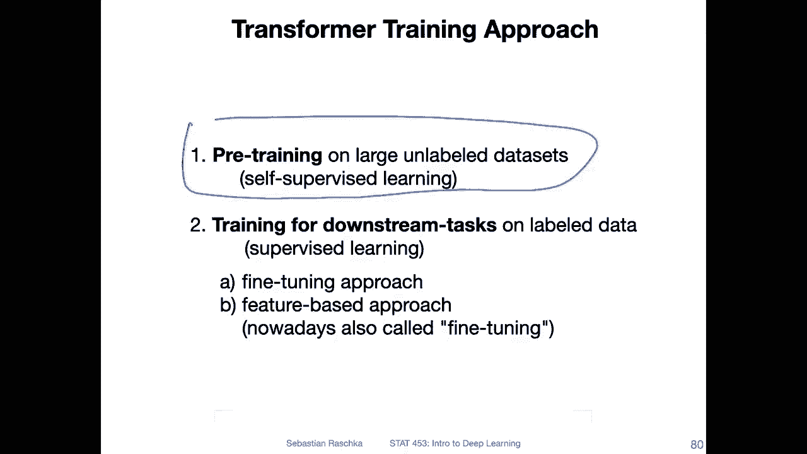

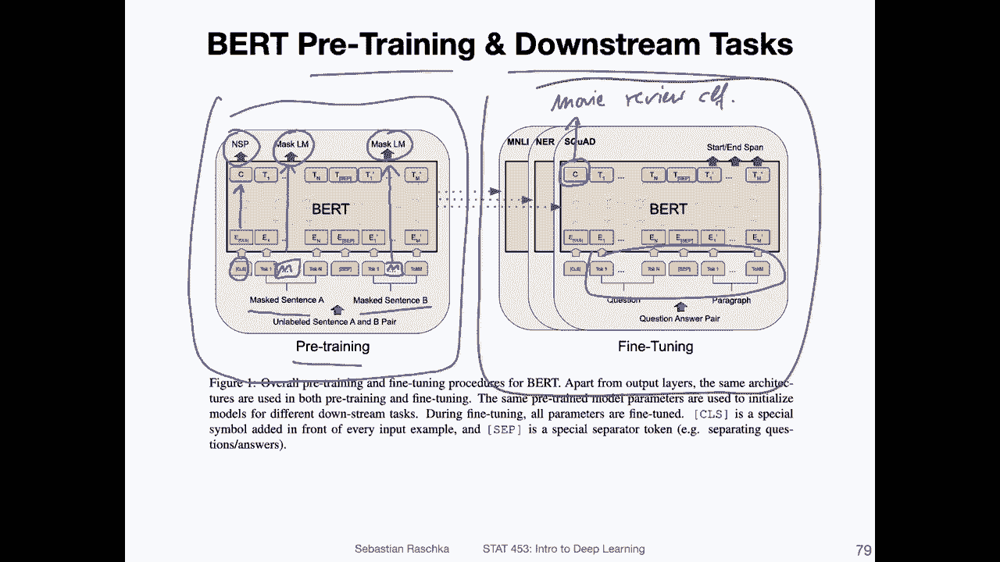

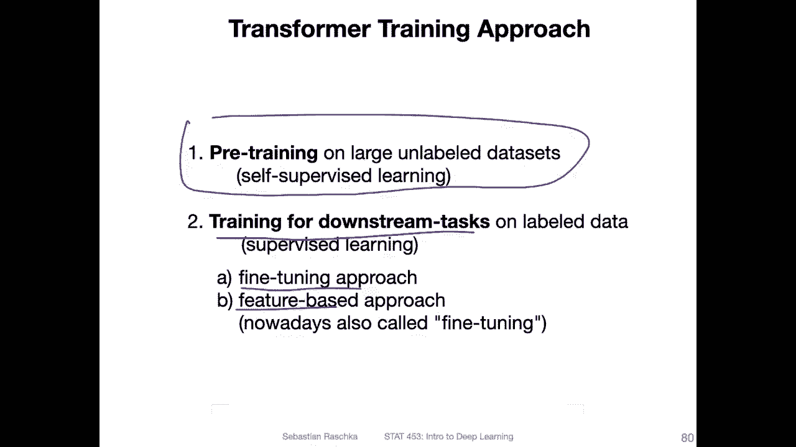

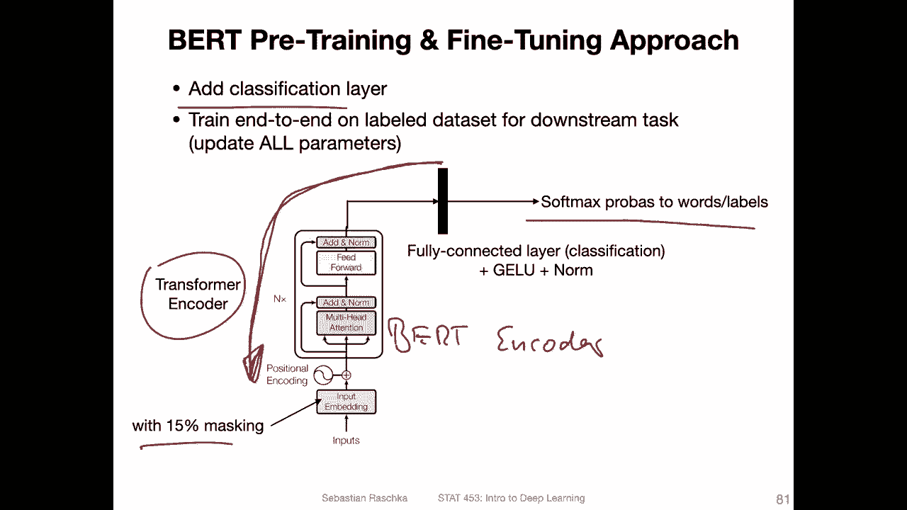

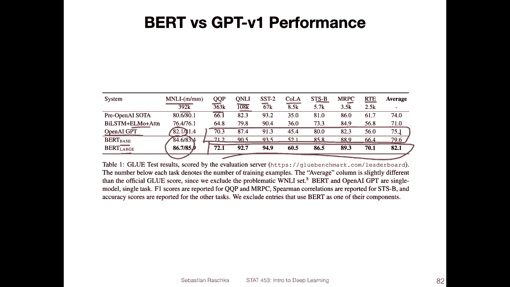

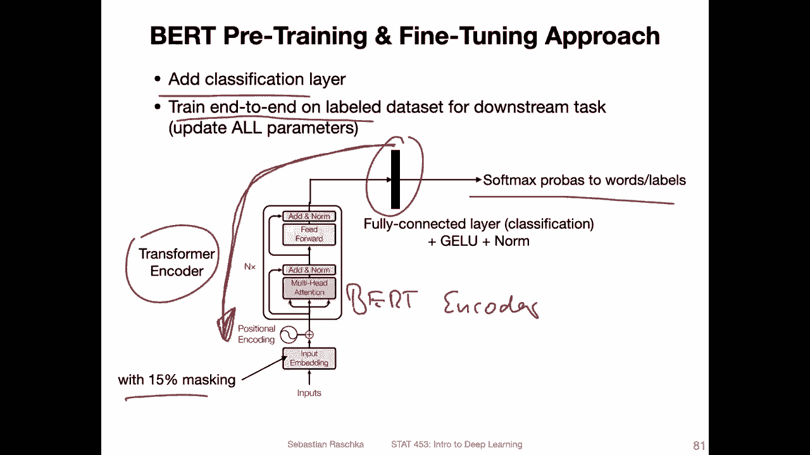

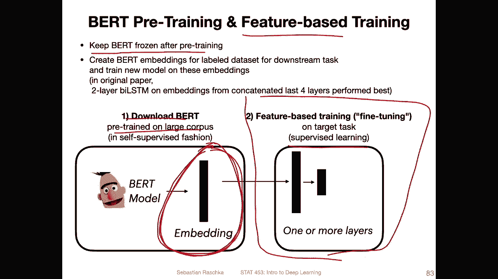

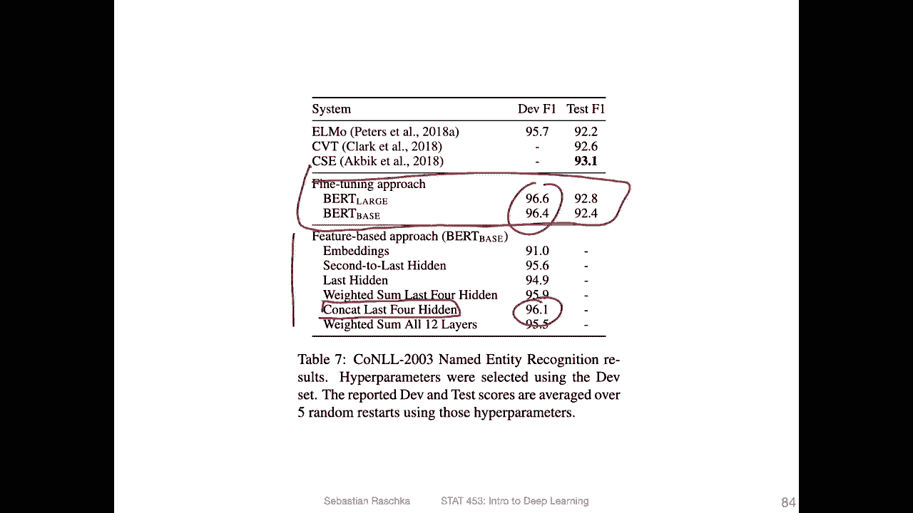

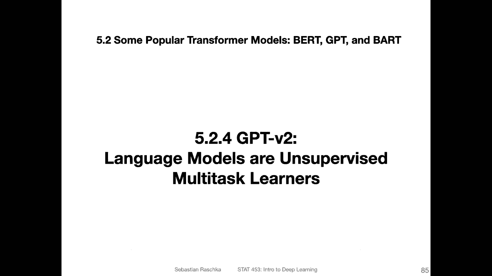