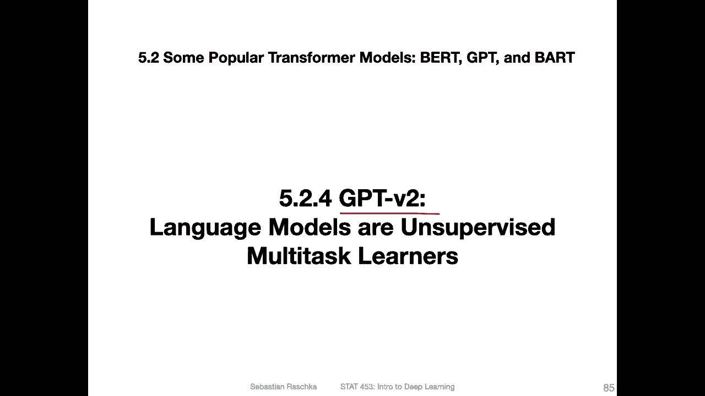
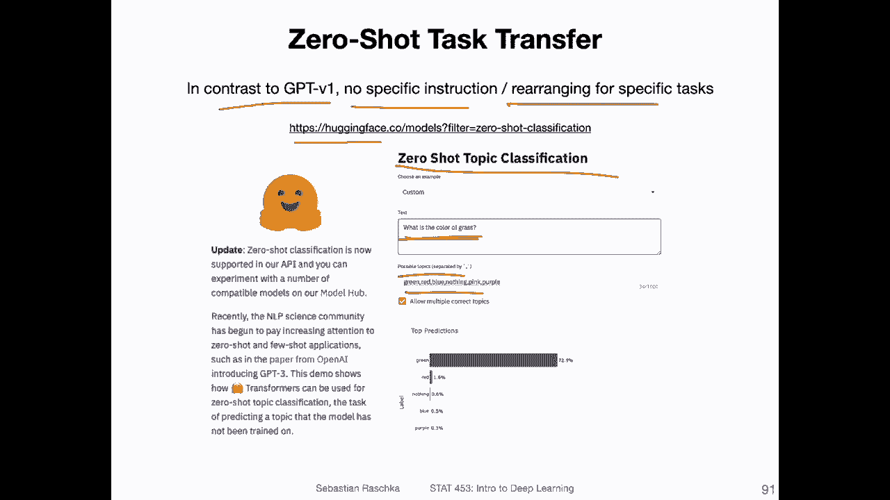

# 【双语字幕+资料下载】威斯康星 STAT453 ｜ 深度学习和生成模型导论(2021最新·完整版) - P165：L19.5.2.4- GPT-v2：语言模型是无监督的多任务学习者 - ShowMeAI - BV1ub4y127jj

All right， let's now talk about GPT version 2。

So before we talked about GT version 1 just to recap。

 GT stands for generative pretrained Transformer， and these are yeah models developed by open AI research and one fundamental aspect about them is that they are unidirectional models trained to predict the next word in a sentence or in a sequence。

 in contrast to the birdRT model which has this bidirectional language modeling approach。

So before we talked about G version 1， which was a model consisting of 110 parameters。

 came out in 2018。 Now， we are going to talk about the second version。

 which came out only one year later。 it has now 1。5 billion parameters， substantially larger。

 more than 10 times larger。And yeah， we are not going to cover all the nitty gritty details about this model。

 but if you are interested， here's a link to the original paper if you want to learn more after this video。

Okay， so also again， just to recap the GPT version 1 architecture。So GPT version 1。

 there was this transformer decoder with 12 transformer blocks， and this was first pre traineded。

They had this text prediction where they were predicting the next word in the sequence。

And then they had the second step， the fine tuning。To the downstream tasks。

 And here were some examples like classification， entailment， similarity and multiple choice。

 So the fine tuning happened on labeled dataset sets where the pretraining was on large unlabelled dataset sets。

Now， why am I recapping this Because yeah， G version 2 made a little or a big change to that procedure。

 So the key concepts behind GT version2 are， first of all。

 that it is similar to GT1 in the sense that it's also uni directional， so the pretrain。

Yes，'m still。Next。Work。predictiondiction。Our next token prediction。However， compared to GT version。

One， the version 2 model is significantly larger and the argument is the larger the better they had some yeah plots also I will show you that later that they did experiments with smaller and larger models and they saw the larger the number of parameterss。

 the better the performance and also with the data set the argument was the larger dataset will help with the model performance。

So the key difference though instead of making just things larger is that now they don't do any fine tuning。

 they use something called zero shot transfer， it's kind of related I would say somewhat related to zero shot learning it's not quite the same so here it's really about providing some context together with the input to perform the task I will also show you an example later。

How that looks like。 But one， one thing to highlight here really is that they got rid of the fine tu。

So the architecture itself， it's overall similar to GPT version 1， of course， it's bigger。

 but it's still based on the original transformer decoder。

They did some small rearranging of the layer norm and residual layers。

 but these are minor implementation details， I would say they increased also the vocabulary size。

 almost twice the size， but another detail。They doubled the context size， though， I mean。

 from 512 input tokens now to 1024， so they can capture more context。

 And I think it's also kind of useful when you think about the fact I will show you an example when。

You have to provide the task together with the input like the zero shot transfer。

 So I think it's also why they made the context size bigger。Overall。

 these changes resulted in a model of consisting of 1。

5 billion parameters compared with the original model。

 which was already large with 110 million parameters。

So the data set they used， I mentioned also， they made the dataset larger。

 so they had this so called web text dataset consisting of millions of web pages。

 and they also said improving the quality was important。 So how did they improve the quality。

So these web pages were based on Reddit posts， so they collected or focused on Reddit posts with karma of three or more。

So they were saying， okay， this is like a minimum requirement for linking to a reasonable website that it's not like a garbage post。

 but then also many of these had to duplicate so they did some de duplication and also some other website preprocessing。

 cleaning and so forth。So overall， they got 45 million links to websites from Reddit。

 and then after preprocessing and cleaning， they had 8 million documents。Yeah。

 amounting to 40 gigs of text。

Here's an example of this zero shot task transfer that I mentioned before。

 so in contrast to GPT version 1， there is no specific instruction or rearranging for the specific tasks。

 So what I showed you earlier was。

That they had to yeah rearrange certain things here the fine tuning。 Now。

 they don't have any fine tuning and like something like that。 However。

 I couldn't find a very concrete example of that。 It was a little bit。

 I was a little honestly a bit unsure of how that looked like I found under the hugging phase repository an example。

 though， of zero short topic classification。

So Haging phase is a company specializing in language models and specifically transformer based language models。

 and I guess I will show you an example also like of a BRT model and the coding examples。

As the last video。 But here。 So they had this nice online interface for playing around with0 short topic classification。

 So you could essentially provide some input and then。You provide your own labels。

 so these are labels the model necessary doesn't have seen before right because it's trained just to do the next word prediction but then after that you provide。

 you provide possible topics separated by commas here。 So I just provided some。

 so this was my own question I just asked a random question。

 but it's cut off grass and I provided possible labels， green， red， blue， nothing。

 pink and purple in it got it correct here。

So， it was kind of cool。Alright， so here are some results from the paper on。The size of the model。

 So they saw essentially you can see in all all three here， all four plots in the top。

 you can see on the x axis。 So on the y axis are some evaluation criteria， I think for all of them。

 the larger， the better。And you can see。On the X X's。

 the number of parameters for the language models。 And this blue line is their GD model。

 And you can see that in all cases， it goes。Up here。

 basically saying that more parameters is kind of better。 You can also see， though， I mean。

 these are for different tasks， reading comprehension translation。

 summarization and question answering。 They're not reaching the performance of other more methods for other methods。

Better at certain tasks here。But this is also not necessarily the point， I would say。

So not always outperforming other methods。 It was really just showing that these methods automatically。

Learn how to understand the text， even without the fine tuning， which was actually， I would say。

 quite impressive。So， here。Some more tasks。And in this case， they actually performed pretty well。

 So I think， yeah， in bold here， the bold ones are。Their performances， and you can see here。

 they outperform other tasks here。Except this one task and I think here the argument was that in this1 BW task。

 the sentences were shuffled， so there was a sentence never shuffling in this dataset sets。

 it's an existing dataset。And。This kind of defeats the purpose of having a large context as input because one of the points is that the model can take context into consideration a transformer。

 right， But if you shuffle the sentences， you destroy that context。

 So that is maybe one possible explanation why。The language Model 3 did notperform。

Other models here。Okay。Yeah， this was GPT version 2， short video。

 and then another short video on GPT version 3。

