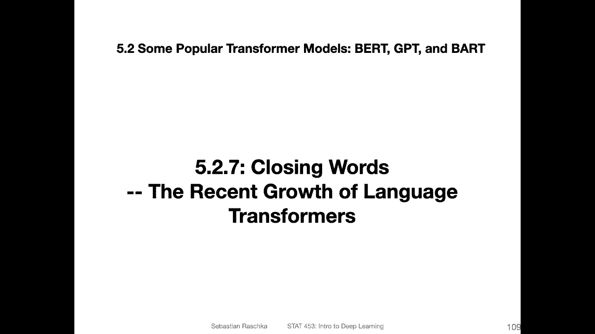
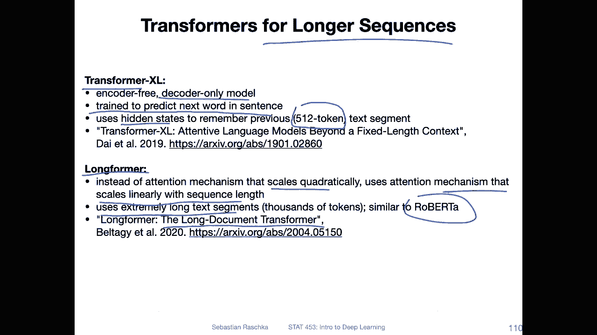
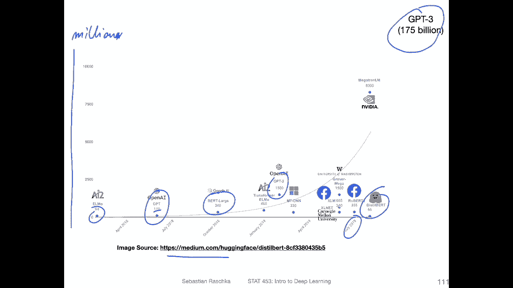
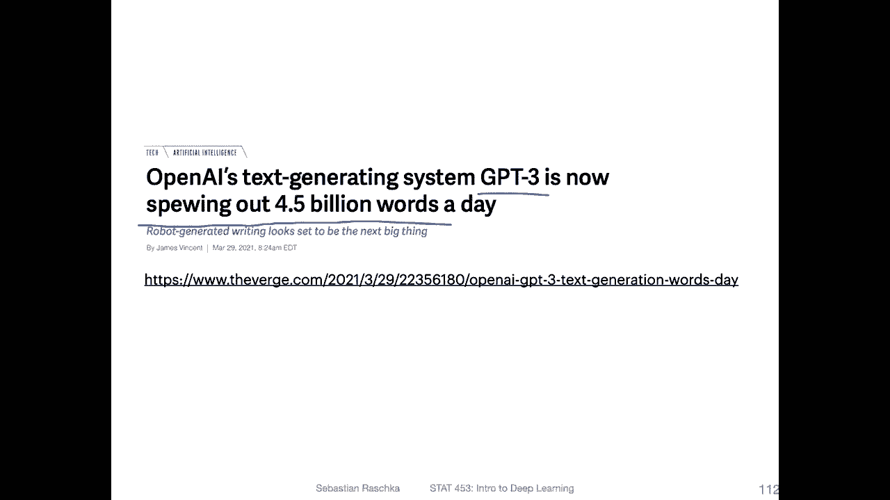
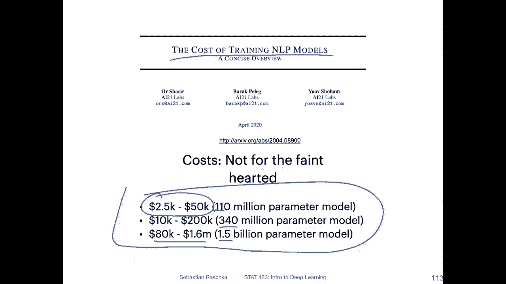
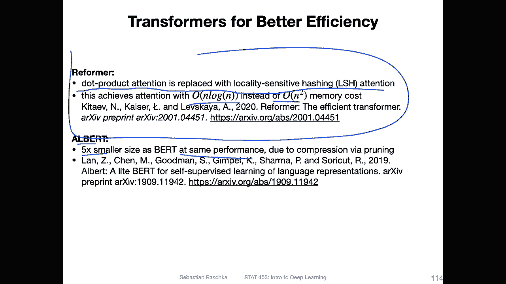
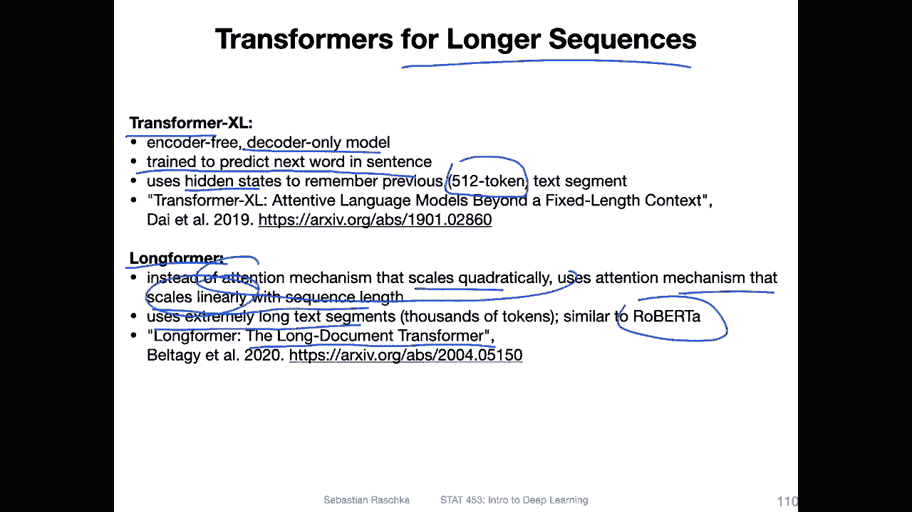
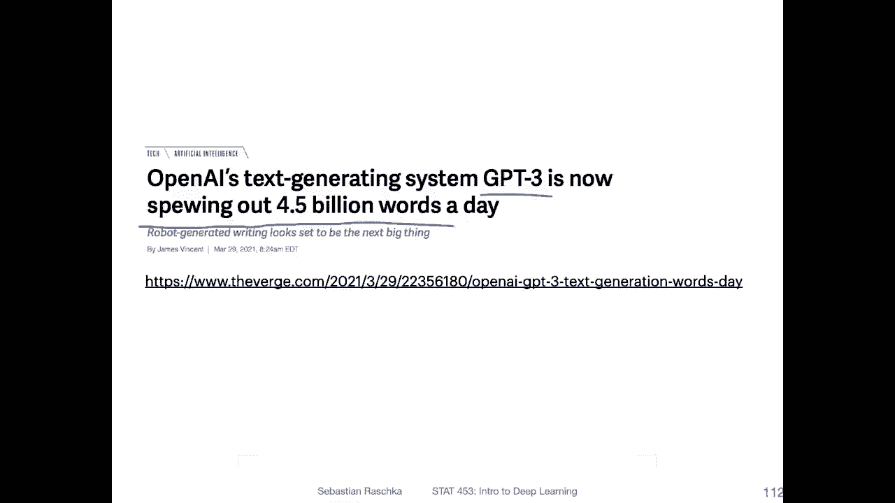
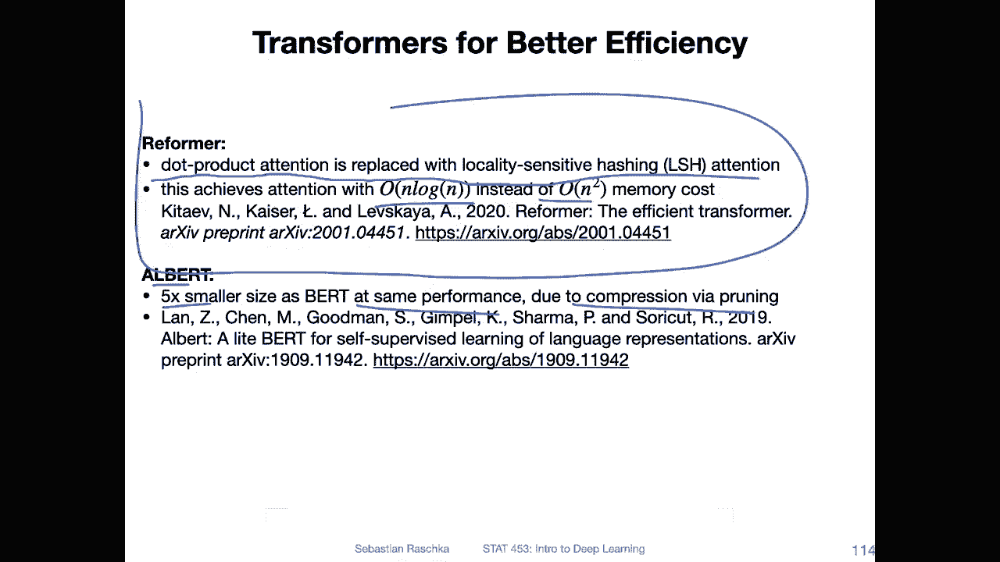
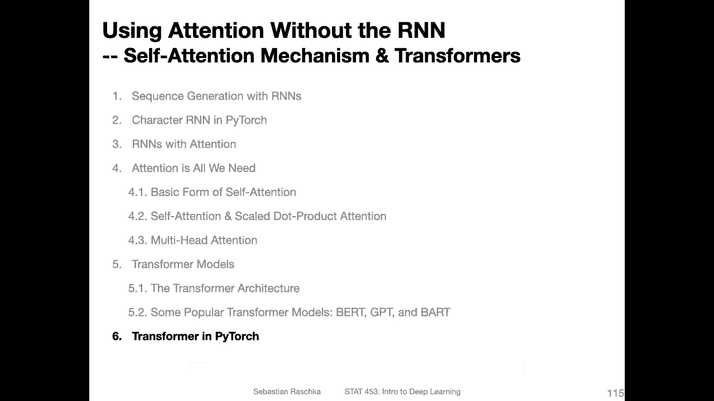

# 【双语字幕+资料下载】威斯康星 STAT453 ｜ 深度学习和生成模型导论(2021最新·完整版) - P168：L19.5.2.7- 结束语 - transformers的近期增长趋势 - ShowMeAI - BV1ub4y127jj

Yeah， lastly， a few closing words about these large scale language models that have been gaining popularity in recent years。

 So， of course， I couldn't cover all of them。 There are too many out there。 There may be hundreds。

 if not thousands of them out there。 but you may be to mention a few more。

 So especially those for longer sequences that might be interesting。 So there is， for instance。

 transformer X L， which is a decoder only model similar to GPT， and also similar to GPT。

 It's trained to predict the next word in the sentence。

However， in contrast to， yeah the regular G models。

 it's using some sort of hidden state to connect these input segments。 So remember the G version 1。

 it used like a 512 sized input tokens。And this model here。

 this transformer X L can connect multiple of these 512 input to tokens。 So in a way。

 it's kind of like almost like an R and N with transformer models in them。 So yeah。

 so this is like one approach for dealing with larger。Inputs another one is this long format。

 which stands for long document transformer， and yeah the attention mechanism scales quadraically。

 which is quite expensive quadratically with the input size。So here they developed， for instance。

 a mechanism that only scales linearly with a sequence length。Instead of quadraically。 So with that。

 they were able to process longer text segments， thousands of tokens， which is， yeah。

 similar to the size of Roberta， for example。But again。

 this is just one of the ways there are many other ways for making transforms also more efficient。

So that they can deal with longer inputs。

So overall， one trend， though， with these language models is that they are becoming larger and larger and larger。

 So this is a figure from hugging face。 It's， I think it ends here in 2019。 You can see we have。

ElMmo， we haven't discussed ElLMmo。But yeah， GT， let's say G， we discussed that。 It's 112。

110 million。Prameter， So this is。In million。 So， yeah， people should label their Y Xs。

 but I think this should be million。And then the bird model with 340 million perimeter。GP T 2 with 1。

5 billion。 We discussed G 3， which is 175 billion and so forth。 So yeah these becoming nuja， nu。

Luckily， though， there are also a few methods that focus on efficiency， for example。

 can see there are some smaller models， especially this distill bird。

 It's a small version of bird that is also。Making things more accessible again。

 because these models are so large that we as normal people probably won't be ever able to train them except you have。

 for some reason， access to a very， very， very large computer。

 But even if you have access to thousands of GPUus， it's probably。

A huge pain to train these large scale language models because there will be a lot of tinkering and engineering required to scale that up to that many GPUus。

 It's not just like P and play would have to tweak a lot of things and be an expert coder and engineer to make that work。

So yeah nowadays there was an interesting article I saw two months ago， so GT3 is now spewing out 5。

 4。5 billion words a day， I think they have an API around GP3 like commercializing it and it is very popular model that is also very popular nowadays and yeah in real world applications。

One problem， like I mentioned， the size of the models。

 there was also an interesting paper on the cost of drain large。Nature language processing models。So。

 here， they。Have some numbers that are。Quite something。 So for the 110 million parameter model。

 the GT version。1， for instance， they estimate the cost is between $2。

5 and $50000 just to train that。 Or then if you have the Bt model or the G version 2 model that。

Going like hundreds of thousands of dollars to millions of dollars just training these models。Yeah。

 it's quite， quite impressive， but also kind of sad， if you think of environmental costs， but well。

Yeah， it's， it's also research in a way。 So it's kind of interesting to see。Where things go。

 But I wish also things wouldn't be that expensive and not as， let's say electricity hungry。

So luckily some people also focus on models for more or better efficiency， for instance。

 there is this reformer method which replaces the dot product attention by local sensitivity hesing mechanisms so also achieving n look n scaling instead of n squared memory costs and so forth。

 there's al bird which is a five times smaller version of B but that reaches the same performance。

 so they are different approaches are approaches like the reformer or also。

There's also the sparse transformer that I briefly mentioned。 And that was this。Longform。

 which also has this tension mechanism that scales linearly with a sequence length。

There are also yeah the stillill bird。 There are many， many different approaches。

 but just to highlight a few， right。 So here this one。

The Al Bt model is， for instance， also focused on compressing via a pruning after training。

 so you train the model and then you prune so that you get smaller models。Okay。

 so this is it then for a whirlwind tour across these different large scale language models and lastly maybe having a short a short code example in the next video and then ending this very long lecture on R ends and attention and transformer models。

