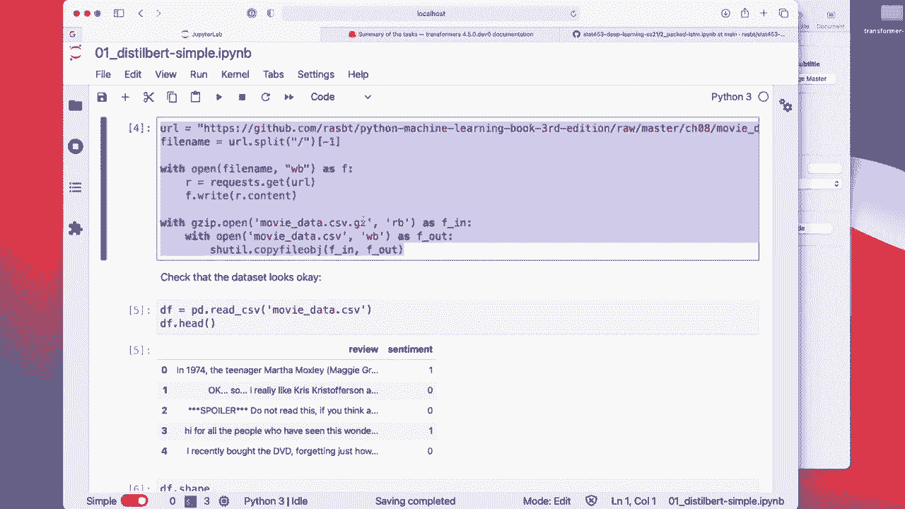
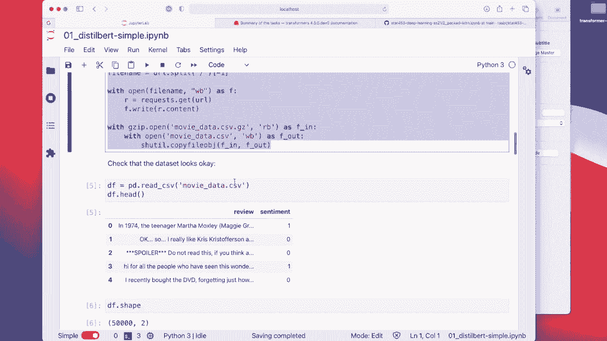
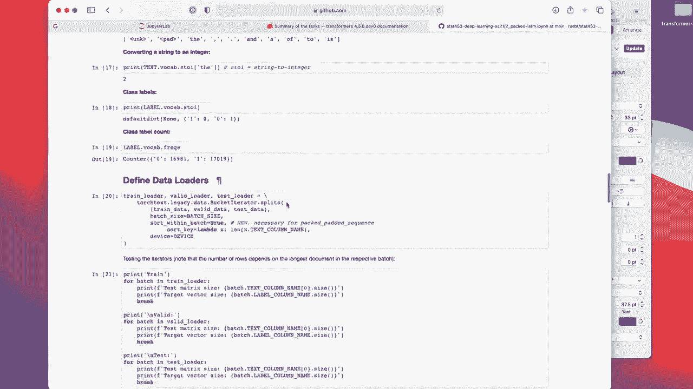
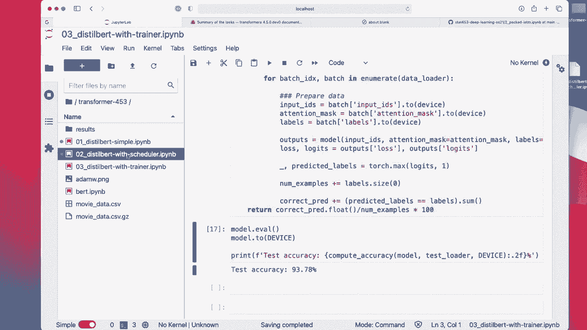
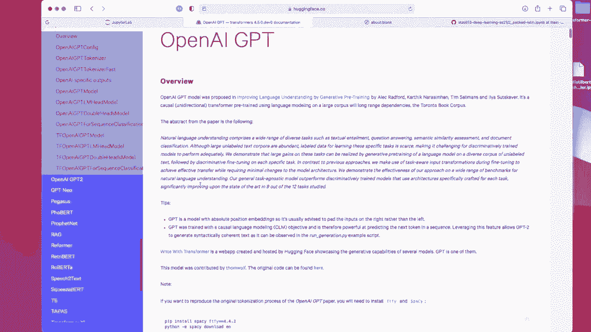

# 【双语字幕+资料下载】威斯康星 STAT453 ｜ 深度学习和生成模型导论(2021最新·完整版) - P169：L19.6- 基于PyTorch 的 DistilBert 电影评论分类器 - ShowMeAI - BV1ub4y127jj

Yeah， so this was a very long lecture on sequence modeling with recurrent neural networks and transformers。

 So we talked about R ends with attention， then we talked about selfatten and multihead attention。

 which are concepts found in the original transformer model and then we talked about some popular transform models such as B。

 GT and barRT。 So in this last video I wanted to show you a code implementation of BRT。

 I know that yeah， this lecture has been about generating sequences so。However。

 as we also have learned， the birdRT model is more or better for discriminative modeling like prediction tasks。

 whereas GPT would be a better model for generating text。So Bert。

 because I just find this model also interesting， I wanted to show you a simple example using our familiar movie review classifier data set。

And then we can compare to the performance of the LSDM model that we trained in Ncture 15。

But of course， please feel free to experiment more with us。

 There is essentially a company who is developing an open source library that everyone uses when working with Transers the company is called Huging phase and。

Yeah， they have a lot of tutorials。 So I was just focusing on classification。

 but they have many other。Tuttorials available。 So if you are interested。

 so you can find also sequence generation tasks and so far， like question answering and yeah。

 different different types of things， language modeling。 So please feel free also to explore more。

 I wanted to just because it was a long video or lecture already。

 I wanted to just finish this with a shorter example showing you how to use this resource。

 the transformer library from hugging face。

So here we are going to train a bird model。 And I was actually implementing bird models on this movie review data set or fine tuning it。

Essential， I couldn't get really good performance with that。 So I changed that to。Using distill bird。

 So distill bird is a smaller， faster and computationally cheaper version of birdt。

 So they essentially took Bt， the original bird model and distilled it down to a smaller size。

 So it has 40% less peri。 So it can make this a little bit larger here。 So it has。

40% less parameters。And run 60% faster while achieving approximately 95% of the original performance of bird measured on a language understanding task。

So again， I just wanted to show you in general how we can import these models from the Transformer library。

 which we can install here via Pip install Transers so in for this particular example I was using the version 1 4。

6。

All right， so and I also structured this whole notebook in a similar way that I structured previously。

 for instance， the LSDM notebook that we had for movie review classification。

So I'm importing a couple of things here， there's a tokenizer and a classifier model。

 so this is just for preprocessing the text and then this is the main for loading the main distill bird model。

The tokenizer here， when I understood correctly based on the documentation。

 actually the same tokenizer that they use for the regular bird model， they call it distill bird。

 but you could technically also just use bird tokenizer。

Just a few settings here。

I'm only training for three epochs because it's， it's a slow。 I it's a big model， right。

 It's it was it 300 million parameters。 So it takes a while to train。

 So that's why I only trained for three epochs because yeah， I didn't want to wait forever。

Yeah。So actually 3 million parametersmeter， I think， is the original bird model。 So that is 40%。

 that it's more around 17h。

So first I'm loading the data， so remember I had like a preprocessed version of that dataset that we used also in our LSTM code before just for convenience I'm using that it's a CV file。

 so here this is just downloading and then unziiping the CV file from my book directory where I have this preprocessed version。

And heres how it looks like the reviews as text and then the sentiment here as yeah。

That's the class table， whether it's positive or negative。

We have 50，000 movie reviews and I'm splitting this into a training validation and test set。

 so I use the first 35，000 for training and I use 5000 for validation and the remaining 10。

000 for testing。

Then I'm loading the tokenizer from the pretrained model here， So why using a pretrained tokenizer。

 I think this includes the generation of the word embeddings。

So the vocabulary and everything。Now。This is very convenient， so we can just apply that。

 So now it would then process those other words。I reviewss the same way it processed the once when it was doing the unlabeled training。

 So just to recap， let me go into the lecture slides。

 So there are two steps I should have maybe said that earlier。

 We are in this notebook only focusing on the pre training。 So if I go back to the main concepts。

So yeah there are two main approaches， the two training approaches for the transformers so first there's this pretraining on the large unlabeled dataset and then there's the training for the downstream tasks on a smaller labeled dataset So in our case we are loading the pre-trained one so the people at hugging phase prepared this pretrained model which we are loading and then in our particular case we are just doing the training for the downstream tasks on this small labeled movie review dataset and we are using the fine tuning approach where we update the whole bird model。

Okay， so here we are creating then our。

Encoings。Socodings for the text， I think this includes also the word embeddings。

So the context size is 512。 So that's also one thing to keep in mind。

 what it will do is it will truncate so。

If we have a movie review that has fewer than 512 words。

 it will do a padding if it's longer than 512 words， it will truncate。

So then everything will be the same size，512。 Then we set up our data set here。

So this is just a Pwach data set from yeah， from the main Pytch library。

 So it's something kind of familiar。 So now we work with encodings and labels。

 and yes a specific way to pre process。

Or arrange the encodings。

So it's essentially from the key， like the I I， the word ID to the encoding。Sorry， yeah。No sorry。

 this includes the labels， right， right， okay。

Yeah， and then。We construct our data set from the encodings and the labels。

 So this gets our encodings and the labels。

Let's see the encodings in the system labels。

Labels are just the zeros and ones， then I'm setting up my data loadus Not I'm only using batch size of 16 because the bird model is quite large and I got memory problems on my GPU when I was increasing that。

And now we are loading the pretrain model here， so we are using the distill bird for sequence classification。

From yeah pre from pretrained。 So we are using an uncased model。 So it's case insensitive。That was。

 yeah， something I tried。 It's just a simple model。 I think they also have case， sensitive ones。

But since we have a small data set， that might be the better option here using the atom optimizer。

And then we are doing the training。 Okay， so training is very unspectacular。 So this is， by the way。

 this's just the accuracy function。

Have carried this over from our previous code examples。

 I made a few modifications just about this part here。 This is for loading the data， but。

Except that it' this is from our LTM notebook earlier。

Where we also should have a accuracy function here。Just took it from here from our previous code。

 modified it a little bit for our encoder transformer。

And yeah。

That is then computing the accuracy in the same way。Now。

 not also that the outputs when we run the forward path of our model。 so the bird model。

Gets the input Is and then the attention mask。And。The outputs are。Two thinks it's a tuple。

 one is the loss and one are the los， so it's computing already the loss inside so we don't have to worry about。

 let's say using cross entropy loss during training also。

And then we get the predicted labels by looking them at the maximum。Rodget here。

 So this is similar to a while。

A LDM classifier。

Or any other classifier we trained before。Okay。

So here we are training again， so this is for preparing the input data set， so getting the input IDs。

 the attention mask， and then the labels and these all go together as input to the BRT model。

So if it's the input I， sorry I said earlier that the tokenizer includes the word embedding that's not true。

 this is then happening in the model itself if it's just in getting the ID so the conversion to the embeddings must have happened in the word model itself if。

Go back to our slides。

So I don't have a specific bird slide here， I think。 but if we look at the general transformer here。

 So these input embeddings are probably happening inside the bird model together with positional encoding。

 So in bird。

This is stupidT。In B this look like this， if you recall， So these embeddings。

Probably happen in inside the model。

The Yer。Okay。Because this is just the Is。Yeah， then the backward pass。

 we set the gradients from the previous round to 0， perform the backward pass on the loss。Again。

 the loss is returned by the bird model， so the model， when we call it with a forward pass。

 will return a tuple， which consists of loss and logicits。

And we use the loss for the backward pass here， we don't really use the logics。

 We only use the logicits later here for computing the predicted labels in our accuracy function。

Yeah， and then it's training。 this is just our boiler plate for keeping track of the training。

And yeah， it's take some time。 It's 20 minutes per epoch。 It's much， much slower than our LSTM。

 but it's also much， much larger than our LSDM。

In terms of the number of parameters， and in the end， it gets pretty good performance。

So three epochs took about one hour， gets 99% training accuracy and about 92% test accuracy。

Now let's compare that to our LSTM model that we trained before in lectureture 15， so。

That was。

The with the pe sequences， where we had a more efficient way of peing sequences。

 So when I compare it with this model， we got around 89% accuracy。

 So let me scroll down to the bottom。

So it trains much faster。 You can see it's only a few。

Half a minute， approximately less than half a minute。

For one epoch。

And。😔，15 epochs was just in five minutes or four minutes， it's impressive。 So 89% accuracy。

 it's actually not too bad。 So， but yeah using our pretrained bird model。

 we get even better performance out of this， which is also interesting。

So yeah， in that case， that's how the bird model works。

 It is how we can use a pretrain model and fine unit。

 So the key idea is essentially using the tokenizer。

To get the encodings。The so called encoding。 And then we can use。

This is also getting all attention masks， and then we can use the pretrain model here。

 distill bird for sequence classification。

And just train this further for our target data set。 So I did some more experiments， so。

To further improve the performance， I looked into what they recommended in the tutorial。

 so I made a few changes。

So one of the changes was using。Adom W， which is an atom that supports decoupled weight decay。

 that's2 regularization， so。

Let me。 So here's from the paper。 So there's a paper corresponding to that Adam with weight decay here。

 if you're interested。 And this is just from the screenshot explaining how they perform the at weight decay。

 but that's not get cited tracked here。 So the difference is I'm now using Adam with weight decay here。

Before I just used the regular item。And also， what I'm doing is I'm using a running rate scheduler with a linear running rate schedule。

And this is something I got from the hugging face repository。 So let me， yeah。 so you can see that。

 So I got that from the transformer。Library， that's also the something they recommended with these settings。

And when I train that， then with these two changes using Adam W and the。

Linear schedule， which I update after each iteration。I got even better performance， I got 93%。3。

 it's about 1% better test accuracy。

Another thing I found really cool is what they also have in the hug face repository is they have。

A so called。Trainer class。 So this is essentially the same as before。 So I'm using。

Again， distill birdt。

For classification with us， they also have an W。 I use just the one， I think in Pytorch。

Maybe their is even better， Im not exactly sure what the differences are。

Between their Adam W and the one and Pytorch。 But my guess is either they implemented it before it was implemented in Pytorch or they have like a small change to it that makes it maybe more specific or better for transformers in any case。

 So this is all the same setup， also the same tokenizer。

But now the difference is after loading the model。 So maybe I should have left it up here。Sorry。😔。

Because I'm not using the one from Pythtorch， I'm using the Arrsen now So before I use the one in Pythrch。

 I'm using the Ars snow， it doesn't really matter。

And yeah here I'm using this trainer class from the repository。 So this is actually very convenient。

 They pack a lot of functionality in there。 they have a per device training batch size。

 So when I was running this on my machine， which had multiple GPUus。

 it was utilizing the different GPUus for efficiency and you can also specify directly the scheduler and everything。

So these are the arguments for the trainer。 And then you can specify the trainer with these arguments。

 You can provide a training set and a meditation set。

 So you can just use that one instead of having our。

嗯。

Yops。I'm not sure why it swap swaps here。 I want to show both at the same time。

 somehow it doesn't like it right now。 But instead of defining our training loop here ourselves。

 we could also use。

Use their trainer here， and then it trains for a couple of times。

 gives you some output for the different steps， or different losses here。

You can see the loss goes down。

And， yeah。It's my accuracy and evaluation and you get even slightly better performance than with the one I trained with my own scheduler。

Okay， so this was just a very quick video on using distillber from Haging face。

 They have way more models here。 You can see there's a huge range of models。

 They also have G models here。 if you are interested in the more generative modeling parts。

 This is usually a model that is better for sequence generation。

But yeah， there's lots， lots of stuff here。 if you're interested in language models。 So with that。

 let me end this lecture， which was already probably a little bit too long。 but yeah。

 I hope that was useful。

