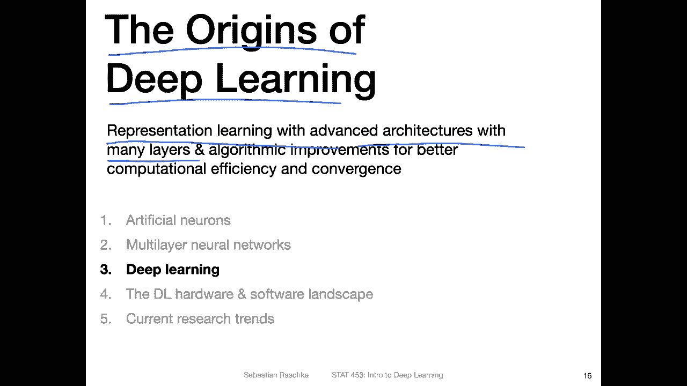
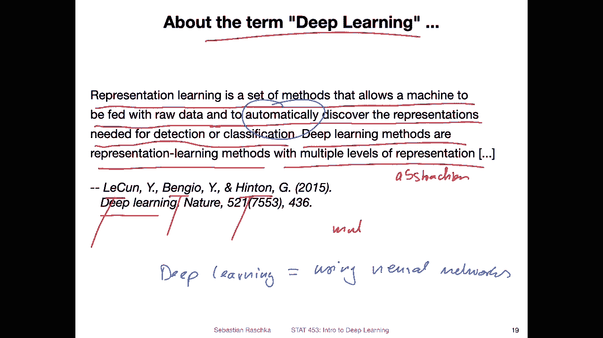
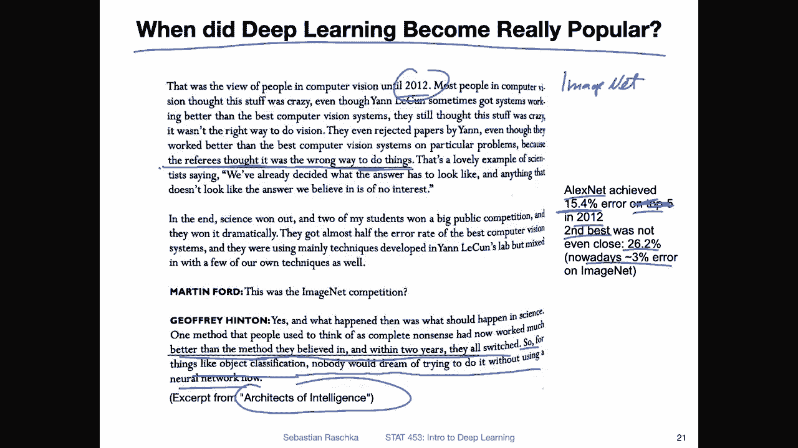
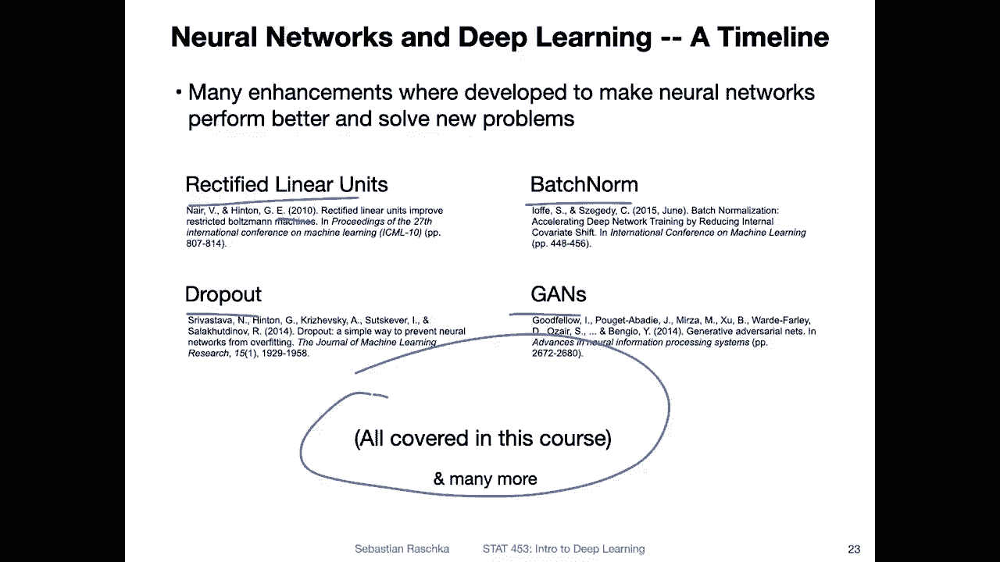
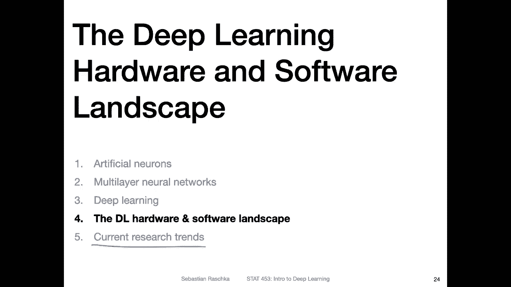

# 【双语字幕+资料下载】威斯康星 STAT453 ｜ 深度学习和生成模型导论(2021最新·完整版) - P16：L2.3- 深度学习的起源 - ShowMeAI - BV1ub4y127jj

Yeah now moving on from the multilayer networks like the multilayer perceptrons to deep learning so we are going to talk about the origins of deep learning in this video So coincidentally I just submitted a paper today with collaborators where we used multilayer perceptrons and we were debating whether we should call it deep learning or whether we should avoid the word The reason is deep learning is a relatively new word like that was invented。

 I would say like 1015 years ago。But multi layerer perceptrons have been around for at least like 3040 years。

 right like I talked about in the previous video， So is this really deep learning。 So yeah。

 that is kind of debatable So technically when the term deep learning。

 yeah first occurred when it was first used what people referred to was the representation learning with advanced architectures with many layers。

 So having。Multiple layers is not really what makes yeah。

 the difference between a multi layer perceptor and deep learning。

 It's more like the representation learning capabilities。 that is usually， yeah， what deep learning。

Is all about。 So nowadays， though， if you read papers。

 newer papers where people use multilay perceptionceptrons， they call them deep learning too。

 So I think nowadays it's okay to also call it deep learning to make it maybe less confusing for people because everything nowadays that is a neural network is also automatically deep learning。

 but let's dive a little bit more into the representation learning aspects that I just mentioned。

So that goes back to yeah also the approximately 1990s。

 So also in that way it's a thing that was discovered or invented before deep learning was a thing the word deep learning and it is convolutional neural networks So this is kind of on top of yeah the multilayer perceptrons it's like can think of it as a specialized version where you have locality so here it's about making training more efficient and also extracting local features which then better capture feature dependency So recall in multilayer perceptrons we had like the feature independence。

 so it would work with tabular data now with convolutional network we can leverage some prior knowledge of this relational inductive bias so it's specifically for image recognition for image data So how multilayer perceptron works is yeah you have these independent。

and features and the convolution network captures dependency。 on the right hand side。

 I'm showing you this original line architecture from Yan Leon and Cos。

There was applied to hand written zip code recognition。

And we will have a dedicated lecture just to convolutional networks later。

 But here just a brief overview is that it consists of two parts。

 So there is one part that is the convolutional。Part， so here you have convolutional layers。

 They have a trick or a concept called weight sharing。 And there is also pooling involved。

 And that makes the， yeah train more efficient。 We will discuss this in more detail later。

 But you can think of it roughly as。No。Feture learning。

Layers where these layers are able to extract the abstract features from the data。

 and these features are then。Passed on to。Fully connected。Set of layers。

 So these are fully connected layers。 And these are essentially a multi layer。Perceptron。

And you can think of it as a classifier here。So if you think of it as a task。

 let me also use red here。So here we have this part， the lower part here for feature learning。

 and this upper part is for。Classifying the features that have been extracted by these earlier layers。

 So this is making the hand crafting of the features obsolete。 Now， the network learns the features。

 and it learns that in a way such that it is optimal for the classifier。

 because everything here is connected。 So it's learning together， which is one advantage that makes。

 yeah that makes neural networks for image data specifically very efficient。So this is， again。

 this is from the 1990s， back then the term deep learning didn't exist， but I would say nowadays。

 con neural networks are really like the most popular form of deep learning because there are。

 I mean， many， many advances that followed this earlier architectures。

And made yeah deep learninging what it is nowadays。 Of course。

 there is also a separate branch of recurrent neural networks that is also very popular in deep learninging。

 So recurrent neural networks also are， I would say an advanced version of the multilayer perceptron。

 So here what's new is that there is a recurrence。 So so you can think of this as a multilayer perceptron。

 but a multilayer perceptron is a feet forward network。 Now you have this recurrence。

 So you are revisiting earlier things。 So again， this will be covered in way more detail in a dedicated lecture later on in this course。

 but the key idea is basically that we have a modified version of backproagation。

 which is called back propagation through time because there's a time component。

 and this is especially useful for。

Sequence data where there's a， yeah sequential dependency in the data among across the features。So。

 but the problem with that is now， when we train neural networks with many layers。

 especially if a recurrence over a long sequence， theres this problem of vanishing and exploding gradients。

 So that is like a big challenge。 However， it was also， I mean， there are many。

Potential solutions to that。 one of them that is， yeah。

 one of the ones that is still commonly used is LSTMs that stands for long， shorter term memory。

 So also this one was like overcome。 And this is also one popular form of deep learning。

 like using these neural networks。 But again， this is something that has been around for a long time。

 Actually， I don't know exactly when recurrent neural networks were invented first。

 it was like also in the 1980s sometime after。Back propagation was invented because， yeah。

 this is an advancement of back propagation。 It was someone sometime in the 1980s。

Yeah， just to summarize what originally the term deep learning meant。

 he has a nice section or sentence from the deep learning review by Laon Benjo and Hinton So Hinton was the person working on the back propagation algorithm Lacooon was the one who came up with the convolal neural network and Benjo is yeah doing a lot of work also across deep learning。

 mainly also focusing on yeah the current neural networks， but also basically everything。

 So in this review。The sentence goes like like this。

 representationpresentation learning is a set of methods that allows a machine to be fed with raw data and to automatically discover the representations needed for detection or classification。

 Deep learning methods are representation learning methods with multiple levels of representation can also say abstraction。

Yeah， and so here the focus is really like the implicit feature extraction that deep learning does。

 That is something that traditional machine learning is not capable of like we talked about last week。

 where we have the handcrafted features versus the automatic feature extraction。

 So here the focus is really on on the automatic part。

 But nowadays its really deep learning yeah means。The same as yeah， using neural networks。

 So deep learning nowadays。It's really the same as using。Nurong。😔，Networks。

 maybe we should be a little bit more specific and say。目的。😔。

Laer。Yeah， but going from these architectures I showed you that were invented in the 90s towards the modern era of deep learning research。

 There was unfortunately in between another AI winter in the late 1990s and early2 thousandss and I think that was probably due to the popularity of support vector machines and random forests because back then yeah neural networks were capable but they were very expensive to train so you needed like enormous computer hardware to train them efficiently and even then you had to wait a long time to train them。

 so they were not easy to train compared to let's say support vector machines and random forests of course support vector machines come with their own set of problems like the inefficiency of RBf cor machines on high dimensionmenional data Also random forests require a lot of trees so but still compared to deep neural networks。

 these were easier to train and worked quite well。So yeah， but then at some point。

 people figured out how to use GPUus to make the training of neural networks more efficient。

 And that is really what helped yeah making neural networks really popular and feasible。

 So when I looked at literature what I could find it goes already back to 2004 So GPU implementations of neural networks have been around for quite some time。

 but really when it became popular was in 2012 where Khrushevsky Sutkiver and hintton worked on imagenet classification。

 the very common benchmark data like millions of images where they used yeah deep neural networks trained on GPUus to outperform traditional computer vision approaches。

 So a few more words about that in the next couple of slides。 So yeah here's a table。

From my 2017 book， I actually updated this last year。 so I don't know why I have the old one here。

 maybe I should swap it。 but again the bottom line here is more that the difference between traditional CPU for example here in Intel CPU and an NviDdia graphics card or in general graphics card。

 maybe think of it as the difference between a CPU and a GP and GPus are particularly good at linear algebra operations like vector and matrix operations。

 So even though GPUus have a smaller clock frequency。

 one advantage is really like the parallel course， each core is slower than a CPU core of course。

 but you have more of them and that helps you parallelizing computation so。Parallel。Yeah。

 computing of dot products and。Matrix modifications it's really what makes GPUus very useful for deep learning。

 So you really get a higher way higher memory bandwidth also so the GPU memory GPUus come with their own memory which is closer to where things are computed so it's also faster in that way if you have the data on the GPU however you have to get the data to the GPU which is sometimes a little bit slow So there are some tricks also to make this efficient in terms of data loading。

 but this is something we will talk about when we actually use Pytorch for deep learning I will also show you how you can use GPUus for this class you won't need a GPU I will later on talk about some free online resources where you can get one GPU for free which can help with some homeworks and also the project but yeah you don't need to buy your own GPU or something like that。

So yeah， and moving on yeah。 So really you can see the number of floating point calculation of float is yeah you can think of it as a decimal number in the computer。

 can see it has a way higher number of floating point calculations and it's also cheaper at least compared to this high end in CPU but of course they are also yeah things with GPUs that make certain things inconvenient because they have their own memory which is not very large。

 I mean there are nowadays more expensive cards that have larger memory。

 but usually indeed deep learning GPU memory the bottleneck at least for me。

 but again that is topic for another day。

Yes， so here's another fun quote from the architects of In， like an interview with Joe Finton。

So it is about when。Yes， so regarding the question， when did deep learning become really popular。

 So here again， is a fun quote from orqu excerpt from interview from the book Architects of Intelligence。

And yeah， this refers to the 2012 Inet competition。

 So there was a famous computer vision competition on a dataset set called。Iage net。

 and it was essentially about a benchmark。 and people submitted， yeah。

 computer vision methods and papers。 and it was about having the best system each year who could do the best classification on this image dataset set。

 It's like a yeah image dataset set consisting of up to 14 million images of they used only a subset of at that time as far as I remember。

 But yeah it was a millions of images。 And。Back then really the conferences were dominated by traditional computer vision approaches like manual feature engineering and so forth。

 no deep learning really And here in this interview and I't want to read everything here。

 maybe you can pause the video and read through it if you are curious but it is essentially about that deep learning methods were usually rejected so here is like something underlined the referees thought that it was the way way sorry the referees thought it was the wrong way to do things referring to the neural network architectures here So people really didn't like deep neural networks back then I mean people who were using traditional computer vision systems however。

Yeah the network that was submitted that year in 2012， the Alexnet。

 which was by Alex Khushevsky Sozscapeer and Jofinton。

 was really outperforming traditional computer vision methods by a large margin so they achieved a 15。

4% error in 2012 on top 5 classification I will in the next slide explain what top 5 accuracy or error means so forget about top5 for now so they achieved a 15。

4% classification error and the second best method only achieved 26。

2% error so their method was about twice as good as any traditional computer visionion system so by the way as a side note nowadays you can even get down to 3% error on imagenet so even like since 2012 things improved quite a lot。

But， yeah。I just briefly here the last thing。 So people were really surprised about how well deep learning worked。

 And then also like he says， within two years， they all switched。

 So for things like object classification， nobody would dream of trying to do it without using neural network now。

 So this was really like 2012 was really like the breakthrough moment for deep learning because yeah it it performed really well on on image classification。

Yeah， and here's also just a quick overview of the benchmark dataset sets。

 Nowadays there are other even bigger data sets， but these are still common data sets when you develop con networks or object classification methods。

 So there's the traditional Mnes data from 9098。60000 examples。

10 classes and very low resolution images。 So these are the handwritten digits。

 So this is still a great dataset set for debugging on your network。

 It's like when you want to yeah try a network get the code written and see whether it works because it's really fast to train a network on that in practice if you write a conference paper testing your method on Mnes may not be enough anymore。

 but yeah it's still a good way to start more I would say advanced data is Cypher 10 and Cpher 100 So there are 60000 examples of either 10 classes which is for Cypher 10 or 100 classes in cpher 100 again。

 very low resolution 32 by 32 now though we have color images so we have three color channels and yeah we have different object here to classify。

 there's usually only one object in each image。A more challenging dataset set is the imagenet dataset set。

 which consists of 14 million images。 So they have full resolution。

 and but what is a little bit yeah more challenging about that too is that there can be multiple objects in an image I talked about in the stuff in the news section where people were relabelling imagenet。

 But yeah so what can happen is that there could be multiple objects sometimes So or it can be kind of ambuous。

 So usually what people do is they measure the top five accuracy or error。 So for example。

When you have prediction， you check。Whether it's so whether your top five labels are matching with the image label because a network is strained you to return a probability or a confidence score for each possible class and then you look at the top five most confident labels and you look whether one of the five labels matches with a label in the image for example。

 it's a little bit small， I can't really read this here，Yeah， let me see。 but let me pick an example。

 So here， for example， we have actually also two things。 We have a cherry and a dock。

 So it's also you can see this is like a challenging example where your network may predict a dock。

 but since the data point here is labeled with cherry。

 it would actually count as an arrow which is kind of unfortunate。

 So you would look whether yeah your prediction is kind of within a top 5 or here in this case。

 your algorithm may predict car or grill like the grill of a car both would be correct right So in that way you look whether a grill is under your top5 for example。

 So in that way， it's a little bit harder to evaluate on imagenet compared to Cypher 10。

 I think in Cypher 10 it's a little bit more obvious， not not more that more obvious。

 but here you have classes where it's at least a little bit less ambiguous。

Alright， but yeah moving on， I don't want to make this brief overview lecture like too long because we will dive into these little concepts in way more detail later throughout this course。

 So like a last thing here of course there have been many advances since 2012。

 So okay this is 2010 but for example advances that are making deep neural networks work way better so common ones are popular ones are re units rectified linear units which are activation functions very simple but very effective batch normalization dropout adversy networks and these are all covered in this course and many more so there have been a lot of advances also in the last decade and these are already like six。

7 years old and so there are way more of these and they are all contributing together to make deep learning work better。

So in the next video， I want to briefly just very briefly talk a little about hardware and software landscape。

 what has changed in the few last few years and then。

Briefly going over some current research trends and then really wrapping up yeah。

 these series of videos here for lecture 2， and then that we can go into our yeah more detailed lesson on perceptrons。

