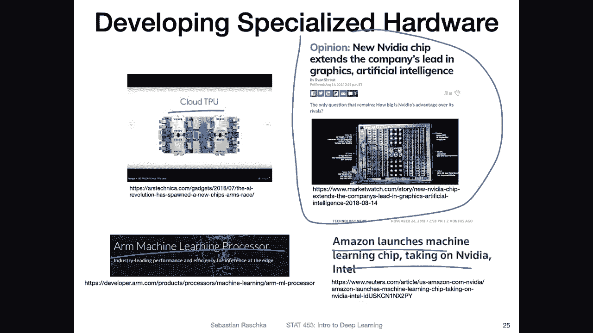

# 【双语字幕+资料下载】威斯康星 STAT453 ｜ 深度学习和生成模型导论(2021最新·完整版) - P17：L2.4- 深度学习硬件和软件一览 - ShowMeAI - BV1ub4y127jj

Yeah， as promised， I will keep this video short。 I want to briefly just outline a little bit about the deep learning hardware and software landscape。

So yeah， regarding hardware for deep learning， what has happened in this area， there's a lot of。

 yeah research going on in this area， but essentially most of it is still or most of deep learning is still done using GPus。

 So Nvidia is yeah advancing their GPUus every year。 There's a new model every year。

 actually a set of models。 So most people still use GPus for deep learning。 However。

Especially if you work at Google， they are also now cloud TPUus TpU stands for Ten sub processing unit。

 It's kind of like a specialized version of GPUus that are yeah better at certain tasks。

 I think I'm not an expert in this and actually never use TPUus because I have my own computers and TpUus I think restricted to Google Cloud servers。

 although as a user you can rent those but I think each TpU it's technically cheaper than a GPU but not as powerful。

 The power comes from the fact that you can combine a lot of them together。Anyways。

 Si armM is also working on machine learning processor。

 also the new MacBook I think has a arm processor in it which is kind of very competitive compared to GPUus。

 but it's more for prediction compared to training so。Right now， still GPUus are the status quo。

 Most people are using GPus。 But yeah again， other companies are also developing custom chips focused on deep learning just to make deep learning more efficient because if you think about the GPUus are really like inspired or come from the gaming industry。

 So they were not developed with deep learning originally in mind， however。

 they are very good at deep learning and nowadays and videodia also yeah develops chips that are especially only for deep learning not for gaming。

Yeah， and also， there is a new company called Graph corere。 I just saw that in a recent article。

 There's also now a。IPU， which is an intelligence processing unit。

 which is especially useful for graph neural networks。

 So you have CPUs which are very good at computing simple computation with scalar values like single values。

 GPUs are very good at working with vectors and these IUs are very good at working with graphs。

 It's also a new thing recently saw。

Regarding the software landscape， I don't want to talk about it too much。

 but I thought it might be interested interesting because you may also as a student learning now Pytorch wonder what the other libraries are and for example how it relates to Pytorch so。

Here's a nice summary from the deep learning with Pythwa book about the history。

 So yeah I remember back then I was using Theiano that was like before 2015。

 So in the first edition of my Python machine learning book I still used Theiano and approximately in 2015 Tens offlow came out by Google and yeah also lots of things have happened since then So back then lasagna and cars were highlevel wrappers around Theiano So highlel wrappers means making things more convenient because both tens of flow and Theiano were very yeah I would say lowlel languages they were not very easy to use like you could to do a lot of things they were very powerful but you needed to write a lot of code。

 So they provided lasagna and carras they provided more easier access。

But then yeah also cares extended its capabilities and also was made compatible with Tensorflow and C N TK。

 CNK was a deep learning library by Microsoft。 I'm not sure if it's still around I think it also stopped the development。

 Then there were other special purpose libraries like cafe chainer dit di。

 I think was yeah dynamic graphs， Chaer was also dynamic graphs Cafe was especially good for deployment like mobile devices and things like that。

 I think it was based on C++。M Xnet and so forth。 So there were many， many other libraries。 Yeah。

 but so what happened then in the next couple of years， a lot of people were switching to Tensorflow。

 So Siianno stopped actually the development。 So Siianno was a university based library。

And Tensorflow extended。 so they consumed cars。 So caras became a part of Tensorflow。

 I think the Cars developer started working for Google。 Then they hired him。

 and they were more tightly integrating tens of caras and Tensorflow， so。

Then in Tensorflow version 2， Kas became the default API for Tensorflow and they also added a e mode。

 which is similar to Pytorch yeah dynamic graph So Pytorch got the dynamic graph idea kind of like from a chain that's another library here and then TensorFlow also added it later on because it was really popular with the users of Pytorch and then in Tensorflowlow 2 nowadays as also an e mode。

I heard some people many people at Google don't really like working with Tensorflowlow anymore because it's a little bit clunky so there's also a new library called JX。

 which was developed at Google， so that's independently developed from TensorFlow and it's kind of like NI that can be run on the GPU。

Also as autograd and Giit capabilities。 it's a relatively new library。 it looks interesting。

 and I think you can do cool things with it。 but I think it's it's not where Pyr is right now with all the features for deep learning it's more like a lower level library。

 There are other libraries on top of it。 I forgot the name I think it's called flex which is like a wrapper arounds more for deep learning。

 but yeah again Pyr is really I think nowadays the most mature library that is also nice and easy to use So most researchers like we saw last week really use Pych because it's easy to use and I really recommend that as a beginner especially but also it's just like something everyone uses nowadays So that's nothing wrong with that。

 So Pyrch， the history of Pyr is that and they consumed cafe2 Cafe2 was again an independent project focused on mobile development and server deployment because Pych was more like a research library now it's both So it's good for。

Production on mobile devices and stuff， but also still for research。

was made way more efficient over the years， got O and an X support。

 which is a standard for exporting neural networks into a common format so you can actually export Pyrch models and import them in other libraries other deploy libraries and stuff like that and they actually added also graph mode。

 So in that way Pytch became more similar to Tensorflow by adding this graph mode and Tensorflow became more similar to Pytch by adding the e mode so they are both very。

 very similar nowadays。 Anyways， that's just a short history of software developed。

Over the years in the next last video of lecture2， I want to briefly highlight some of the current research areas and trends。

 and then in the next lecture we will get two perceptions。

