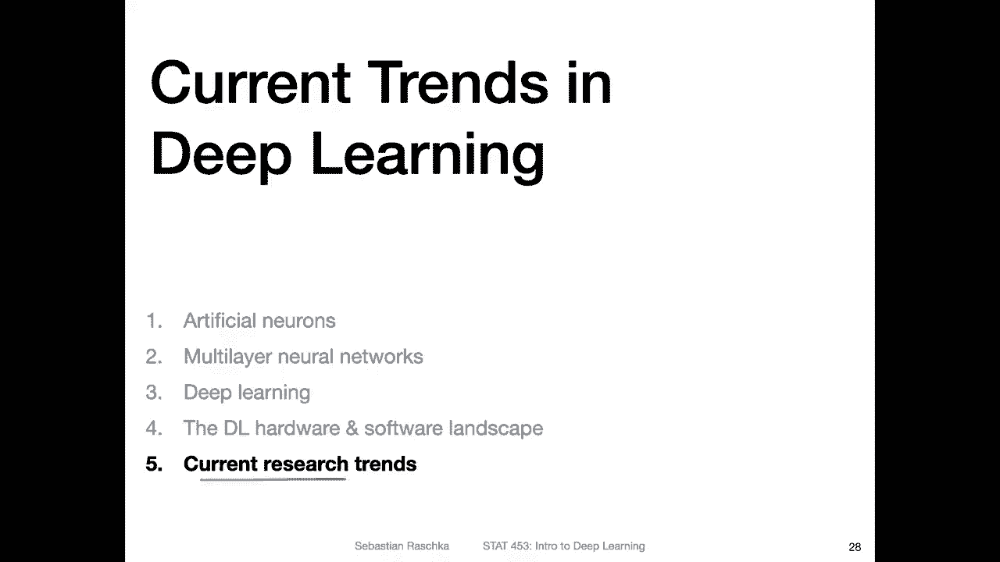
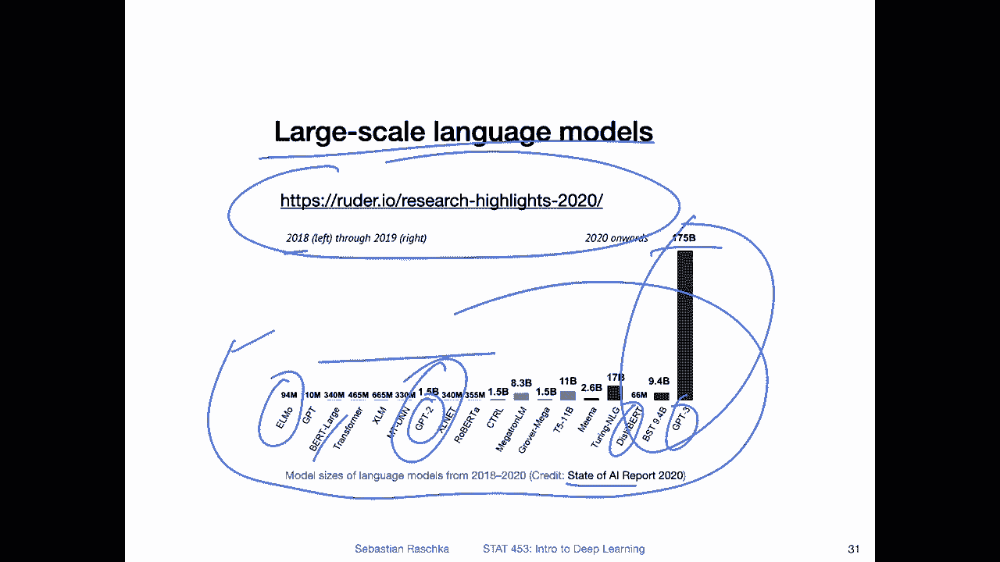
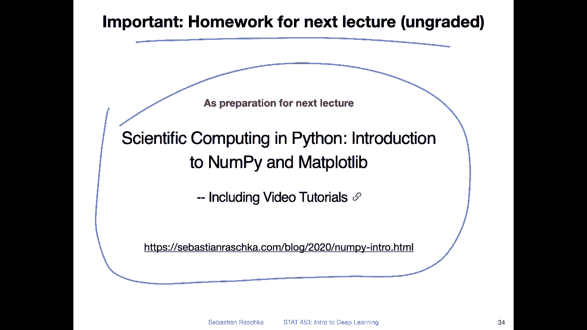

# 【双语字幕+资料下载】威斯康星 STAT453 ｜ 深度学习和生成模型导论(2021最新·完整版) - P18：L2.5- 深度学习的当前趋势 - ShowMeAI - BV1ub4y127jj

Yeah， I want to end this brief history on deep learning with a short video on the current research trends。

 things that became very popular in the last couple of years。

 So one thing that became very popular in the last couple of years was self-subervised learning。

 So last lecture I explained how self-svised learning works in a nutshell。

 So essentially it's about leveraging unlabeled data where you create some artificial labels that you can then use for supervised learning。

 but this is really for data sets where you don't have labels for your target tasks。

 So you would come up with tasks like separating an image into individual parts and then predicting the neighboring parts of an image。

 So if you have the phase of the cat and then an ear here and you show the network only the face the network should predict the prediction of the ear。

 whether it's here in the upper left corner upper right corner and so forth。

 And by that you teach the network to understand better the object structure of。

The cat， what a cat u looks like。Another thing I saw recently or last year a lot was contrastive learning。

 so this is a form of sales robust learning where you generate two versions of an image。

 So let's say you have an image of a house。It's maybe not a nice house， but you know what I mean。

 So it's a house like this。 So you feed it to the network here。

 and then let's say you have the same house that is maybe squeezed or let's say rotated upside down this house upside down and you feed it to this image to this network。

 So it's the same network。 but you yeah feed the image。

One time in the original position and one in some augmented version。

 and then the network has to predict whether it's still the same object or not。

 And so that you train the network to recognize that this upside downhouse is indeed the same object。

 But then if you， let's say， give it something different， let's say give it。A cat。

Image here or something like that。 you give the get image to the network。

 Then it should predict that this is indeed different from the house。

 So you train the network to also better recognize objects。 But here。

 notice you don't have class labels or something。 You just create the labels yourself by。

Augmenting this。 So if you augment this by rotating it， you know， it's still。The same house。

 So in that way， you created this label for free without having a human to label this data because you can do this all algorithmgically。

 Of course， this is not the target task。 you're probably interested in something else。

 but this is usually useful for pretraining a network before you can fine tune it to your target data set it usually helps yeah making a network better。

 But this is something that is yeah beyond the scope of this course。

 it's more like an advanced topic or something that is more recent we won't be using it in this course。

 It's like an optional topic。 but if you' are interested。

 there was yeah very beginner friendly article by Jeremy howt。

 which you can find here where you can learn a little bit more about sales voice learning。

 you can of course， experiment with it in your class project， if you like。

Another recent research trend is， yeah the focus on graph neural networks for graph structured data。

 so traditionally deploying was focused on text data and image data and nowadays also people work with graph neural networks if you have graph structured data for example。

 personally I work with molecules also like structures of small molecules and you can also think of them as graphs where you have the atoms connected by the covalent bonds you can think of it as a graph neural network。

And yeah， but I this is a big topic。 And also this would be a little bit out of the scope of this course。

 but I found a nice introduction to graph neural networks here。 if you are interested。

 there are so many papers I don't want to pick a particular one。

 but I think this is an interesting or beginner friendly introduction to the topic。

 So it's all kind of related to message passing also， So that would be another interesting thing。

Also a recent trend is the work on large scale language models so it started like in 2018 where people trained models with 94 million parameters and then they scaled it up you probably heard about GP2 was I think in 2019 now theres GP3 with 175 billion parameters so language models become bigger and bigger and bigger Of course there are also some research approaches that focus on keeping things small like distilled bird it's like a small version of B so in that way people yeah also make smaller versions of existing models。

But yeah， the trend is somehow going towards these bigger models。 Of course。

 this is something that is really out of reach for most academic researchers。

 This is something you would do at a big company。 I think I forgot the exact numbers。

 but I think this model just training it back then cost like $500000 or some crazy amount。

 So it's something you can only do if you if you have work in a very big company。 So yeah anyway。

 So here is also interesting or nice blog post summarizing the research highlights of 2020 focusing mostly on the natural language processing。

 This is where I also found this image， which I think is based on some other website。

 but this is also if you're interested in these large scale language models that would be interesting yeah read for you。

 we will be covering actually some of these。Models at the end of this course。

 when we talk about transformer models because they are all。

 yeah based on the transformer architecture。

Yeah， and another trend also recently read this paper here was Transers in vision。

 where people now also adopt these transformer architectures to computer vision。 So however。

 this is also really large scale。 So here， for example。

They say even like an image net like 40 million images is not enough to train a vision transformer。

 So its it's really yeah something that is mostly out of reach for academic research。

 And also these transform models they may work very well on very， very。

 very large dataset sets like 500 million images or something。 however， for most applications。

 convolal networks will still outperform them。 that was also recently just a new architecture of convol networks。

 So conversion networks are still status quo。 It's still what you would use in practice for computer vision。

 So it's nothing like it's very experimental。 It's nothing that is very close to being competitive with convolution networks on common images。

 but I just yeah I thought it was interesting and worth mentioning where things are going。

Alright， so in the next lecture， we will talk about the perception algorithm in more detail。

 and we will have some code examples in the lecture last week。

 I mentioned the code examples may come later， but I think it's maybe really useful to introduce it rather than soon rather sooner than later。

 So I have an ungraded homework exercise for you。 You don't have to submit anything。

 It's just for yourself。 So just to prepare yourself a little bit。

 So I already posted this in on canvas， but yeah， please really。

Take a look at this as preparation for yeah， the following lecture。

 it's like an introduction to N Python and Ny。 So of course。

 there won't be any questions in homework or exam on Ny really specifically。

 but it really will help you to understand how Pytorch works and how we implement code because it's really like the linear algebra Foundation here。

So yeah， if you have questions also about that， please let me know so it's just like a brief review of Nai if you are already familiar with Nai you can also skip that but yeah I would just recommend taking a look at it and see whether it makes sense to you if it's all new stuff you may want to read through that more carefully Allright。

 then let me know if you have any questions and then the next lecture on Thursday will be on the perceptron。

