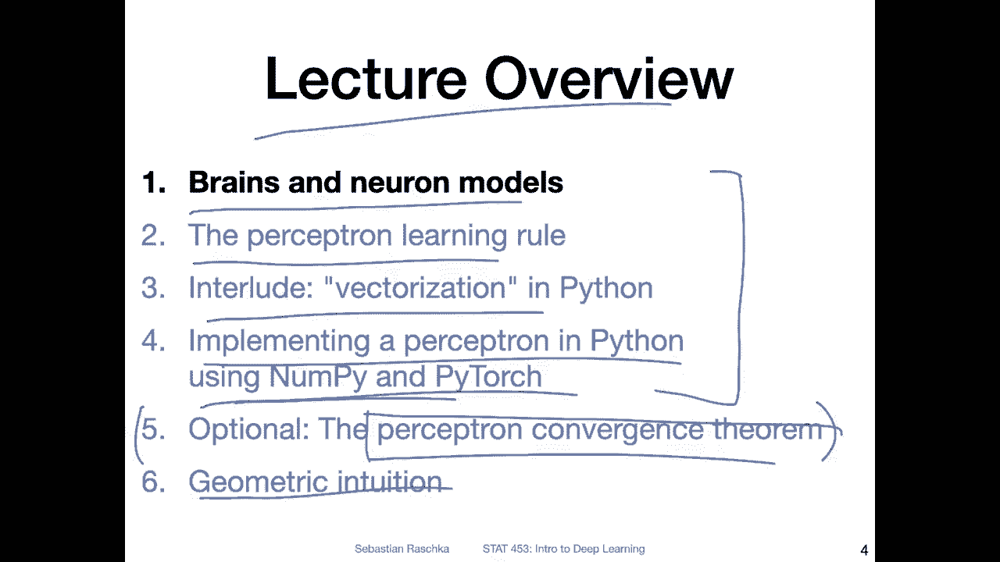
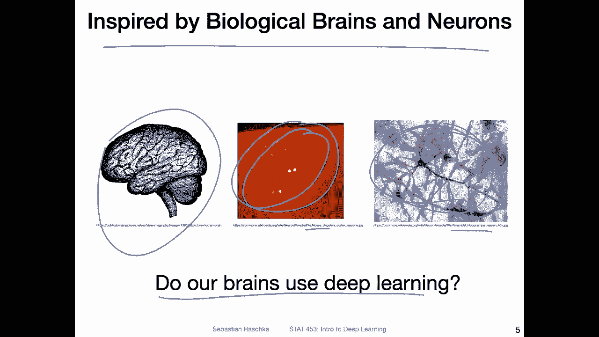
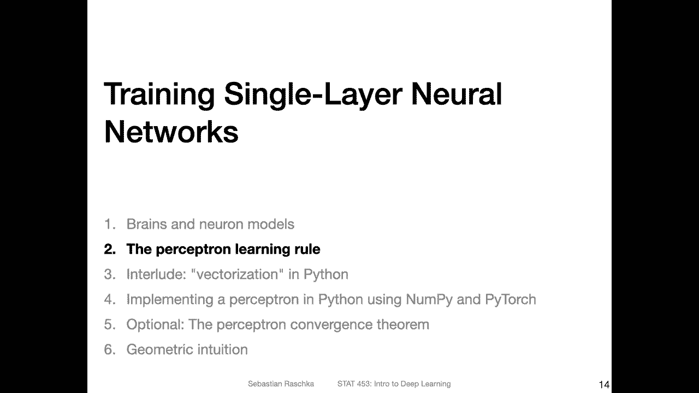

# P20：L3.1- 关于大脑和神经元 - ShowMeAI - BV1ub4y127jj

Yeah here's a lecture overview of all the topics we are going to cover today。

 so first in this video we will start with yeah the brains and neuron models just like a big picture overview and then in the next video we will talk about the Perceptron learning rule which is related to the rosenbl perceptron which we briefly talked about in the last lecture。

And then I will have a short interlude on vectorization in Python that is just like a quick note of how we can make your computational code in Python run more efficiently。

 so that is usually by replacing four loops with vector dot products because that's something we are going need in the next video when we talk about implementing a perceptron in Python using nuy and Pythtorch。

Then optionally I have a video or planning to make a video on the perceptron convergence theorem so I have to see how long these videos take whether we have time for that because to be honest。

 this is not like a super important topic so and I don't want to yeah talk about it for too long and then not having enough time for other topics in this class which I think are more relevant and more important here the perceptionceptron convergence theorem that's a mathematical proof it may be useful for some of you in other context but to be honest it's not really that useful for deep learning in the grand scheme So if we cover it or not it doesn't really matter for the rest of this course。

 So that's way we have to really see how much time we have and then lastly I want to give a brief intuition into the。

geometric aspects of the perceptron。 But it's one thing at a time。

 So let's start with brains and neural models。

So yeah like you recall from the history on deep learning things were inspired by biological brains and how neurons work so here's a picture of a neuron and then zooming in a little sorry of a brain and then zooming in a little bit these are some neurons in the brain I think this is actually from a mouses brain I took from Wikipedia and heres zoomed in version of a particular neuron here I think you can nicely see that neurons are connected to each other here and this neuron this is a specific type of neuron。

It's a pyramidal hypopocampal neuron， so it's a neuron in the hippocampus， a pyramid neuron。

 and there are many different types of neurons in in the brain。 So this is only one type of neuron。嗯。

Yeah， and also， the big question is usually， do our brains use deep learning at all。

 So in the human brain， is there some deep learning algorithm running， Actually。

 I don't think we can answer that with full certainty because people don't know yet how human brains work exactly。

 there are still many things that are not clear yet and many things that are still mysteries。

 However， I think we can confidently say， though， that it's probably not true because yeah。

 the brain is very complicated and deep learning， it performs well。

Certain tasks like object detection and so forth， but to be honest。

 the human brain and the capabilities of neural network are still very different。 So because yeah。

 we don't have artificial general intelligence， I think that is like an indicator that maybe maybe deep learning works differently。

 However， recall there was also this paper by Jo Hinton。

Where they looked at the different learninging algorithms。

 we briefly discussed that last lecture where they were the authors， it was not by Join and he was。

 I think the last author on that I think Lily Krepp was the first author and doesn't。

 but doesn't really matter。 So the the gist was that。

The brain may use a type of algorithm that is somewhat related to back proag。

 but even that was not fully clear。 so that still remains to be seen。But to be honest， also。

 it doesn't really matter that much whether the human brain does deep learning or not。

 because deep learning， the things we have are actually pretty efficient for certain things that we or some people care about。

 for example， object detection for object detection， classifying object and image。

 deep learning performs reasonably well， and it's kind of like similar to the analogy of。

The airplane。And how birds work。 So someone was inspired by， yeah how birds fly or in this case。

 geese and build the first airplanes。 However， it wasn't that important to exactly mimic the bird right。

 I mean， airplanes don't flap their wings。 And I think also if you would design airplanes that have flapping wings。

 it wouldn't be more efficient than let's say a airplane with flapping wings。 So that way。

 it's not always important to make something like exactly the same。

 sometimes it's just useful to take something。As an inspiration。

 and then you can develop things on top of it， but they don't have to be exactly the same to be useful。

But yeah just out of interest， I looked up on Wikipedia the number of neurons because one might argue maybe neural networks are not as good as the human brain in terms of doing certain tasks because the number of neurons is maybe be different where I look up the number here it says 16 billion 340 billion neurons and the human brain so here in this case we have 16 billion if I look at the killer wh it has 43 billion so。

I would say human brain or humans are more intelligent than whales。Also。

 we can't answer that with 10% certainty。 but that's my assumption here。

 So it it can't be just the number of neurons that make something more intelligent。 Also。

 if you think back of。嗯。The large scale language models that I introduced in the history of deep learning lecture。

 I think the big ones， they GP3 and stuff， you have to double check。

 But I think they had like 171 or 80 billion。notess in that or parameters。 So in that way。

 these models are actually even larger than the human brain in terms of the parameter。

 If you think of a parameter as yeah， like a neuron。 So that way。

 these language models are even more powerful in terms of the computation than the human brain or they are at least more more parameters。

 And these models don't really。Perform as well as the human brain does。

 One thing they perform well at is like memorizing information。

 So these largescale languages language models ingest lots of data from the internet like lots of documents and can kind of memorized them pretty well。

 And I think humans are not that good at memorizing things。 But on the other hand。

 humans are better at understanding which is something than these models lack。

 so it can't be just the number of parameters there must be something different。

 But what it is that has to be yet has yet to be discovered。Yeah。

 so in this lecture we are actually talking not about neural networks。

 we are talking about a single layer neural network or apology。

Yeah and also in this lecture we are not going to talk about multilayer networks and networks with many。

 many， many parameters， we are going to start simple talking about a neuron model so a model of the biological neuron like a computation。

 a model of the biological neuron。So just to recap what a biological neuron is。

 a neuron is a nerve cell。 So here's I circled one neuron where you have the cell core or nucleus。

 there are the dendrites where other neurons connected to and there as the exxon。

 the exxon is yeah where the signal gets transmitted。 So usually signal arrives at the dendrites。

 and it gets integrated or processed at the nucleus and then it gets transmitted。

If the neuro is activated to， yeah these。Yeah， endings， nerve endings。

 and they are basically connecting to dendrites of other neurons。

 So here are so called connections that are connecting to neurons and。Whetherather。

This neuron provides a signal or not to the next neuron really depends on what happens in the processing co here。

 which is something we will talk about。Yeah， the earliest neural model。

 the earliest mathematical neural model was the McClog pits model that we discussed in the history of deep burning。

 So just to briefly recap。 So here's approximately how it would look like。 So you have。

The inputs here。 So the x's are your inputs。 Let me more。Clearing here， these are your。Inputs。

And then you have certain weights here。 So these are my weight parameterss。

 And then this is our nucleus。 That's where the signals get integrated。 So it's a weighted sum。

 So you can also write it as let's say， in this case。If。We have X and M inputs。

 Then you can write it as。Follows where you have each。Input multiplied with each weight。

 So this is the weighted input。 And in deep learning。

 we usually call that the the pre activationivation。 we use usually the mathematical letter Z。

 We also call it。Sometimes the net input。 So that's more like a traditional term。So。

 and this value here is then passed onto a threshold function。

 And when the signal here reaches a certain threshold， then。Yeah。

 a corresponding signal gets transmitted。 So the binary signal。

 binary means a 0 or one in this context， so。0ero is transmitted if。The value。

 the weighted sum is below the threshold and the one is transmitted if the one is above the threshold。

 but we will yeah see that in more detail when we talk about the perceptron learning rule and the perceptron model。

So here's an example of an endigate that you can implement with this meallics and pit neuron。

 this is just a recap also from the last lecture， So if you set these weights to one then our weighted sum is just x1 plus x2。

And if the。Some is bigger than 1。5 than it returns a  one。In this case， because one plus one is 2。

 right？ So one plus 1 is 2， which is greater than the threshold。 So you return a one。And otherwise。

 you return a 0 because if only one of the two is one。Then you won't reach the threshold of 1。5。

 and then the output is 0。And this would this would be an end gate。 Similarlyly。

 you can also implement an R gate。 So here the threshold is smaller， so the weights are still one。

 So you're computing x1 plus x2 and compare that value to the threshold。If。Both are one in this case。

The value is 2， and 2 is bigger than 0。5。 So you return a one if one of the two。Is one。

 then also your value is larger than a threshold， right， Because 1 plus 0 is 1 is's greater than 0。5。

 So you also return a1 in both cases。 only if both are 0， then you return a0， because0 plus 0 is 0。

 So this is how you could use this concept of the Mcallic pit model， for example。

 to implement different first order logic functions。Yeah you can also implement a not gate。

 so I don't want to go into too much detail here， but yeah you can walk through this maybe by yourself and then another one as a take home exercise。

 can you implement a logical X or function in using this mac pit neuron so。

Here' is the table of an XR function， can you find weights here and can you find a threshold such that this simple model here can implement the XR gate as an ungraded homework exercise。

You can maybe post on Piazza in a few days to see whether， yeah this is possible or not。All right。

 so this was just a brief introduction， let's now talk about the perceptron model and the perceptron learning rules。

