# P21：L3.2- 感知器学习规则 - ShowMeAI - BV1ub4y127jj

Allright， let's now finally talk about training single layer neural networks and in particular the Perceptron learning Rule。

So that goes back to the rosenbl perceptron that we briefly mentioned in the history of deep learning lecture„ÄÇ

 so the perceptron is kind of like a model， but yeah thinking about it。

 the model was already proposed by maccolics and pits„ÄÇ

 the mathematical model of a neuron in the human brain So at least it was inspired by this biological neuron and the perceptron to be more I would say specific„ÄÇ

 it's a learning rule for the computational mathematical representation of the neuro model So this is now offering us something that can help us find the weights automatically to make classifications„ÄÇ

 for example„ÄÇSo previously we have seen that how we can manually implement end and or functions using specific weights of one and a certain threshold now with a perceptionceptron we can find automatic weights for different types of problems like classification problems in general„ÄÇ

 So here's a picture of how that looked like back then so back then the perceptionceptron was actually a hardware device where people Frank Rosenbloo had to plug in and plug out certain cables to reach certain decisions and stuff like that„ÄÇ

 So but yeah we are not in a museum here so we don't have to go over how that works„ÄÇum„ÄÇSo yeah„ÄÇ

 moving on„ÄÇ So I also should highlight just for correctness„ÄÇ

 there are multiple perceptron algorithms„ÄÇ and I don't know how many„ÄÇ

 but there are several variants here we are talking about， let's call it the perceptron。

 So a basic version of the perceptron， which is now the commonly yeah known variant。

 So when we talk about。The perceptionceptron， in theory， it's a perceptionron。

 one of the classic rosenbl perceptioncepts。 But yeah， there are multiple ones。

 We don't have to worry about it here„ÄÇ We just take the classic one that is commonly known and just refer to it as perceptron for short„ÄÇ

 So yeah， now we have a computational model of a biological neuron here。 So for reference。

 you on the left hand side„ÄÇ What is shown is the biological neuron„ÄÇ And on the right hand side„ÄÇ

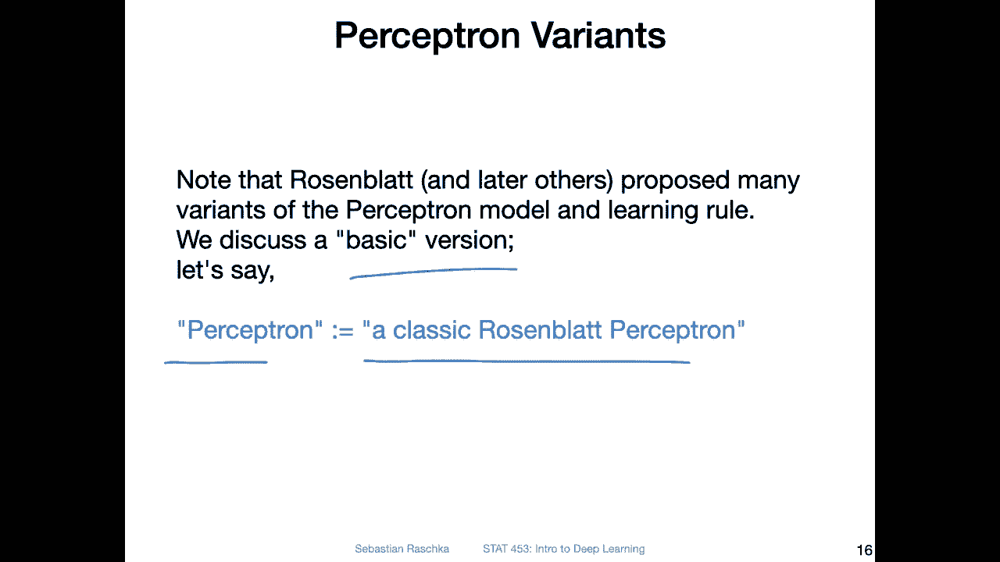

Would be the computational or mathematical representation of that？

So the one based on MacClic and Pi's idea， and that is also then the model that we are going to use in the perceptron。

 so the perceptron learning rule would be then learning the parameters of this model„ÄÇ

So how does this model work， So what we have here are the inputs x1 to XM。

 and you can think of it as yeah a feature vector， for example， if you think back of the Iis data。

 So in the Iis data， we had a tabular data where we had petal length let's do it correctly Sal length。

 Sepal width petal length and petal with the four features„ÄÇ

And then we had the number of training examples， so  one，2，3，4， and so forth。And in this case。

 we had。M features where m equals4。 So here as x 1， x 2， x M。

 you can really think of it as a feature vector， for example。

 a feature vector corresponding to the first training example„ÄÇ

 and then each feature value gets multiplied by a weight so you can see„ÄÇ

Each X here goes together with a weight„ÄÇ So they are multiplied to compute the so called net input the weight to sum„ÄÇ

 So this is„ÄÇWaited„ÄÇSome which you compute„ÄÇW I times X I„ÄÇ And this is then our what we usually use„ÄÇ

 or we usually use the letter Z for representing that to have it more compactly„ÄÇ

And then so this is an input here and then we pass it to a threshold function and a threshold function is returning a class label„ÄÇ

 so the class label is either0 or1， depending on the value of z。

 So if z is smaller than the threshold then we return the class label 0 and if z is greater than a threshold„ÄÇ

 we return class label 1„ÄÇTo be more precise if Z is smaller or equal to the threshold„ÄÇ

 but if we use floating point operations like real value numbers in a computer„ÄÇ

 then the chance that something is equal is very small because it could be also equally greater or equal to so in then case we could remove it here„ÄÇ

 So it's what I'm trying to say is whether we use0 smaller than and greater equal to or„ÄÇSmaller„ÄÇ

 equal to and greater doesn't really matter either„ÄÇ

 either way would work because the chance that we have an equal is kind of yeah very small， anyways。

So again our output， this is the either the0 or the one that is our class label and now we can yeah then talk about a learning rule for this perceptron that can then be used to determine a good threshold and a good good values for W so that we can solve different classification problems。

 for example， classifying flowers in an iris dataset However one shortcoming here is that this is only for binary labels so0 and1 and in iris we have three flower classes So if we would want to use the standard perceptron for iris we would have to simplify the data to only two flower classes。

 but we are getting ahead of us elsewhere so„ÄÇAlso here at the bottom edge I see another equation I included„ÄÇ

 So this is also abbreviating the threshold„ÄÇ So the threshold based on the threshold function based on the threshold theta if it receives basically the in weighted input„ÄÇ

 So this is the net input„ÄÇIt returns the predicted classible Y hat„ÄÇ So Y hat„ÄÇ The output is the„ÄÇ

Predicted„ÄÇClass label„ÄÇI will show you how that looks like for a concrete data set later on„ÄÇ

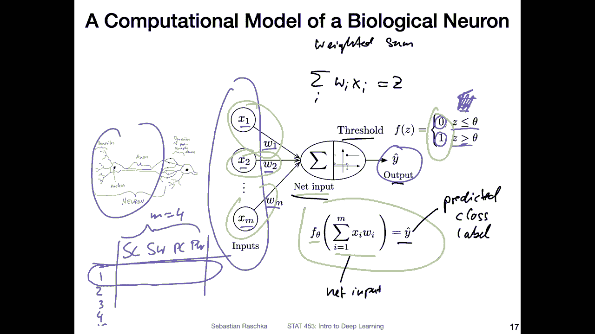

Yeah here to recap some of the terminology that I already introduced in the previous slide„ÄÇ

 I made an overview slide because some of these symbols and words or terms will be used later on in this course when we talk also about logistic regression and multilayer neural„ÄÇ

We have the net input， which is just another word for the weighted inputs and we usually use the symbol or letter Z for denoting that the activations these are values from activation function So an activation function takes the net input as input and we use the letter A and the activation function is a sigma which takes in Z so this is something that we will be using over and over in this course and then the output of a model that is when we apply the threshold to these activations of the last layer of a neural network and we can。

 for example， use Y hat to denote the predicted label or the output。And F as the threshold function。

 which takes an a。 So the flow would be， you can think of it as。First computing。 So if we go from。

Zip„ÄÇSo we have Z as the weighted net input„ÄÇ So this is computed based on x and W„ÄÇ

 And then we use sigma and activation function to compute these activations„ÄÇ and then we have„ÄÇF„ÄÇ

To a compute„ÄÇThe label outputs„ÄÇSo this will become also more clear later because right now„ÄÇ

We have a special case in the perceptron where our activation function is the same as the threshold function„ÄÇ

 So the perceptron doesn't really have an activation function they are here in that case synonymous and in linear regression there's another special case„ÄÇ

 so some of you are probably familiar with linear regression„ÄÇ So a linear regression„ÄÇ

 the activation is equal to the net input and it's also equal to the output„ÄÇ

 So in that way yeah these are two special cases and it will become more clear„ÄÇ

 so I can maybe quickly draw this„ÄÇ So if we have„ÄÇA linear regression model recall what we had in the history of deep learning lecture and also in the Piazza discussion„ÄÇ

 the relationship or the figure that I shown of the aline and then also how that related to the linear regression so„ÄÇ

If we have then the model here in a linear regression， we would have a linear activation。

 or just the„ÄÇThe weighted sum„ÄÇ And then the output is just the weighted sum„ÄÇ

 It's our continuous value。 In a regular neuron， we have usually the steps we have the weighted sum。

 So this is our net input。And then， we have。嗯。Actation function。And then， we have。Threshold function。

 And then this produces our output， however。In the perceptron。 So in the perceptron。

 these are the same„ÄÇ the sigma and the threshold function„ÄÇ they are one function„ÄÇAnd in the„ÄÇÂóØ„ÄÇ

Linear regression model。 So in the linear regression model， we don't have these。

 So the net input is basically our Y head。So there are these special cases。But， let's。

Not worry about it too much because we will be talking about linear regression and logistic regression later on in more detail„ÄÇ

 so you will see how these concepts of activation functions and thresholds relate to this„ÄÇ

So let's focus in now on the perceptron and only worry about the net input and the threshold where„ÄÇ

In the bottom here， you can again see the summary where we have first weighted inputs as the net input。

 And then we apply the threshold to return either the 0 and one„ÄÇ

 depending on the threshold yeah value on theta„ÄÇ

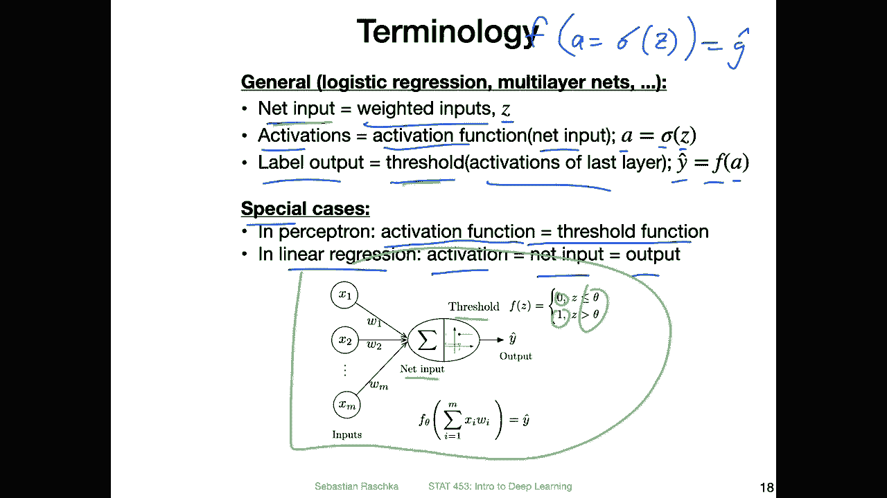

So„ÄÇI want to make one little change to that formula to make things a little bit more convenient„ÄÇ

 so I just told you that we return0 if z is smaller or equal to theta„ÄÇ

 the threshold and the output is1 if z is greater than theta it's a little bit inconvenient to write it like this well I mean it's not that inconvenient„ÄÇ

 but for the sake of training the perceptron it would be more inconvenient„ÄÇ

So we will make things a little more convenient by rearranging the terms„ÄÇ

 So we are just now applying a mathematical operation minus„ÄÇTheta on both sides„ÄÇ

 So we are bringing theta here onto the left side„ÄÇ And then what we get is we return 0„ÄÇ

 If Z is smaller， if z minus theta is smaller equal to 0 and we return  one。

 if z minus theta is greater than 0。 So in this way， this is our。

I would say more convenient notation here„ÄÇ and if you think about it like that„ÄÇ

 you can think of the negative threshold„ÄÇSo this part here you can think of it as a bias so this is like a common term in deep learning or also a machine learning„ÄÇ

 a bias unit， it's a little bit weird to use the term bias because it's a little bit overloaded there are other types of bias for example there's an inductive bias like this relational inductive bias that we talked about there's also a fairness bias and now we have less bias mathematical bias unit here there's also yeah a statistical bias if you think of decomposing a loss function into a bias and variance term so it's a little bit unfortunate but yeah in the context of deep learning if you read the term。

B is the unit。That would be， in this case， this this theta we can treat it as a parameter will become more clear in a few moments。

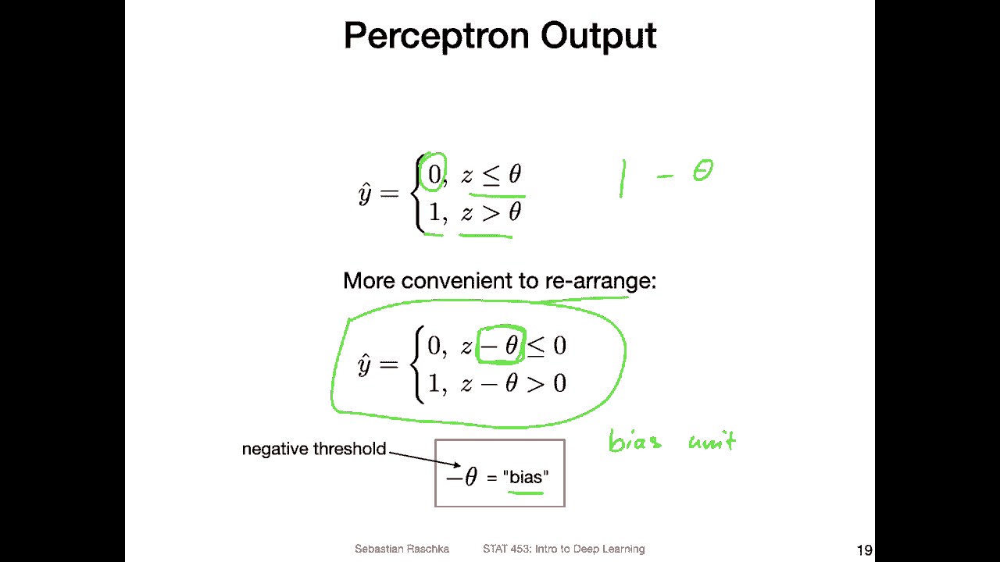

Yes， so in this representation， we are now using the bias as a parameter when we compute Z。

 So we set the minus theta to B B is short for„ÄÇBas unit„ÄÇ So it's easy to memorize B for bias unit„ÄÇ

 So we set B equals to this minus theta， and then we compute the Z， the net input as shown here。

 So just to recap what we had before was„ÄÇMultiplying„ÄÇThe ws and the xs„ÄÇ So this is from index1 to n„ÄÇ

And this was our Z now。When we compute the Z， let's call it。Let's make that red to denote this onusy。

 This includes now our bias unit„ÄÇ So our net input is now including the bias unit„ÄÇ

 If we want to update the figure to reflect that， I have drawn here this B。

 this B goes now also into the net input„ÄÇ So the net input is really this computation here„ÄÇAnd„ÄÇYeah„ÄÇ

 it's also the same as shown here„ÄÇ And now what we can do is we can also write then„ÄÇÂóØ„ÄÇ

The activation function， or here the threshold function。 So I should have actually used。F。

 but the perceptionron is the special case where the threshold function is equal to the activation function so I can use either sigma or F doesn't matter here„ÄÇ

To be consistent„ÄÇ And so now we can have the0 here on the right hand side instead of having the minus theta„ÄÇ

 So this will make more sense from a learning perspective„ÄÇ So in this way„ÄÇ

 it's easier to parameterize the network if we don't have to learn the threshold here on the right hand side„ÄÇ

 It's just easier to write in code„ÄÇBecause then we have a threshold function that just simply checks whether something is greater or smaller than zero„ÄÇ

 but of course you can also implement it like shown on the previous slide with a minus theta it doesn't really matter but this is also the common notation and this will be something that you will also encounter when we talk about multilayer perceptrons convolutional networks recurrent neural networks and when we use existing code implementations„ÄÇ

 for example in Pytorch， this is really like the common way also if you look at recent deep learning papers so this is like like I said。

 the common notation that you will find in most modern texts like maybe not textbooks because textbooks are usually a few years behind with utter but if you look at modern deep learning literature you will find that people use as extra this notation with additional bias unit here„ÄÇ

Yeah， however， it's slightly inconvenient for mathematical notation compared to a slightly different notation again。

 so on the right on the next slide I will show you how we can modify this even a little bit differently to have the bias as part of the inputs„ÄÇ

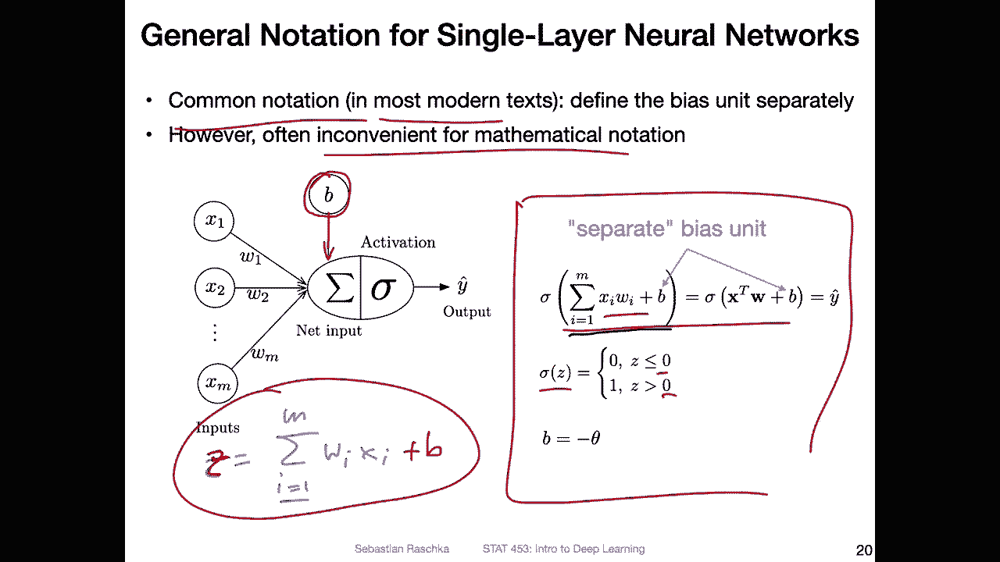

So here what I've done now is I'm setting b equals to weight„ÄÇ I call that w0„ÄÇ

 and this is again our minus theta or minus our negative threshold„ÄÇ

Now I'm including this bias as a weight。First， let's maybe start with a figure。

 if you look at the figure here on the left hand side„ÄÇ

 what I have now what I've done now is I have removed this B here„ÄÇ I have removed that„ÄÇ

Compared to the previous slide and now have the value 1„ÄÇ

 this is really like a value and integer Well float number of a value 1„ÄÇ

 And then now I have the w 0 as weight„ÄÇ So this is essentially our bias„ÄÇ

 but I'm writing it as a W because then we can write this notation more compactly„ÄÇ

 So instead of writing„ÄÇIt on the previous side with index over one„ÄÇTo M„ÄÇLike this„ÄÇWith a W with a B„ÄÇ

Or you can also。Write it as as this instead of this， I can change。This to a 0。

 and then I can get rid of it„ÄÇs slightly more compact„ÄÇ It's not that interesting to do it like this„ÄÇ

 but as one advantage of doing it is is the advantage is that we can now use a dot product just x transpose w„ÄÇ

If we wouldn't have the„ÄÇModified version here„ÄÇ What we would have to do is we would have to write it as x„ÄÇ

Transpose。W plus B， which is just slightly more work。 It's not that much more work。 but yeah。

 mathematicians are sometimes efficient or lazy。 No， I would say not lazy， definitely not lazy。

 but efficient„ÄÇ So the notation here shown would kind of help us to make things a little bit simpler„ÄÇ

So why am I telling you this So this is something this notation here on this slide is something you will find in some almost textbooks actually„ÄÇ

 whereas this is， I would say the more modern one， I mean， for for things like this。

 it might be overkill to use as separate bias so this looks simpler„ÄÇ

 But when we talk about multilayer networks actually this becomes more convenient and this is also what most framework use And the reason why this is more convenient is„ÄÇ

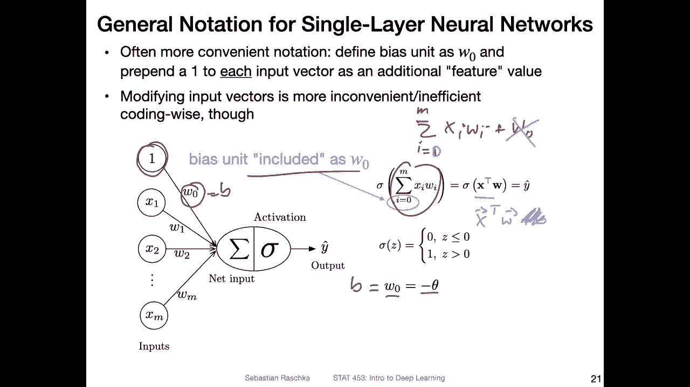

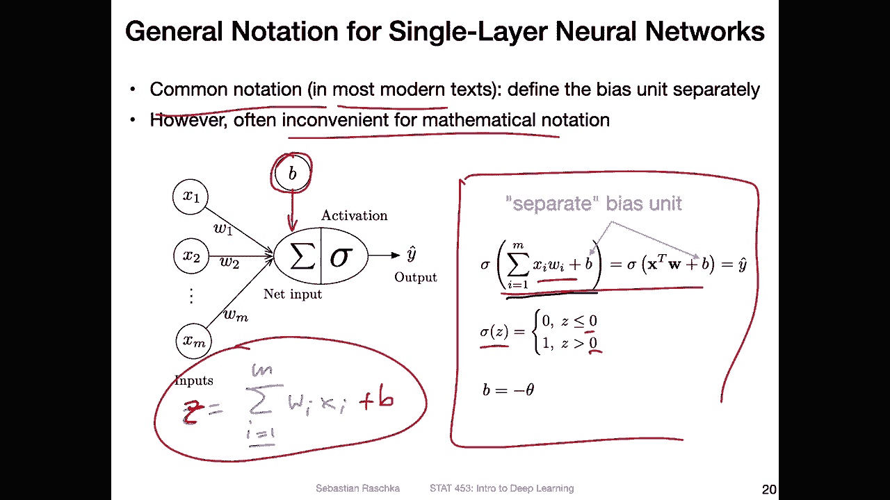

Becauseuse going， I don't want to switch too much because it probably gets confusing when you watch this video and I'm going left and right and left and right。

 But one more thing about this slide is if you want to use this notation„ÄÇ

 you have to modify the inputs here right。 So if you think of the iris example， you have x 1， x 2。

 x 3 x 4 as your feature vector for one training example„ÄÇ So this would be your let's say„ÄÇ

First training example。Now， if you。Have this as input and you want to use this notation。

 what you might have to do„ÄÇ What you would have to do is to have you have to have one here„ÄÇ

 so you have to modify this list。 So in practice。Usually， you have。Fixed size array。

 And then you would have to make a new array„ÄÇ That's how how it would work in a computer„ÄÇ

 You would have to make a new array that is a little bit bigger„ÄÇ

 And then you have to move all the values you have to„ÄÇLet me use different colour„ÄÇ

 Maybe if have to make a X 1， x 2。Let's start with the one， put the one here and then the x 1， x 2。

 x 3， x 4。 So we have to make a new array to make the the one fit into this array and making a new array can be expensive。

 Of course， it's an additional computation。 It's just much simpler if we just add this B to it if we compute it as x transpose W plus B。

 This is„ÄÇComputation is actually simpler than adding a new value to an array„ÄÇ

 because then we have to make a copy of the array move all the values over„ÄÇ And this is something„ÄÇ

 Yeah， it's a computational consideration， essentially。

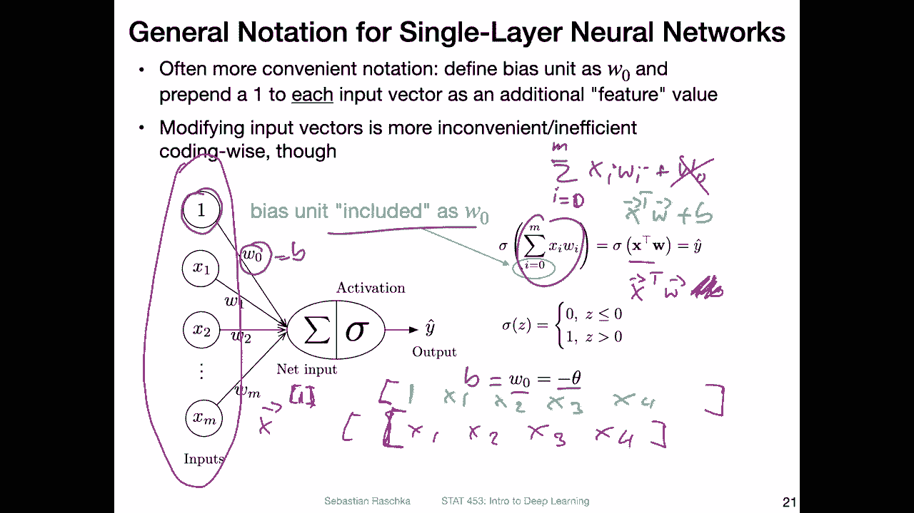

Yeah， I'm not exactly sure what I wanted to show on this slide。

 I think I just wanted to emphasize again that we can now use a dot product„ÄÇ Alright„ÄÇ

 so this is our general framework„ÄÇ and now we are going to take a look at the perceptron learning rule„ÄÇ

 So how it actually learns the weights to classify classes„ÄÇ

 So assume we have a binary classification task„ÄÇ So here we have two classes„ÄÇ

 these blue dots and the yellow or no orange„ÄÇ

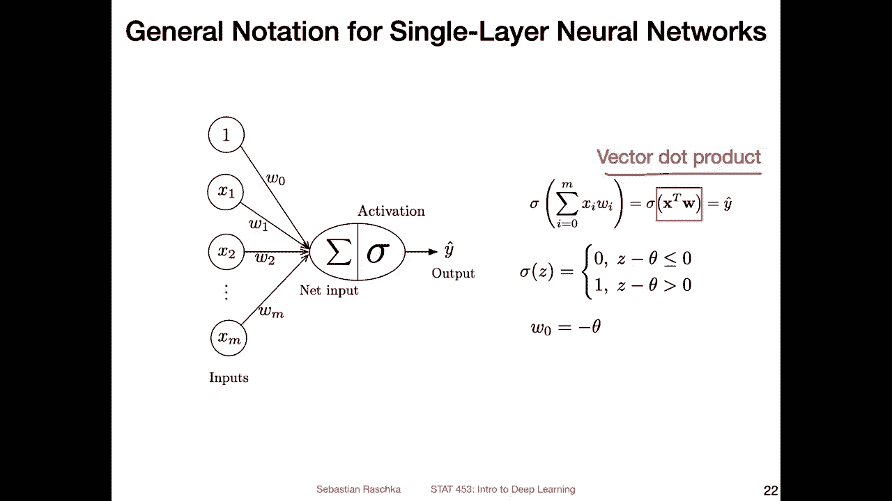

Squarees and the perceptron finds the decision boundary„ÄÇTo classify these two classes„ÄÇ

 if the classes are separable by that， I mean， if there is a linear decision boundary。

 I should have maybe be said。Linenially。Separable， that means there has to exist a decision boundary that can separate these classes perfectly。

 Then the perceptionceptron is guaranteed to find it。 So here， just looking at it。

 may guess a decision body could potentially look like that„ÄÇ

 And then it will perfectly classify these two classes„ÄÇ So this is a„ÄÇÂóØ„ÄÇ

Problem with only two features for simplicity， because if I have more than two features。

 it would be very challenging to draw it in a slide„ÄÇ So in this case„ÄÇ

 we only focus on this simple example„ÄÇ And I actually made an animated give here„ÄÇ

 I will play it in a second„ÄÇ And then you can see how the network or the„ÄÇ

Pceptron goes about the task of finding this decision boundary„ÄÇ So starting at a random place„ÄÇ

 it will basically update the rule in each iteration„ÄÇ

 So there will be an iteration counter moving up by and it will try to adjust decision boundaries to make them better basically„ÄÇ

 So let's take a look。Actually， I forgot how many iterations there are there might be 20 or 30。

 So you can see it's still making mistakes and the circle that is shown here that is indicating which data point it currently looks at„ÄÇ

 So you can see it's this black circle it's moving around because we have shuffled the data set and then it will look at one training example at a time„ÄÇ

 And if it finds that there is a misclassification， then it will move the decision boundary。

 So if it right now you can see it always finds classes that are already on the right correct side of the decision boundary So there are known updates are necessary„ÄÇ

 what it has to find are the ones where it makes mistakes like this here„ÄÇ if it touches these update„ÄÇ

 So if it touches these then it will update„ÄÇ So yeah it's back to one„ÄÇ

 So it was a little bit fast let me move on though„ÄÇ

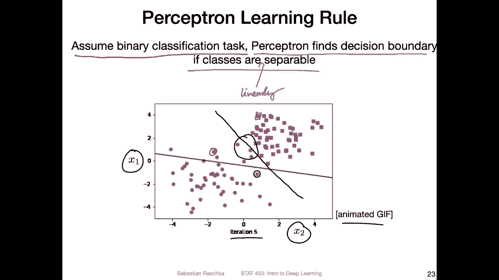

So yeah， what you can see here in the lower left corner is the result。 yeah it was 49 iterations。

 So here is the final decision boundary， how it looks like and you can see it yeah it classifies those two classes。

 say class。0， and。Clas 1 perfectly Now though it's only guaranteed to converge if a solution exists。

 So if there is no solution to that， for example， if I have a blue dot that is here。

 there would be no decision boundary where you can classify the data perfectly and what will happen is if the perceptron encounters this point it will move the decision boundary more to to this side so„ÄÇ

It may even move the decision model that's say to here„ÄÇ But then all the other points are wrong„ÄÇ

 So it's moving it back here。 But then again， this blue point is wrong。

 and it's going back to the righthand side„ÄÇ So it's always like flipping back and forth So if the data is not perfectly separable„ÄÇ

 then it will never stop to converge later in this course， of course。

 learn about algorithms where this is not the case where it will always converge to at least some solution it will at least stop updating because I mean„ÄÇ

 this is a big issue„ÄÇ If you have a real worldor data„ÄÇ

 classes are rarelyparable by a linear decision is's usually always a case where you can't separate things perfectly and it will be very annoying if your algorithm makes these big jumps back and forth„ÄÇ

 So the underlying algorithm， for example， it will converge even if。

Classes are not linearly separable， and we will yeah， learn about this and not too distant future。

 But for now， let's stick with the perceptron learning algorithm just outlining how it learns。

 So there are three scenarios„ÄÇ It's one scenarios if is if we make a correct prediction by that„ÄÇ

 I mean， if the predicted label my head is equal to。The target label。 So for that。

 we can also have two scenarios if the if。My head is one， and。喂。😔，This one。

 or if the predicted label is 0， os， sorry。

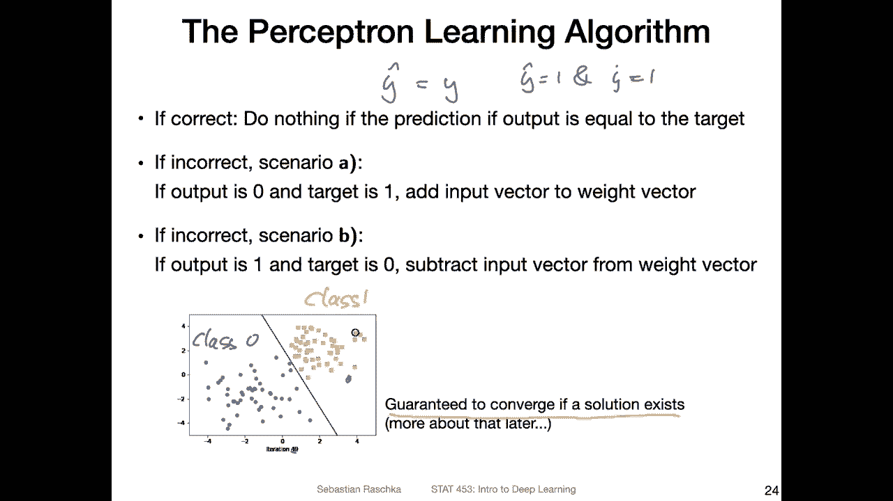

Some the jump here， the predicted label is a0。

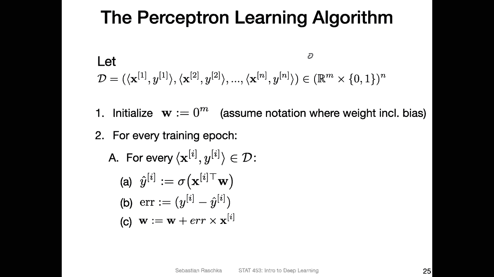

And。😔，The actual label is also 0。 Then we are correct。 and then we don't have to do anything。

 So if both the prediction of the output are equal„ÄÇTo the targets„ÄÇI think this word is extra„ÄÇ Okay„ÄÇ

 and there are now two scenarios A and B， where things have to be updated。 It's if we are incorrect。

 So one scenario is„ÄÇWhere my head is„ÄÇ0 and y is equal to 1„ÄÇSo in this case„ÄÇ

 what we do is we add the input vector to the weight vector„ÄÇ So we update it like that„ÄÇ

 So that means„ÄÇLet me draw this maybe as an example„ÄÇ So if we have„ÄÇSee data the points here„ÄÇ

Data points here„ÄÇ all that is„ÄÇSpread them a little bit on„ÄÇ It's easier to draw the decision boundary„ÄÇ

 So let's say。Blue is。0 and yellow is。One， in this scenario here。

 what we have is we have the prediction as0， although the true label is1。 So， for example。

 if for a decision boundary like that， and we encounter this data point。

 what we have to do then is we have to move things over here„ÄÇ

 It's by adding the input vector to the weight vector„ÄÇWhy is that„ÄÇ

 I will show you exactly why that is later when I go over the geometric intuition and it will become clear why we have to add the input vector to the weight vector rather than subtracting it„ÄÇ

The other scenario is if the output is 1 and the target is0 and then we subtract the input vector from the weight vector„ÄÇ

 so there are two update rules here going on„ÄÇ

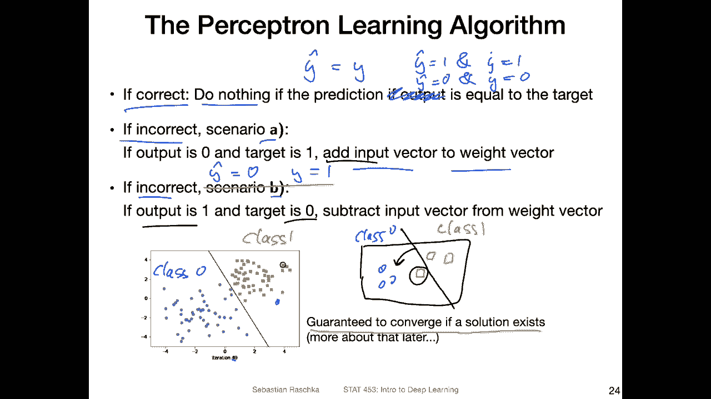

They are both very similar。 We can write this mathematically， very compactly， as shown here。 So here。

 assume we have a data set D。 This is our。Training。😔，Data set。

 So we have n data points here from one to n„ÄÇSo x our feature vectors and y are our class labels„ÄÇÂóØ„ÄÇ

Yeah， so this is our data set and now here that's the perceptron learning algorithm。

 So how does it work first we initialize the weights or the weight vector to zeros if we have M weight vectors that will be a vector of zeros„ÄÇ

And we are assuming the notation where the weight includes the bias„ÄÇ

 so we don't have to write the bias separately„ÄÇ We could do that„ÄÇ

 but it would be a little bit more work here so it would be a little more robust„ÄÇ

 So there's a little bit more compact here so。Then， we have。AF pie for every training epoch。

 What is an epoch epoch means„ÄÇPass over„ÄÇThe entire„ÄÇTraining„ÄÇüòî„ÄÇ

SetSo if I have a training set like shown here„ÄÇThen an epoch would be„ÄÇ

Processing every data point in this data set。 So for example， I consider the first data point。

 I do my computation。 then I consider the second one。And so forth， until I reach the last one。

And then„ÄÇThis is one epoch when I reached this last data point and I have completed one epoch„ÄÇ

And then I may go back to the beginning and do another„ÄÇSweep over the dataset„ÄÇ

 that would be then the second epoch and so forth„ÄÇ So epoch really means pass or iteration over the dataset„ÄÇ

So then this is our also loop， so for every training apoch。

It's auto loop then inner loop is for every data point in the data set。We perform steps A， B and C。

So„ÅÜ„ÄÇIf we have multiple epochs that means we can do this multiple times„ÄÇ

 so we would just go back to the beginning of the training set and do it all over again„ÄÇ So„ÄÇ

 but yeah， the interesting part happens now for every data point。

 So note here the perception processes。One data point or training， let's say。Wen。Training。😔，Example。

At a time„ÄÇSo for every training example„ÄÇCompute the prediction„ÄÇ This is our prediction„ÄÇ

And it's computed by computing the weighted。Some， this is our net input。Soces let input zine。

And this is our predicted label， and then we compute the error。So， the error is computed by。

The true label minus the predicted label。 Why is that？ So if this is one and this is y hat is 0。

 for example， then so let's first， let's assume the simple case where we make no error。

 So if we have。0 and 0， then the arrow is 0。And then， if you look at。Rll C here。

We have the weight update„ÄÇ so C as the weight update„ÄÇ

Then the weight update or the new weight is the old weight plus the error times the input vector„ÄÇ

But if the error is 0， if。The prediction is correct here，0 minus 0，0。 Then we can cancel this term。

 and there is no weight update„ÄÇSo let me clear this a little bit here„ÄÇIf both are one„ÄÇ

Then the error is also 0， and then we can also cancel this term so we can see the weight update only happens if we have an error。

 if we make a prediction error。And then。Now， let's consider the case where we have a one and a 0 here。

 So then the。Errow would be。When。Here， so we would have an arrow of one。And then， we would be。

Adding the way director„ÄÇ So if we have„ÄÇThe case for the predicted label is a 0„ÄÇ

 And the case for the true label at  one。 This is when we are。Adding， adding something， right。

 So we are adding the feature vector here„ÄÇ So this is exactly like the case that we have here where„ÄÇ

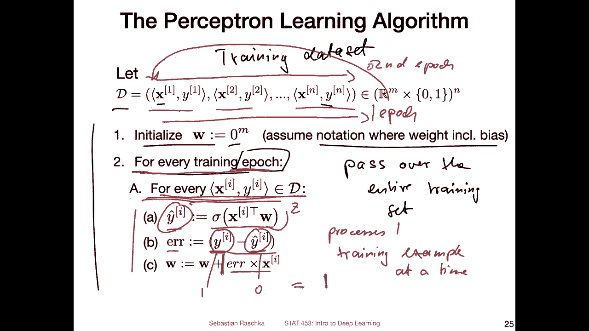

Y head is 0？

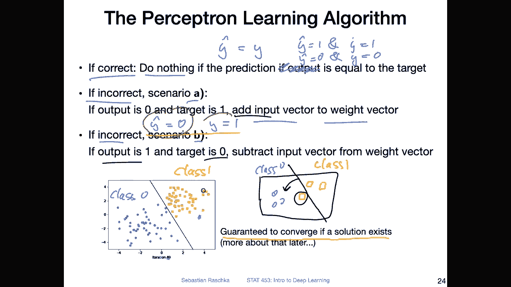

And why is one this is the same case here。Now， let me。But I can't delete if I。Switch slides。 Okay。

 so then let me write it like this with a different colour„ÄÇ So if we have the last scenario error0„ÄÇ

And one， then our arrow is -1。And in this case， if this is -1， we are。Subtracting， right， So W minus。

X 1， So we are subtracting the feature X I。 We are subtracting the feature vector， which is equal。

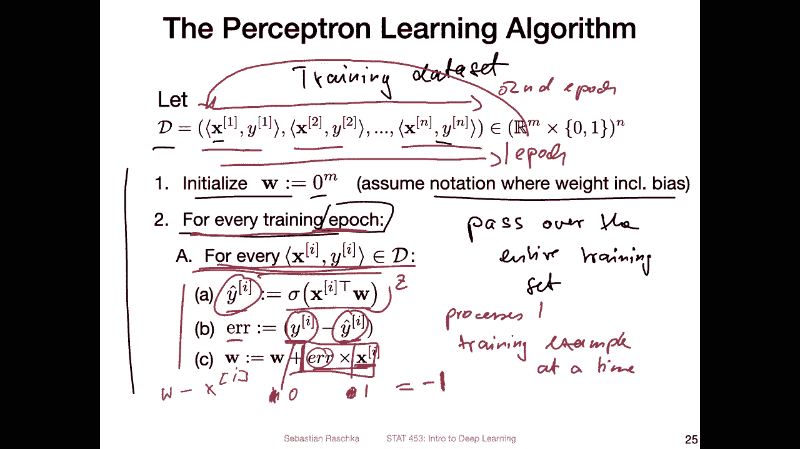

To this„ÄÇ

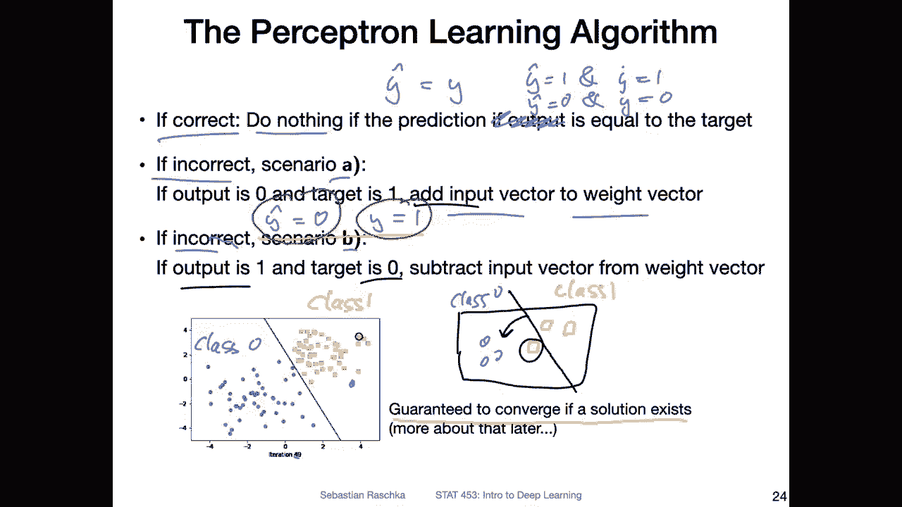

So right， to， to this case here where we are subtracting the input vector。

 So here this is really just a mathematical summary of the slide that have shown you before„ÄÇAlright„ÄÇ

 so I think if this is confusing， maybe look at that more slowly and then in the next video I will show you vectorization in Python and after that I will also show you how to implement a perceptor and Python using Npy and Pythtorch。

 which will I think make this video more clear„ÄÇ So what we just have discussed„ÄÇ

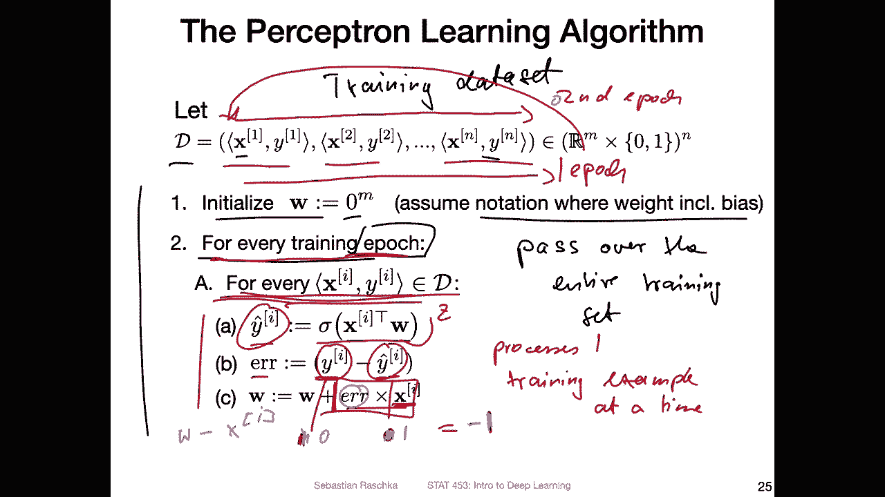

If this is still complicated， I would look at it a little bit more slowly like step by step and then maybe don't worry about it too much because we will implement it in code and after that I think it will be really clear。

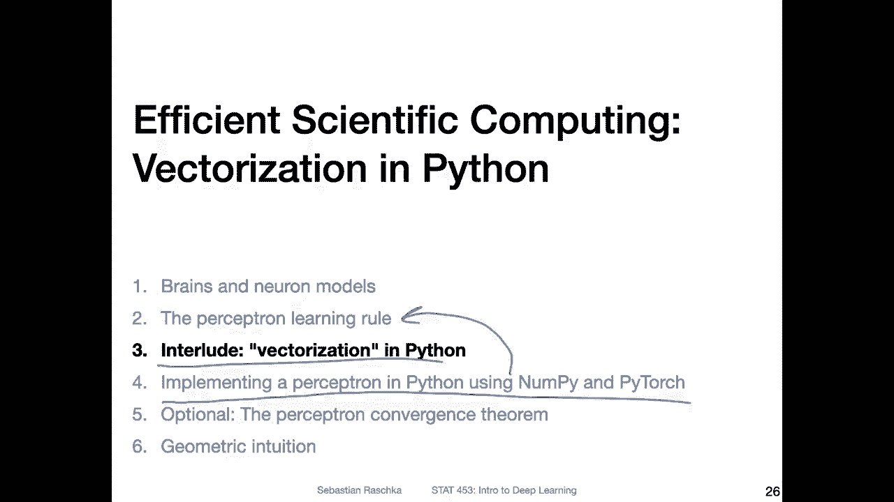