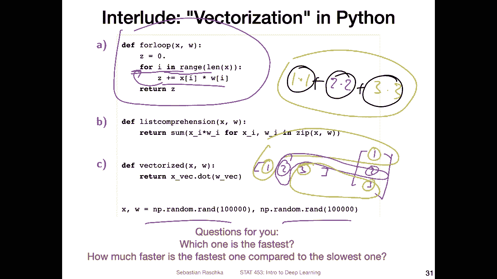
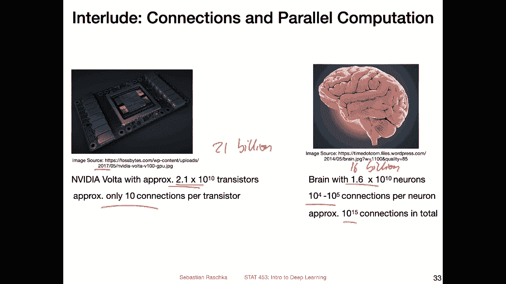

# P22：L3.3- Python 中的向量化 - ShowMeAI - BV1ub4y127jj

Yeah， in this video， I want to talk a little bit about making scientific computing a little bit more efficient。

 using a concept called vectorization in Python。 So why am I talking about this right now？

 So the reason is because in the next video， I want to show you an implementation of the perception in Python using nu and Pythtorch。

 And I will make use of this concept of vectorization in the next video。 So here。

 I just want to give you some background information on that。 So now in general。

 running computations is a big part of deep learning。 So deep learning is a very applied field。

 Most of the things we do require yeah， large amounts。 large amounts of computing and computations。

 So in that way， yeah， doing things efficiently is kind of important。

 Some of you may wonder why do we use Python then because Python is not known for being a fast language。

 I mean， the truth is usually。

Python is not really a big bottleneck in deep learning because we use efficient libraries like Ny for CPU computations and Pytorch。

 for example， for GPU computations which implement algorithms very efficiently in underlying C+ plus routines and kuda routines and so if you would take out Python out of the equation and just look at these implementations that's say in C++ and everything Python would only slow things down by 10% approximately so that is what is estimated by the Pythtorch developers So whether you useytor Python or not for writing code。

 it does not really slow things down because Python is only like a glue around these lower level libraries so it's basically just a wrapper around things so it's not that slow actually to use Pytorch in Python compared to let's say other languages。

However， that only applies if we use Python， I would say smartly because there are certain things that are not very fast in Python。

 So let's let's talk about vectorization that now， So maybe stop the video at this point and take a look at what is shown here and then try to answer the question。

 what are we computing here。

So yeah， what we are computing here is the net input， the weighted sum from the perceptionceptron。

 So here I'm just defining the variables， so。I'm using this notation where。We have。

The bias implicitly as a weight。 So instead of bias， I could also also have written。

0 W 0 would have been maybe a little bit more clear。 but I think you know what's going on here。

 So what we have is the inputs x 0， x 1 and x 2。 So I'm just using some。Out of arbitrary values here。

 same for the weights。 So in the bias。 So these are the parameters that we want to learn usually here。

 it's just about computing the net input， not no learning involved。So I'm assigning them。

To a Python list here。So these are not Python lists。 And then here at the bottom。

 this is how we compute the net input。 So Z is our net input。 So what's going on here。

 we initialize Z to 0。 And then in a fall loop， we iterate over the indices on the indices I to。

Length of x or M。 So from I。To M， where length of x is equal to M， the number of features。

And for each iteration， we update a Z。 So this is how we compute the weighted synthesis equivalent to。

This one that we computed before。 And yeah， there's not that much more to say about that。

 This is just that using a for loop to compute the net input。

Slightly modified version of that would be using a list comprehension。 I'm just seeing actually。

 this is even， it's a little bit better than a list comprehension in that way in that context。

 because we don't have to construct the list。 So you could actually put square brackets around this。

 It's not necessary。 If you don't use square brackets in Python。

 It will be generator expression with a square brackets。 It will be list comprehension Either way。

 both are slightly better versions of that for loop， or that's at least what the。Yeah。

 typical Python developer would tell you。 So personally。

 I'm actually planning maybe to use fewer list comprehensions in the future。

 You may find them still used in my code for this class because yeah， I'm historically。

 I've been using this comprehensions a not。 a lot of Python developer do that。 but to be honest。

Sometimes I think especially if there's a lot of things going on。

This comprehenions can make things maybe a little bit less readable because I think this is a little bit longer。

 but I think it's somewhat easier to read than this one here。

 because here it's everything on one line。 You have something like the modification for。

X I and W I and then in the zip。 So here zip is iterating over two lists at the same time。

 So that way， I mean， it's the same thing。 It's just a little bit more compact。

 I would say compact is nice if you care about the number of lines of code。

 sometimes a little bit harder to read。 so but anyway。

 so you should be familiar with both ways of writing things because they are very。

 very common in the Python ecosystem。So now there's another way。

I recall the dot product that we talked about X， the vector x dot。W。

 so that would be another way of computing our net input。

 That is what I'm showing you here at the bottom。 So I'm actually using Numpy now。

 So I'm using Numpy race。 I'm converting the lists to Ny race。

 Ny rays have efficiency benefits compared to。Regular lists， because in regular lists。

 everything is a pointer to some random location in memory。

 So if every time you want to look something up， the python has to find or go to the location in memory。

 And these are like random locations in a nuy array everything is so it's basically a fixed size array。

 So you can't make the array bigger compared to a Python list。 But in that way。嗯。

Everything has a fixed size。 You only need to store the first location of that array in memory and then or the computer can use。

 for example， the CPU caches like the L1 and L2 cache to do certain computations more efficiently by pulling out numbers from the memory more efficiently。

 So nu arrays for computing much faster than Python lists。

 And also you have linear algebra operations already implemented for it like the dot product。

 for example。 So here。I'm computing the dot product between So x transpose W。

So that's how we compute thatt product。 You can actually also write x。V dot T。

I've been writing transpose to just be explicit。 So you know what this is doing。 So if I do。This嗯。

Dots。W V should be the same。嗯。Yeah， I'm actually doing it here too。 Okay， Oh， yeah， also one。

 one thing is here that in。This case， our Nmpy array only has one dimension。

 so you don't actually have to do the transpose。 I hope you have worked through the Nmpy tutorial that I have given you。

 so then this should be， I think， more clear。 And for yeah the rest of the course we also assuming that you have some familiarity with Ny Pytht will be very similar to Ny as you will see shortly。

Okay， so you can just confirm these are the same computations。 I mean， different computations。

 but the same results。 Now， here are all the three options for computing the net input listed。

 So my question to you now is。For large vectors。Which one is the fastest。

 So have a guess how fast these implementations are。And then on the next slide。

 I will show you the results and you are also very welcome to try this on your computer， for example。

So the results are as follows as。 I was using the timeit magic function and i Python because I find it personally very convenient。

 So here with minus R， you set the number of repetitions。And I think。Honestly， I think I'm。Yeah。

 this is。I was just wondering are is repetitions。 I was correct'cause I'm just seeing it here。

 And this is the number of loops。 So it's running the computation。10 times。S one experiment。

 and then it's repeating this experiment 100 times and averages over those。

 So you can see it computes the mean and the standard deviation of that because sometimes depending on what your CPU is currently running in the background。

 it may be faster or slower。 So in this way you you get some better。

 more stable estimate by averaging over multiple experiments or repetitions。So the first case。

 the Fo loop here runs in like 40 milliseconds approximately。

The list comprehension or generator in that case is a little bit faster。 It's 30 milliseconds。

 so it's 10 milliseconds faster。 it's quite a bit。 I mean。

 it's like what I would say almost yeah 20% or something。

 but what' where it's really interesting is the vectorized implementation now。

 instead of having let's say 40 milliseconds you are almost down to 40 microseconds where micro is yeah1 thousand times faster than milli right so。

In that way， there's a huge improvement by just using Ny code here。 So the specized implementation。

 And this is why in deep learning， we want to avoid to use fall loops。 So wherever you can。

 if you ever see a follow loop in your K a code， try to eliminate that by using your dot products or matrix modifications in Ny and Pytorrch。

Yeah， regarding the reason why they are more efficient。

 So I haven't really this figure just inspired me to talk about this。

 I haven't really talked about why it is more efficient。 If I go back a little bit。

 So if you look at the for loop here， what is going on here is that things are computed in a sequential order。

 right， So the for loop is doing one thing at a time。

 it's doing this computation for the first index and then it goes back and does it for the second index and so forth。

 So it's doing this sequentially one thing at a time。 However， for a dot product， for example。

 you can think compute things in parallel right。

So if you have two vectors。So let's say's  one，2，3， and。3。

So what you would do is you what you would do is in the dot product。

 you would compute one times 1 plus2 times 2 times plus3 times 3。 so you would compute。Product。

This one plus。The product of this one。And plus the product of。This pair。

 So if I would write it out as 1，1 times 1。Plus。Two times 2。Plus。Three times 3。So of course。

 you have to have the results of that。When you want to add that up basically。

 but each pair can be computed in parallel right， so you can already carry out this multiplication and this multiplication and this multiplication at the same time。

 you don't have to wait until one is finished so you can compute things in parallel so the computer can actually compute this。

Oops。And we use a different color can compute。This multiplication。This。Sllplication， and。

This motivation all at the same time。 and then sum up the results。 And in this way。

 we can leverage parallel computing。 There is something called S D。 It's a similar。Operation。

 but yeah， on the same data， so。

That is one advantage why GPus are kind of especially good at this， because GPUus have a lot of core。

 So you can actually carry out large vector dot products or large matrix modification very efficiently。

 So in a matrix modification， you have multiple dot products at the same time。

 So you can parallelze the dot product computations。And yeah。

 going back to the question I raised earlier why the human brain is， for example。

 so much more powerful than a neural network。 One reason could also be that it's just a， yeah。

 also the number of connections。 So the brain may not have that many parameterss as like these big language models。

 but it has a lot of connections。Although it's also not really true for language models anymore because the transformers also have these attention layers。

 which have an attention over all the inputs and still stuff like that。 But let's。

 let's consider here a GPU for reference。 A GPU has a lot of transistors。 It has 2。

1 billion transistors， which is actually more than。A sorry， that is actually 21 billion，21。

Billion transistors， this particular one from 2017， whereas the brain has 16 billion。Neurrons， so。

GPU is actually more transistors than a brain has neurons。

 So one idea why the brain is also so more much more powerful than a GPU， for example。

 is that there are just so many more connections per neuron compared to a transistor。

 so transistor only has approximately 10 connections on average。And the。

Human brain has about 10 to 100，000 connections per neuron so and totally you have what is it like 10。

000 billion connections in the human brain All right so but going moving on so this was like a short interlude into the vectorization I explained I think things more in detail in this Nmpy resource in the series of videos I shared with you So if you want to know more detail so but here that was just like the minimum what we need for the next section for implementing a perceptor in Python using Nmpy and pytorch。

