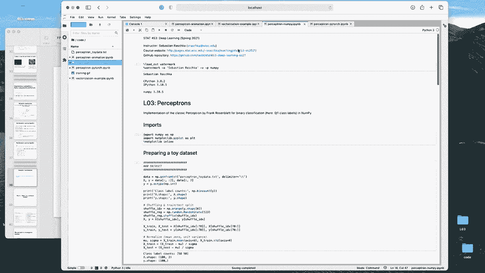
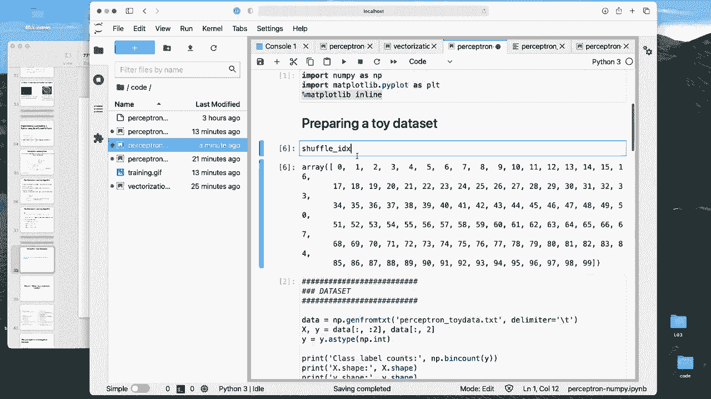
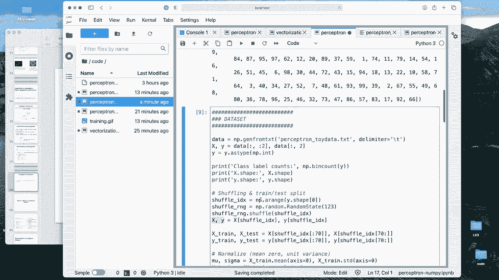
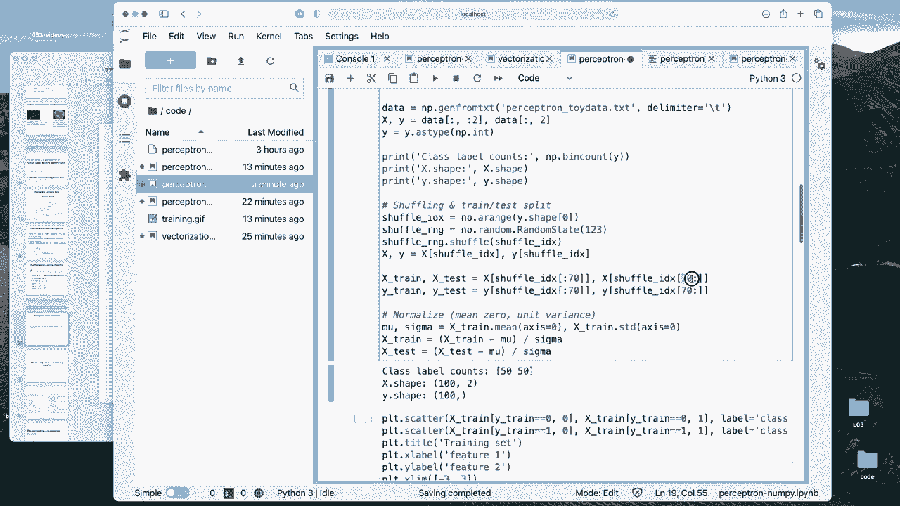
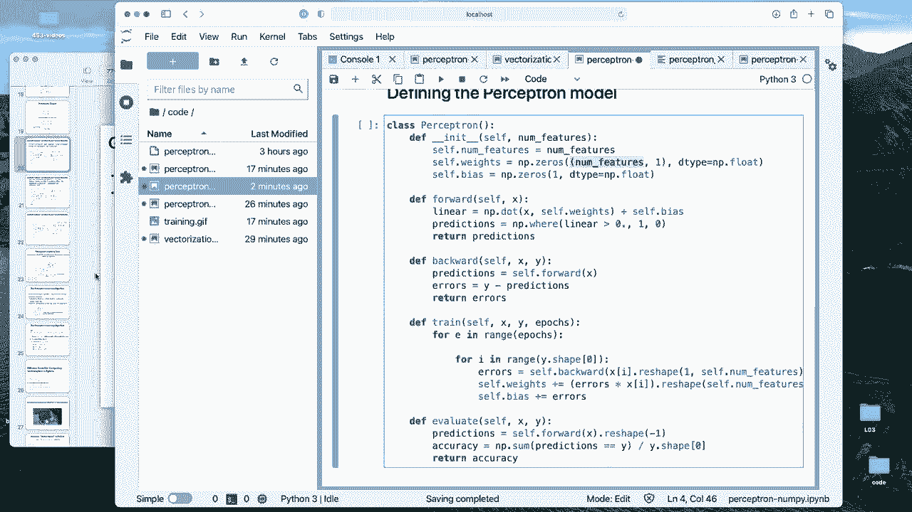
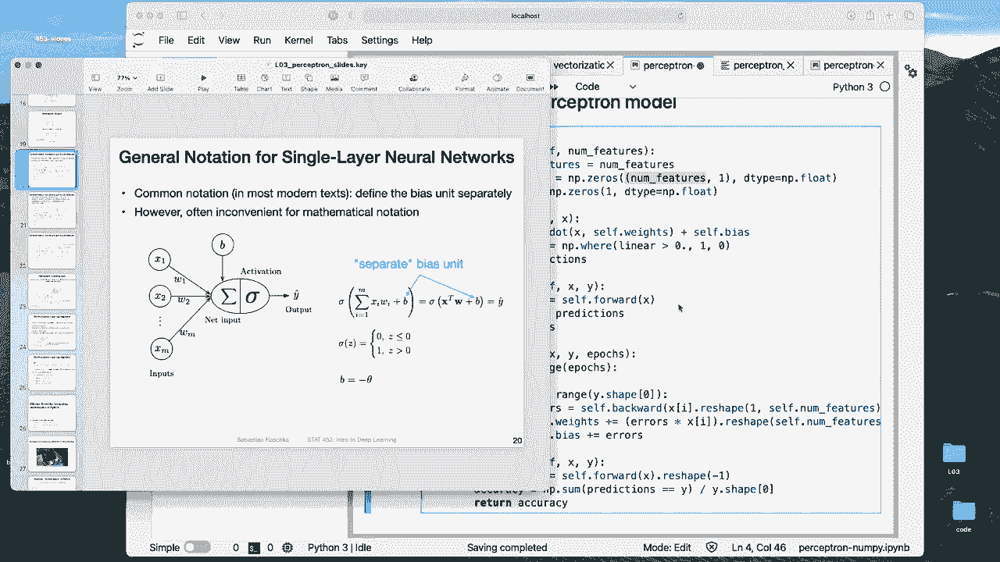
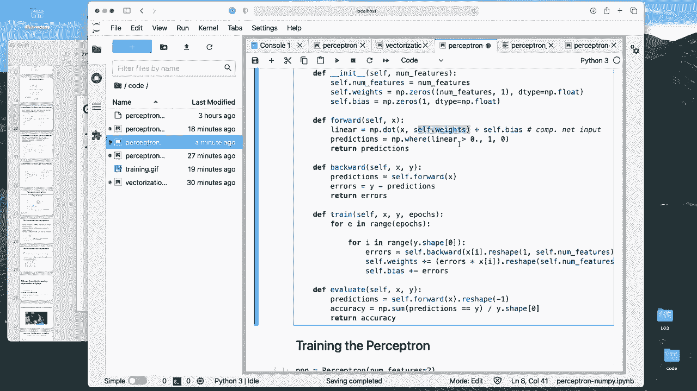
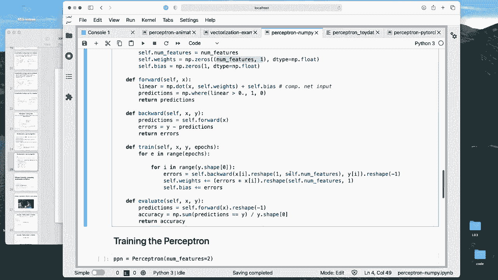
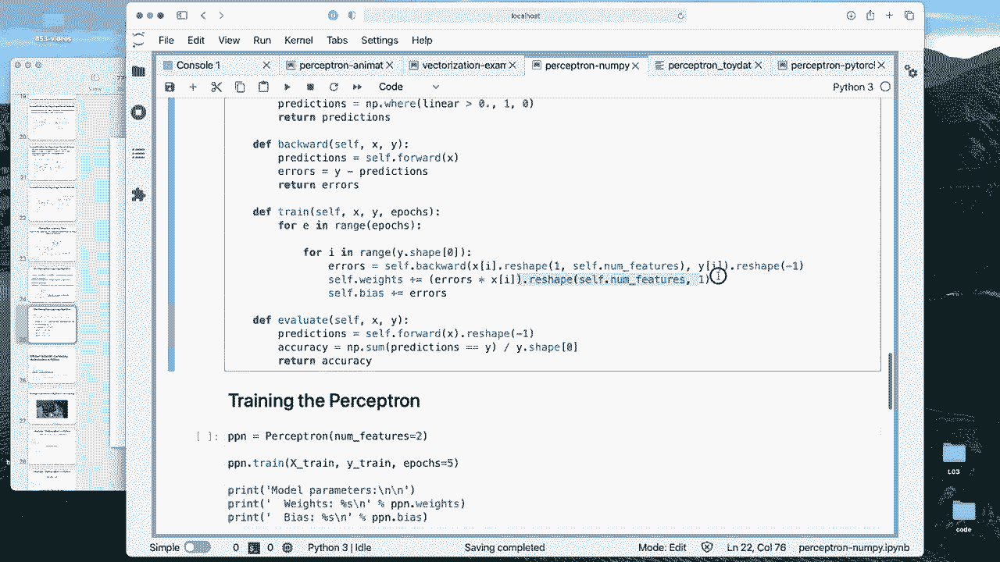
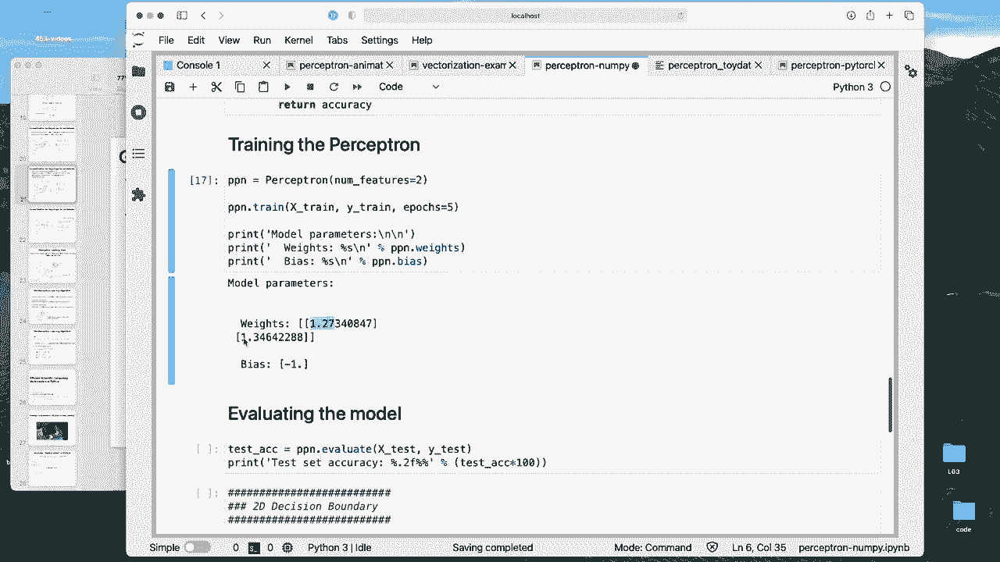

# 【双语字幕+资料下载】威斯康星 STAT453 ｜ 深度学习和生成模型导论(2021最新·完整版) - P23：L3.4- Python 中使用 NumPy 和 PyTorch 构建感知器 - ShowMeAI - BV1ub4y127jj

Yes， so in this video I'm gonna show you how we can implement a perception in Python using nupyant Pythtorch。

 So I will be using Jupyter notebooks because I think for simpler code examples。

 it's actually quite nice to use Jupyter notebooks because I can execute one thing at a time and it will make things easier to explain。

 However， later on in this course we have to I think move to Python script files because when the debuing models become larger and larger managing them in Jupyter notebooks can be a little bit I would say tedious and also dangerous because it's easy to lose the overview and debugging is a little bit harder if you have these separate cells and stuff like that and then the dangers that you might execute things out of order and。

Yeah， also， you want to import certain aspects from different files。

 You don't want to have everything in one notebook because then it becomes really confusing and un manageageable。

 but we will get to these parts later in this course so。Yeah。

 so back to this topic of the perception implementation in Ny and Pythtorch all the code files are actually on GithHub。

 So if you go here to this link or I will also link them on canvas so that you can just click on them if you are interested to play around with them the homework will be based actually on the Ny 1 where I will ask you to implement this in plain Python just to make sure you understand what's going on and by。

Yeah， converting Nmpy code to Python， I think you will work with the code step by step and get a better understanding of these individual things。

 and I think also yeah going from Ny to Python is easier than from Python to Nmy if you are relatively new to Ny。

So in that way， let me now walk through the Nmpy notebook。 The Pytorch notebook is actually very。

 very similar， which is one of the cool things about Pytch because it is very similar to Numpy。

 except there are some extra features that we will be using later on。

 and I will have a lecture on Pytorch where I will explain you these differences。So for right now。

 it doesn't make such a big difference whether we use the Ny or Py notebook。

 I will also show you a step by step comparison after I explained the Ny notebook。

 So you will see what's actually different between the two。

Alright， but let's do one thing at a time。 so here I will make this a bit bigger。

Oh hope it's easier to see them。 It's maybe almost too big， I know。

So。

Yes， so I'm starting here and let me clear maybe the outputs， and then I will。

Execute them one at a time。 So I'm importing some libraries for those who have not used notebooks。

 This one here。 this command is for showing plots in the notebook。

 It's technically not necessary anymore。 always sometimes on some computers。

 plots will not be shown in a notebook。 if you don't include that line。

 and it doesn't hurt to include that line。 So I always do this。

Here I'm just loading the data set。

So there's nothing really interesting happening here， but I will step through this step by step。

 So the data is like some toy data that I generated。 I will show you how that looks like shortly。

 So here I have two feature columns。 I didn't include any column header。

 but this is the first feature This is the second feature value。 And this is the class table here。

 So there zeros and once。 And you can see the data is not shuffled。

 And actually it's helpful for learning if the dataset is shuffled。

 it will make the learning a little bit faster in the perceptioncept。

嗯。

Yeah， all right。So here I'm loading the dataset into nuy。

Can also use pendas， but I thought it might be overkill because its a relatively simple data set。

 And then I'm assigning the features to X， which is a matrix then and y， which is the class library。

 I can maybe。

Show you just how they look like。

X， it's a matrix， and y。Yes。Clas label array。 So here it's sh because I actually executed this whole bunch of code so you then can already guess what's going on here。

 So here I'm loading the data and then just printing some summary information is always。

 I think a good idea to do that to get an idea。 So we have 50 labels from class 0 and 50 labels from class 1。

 we have thus 100 data points in total and two feature columns。

And also 100 labels。 So， for example， here we can see， okay， these and these match numbers match。 So。

 and that's what we expect。 It's just some sanity checks here and some making sure that everything looks okay。

Then here， I'm shuffling。

The data set， so that they are not all in order， they are shuffled。

And how I'm doing that is I have to shuffle X and y together。 right， So otherwise。

 everything will be mixed up， then the features won't correspond to the class labels anymore。

 So am I doing that is I'm creating a shuffle index。 So I can just show you。

Creating this。

Shuffle index here。And how it looks like is it just the numbers from 0 to 99 so the 100 indices。

 And then I'm actually shuffling these indices。 So here I'm generating random ma generator and then I am shuffling these indices here so you can look at these。

After shuffling。So， after execute that。

You will see。

Excuse that。Oops， too much。 but you will see they are no in random order。

 And then I'm using that to select the data points from x and y。

 So then x and y will be shuffled based on this shuffle index here。 So that's how we shuffle。

 And then I will。

Use the first 70 data points for training。And the last 30。

 So we have on our data points of 70 to 100。 The last 30 data points will be for our test set。

Later on， we will be seeing or using more convenient way ways to load data in Pythtor。

 So there are some loading utilities here。 I'm just doing it step by step so you get a feeling of what's basically going on。

 and then I'm。Normalizing the data。 So this is sometimes also called standardization。

So here I'm standardizing the data such that after standardization。

 it will have mean 0 and unit variances。 So I' am subtracting the mean and divide by the standard deviation。

 So here I'm computing the mean and standard deviation of my sample。

嗯。

And then I am subtracting the mean and divide by the standard deviation。

Yeah， and then both will be having mean 0 and s deviationation 1。 So unit variance。

 so you can actually。Check that。Os。It's not quite true， because we have。Traing。Okay， very close to 0。

 So this is。70 digits after 0。 So 0。000 something up to 2。 So very， very small。 It's almost yeah。

 it's identical to 0， essentially。 And then for the standard deviation， it should be around one。Yeah。

 so the data is standardized。 why am I doing that， It kind of speeds up training a little bit。

 It's like stabilizing the training for the perceptionron。 it's not that necessarily necessary。

 but it is a good practice to do that for other types of optimization algorithms later on when we talk about stochastic gradient incent。

 So this is something standardization that is usually recommend that the only types of machine learning models。

 but this is that necessary is like for treebased models that is something we covered in or that was that I discussed in statistics 451 when we talked about decision tree algorithms。

 these don't require standardization， but all other machine learning deep learning models I know they can usually benefit from that like especially stochastic gradient incent will just learn faster。

 which is something we will be doing later。 So it's just a good practice。

Alright， let's take a look at the data。 So here this is a training set， how it looks like。

 So you can see it's around standard to0。 We have two classes， class 0， these circle here。

 and then a square for class1。 So feature 1 and feature 2。

That's our training set。So these should be 70 examples and then the remaining 30 examples in our test set。

 So what we want to do is we want to train our model on the training set and then evaluate it on the test set。

So let's implement our perceptron model then。

So here is the perceptron code。 you can see it's relatively short。

 I am implementing it using a forward and a backward method。

 why I' am doing that is because that is also how things are done in Pytorch and it will make things more familiar later on if I start using this habit。

Alright， but let's start at the top。 So I'm implementing it as a class here。 And yeah， you should be。

 I think， familiar with Python classes。Soう。Here what I'm doing is I'm running the in a constructor。

 So this is a special classmet method constructor。 I'm giving it the number of features。

 because that's what I need to know the number of weights。 And I'm using here。

 the implementation where the weights and the bias are separate because that is more convenient。

 So I don't have to modify the feature vector。 So what I'm doing here， if I go back to my。

Lecture slides。I am using this， this notation here where we have the bias separately。

 So I'm initializing the weight vector and the bias unit。 So the bias unit is just a single。

Value adjust just。Yeah， one number and the weights， the weight vector。

 it depends on the number of features， right， So I make this column vector。

Sorry， a row vector。

So this is then this equal to M， the number of features。

Alright， so。Here I am just setting up my weights and biass and setting them to0 later on for certain algorithms for storcastic randomis and。

 it's better to initialize than to small random numbers here for the perceptionceptron it's not necessary。

 but for neural networks it will be necessary later on， we will see that。

In the forward method， I am computing the net inputs。Actually here in linear。

 and then I'm predicting the prediction'm computing the predictions。 That's my threshold。

 So this is the net input。I'm calling it linear because later on。

 we will also see linear layers in Pytorch。 They are called linear。

 and they are basically computing the。Net inputs。So this is。

 you can see the dot product between the input vector and the weights。 So that is computing。

This part here。And then I am adding the bias here。

AndI can actually make this。

Bigger。All right。Then here we have our threshold function。

 This threshold function is just using nu where。 So how this works is it's saying if linear。

 So if the net input is greater than 0， then output 1， otherwise output 0。

So it's our forward method。And here is O while。

Beck workmouth。So the backward method， why am I calling it like that。

 it is for computing the arrows So usually yeah when we have deeper neural networks。

 we will use something called back propagation where we look at the outputs and then based on the outputs we adjust the inputs。

 So in that way we run the forward method to produce the predictions and then we compute the arrows and then update So it will become more clear when we have a deeper network where there's really like a back propagation going on。

So these are our two methods。 So backward is computing the  errors。

 which is the difference between the true class labels and the predictions。And for what is， yeah。

 used to get the predictions in the first place。

Let me see here。 So this is。

What we just implemented。 So we implemented here， the prediction that's。

It's going on here。 The prediction is equal to step8。

And then step B。Is the backward pass with with which gives us little arrows。

And now we have to put everything together。

So I implemented a train method here， so far。

So this train method is basically the whole。

The whole thing here。 So for epoch in the number of epochs。 So this is for every training epoch。

And then for every training example。

This is here this part。We perform the four paths path。Backward path。

And update。Alright， so since backward is already doing our forward， we just call backward here。

There's some ugly reshape here going on。 And that is because yeah。

 making the vector dimensions match。Otherwise， you will get some errors。

 So here I'm just making the dimensions match。 You can maybe。Let's take a look。So here this will be。

1 row and M columns。

So it will be I think this is called a row vector。 I said earlier。 the other one was a row vector。

 but yeah， I'm always confusing the words row vector and column vector because here。

 this is just yeah one，1 row and multiple columns， but this is because there there are multiple columns。

 but it's still called row vector because it looks like a row anyway。 still yeah。

 we have this row vector here。

And it says to have the same dimension as Ys in this way。I'm just making this the same dimension。

 so you can。

Computer。Everything nicely。 Otherwise， you will find there will be a dimension mismatch。

 So thiss just the reshaping going on here。

嗯。

And then here we perform the update。So again， I'm doing the reshape afterwards so that we get the original dimensions back because。

Because the weights。

Here， they also have the same。 So see we are， we are matching the original dimensions。

 So we're just reshaping so we can。Add to it otherwise， there will also be a dimension， a mismatch。

 if this is just a single number， or if it's a one times M vector instead of an M times one vector。

 So， yeah， this is a little bit annoying to do this reshaping。 technicalnly would also。

 I think not be necessary if I remove the dimension from everywhere。 but here that's more explicit。

 actually。

Doesn't hurt。' just like yeah， you have to be aware of that。

And then also， we update the bias。 So the bias， it， it's just yeah updating it by the  errors。

 The reason is。

Think about it if we would have one here。

If I have a one here。So this would be one times the bias unit， instead of。

嗯。So the input would be the one， right？ So instead of saying errors times the feature。

 we would have be， we would have error times 1， right？ So error times one， and we can cancel the one。

 So instead of writing it like this。Since we have the bio separate， I can just cancel this so we。

Don't have to include that。嗯。Yeah， then next evaluating it。 So evaluating the performance here。

 I'm just doing the forward pass。

And then compute the accuracy。 The accuracy is computed by checking how many of the predictions match the true label and then divide by the dataset set size。

 So it will be giving me a number between 0 and 1。 Allright， so this is my perceptionceptron。

And then here I am training it。 So here I'm initializing it。

And then train it for five apos。 And then I will print the model parameters afterwards。

It's pretty fast。 So we get the weights， the weight vector 1。27，1。346。

 And then the bias is -1 in this case。

And now we can evaluate it， compute the accuracy。So the test that accuracy is 93%。

 It's not quite 100% on the。

Training said it should actually have 100%， right， because it's linearly separable。

This data set， and it should converge if it's linear separable。

Yeah， that's 100%。 Everything is classified correctly。 Test that is not as。

Good because we may overfit。 So let's take a look at the decision boundaries。

 So here is some complicated code to compute the decision boundaries。

 It's actually not complicated is what I did is I rearrange things here， right， so。

What we have is， if you think about it， the decision boundary is greater or equal to 0。

 So everything hinges upon 0。 So if we have。Our computation， it's。X 0 times。W 0。

 right plus let's on it input X 1。Times。If you want， let me yeah。Let me just wanted to。

Bring that a little bit more closer together。 That's easier to see And then press the bias， right。

 So this hinges upon 0。 And now let's see let's。

So what we're interested in is， what we are doing here is we are。

Taking one fixed number。So， that's say， we are taking。

For feature 0， the minimum area of minus-2。 So we are going to the left hand side here。

 And then we want to find。 So this is。

For x 0， so x0 is the x axis and x1 is the y axis。 So we take minus-2， this data point here。

Or actually， we are here。 We only know -2， and we want to find the corresponding x 1 value。

 So this is， this is。X。0， so it's at -2。 So what is the corresponding x1 value。

 So we have to rearrange this solving for x1， right， So what we do is we move this stuff。

And this to the left hand to the right hand side。 So we have x1 times。W1。Equals to。us x，0。be right。

 so I'm just subtracting this and this。 So it's now on the right hand side。

 And then I want to know x1， right， So I divide by W 1。 So when I divide this。So this is basically。

 essentially what I've。I've written here。 So I get the X1 value。 I'm calling it min。

 The reason is because it's the left hand side。 Then I'm doing the same thing for the right hand side。

 So yeah I'm doing it for the right hand side。 I'm again， setting x 0 to some value。

 I'm setting it to。

2 here。 And then I'm finding the corresponding y x value， which is this x1 max here。

 So I'm doing the same thing， just rearranging。 Now I'm using a max value。

 And then I'm connecting these lines。 And that's how I get this。

 I've done this here for the left hand side for the training set and right hand side。

 for the test set。

Soあ。Yeah， one is the training set and one is the test set。

So， this should be the。

Its maybe easier to。Like this。

The decision boundary doesn't change actually， because it's the same for the training and test。

 just the data set is different because the decision boundary only depends。

On W， right？ So we are providing these a values。 We are providing them。

 and the decision boundary only depends on these parameters of on the model parameters。

 So the decision boundary does not change here。 So this is for the training set and this is for the test set here on the right hand side。

 And you can see in the training set case， it perfectly classifies these examples。

 And on the right hand side。 This is the test set， you can see it's maybe fitting some of the data too closely。

 I mean， there's no other way， actually， but it happens that here in this case， it it doesn't。

Perform well。 actually， yeah， theres a different way。 If you would fit the boundary like this。

 os like this， more， more straight。Then you may get these right， but it just。

Happens so that these data points are not in the training set that the model doesn't know that it should shift the boundary mode to the right here。

 So in this way， the model does actually a good job in on the training set， but on the test set。

 Yeah， it's， it's not so good。 So in that way， it's actually this term is called overfitting because it fits the training data a little bit too closely and doesn't generalize so well to the test set。

Okay， so this is how the Ni code works in the homework you will be playing around with this a little bit more and then reimplemented in just regular Python just removing some of the dot products or releasing them by for loops and so forth。

嗯。Yeah， the Pytorch code。 I don't need to talk about this， I think， because it's the same。

 So this is exactly the same。 This is exactly the same。 This is exactly the same。

 There are some differences here。

But yeah， this is exactly the same。 this this， except that I'm now using toch tensor instead ofphumppy arrayse。

But yeah， I prepared an overview。Here to show you the main differences。

So in class， we will be talking about this in more detail when I talk about Pwat。

Think next week or in two weeks。Depending on how far we get next week。

 So here I highlighted the differences。 though， it's also in the it's from the slides。

 So on the left hand side， this is the Pytorch implementation on the right hand side is the Pytorrch sort nuy and Pytorrch。

 And you can see there are not that many differences。 so。

The way。The weights and biases are implemented here。 We are using Ny zeros here。

 We are using torch zeros。 We are a bit more specific here instead of saying Ny flow。

 we say torch float 32。 It's a 32 bit。 I have this device here。

Cause the way I implemented things it would also run on the GPU。 if there's a GPU available。

 if no GPU is available， it will use the CPU。 So there's this device here。

 which is provided here optionally。

It's not necessary， though。

And what's more it's a little bit different。 So here， I mean。

 there are multiple ways you can write that you can also use a plus function， to be honest。

 I just happened to use Torch dot a， but I could have also used a plus。

So what I mean is I could have。

I don't know why exchange did it so complicated。 I could have just。Ha had a plus here in。Toch。

Should still work。

嗯。Yeah， and then。The MM M is matrix multiplication。And in Namai， we usually write dot and。

Trch we write or by torch， we write M M for matrix modification。

But in Py the dot function can also do matrix modification。 So in the way。

 it is kind of like the same thing just looks a little bit different。

 The where function in Pyr is a bit more。I would say involved， not that much more involved。

 but it has to have placeholders such having a one and a0。 It needs to have a tensor here。

 So I'm creating this as placeholder here and providing them， but it's the same concept。

And then what's a little bit different here is the last part。So instead of nupi sum。

 it's torture sum。Here I'm converting it to a float。Because otherwise。

 it will be an integer and then integer divided by。Some value will give an integer。

 but we want to have a float because it's a fraction between 0 and 1。 So if you don't do that。

 you will get back an integer， and that's not correct because the value of the accuracy is a value between 0 and 1。

 which is why I'm casting this to float。 But again。

 the pyr code will be covered in class in more detail later。So。Yeah。

 that is what I wanted to say about the code。 and you get to play around with that a little more in the homework。

Then here for the optional convergence theorem， I wanted to make a video about that。

 but I realize I talked a lot about the code right now。

 so I honestly want to wrap up this lecture next day we'll be probably short so that in the next week we can start a fresh topic so then we can talk a little bit about the linear algebra background for deep learning some notation a little bit about calculus and then get started with Pytorch next week so in that way。

I think this is not really necessary。 So this is some optional mathematical proof。

 I will leave it in the slides because I spend a lot of time making this， but。

Yeah， you can read through that， but it won't。So if you don't know about that。

 you won't miss anything because it's not relevant for deep learning。

It's just showing that the perceptron will not converge if the data is not linearly separable。

 and you can try that out in practice so you can， for example， if you go to the animation here。

 this is the animation。

That I showed you in class。 It's just as a Jupyter notebook。 and you can change。

The data such that one of the blue points is here， so you can change the cluster of one of these points。

 or you can change the cluster of one of these points。 And then you can run this。

 and you will see it will never converge。 So here， this one will converge eventually at iteration 49。

But if you change one data point， such that。It cannot separate the data correctly。

 It will go on forever， essentially。

And this is what the proof is about。

You can mathematically show that there's a lower bond and the upper bond。

For the size of the weights。And based on that， you can。Basically， conclude that。

It will converge only if the classes are linear separable。

 So I won't go into too much detail about that when it will converge。 So this is showing that it is。

 it will converge if it's linear separable。But only if it's a linear separable。 And yeah。

 in the last video， let me talk about the geometric intuition about the decision boundary。 So again。

 don't worry about the convergence theorem。 All you have to know is that the code will run forever if the data is not linear separable。

 and otherwise it's guaranteed to find the solution。

 so it's guaranteed to find this boundary if it exists。 That's what the proof is about。

Alright， so next video， the geometric intuition。

