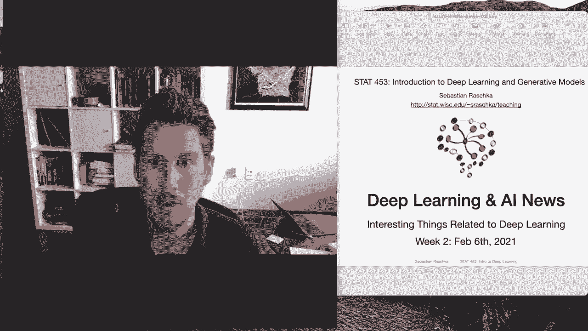
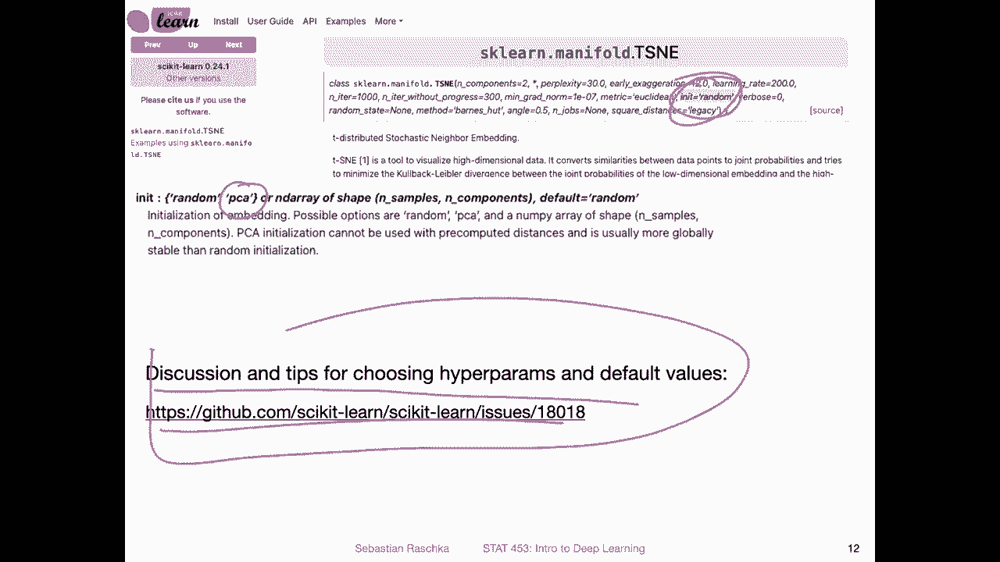

# P25：深度学习新闻 #2，2021 年 2 月 6 日 - ShowMeAI - BV1ub4y127jj

Yeah， hi， everyone。 I can't believe we already completed the second week of this semester。

 but in the meantime， there have been a lot of interesting things happening in the deep learning and artificial intelligence world。

 So here I'm back with stuff in the news number too。

 Some of the interesting things that happen this week。

 So we will be mainly seeing things from my perspective things I have been reading about。

 But I also had to trim down the list。 yeah， quite a bit because there hell always lots of interesting research papers and news articles coming out。

 So but with that， let me not waste too much time on the introduction and get started with the stuff in the news。

😊。

Yeah， one of the things that piqued my interest this week was this article entitled Seu Research Explo Crazy idea of Automating AI paper reviews。

So paper reviews that's a very， I would say sensitive topic in the deep learning and machine learning community right now。

 because at yeah these top conferences where people submit papers like ICML and。

New reps there are usually around， I don't know，5 to 10000。

 let's say 10000 submissions every year nowadays。 and it's yet pretty challenging to find or to maintain good quality reviews。

 I'm also a review for both of these conferences and get about like 3 to 5 papers to review also the timeline is very short。

 And yeah， if you have 10000 submissions， you have to find also 10000 reviews every one of those reviewing three papers or more。

 and it's really hard to yeah keep up with these numbers。

 So I think that was what motivated these people to。Work on this idea。

 I would say I'm not honestly convinced this is a good thing to work on or even try to automate paper reviews with with AI。

 Maybe it's good for checking general formats like beyond the yeah conventional。

Quality checks like whether the paper has or has a right page limit or right template and things like that。

 maybe AI can be used for some quality checks。 I'm a little bit skeptical whether it can be used to really make or should make decisions on the quality or regarding the quality of a paper。

Nonetheless， I think this is an interesting project from a language perspective， like assessing how。

Far deep learning has come in terms of understanding human language and contents of more comprehensive texts。

And also what I found like as a general interesting takeaway are these most frequently mentioned qualities of a good review。

 so these are things to yeah assess whether a review。

 peer review is good or not and this is actually something I'm thinking about adopting as a rubric for our class projects because like I mentioned before there will be a peer review for our class projects at the end of the semester and I will of course share more details later on during the semester。

 but this might be a good rubric for me also to assess whether the peer reviews you write about the reports of other students might be good peer reviews。

 so something like decisiveness， comprehensiveness， justification。

 accuracy and kindness kindness is also very important because yeah reviews can sometimes be grumpy and I think it's usually not very not very nice and not very fair to write grumpier reviews。

Alright， so yeah this model they proposed is based on BRT and bart Bart is a denoing out encoder it's related to BRT and it this like for pretraining sequence to sequence models we will talk more about sequence to sequence models yeah in part5 of this course at the end of the semester so sequence to sequence means that the input to the model is a sequence and the output is also a sequence instead of just a single prediction so instead of just predicting a single class label you are outputting also a sequence。

 for example text。A simple example also of yeah sequence to sequence models would be。

 for example language translation where you translate from one language to the other so here they yeah involve of course human annotations so they annotate the paper with these statistics I think some stands for summary or actually posted it here summary MOT is for motivation S UBs for substance so they tag humans tag the article with these different aspects then they train a tagger that can do the same thing。

Then there is some post processing going on and then a human has to evaluate the results。

 So if you are interested in this project or want to read more。

 there's the paper here on archive and they also posted yeah the code on Githubs if you want to play around with us if you are curious。

Alright， moving on， you have probably never wondered what a night made of spaghetti would look like。

 So this is not new news。 It's a a bit older。 It's like a month old or something that's like a machine learning project called Dal E。

It's like I think a meshup of Wall E and the artist Dali。

 So in that way here what the researchers did is they trained another language model， a G3。

 12 billion parametermeter model and in this doll E model here which is based on G3 or the concepts of G3 but the researchers do is they train a model on。

Images and descriptions of images。 And then so these are the inputs so you can think of it as Inet for example。

 and then you can query the model and it gives you outputs and the outputs outputs are meshups from the text input。

 So for example， you can type in spaghetti night or night made of spaghetti you can type that in and the model will produce new images that have both concepts in common。

 for example， night and spaghetti and here are some some of the results of nights made out of spaghetti。

 so these are images that don't exist。 This is something the model is synthesized。Unfortunately。

 yeah， the paper is not available and the code is also not available， but there is a block article。

 if you want to read more about this project， I thought it might be also a fun project especially if you are interested in generative models。

Yeah， and while the DalE paper and code are currently not available yet。

One part of delE is available， this a so-called clip model or approach。

 so C stands for contrastive language image pretraining。

 So this is something that DlE uses under the hood。

 It's also based on yeah GT3 I think so and what clip does its you can think of it as yeah and almost like an image classifier in that sense。

 but it is doing something clever。So clip is based on zero shot transfer so here zero shot means classifying something where you don't have any training example for。

 So as I mentioned earlier I'm also yeah working a lot in the area of few short learning with my student ju and in a few short learning we have this setting like。

En shot。K way， few short learning。 So the N， in end shot few short learning stands for the number of examples per class in case the number of classes。

 So， for example， if you have a。Let's say， a5。Short10。Way few short learning problem。

 That means you have 10 different classes， but only five examples per class， a very small problem。

 And it's very challenging to yeah develop deep learning systems that can work with such small dataset sets。

 So zero shot is even more extreme。 it really means you have zero examples。 So in this case。

 the model should predict something， even though it may have never seen this class before。

 So how would you approach this。 So for that。The researchers use natural language supervision and multimodal learning。

 so multimodal learning stands for a means using different data sources。

 So here they use image data and text data。 So that's where the natural language supervision part comes in。

 So in particular they are predicting novel image classes based on word embeddings So when they train the data or the model。

 they use both descriptions of an image and the image itself and then if they see a new class they can use yeah word embeddings or the descriptions to predict the class。

So here's an example of that， so this is from the paper or the blog post I think that I linked here so what they do is here they compare their model with a regular residual net 101 this is something we will also talk about later in class that's a convolution network trained on I think it's yet they are it's trained on imageNe。

And I should say。No， nonene of thats clip。Thing is fine tuned to these dataset sets。

 So it's trained on a different dataset and then applied to dataset sets。

 It has not been fine tuned to。 So this restnet here was trained on imagenet， and it reaches 76。

2% accuracy prediction accuracy。 The split model， which was trained on a different dataset also reaches 76。

2% accuracy on this dataset。 But what's more impressive is it also achieves good performance on different types of imagenets that were not yeah contained in this training set。

 So in that way。This clip model yeah generalizes better to other types of datasets by this concept of this contrast of language image freetrain。

 So that is also I think， an interesting idea or approach and you can also find more about this and the paper here and the code is also available here and this I think can be potentially really useful if for example。

 you yeah develop for example， let's say a self-driving car and you have a large data and you want to look for specific videos or clips or different images like I want to have a image of let's say a pedestrian crossing a busy intersection So in this way you can have maybe this model finding you。

Qury very efficiently in the large data set。 And why is that interesting， Because， yeah。

 you can imagine you don't have to train the model on all possible queries if you have these word embeddings。

 you can search for something that is similar to your input word embedding。

 and it pulls out the corresponding image。So in that way。

 I think this is actually a very interesting approach。Yeah。

 and here is a big picture overview of how the method works。

 It has been some time since yeah lecture  one way， I think I briefly mentioned it。

 but contrast of pretrain， that's a form of。Self supervised。

Learning and here in this particular case， what they do is they train a model on text descriptions and images。

 So in the example I gave earlier about self-subervised learning the researchers used an image and then a transformed version of this image and the model had to predict whether it's the same image or not compared to a image that is different。

 So like being able to distinguish different images from each other and modified versions of the same image。

And here in this case， it's kind of a similar concept。

 but here it's based on text data and image data， so they train this text encoder on the test text description and the image decoder on the image description so they produce then a so calledled embedding and then。

Based on the text and the image embedding， the model learns like the relationship。

 So it should be basically let's say for the， I think that's what it means for the diagonal。

 if you have an image from a certain class from this class and a description that matches this class。

 It should give a high relationships score or something like that。

 So you would train the model basically to associate the right description with the right image。

 then you can if you have a data set of descriptions and images。

 you can shuffle them and it should give you a low score if you have a description that does not match your image and so forth。

 So let's say you pretrain your model， then you can create a data classifier from text label。

 So here what they do is they。Andbed the class label in a text description， for example， here。

 a photo of a。Planin car， dog， bird， and so forth。And then yeah， you produce these text embeddings。

 and now imagine you have a new image that you want to classify。 you don't know the class neighbor。

 that is what you want to find out。 So this a zero shot prediction。

 This means this class label doesn't have to be in necessarily the training set。

So you don't have to have an example of that if you have the right embeddings。In that way。

 what they have here is they have this image。 They go give it to the image encoder， and then。

You have an embedding， and then you would pull the text description embedding that has the highest scores。

 In this case， a photo of a doc， for example。 So in this case， you。

From the text and codingding and the imagery would then pull out the class from that one。Yeah。

 that is on a high level how this clip method works。

 I mentioned the model G multiple times G 2 and G 3。 unfortunately， G 3 is not available yet。

 So this is a model by。Open AI for G 2， I'm actually not sure whether it's already available。

 I haven't followed it very closely。 However， theres I also saw now an initiative to train an open source version of that model。

So here they say our primary goal is to replicate GT3 sized model。

Models and open source to the public for free。 So they train the models on。

The data set called the pile， which is 825 GB model。

 including like YouTube descriptions papers from Pubmed and so forth。

 And it is like a 200 parameter model。 It's very big。 So， yeah。

 it's big initiative because these models for us， normal people are really out of reach。

 You really need a big company to be able to train such a model。

 And I remember when the first bird or G models came out。

 I think it was estimated like the cost was estimated to be like around $100000 just to train the model。

 And I think for this G3， which is magnet to it's bigger。

 It's probably in the realm of almost  a million dollars to just train the model。

 Sos it's actually good then that someone maybe。Does that in a young in a way that is then also available and free for the public Alright so moving on I also saw it's not directly related to deeping but I also saw yeah this news article today so it's about the yeah popularity of programming languages and tools so this is by O'reilly and they based their analysis based on queries on their website and books and things like that like mostly search terms on their website and what people look for。

So yeah， unsurprisingly， Python is， of course， the first place。

 Also it all or it or it's growing again。 So it's still not stagnating。 So people yeah。

 use more and more python， which I think is， yeah， is good to know。

 So you know where things are headed。What I also found interesting is Scala， So Scala。

 I thought personally that might be the next hot thing when I was in grad school when I was in grad school。

 everyone started talking about Scala at some point which is language kind of related to jascript or I think it runs in the JVM the ja virtual machine personally I have to say I never really used it and now seeing that there's this big decline I'm also glad that I didn't waste my time learning a new programming language because that's also always a trade off it's like the tradeoff between doing research。

 getting things done and doing things like learning new languages So there's like a trade off you want to always be up to date with current technology and what people are doing because that's how you keep up to date and can produce cutting edge work but then also you don't want to waste your time by pursuing things that are maybe not worthwhile So for now it seems like Python is still a good choice for machine learning and deep learning。

Alright， so another interesting project I saw was this approach or method by。Facebook AI research。

 where they are teaching AI to manipulate objects using visual demos。 So it's。

 yeah currently very challenging still to train robots。

 There's a field called reinforcement learning， As you recall from the introductory lectures。

 So in this way， robots learn by trial and error。 So you train a robot to do something by having it fail a lot of times。

And there's another approach to。Reinforcement learning called inverse reinforcement learning。

 which is like learning based on a demonstration。 However， traditionally。

 it was kind of also not very easy because you had to have a virtual environment for that where you can simulate this behavior that you want your agent to mimic。

 So here a Facebook AI research proposed a model based inverse reinforcement learning。

Approach using visual demonstrations on a physical robot。

 So that means the robot can learn by looking at something on a video or series of images instead of having this virtual environment。

 for example， a video game context a 3D world， you can show the robot images of a task that a human performs。

 for example， here， a human is yeah grabbing a bottle and moving a bottle around if you show the reinforcement learning agent the video。

 it can， to some extent， learn to perform this behavior as well。 So there's a video。

 I can't unfortunately play it in the slides。 but if you are interested， yeah。

 you can find out more here。And this blog post address。

 and there's also the code available on Gitthub。lastly， the last topic for today is about TN。

 tea distributed stochastic neighbor embedding， and this is a very popular technique in deep learning to visualize high dimensional data sets。

Yeah， I have an image of Mist。 So Mnit， as you know。

 is a high dimensional dataset right So for Mness for these  hundredwritten0 digits。

 you have 28 times 28 pixels， which is 784 dimensions。

 So you have a very high dimensional data set and you can' really easily visualize that in a scatterttleboard for example。

 So you can use Tni， though， to reduce the dimensionality of this dataset into down to two dimensions。

 and yeah the interesting aspect about a Tni is that it preserves the relationship between the high dimensional space between the objects in a high dimensional space and in the new lower dimensional space。

 So here is。The result of。A Tney dimensionality reduction into two dimensions。

 let's say you have two features now x1 and x2。 And you can see that the Tney algorithm takes this high dimensional 784 dimensional Mnes embeddings and。

Puts them into this 2D space such that the relationship between the numbers is still preserved。

 You can see all the zeros here cluster together or the seventh cluster together or the fourth fourth。

Clued together and so forth。 So you can see it kind of preserves the relationship or yeah， the。

 the relative meaning of these numbers by。Yeah， when when it is projecting those into a higher dimensional lower dimensional space and you can also think of it as principal component analysis analysis。

 but principal component analysis analysis is a tool it a linear transformation。 so PCA。

It's a linearium。Transformation。And this method here。

 the Tsney method is not just a linear transformation。 It's a little bit more involved than that。

 I actually taught Tsney in statistics 4，79。I have actually some slides I can upload。

 I had a full lecture on that。 I don't want to go into too much detail here。

 but it's a very cool method's。Yeah， really useful。

 But one kind of downside of that is that you have to tune the hyper parametersmeter in order to make it perform well。

 And usually you don't know because you don't know the， yeah labels always。

 you don't know what a good setting is， so。There was a paper I saw this week。

 it's about initialization is critical for preserving the global structure in both Tsney and UMP so here the researchers say that it's really important that you choose the right parameter when you use Ts the right hyperparmeter and one of those is the random start like how you start Tney the initialization and here they found that TN will perform much much better if you use actually PC as an initialization you basically initialize TN with PCA。

Reult so in that way they found that for example， when they compared TN with PCA initialization and the random initialization that TE performed much。

 much better across everything here， almost everything I think the way they measure that enough I recall correctly。

Is they measure the correlation between the distances in the original space and the reduced space。

 So if I go back， they would compute the distance between two images in the high dimensional space。

And then they would compute it in the low dimensional space in the two dimensional space and then check the correlation for these different approaches and they found basically that using Tney with PCA really preserves the distance between objects in the low dimensional space。

Yet here as you can see from the title there's another method called UMP。

 this is also a very good method and it's recently even become more popular than TN because sometimes it's even better at preserving this structure。

So yeah， with that this is， yeah Tney， I think you may probably want to use it at some point in your class projects。

 It's really useful for visualizing high dimensionional data sets， but in practice。

 it's not really only used for visualizing dataset sets。

 It's usually also used for understanding what a deep neural network does， for example。

You would apply that to an embedding of a neural network to really understand what information is con contained in the network。

 So if you have a big conversion network。 So you usually have。Layers that become smaller in size。

 the deeper the network becomes， and then researchers， for example。

 would take the later embeddings and then apply TN to see how well it separates different classes in the slower embedding and so forth。

Yeah， just like a last thing here about hisney。 So in psychic learn on the random。Sorry。

 the initialization scheme is a random initialization and yeah here you if you want to use T name practice according to this research paper。

 you want to change that to PCA So instead of using the default random you would want to use PCA because yeah it performs better according to this paper on the previous slide and also there is a discussion right now on the psychic learn issue tracker where。

It's proposed to change this default behavior so that it will also use PCA in by default and then also there are some other tips so if you want to use Tney I would recommend you to check out this issue here where there's a more in- depth yeah discussion and with that I think it's already a long video so enough news for this week I will see you on Tuesday with the next lecture。

