# P28：L4.2- PyTorch 中的张量 - ShowMeAI - BV1ub4y127jj

Yeah， in this video I want to briefly go over how we work with tensors in Pytorch and you will see if you are familiar or comfortable with Nmpy using tensons and Pytor it's super simple because it's almost identical Yeah。

 like I mentioned earlier in the context of computing。

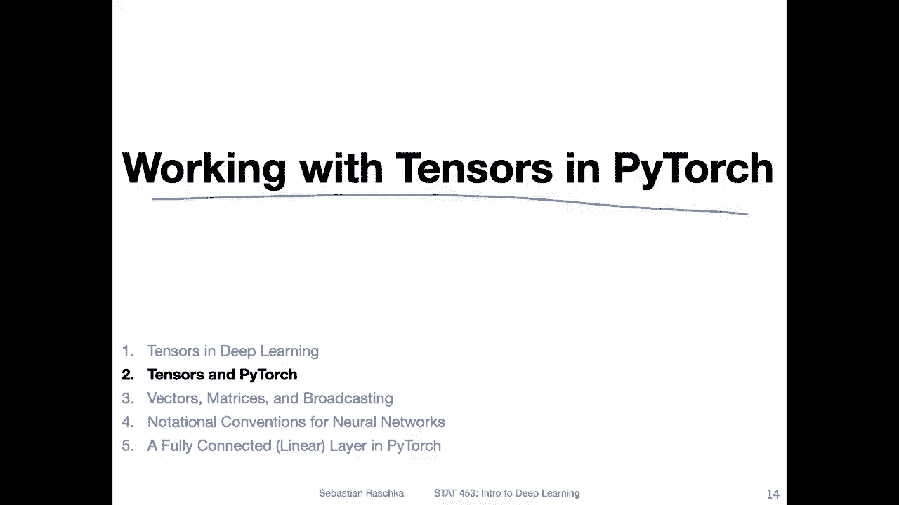

Tenssrs and multidimensional arrays are synonymous In Nmpy。

 we construct these multidimensional arrays using Nmpy dot array。 and in Pytor。

 we use Pyor dot tensor。Note that there are also yet two other related。Calls here。

 This is like a dot and D array。 And here's one dot tensor with a capital T。

 So node one is a smaller letter T and one is a capital letter T。 So on the right hand side here。

 these。A really more like the you can think of it as these data types of classes so。Let's say， in。

Pytorch， back in the day there was only Pytorch do tensor， which is the class， the tensil。

 It's the object itself then or it will create the object。 However。

 usually it's better to call it like this， which is a function。

 So Pytch dotensor is a function that is inside sight calling this one。

 but it will do some additional checks to make sure the input looks okay and so forth。 So practice。

This is the recommended one。And it will。Produce。This one。Inside。

 So it's just like a wrapper function around this pywa tensor with a capital letter。

 So let's see and practice how it looks like。 So here on the or at the bottom。

 I'm creating a one dimensional vector。On the left hand side， I'm using nuy。So here I'm calling Ny。

t array to construct a multidimensional array。So this has only one dimension。

 So you can think of it as a rank。1 tensor oil。vector。And here I'm getting its D type or data type。

D stands for data types， so。This one will give us here in this case， a float 64。

 So the float 64 means floating point。Number or number for floating point operations。

 And the 64 here means 64 B。 I will talk a little bit more about that in this video。

 So be a bit patient。 I will explain why this is like a 64 B and why why we care about that。

And lastly here， there's the a dot shape， which gives us the shape of this。

 So since it's only a vector， one dimension here。There's only one value， but not it's a tuple。

 a Python tuple， which is where why theres the comma。 So it's a length， one tuple。

 So corresponding to a rank1 vector。Rannk1 tensor， which is the vector on the right hand side。 Now。

 I'm doing the same thing in Pytorch。 So I'm importing pytorch。

 Note that we import pytorch as just torch。In Python。And then。Here， I'm constructing the same。

Vectctor F constructed on the left hand side。 But instead of using array， I'm using tensor。

 it's just like a naming convention， but it's the same really the same thing as a nuier。Yeah。

 and then also， it has a D type。 It gives us the data type。 But now it's float 32 instead of 64。

 So here it's a。32 B。Floating point number。 So it has less precision。 Actually， in most contexts。

 this is a good thing。 I will also explain this more in detail later。

 So this means it has less precision， but it also requires less memory or storage on your computer。

 And in deep learning， we don't need a very high precision anyway。

So and then here I'm getting also its shape in this kind case， it returns。A object， a size object。

 It contains one value， which is here。 Yet， the number of elements among that dimension is yet also equivalent to this three here。

 But yet， note， it looks a little bit different。 But overall， the same workflow。

 So a pytorch and Ny are really very similar。

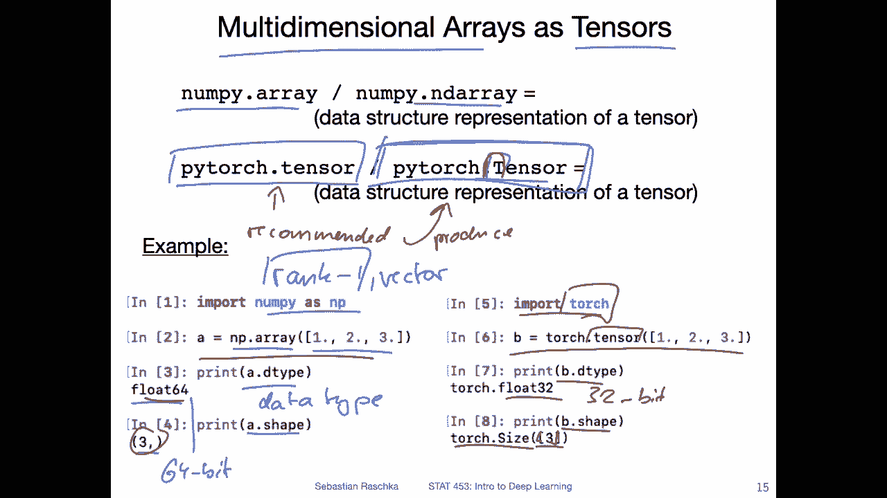

Yeah， here's another quick example showing you that Nmpy Py are indeed very similar。

 So here I'm just showing you how you compute dot product using the simple vector a that I showed you on the previous slide。

 So here we are computing a dot a know that we don't need a transpose here so here it works with all a transpose because this is a one dimensional array。

 I think this is something I explained in the N material that I also provided to you。 So here we are。

Having the Ny version。 And here at the bottom， this is the。Pytorch version。 So here I'm computing B。

Mamo B。 So this is the same as B dot B。 So nowadays， you can actually also do B dot B。

 It's the same thing。 His， people yeah use the term matmo to do dot products and matrix multiplications。

 So in Pytage also dot is for both dot products and matrix multiplication。One additional thing。 So B。

 the tensor that we defined on the previous slide is a tensor 1，2 and3。

 but default if you executed or print， it doesn't show you the data type。

 but it's a 32 bit dimensional tensor whereas the a here is 64 bits note that you can also get the nuy representation of the tensor which can be useful for example if you use metpllib I think sometimes it's not always the case but sometimes I have for example issues making a scatter plot from let's say torch tensor or Pythrch tensors。

 So in this case you may want to convert the Pych tensor into nuy array。

 so you can do that by calling B do nuy。So you can do this one。嗯。Yeah。

 and then this way also but note that this will be a 32 bit tensor by default。

 I will show you later how you can convert it to a 64 bit tensor if you would like and also how you yeah convert from 64 to 32 bit if you need it so in certain applications it might be necessary。

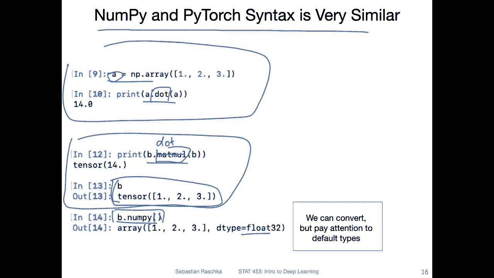

Yeah， like I mentioned， traditionally， we used Maimmal in Py Hge。 but yeah nowadays。

 also the dot method works same way。 So instead of doing B Mamal B。

 we can also do B dot B in Pyte Hge and also we can use the rather new but。Yeah， like I mentioned。

 traditionally， we used Memo。 but nowadays we can also use dot and Pythor to do either dot products or matrix modifications。

 So this is B Memal B。 and this is B dot B and both produce the same results。

 Note that Python also has a fancy。Addd symbol for matrix modificationplication or dot products。

 Unfortunately， not many people use that。 but also。

 that's a nice way to write that very compact here。 So you can also do it like this。

 So all three things are your equivalent。 So you can use whatever you like or prefer。

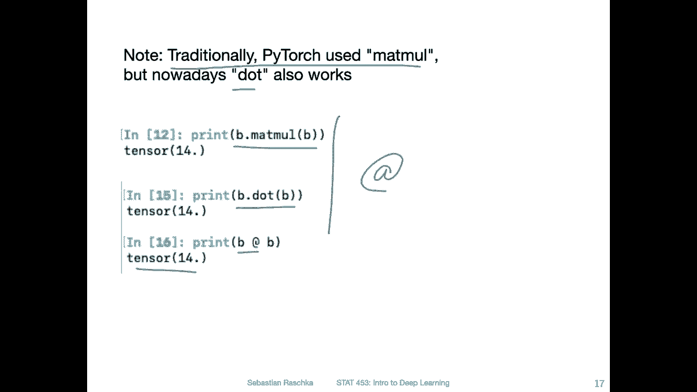

Yeah， here are some of the data types to memorize memorize is a little bit of a strong work here maybe so you don't have to memorize the necessarily like for the exam。

 but it's more like a thing that you probably should be familiar with if you work with computational stuff because these are words that also appear in different contexts。

So。With that， I mean the different types for integer and floats。

 like the different types of precision。 So there is something called U int 8， which means。Unsigned。

Integer with 8 bit precision unsigned means that there are or there can't be negative numbers。

 So if you don't need negative numbers you can do or can you can use this one。

 So you can't have negative integers， but sometimes if you， for example。

 want to define a selection mask， this would be sufficient。

 but also usually there won't be a context in this class。

 I think where you really have to do this might be something you want to look into later on sometime when you make some of your codes more efficient。

 but really this is like something you don't really need to worry about it at this point。

Then there are the regular integers where you can have negative numbers。 So 16 bit，32 bit。

 I could should maybe write this down like the number of bits。Bit precision 8。1632。This is also 30。

 this should be sorry。64。64。1632。64，64。So。If you just use or refer to Numpy dot in。

 this will be the 64 bit version。 So it's the same thing as saying int 64。

 these are really the same in Numpy。And the same is true for these floats。

If you just say load or float 64， these are the 64 bit precision versions。

So what's the difference between 16 bit， let's say 32 bit and 64 bit floats。

 So the difference is really like the the precision。

 So how many numbers after the decimal point you can yeah display or yeah what the precision is basically think of it as yeah precision after or number of points after the decimal point。

For simplicity。So in deep learning， it doesn't really matter whether we have 64 or 32 bit precision because yeah there's also certain amount of randomness in deep learning and so forth。

 So things are kind of a little bit approximate in deep learning anyway。

 so we don't really care about that high precision so 32 B is really sufficient in the context of deep learning and it's actually when we work with GPUus even preferred because GPUus run faster on 32 B floats。

 I don't even think GPU supports 64 bit but I'm not exactly sure。

I only know everyone uses 32 bit floating point operations。 And nowadays。

 even people started to shift to 16 bit floating point operations on GPUus。

 If you just use 16 bit floating point operations out of the box。

 you will probably not you will probably find that results don't look very good。 But nowadays。

 also under the hood， GPUus have sophisticated algorithms where they temporarily use 16 B。

To downcast where you don't so for certain applications where you don't need high precision and then return the results in 32 B。

 So intermediate results will be in 16 bit to save memory basically and I think Google's Tus they use 16 B all the time。

 but I'm also not 100% sure because yeah I'm not an expert in Google's hardware basically。

What I also should say， yeah， then the most important point here is really the equivalent data types in Pythtoch。

 these are the ones I would say to memorize the ones that are tricky where there are certain words that you may not be familiar with。

So in Pyrage unsigned integers of8 per position，8 bit position are called bytetensors and then so the regular integer tensor or Intetensor。

 this is referring to 32 bit and this is also something that is more general in computing it's not only specific to Pythr if you talk to people who let's say grew up in the 80s or 90s these were common words because back then it was normal to have 32 bit precision I remember as a kid I had a Windows computer which was for example running on 32 bit before things got shifted to 64 bit I think in the late 90s or something。

嗯。Yeah， so back then 32 bit was like the default， which is why the integer tensor is really equivalent to the 32 bit1。

 And then later， so if you have more bit position for integers， you can have longer integers。

 like higher numbers。 So people call started calling the 64 bit version。

 a long version of the integers， a long long stands for 64 bit integer。 So in this way。Here。

 these 64 bits are equivalent to the long tensor and Pytorch。

 And these are the ones that are initialized by default in both nuy and Pytr。

 So if you run nuy or Pyrch， just for example， torch。Tensil。And then。Have， let's say， a one and two。

 like two values。 this will create an integer。T0 are by default with， precision 64。

And if you have a dot here， one dot or2 dot， these would be floating point operations。

 and by default， they would be in Pytor  32 B。So in Pythage， the float tensor would be 30。2 bit， Ny。

The default would be actually 64。Similar to the concept with integer and long in Pyrch the float。

 the regular word float refers to 32 bit and the double precision 64 is double the precision of 32。

 it's then called double tensor or double precision。

 there is also half precision which corresponds to 16 bit。So that's a little bit confusing。

 It's something The table might be something to keep handy if you get lost in the words and certain pwatch codes。

 I actually don't honestly really like these names。

 I find these a little bit better here on the left hand side。's a little bit easier。

If you just have the number 1632，64 compared to double flow and whatever。

 but it's something I think important to know if you look at code and as an  error and it says expected a flow tensor expected a double tensor。

 it usually means you have to recast into a different type because you can't multiply for example。

 a flow tensor with a double tensor， you have to make sure the types match of these two tensors if you want to do multiplication between the two and I will show you in the next slides how you can deal with that。

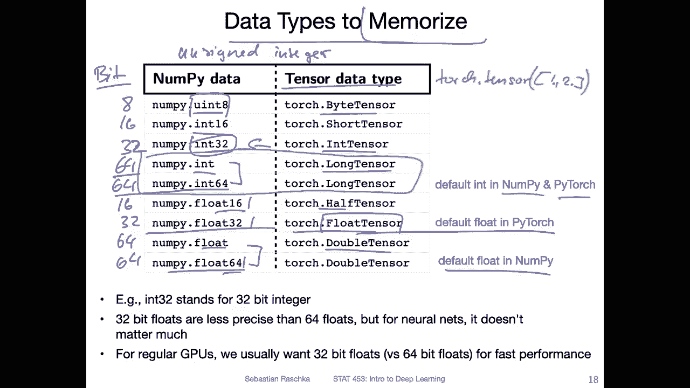

Yes， in Pythtch， you can specify the D type upon construction with that， I mean。

 when you call torch Tsor you can provide the D type as information via the D type on function argument here here in this case because I have these dots technically torch dot float is not necessary。

 It's kind of overkill。 you don't have to do that by default it will already do that。

 However here just for showing this example you will see if I create this tensor。

 and then I use C dot D type it will give me a torch float dot 32 bit precision tensor。

I can then also use torch dot double。 remember double means double precision， so 60 forbit。

 So when I create a tensor like that， it will create a tensor worth 604 bitit precision。

And also I just tried this apparently they added more functionality so you can now also use float 64。

 so maybe they heard my complaining that this is a little bit better or more clear So you can now also say torch dot float 64 and it will also create a 64 bit tensor So if float 64 is a bit easier to remember than double you can do that technically you never really have to do that because yeah most of the time we are happy with 32 B in the context of deep learning but yeah this is just for illustration purposes。

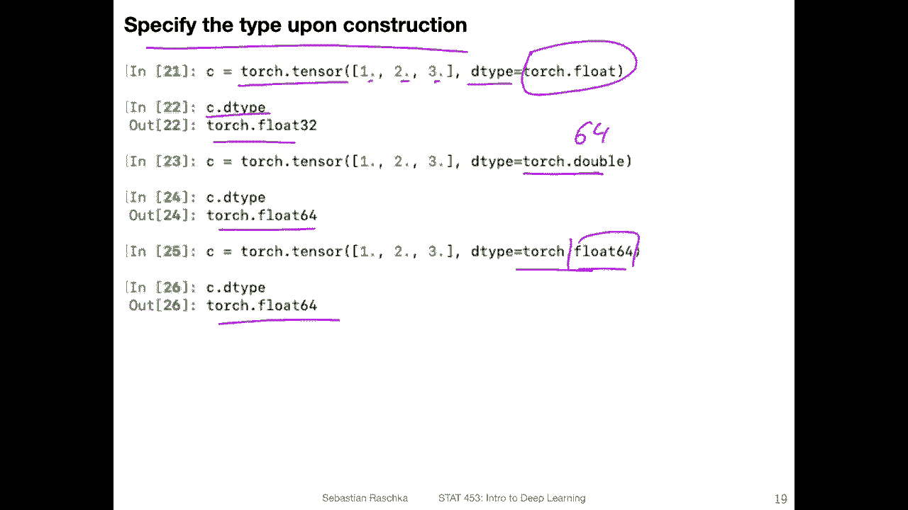

You can also change the type later on or on the fly if you have to。

 So here is another example just using integer tenss now。

 So here the D type would be integer 64 bit by default。And you can change that to a double。

 for example， by calling dot double on that tensor。

 so it will change from 64 bit to from integer 604 bit to float 604 bit by calling double。

Note that I also tried just tried doing dot float 64。 Unfortunately， this is not implemented。

 So here we will get an attribute error。 Tensor object does not have an attribute called6 F 64。

 which is a little bit unfortunate。 So if you want to use。The naming convention 64 float 64。

 because it's more， I would say， intuitive than double。 What you can do is though you can use dot 2。

 then torch dot float 64。 this would work， so。Thought2 is really like the long version of。

Of this one here。 So this is the same as the。2。Torch。大捕。I think we don't need this。

 I think this is enough。 Okay， yeah， so this is。The long version of this Ddot double。 Unfortunately。

 they have not created a short version of the。64 here。 So there is no dot float 64。

 but maybe next year， you never， you never know。 So we won't give up hope yet。 All right， moving on。

Yeah， I guess you might be wondering now。 So if Pytch is so similar to Ny。

 Why don't we just use Ny in the first place。 Why do we even care about Pytch。

 So one of the reasons is really on that Pytch has this GPU support So in deep learning we will be doing big matrix multiplications and in that way we can yeah perform these more efficiently on the GPU so we can load the data set and the model parameters into the GPU memory And then when it's on the GPU memory we can use the GPU course to yeah compute many matrix multiplications in parallel like taking advantage of the parallelism that is implemented in GPUs。

 the many， many core on there and that will really speed things up I mean it really depends on what type of network we train。

 but it's not unusual to have 100 1000 times speed up So whereas something trains on the GPU let's say in two or three hours。

It would take on a regular computer like maybe a week or so， And the computer would run really hot。

 and you really don't want to do that on your laptop。Yeah and also。

 I mean this is one of the reasons that GPU support。

 but another reason is that Pytorch implements automatic differentiation or automatic gradient computations so whether that we can automatically differentiate certain things because as we will be learning on Thursday yeah we need some kcus and deep learning like computing partial derivatives and gradients and there are some yeah convenient utilities and Pyrch that help us do that very。

 very efficiently and conveniently and then lastly Pytch also implements many deep learning convenience functions for example convolutional layers and fully connected layers and things like that so we don't have to handcode everything and this allows us to implement deep learning or deep neural networks very efficiently and also robustly in a way that is also working well in practice and free from bugs and also easy to read and things like that so there are many advantages of using Pytorch compared to。

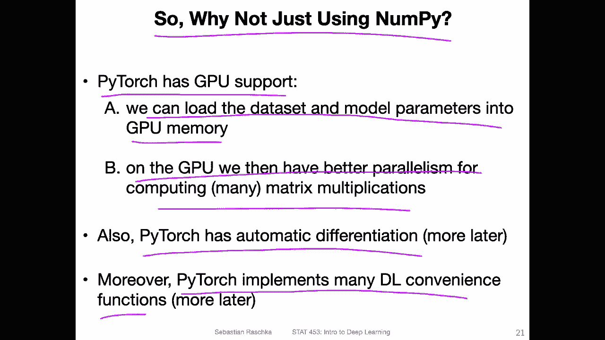

M for deep learning。Yeah， also regarding the GPU just a few words about that。

 it's really easy to use the GPU and Pytorch if you have a GPU。

 So if you if your Pytorch version has GPU support you can find out about that by calling。

This kuda is available thing。 So Kuda is a library for NviDdia GPus。 I think there is recently also。

 or there was support added for AM D GPUus， but it's very experimental。 Unfortunately， yeah。

 AM D is a little bit behind in terms of making GPUus available for deep learning。

 It's possible with library， I think it's called C Rom Rom something like that。 But Kuda。

 the equivalent on Nvidia's part is yeah way ahead。 And。

Many of these libraries like Pytorch and TensorF use Kuda under the Ho。

 which is like a C++ library for the GPU that makes also Pytorch that efficient because it's really like these low level libraries under the hood。

So yeah， in that way， really Nvidia is kind of like a little requirement for deep learning。

 unfortunately anyway。In order to check whether your Pyage version supports a GPU on your computer。

 you can execute this and if its if it's returning true。

 then yeah the GPU is available in the current session and then if you have a tensor， for example。

 B here that we defined earlier， you can easily transfer it to the GPU by executing this here。

2 torch device ka 0。 So why Ka 0。 This is really like the name of the GPU。

 and you can have multiple GPus on your computer。 For example。

 I have one of my computers as a server， which has like 8 GPUus。 and then I have Kuda 0，1，2，3，456，7。

 and I can use multiple ones at the same time。 and I can specify which one to use and so forth。

 But yeah， usually a normal desktop computer only has one GPU。So yeah。

 we can execute this command and then transfer things through the GPU。 And then if I do print。

 you can see now。The tensor values are returned with this notation that the data now sits on the GPU。

 and we can also transfer it back to the CPU by2。Toch device CPU and that way we can transfer it back so we can transfer it back and forth。

 The transfer is a little bit costly。 It takes one second or so。 I mean it doesn't sound like much。

 but it's something that if you have an efficient implementation。

 you don't want to do it all the time basically。 So usually you transfer your data to the GPU and then you do all the computations in the GP And then maybe once you have the results。

 once the model is trained， then you transfer back some of the parameterss to the CPU if you want to analyze them or something like that。

 But also again that is something that I will show you later on in this course when we train away first big models on maybe the GP。

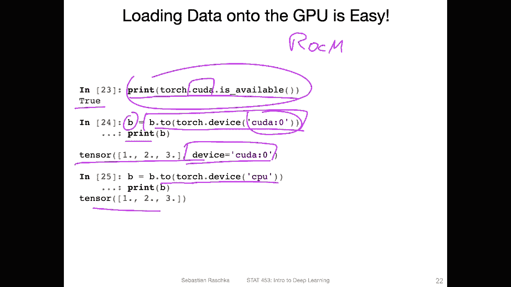

Yeah， so regarding the GPU。So if you want to check if your computer has a GPU。

 maybe you have a desktop computer with a GPU that could be used for deep learning。

 you can in the terminal execute the command and Vdia SMmiI and this is like a utility tool that is installed usually when you install your graphics card drivers and it will give you some information about your system so it will give you for example。

 the driver version and then also the Quda version。And then it will list the GPU。 So in this case。

 I have Gfor GPU and it shows you like at what speed the fan is running like right now at 24%。

Then memory usage so this GP is currently not used。 So 0 megabyte out of 11 megabyte。

 So it's 1 sorry 11 GB。And then also yeah what the current utilization is currently。

 So if GPU is running it will approximately be between 50 and 100% And also this is also something that can help you to debu your deep learning code。

 for example， sometimes you find that you are running things in the GPU but if it only shows like 10 or 20% it means you don't fully utilize your GPU So maybe you want to make your batch size larger and things like that。

 but that is like more like an advanced topic。 So here the NviDious SMI command is really like if you want to check on your computer whether your computer has。

GPU that can be used。 If not， don't worry about it。

 because I will show you free resources for using GPUus or like web resources。

 So you don't really need a GPU right now。 And youd also don't need to buy anything or it will all be fine because there are lots of free resources available。

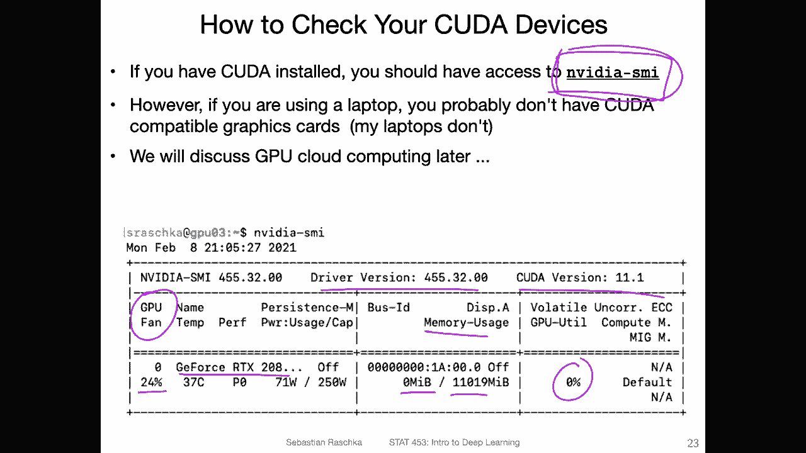

Yeah， lastly， so if you want to install then Pyth on your computer so I would still recommend installing Pyth on your computer because most of the things in this class because I also know that you don't have a GPU。

 most of you I don't make this a requirement that we have to like do some GPU coding next week or something so most of the homework will be possible on a normal computer and I will also then show you resources for GPU computing if you need that for later homeworks however it will be useful to install。

Pyto on your normal computer， and that is also what I do。

 I usually write most of my code on my laptop， which does not have a GPU。

 So I write my code on the laptop。 And when I see that it works then later on I transfer to the GPU server to run it maybe faster or something like that。

 but most of my development work I do on my computer because it's more convenient I have a screen on that computer。

 I can use Jupyter notebooks and scripts more conveniently on my server。

 I can only look in via the terminal and it's not easy to use the text editor via the terminal at least not for me。

 So I also do most of my development work on a computer without a GPU。

Like writing the code and debugging the code。 And like I showed you， once you have all your code。

 you can just use that two GPU thing， and then you can optionally run things in the GPU on a different computer。

So regarding the Pyr installation。So yeah， I recommend using the CPU version on your laptop Also。

 I mean even if your laptop has a GPU， unless it's a gaming computer。

 I wouldn't really risk running deep learning code on your GPU on the laptop because it can get very hot and I don't know I would not trust running a laptop like for multiple hours on for power I think it gets too hot and it could be dangerous。

 I mean could yeah destroy your laptop for example。

So I recommend installing the CPU version if you have a laptop。So how you do that。

 you would go to Pyto dot org and then go to this menus。

 if you scroll down a little bit less this menu， and then you can select the right version。

 So in my case， I have a me computeruter， so I would select。Mac here， if you have a Linux computer。

 you would select Linux， or if you have a Windows computer， you would select Windows。

And then you can select how you want to install it。 I recommend Connda， but you can also use Pip。

 for example。This is really here only if you want to compile torch from source。

 So this is something I probably wouldn't recommend for you。And then yeah you use your language。

 so you can also use C plus plus or Java， but I really recommend also Python。

 and then the Quda version， if you don't want to use a GPU， then just select none。 So Mac laptops。

 they have a GPU， some of them， the M D GPU， but it's not compatible。

 So if you have a Mac always select none。And then yeah。

 then it will give you a command how you can install Pytorch。 So in my case。

 it would be Connda install Pytorch Torch Vi Torch audio C Pytorch。

 So I would just copy that to my terminal and run this command and it should install it。

 So Torch vision。It's like a utility package that has some data sets and additional function for image processing which will be useful later and Torch audio is for audio data。

 we won't be working with audio data in this course。

 but with Torch Viion I would just recommend copying this and installing everything shouldn't hurt Allright so this is just Yabot installing Pythtorch if you have any questions also let me know on Piazza I can yeah answer all these questions hopefully。

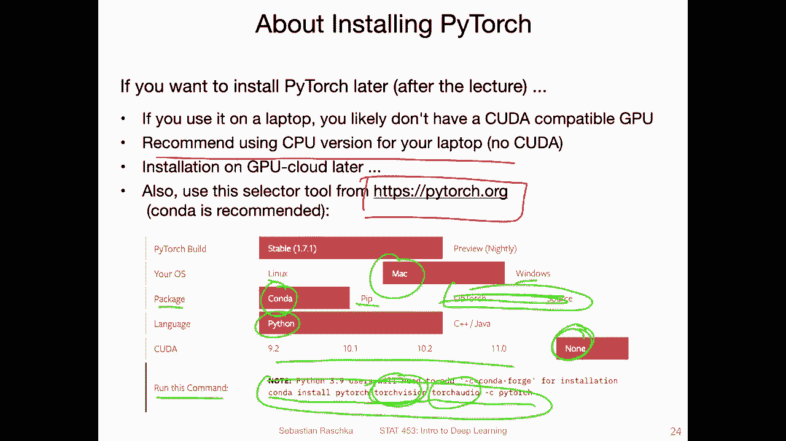

Alright， so in the next video， I will talk briefly about vectors and matrices and the concept of broadcasting that is like some things that are possible on the computer。

 but not。Propa linear algebra， but they make our life easier。

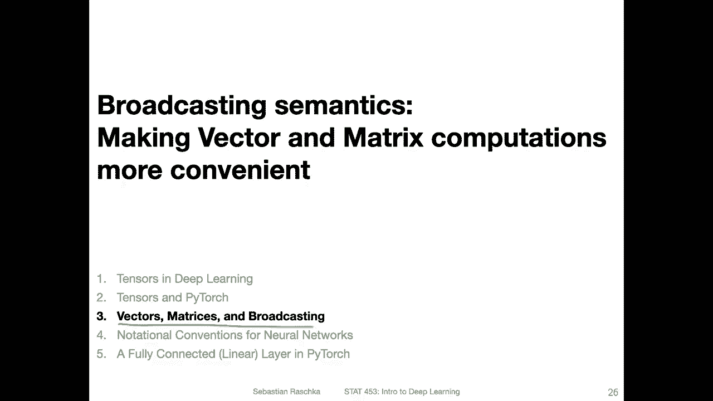