# 【双语字幕+资料下载】威斯康星 STAT453 ｜ 深度学习和生成模型导论(2021最新·完整版) - P29：L4.3- 向量、矩阵和广播 - ShowMeAI - BV1ub4y127jj

So in this video， I want to briefly talk about。Broadcasting。

 which is the concept that makes working with vector and matrix computations more convenient on a computer compared to。

 for example， pen and paper or the traditional way of doing linear algebra。 Alright， so yeah。

 let's start with vectors。 So if you look at this notation here， W transpose x plus B equals Z。

 So you recall how this is called like to check yourself。 There's a certain word for that result。

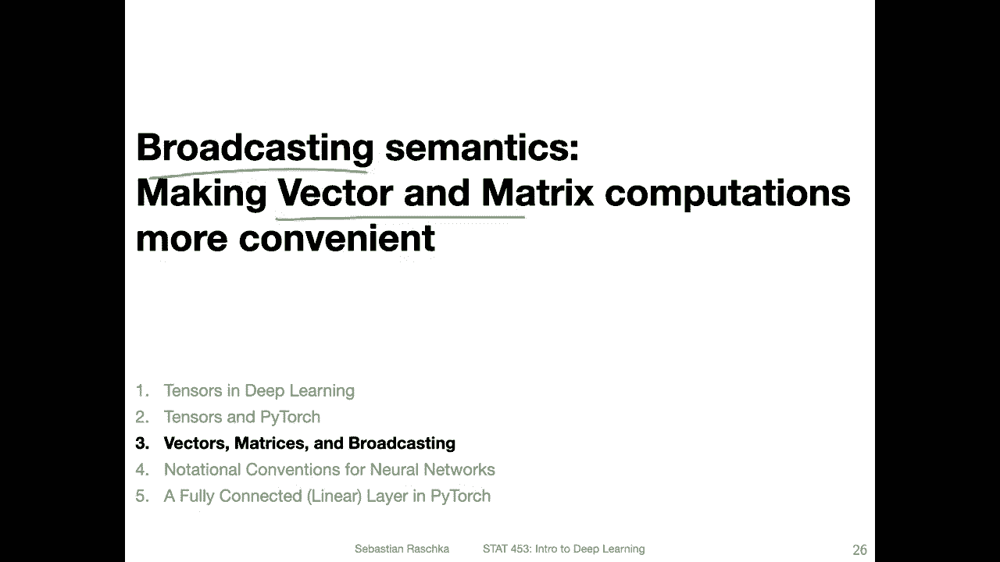

Maybe pause the video， think about it briefly。 Yeah， so the result is net input。

 So we learned in the perceptual lectureect that we usually call that the net input。

So yeah I'm just providing this as a simple example here， So where x and w would be two vectors here。

 so we would do w transpose dot x plus B and this would be the proper linear algebra way of computing the net input So in linear algebra。

 the supported operations for a vector addition you can also yeah think of subtraction if we add a vector with negative values and then the inner products like the dot product would be one of them and scalar multiplication so we can multiply a vector by a scalar。

So these are the only proper， I would say， basic vector operations that you would find in a traditional linear algebra textbook。

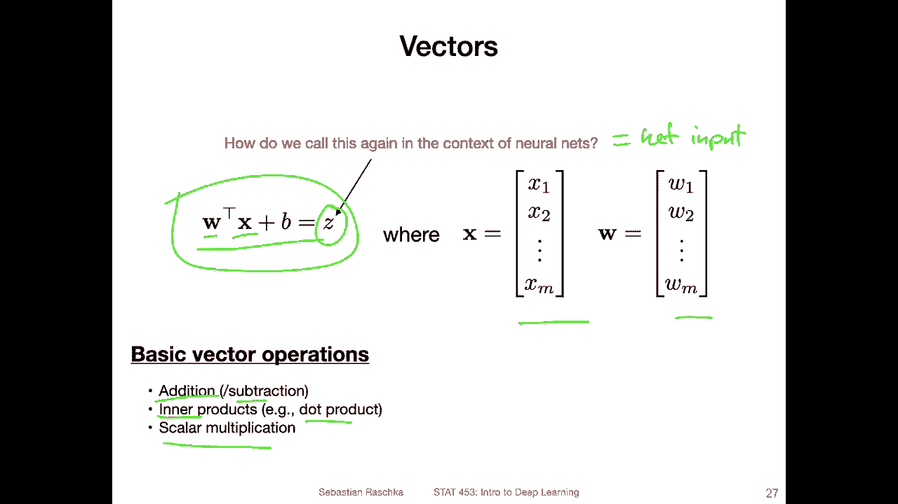

Now， in practice， though， if you work on a computer。

 there are a few more possibilities that can make our life easier。 They wouldn't be， I would say。

 valid linear algebra operations in the traditional sense。 So let's say if you write a。

Paper for a linear algebra journal or something。 they would maybe complain about this if you would do this on pen and paper。

 but on a computer， it's possible， for example， to add a scalar value to a vector。

So also you can let's start at the top。 So let's say we have two vectors A and B here implemented as pywach tensors。

 a one- dimensional pytch tensors， So what we can do in pytorch is we can multiply these two tensors so that is something in traditional linear algebra which would be not valid but here it is which is nice and then the other one is yeah adding a scalar to a vectors so what will happen is it will add the value1 to each individual element in the vector。

 which is also convenient。 You have to be a little bit careful about that。

 sometimes it's easy to make or to compute something that you don't intend。

 so it can also make mistakes a little bit easier but in many。

 many cases this makes life easier so you don't have to。For example， in a traditional algebra sense。

 linear algebra sense， what you would have to do is you would have to create a vector of once and edit。

 for example， you would have then one，2，3。Plus 1，1，1， right。 So it。

 that would be the linear algebra way。 But here you don't have to create this explicitly。

 It will implic， implicitly add this one， which is kind of nice。

So that would be one convenience function。 This is also related to the concept of broadcasting。

 which I will explain further in the next couple of slides。

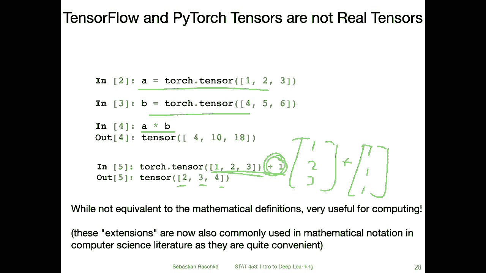

Yeah now in the next couple of slides， we will be talking about some concepts around matrices that are different from the linear algebra traditional sense and linear algebra on the computer。

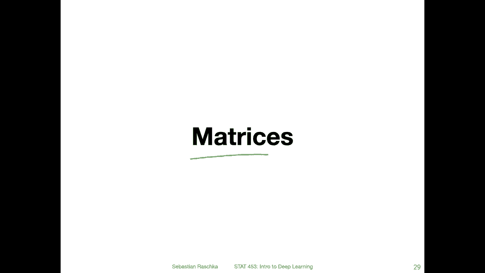

So if you think back of the perceptron algorithm。This is typically considered an online algorithm。

 On means it processes one training data point at a time。 So if you think back。

 you do you look at one training data point and then you update or not。

 and then you look at the next data point and then you update or not。 However。

 if you have trained your perceptioncept model。 you can actually do the prediction on the test examples all at once。

 You don't have to do one data point at a time。 This is because we don't train it anymore there。

 So we can really just feed it a gigantic matrix。Of N training examples and then do all the computations at once。

 this will make it more efficient because now we can do a matrix multiplication inside the peror instead of processing each feature vector so instead of providing the first feature vector doing the computation the net net input and then doing the second one and so forth we can now give it this gigantic matrix so we can avoid having a full loop for prediction。

Yeah， that is essentially what I have written here and the reason why it's more efficient is that the computer can leverage lower level routines to compute certain things in parallel。

 So there are two opportunities for parallelism one is multiplying the elements to compute the dot product。

 So if you have。Let's say weight vector to here。So let me there's no spacery。

 but let's say we have my weight vector here。And then if we multiply this late vector。

With the first feature vector。 So there's a multiplication between the first element。

 multiplication between second element and so fourth until。The last element。

 and these multiplications can be done all in parallel and then summed up。

 That would be one way for parallelizing that。 The second way would be。Paraleizing the dot products。

 So while you compute the dot product here， I'm showing you in pink。

 you can have a second process running that or re computes the dot product between the second row and this vector and then one in parallel that ori computes this and this。

 And then lastly。This and this。 So if you have four processors， for example。

 you could compute all these four dot products in parallel at the same time。

 you don't have to wait until one finishes， right。So in that way you can make the computation more efficient so you have a little question for CS majors well maybe familiar with a notation big O so what would be the big O complexity of matrix modification if you assume that we have two n times n matrices it's just like an optional question just seeing if if you know this you can post this on piazza we can have a little discussion but of course also non CS majors are invited to participate in this discussion but I'm just curious if you are familiar with these things。

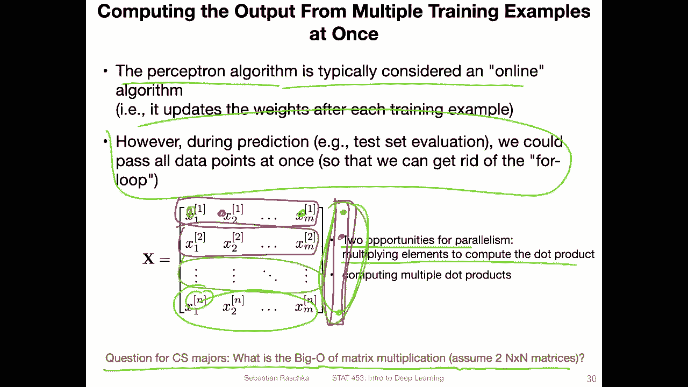

All right。Yeah， like I mentioned， there are these two opportunities for parallelism。

 Here's a more concrete example， computing the net input and net input。 Now。

 instead of having a single feature vector， we have now this matrix， the design matrix， which is。

N times m matrix， n is the number of data points， M iss the number of features。And。呃，W。Is。

M dimensional vector， right， So the output of this would be。N times 1， right？

 So the output of multiplying x and W。Would be。N times one dimensional vector。 And this is also why。

We actually have this extra dimension for。The vectors， because， yeah， you can't really。

 in linear algebra in the traditional sense， you can't really compute or multiply to a matrix multiification between a matrix and a vector。

 You can only do a dot product between two vectors and a matrix multiification between two matrices。

 So in this way。For yeah， correctness， this vector W is actually a matrix M times one matrix so that。

Yeah， we can do the matrix multiplication between the matrix and the feature vector。

 It's a little bit weird。 It's just like I'm just mentioning it here in in terms of。

If you stumble upon it， if you have learned linear algebra in the traditional sense and you think maybe that does make sense in computer。

 yeah in the computer computing context， we are a little bit more forgiving about these little things so yeah。

Alright。 yeah， here's an example of computing the net input on the whole slide and。This is then Z。

 Z would be a vector。 So we would be adding the B。To every。Dot product。

 So each of those is a dot product plus the bias unit， and it gives us the net input。

 So the net input is also a vector for。The training examples。 So we have n data points for example。

 I said training examples， but it would be more like the test data points in the context of the perceptron In other algorithms that we will be talking about in the next few lectures。

 we can also do that with training examples in the perceptron example。

 this would be technically the test examples because yeah， like I said in the previous slide。

 the perceptron is an online algorithm it can only process one data point at a time。

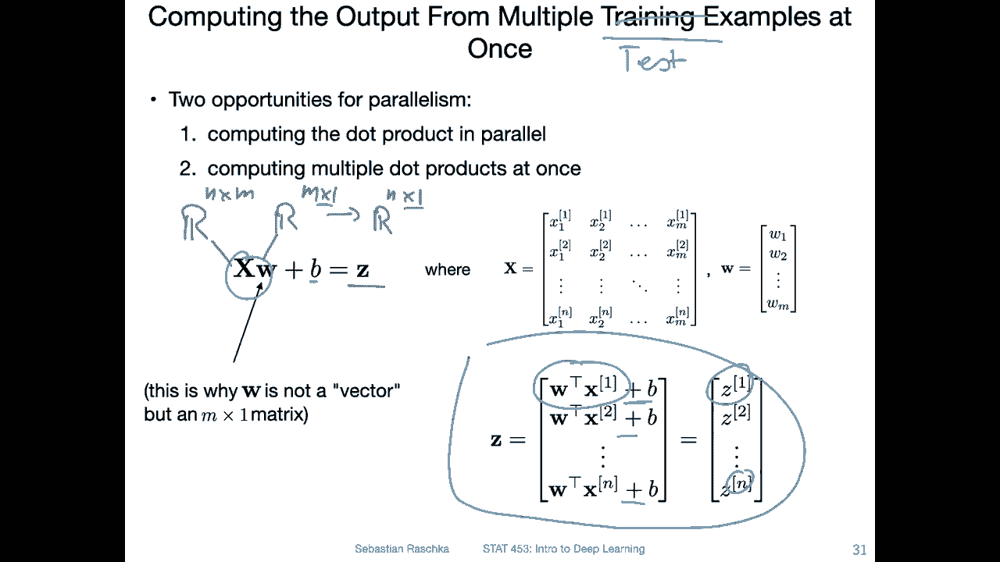

All right， moving on。So here's an example of that in Pytorch。

 So both Nmpy and Pytrch are not very picky about traditional linear algebra notations。

 So I said before this has to be this is an n sorry。N times n matrix。And W is。M times。One vector。

 but Pytor is not very picky about that， so we can actually also omit this dimension。

So here I'm showing you a matrix， two by3 matrix。That's just a shortcut for making a matrix of value 0。

1，2，3，4 and 5。 So it's a。2 by three matrix。 And now as a weight vector just a one dimensional vector。

1，2，3。 and I can actually multiply x with w。Will give me a8 times 26 vector with a values 8 and 26。

 So this would be also vector with only one dimension and two elements。However， so instead of。

Having this vector， I can add another dimension to this vector with this view function。

 This is similar to Nmpy's reshape， which I explained in the tutorials that I provided to you if this is unfamiliar。

 maybe refer to the Ny tutorials again where I explain the reshape and where the -1 comes from。

 but also if this is confusing please ask on Piazza， I'm really happy to explain that again。Alright。

 so now the w here is now a vector。 So this is a column vector would be 1，2，3。With another dimension。

 So this。Mattrix of。M times 1。Mattrix now like we had before here， and we can also do that。Not。

 this is not necessary， but you can see now the output is also。M times 1。 Oh sorry。 this is actually。

N times one dimensional matching the number of rows here。 This is n times  one dimensional， whereas。

嗯。This one here。It's only。N dimensional。 So we have sorry， there's n elements。

 So it's only one dimension。Yeah， it's a little bit confusing when we call or talk about dimensions。

 If we talk about a vector， we say n dimensional vector。 it means it has the number of elements。

 If we say n dimensional array， it means the number of dimensions or as。 So here this is。

Only one axis with n values。 And this is an n times one matrix。 So this is a vector and。

Traditional sense。 And this is， you can think of it as a。Calum vector。哇。And times 1。Matrix。But yeah。

 this is just nit picking what I'm doing here。 I'm just showing you that both ways are possible in Pytorch。

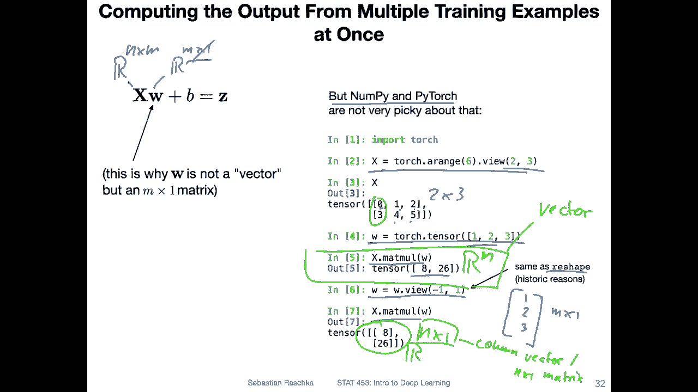

Yeah， and if you like knitt picking or hair splitliting。

 So there was actually one little mistake from a traditional linear algebra perspective in the previous slide。

 So here just asking whether you can spot the mistake。

 So there's something here that is not possible in traditional linear algebra。So yeah。

 what's not possible here is that we are adding a scalar to a vector， right。

 So in a well let me go back。 So here I'm actually adding it explicitly as a。

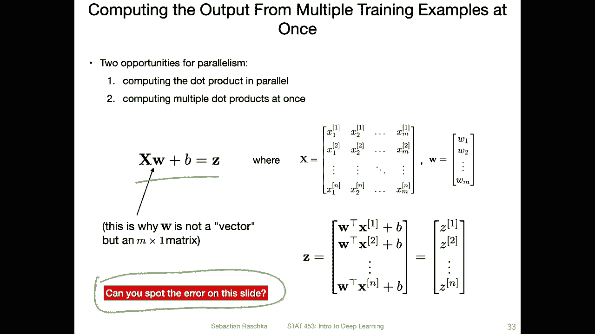

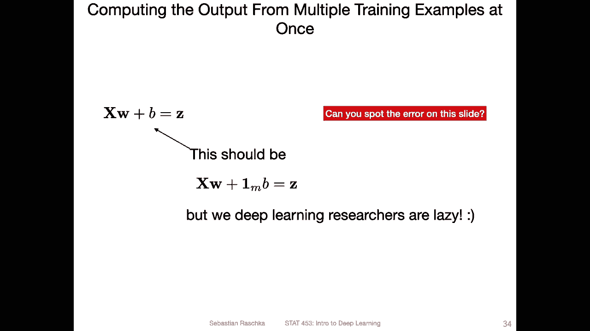

Vue， but in a traditional linear algebra sense you can't add a scalar to a vector that is not valid。

 So in a traditional linear algebra sense you would write it like this。

 but to be honest in the context of deep learning no one does that it's way too much work and yeah we deep learning researchers are lazy I just wanted to go over these things because yeah some of you might complain what type of math am I using here because this is not making sense I've learned that differently So I just wanted to illustrate that in deep learning we have our own rules in a way alright。

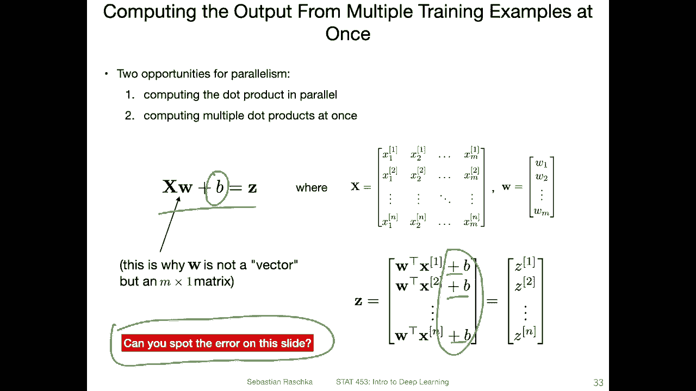

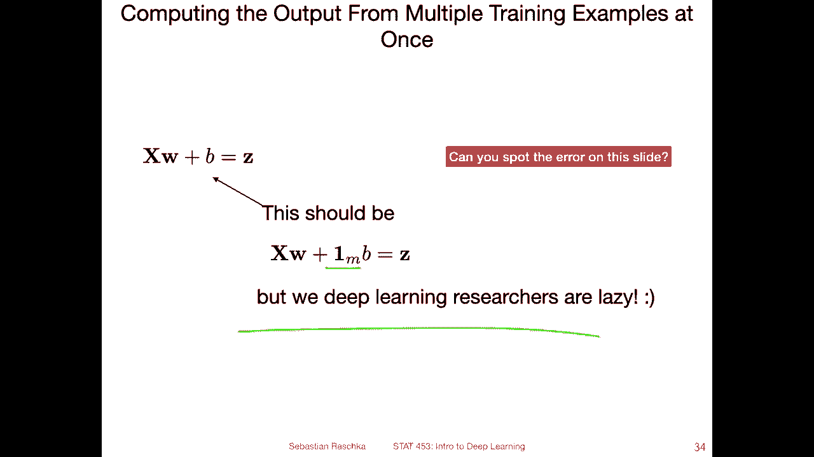

So yeah， lastly， the topic I promised for this video is broadcasting。 So yeah。

 in broadcasting what we do is we or we can add the one to the vector like I just mentioned before。

 not only that it's also possible yeah to add a vector to a matrix for example。

 So let's say we have a matrix here。 So here I'm creating this matrix as a2 by3 matrix values 4，5，6。

7，8，9。 And now I have a tensor here，1，2，3， the same as above and I can now add this tensor to the matrix and you can see。

It's adding these values，1，2， and 3。To each of the rows。 So it's adding 4。

 So the one and to 3 to the upper row here。 and it's adding。Also， the 1，2，3 to the lower row here。

 So the results are shown as follows。 So that is another thing that we can do in， in computing。

So and this is called broadcasting。 So under the hood Pytor and the same thing is also true for Ny。

 they will create another dimension implicitly so you can't see this dimension but it will just do it internally because it's kind of guessing of what you want to do。

 So in this case under the hood basically it's extending this one to yeah tensor So then you can add these two tensors together which will give you two three and4。

 This is something that happens under the hood and this is called broadcasting like。

Adding this implicit dimension and the same thing happens here where we have the matrix that we add to the vector or the vector to the matrix。

 So there will be also this implicit dimension where the values are duplicated。

 and then yeah this also works。So yeah， this is the concept of broadcasting and all I've shown you in this video was hopefully not too confusing。

 it's somewhat showing you that the rules and computing are a little bit more relaxed and more geared towards convenience compared to pen and paper。

 linear algebra。

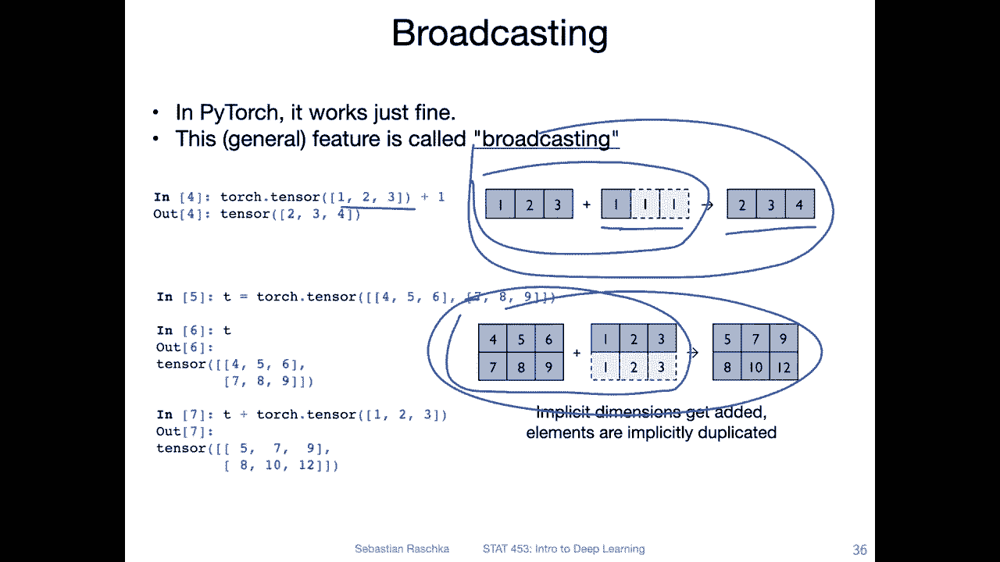

Alright， so then in the next video I will go over some of the notational conventions for neural networks and then briefly about cover some concepts related to fully connected layers and Pythtor and some more convention So these videos in general this yeah not this week today a little bit drier than usual but I think this is just foundation that we will need when we talk about multilayer networks soon。

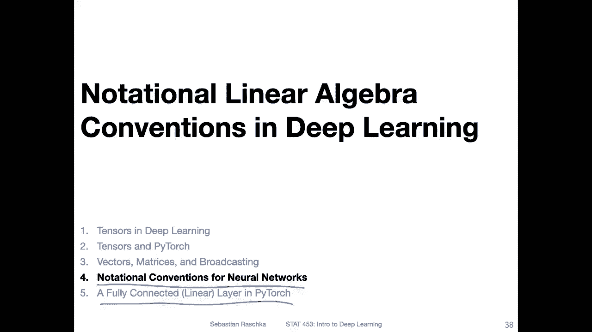