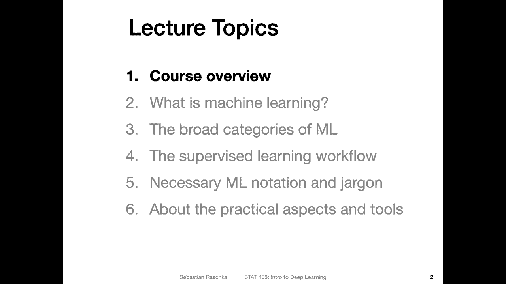
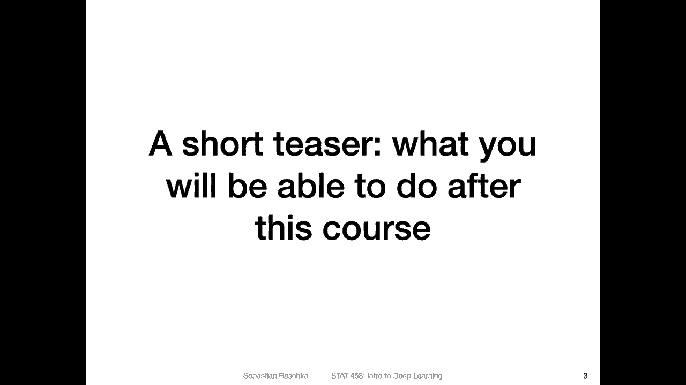
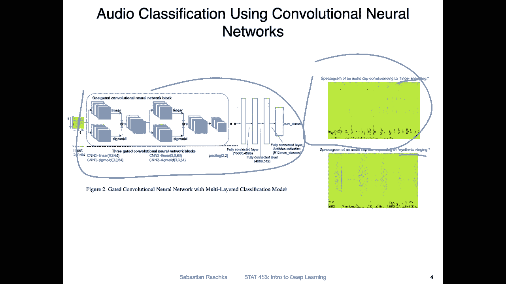
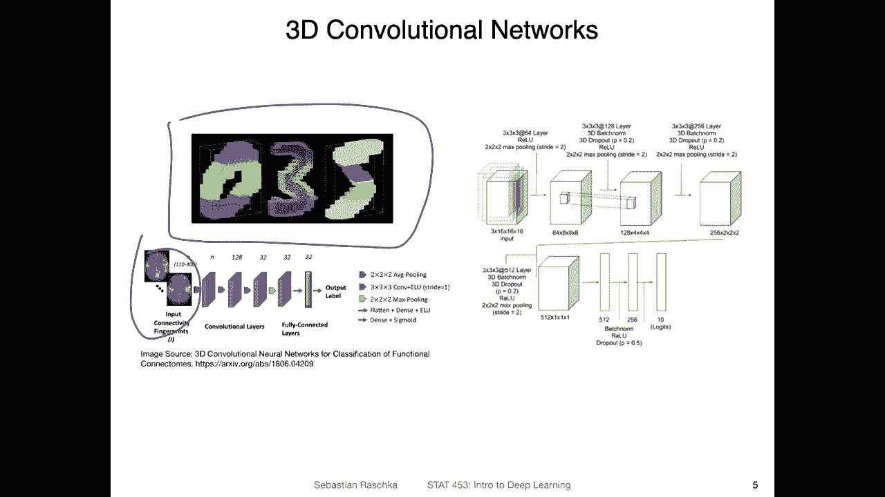
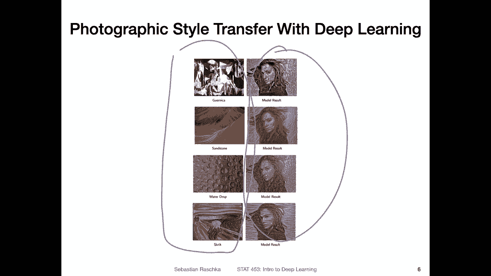
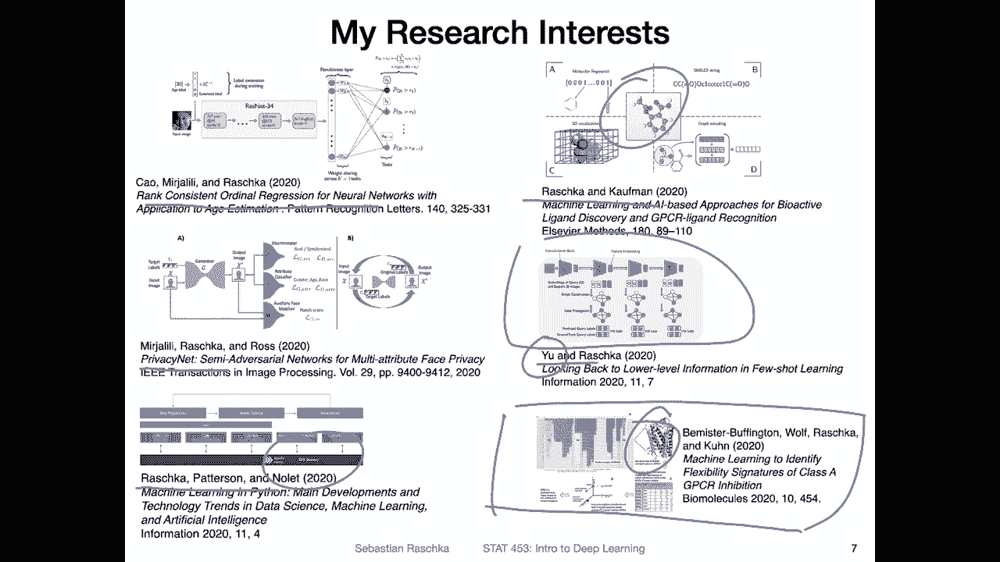
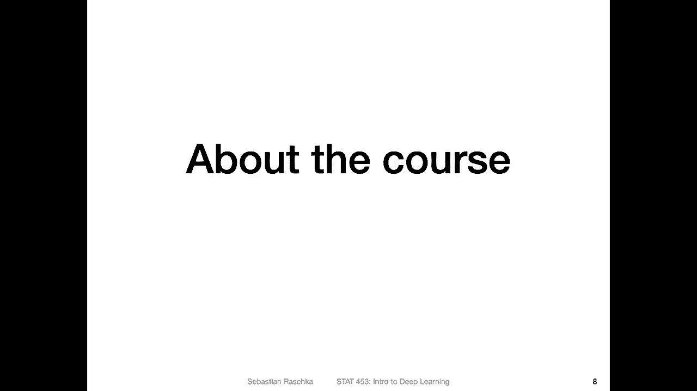
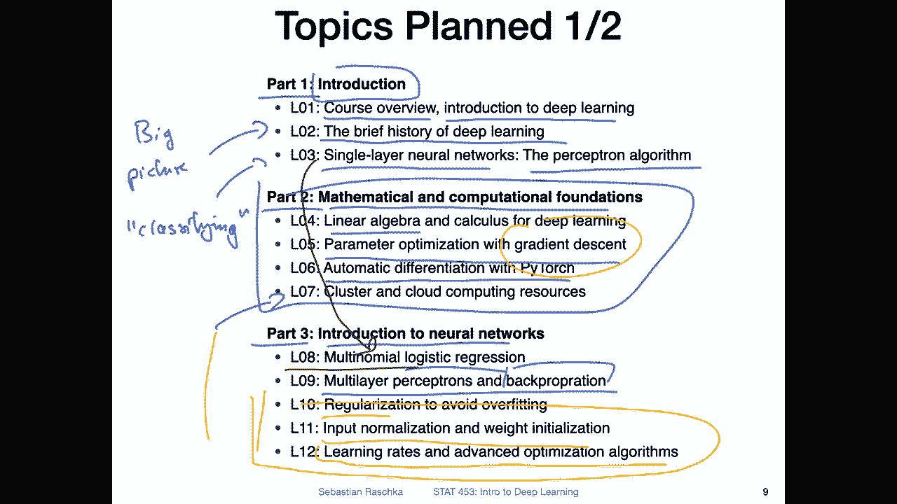
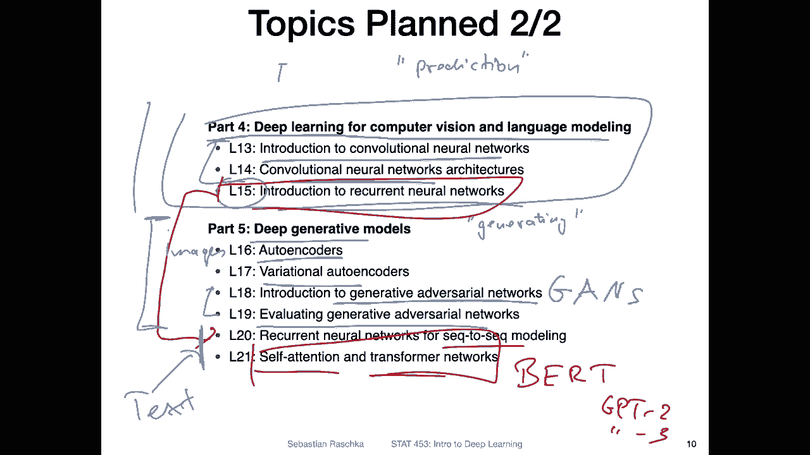

# P2：L1.1.1- 课程概述第 1 部分：动机和主题 - ShowMeAI - BV1ub4y127jj

Alright， let's now get started then with the contents I prepared for this week。

 I thought I would start with a short teaser what you will be able to do after this course。

 Of course， it's a long journey，1515 weeks in the future。

 but at some point you will be able to accomplish something really cool with deep learning things you will learn in this class。

 So here are a few examples of class projects that students worked on in the previous semesters。

 For example， in this project， students converted audio signals into spectrograms， for example。

 spoken text。😊。

And then they applied convolution neural networks to classify different texts and yeah。

 to extract language out of the audio clips。 So in this case。

 it was actually not language I just see it was finger snapping and here singing。

 So a distinguishing between different audio inputs。

 So was one example of a class project from last semester。

Another one was， yeah working with 3D convolutional networks。

 So this is a 3D version of the so-called MnesT data set。

 which you will be seeing a lot in this class， or at least in the introductory lectures later on。

 because it's a yeah simple data set to get started with neural networks。And yeah， in this project。

The students yeah worked with FRMI or yeah magnetic resonance imaging data so like brain scans and so forth and yeah classifying different types of yeah brain scans So that was another interesting project or also yeah students worked with different types of generative adversarial networks which will also be covered at the end of yeah this class where you will be able to generate new data or also mixed data from different data sources So here。

The students， yeah mixed artistic paintings or photographs。

 artistic inputs with portrait of a photo model。 and then the output was basically here shown on the righthand side。

 like a portrait of a person mixed with a different styles So this would be an example of style transfer。

 Yeah， why did I pick these three projects and it was kind of arbitrarily It was just something。

 Yeah so I looked at the projects were last semester to be honest and looked at which ones had yeah nice figures。

 So in that way it looked nicer on slides。 but of course you are free to work on whatever you like for your class project and I will talk more about that later。

 I don't want to overwhelm you with too many things at the beginning。

Just wanted to show you some examples of things you will be able to accomplish at the end of the semester。

Yeah also if you're interested a little bit about my research so I'm working a lot on machine learning and deep learning so also yeah just compiled an overview here of projects I worked on so yeah just to also introduce myself and what I'm interested in So yeah last year for example I worked on rank consistent auto regression networks we call that method coral which is for。

Oh yeah。You can think of it as classification of ordinal inputs so if you have class labels that are order and we want to sort them or predict the right order of the labels and also the numeric value associated with it that for that we developed networks here applied to age classification or we worked on face privacy we call this method privacy net where we can hide a facial attributes for example。

 age and gender and race and so forth from the input images for protecting one's privacy。

Also yeah collaborated with people from Nvidia， it was more like a review article。

 we wrote about the latest trends in the realm of Python， machine learning and deep learning。

 in particular the focus on GPU memory and that's also something we will be talking more about later when we talk about the tools that we will be using for this class。

Yeah， with a student of mine， I also brought another review article here on。

Machine learning andI based approaches for bioactive ligand discovery。

 So yeah one of my students is working on yeah small ligand discovery and synthesis also using generative models and generative deep learning models for yeah in the context of molecular molecular synthesis and design and yeah another student of mine is working on few short learning so few short learning is a branch of deep learning that is concerned with learning from small data sets most of the time people use meta learning or transfer learning we will be talking more about transfer learning later in this course。

 we won't be covering few short learning though I may ask though my student maybe to give a small guest lecture。

If he has time later this semester and Zhgji was working also on this paper。

 he is also our TA in this semester so if you are interested you can ask Zhongji more about different few short learning approaches and he would be very excited to chat more about you more with you about that I think so during office hours if you have questions about few short learning I think he would be excited to talk more about it because he's always excited to talk about it。

Yeah and lastly I'm also yeah working on some traditional machine learning methods so this was in a collaboration where we used not deep learning。

 but yeah traditional machine learning methods in this case nearest neighbor methods for yeah also predictions related to computational biology。

 So here this was concerned with the structure of GPR which is a G protein coupled receptor that is yeah very important protein or protein receptor。

 it's a binding to small molecules in humans and yeah most most drug targets are actually targeting GCRs but here this was more like。

Yeah， I have fundamental computational biology research。

 analyzing the structural yeah composition of these proteins。 So this is just a little bit about me。

 So you can probably see a thes that I like working on deep learning and also have some interest in computationally computational biology applications。

 So these two are basically my main research areas and things I'm really excited about。

Okay， but now let's talk more about the course。 So yeah， for this course， I planned lots of topics。

 so mainly deep learning and gene ad known。

Networks like yeah， like the cost title suggests。And I structured this cross into five parts。

 So here are parts。1，2，3。 And on the next slide， I have some more parts of the remaining two。So。

 first， in the introduction。That's where we are right now。

 I wanted to give you a brief overview of this course。

 and yeah also introduce machine learning and deep learning。

 That's what we are going to do this week。Then I want to also briefly briefly talk about the history of deep learning。

 And I think that's interesting， because。That helps you understanding like where the things and motivations are coming from。

 because yeah， deep learning， the term deep learning is relatively new。

 it emerged about 10 years ago， but it has a long history because yeah deep learning you can think of it as a fancy term for neural networks。

And neural networks have been around for at least 60。

70 years and are yeah some ideas that emerged very early on that motivated the development of different ideas later on and we will be covering a lot of things related to neural networks So in this this lecture you can think of it as the big picture overview。

So we will then just briefly cover the history and then later when we are introducing different topics in this lecture。

 we will do this step by step and relate it back to the history and also motivate why we learn about them and why they are useful。

Yeah， and then we will talk about one of the early methods of yeah machine learning。

 a single layer neural network。 So the perceptron algorithm， it's a very traditional algorithm。

 It's not very yeah commonly used nowadays anymore。

 but I think it's this like a easygo introduction to the problem of classification。

 So classificationifying。Oops。Classifying things， putting things into different categories。And yeah。

 I think that will be a good introduction to get started with the topic。

 and then we will have a small part two here。Which is concerned with the mathematical and computational foundations。

 So with that， I mean like introducing some mathematical necessities like linear algebra。

 So indeed deep learning， linear algebra is usually used。To express things more compactly。

 technically we can or we could use deep learning without linear algebra。

 but it would be very yeah hard to write it down and also slow to implement because when we use deep learning in practice the computing libraries that we use they use or they rely on linear algebra computational routines that help us executing certain computations more efficiently compared to let's say a Python for loop So linear algebra is like in that way。

 very important for deep learning we won't be covering or needing any advanced linear algebra concepts。

 just simple yeah vector dot products and matrix multiplications。 That's it basically。

But I I think it's still worthwhile yeah， covering this in a separate lecture because yeah。

 laying down the groundwork for the later lectures properly makes everything later on a little bit easier。

 I think。Then we will be talking about gradient descent。 That's， yeah a calculus topic。

 That's gradient descent is the main method for。Yeah， parameterizing or training neural networks。

And then after this is more like a refresher after covering this topic。

 we will talk about automatic differentiation with Pytorch。

 So automatic differentiation is yeah calculus on the computer。

 you can think of it like that and we will be using a tool called Pytorch。

 which is a library for Ya linear algebra automatic differentiation and then also neural network training or deep learning and it also allows us to implement things on the GPU to make things more efficient。

 So I will also explain them here。In lecture 7， how you can use cluster and cloud computing resources。

 it will be a relatively short part though because yeah the main the main topic is deep learning of course computational aspects are necessary but for this introductory class you don't have to be an expert programmer and or yeah user of computers you should be familiar with certain things on your computer and certain programming aspects but we are not here in machine learning engineering more like giving a conceptual overview so you will get by with some free resources that I will talk about in this lecture。

 but if you are interested you can of course also use more advanced resources for example。

 or campuses， HTCC and so forth。But it won't be required for this class。 Yeah。

 and then after the mathematical and computational foundations。

 we will be talking then finally about neural networks。 So in this part 3。

 I will lay the groundwork for yeah， deep learning。

 So we will talk or we start with logistic regression。

 which you can think of a single layer neural network。 So this is basically an extension of this。

Yeah， single network that we talked about earlier。 that is now。

Differentiable and using the logistic regression as a starter， we will add additional hidden layers。

 making this a deep network， which is also called multilayer perceptron。

 and then we will learn how we can train such a multilay perceptron using the back propagation algorithm then parts here parts 10 to 12 are more like tricks for training deep neural networks。

 for example。Regularization techniques to avoid overfitting input normalization and weight initialization。

 it's just yeah making training neural networks more robust and faster and then also talking about learning rates and yeah some advanced optimization algorithms。

 So like fancier versions of gradient in descent essentially And these are really kind of necessary to make neural networks work well in practice。

 these topics may not sound super exciting， especially like 10 and 11 but they are super useful or important。

 even yet to make neural networks work well。

And then we will get to the interesting parts in this course， or I would say the more advanced parts。

 so here in part4 we will then be talking about deep learninging for computer vision and language modeling。

 so we will spend a lot of time on convolutional networks， So this is one big topic。

And then we will also talk about recurrent neural networks。 They are for language modeling。

 so convolution networks are more for image modeling。

 although you can also use the one dimensional convolution network for text。But yeah。

 text will be more focused on in lecture 15 and these will kind of also lay the groundwork for the deep generative models that we will be talking about。

So in terms of deep generative models we will be talking about auto encoders。

 so-called variational auto encoders。 then we will talk about generative adversary networks。

 You may already have heard of them as GNs。 So just the long form of writing G generative adversary network。

 then this is also a very big topic。 we will have a。2 lectures on that。

 So one introduction and then one on some more advanced Gs。 for example， the bastein G。

 and then also how we can evaluate and compare different Gs to each other because now in this part。

We are focused on prediction。Oops。Prediction and。And in the second part here， we are focused on。

Generating。Thinks， so it's a little bit different。 It's a little bit trickier to ever these models。

 So we will have a lecture on that。And then I also plan to cover some aspects about recurrent neural networks forative modeling。

 for example， generating new text on using or in a sequence to sequence context。

 So here in lecture 15， I will first try also to focus only on the prediction parts。

 but we will be revisiting this topic also for yeah generating new data on text and then also going into a more advanced topic。

Adding the so called attention mechanism to R and ends and then also explaining self attention in the context of transformers。

 which are yeah， underlying the models that you have heard about in the media probably one is called bird or G。

2 and GP3。 So these are the building blocks of these model。 So we'll also talk about those， so。

I't want to make this too crowded here， but this part will be essentially。For images。

And these two last parts here。Will be for text。 So we will have both generative models for images and for text。

