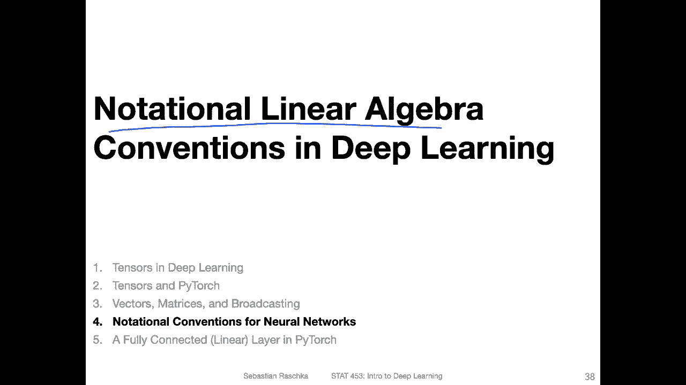
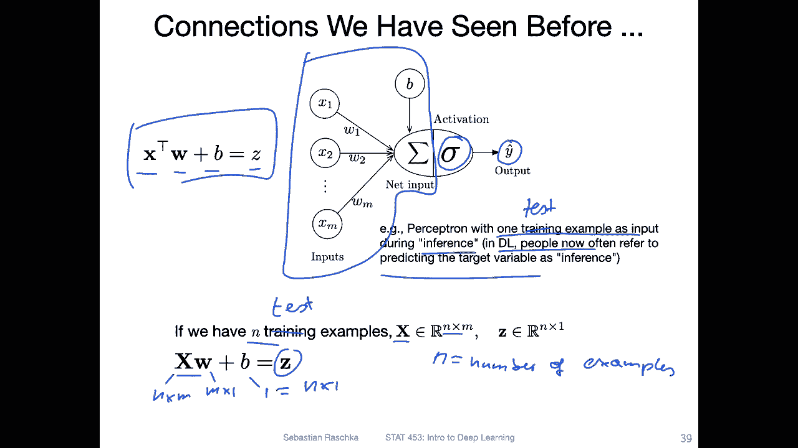
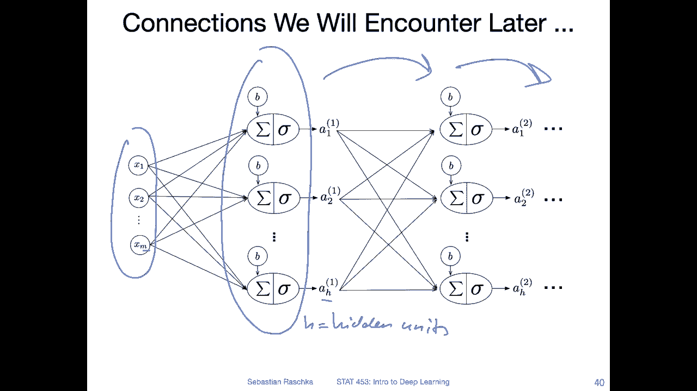
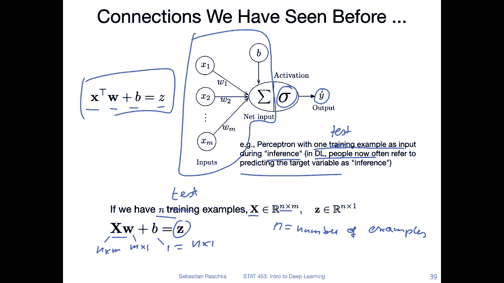
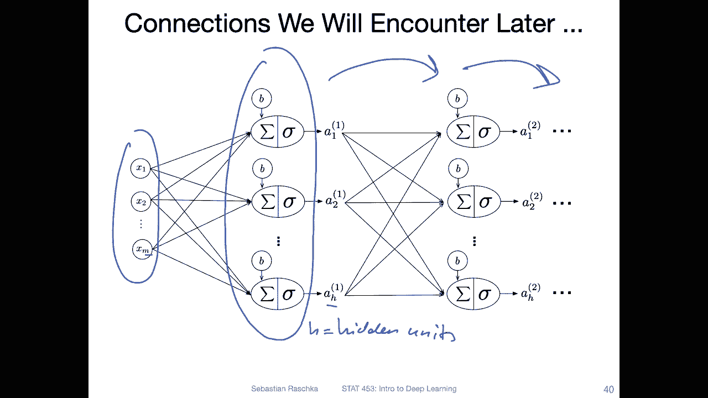
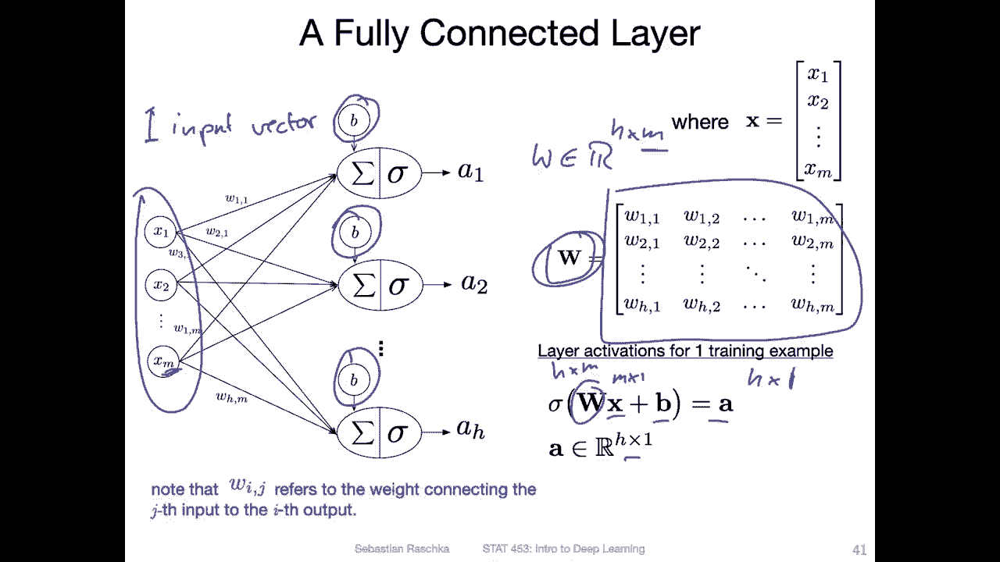
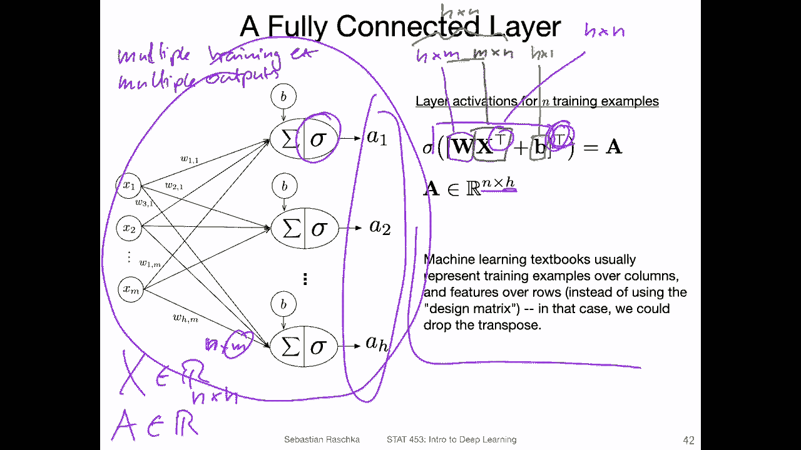
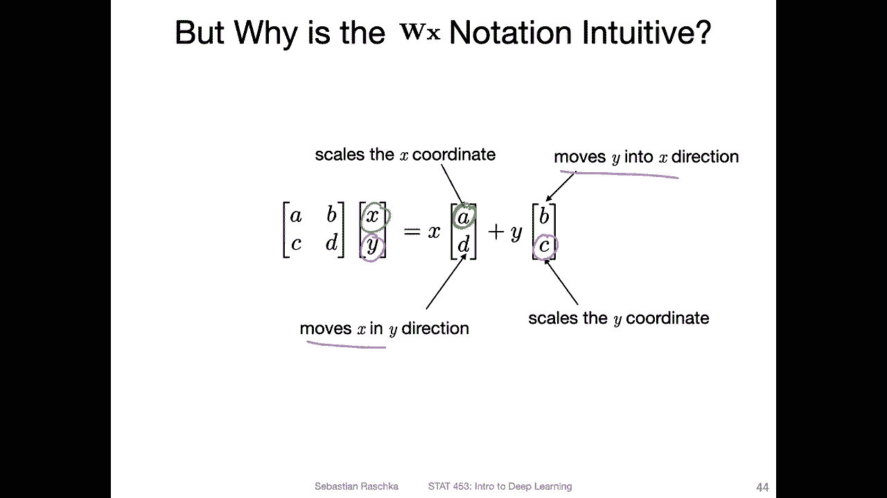
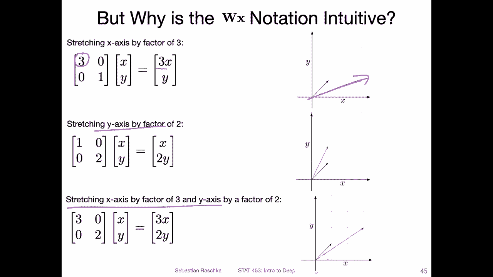
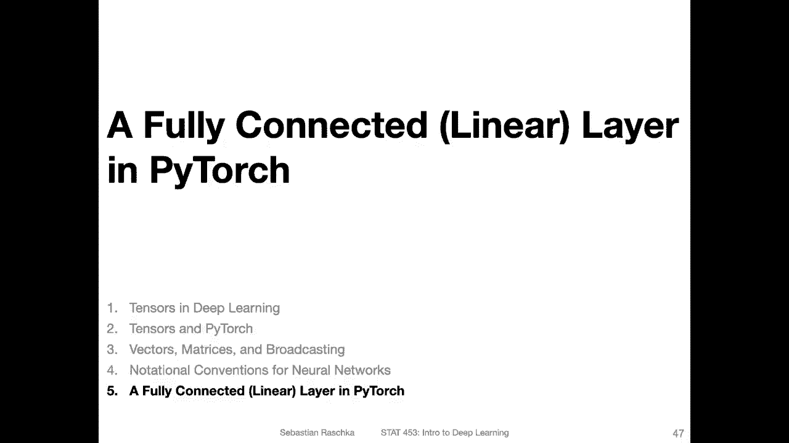

# P30：L4.4- 神经网络的符号约定 - ShowMeAI - BV1ub4y127jj

Yeah， in this video， I want to briefly go over the notational conventions regarding linear algebra and deep learning。

So。This is something we have seen before， from the perceptra lecture。So at the top。

 there is a perceptron。 And now imagine we do inference。

 So inference in the context of deep learning means basically predicting the label of input feature vector。

 So in the perceptron， assume we have one training example as input or let's say。Test。

 test data point or test example as input。So how we would do that is as follows。

 we would have x transpose W plus B， the bias unit and then get the net input and then we give it to the activation function。

 which was the threshold function， and then we get our prediction。So here this part。

Is doing this linear algebra computation， x transpo dotw plus B。So now this is for one data point。

 We can actually also extend that to multiple data points。

 So if we want to do that for multiple data points like n training examples or n。Test examples。

 we can use a design matrix for representing the data and n times M dimensional design matrix。 So N。

Its the number。Of examples。And。We would write it as follows。 So here x is n times M。W is m times 1。

B is just as scalar as a1。And then the output should be n times M dot M times1。

 that should be n times 1。Y， in times1， that should be our output。 So in this way we have a vector。

 So each value in the vector is the net input for the corresponding test example。

 So that is just how we can process more data points at the same time with still a single operation here。

Now， in deep learning， we usually have these neural networks with hidden layout representations。

We will learn about that a little bit later in this course， actually， like I think next week already。

 So we have， let's say one data point is input here。 That's the feature vector and。Features。And then。

 we will have。A number of outputs。 So let's say H。Is the number of hidden。Units and a hidden layer。

 And then we have also multiple hidden layer。 so we can have another hidden layer and another one and so forth。

 So in this way， what I want to highlight here is that whereas in the perceptron， we have a。

Single output here。Here， we can have multiple outputs。So how can we deal with such a。

 yeah scenario using linear algebra。 So what we can do is we can now have a weight matrix。

 So before I talked about the design matrix for the inputs now。

There's one。Input。Vectctor 1 data point， but multiple outputs。 So this way we can use a matrix here。

 So this matrix would be。H times m dimensional。So。😔，Let's write that down。嗯。H times M。

 So H rows and M features， whereas the features are corresponding to the M here。 So the M。

Matches here。 So what we do is we put the W in front。The x second。 So this would be。

 if I write this down。H times M dot。M times 1。And B should be then also the same dimension as H。

Cause there is one bias unit for each。Computation here。 So the output should be Hm M dot M times 1。

H times1， H times one dimension output vector。It's also what I've written down here。 I just see。

 So yeah， so in this case， this is how we can deal with multiple outputs and we will learn how this works also。

 yeah， shortly later on next week。 Okay， let's now put both concepts together。 So we have multiple。

Training。Examples and multiple。Outputs。So we have now a matrix for the weights and a design matrix for the inputs。

 So let's write it like this。 So W has a dimensionality。H times M， like on the previous slide。And x。

Ha's the dimensionality n times M。 it's a design matrix， right。

 But now if you want to multiply those two， you notice that they are not compatible， right。

 The inner dimensions don't match。 So that's why we have the transpose here。 So get me。Write it。

 like。This， so this has a dimensional team。On M times。And now， so those dimensions match。M。

Is H times one dimensional。So if I multiply those。 So these match inner our ones。 So we have n。

 So this one is。H times n plus h times 1。 So the resulting。Resulting matrix， if we。Look at this one。

The dimensionality of that one should be。Each。😔，Times。😔，N， however。

 it is usually nice for each layer to resemble the input dimensions of the previous layer， right。

 So the original input， you can think of x as the original input was。N times M。

 So it would be nice if we have for this one as input to the next layer。

 the same near dimensionality， like the same ordering。 I mean， not exactly the same dimensionality。

 but the in the first dimension， the inputs， the number of input should be the same。

 we are carrying over the same number of training examples。 So what we would want is。

For a for the outputs to have the functionalityality n times something， So n times。H。

 where H is the hidden dimension。So in order to achieve that， this is why we have the transpose。

 So with this transpose， we have then the n times H dimension。 So it's usually nice。

 What I mean is it's nice to have the training examples as the rows always。 Now。

 if you think of this。What's going on here， you can think of it as a linear transformation that is happening to x。

 So instead of the original M features， we now have H features and H could be larger or smaller than M。

 So they are in deep learning both some networks make make it larger and some make it smaller。

So there's a linear transformation， like I said， but it's not necessary completely true。

 So if this is a nonlinear function， then it's not a linear transformation。

 It's a linear transformation that goes through a nonlinear activation function。

 but we will talk about this activation function next lecture。So， but yeah。

 this is just like the overall notation。 Also in textbooks。

 you may notice that there is no transpose。 So I have a short note about that。

 And the reason is in textbooks in older textbooks， especially， they have。Not the n times N。

 n times M design matrix。 They have a M times n design matrix。

 So they have the columns as and rows switched， which is a little bit confusing。

 I just want to note that in case you stumble upon it。

So usually modern deep learninging has intense and dimensional inputs。

Sometimes it makes things more inconvenient from a linear algebra perspective because youll notice here we have these transpose。

 if you have it the other way around you don't need the transposes。

 but yeah there's always a trade off。

Alright， so why also this W X notation， Why not X W， actually in the next video。

 I will show you that in Pytorch， it's the other way around。Traditionally， though。

 this is convenient because its there's some intuition behind it in terms of linear algebra if you think of traditional methods。

 how you write things in linear algebra， it's that you have a transformation matrix that you apply to a vector。

 so the vector would be here your feature vector。And this makes it sometimes or for some people。

 easier to think about。Linear algebra in a geometry context。 So here this is just an identity matrix。

 so nothing is going to happen。So。Technically， these。Diaagonals， I think I have a slide on that。

 These diagonals are for scaling。Or this diagnosis for scaling values in the vector and。

The other diagonal is for。Translation so moving things。

And it's like easy to see so why the eigen sorry by the identity matrix here is not doing anything because the scaling is here 1 and 1。

 so scaling something by one doesn't change it and translation by0 doesn't change anything either So in this way。

The original inputs are preserved。 So also， if you think of it as a dot product。没。

Remove the notation here。 If you think of it as a dot product。So one times 0 with this one。

It's basically1 times x1 plus0 times x2， which is x1， right。

 And here0 times x1 is 0 plus 1 times x2 is x2。 So nothing is going on here。

Yeah， he actually has a slide on that。 He has like a summary。Of what I just meant。 So you can also。

 yeah， write it as follows。 So whereas。If you you can be compose this into two separate operations vector edition with this scalr here。

 and then you can think of this first one as scaling the x coordinate。And then， you can think of。

This one。Is scaling the y coordinate。 So like I said before， these are for scaling。

 and then the other ones are moving。

The vectors。 So these are for moving the vectors。Yeah， here， I just have a example of the scaling。

 So for example， if you have a matrix that has a three here， it would scale 3。 So sorry。

 scale the X X by 3。 So it's kind of stretching it here。

And so forth here it scaling or stretching the y axis by a factor of  two。And。

This one here at the bottom is doing both stretching and scaling。

 and you can maybe as an optional work， think about the translation。

 But in the context of deep learning， I think it might be helpful sometimes to think of it as a series of transformations。

 But yeah， also one of the reasons why we use a linear algebra is more like for making notations more compact。

 and we'll show you in the next video how this is achieved in pytorch。

