# 【双语字幕+资料下载】威斯康星 STAT453 ｜ 深度学习和生成模型导论(2021最新·完整版) - P31：L4.5- PyTorch 中的全连接(线性)层 - ShowMeAI - BV1ub4y127jj

Yeah， in this last video of this lecture， I want to give you a brief teaser of Ptos convenience functions。

 the linear or fully connected layer， but also like to just wrap up the conventions regarding linear algebra。

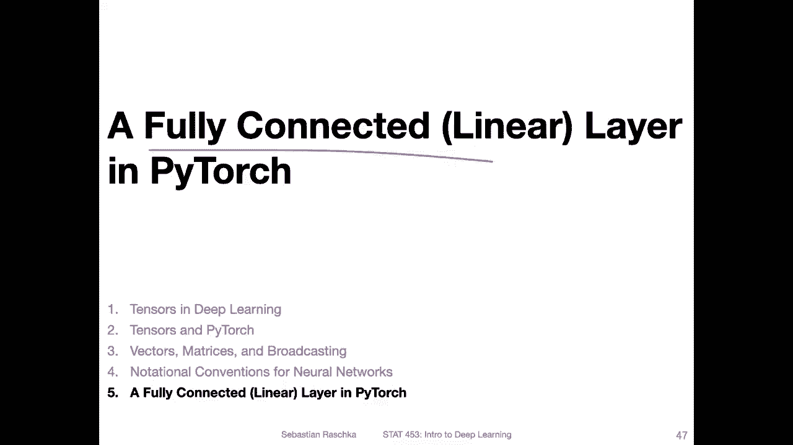

So yeah， what do I mean by fully connected or linear layer。 So if we have a multi layer。Network。

 like shown here so。This part here would be a linear transformation if we don't consider the activation function。

 and you can also think of this as a fully connected layer。 So this is sometimes called fully。

Connected。😔，Lair。Or sometimes people also call it a dense layer。In Py。

 it's called a linear layer because it's a linear transformation。

 so you can also think of it as a linear。Lair。😔，And in the context of kas and Tensorflow。

 people call it a。Dense。😔，Layer， so all these things are equivalent。

 So another dense layer or fully connected layer would be from here。

To here so neural network really is， yeah， a concatenation of multiple of these fully connected layers。

 which are then interspersed with these。Non nonlinear。Actation functions， for example。

 So you can do this many， many times。But also multi layer networks are topic for a different time for a different lecture next week。

 just outlying already how that relates to linear algebra here。 So how we then。

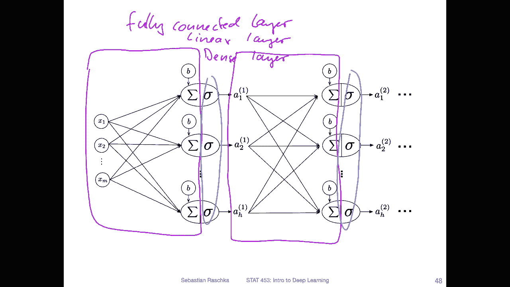

Yeah， implement a fully connected layer。 and Pythtch is very simple。

 There's actually a function called torch and end dot linear。 So let's start with the data set here。

 So let's assume I'm just creating some random data。

 but let's assume this is some valid training data。So this is嗯。Design matrix with dimensionality。

 What do I have here 10 times 5。10 times 5 input matrix。

 And then when we initialize this linear layer。We give it the number of features and the number。

 So that's the input features and the number of output features。 So here we have five features。

 like that's our design matrix， the n times M matrix。 And let's say we want three output features。

 the output features。 if I go back one slide are。

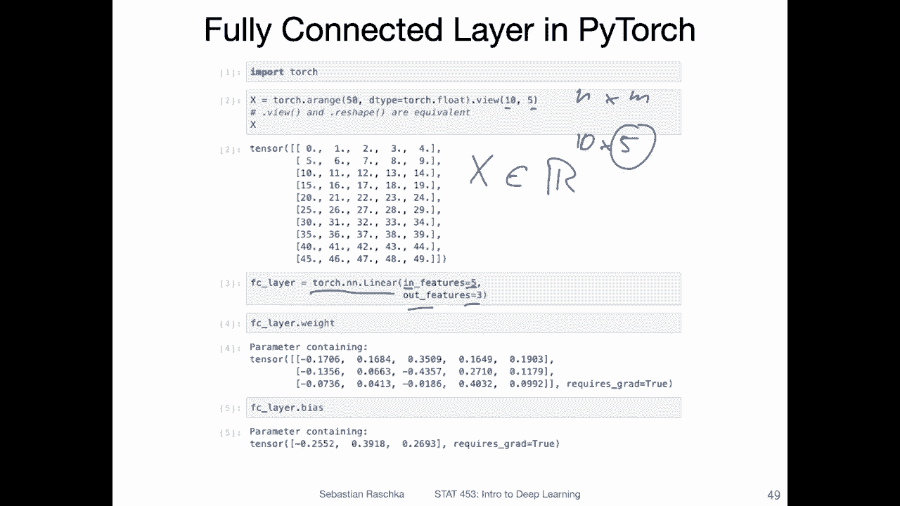

These same what I highlighted。Well， here， you can think of it as these here， the net inputs。

 So that's basically the N number of outputs。

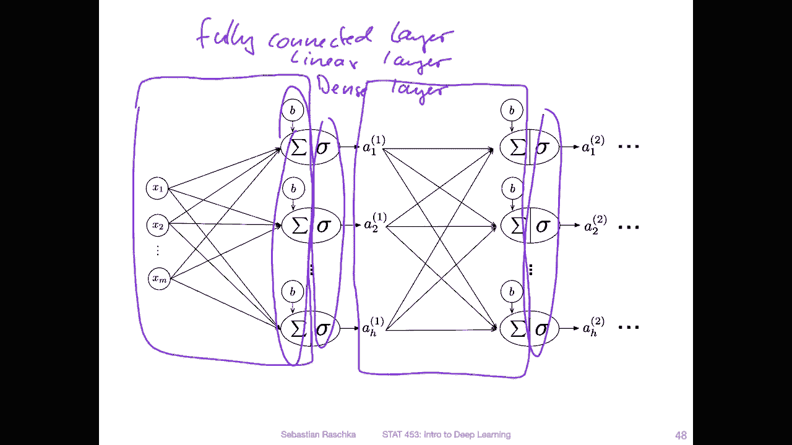

And they are computed via this linear transformation。All right， so。Then each of these linear layers。

 when you initialize it here。Has attached as an attribute， a weight matrix and a bias vector。

So the weight matrix， you can see it here is。H times M or in this case。Three times five dimensional。

 right。 So you have three rows and five columns of  three by five dimensional。 So you can see。

That this5 here matches with this5。So that's the number of input features。

 And the bias unit is equal to the number of output features。 So in this case。

 it's a vector with three values， so。

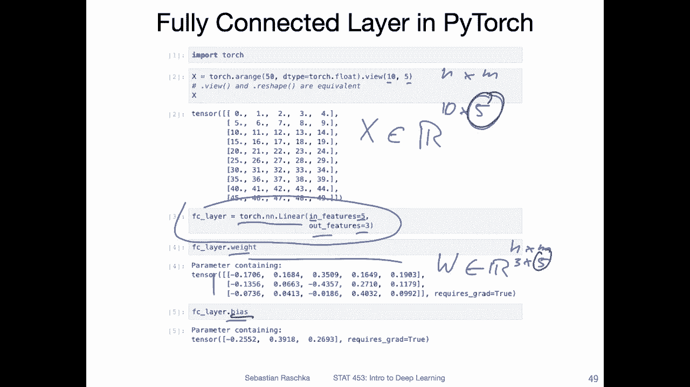

Because each output has a bias unit attached to it。

 So here we would have five inputs in the next slight example。

 if I would modify it here and three outputs。

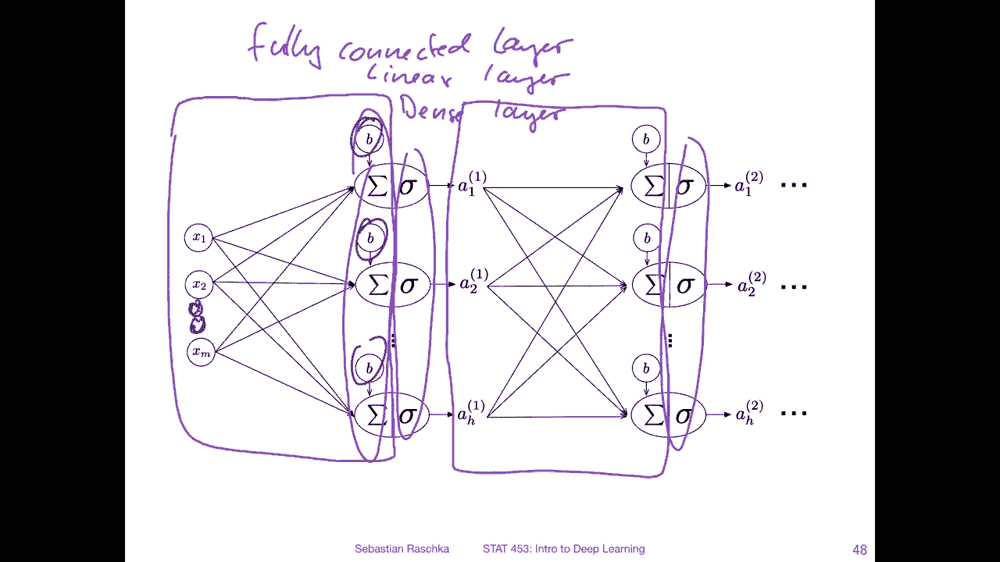

Alright， so， and notice here， these are also small random values。

 We will talk about it later why it's useful to have random values here instead of all zeros。

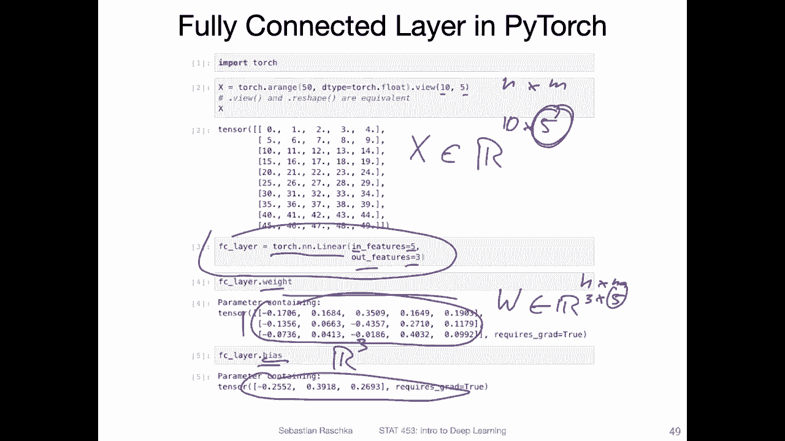

No。😔，Here I'm printing the dimensions for the input， the weight and the bias。 So let's 10 by 5。

3 by 5 and 3。Now I'm applying this fully connected layer。So， I'm applying it to this。X。

 which is 10 times 5。And the W， which is  three times 5。And the output。 So there is also plus B。

 So This is a matrix medication plus B， which is three dimensional and the output。Is。

What is it 10 times  three dimensional A is a 10 times  three dimensional matrix。

 So how does that work？ So what is going on here， So you can already probably see there must be some transpose here for the W。

 right， so that the5 goes in front the and the three goes here。

 And then maybe it's compatible with this x。 But is it really what's going on。 So yeah。

 that's what's going on。 So yeah， I have a summary of that。

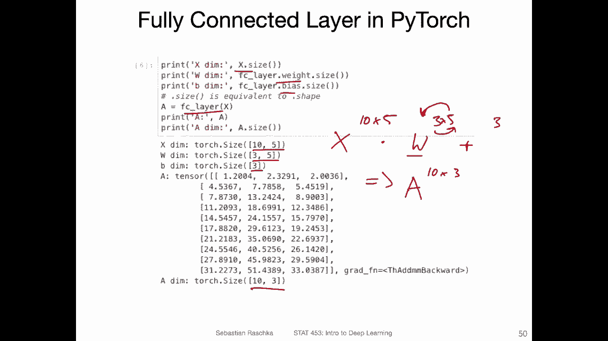

So I also have to stare for it。 or I have to stare at it for a few seconds。

 and let me see what I've written down here。So yeah。

 based on Pytorch we have another convention here， recall in the last video。

 I mentioned the convention where the W， the transformation matrix or weight matrix is in front of X and Pytorarch is it's after x and I think this makes sense not from a geometry perspective but from a data flow perspective because in this way we have to use fewer transposes and also it's kind of symbolizing the way that data flows through the network so we start with x。

 and then we multiply it by a weight matrix W and then we get a so we have X do。

W resulting in A and stuff like that。 So it's more like this linear。Thenard flow here actually。

 I'm writing always a， but it's the net input。 so it depends on whether we apply the activation function or not。

 actually I have it here。 No worries then alright so。

If we have an input with one training example like this x here， this vector。

 then we can use the notation where x is in front。 if we transpose W， then the dimensions will match。

 right。 So here in this case。It's a1 times m dimensional。

Vectctor where W is an M times h to dimensional vector。 So the result。W will be just one value。

 The result will be then one times h dimensional vector。And。If we have n inputs。

 then we can also keep x in front。 We can also transpose W。 Then in this case。

 what will happen is that。We have an n times M dimensional one here here。

 the same M times H dimensional one。 And here we will have an n times H dimensional one。 So this way。

 what is nice about this convention is we can keep the same operations here， whether this is。

Multiple or only one data point。 So this is actually quite convenient from a computational perspective。

 So if we have code， we don't have to change much around。

 And if you don't believe me that this is the way Pyr does it here is the source code if you want to look at it。

 so this is like the common convention in Pytorarch how the linear transformation happens。

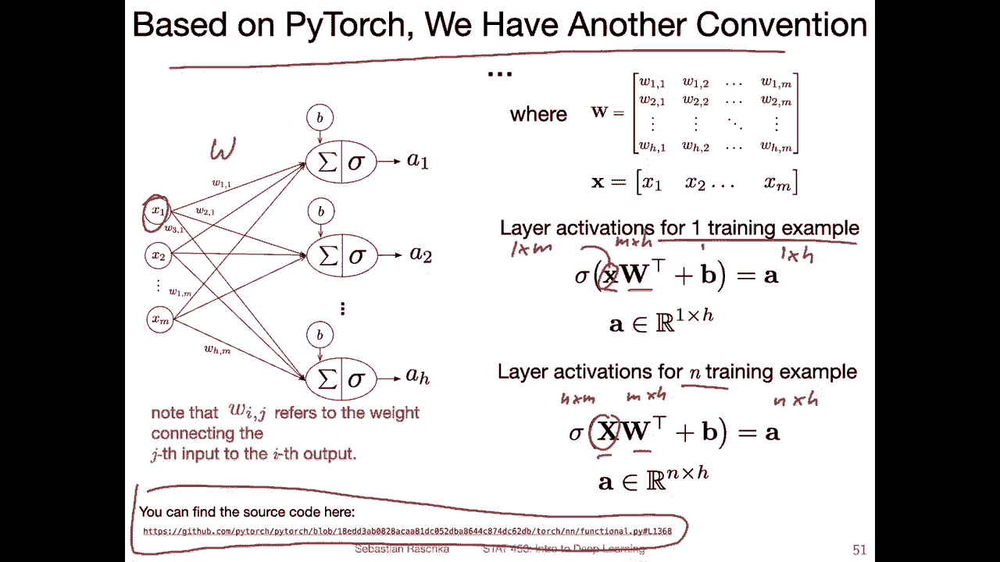

So yeah， just to conclude， I mean， there are multiple different ways we can compute this linear transformation。

 What's really important is thinking about it， like always think about how the dot products are computed when writing and implementing matrix modification。

 So because， yeah， sometimes it's easy to make mistakes so。

Things may compute because dimensions match， but it's not computing what you wanted it to compute。

 So it's always important to write down what the dimensions are and what you're computing and what you expect。

 Yeah， the output is。Because yeah， also theoretical intuition and convention。

 like having the W in front as a transformation matrix does not always match up with practical convenience。

 like when we write things in code。So。Here I've written down some rules that you might find useful when you're reading textbooks and things are not the same as let's say in code so you can easily late between those concepts for example。

 if you have two matrixes A and B multiplying those is the same as B transpose a transpose and then taking the auto transpose here。

 So that's the same thing And also here these are the same So I was just writing down some rules here that help you maybe be navigating switches between code and textbooks I think you probably won't read many textbooks because there are not many deep learning textbooks really yet。

 but maybe in the future sometimestime but also in papers people use all kinds of different conventions。

 So I think this is like a handy thing to keep in mind。

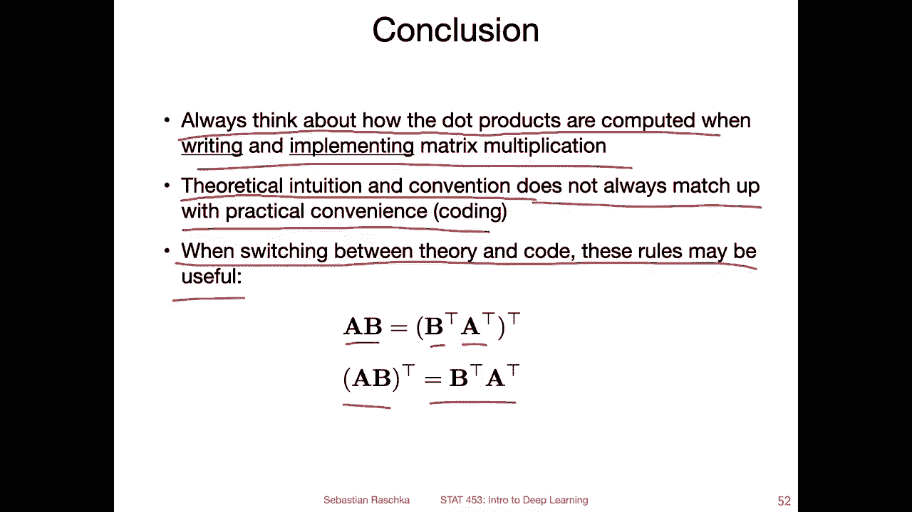

And yeah， also just to summarize traditional versus Pywach conventions。So， yeah。

 there are multiple ways we can compute this linear transformation。 Like I mentioned。

 we can have this weight matrix up front。So this would result then。In H times one dimensional vector。

When。X is a feature vector M times 1 dimensional。 This is the same using the rule as I that I showed you in the previous slide as writing it like this。

 Sam thing。So it gives us a wait for the same input gives us the same output。

Another way we can write that that is how Pythr does that is putting the x in front。

 but yeah we are transposing W here。 this gives or this assumes a different input though。

 this assumes the one times m dimensional input and yeah this is actually my preferred representation because this is kind of easy when we go back and forth between one or multiple training examples because now here at the bottom would be the cases where we have n training examples。

 So if we want to use it the traditional way we have to use true transpos which is more work。

 So this is the usual case in deep learning we have usually many inputs and many outputs So we only have to use one transpose it's shorter and this is also the way。

Pyroch implements it。So所搜到。Pyarch convention。 So just to sum it up for this lecture。 So， yeah。

 as a little und homework experiment， you may。

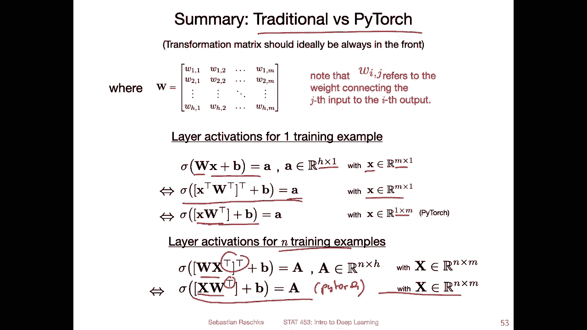

Yeah， you can， if you have extra time， revisit the perceptron Ny code。

 and without even running the code， just thinking about it。

 Can you tell if the perceptron could predict the class tables。If we feed it in array， I'm actually。

Underigning it in an unfortunate way。 without running the code。

 can you tell if the perceptron could predict the class labels if we feed an array of multiple training examples at once。

 So if we have。A design matrix。Of。Dimenssality。And times M for testing。

Would it be able to run after training？ So if yes， why， if not。

 what change to the code have do you have to make So you can think of this。

 And then you can actually run the code， right with design matrix is input for prediction and see whether your intuition was correct and also feel free to open a discussion on Piazza about that。

So yeah， run and verify your inition。 and then how about the train methods。

Can we also have some parallelism through matrix modifications in the train method。

 having multiple training examples， so does it make sense。Without， let's say。

 fundamentally changing the perception learning rule， would that make sense。

 So it's also another thing to think about。

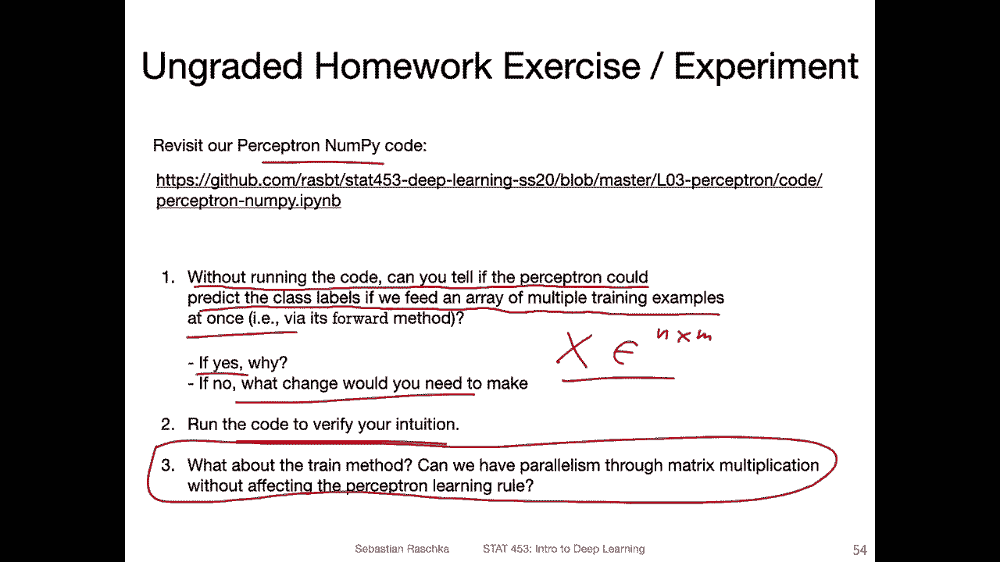

Allright， so。Next lecture， then we will talk about yeah more like a deep learning topic that is not like fundamental linear algebra。

 We will talk about a better learning algorithm for neural networks。

 So we learned about the perceptioncept rule next last week。

 but this is actually not a very good learning rule and we will yeah develop a better learning rule next lecture。

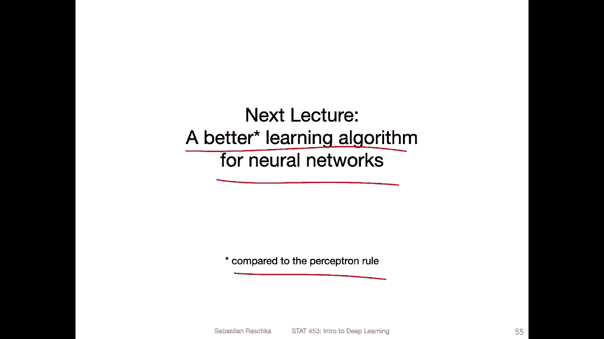