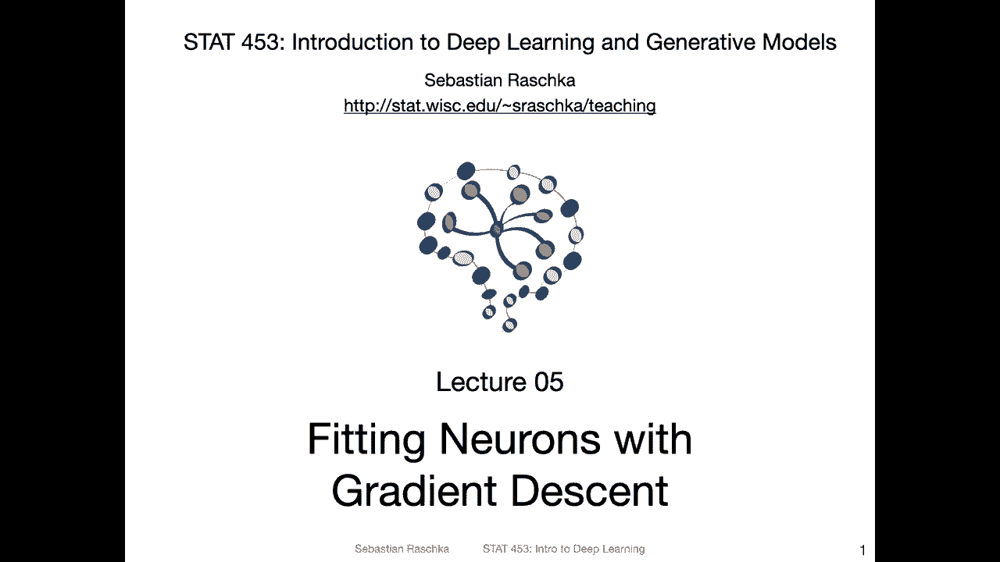
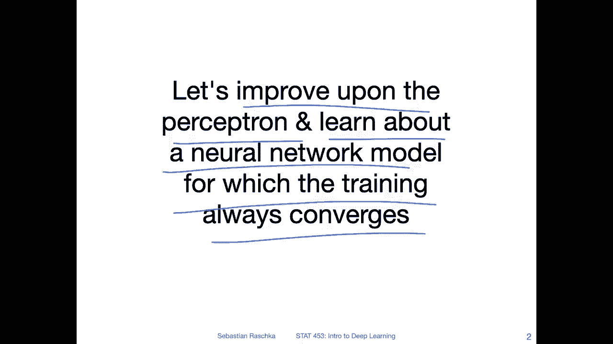
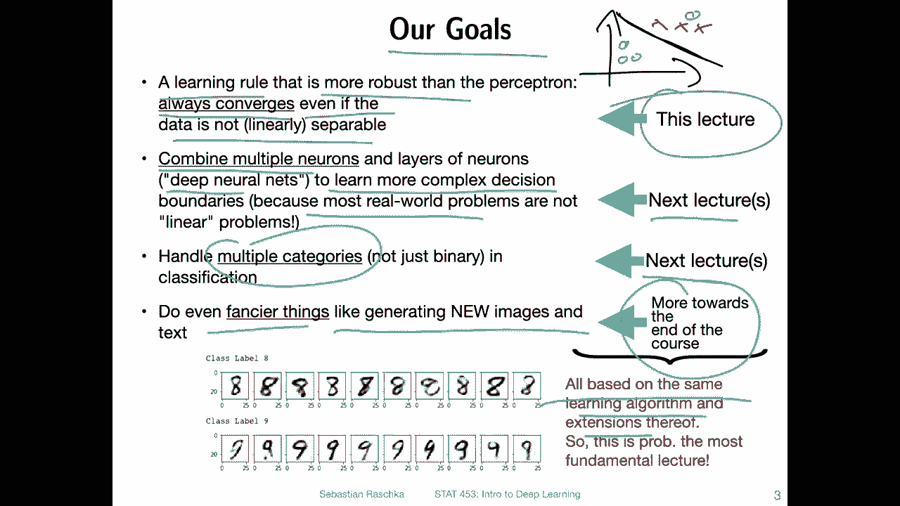
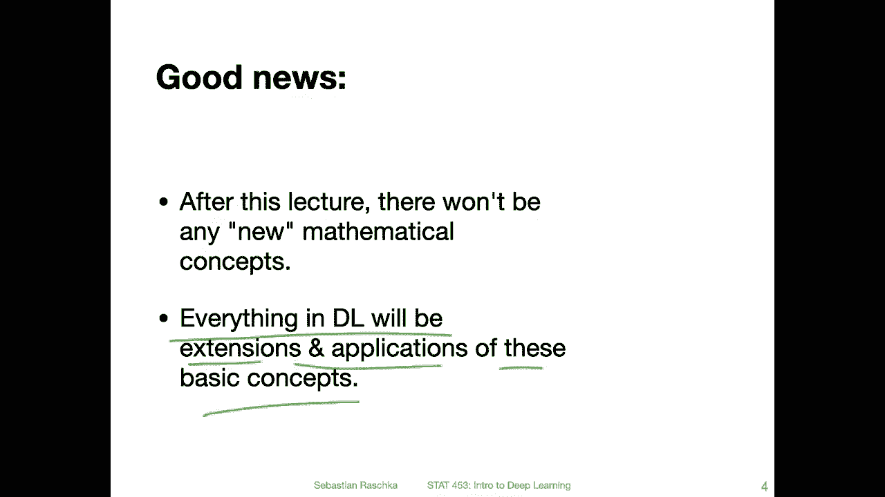
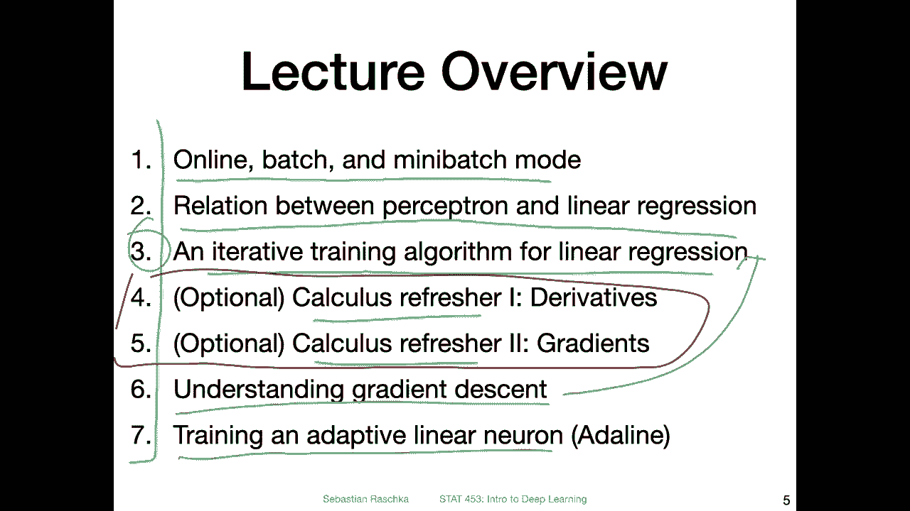

# P32：L5.0- 梯度下降【课程概述】 - ShowMeAI - BV1ub4y127jj

Yeah， hi everyone。 So we had a little excursion last time talking about linear algebra。 Today。

 there will be another little excursion talking about some concepts in calculus。

 because they will be useful for， yeah fitting neurons with gradient descent。 So today。

 the lecture will be on gradient in descent。 and I will have some optional sections on。

 some calculus topics as a little refresher。 But yeah。

 because I think there's a lot of stuff to cover today。

 I will keep the introduction short and just dive in。😊。

Yes， so the goal here in this lecture is to improve upon the perceptron that we covered last week。

 So in this lecture， we are going to talk about or learn about a neural network model for which that training always converges。

 So even if the data is not linearly separable。 here's an overview of the big picture goals。

 So our goals overall。 So like I just said in this lecture。

 we are focusing on a learning rule that is more robust than the perceptron。

 so that it always converges， even if the data is not linearly separable。

But yeah that is not the end goal of this course。 Of course we want to learn about more sophisticated models compared to single layer neural networks。

 So what we really care about is also how we can make or create more complex classifiers that can solve more complicated problems than just binary or linearly separate problems because if I have something。

Like that。 where I have two classes。 I mean， this is relatively trivial， right。

 So the perceptionceptron again had the shortcoming。 If data point is over there。

 there is no linear decision boundary such that there is no mistake。 So that way。

 it would never converge。 But even let's say， if we have a learning rule that converges like this。

 this is a relatively trivial problem。 And in practice。

 we are yeah interested in more complicated problems。

 So we need to also find a way to combine multiple neurons。 because。

These combinations of multiple neurons or deep neural networks can help us to learn such more complicated decision boundaries。

 and then with that we can solve yeah， also complicated real world problems。

 there are many like objective detection and let's say on classifying arbitrarybitary things。

So in that way that is something we will then start tackling in the next lecture。

 So first here we lay the groundwork talking about the learning rule and then we will apply the same learning rule to the combination of neurons and also we will then learn how we can extend this to multiple categories。

 It will also be next lecture next week。So we will learn also how we can classify yeah problems where we have more than two classes。

 which is also important， of course， right， if you think about。

 let's say you you build an application for a birdwacher to classify birds outside。

 So there are more than just two bird species right So in that way we will also learn about methods that can handle multiple classes。

 And then yeah more towards the end of the course， we will then also learn how to do fancier things。

 not just classification， but also like things like generating new images and new text and things like that。

But yeah all these types of things are based on the same learning algorithm and extensions of this learning algorithm。

 it's not like a fundamentally different though and in this lecture here we will learn the core principle of this learning algorithm that we will be using for the rest of the semester。

So and yeah also the good news is after this lecture here there won't be any new mathematical concepts so in this lecture I will talk a little bit about calculus but that is about it when it comes to the mathematics of this course。

 of course there will be mathematical concepts or applications of the concepts we discussed like the linear algebra stuff and calculus stuff in this lecture。

 but there won't be any new fancier concepts so after this lecture you can relax there won't be any yeah new mathematical complicated things going on。

😊，So everything also in deep learning will be extensions and applications of these basic concepts in linear algebra and calculus that we are covering now。

So MI， just to give you the big picture overview of things I have in mind for this lecture。

So first we are going to talk about the different learning modes。

 there's something called online batch and mini batch learning。

It is a general concept that applies to all types of single layer neural networks and multilayer neural networks。

 convol networks and everything basically in deep learning and MIa after just this big overview here。

 we will talk about the relationship between the perceptioncept and linear regression。

And then we will learn about an iterative training algorithm for linear regression。

 You probably know the closed form solution for linear regression these the matrix formulations and such the short con dense formula for solving for the weights and the bias unit directly here we will talk about an iterative learning algorithm because it helps us understand。

How we can train neural networks。 It's kind of very closely related。 Yeah。

 I will have a little calculus refresher。 This will be optional。

 So you notice that there are seven sections this time。 it may be a little bit long。

 So this is also really just optional。's I thought it might be good for some of those who have taken calculus a long time ago。

 or maybe not quite sure about calculus anymore。 So in that way， it's like a little refresher。

 but if you are very familiar with calculus， you don't have to watch these videos So in that way it will be a shorter lecture。

 it's also something these optional things that I probably wouldn't have covered in the inper class because yeah。

 this is more like a prerequisite。 So in this way， I wouldn't want to make the lecture in person too long。

 but if you like， you can watch them， but youre not required to。

 So it's it's just some background information some optional stuff。嗯。Yeah， after that。

 we will be talking then about gradient descent That is， the learning algorithm that I。

Briefly outlined in the previous video。And then we will be training a linear neuron Adeline。

 and I will also show you then echo code example in Pythtorch of how we can train such a linear neuron using the concept of gradient descent Allright。

 so then let's get started with the first video on online batch and mini batch mode in the next video。

