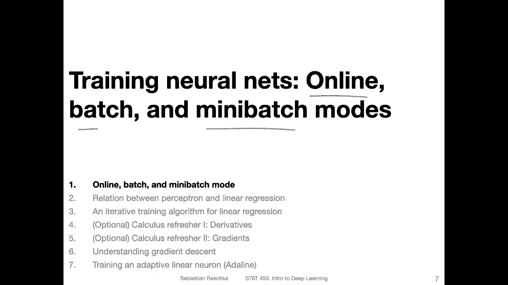
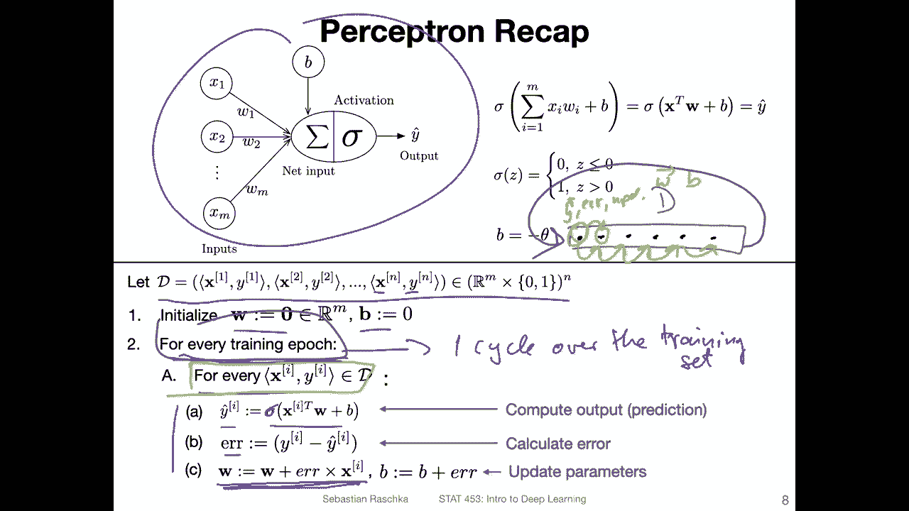
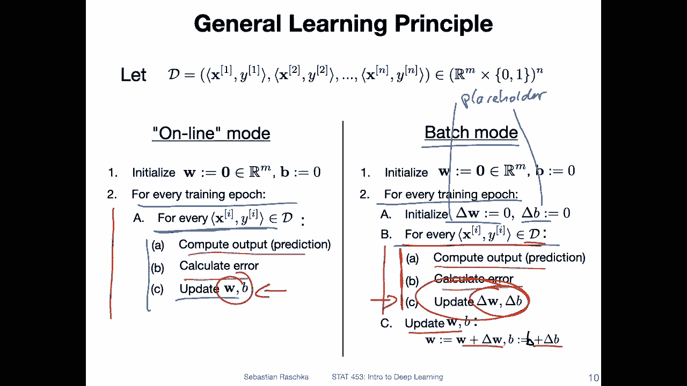
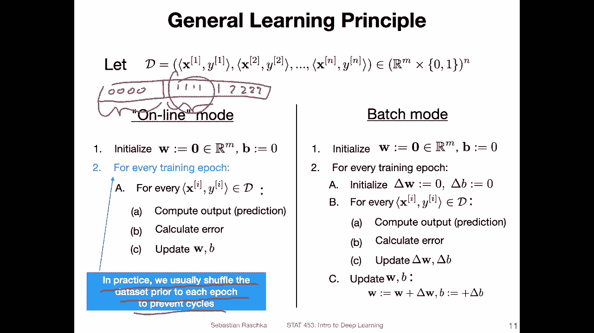
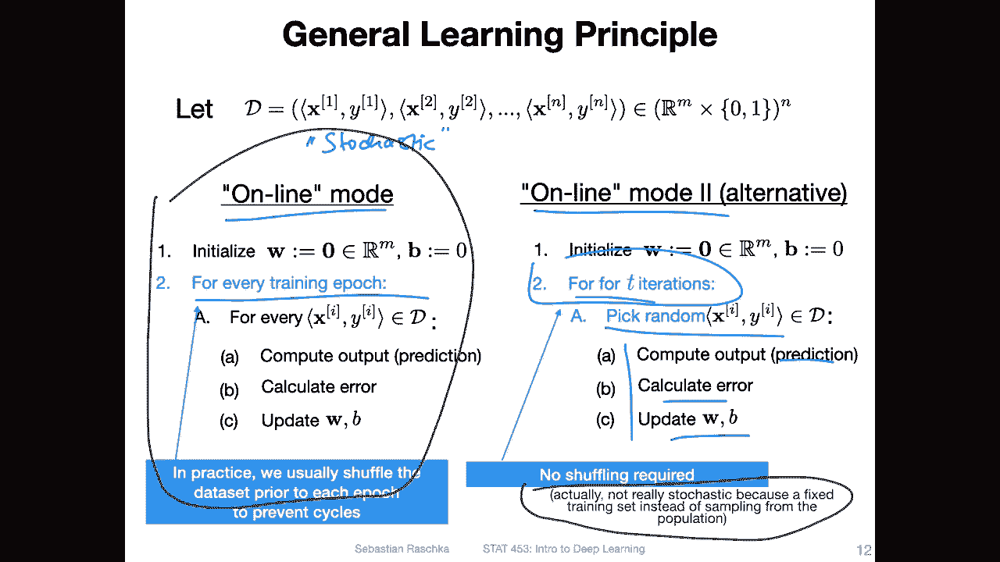
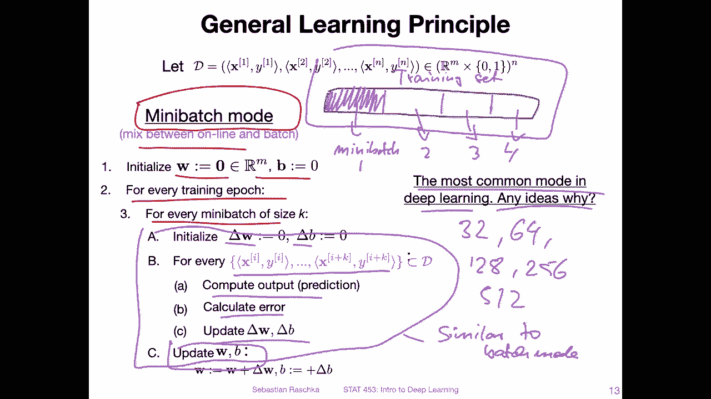
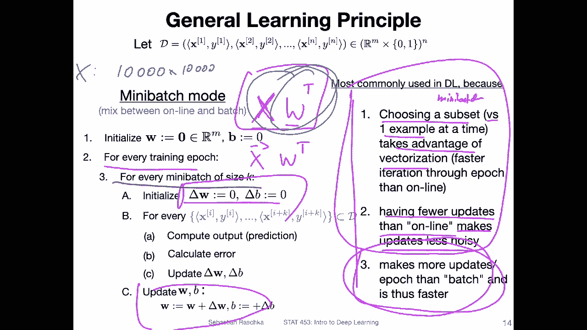
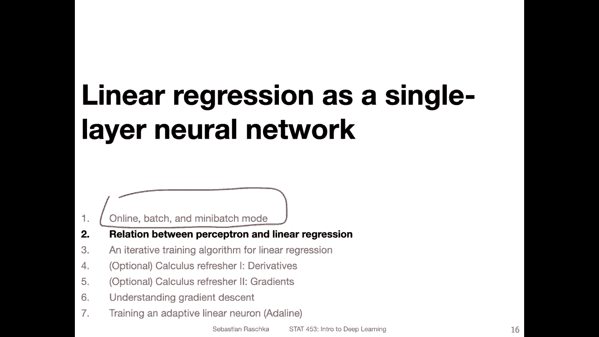

# 【双语字幕+资料下载】威斯康星 STAT453 ｜ 深度学习和生成模型导论(2021最新·完整版) - P33：L5.1- 在线、批处理和小批量模式 - ShowMeAI - BV1ub4y127jj

Yes so in this video I want to talk about the different ways we can train a neural network。

 so there's the online mode， the batch mode and the mini batch mode and they refer essentially to how we utilize our data when we train a neural network model so basically how in which water we read the data regarding the training epochs and also how we update our model So these are general concepts that apply to any type of neural network So just to briefly recap our perceptron model here。

So here on the left hand side， this is just again a sketch for our perceptionceptron where we compute the net inputs and then we update the weights。

So here， I mainly want to highlight what's going on again under the hood so if we have a data set。

 let's call the data D。Within labels。And sorry， with end training examples。

But also in labeled where each training example has a feature vector。X and class table Y。

So when we start training on this data set， what we do is we initialize the parameters of the perceptron。

So， for example， we can set the weights to all zeros。And we can set the bias unit also to a 0。

So this is nothing new。 This is just like a recap。 And then for every training epoch， remember。

 a training epoch is。A one cycle。Over。The training set， as I explained， I think it was last week。

trainingining set。 But if you have questions， always。

 please free of feel free to ask on Piazza I'm always happy to yeah repeat these concepts because yeah。

 they are quite important。 So please don't hesitate if you have any question about what a training apo is to ask because that's kind of important to make sure everyone yeah knows what we are talking about here。

😊，So so for every training epoch， there could be multiple ones we can have an arbitrary number of training epochs in practice it really depends on the data set and deep learning later on。

 it's not uncommon to train something for 100 or thousand0 epochs even it really depends on how difficult a problem is。

And so for every training hypothesis or for loop， then we。

Go through each training example one at a time。 so there two follow loops。

 one is over the number of training epochs and one is over the data points in each round。

Maybe just to。Draw this again。 So if this is my in pink， if this is my data set a D。

I have these different data points here。And this inner for loop here。 let me use a different color。

 maybe green。So this follow up here， what it is really doing is it's just going from one training point to the next one。

 So one at a time。That's what's going on here。 and the outer one， the training apoch1。

 once we completed going through the data set。We start at at the beginning again and go through the dataset again。

So that's really what's going on here。 So for each data point in the perceptionron what we are doing is we are computing the prediction。

 So my head it is our prediction while yeah the net input。

 and then we have this threshold function or activation function。

 which in this case is the threshold function。Then we computed the error。 and then based on that。

 we update。 So we update here the weight vector， and we also update the bias vector。

 So that are two updates。 Notice that the updates happen。After each training data point， so。Again。

 if I have here in green， if I go to the first example。Based on that， I compute Y hat。

Compute the  error。And then。Update。W， the weight vector and the bias unit。If I have done that。

 I will go to the second training example and do the same thing again。

 so I update after each data point。

So。And this is called the。Online mode。 That is a little bit confusing。 It's just， I think。

 a historical thing that it was called online mode。 Notice often textbooks Theres a。

Usually a dash between the on and the line。 This is like old machine learning textbooks。

 So I think that's probably actually related to the worldwide web。 I'm not quite sure。

 but I can imagine it is like when the internet was new。

 you collected it one data point at a time and the advantage is really if you have a model with online training。

 you can update after each data point。 So if you have a model on a web application for each new customer。

 you can update the model。 You don't have to collect multiple customers， for example。

 to make an update。 So usually after each data point， you can make an update if you want to。Yeah。

 so this is just a summary of what I had on the previous slide without any mathematical symbols。

 just basically for each training apoch， we iterate through the data points， compute the output。

 calculate the error and update the weights and the bias。

 So this is the general concept that applies to any kind kind of neural network。

 not only the perceptron。 We have seen that in the context of the perceptron。

 but this is something you can use also。As we will see later for linear regression。

 logistic regression， multi ofceptrons， convolutional networks， and so forth。嗯。And。

There are then some variant of that。 One is called the batch mode mode and one is the mini batch mode。

 which are essentially modifications of that。 and they have also certain advantages which we will go over in the next couple of slides。

 So this is one way you can utilize your data， but there are two other ways。

 one is called the batch mode and the other one is called the mini batch mode just a little spoiler here in deep learning。

 actually， the mini batch mode is the most common one。

 and I will also mention briefly then later why that is。

So the batch mode， let's take a look at the batch mode。 No， next to the online mode。

 So the difference here really is that。We collect。How we would update the model before we actually update it after each data point。

 So we still use the same number of data points in a batch mode。

 But instead of updating after each data point， we。Collect some information first。

 and then we do the update。 So the update is only really after each epoch。 So again。

 let's take a look at the online mode on the left hand side。 So for each training epoch。

 we go over the data points and then can see here inside each after each data point we update on the right hand side。

 I have the batch mode。 It's a little bit different。

 We still have a full loop over the training epochs。However， the difference now is that we。

Let's say initialize this placeholder here。 it's I call it deelta that for change。

 So this is some placeholder here， which I have for the weights and for the bias。's let's call that。

A placeholder。This is also a placeholder。And then like on the left hand side here。

I am iterating through the data points。 Also， the same thing here。

 I am computing the output or the prediction。 same thing as on in the online mode。 Also。

 I calculate the error， same thing here。 So that's all the same。 However。

 the difference really is here。In this step， so you can see here I'm updating the weight and the bias directly here I'm only updating my placeholders。

 so I'm just accumulating some error terms or some information and I keep yeah I keep accumulating that。

Until I itated over every data point in the data。And then based on that。

 after I finished iterating through the current dataset set here。

Then I update the weight vector on the bias here。 So you can see I'm now using my placeholder。

Here and here， to update these on。Permeterters， I just see there a missing letter。

 It should be be up front here。 So I'm updating both。The weight and the bias using the placeholders。

 which have some accumulated information here。 So what is the advantage of doing。

 let's say online and batch mode。 So online mode is。An update。 Yeah， one update at a time。

 so it can be a little bit noisier。 The batch mode is a little bit more， I would say， robust。

 So you collect statistics or information from the whole data set before you do one update。

 The disadvantage is it's a slower mode of updating because you do only one update for each training epoch。

 And on the left hand side， you do multiple updates， each epoch。 So on the left hand side。

 you can think of it as maybe as a faster learning because there are more updates on the right hand side。

They have fewer updates， each update takes longer because you have to cycle through the whole data set before you make an update。

 but the update will be more accurate。I will also show you some visualizations of that how that works really in the context of。

 let's say， linear regression or real real case scenario。There's no， I would say。

 I would say neither of the two are very common in deep learning， though。

 and I will also tell you why later on it will become obvious， I guess。

In practice， there's something called a mini batch mode， which is the most common one。

I had one more note here about the online mode I just see yeah。

 I highlighted it here in practice we usually also shuffle the data set prior to each epoch to prevent cycles。

So sometimes it can happen that， for example， in the perceptionceptron case or some other case that the yeah algorithm gets stuck flipping back and forth。

 So empirically， it's actually better to shuffle the data set prior to each epoch。

 You can also think of it if you have， for example， the iris data set。If you just load it。

 the classes will be sorted by class label， so you have 50 examples from class 0。

 50 examples from class 1 and then class 2， and it is also not ideal because let's say。

This is my Irish dataset set。All these are class table 0。 and then you have class table 1。

 and then class table2。 So if you don't shuffle， the problem is the algorithm will only update based on。

 on the zeros。 Maybe the zeros are easy。So there's nothing happening and then it sees a completely new class。

 and then it only focuses on getting these right， but then maybe it's getting some other ones wrong again and it's usually better to have more a better yeah shuffling a little bit more diversity that you have zeros ones and twos like intermixed with each other and also yeah to prevent flipping back and forth。

 it's just good to shuffle it shuffle doesn't cost much。

 So in that way it's it's not a bad thing to do anyways。

Well I should say the online mode is sometimes also called。stochastic mode。

 or in in the context of gradient descent， which we will cover later in this course。

 it is also called stochastic gradient descent。There's another online mode let's call that online mode version2 that is also quite common or used to be quite common。

 So here the difference is really that you don't iterate over the epochs。

 you just say for a given number of iterations。You do the updates。

 so for a given number of iterations。 you say pick at random some data point from the data set and then you proceed with computing the prediction。

 the error and the update。 So here really the difference you don't iterate over the epochs。

 The difference also then here is on the left hand side you guarantee that each data point is used exactly once in each round whereas on the right- hand side a data point can be used multiple times and the same number of iterations。

 So for example， if you have a data set of size N and you have n iterations。

 it can be that some data points are used multiple times whereas certain other data points are not used at all on the right hand side。

 this is usually what people call the true stochastic mode。

This is something you find sometimes in statistics papers because it's easier with that one to yeah to derive certain proofs like theoretical proofs。

 it's mathematically a little bit easier to handle than the left one， but in practice so。In practice。

 this is usually used more often because you get better results with that one because you guarantee that each data point is used in the data and each data point is used the same number of times it's kind of more making better use of the data in that way。

Also， yeah， this is also not truly stochastic， I would say because in order for it to be truly stochastic you would be sampling from the distribution here。

 we still have a a fixed size training set， but this is just yeah knitt picking actually。

Now let's get to the most common mode of learning， so this is the mini batch mode。

 which is a mix between the online mode and the batch mode。

 so similar to the previous two modes what we do is we initialize our parameters that we want to update the weights and the bias and then we also iterate over the training epochs but now what's new is we also iterate over mini batches。

So what is a mini batch， A mini batch is。A chunk of the data sets。 So if this is my。Tining。Set。

 you can think of a mini batch as。Yeah， a smaller chunk of the training set。

 So this would be mini batch。1， mini batch 2。3。For。So what is the size of mini beds。

 usually it really depends usually common ones you will find in deep learning something like 32，64。

1 at 28256， sometimes also 512。 It really depends on yeah， also the problem。

 It's like a hyperparmeter or something you have to try out and see what works。

 So there are some papers suggesting smaller batch sizes can accelerate learning because it's noisier and the noise can help making updates a little bit faster So you have more iterations larger batch size use or make better use of the GPU。

But yeah it's really it's really something that depends on practice and we will also talk more about that when we talk about the technique later on called batch normalization In any case。

 so this mini batch here it's then essentially used like batch gradient descent。

 everything down here。不 is实。Similar了。To the batch。Moode。

 except that you perform the batch mode on this smaller chunknel， so。

Before the batch mode was done on this whole training set。

 now the batch is done at on one chunk at a time。 So you again initialize these placeholders and then for each data point in the mini batch。

 you compute the prediction， calculate the error， update the placeholder， and then。Yeah。

 then you update the weight and bias unit here。 So this way， it would be similar to the batch mode。

 except that you use one smaller mini batch at a time and。

This is usually the most common mode in deep learning。 So as a question for you。

 do you have any ideas why that is。

Yeah， maybe pause the video for a second and think about it and see if you have some ideas before I read out note my notes you're on the right hand side。

 So yeah， I've written down three of the reasons why I think that mini batch is much more useful than。

 let's say the online mode and the batch mode in deep learning。

 So one would mean that when you are choosing such a subset， such a mini batch。

Instead of just one example at a time， we can take advantage of the vectorization that we talked about in the previous lecture。

 So in the previous lecture， we had seen that we can compute things efficiently。So when we had。

 for example。A training matrix containing multiple entry entries multiplied by the weight vector。

 So if we had that， we could process multiple training examples at a time。

 which is then faster than in a fall loop executing this multiplication with a vector here。

 So instead of using a vector times this a weight matrix and doing this multiple times with a fall loop is yeah。

 of course， it's lower than doing it one time with this matrix multiplication here。

 So using this vectorization。M。Everything or makes the processing or iterating of an epoch faster。

In the mini batch mode， compared to the online mode。Also。

 having fewer updates than in an online mode， like including more examples in each update makes。

Things a little bit more robust， so it reduces the noise a little bit。On the other hand。

 we could if these two arguments， if you consider these， then we can say， okay。

 why don't we use the full batch mode， the regular batch mode then right because that would be even faster and it would be even more robust because updates are less noisy。

 So and practice actually first， the data would be too large a common data。

 So this one on a deep learning data wouldn't be feasible。

 We can't just have millions or thousands even of data points here because then we would have。

Sa if we have 1000， if we have a 10000 data point， training said we have a matrix that is 10000 times。

 let's say maybe also 10000 for the features。En deep learning。 So x。Would be a 10000 times 10。

000 times matrix and W would be then also a 10，000 times something matrix and that would probably blow up the computer memory。

even if that would work。Actually， the noise is quite good for learning and deep learning。

 We will see that later。 it helps the algorithm to escape socal local minima。

 So in this way actually the mini batch mode also the little bit of noise is good。

 so in the online mode there's maybe be too much noise like from one training point at a time。

 but having a little bit of noise like having these small batches actually helps。

Yeah and also compared to the full batch mode， like I said here in 0。3。

 we have more updates in the mini batch mode for each iteration over the epoch。In the batch mode。

 we only， yeah have this iteration of the epochs and then only。Update once。 So we apply this only。

Once after each epoC in the mini batch mode， we do that multiple times depending on how many mini batchs we have in each epoch。

 so in that way we have more updates than in the batch mode which can also help with learning。

Things faster。Allright， so in the next video I will briefly go over the relation between the perceptron and linear regression。

 So if things were a little bit I would say yeah a little bit weird out of context this is something that we will be using for the rest of this course so we will be using mostly the mini batch mode later on when we train neural networks so here I was just explaining the different ways we can process a data and this will become relevant when we talk about stochastic gradient descent so with this lecture it's like usually a chicken egg problem there are many things or concepts one depends on the other and we have to start somewhere so now I outlined different ways we can process the data and then we will see in stochastic gradient descent and gradient descent how this actually applies to the actual updates。

