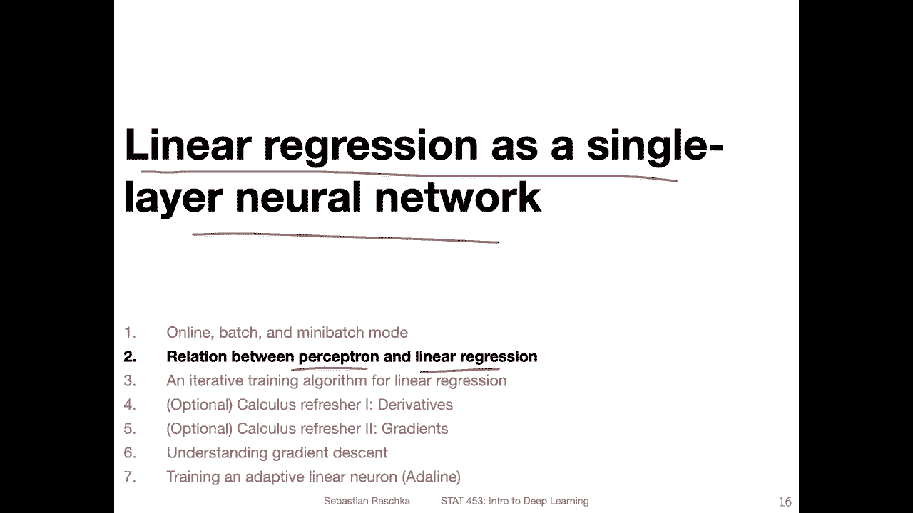
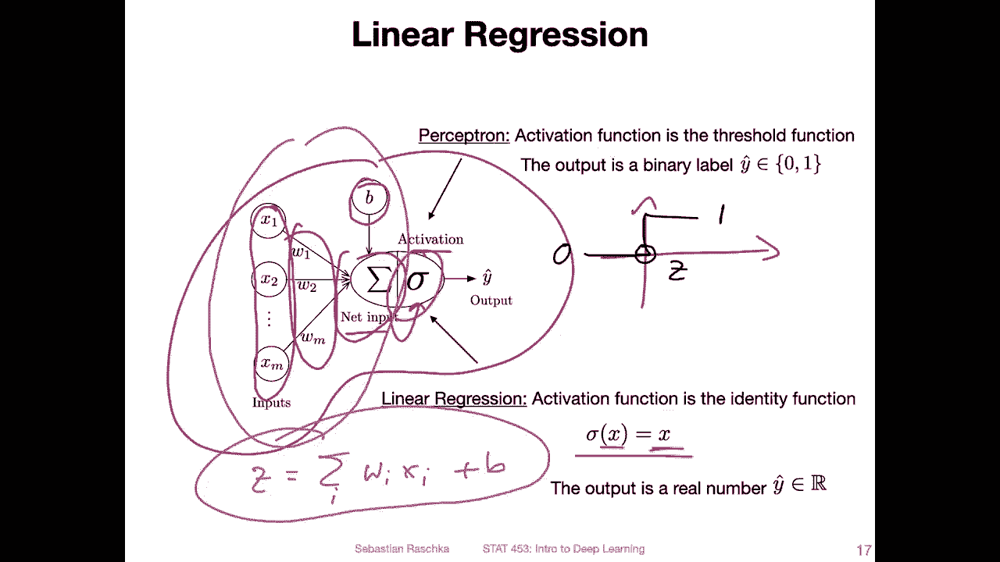
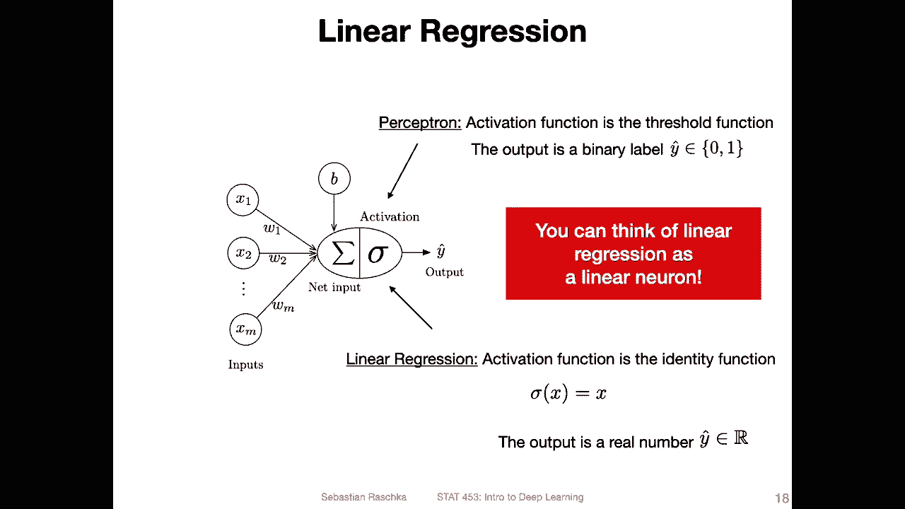
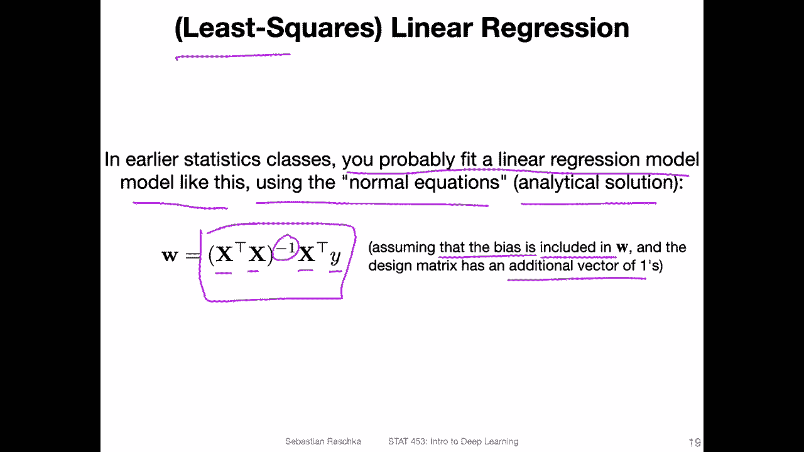
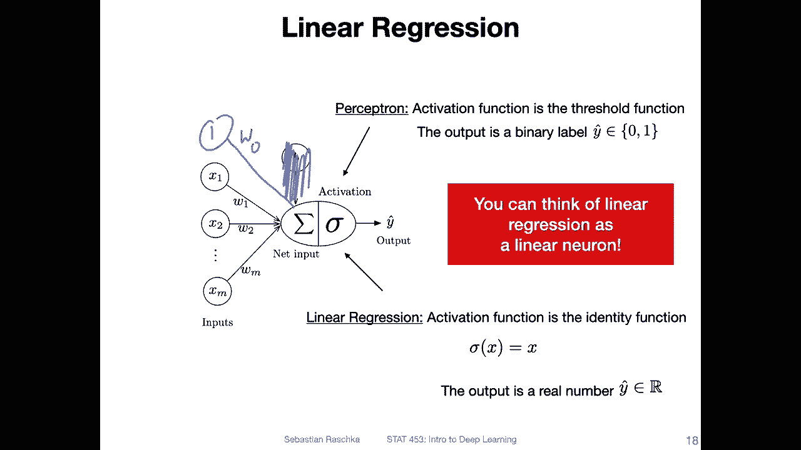
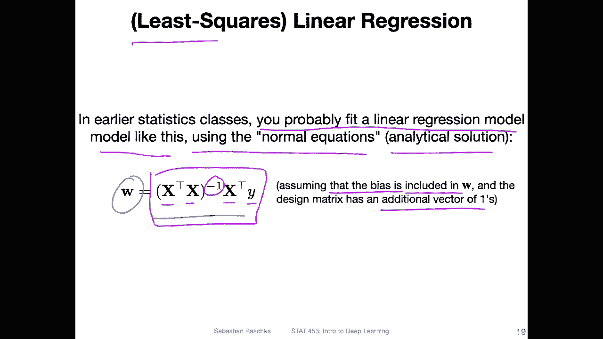
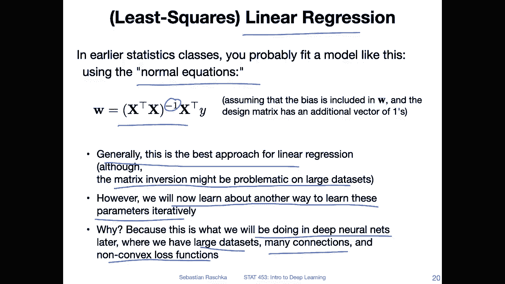

# P34：L5.2- 感知器和线性回归之间的关系 - ShowMeAI - BV1ub4y127jj

So yeah， in this video， I want to briefly talk about how the perceptron and linear regression are related to each other so you can think of linear regression as a single layer neural network。

 And I think since you all hopefully know a linear regression。

 this will make things a little bit easier when we talk about gradient in decent and also from there it's very easy to go to the added line to the adaptive linear neuron。

 So in this video I want to just briefly outline this relationship before we talk more about that in the following videos。

 So。

Here， again， a sketch of the perceptron algorithm where we have multiple things going on。 First。

 we compute the net input based on。The features of the data set and the weights and then there's also the bias units so we have the net input that we compute and then we as in this general model we have an activation function here and in the case of the perceptron。

 this was the so calledled threshold function where we had， if you think of it as。

A threshold we had like this。Thshold function if。The net input z is greater than 0 here。

 then it returns a 1， and otherwise it returns a0。 So if z is greater than 0， then return a 1。

 otherwise a 0。 that was our own activation or threshold function。In the case of linear regression。

 we don't have such a prediction， we only yet return a continuous value so we don't have a threshold for0 and1 and you can think of it then as this activation function here in the perceptron or threshold function being the identity function so not doing anything an identity function is just a pass through it's just returning the inputs of the input is x to this function it will also return X。

So in this case， a linear regression， the same concept applies as in the perceptron here。

 So the same computation of the net input， which was。Just。

Multiplying the weights with the features and then adding the bias unit。 So that is our。Ne input。

 And yeah， this is also。All the prediction and linear regression is created。

So yeah in that way， you can think of linear regression as a linear neuron。

 a single layer neural network。

And in earlier statistics classes， I'm pretty sure you covered this。

 so you probably fit a linear regression model like this like shown below using these so-called normal equations which are an analytical solution to the minimization problem in least square linear regression。

 So when you wanted to minimize the squared error， you could compute or you could yeah find a model that minimizes the square error by using these。

So called normal equations。 So you have if this is your design matrix， x transpose x。Inverted。

 so inverse here times x transpose y if you do that and if you include an additional vector of once。

 assuming that the bias unit is included in W， so if I go back one slide。

 remember in the perceptro lecture we had this alternative formulation where we didn't have a separate bias unit。

 we have。

The one here。And then we had the weight 0。 if you assume this， if you add this one to the inputs。

Then the bias unit will be included in this W。 So with this。Set of this equation here。

 you can actually solve for the parameters v linear regression in an optimal way， but yeah。

 this is not what we will be doing in this class in this class we will be talking about a different type of algorithm that can also find these parameters。

Yeah， to just summarize what I said in the previous slides。

 So these normal equations here are really the recommended approach for at least square linear regression。

 This is something I would use on a dataset， there might be one little caveat if you have a very large dataset than this matrix inverse here could become problematic for computer memory。

 but yeah honestly I think most datasets are on most datasets it would be fine。

 So this is what I would be using for linear regression practice。 However。

 I am going to introduce we are going to learn about a different way for learning these parameters iteratively。

 and the reason why we do that is because that's what we are doing in deep learning。

Or for deep neural networks where we have yeah large data sets。

 many connections that is many neurons and also nonconvex loss functions。

 So for deep neural networks there is no closed form solution or analytical solution so that way we have to be a little bit creative and use this iterative way and I think really because you're already familiar with linear regression from other statistics classes that using linear regression to introduce this algorithm will make things a little bit easier so I will introduce the iterative algorithm in the next video and then we will talk about some calculus concepts and then yeah see how it works in practice。

