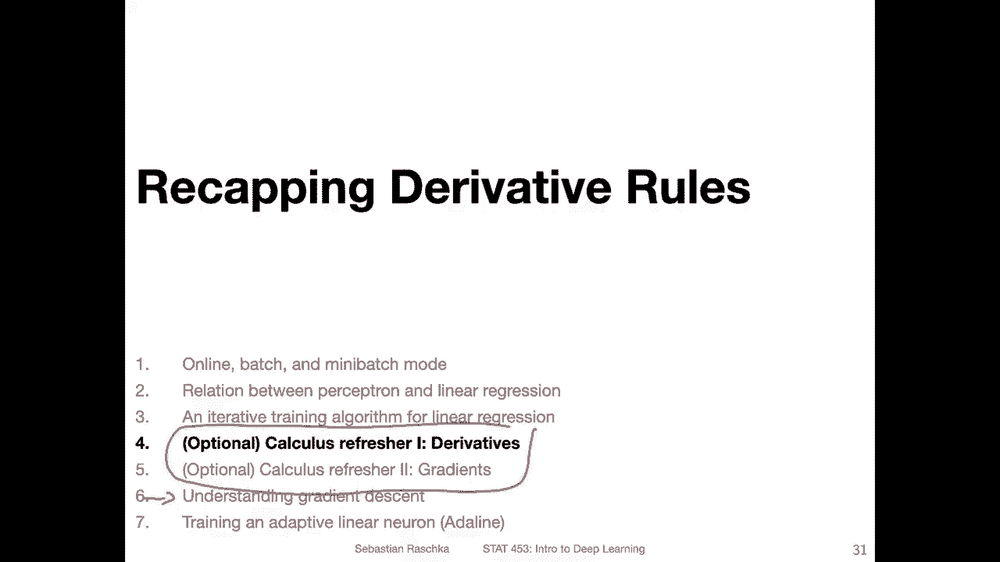
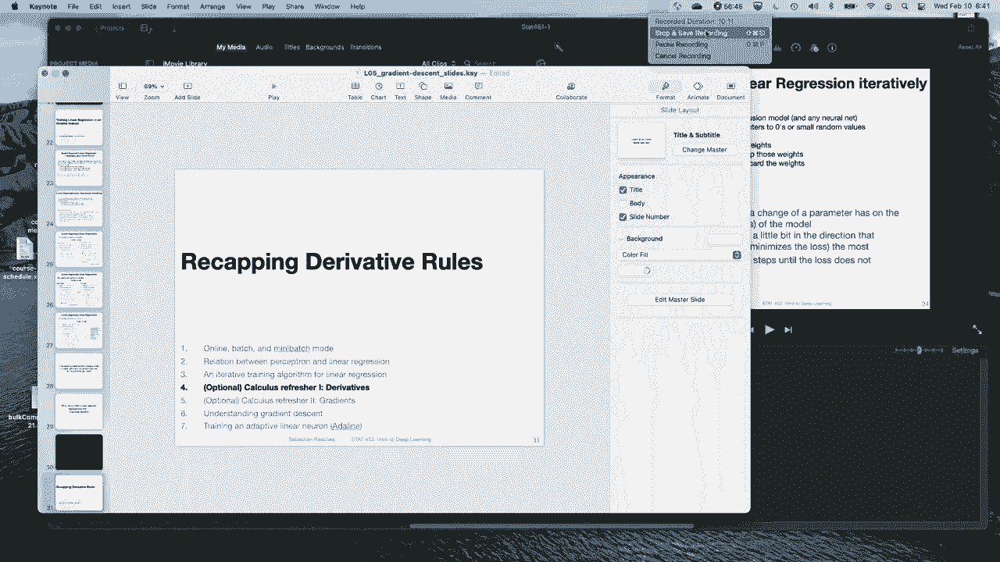

# 【双语字幕+资料下载】威斯康星 STAT453 ｜ 深度学习和生成模型导论(2021最新·完整版) - P35：L5.3- 线性回归的迭代训练算法 - ShowMeAI - BV1ub4y127jj

Yeah， so in this video， I want to now talk about this iterative training algorithm that I mentioned in the previous video。

 so we will be talking about training a linear regression using an iterative algorithm。

 This is also the first part and we will come back to that later on when we talk about gradient descent。

 here I just want to give the general outline。 So one way we can use an iterative algorithm to fit least square linear regression models is by using brute force So this would be what I call or think of as a very naive way to fit a linear regression model or any type of neural network。

So what we can do is we can start by initializing parameters to all zeros。

 so the weights and the bias or small random numbers。

 and then we have a follow loop here for K rounds。 So let me use a different color for it。

 So for K rounds， we can then choose another random set of weights。And then yeah。

 we look at the predictions of the linear regression model。 And now if the model performs better。

We keep those weights。And then yeah， we go back here。 So this is like a iteration K times。

 Every time we find better ways， we keep those。If the weights are worse。

 as with the model with the weights。Performs worse。 we actually discard them。

 So we only keep the weights if they are actually better than before。 And yeah， if you do that many。

 many， many times， this approach is actually a guaranteed to find the optimal solution right。

 because yeah， you do this many， many， many times。 And if the model can only improve。

 eventually just by luck， you will find yeah great set of weights， the optimal weights。

 But as you can think or as you can imagine， this would be a very。

 very inefficient and terribly slow way of fitting a linear regression model。

 So I would not recommend doing this in practice， although in practice it works。

 it's it's not a good way to fit a linear regression model。Yes， so luckily。

 there is a better way for fitting a linear regression model iteratively。

 So what we can do is we can analyze what effect of change a parameter has on the predictive performance of the model so we can take a look at the square  error loss and see when we change the weight and the bias in a certain way how it affects these  errorss and then we can make a small change so we can change the weight and bias a little bit in the direction that improves the performance。

 So if we understand the relationship between the weight and the loss we can change the weight such that the loss goes down so we have a smaller error and we can then do this several times in small steps until the loss is not further decreasing。

 So one by one we will change the weight such that loss decreases。

It turns out that this is actually the the online mode that we talked about。 yeah。

 just written a little bit differently。 So on the left hand side， we have， again。

 the online mode for the perceptron learning rule。So where we iterate over the training epochs。

 and then for every training example， we compute the prediction， compute the error。

 and then do the update here。So。For linear regression。

 there is an algorithm called stochastic gradient descent。

 So stochastic gradient descent is the analog of the perceptron learning rule for convex loss functions here。

 we can also use it for non convex loss functions for neural networks that will be something we will cover in the next lecture。

 So here we will focus on the linear regression model and then at the end of this lecture also at on the adaptive linear neuron。

 So what is similar and what is different。 So again so we have the same weight initialization here。

Let me use a different color for things that are the same。Weight initialization is the same。

 we also iterate over the training epochs， then we also iterate over the training examples in a data set。

 we also compute the predictions the same way because here like I mentioned in the previous video。

 the perceptron and the linear regression model they both compute the net input here except here we have the threshold function and the perceptron and let me use right here that would be the threshold function。

 the case of the perceptron and here this would be an identity function。And this is the threshold。

And yet inside here， this is the net input this is。Oops。对。

I don't know what it is with curly brackets， but I。Can't draw cur brackets。 Okay， so yeah， Z。

 the net inputs on they are computed exactly the same way。

 This function is a identity function in the case of linear regression and a threshold function in the case of the perceptron。

Now。For the perception one， we compute this， this error here by just subtracting the predicted value from the actual class table in linear regression。

 We have continuous values， but it's very similar。 So also here。

 we have a subtraction for the weights。 we multiply this by x。By the input feature vector。

 and for the bias unit， we don't。 So if you're wondering what these symbols here mean。

 So this labla symbol， this stands for the gradient。

So here we are computing the gradient of the loss the gradient of the loss L。

 is cur L L here with respect to the weights here。 So this is the。Gadient。Off。

 when let me spell this out。Grariient。off。The loss。Function。With。Respect。To。😔，Whoops， weights。

And then。Here at the bottom， this is the say， also also the gradient of the loss with respect to the bias unit here or derivative。

 so。Yeah， so you can see this is closely related to what's going on in the perceptionceptron。

And in step C， now， we do the update。So the update is a little bit different here。On the。

Left hand side here， we have the current weight。And then we multiply the error with a feature vector。

We don't do this on the right hand side。 We have done something like multiplying with the feature vector up here。

 But here now what we do is we we add。Another term here。 and this term Eta is a scalar。

 It's a we are scaling something， and this is the so called learning rate。 So let's call that。

The learning。It's just a scaling term and in the parentheses here， this is the negative gradient。

 so I was wrote it down here， so we have the negative gradient。

 We now update the parameters by the negative gradient。

So it's kind of similar to what's going on in the perceptron。

 except that the way we get this gradient is based on calculus。 and in the next couple of village。

 I will yeah give you a brief calculus refresher to explain where this comes from。

 So here we are really computing the negative gradient of the squared error loss with respect to the weights and the bias and in the perceptron case this is it looks very similar it's a little bit different because it's not depending on calculus here we have the threshold function and depending on how fresh your calculus skills are。

 you know that for non-smooth functions like threshold functions we can't compute derivatives。

 So in that way。It's somewhat related and very similar， but there's a little， little detail。Okay。

 so yeah， one more slide I just see I have here。 So on the left hand side。

 we or I showed you vectorized implementation of this linear regression online mode。

So where we had vector， so x here is a vector for example， and the gradient is a vector。

 but we can also kind of yeah unroll this using a for loop， so this way we don't yeah need gradients。

 we can just talk about partial derivatives。So in order to simplify this as a fall loop。

 we would just look at one。Feature at a time or one wait at a time。So if we have a data set。

Where our dimensionality of the inputs is M。 So we have M features。 What we can do is then for each。

We， so the number of weights is equal to the features， right， Because if I have my inputs X 1， x 2。

 x 3， then here they go into my。That input function in each input is associated with a weight， right。

So I'm not just drawing the bias here， but yeah each input is associated with the weight。

 so we have M weights， and I can for each weight separately compute the partial derivative of the loss with respect to that weight。

So it's an analogec of this one here。Not using any linear algebra now just using partial derivatives instead of gradients and then I can do also the update the same way。

 So here this is just the for loop version I think yeah this is maybe conceptually a bit easier because partial derivatives are maybe easier to think about as compared to gradients I mean it's the same thing but instead of yeah talking about gradients we could also talk about partial derivatives。

 however like I explained in the previous lecture vectorized implementations are faster which is why we usually use gradients and vector based implementations。

So the learning rule from the previous slide now is called stochastic gradientdescent I was showing you this learning rule。

 but I didn't show you where this learning rule came from So where how did I derive this learning rule So in order to understand that yeah there's some little cculus required I think most of you already took cculus classes because that was the prerequisite for this class if you a little bit rusty I have two bonus videos I will be recording after this video so you can。

Maybe you refresh your calculus skills， but it's not necessary。

 so you can also jump ahead to this video where I will explain where the learning rule comes from and if you like you can watch these two videos where I go over some of the calculus concepts。

