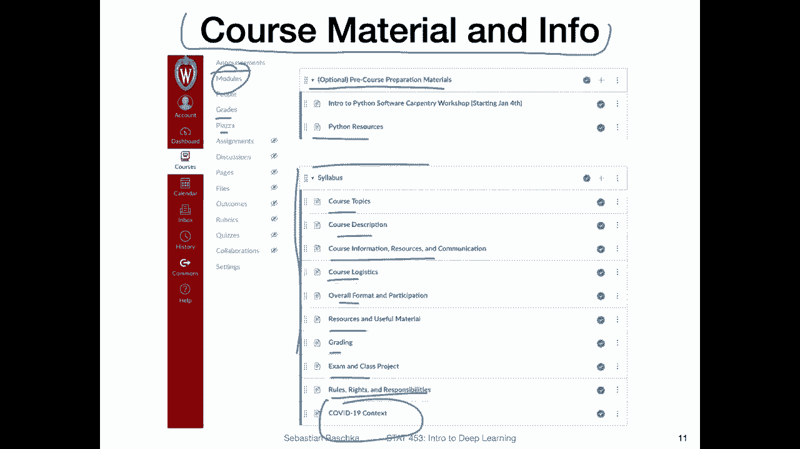
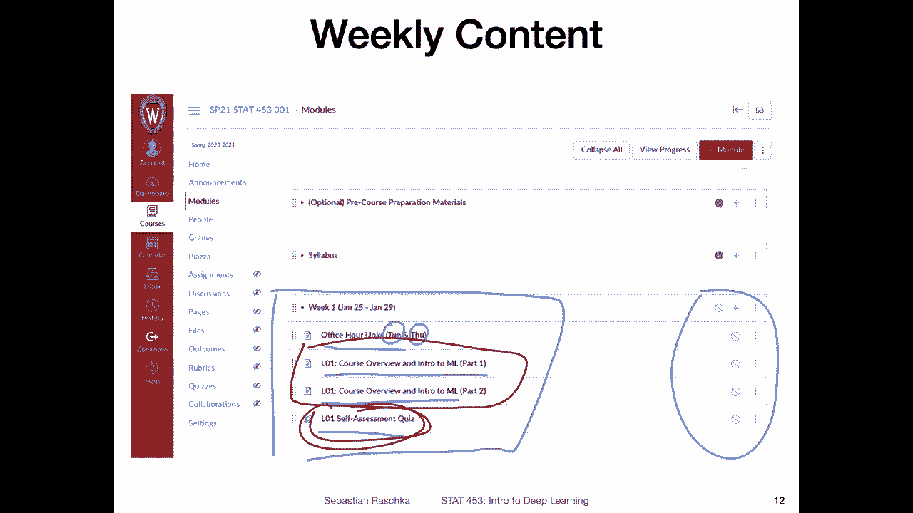
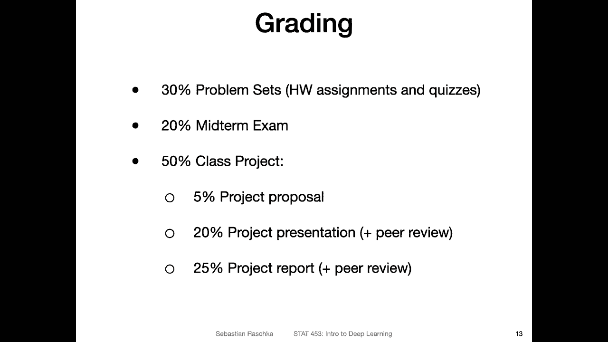

# 【双语字幕+资料下载】威斯康星 STAT453 ｜ 深度学习和生成模型导论(2021最新·完整版) - P3：L1.1.2- 课程概述第 2 部分：组织 - ShowMeAI - BV1ub4y127jj

Yeah regarding the cost material and information， we will be using canvas in the semester。

 The reason is really that it makes things easier for me and for you because everything will be in one place。

 So yeah that I mean announcements and your grades and also yeah Piazza I will say a few more words about that。

 So yeah I think have everything in one place will make things easier。 Yeah， of course。

 we will also be using other technologies like Github。 However。

 I will then post links to that on canvas。 So youd never have to really go out there and search for things by yourself in different places。

 everything will be here and the modules on canvas。 So。

What I'm showing you here is a screenshot just of some things you have prior seen。

 So here was some optional preco preparation materials that I shared during the winter break for those of you who may have not used Python before。

 but have some programming language backgrounds。 So yeah as a requirement for this class。

 you should have taken a programme class。 It doesn't have to be Python。 However。

 we will be using Python in this course。 Of course。

 we don't have to be expert programmers in Python for this class。

 we will only use very basic features in Python， but it will be immensely helpful for you。

If you learn a little bit about how Python works and yeah I shared some resources for you here。

 it shouldn't take that much effort。 It's really only the basics。

 and I think it will make your life in this class easier。

 Also we won't be using Python right away in the first few weeks。

 I think we will be probably starting in week3 to use Python。

 So in that way there's no stress to do it like today。

 but it would be good maybe in the next couple of days if you don't have any Python experience to yeah look over these resources。

Then yeah also posted a lot of information about the syllabus a couple of days ago。

 I don't want to really go over everything here。 I think it's maybe more efficient if you just read through what I've posted there it's really just the topics that I already discussed in a few minutes ago that we are going to cover a little bit about this course you probably already know that because otherwise you wouldn't have enrolled then yeah some basic comments on where the information for this course is located mainly on canvas some other resources like optional textbooks that may be helpful to you and also how we communicate in this course I will also say a little bit more about that in the next couple of slides。

Then yeah course logistics， some expectations like how I will deliver content and how you are expected to participate。

 So content wise I will be uploading videos on Tuesdays and Thursdays why Tuesdays and Thursdays yeah that was usually what I have done and in person when there was the regular semester and also it's kind of easier for me because yeah when the week starts on Monday I will start recording the videos for Tuesday and then on Tuesday I will catch up with。

Emails and work。 And then on Wednesday， I will be recording the back lectures for Thursday and things like that。

 So it's also a good rhythm for me。Yeah， then there are some other resources and useful material that I posted here。

 some information about grading， I will also talk about this in a few slides and also about the class project and the exam and then also importantly the rules。

 rights and responsibilities that you have and should know and then also a little bit about the COVID context also just where you can find information about COVID and how it affects campus so here I'm just linking the campus guidelines you should also maybe take a look at that if you are not familiar with that yet。

All right。😊，So regarding the weekly content like I mentioned。

 I will be uploading videos on Tuesdays and Thursdays or let's say I will upload the Monday night and Wednesday night such that they are available on Tuesday mornings and Thursday mornings。

 so that's yeah to the best of my ability that's my my plan here for this semester。 So。

A typical week may then look like this。 So here is， it's not uploaded yet when I'm recording it。

 but when you are seeing this video， it's probably already uploaded。

 So what I'm showing you here is how a typical week would look like。

So here's a link to the office hours。 will have we will be having office hours via Zoom。

 the T A and me so I will have my office hours on Tuesdays from 6 to 7 and the T A from 7 to 8 PMm I think so we both have office hours in the evening and that is because I think it's easier for people who are in different time zones。

 for example， some people I know are in China and then it would be I think 6 pm here would be 9 a in the morning there or 8 AM。

 So I think it's like a more reasonable time because last semester we had office hours like more in the afternoon and then some people had to have the alarm clock at 3 am in the morning to join the office hours we always had to find additional time slots and I think having this office hours slot in the evening might be more convenient this time。

I think 6 PMm is also maybe reasonable for people who are in medicine。

 so in that way it's like a good I think sweet spot。 Allright。

 and then like I said I will be uploading content on Tuesdays and Thursdays so there will be a page a canvas page with all the videos embedded there and the same thing for Thursday and I will also post some additional material like extra reading material there or I will link it there so if you want to have some more information beyond let's say just the videos I will also try to post some interesting papers or additional reading material in these pages related to the lecture。

And then at the end of the week I'm planning to make every week a self-assesment quiz。

 So this quiz will be three to five simple multiple choice questions。 It's just like yeah。

 so to help you stay on track， there will be a few points for this quiz。 So of course。

 yeah you should do the quiz because it will be counting towards your final grade。

 it won't be like heavily weighted only a small number of points for these quizzes。

 but it's I think helping you will help you to keep on track because you have to watch。These， yeah。

 materials in order to。Do the quiz。 I mean， you can do it without watching the videos。

 but then I think you， you have to guess， really because the questions will be related to the video content。

 Of course， the I will post the quiz at the end of the week， but it will not be due the same day。

 It will be due one week later。 So if you。Let'd say don't have completed videos by the end of the week。

 You still can watch the one of video on the weekend or the beginning of the next week。

 So we'll have like 7， approximately 7 days。After the videos have been posted to complete the self assessment quiz。

 I think that's like also， yeah， I will think this will help you to keep on track and not， let's say。

 delay。Yeah， going through the content too much and help you to stay on track in this class。

 Allright， so the grading， I think that's probably some question or something you are curious about。

 so。

How I decided to do things this semester is that there will be 30% of the grade will be from problem sets。

 that's homeworks and these self assessment quizzes。So regarding the homeworks。

 I don't know exactly how many homeworks there will be。

 I will be making them every two weeks approximately and there will be a new homework。

 These are a little bit longer than the quizzes and they won't be multiple choice。

 they will be involving usually some free form answer or some slight coding。So in that way。

 there will be approximately five homeworks this semester a little bit more， maybe。 So five。

 I would say5 to 7。And there will be the self assessment  quiz every week。

And then this will be 30% of your grade，20% of your grade will be from the midterm exam。

I posted the date， I think， in the syllabus for the midtermer exam。

 I will send another announcement about that。I just forgot the date right now， so I can't。

Recall it on top of my head， but it was more like later， I think， sometime in March， I think。

 so don't worry about it yet。So 20% will be the midterm exam。

 which will be online on canvas so and then 50% will be the class project。

 So I think this is the most fun part on the class because this is something where you get to be creative so first you get to propose a class project topic。

That has to be related to machine learning or deep， I mean， deep learning， of course。

 So it will be related to deep learning。 And you will be working in and teams with3。

Students in total， S three students per。Team and we will wait a few days or let's say maybe a week or two until I ask you to find team members because there are students in the beginning who are still on the wait list and some students may change their classes so we will wait a few days or weeks until things have settled so then we will form student teams of consisting of three students each and then with your team you will be thinking or brainstorming deep learning related project。

 I will post data sets that you may consider our data resources and websites and also project ideas and I will also post some examples from previous semesters so that you can get an idea of what roughly is expected。

 I don't want to do this right now because there are so many things probably going on right now。

 but in the next couple of days。I will share more information about that。 So don't worry about it。

 And it won't be due until I would say also like March。 So in this proposal， what。

 what is the goal of this proposal， This is really a two page report。So again。

 I will share more information later， but it will be a po to page。

Report where you let me know what you are interested in working on。

 and then I can give you some feedback to let you know whether this is a good idea or not or maybe also to give you some more tips regarding your projects and supply you with resources or additional ideas。

And so。The grading is， yeah， it's only 5% of the total grade。 So in that way， it's more about。Yeah。

 I'm making sure that you have a good idea for。The rest of the semester that you can work on it。

And yeah， and then at the end of the semester， there will be a project presentation。

 It's a oral presentation and a project report。 So of course， the semester is virtual。

 so it will be recorded。 so you will be recording a video short。8 to 10。Minute presentation。

 and that will be shared with other students in this class。

 So we will be all watching the presentations， and there will also be a project report then also at the end of the semester。

 and the project report， this will be a 8。Page written report in the form of a it will look like a conference paper。

 I will give you a template for that。And this is really where you would write up should be style conference paper style。

 This will be where you will be writing up your project more formally in the form of a paper and I really think this will give you some realwell experience with working on a deep learning project how you communicate it also in the presentation and then also how you write it up for example。

 also later on if you're interested in academic path where you publish papers that might be a great exercise to if you have not done that already like work on papers。

 but also in industry， a lot of people in deep learning publishing papers nowadays so either way I think this is a very useful exercise for you and it's also great for your CV you can optionally share your project for example。

 on Gitthub if you like and then if you imply for an internship。

 you can show that you have worked on a creative individual project I think it's always a good idea。

Okay， but again， like I said， I will share more about that。

 one little aspect I wanted to say is also there will be a peer review stage that is something I've not done in previous semesters and I thought it might be also a good idea that is something where each student will be reviewing three other students reports and project presentations and。

Also give feedback basically。 So in that way， I think that might be also a cool thing to do。

 like providing feedback on other students presentations and reports。Alright， of course。

 I will also be providing feedback what this is like for you among each other。

 so I think that's also nice。😊，Yeah， regarding the communication in this course。

 so how how are you going to ask questions and how are we having discussions？Yeah， first of all。

 we will have the office hours。W Zoom， so that will be a face to face live office hours。

And in addition to that we will be using canvas for the asynchronous communication。

 so Piazza is like an online forum which is in canvas so only the students in this class have access to it and you can post questions either showing like your name to the other students or also anonymously if you prefer so the name if you post there it will be only visible let's say to me if you post anonymously but you are of course encouraged to also post yeah just generally with showing your name so if you want to find for example team members and things like that you can also use Piazza and this is really like for questions about this course about the lecture contents and。

Yeah， everything related to this course， really。 And what's nice about it is， I think。

Is that everything will be in one place And on Piazza。

 I can also see which questions I have answered and which I have not not answered。

 And I really prefer this over email because， you know。

 a lot of people are sending me emails who are not in this class like our colleagues and。

Paper reviews and everything。 And sometimes it's， yeah more difficult to catch up with email every day。

 So if you have a question， it's easier for me just to go to Piazza and see all the questions related to this class and I can。

 I think answer them more quickly and there's also less danger that I miss a question compared to emails where email is always like always too much email and it's always easy to overlook something。

 So on Piazza that will be more organized。 So you can also yeah send me private questions on Piazza。

 there's an option that only I will be able to see the question。

 So if you have some private question like I don't know。

 maybe you have a doctor's appointment and some issues came up and you can't complete homework for some reason that would be also a private option where you can ask me。

Private question on Piazza。So there's also a good。Place to ask private questions。

 So where you don't have to worry that other people see that。 Anyway。 So yeah。

 we will be using then Piazza and Zoom for the communication in this class。

 I hope this will work well。 We can adopt if， we need additional resources。 So， for example。

 for the office hours， we will be having these links But if there's a reason you never can attend these office hours because you have another class during these times。

 We can also find optional additional dates。Yeah， important。

 one last important thing is I would really hardly strongly recommend that you enable the notifications on canvas。

 I know it can be maybe a little bit annoying， but this way you get a notification via email if there's some new content because yeah。

This way you don't have to always refresh the page。 if there's some new content。

 you will get an automatic automatic automatic message。 for example。

 if there's a new deadline or new content uploaded and things like that。

 So I recommend activating these notifications。 So how you do that as you go to this little symbol here and then you go to notifications。

 and then there should be these preferences where you can just check these。 Allright， so。

That is all I wanted to say about the course。 If you have questions， yeah， we will。

Have office hours this week so you can ask me that in person face to face or you can just post a question on Piazza。

 Honestly， what I also like really about Piazza is if you have a general question and you post it there then other students will see it as well and maybe other students had the same question。

 So this information will also be shared with other students which can be really useful So more efficient basic So instead of having every student asking me the question I that could be just one student asking the question and answering。

 I can answer it for everyone basically Alright， so then let me finish this video and then in the next video I will talk。

Finally， more about machine learning。