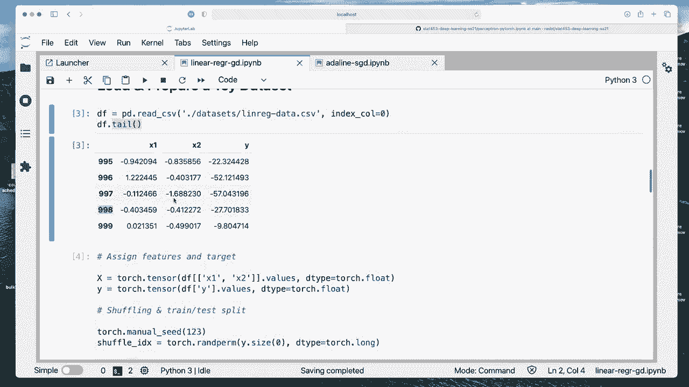
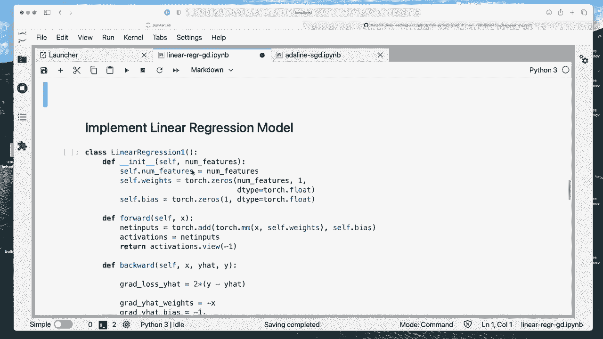
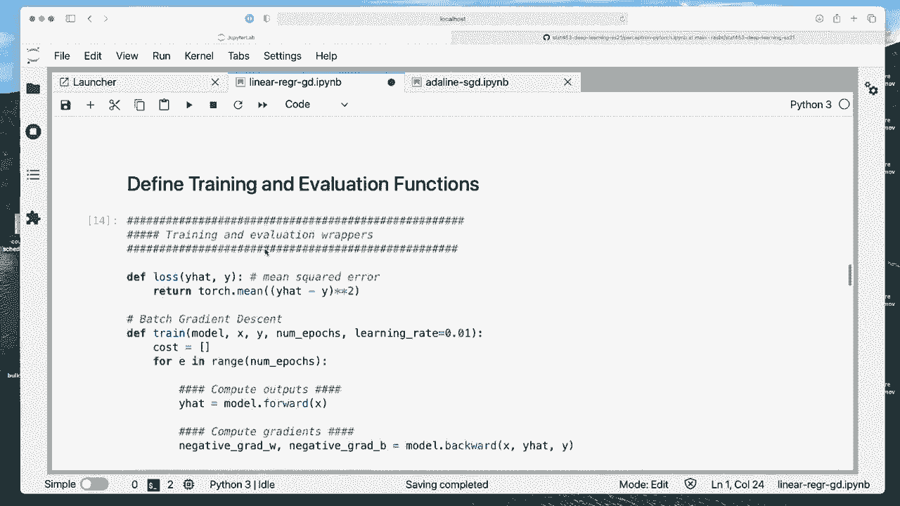
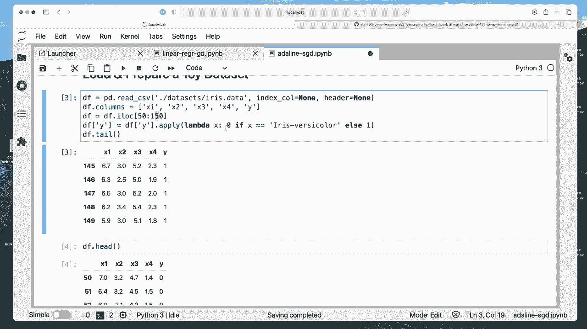
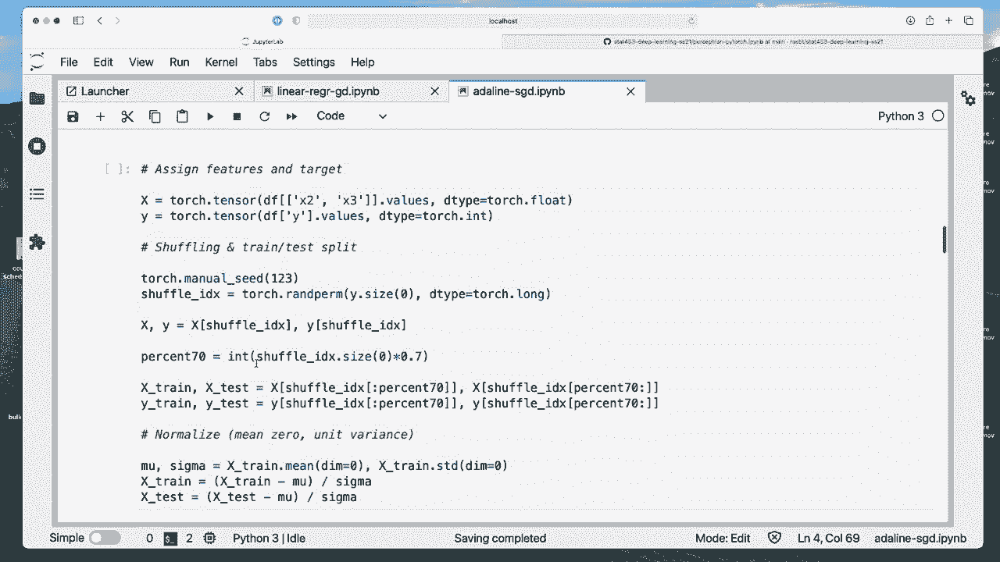
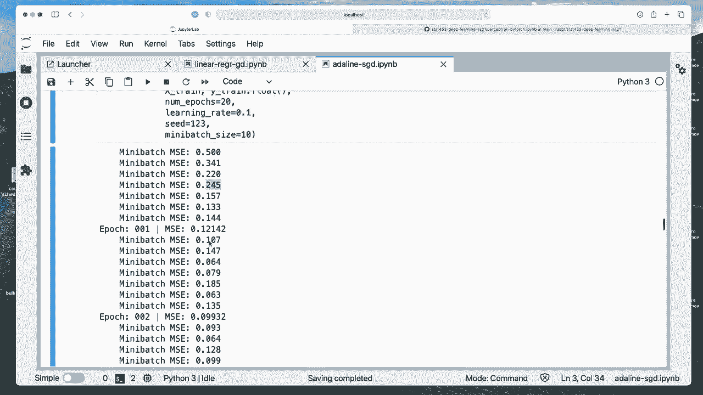
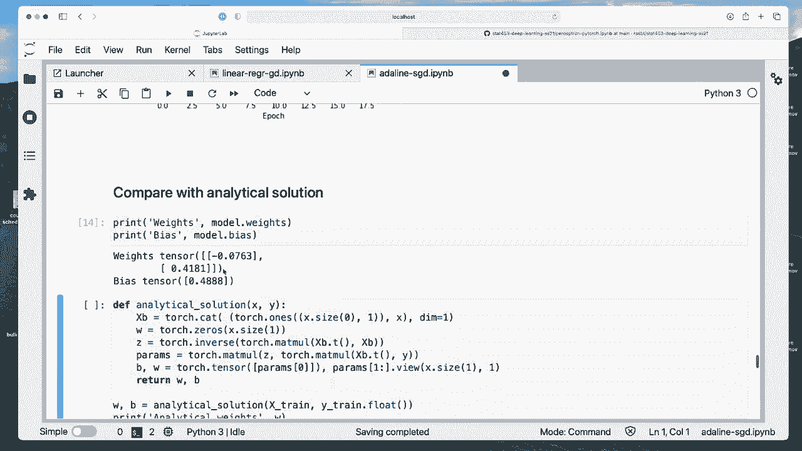
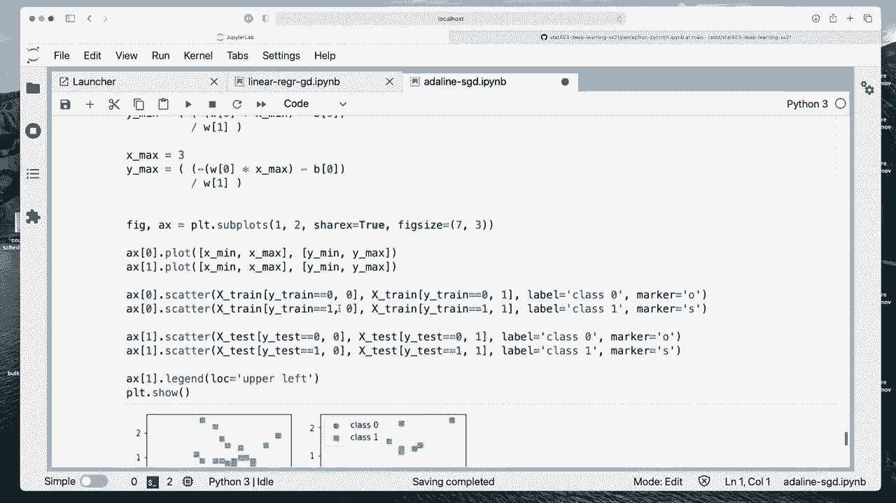
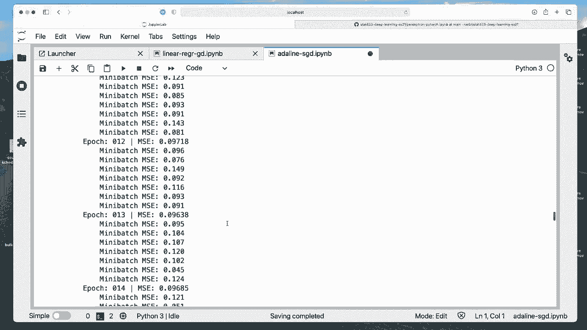
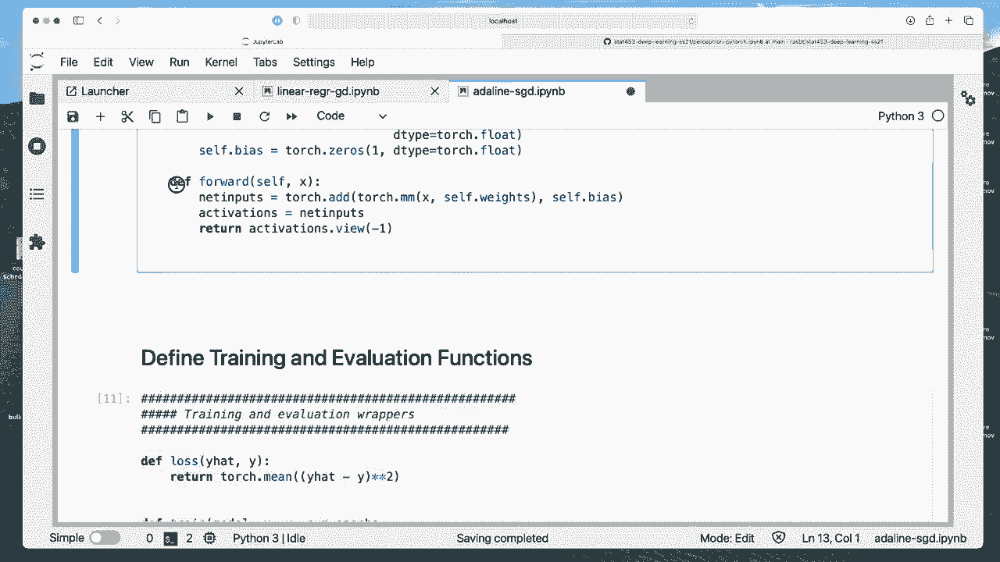

# 【双语字幕+资料下载】威斯康星 STAT453 ｜ 深度学习和生成模型导论(2021最新·完整版) - P40：L5.8- Adaline 代码示例 - ShowMeAI - BV1ub4y127jj

Yeah， now let me show you a code example of。Linear regression and Adeline trained with gradient descent。

 So I prepared two coat files。 One is called linear rigor for regression G D。 So G D here。

 this would be the regular gradient descent version。

 And then I will train the Adeline model with stochastic gradient descent。 However。

 note you can also do it the other way around。 You can train the linear regression model with stochastic gradient descent。

 And you can train the Adeline model with gradient descent。 So it's kind of interchangeable。

 And if you like， you can play around with that later on。😊，So let's do one thing at a time。

 So I have my watermark here again just to show you what software versions I'm using here。

 And then now here the linear regression model with gradient in descent。

 So what we are doing is we are training this model here。

So the training is up to this point and then the threshold function is only used later on when we do the prediction of the class labels that's after training so for training we don't need the threshold function。

All right。And yeah again like know that they are very similar。

 So here on the left yeah on the left hand side I have an overview of the code that I'm implementing below。

 so now these two are exactly what I implemented in these two notebooks I was just screenshoting it to show you that they are indeed the same I have them on the left hand side as linear regression on the right hand side as Adeline and they are exactly the same the same code except after training we can for Adeline then here use a threshold function to produce a class labels。

 but now that these are indeed the same codes that I used here。

So we will go over these codes， of course， in this notebook。

Alright， so we initialize some stuff that we will be using some libraries。

I prepared a toy data set here。

Just some simple data set containing two features， x1 and x2。

 So tail is showing the last five lines of the data set of the CB file。

 and there are 1000 training points。

So。Yeah， we have two features， x1 and x2 and one output value Y。 So this is a regression problem。

 So it's a continuous output value here。

So okay， let's start by。

Creating here our design matrix and Pytorch。 So here we will have a design matrix consisting of the two features and then the class table as a separate tensor。

I'm also shuffling the data set， so I'm shuffling it and dividing it into a training and a test set。

So I'm again using this index trick that I explained to you earlier later we will be using so called data loads when we use more complicated data sets like large image databases。

Where we have then some automatic functions in Pyr that do these steps for us。Here。

 I think it's sometimes good to just see how you would do that conceptually。

 like seeing or looking at the code to see what we are doing here。

So what I'm doing here is I'm creating these shuffle indices so let me show you how they look like。

 So these shuffle indices are just the indices 1 to 1000 shuffled and then I use them to select the training data。

 So first I'm actually using it to shuffle the data set So here this is just the shuffled indices I select all the data points in the shuffled way。

For both the training and the for both， sorry， the features and the labels。So note that here。

 because we use the same shuffle index， they are shuffled in a way that is consistent because otherwise if we use different shuffle indices。

 X might be shuffle differently than y。 And this is also why we just can't use simply this shuffle function that is implemented in Ny or Pytor because the shuffle function would shuffle them individually and then features won't match to the corresponding。

Labeled anymore。 So what I mean is so this one， this entry here might be then belonging to train data point 99998 by excellent。

 if we just shuffle them individually， so this is why we use a consistent shuffle index。

Then I select 70% of the data。 So this is just a size hope。How many data points are 70%。

 So let me this should be 700 like that right， like， let me double check that。

So yeah，700。 But this is just a general implementation that would work with any size of data set。

And yeah， this is for how then I'm selecting the training and the test set。 So the first。70%。

 the first seven data points will be training， and the remaining 70% will be for testing and the same thing for the labels。

 And then here I'm normalizing。 So this procedure is also called。

Sanditization。It's kind of yeah giving the data the properties of a standard normal distribution。

 it won't be a standard normal distribution， so we don't change the shape of the distribution。

 but it will have the same parameters that means it will have zero mean and unit variance。

Alright， so after we've done that， we now implement our linear regression model that is where it becomes more interesting。

So we use this class based implementation because this is also something that we will be doing in Pytorch later for complex models。

 So Pytorch gives us a lot of convenience functions like convolutional layers。

 fully connected layers and so forth， but we still apply the same concept by saying what our parameters are and then how we use all parameters in which order。

 The backward function is later something Pytorch will implement for us automatically。

So Pythch will actually create the backward function for us。

 we don't have to do it ourselves here we do it ourselves because this is like a very low level implementation where I do things from scratch。

In Pyth， later we can just use a fully connected layer and the backward function will be done automatically。

But I think here for now， it's maybe easier or not easier。

 but at least like better for your understanding if we walk through this step by step。

And do it ourselves before we rely on automatic ways of doing that。

So first we define the number of features in the initialization method。

And then we assign the weights of our model。 We just use zero weights。

 Can we also small random numbers for this model。 It does not matter。 We initialize our weights。

 We need， we need to know the number of features， right？ So we use that information here。

Because， yeah， if I screw up， the number of weights depends on the number of input features。

 of course。

Let me go down again， we have a separate bias unit because it's computational a bit easier to handle so we don't have to modify the input features when we get them from the training set。

So we also initial to 0。 We only have one bias unit， so there's only one value。

And then here we compute the net inputs。 So that is similar to the perceptron that we've used before。

 So we multiply x， the features and the weights。And we add the bias。

 So I'm writing this in a complicated way you can technically， I think you could write it also as x。

Its。Selfト weights。Plus。Of bias it should do the same thing。

 I' not sure why I was using it So in a complicated way。

 I think I just wanted to show you that I was using Pyth here。

Yeah， so then we have the activation。 So the activations are just the in inputs because the activation function is a linear function。

 So I could also。

Could have done something like that。 self deviation。Function X。X， and then。Use this one。

 social yourself。And then。

Just。To this basically。 So it would be the same thing should also work。 Does not really matter。

Okay。

And we get the activation。 So now the view here is just to make sure that the shape is the same shape。

That a we sorry that it is like a single vector。 So it's。

One dimension。

Not two dimensional。It just for convenience。 And then now in the backward method。

 what we are doing is。We are computing the gradient。 This is what we have done on this in the slides。

 So remember， the gradient is。Why so the gradient of the loss function with respect to Y head。

 So starting at the back。 So we're doing in two steps。 So this is。

So if our loss function it write down again， if our loss function is y。Mus Y hat。Squared， then。

The derivative is two times y， minus y。Head， right， sorry， that should be the other way around。

This way。And then this should be the derivative。

All right， so that's what we have here。And then we compute the gradient of y head with respect to the weights。

Which was x and the gradient of y had with respect to the bias is -1。

And then we put these two things together。So using the chain rule， the inner times al。

 this is what we have done in the slides。

So we multiply the weights as the transpose with Y hat。 So this is a little bit tricky。

 all these types of things， the view and things like that。

 This is really like to make the dimensions match。 So later on we won't have issues with that when we use Pyto automatic functions because they will take care of of it for us。

 if we do things manually we always have to make sure that the dimensions are right。

And then， because we compute。Or we have gradient in descent based on the whole training set。

 we divide by the size of the data set。 This is basically for the mean square error instead of the sum squared error。

 So this is our。

The loss of the sorry， the gradient of the loss with respect to the weight here。

 And this is the partial derivative of the loss with respect to the bias。

And then we return the negative gradients。 So this is exactly what we have done in the slides。

Now。

We have a method where we compute the follow path， the predictions。

 and then we can compute the negative gradients。 and these gradients will be used then for updating。

The weights to minimize the loss function。 So here we have。

 we have the training and evaluation functions， so。

I will check something yeah。 So here we have。

The loss function。

And yeah， that's the mean。

Means。E lost here。

And here we are training our model。 So now we have this photo。 This is。Bch gradient。Dent。

 So we have the training function， which takes our model， the input data。

 the number of epochs and the learning rate。

So we also take yeah， keep track of the cost or loss。

Typed it as cost here。 but you can think of it as a loss。

嗯。Yeah， so what we do is we iterate then over the epochs。 So for each epoch。

 we compute the predictions。 So this will be a vector。

 My head will be a vector because the predictions are for the whole dataset set。

Then we compute the negative gradients using our backward model method。

And then we update the weights and the bias。 So like we discussed in the slides， this is， yeah。

 the learning rate times the negative gradient。Let me see if I can bring up the slides here。

屁。Some么 it's not。

嗯。Just want to show you where we are。 Yeah， we are at this step here right now， where we update。

 basically so。We compute the negative gradients here in step B。

 and then we update right now with these negative gradients。 So that's what is' going on here。

 The learning rate times the negative gradient。 So that's how we update the weights。

And this is it。 And then we go up here。 So here， this is just for logging that we are just logging。

We are just logging。The loss。Current loss。And。😔，Print some outputs。

 We print which epoch we are currently in。 and the means quite error loss。

 because then we can see whether it decreases or not。 Actually。

 we don't have to compute that one because。We already had that from the first iteration It like a little bit wasteful。

 I don't know。Why I did that actually。

Yeah， so。I think yeah， because otherwise， this would be the first I see now。

 because this would be the the zeroth epoch。 And this is after we updated。

 So I could actually technically remove that。And then show it to you with。

Startuding at the zeroth epoch。 But then we won't know what the last。Gradient update looks like。

 right， Because when we update the weights and then we don't compute the last prediction with updated weights。

 we don't know how the final model looks like。 So this way。

In the last iteration， we know also how the final model looks like。 I mean， we can do it other way。

 other， in other ways， we could have this actually。

Let me see we could actually comment this out。 and then outside the for loop， we could。

When the epochs here have finished， we can compute。

The prediction， but it was just fewer code， fewer lines of code and a little bit simpler， alright。

Because here， everything is fast anyways。 alright， that's。

To find it。 And let's now run this model。 So here I am now calling this train function。

Oops， I have an error。 Okay， I have not。

Not executed this。 So we have to define this and define this。 Now we can。

Still not train it。Actation function is not defined。

I don't know why this should not be defined。 Oh yeah， it should be itself。

This is also something I just added so you don't have to use this activation function。

 not doing anything anyways。

Okay， so now it was training here。 Okay， you can see we start with a relatively high loss， like 1532。

 notice that let me scroll up again to the data set， these are relatively large values。

 which is why the mean squared error loss is so large。

 if I would divide all these values by a factor of 10。

 These mean square error losses would also be smaller by a factor of 10。 So the absolute number。

ItDoesn't really matter。 So you don't have to really pay attention to the absolute number。

 What you want to see is the relative decrease that it goes down over time here。

 you can see the longer we train the smaller the means square error becomes。 So it's training here。

 And you can see there's a point where it doesn't go down anymore。 it stays at 371。 So that means。

It kind of converges， and it has probably reached a global minimum。

So okay，'s what we see here。 So let's plot the cost now， because remember。

 I was keeping track of the cost， which is the loss over each epoch。 It's just like to。

Yeah， not con The loss for the。

Stochastic grand deworth。

The one over the epoch， but it doesn't really matter the terms are use， usually used interchangeably。

 Where was I Yeah， here。 So here I have the cost we can also call it loss， actually。

 it's maybe easier。

Let's call that loss and。I， I think I have the loss function that is called loss。

 which is why it was confusing。 Okay， let's leave it at cost here。Alright。

 so we compute the cost or inice it to an empty list here。 And then in each iteration， we。

Add the current loss to it。 So this will be a list of all the losses over the training。

 So this will be a list of these values here so we can plot that and look take a look at how it looks like。

Yeah， so we can see it starts out very large and then it goes down smoothly until it converges。

 So here at that point， we can say the model has converged。

 It has probably reached the global minimum of the loss function。

Alright， so now after we train the model， we can now use it for prediction。 So let's now。

Predic on the training set and the test set。 So this is similar to the training just for reference。

 let's compute the mean squared error on the training set and then to the test set。

Alright， so you can see here the training set MSE is lower than the test set MSE。

 which means the model is overfitting a little bit to the training set， but it's not too bad。

 I would say。

嗯。

Now， let's also compare that with the analytical solution。 So if I， if you recall。

Somewhere here， I showed you。In the slides， the analytical。

Solution， I don't know where I headed it。😔。

I think it was yeah here。 So we have this analytical solution where we get the optimal weights using these matrix the matrix inverse here times x transpose y。

 this is the analytical solution。

So let's compare our gradientd descent solution with the analytical solution to see whether they match。

 So ideally， they should be very close。

So here are the model weights from our。Own model from our gradient descent model。

 So we see for the weights feature  one weight is 0。36 and feature 2 weight is 。379 approximately。

 and the bias is minus 0。54。

Now， here is the analytical solution where I implemented what I had on the slides。

 but I just showed you。 So when we execute that， you can see this one and this one。

 they are very close and also these are virtually in identical and also the bias unit is identical so we can see。

This gradient descent implementation works， and it gave us yeah， the global minimum here。

Yeah， an ungraded homework exercise just for you so Mike the task for you is modify the training function such that the data set is shuffled prior to each epoch do you see a difference Yes or no。

 so you can try this out in practice but you can also just think about it whether you would see a difference whether you shuffle prior to each epoch or not and yeah try to come up with an explanation for your observation or intuition and then maybe post this on piazza just to check your understanding whether shuffling would make a difference here yes or no。

So you can try that out in practice， but also you would be able。

 I think to answer this without even changing the code。

Alright， now let's take a look at the。Add a line model with stochastic gradient descent。

 So we could also implement it with gradient descent。 It doesn't really matter。

 But here we used a stochastic gradient descent a mini batch mode because this is something we will also be using later on when we implement deep neural networks。

So again， these steps are all the same。

Okay， just yeah， using a different data set。 Now， we are using the iris data set where we have four features。

 x 1， x2， x 3 and x 4。 So that's the se length， Sple width petal length and petal width。

 this is our class table， the predicted class table。 So they are actually。

Simplified it so that there are only two class labels。 So let me see。

So this should be classable 0 yeah the first data points。

 So I'm only using data point 50 to 150 here， I think yeah。

So， here I'm。Yeah， I'm applying class label one。 So here I'm selecting。

 So what I'm doing precisely is I'm selecting only data points 50 to 150。

 And then this would be class label 1。To 1 and2， but I changed them to 0 or 1。

 Otherwise our function would not work。 So I binaryize our class ables。

This is just to make this problem work for Adeline and also that same would be true for the perception later we will be seeing models that can also deal with multiple class labels。

So here， this is exactly the same code as before， where I'm just using。

The shuffle indices now use 70% again for training and 30% for testing。

 and I'm also standardizing the features。

Just to visualize how the data looks like。 So this is our data set to classes。

Blue dots and orange dots here。

And this is for the training set， how the training set looks like。 Sorry。

 the test set looks like above is the training set。

And now we are implementing our Adeide model。 Note that this is exactly the same as before。

 So I don't have to go over this again。 So this is exactly。

Like the same code。 And so here I have made screenshots side by side。

 So you can see if you look at it closely， there is no difference between the two。

 So how we got that again is by let me see。

By deriving。What did I have。Was a long lecture。Here。

 so this is basically what we do in the backward pass， where we compute。

嗯。See， so where we compute the derivative， so。

This is the outer derivative。 And these are the inner derivatives。 So if I go back。

 we have the out derivative， This is。This part here， where we have the power rule。

 we bring the two up front here。 So this is this part here。

And then。This is the inner part。 This is here， this x， basically for。The weights， that is the x。

 And for the bias unit， it's just -1。 because if we would compute the derivative of。

This one with respect to the bias unit， this would be one。sorryrry， why are we here So here， sorry。

 if we compute the partial derivative of this net input with respect to the bias unit。嗯。

This one will be。Let me ride the stone somewhere。So we have an W transpl x plus w。

 If we derive with respect to B。 So this would be a constant。 So this goes away and a derivative of。

This one with respect to B is one， right？ So in this one， in this case， the derivative would be one。

 but we are also interested in the negative gradient。 so it would be-1。

Alright。

嗯。Yeah， allright。 So and then we。

To find the training and evaluationeration functions， this is the same as before。

Computer the loss。 We have our training function， the same as before。

Because nothing really changes because we don't use our threshold function yet。

Let's see。 our model trains。

Not defined。 Yeah， I am。Forgetting to execute them step by step here。

 which is an issue that can happen in Jupiter notebooks。

Alright， so now， yeah we see we start again with a very large。Ross now， oh， sorry。

 I mentioned it was the same。 but one difference is now we're using knee batch gradient descent So batch gradient descent。

 So really， the difference is that。

We have now these mini batches here， so before。

Maybe just showing that side by side。

before we are just iterating over the epochs here here， we iterate over the epochs and inside。

 we also iterate over the mini batch。 So I'm creating a mini batch。

Here， sorry，mi。Shuffling， and I'm creating multiple mini batchs here by splitting this。

Into mini batches of a certain size。

So I'm using a size 10。 So I'm splitting it into multiple vectors where each。

Vectctor will contain1 attend0 training examples。 And then for each。

Mini batch。 Im doing my forward pass。

And so forth。 So now I have the mini batch training so that I have。If I have 1 of 50 so 10，1，2，3，4，5。

6，7， I have 7。Mini batchs in each iteration， because here I have 700 training examples。

So I can divide them into。10 mini batches with。70 training examples each。

So we start out with a large meanqua arrow， and then it you can see it goes down。

 but it is now now a little bit noisier。 You can see it goes down here。And down。

 But then it goes up a little bit。 sorry， and you can see then it's a little bit noisy at these updates。

Yeah， and then overall per epoch， we can see that。

Things go down。

得랍得得了。

So at some point here， we have converged。 so we can see it's fluctuating a little bit。

 but it's not going down significantly。 It's going a little bit up and down。

 So it's a little bit noisier than the gradient descent。

 The mini batch gradient descent is usually a little bit noisier。

All right。So time to evaluate it。 So it's easier actually to look at it in a plot compared to these lists。

 This is something if you train complicated neural network models。

 it might be helpful to print it on a command line on a server if you don't have any plotting functions available。

 but after training it's usually good to at least take a look at this。

Because here it's a little bit more clearer to see so you can see it goes down very steeply and then you can see it fluctuates so it's not converging completely because yeah it's more stochastic so there's more noise。

 but overall we can say it kind of converged maybe we could have changed the learning rate making the learning rate a little bit smaller and later on we will also learn about something called learning rate schedule us where we make the learning rate smaller over time so that we converge better also。

Alright， so let's take a look at the model weights and the bias。

From the training and then compare to our analytical solution again， so we can see the weights are 0。

07 and 0。4 here， 0。488。

And yeah， if we look at our analytical solution， it's。Cled， you can see it's quite close。

 but it's not as close as before before we used gradient descent instead of stochastic gradient descent。

 so before it was a little bit more accurate。

So but you can change this code also to do gradient descent later on。

 when we talk about multi layer networks， yeah， regular gradient descent wouldn't really be very useful。

So it's actually good to use stoy gradientnesscent here as a practice already。

Alright， so let's take a look at the prediction accuracy now。

 So how good is our classifier that we trained。 So for this one， we now need the threshold function。

 So we set the threshold at 0。5。 So this is if I go back to my slides。

So this is what I'm doing right now here， so for a given value， if the value exceeds 0。5。

 the prediction exceeds 0。5， we assign at class value class level 1 if it's below 0。

5 we assign at class level 0 so this is what I'm implementing here if my predictions are greater than 0。

5。

We predict once。 So I have actually prepared a。Be of once。

 So this is one limitation of the torch where function。 So how the torch where function works。

 If you remember from the perceptron， is if you have a value。So if you meet this condition here。

 then you return this value。 If you don't meet this condition， you return the second value。

 So I'm preparing these vectors already as output。 So I don't have to recreate them。

 So this is the ones。 and this is the zeros。 And now I'm also then computing。

The mean。 So what is the mean， It's basically the number of。

 So we are computing the sum of the number of ones on the correct predictions here。

Cause I have the equal sign。 So it's maybe going on， or there's a lot of things going on in one step。

 I could make。Maybe a separate step， predicted。Labels and sign that。Here might be easier to read。

 and then。Have would like this。ItMight be easier to read。So here， first， I'm， like I said before。

 I'm creating these。Predicted labels。And then Im checking how many of the prelude labels match my true labels。

 So this will be a vector of zeros and ones。And then I sum up all the onces and divide by the number of。

Data point。 So this is what the mean is doing。 So it's yeah， basically telling me on average。

 how many are correct。So it will be a value between 0 and 1。

Yeah， and I do the same thing here for the test set。

So let's execute that。 There we get 90% training accuracy and 96% 。6% test accuracy。

 It's a small data set， usually you will find that in a real world case。

 the test that accuracy is usually lower than the training set accuracy because of overfitting and stuff like that。

 But this is a very small data set。 And this might be just due to chance。

So just to illustrate in what this value here is。 So this a vector of zeros and one。 or sorry。

 truths and faults。 But you can actually convert it to integers。 and then it should be zeros and one。

 and then you can compute。

，Some， so this gives you the number of one。And then if I divide it by the number of training data points。

 which is let's say。They both do size。So this is my 90% here。 so I can then multiply it by 100。

That's my 90% training accuracy。Alright， so let's take a look at the decision boundary。

So this is the same code as from the perceptron class or lecture。 and we can see now。

 so on the left hand side， this is for the training set and on the right hand side。

 it's for the test set。 It's actually doing better than the perceptron。

 It's something this would be a problem where the perceptron wouldn't be able to solve it because here you can see now this is the case where the classes are not linearly separable。

 So there is no decision boundary where you get perfect accuracy。

 So a perceptron here would have really problems。 It would change。

 It would like have a decision model like this and like this， this it would flip back and forth。

 but this model converges。 you saw that based on the。

Training And also its， it's kind of finding a good boundary here。 And this is for the test。

So yeah， this is it for this lecture。 in the next lecture。

 we will be taking a look at how we compute or how we can compute these gradients automatically in Pythtor。

 So next lecture， we will see。

How Pytorch computes this one automatically so that we don't have to do this by hand， because。

 I mean， right now。

What we had here。Where was it？

What we had here was relatively simple， a very simple function。 But even for that。

 we needed a lot of， yeah not a lot of steps。 I mean， you can do it in fewer steps。

 But it' is kind of complicated when we have multiple layers and nonlinear activation functions and stuff like that。

 And it would be really tedious for every neural network network architecture to do that from scratch。

 So Pytor actually implements some functionality to。

Computers backward function automatically by analyzing the forward function。 Allright。

 we will see how that works then next week。

