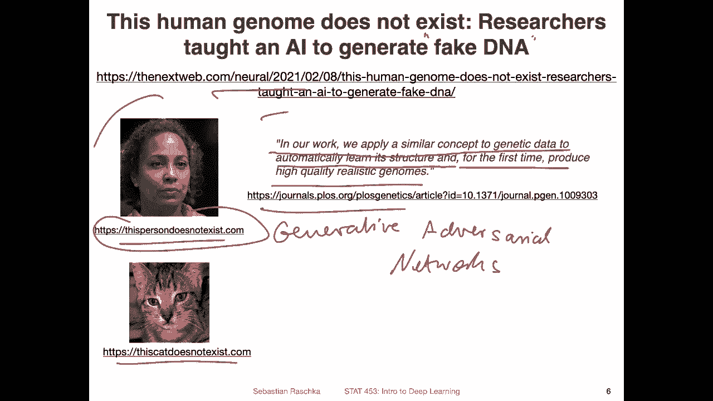
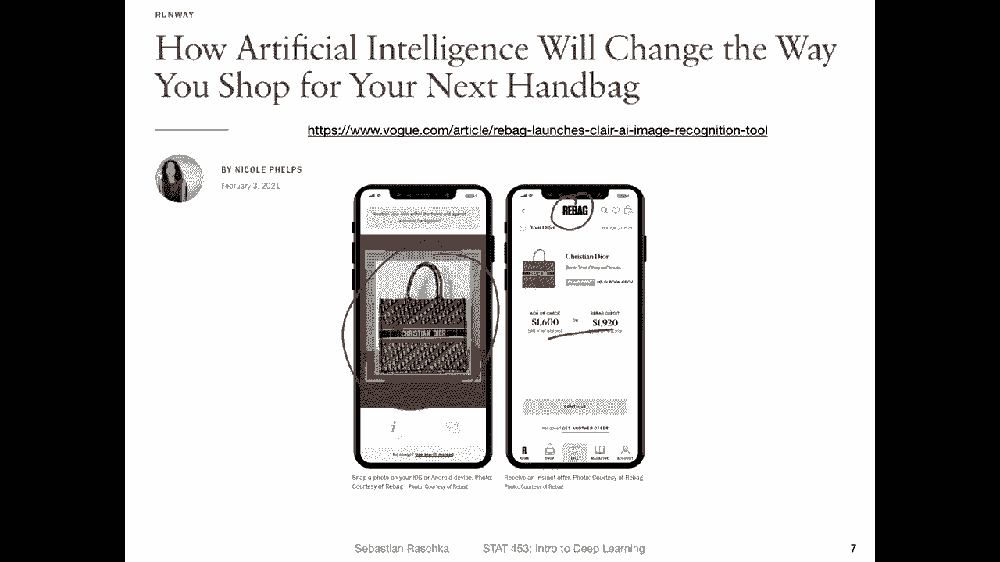

# P41：深度学习新闻 #3，2021 年 2 月 13 日 - ShowMeAI - BV1ub4y127jj

Yeah， hi， everyone。 So all good things come in threes。 and I'm back with stuff in the news number3。

 Last week， I talked a lot about language models for deep learning。 And this week。

 my news section will be more focused on computer vision models。

 which is also a little bit closer to my research area because there happened a lot of interesting stuff around computer vision this week。

 there are lots of things to talk about。 So let me get started and dive in。😊，Yeah。

 let's start with a good old fashioned computer vision application image recognition。

 So here the title of the paper is high performance。

 La scale image recognition without normalization。 So here the researchers has developed a deep neural network that can achieve new image classification state of the art results without batch norm。

 So if you encounter this work here Sota， this usually stands for。State of。

The art and means that you achieve a state of the art performance in terms of the best possible performance or among the best possible performances compared to other cutting edge state of the art models。

 So here， what was the novelty。 So here， the novelty is that they achieved this state of the art performance without batch normalization。

 So batch normalization is something we will be covering later in this semester。

 And it's a technique that has been used in the last， I would say，4 or five years to get， yeah。

 stable and good performing models。It's like a type of data normalization technique。

 and we will come this in more detail later in class。

 So here what's new is basically that they achieve the good performance now without batch normalization。

 Basically making models simple again。 So what did they use here。

 So here they developed an adaptive gradienting clipping technique。

To overcome the instabilities that arise from not using batchome。

 So there have been also some other models recently in a last couple of months or years that achieved state of the art performance without batchome。

 but they were usually more unstable。 So more unstable towards little fluctuations in the data set and so forth。

 So here they achieved really good performance。Without this normalization technique。

 so they developed so calledled normalizer free residual networks。

 So restnets or residual networks are also something we will be covering in the semester in the convolal network lecture。

 So we will be likely also revisiting this paper then。

What is also interesting is how they evaluated the performance。

 So here I have a screenshot from the paper on the Y axis。 you see the imagenet top one accuracy。

So recall from the introductory lectures， I I mentioned the challenges with Inet where you can have multiple possible labels。

 So in this way usually people also call or compute the so-called top 5% accuracy because yeah if there is something let's say you have a bus or a car in an image there are multiple possible labels。

 for example， it could be a vehicle car automobile and stuff like that。

 So there are multiple possible ways to yeah have a correct label and sometimes there are also multiple objects in an image here yeah。

 for some reason I mean the researchers yeah use the top1 accuracy。

 I think top five accuracy both are yeah important things to look at in any case。

 but it's interesting here。The X axis so here on the X axis the researchers also focused on computational efficiency。

 so here they call it the training latency as I think it's seconds per step on a TU。

 so this is like the tensa processing unit equivalent to a GPU or similar to a GPU and they looked at a batch size of 32 per device so they used multiple devices。

 multiple TUus in parallel。Yeah， but what is interesting， though。

 is to think of it as the just like the efficiency。 So the right hand side。 So here it's more。

Expensive。And this one here on the left hand side would be cheaper。

 make cheaper to train faster to run。So and why is that interesting to look at。

 it's because usually you can also think of it as if you make a model larger。

 you have more parameterss， you will likely get a better performance。But then at the same time。

 also these networks become more expensive， so depending on your application you are interested also sometimes in smaller models because you cannot run these large models。

 for example， on a cell phone or iPhone or something like that where they have on device machine learning algorithms。

But then also at the other hand， you otherwise， still can make the argument， the together the model。

 the better the performance。 And you want to also see whether the method just works for yeah smaller models。

 So here they have different flavors of the method。 F 0 to f 5。

 I think these are just different sizes of the model。 And you can see。In terms of accuracy。

 their method is yeah better than all the other methods here and these are actually pretty good methods。

 it's like efficient methods， but it's called efficient net for example， Lambdanet。

 I think the stands for data efficient image transformer and so forth so you can see for all types of yeah model sizes their method performs better than these alternatives but again these are different architectures we will talk more about the convolution network architectures later in this course what was interesting really here is that yeah you can also achieve good performance without using batch normalization。

Yeah， here's another interesting thing I found this week。

 It's not so much a news article but a Reddit discussion from the Reddit machine learning subdit。

 which has sometimes really interesting and useful insightful discussions。

 So here someone asked about deep learning theory like wondering about the recent advances of or in the theory of deep learning。

 like certain understandings how we think of deep learning。 So in the last couple of years。

 there were some。Hypotheses that were particularly popular。 For example。

 the lottery ticket hypothesis， which is essentially about， yeah， saying that just by chance。

If you train a large overpoorized network with lots of combinations。

 just by chance there is a high probability that at least one of them will yeah have optimal performance just because you considered so many variations or combinations that just one of them performs well by chance。

 there's a lot of evidence in favor of this hypothesis。

 but I also recall like a couple of weeks ago or months ago。

 I think what was 2020 there was a paper like giving evidence against this lottery ticket hypothesis And in this way I'm actually not sure in how far this hypothesis is still a valid hypothesis anyways。

The other one is the double decentscent hypothesis， which is also particularly interesting。

 So here at the bottom， I have a screenshot of this hypothesis from a different blog post article because it was just a nice image。

 so。What is shown here is the test and the training error。 So in contrast to the previous slide。

 the lower is better。 So in the previous slide， we had accuracy。

 so the higher was better here it's the lower is better。 And here we have， for example， the view。

 the expected view， the classical statistics viewpoint， so。Here， you can。

Think of it in a classical statistics viewpoint that you start with a model。That has a high error。

 Why is the error high。 Yeah， that is because。Usually your model is too simple to capture the complexity in the data。

 so your model doesn't have enough parameters and then it's too simple and cannot achieve a good classification performance because。

 for example， think you have think of a nonlinear decision boundary that you need to classify the data。

 but you only have a linear model in this way the model is too simple to capture。

The patterns in the data。 And as you make your model more and more complex。

 maybe think of adding more layers to a neural network。

 then your training error will go down and the test error will also go down。

 but at some point the test error will go up again because you have now so many parameters that your model starts overfitting。

 So in this way your model will perform worse with a given size。

 So here they use the residual network。 we will talk about residual networks also later in this class。

Yes， so this is the classic yeah， statistical viewpoint with。Let's maybe， yeah。

 let's consider the modern modern view。 The modern view is usually the more data you have the larger sorry the the larger the accuracy。

 but also the smaller the error， basically So but the reality is that theres usually this bump。

 That is what researchers has yeah， found out， I think in the last couple of years。

 So if you look at it in practice， you start。With a high accuracy， the accuracy， sorry， high error。

 the error goes down。But then yeah， it goes up again for some reason。 So。

 and then there is this bump。 and then it goes down again， which is a little bit weird。

 So people call that the double descent hypothesis because you go first down。

 then you go up and then you go down again。 So right now。

 I think it's also still a discussion whether this is a valid thing or whether this is maybe due to accidental。

Experimental errors like someone， maybe add some little bug in their code or something like that。

 But so far， all the evidence shows that this is indeed a phenomenon that can be observed。 And yeah。

 that was another interesting hypothesis that is currently still under discussion。

 So if you're interested in more of these types of things。Check out this subd。

 there are way more hypotheses listed below there in the thread so people discuss these types of things。

 and I think it's just interesting if you are curious about these things。Yeah。

 another interesting research article I saw was this one he entitled Reming biased data to I fairness and E。

 soundss like a relatively straightforward approach。

 like if you have unfair system and this is like also a very important topic due to your data sets sometimes and other reasons machine learning systems can be unfair towards certain。

Subpopulations， for example， and here the researchers tested the idea that removing biased data。

 whether this can improve the fairness and maybe even the accuracy of the system and what they found what was quite interesting is that they achieved a low discrimination of almost 0% when they trained the model on the biased data so by just changing the data said they were able to reduce the discrimination of the model。

But what was also interesting is that they said。While observed in higher accuracy compared to models trained on the full data。

 so basically they removed biased data points and not only did they improve the fairness of the machinery model。

 but they also achieved a higher accuracy。So and according to the authors， for example。

 other methods that are being used to make machine learning more fair usually achieve this fairness at the expense of accuracy。

 so usually when people want to make a machine learning model more fair。

 the accuracy goes down and then here they found yeah the opposite you make it more fair and the accuracy goes up which which sounds like a win- win situation。

So here' just a brief overview of what they did， so they started with the biased training data and they had a feature extractor generated similar pairs。

 so similar pair in terms of you have a data point from so maybe let me step back take a step back so they evaluated it on eight data sets here。

where they had multiple attributes and they had also a sensitive attribute， for example。

 the sex of a person or the race of a person and what they wanted to predict is， for example。

 different things like income， credit worthiness， exam scores and so forth。And they， for example。

 generated similar pairs with， for example， someone who had。

 or where some instances where the sensitive attributes were different。

 but everything else was the same。So they found individuals treated unfairly。

 and they trained algorithms based on this biased model， they then rank these。

Instances by influence of how much influence these instances had on the model。 And then here。

 they sorted the training data， removed the data points and trained。

Model on this the biased dataset set measured the discrimination。

 And then if the discrimination decreased， they did another round and removed more data points so they kept going until no improvement could be made and they found by by this simple approach they could yeah improve both the fairness and the accuracy。

 which it sounds like a good idea。But I'm not an expert in this area。

 but it sounds like something that yeah should be explored more and maybe also applied to some deep learning models。

 so I found this interesting。Related to also the training data influence。

 I saw this article by the Google AI research teams， so they had a block article。

 but in the block article is's also a link to the paper to the original paper。

 so they call their method trace in， which is the simple method for estimating the training data influence。

So what they do is during training， they record the changes in the prediction caused by an individual training example。

 so they train a model and then look whether the training performance is yeah how much the training and performance is influenced by this particular data point and this technique is especially then useful for detecting outliers。

And also what you can do with this technique is you can explain predictions so to get some insights into the AI model from the training examples rather than the features so most techniques for interpretability usually focus on the features it's basically about saying okay this and this attribute in the training set is important for making predictions here they look at it from the perspective of training examples like which training examples have a large influence on the model and I can imagine if you think back of the previous slide this model on fairness。

 I think those two methods might be also interesting to combine in a way that might be a good or interesting thing to look at。

These influential training examples and how they maybe influence the fairness。

Might be a future research direction anyways， or could be something interesting for your class project。

 In any case， so here's a figure from this blog post。So here on the X axis。

 they have the updates during training， so the different model updates on the Y axis is the loss and here they take a look at the class zucchini。

And they notice， for example， if they provide a training example that contains zucchinis。

 then the loss goes down as expected。 So you go down with a loss。 but then for example。

 if you encounter a training example seat beltt which has nothing to do with the zucchini then the training loss for zucchini goes up。

 So if you want to improve the zucchini classification then you shouldn't show it seat beltt samples but then of course your problem is probably a multiclass classification problem where you also have seat belts So it's like a tradeoff right should you show the seat belt。

 I mean then you make maybe the seat beltt classification better but then you lose on the zucchini classification。

 So in this way。They give it here another seatbelt。 It goes up。And。

Here goes down me doing some other， I don't think they show every training example。

 they only show the most influential ones， the proponents and opponents and seatbel。

 it goes up again， zucchini it goes down by a lot and so forth and sunlasses it's interesting for sunlasses also the loss goes down on zucchini。

Yeah and so here they can kind of better understand what influence the data or data example have。

 for example here， one seat belt has more influence than another seat beltt and this way you may also find interesting weird outliers in a dataset。

Yeah， another interesting research article was related to generative generative adversary networks。

 So this is also something we will be covering towards the end of the class。

 and this might be us in general， though on interesting application or idea for your class project。

 So there were some projects in the past called this person does not exist where people used。

Genative。Adverilial。Networks to generate faces of people that don't exist in real life。

 So for example， this person does not exist in real life， it's made up by the model。

 And if you go to this website and refresh it every time you will see a different face that does not exist in the real life。

And also， similarly， theres a。Website called this cat does not exist where people did the same thing for cat images。

 So yeah， you can。Yeah， generate cat images。 Yeah。 and now researchers applied the same idea to genome research。

 So he was an。Article linking to a research article that was recently published where the researchers described that in our work。

 we apply a similar concept to genetic data to automatically learn its structure and for the first time。

 produce high quality realistic genomes。 So why is that important or interesting。

Currently there's a lot of research being done on DNA and genomes。

 but one problem is really like privacy because yeah genome is unique for a given person。

 so if you do research on genomic data， you kind of have to be careful about how you handle the data if you have realistic genomes that are totally realistic but don't belong to a certain person then I can imagine this can make certain types of research easier for example。

 if if you train large scale classification models for a different genes and you have a data and your model learns from this data。

The model will con turn contain some information about the data。 So it's kind of， yeah。

 a little bit tricky to make this model available for people or to people who might find it useful because maybe someone would be able to extract some personal information from that model。

 if you train a model on this。Fake DNA， and it works well on real DNA as well。

 I can imagine this can help with some of these privacy issues around that。

Yeah， one last thing about computer vision or related to computer vision。

 which might also be useful as inspiration for a class project。

So I also saw this project where a company， I think it's called Reback。

 a company trained computer vision model to estimate the price of a handbag。

So here based on the article an interview with a person。

 they trained it on millions of data points and it took like six year to develop six years to develop this app。

 but yeah it sounds like a fun project where you can take a picture of your handbag and then it estimates the price So it's like a simple straightforward computer vision project I think not too complicated but I guess the trick here was to really get a lot of pictures of handbags and make it accurate So that might be also like an inspiration for a class project of course not with handbags but maybe with something else。

 So yeah these days people maybe sell a lot of cell phones or laptops or something like that So in that way might be also interesting of course it's not only then based on the picture but also some other statistics like processor speed each of the computer and stuff but yeah I think this is also maybe an interesting fun class project to develop a simple computer vision app that can take pictures of something and then yeah estimate。

The resale value。 Alright， with that， this is all I have for this news week。

 and I wanted to also wish you a happy Luna New Year。 Hope you have a nice weekend。

 and I will see you back in class on Tuesday。😊。

