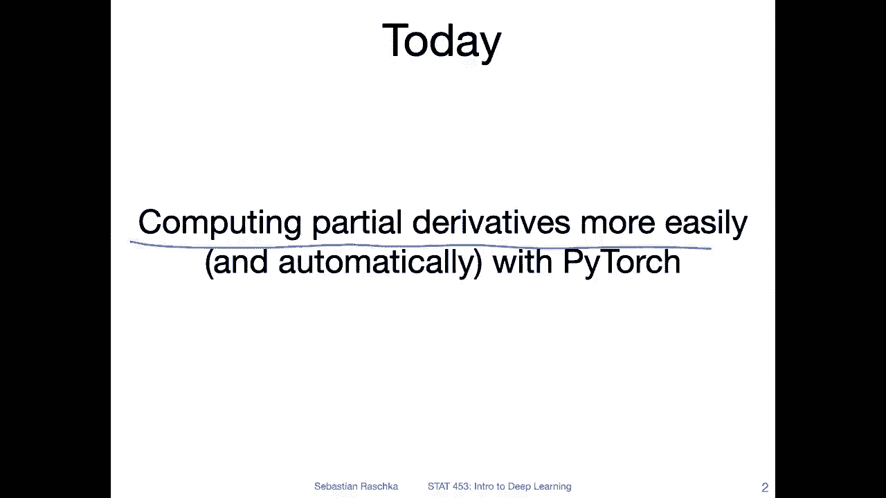
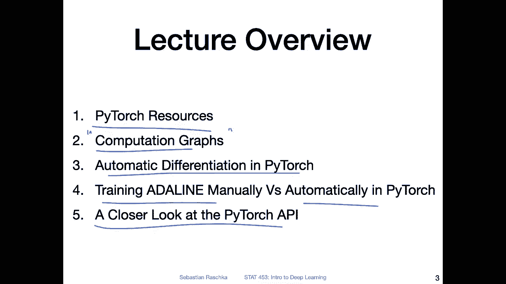

# 【双语字幕+资料下载】威斯康星 STAT453 ｜ 深度学习和生成模型导论(2021最新·完整版) - P42：L6.0- PyTorch 中的自动微分【课程概述】 - ShowMeAI - BV1ub4y127jj

Yeah， hi， everyone。 I hope you had a nice weekend。 So last week。

 we talked about gradient descent and topics and calculus to understand how we can compute the partial derivative of a loss function with respect to the weights of the model so that we can optimize the model to do good predictions。

 So this is， I think， still very important to understand from a bottom up perspective。

 like understanding why we compute gradients and how we compute gradients。 However， in practice。

 especially when we work with these big neural networks。

 It will be very tedious to implement these gradients by hand by deriving the loss function manually by let's say pen and paper and then coding it up in python Python code and things like that。

 So we will use pythwa actually。😊，To make our life easier。 So in Pytorarch。

 there is a sub moduleule called Autograd， which is a module for automatic differentiation。

 And as the name automatic implies， it will automatically derive the loss function with respect to the weights for us。

 So in that way， we don't have to worry about it ourselves。 And in this lecture。

 I will show you essentially how this works。 And we will be then also using it later in this course。

 when we work with more complicated networks like convol networks or recurrent neural networks。

 So with that， let us get started then。Yeah， like I mentioned。

 the focus of today's lecture will be on computing partial derivatives more easily and automatically using Pytorch。

And I structured this lecture into five parts， so the first part will be really just on yeah Pytor resources so where you can find information about Pythtor and more reading material if you need it。

 where you can find useful tutorials。 So in addition to this class。

 I think this is just also useful for you to know where to find more information and keep up to date with yeah the Pytorch development in terms of new version releases and so forth。

So then I will introduce the concept of computation graphs。

 so this is basically how we think of a series of computations in the computer like this yeah computation graph that we can use to visualize a computation like a prediction in a neural network and then using the analogy or the concept of a computation graph I will explain how automatic differentiation works in Pytorch。

 so Pytch is under the hood building such a computation graph and then based on this computation graph it backts the computation to compute the gradients。

We will then see how that applies to Adeline so last lecture we trained the Adeline manually so we computed the derivatives by hand in lecture slides and then I showed you a code implementation of that so today we will see how we can do this automatically using Pytorch so in Pytorch there is a so-called backward function which can do things automatically that we have done tediously by hand last week。

And yeah， lastly， I want to end this lecture today by taking a closer look at the Pytorch API。

 So there are two main subapis， object oriented and a functional API which are both useful。

 So I will also yeah explain to you how the API works in a bigger picture sense and we will be using these concepts than later when we talk about implementing yeah multilayer new networks。

 So with that I think this lecture maybe one of the longer once again。

 So it could be that is a little bit above the 75 minutes。 However。

 on Thursday there will be a shorter lecture where I will go over just optional concepts like how we can run code on the GPU using free cloud resources。

 So Thursday lecture will be I think relatively short or more like optional So you will have also plenty of time to catch up this week if this lecture ends up a little bit longer but with that let me not yeah spend too much time here and get started with part1。

Pytage resources。