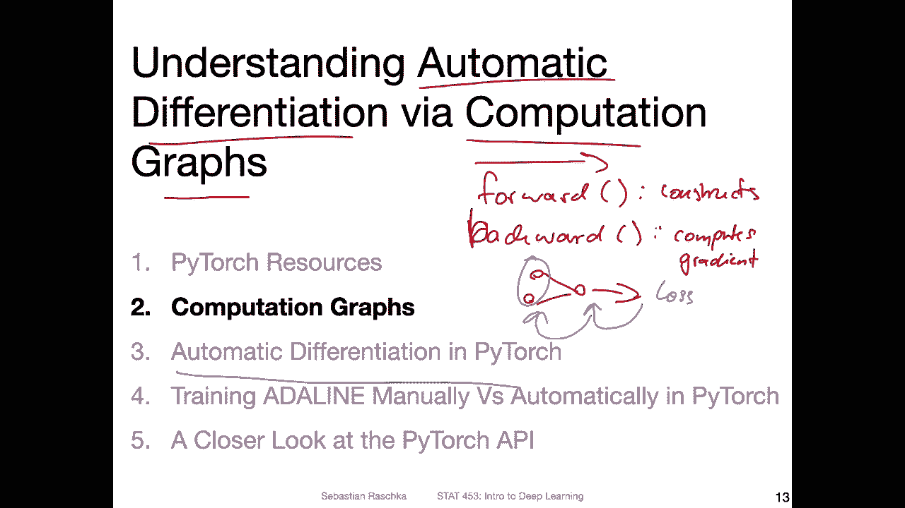
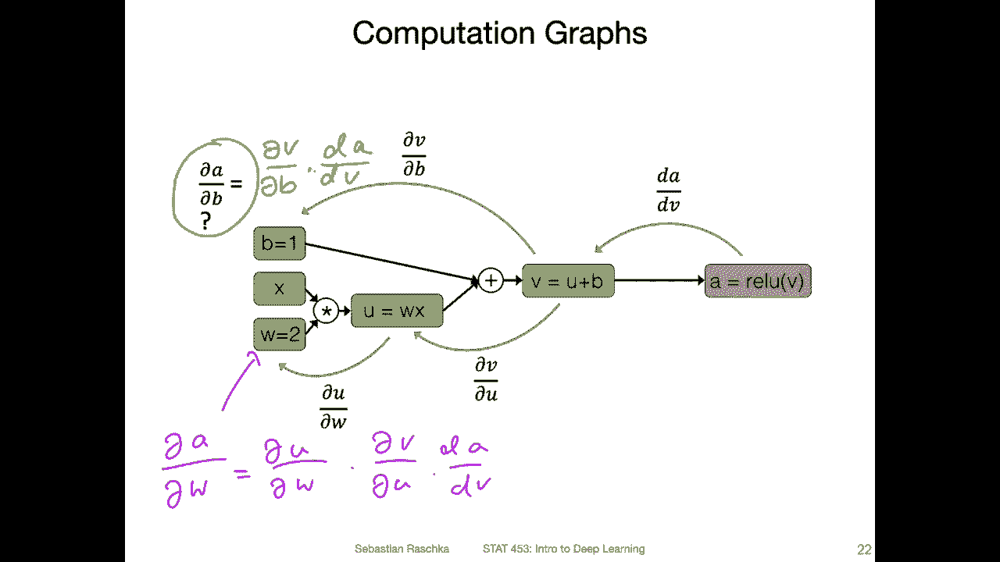
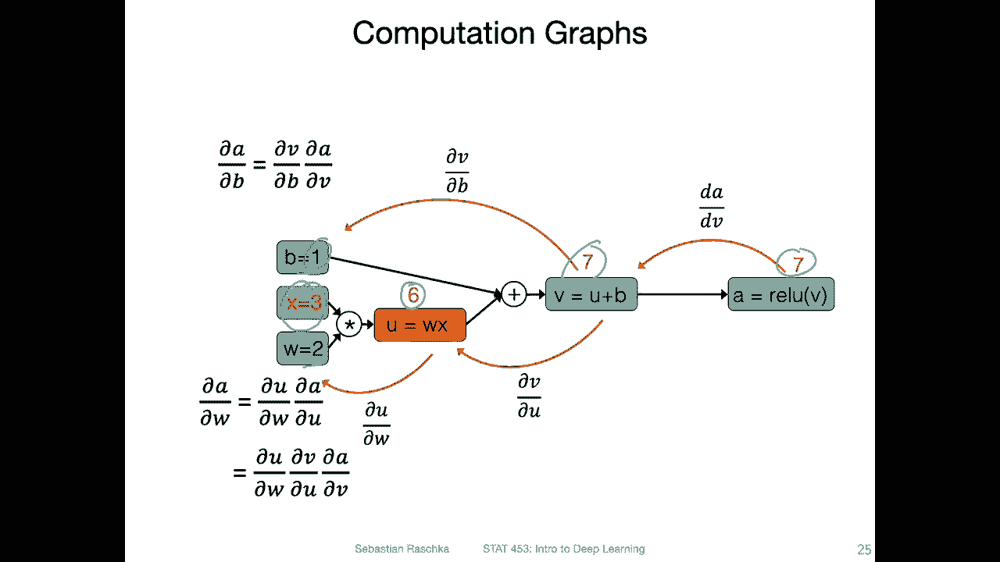
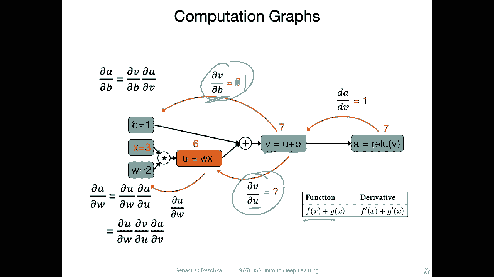
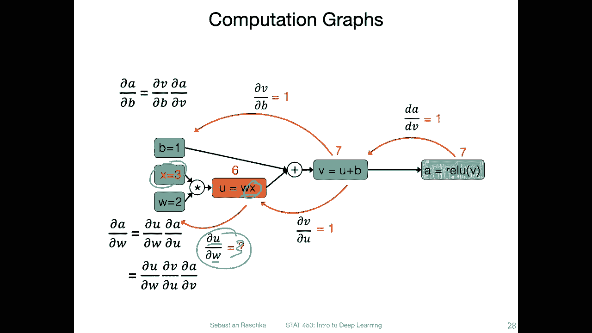
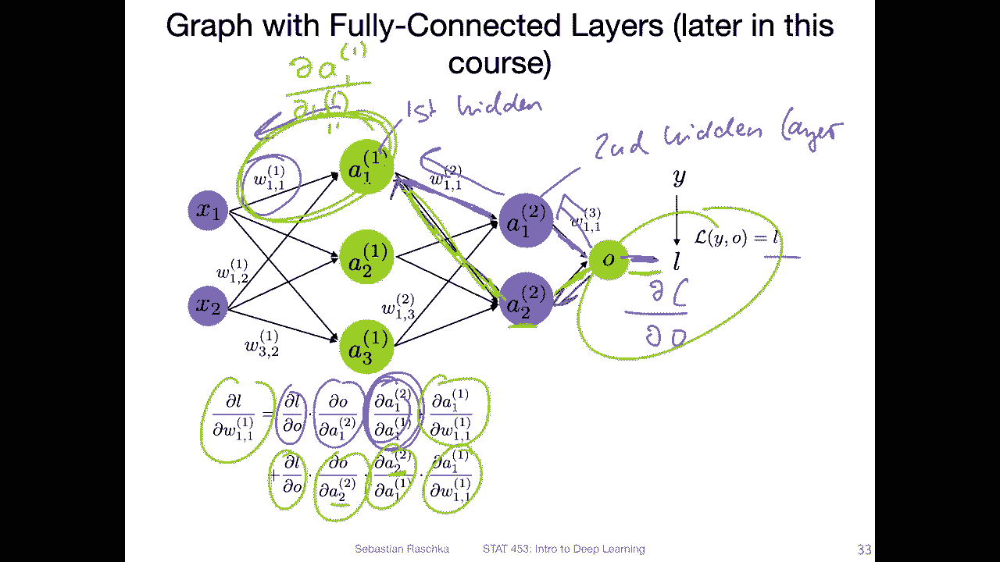
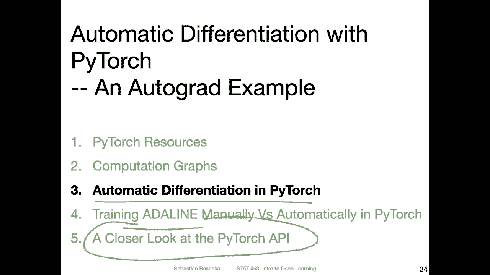

# P44：L6.2- 理解基于计算图的自动微分 - ShowMeAI - BV1ub4y127jj

Yeah， in order to understand automatic differentiation。

 I think it's helpful to take a look at computation graphs。

So computation graphs are a graph of a computation or calculation that we define or execute in Pythtor。

So in Pythgen， in particular， when we implement neural network models， there will be two methods。

 One is the forward。Method， and one is the。Backward method。 So in the forward method。

This one constructs。The graph， and then backward， essentially， computes。Gras by walking backward， so。

Forward graph is constructing a graph。 If we have a graph with multiple inputs， some computations。

 This is like the forward method。 and in the backward method， based on the output we。

Compute the derivatives of the output， or the loss。With respect to these inputs， for example。

 the weights that we want to update。 So in this lecture， I want to in this video。

 I want to briefly go over yeah， what such a computation graph is and how we work with it conceptually before we see how Pytorch handles that。

So yeah， in the context of deep learning and pythtorch。

 it is helpful to think about neural networks as computation graphs because neural networks are really just a chain of computations like nested computations。

Yes， so that we have a concrete example。 Let's take a look at a activation function that is not a linear activation function。

 So if you recall the Adeline model。What we had is or what we had was the computation。

That computed the net input， which was then passed on to a threshold function。 So the net input。

Let's consider one weight，1 feature was computed as follows。And then we had an Adeline。

This activation function， which was just an identity function。 So this one was just。

An identity function。And now we are taking a look at a function where the sigma is not an identity function。

 So we are now taking a look at to make it a little bit more interesting at this re function。

So in this case， now what we have is the sigma。Is the activation function is this。

Relu function that I have written down here。 So the relu function in the context of a neural network usually takes also the net input。

 so。This is our net input。 You can think of it as the net input。

And we will revisit the Relu function also in a later lecture and also talk about why it is so commonly used in deep learning。

 So for right now， just think of it as an activation function。It is almost like a linear function。

 but not quite。 So the shape of this function is as follows So on the。In the plot here。

 I'm showing you how it looks like for different inputs， so。Here we have then input to the function。

 for example， the net input Z。 And here we have the output on the y axis。

 and the re function is defined。Yes。Almost like the identity function。 So it returns Z。The input。

If z is greater than 0 and 0 otherwise。 So it really is。This region。An identity。Function。And here。

Not， it's not doing anything here on the left hand side。 So it's， it's clipped。

 You can think of it as a。A clipping here。So why is that useful in the context of deep learning。

 we will talk about this more， but it is essentially yet to have a nonlinearity in the multilay internet network because if we have multiple linear functions。

 regular linear functions， because the combination of linear functions is' also linear functions。

 so in a sense our network won't be able to approximate nonlinear functions。

But that would be going a little bit too far ahead。 We will talk about this more in detail here。

 We just care about the computation。 So also not for this re function。

This one would be not differentiable in a mathematical sense。 Yeah。

 just to briefly redaw the red function here for reference。 So how it looks like is that it is 0。

If the input is smaller than0 and。The identity function of the input is larger than 0。

 So here we have this little kink at 0。 And now for the left hand side， because there is no slope。

 right， we can immediately see。The derivative of this function is 0。 On the right hand side。

 it's an identity function。So， if the function is。This， then the derivative of this function。

Would be one， right？ So slope 1。So on the right hand side。

 we have a slope of one on the left hand side， we have a slope of 0。

 but here at this kink we have a problem now， if you recall from calculus classes。

 this would be a function that is not differentiable。

 So in this case we have a derivative of 0 if the input is smaller than0。

 a derivative of one if the input is larger than0。But otherwise， if the input is exactly 0。

 then the derivative does not exist。 So， yeah， what do we do now。

 So in computer science or in the computational context， we are not that picky。

 We just make a small adjustment。So we adjust the derivative as follows that it is0 if z is smaller or equal to 0。

 So that's just adding this smaller or equal to here to fix this issue。 And otherwise， sorry。

 this should be actually a one。It's one， if z is greater than 0。

 Notice that we could have also otherwise written it the other way round。

 We could also write it as smaller and。Sorry。Larger or equal。

 It doesn't really matter because it's so rare that we hit exactly 0 anyways that this will probably never happen in practice anyways。

 because， yeah， usually we work with floating point numbers。

 like lots of digits of the decimal point。 So it's very rare to hit a exact zero anyways。

 So even though it's not preventable。In a mathematical sense， we make in the computational sense。

 this little adjustment and define the derivatives as follows。 Okay， but yeah。

 let's move on to the computation graph。 just to summarize。

 Now we have the following activation function。 It just a summary。 It's a multivari function。

Where we have three inputs， we have。The features。 So here we only have one feature for simplicity。

So let actually it annotated here。 one feature， one training example for simplicity。

 We have the bias unit。And the weight parameter， also for simplicity。

 only one weight parameter corresponding to the one training examples feature。 So as you recall。

 we usually con calculate the net input。For example。

 in Adeline and then we would pass it to an activation function， in this case。

 we use this re function。So。Right now we don't even have to think about yeah neural networks if you don't want to here。

 you can just think of it as a simple computation that we want to represent using a computation graph。

 so how would we do that？

So here would be a computation graph of this function。

 So I use some intermediate variables to make this a little bit easier to read。

 So we define this computation as U and we define this computation as V。So we have three inputs。

 like I said， input1， the bias， input2， the feature， input 3， the weight。

 What we do is the first part is we compute u here right so this is multiplying x and w。

 So this is this multiplication here。 So we define as a placeholder here。 U is equal to W X。

And then what we do is we add the bias unit here， right， So we have U plus B。

So we have this operation here。Which gives us another variable V。And then V goes through this。Yeah。

 activation function。Also， I could have used Z because this is like really the net input but。

For some reason， I used to V here shouldn't really matter。

 just think of it as a computation here that we then represent as such a graph。So yeah。

 in the context of deep learning， we are usually interested in computing the partial derivative of the loss function with respect to the weights or the bias unit。

 as we've seen in the Adeline lecture last week and we can actually decompose that into smaller subs。

 right？Using the chain rule， we can also decompose it into the partial derivative of the loss with respect to the activation and times the derivative of the activation。

With respect to the weights， and so decomposing it。

So here we have a simpler computation graph I haven't included a loss function here。

 So what we are actually looking at here is only the activation。 So we are in this example。

 only walking through this part。 So the partial derivative of the activation with respect to the weights。

 which we can also further decompose into substep using the chain rule。So that's what I'm doing here。

 but that's what I'm going to show you in the next couple of slides， so here I have the first step。

 so computing the derivative of the activation with respect to the input of the activation。

So here this is the term the derivative of a with respect to B。

 that's the first step and using this computation graph we can really make this super easy like computing this whole part by doing it in smaller steps。

So the next step would be， for example， computing the derivative of V with respect to B。

 So because we are interested in both on usually also the bias。

 because the bias is also like the weight a model parameter， which we can。Then also， write us on。

Phos。So， this part here would be。So this whole part here。Would be。This one here。

 what we are looking at right now。 So the next step。Is computing。

Partial derivative of we with respect to。B。

Its sniffing in here。Yeah then we can do this also for the other parts so what's so nice about a computation graph is that we can do it step by step right so we can for each computation do a back track here and annotate our graph。

嗯。And then we can put everything together。 So if we're interested in the derivative of a of the output with respect to the input。

 we just need to use the chain rule， right， so we can then write this as。Be。😔，B on times。嗯。第一。

A times the。We。So this is a thing mathematicians usually don't like。

 but we can actually cancel these。 So this is why we get this one using the chain rule。

And we can also do this here at the bottom， right， so we can do this。For this part。

 So the derivative of a with respect to。W would be。Putting all these together。嗯，DA。

Maybe and you can technically see how things。Cancel right。 So this is how we get this one。

But technically， this is not a right way to do。 I mean， we shouldn't cancel things here， but。I use。

 use it all the time as a memory， I would say memory bridgeier or something。

Alright， so yeah this is what I've done here if you want to step through that in the slides。

 so I was just putting things together here。

Yeah， let's now take a look at a concrete example with some actual numbers。

 So assume the bias unit is one。 The weights are 2， and we have an input of。th3e。

So the intermediate value U would be then 6， right。Because two times 3 is 6， and then 6 plus 1 is 7。

 And for the radio function， because it's positive， it's an identity function。 So it's also 7。

Now， let's differentiate。 So the derivative of the real function if。

The input is greater than 0 is  one， right， because it's an identity function。

 So that the root of this part here would be one。

Then yeah， let's compute a derivative here and here。 So if we look at V。 So V。

 you can think of it as a sum of two functions here。

 So the derivatives can be then computed separately。 So if we look at， let's say the upper part here。

 and let's take a look at this one。 the derivative of V with respect to B。 So in this case。

 U is a constant。 So we can ignore that and the derivative of B would be one。 So there should be。

One and similarly， the other way around。At the bottom here， B becomes a constant。

 and the derivative of v with respect to U is then also one， right， So we can also put a one here。

Alright moving on so we have a derivative here， so what do we have here， so this is yeah just wx。

 if we compute the derivative of U with respect to W。

 then the derivative would be x and x is what is x x is3 so here we should have a three。

And yeah， then putting everything together here。The partial derivative of the activation with respect to W would be3 times 1 times 1。

 it's equal to3 because yeah we are combining with a chain rule。This here。 and similarly。

 we can combine。 yeah， the results for。For this part here， too。So in this way， the。

 the result here would be also yeah one because it's one times one。Alright。

 so this is how we use computation graphs。 and I will show you in the next video how we can implement this in Pytorch where it computes these derivatives for us。

 Of course， this example is a trivial one。 It's very simple right it's something you can do in a few seconds by hand。

 But if you rethink of computational graphs as new networks that are more complicated with many layers and yeah lots of input features and stuff it would be tedious to code it all up in Pytorch by yourself or in nuy。

 So that is why there's this automatic differentiation that I will show you。

Where Pytoch will construct this graph here under the hood， like we can actually print out the graph。

 but we don't have to。 It will do it automatically for us。

Yeah， just some more computation graphs that will be relevant or that are kind of related to deploying just to complete this video here。

So here here we have an example of a graph with a single path。😔。

So you can maybe also think of it as a as a simple aline or logistic regression model。

 which we will be covering next lecture， or you can think of it as a a line as maybe simpler when you think of the sigma here as an identity function。

So this would be the full graph based on what I've shown you earlier。 So in the previous slide。

 I showed you only。This part here now also think of the output where we compute the loss。For example。

 in Adeline the mean squared error between the prediction O， the output and the actual class label。

So if we have a case like that。Then we compute the derivative root of the loss with respect to the weights。

 and this can be decomposed into the loss with respect to the output。

 So this would be this part here。 then the output with respect to the activation。

 So this would be this part and then the activation with respect to the weights。

 this would be this part。 And this is what we had in the last。Slightdes as an example。

 So this would be a simple case， a graph with a single path。

So in practice， there will be oscillator， some more yeah complicated constructs。 for example。

 imagine a graph with weight sharing。 It is kind of related to what's going on in convolutional networks that will be something that will be covered later。

 Here's a simple example。Imagine we have a case。 We have a single input。

 and then we have a weight parameter that is shared。

 So that's the same weight It goes here to compute some activation。

 So these could be different functions。 A1 and a2 could be different functions。

And then we compute some output。And then also here the loss like on the previous slide。

 So if we have a case like that， we have to use the multi variable chain rule because yeah。

 there are no two paths like there's some， some weight sharing going on。

 So if we want to update the W， it depends really。On this path here and this path， right？

 So we have to combine them。 So we have the multivariable chain。 We compute the loss。 So here。

 the the red of this is the same。 You can use blue here。 So you can see this is。The same here。

And then， we have。2 different derivatives。 So we have。This one here。And。😔，So here at the bottom。

 we would have， oh， for some reason I haven't written it down。😔，this would be this one here。

And then which color didn't I Okay， let's use this one and then just derivative here and then I'm running out of colour。

 I me use black and this one here and then putting it together with a multivariable chain rule。😔。

All， so that would be a case where we have weight sharing。

So here would be an example of a multi layerer perceptron， which we will be covering next week。

 So here we also have multiple paths if we want to update certain weights。

 So this is a multi layerer perceptron with two hidden layers。

 You can see there now two levels of activations。 One level is here。And one of is here， so。

This is the first。Hidden layer。 And this is the second。Hidden。Thereir。And again。

 this part is like the same as in the previous slide， the loss。

Let's say we are interested here in computing the derivative of the loss with respect to this weight here in W1。

1 in the first hidden layer。 So in order to do that， we compute the loss。 So the sorry， the yeah。

 compute the loss。 but then also the derivative of the loss with respect to the output that would be。

This part here。And then we go here， this would be this part。And then we go here。😔。

Which would be this part。So we are skipping across some parts later。 and next week。

 we will do this step by step in more detail。And then so I'm skipping here a lot of steps。

 so because this could also be decomposed as sub stepss with the net input and so forth。

 but let's not do it here。And then。We have this part。

 which is the derivative root of this activation， the a1 with respect to this weight。

 Let me use the green color here。So， this is。Here， so we are computing。With respect to。问题。Alright。

 however， note that there's a second path， right， so we can also， let's use red here。

 Let's go the second path。 So it's again， the same length one as like this one。 But we have now。Also。

 the second path。Oh， sorry， said was wrong。The second path would be this one。And this one， see。

 it's actually not so easy to see what is going into here so。

This would be the second path if I use a different color。 Let's say pink for the forward here。

 So you can see this one， this one and this one is one path。 and the other one is this one。

And this one， and this one。 So they both go in there。 So the second path would be。

Then the same as before and the end here。 But then this one is a little bit different because it's now the second unit here。

And then this one is also the second unit。 This is this connection here。

And then we compute this part here， which this is the same。So in that case。

 you can see actually things can become quite complicated if we have a multi layer network And now imagine coding this by hand。

 like computing the derivatives， implementing them in code。 It's very  error prone。

 It's important to。On the big picture， you understand what's going on。

 But we are implementing this in by hand。 And this is only for one way， it would be very error prone。

 which is why we actually use deep learning frameworks that can do this automatically for us。

 So in the deep learning framework， we only have to provide the forward computation。

And then the backward computation is yet derived automatically because you can， yeah。

 you can implement simple rules to do that automatically。

 you just have to be careful implementing these rules once and then you can always apply them to any arbitrary computations。

Okay， so in the next video I will show you how we can do this automatic differentiation in Pytorch and then in the next videos I will also do this in a more yeah comprehensive example using the Aline that we talked about last week and then we will also take a closer look at the Pytorch API the convenience functions al right。

