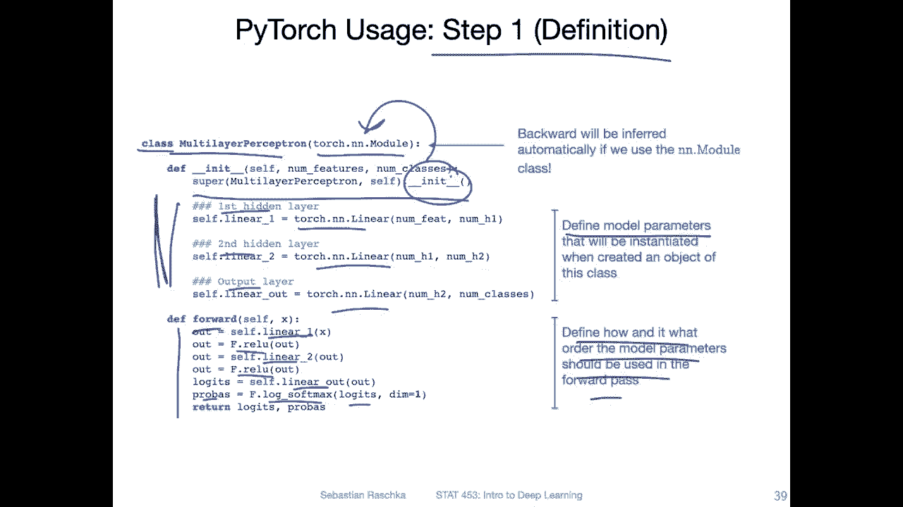

# P47：L6.5- 深入了解 PyTorch API - ShowMeAI - BV1ub4y127jj

Yeah， so in this last video photo today， I want to go over the Pitorch API in particular。

 discussing the subtle difference between the object oriented and functional APIs because it will become useful in the future lessons。

So here is an overview of a multi layer perceptron。

So we haven't really talked about in detail how it works。

 I only showed you some yeah graphs of how it looks like。So here for this purpose。

 it's really just sufficient to think of it as a multi layerer neural network。

Because we the same concept really applies for all types of networks when we work with Python or almost all types of networks。

 So that's like this general template that you can think of where we have。

Or where we use usually a class to yeah define the model。 And then for this class。

 we inherit from this torch dot an n dot module。 So this gives us some certain convenience functions automatically。

 So this is usually how we set up a network in Pytorrch。And then there's this constructor。

 the init constructor， that is something we can define ourselves。

 So there's one line that we use here。 This is really just for inheritance。

 So it inherits the init method from a module， but then everything else here has something we can define ourselves。

So here I'm setting up a neural network with。1，2 hidden layers， and one output layer。

And each layer is a torch and n dot linear， a fully connected layer here。

And these are really in the in method， only the parts that need to be updated like the model parameters。

 So how the network runs like the forward pass， that is what we define in a forward method。

So here the input to the forward method is just a data input that will be provided during training。

And then we define really how the computation works。 In this case。

 this is a network where we first compute the net input。 then we used the relu function。

 We discussed the relu function earlier in this lecture。Then we have another。Fully connected layer。

 net input， then another re。 and then the output。 and then we compute also our probabilities for the output。

 We could technically skip this step and only return the loits。

 Let's read just a matter of preference。 And we will also discuss what softmax is and what the logicits are later in the upcoming weeks。

So here I really want to emphasize。That in the in method， we define model parameterss。

And then in the forward method， we define how and in what order the model parameters are used。

So that is just like the general outline here。 And this is also similar what to what we have done in the previous video when we talked about the add line in the last step in the automatic step。

So here consider step one as the setup or module。Definition step。

Gci here， we are not really running any coded。 we are just setting up our Python class。So then step2。

 we actually instantiate or create our model。 So here I'm just setting my random seat。Becauseuse。

If I go back one slide here， these like I mentioned in the code examples。

 these will be based on small random weights。 Personal， I like to have my code reproducible。

 So I usually set a random seat。

Before I initialize the model。 So every time then you run the same code。

 it will use the same random seats if I use the same value for random seat。 However。

 in new network training， of course， it requires sometimes to change the random seat because sometimes you can have bad starting weights。

 I will talk us about that more later。 So I'm not always using the same random seat。

 But if I want to reproduce these experiments I write down the seats I use。

 and then if I have someone else execute the code， they can use the same seat。Anyway。

 so here we initialize the perceptionceptron model。 and then this is an optional step to device。

 This is really very， very cool if you want to run your code on the GPU。

 So the only line of code you really need to change。 I mean， there will be some other lines。

 but the main line you have to change is this one。 If you provide GPU setting here。

 it will run all the code on GPU。 So it will transfer all that code to the GPU and run automatically on the GPU。

 which is really convenient。

And then another thing we set up is the optimizer here。 So here。

 like I also explained in the previous video， it gets the model parameterss。 In this case。

 if I go back one slide， sorry， we have a lot of model parameterss here。

 All these linear ones contain weights and biases。 So here we tell the optimizer what are the model parameterss。

 What needs to be updated during gradient descent。 So this is stochastic。

Griianient。Descent that we discussed also last week。 So it's a stochastic rain descent optimizer。

 Later， we will see there are other types of optimizers like different flavors of stochastic ra descent。

Alright， so yeah， this is what I described before。 so we can provide if we have a co device， a GPU。

 we can specify it here。 and then the code or the model will be executed on the GPU。

 which can make training much more faster。 And then Thursday。

 I will show you some some free platforms where you can use the GPU for free。

Alright， so step3 is then the training step。 So that is also the same concept as I explained in the Adeline code in the previous video。

 So much of it， what I'm showing you here on this slide is really very similar to what I've shown you in the previous video。

 I'm just walking through this a little bit more slowly。So， here。I have my loop over the epochx。

 I'll notice that we set model dot train。 This is a good practice because later。

 there will be certain functions。Where we have a different behavior during training and evaluation。

 for example， there is a concept called batch norm or dropout。

 and it's a good habit in each epoch to set it to dot train。

 And then when we do some logging or evaluation to set it dot to dotev。 it's just a good habit。

 So that is something it's always good to do。 So I will also make sure my code example that I provide to you that this is indeed specified。

And also notice， you don't really have to memorize this because in practice。

 when you write a new neural network or implement a neural neural network。

 you would never start from scratch。 You would never like start with a blank。

 empty script and write down all these codes。 What you would do is you would copy and paste The code here。

You would copy and paste it as existing code， and then yeah， you would just optimize or modify it。

 so you would never really yeah start from scratch totally。So in that way。

 you don't really need to memorize， you just have to know where to find this information if you want to。

 yeah， if you want to write some on code you use， usually a template to start with。Where was I。 Okay。

 so here we iterate over the epochs here。 we iterate over。The batches。

 there will also be a training laer that I will show to you where we batch up our training set in a Pywach data set。

A context that makes also the iteration over the mini batchs a little more convenient。Here。

 this is like a requirement because I created this example for MNT。And M are images 28 by 28。

And my model here is a fully connected network。 It needs this long tabular data set。

 this long vector。 So I'm just reshaping it。 But this is a detail。

 Don't worry about it here at this point。 There's one more thing。 If my model sits on the GP Also。

 my data has to sit on the GP。 So that is something that is like required， we can't do a computation。

 let's say a multiplication or matrix multiplication between a matrix sitting on the GP and the CPU。

 They have to be either both。On the CPU or both on the GPU。 So personally， how this can be very。

 very easily handled is by specifying somewhere in your code， something like。

Oops。Something like device equals to either CPU or GPU。

 So usually there's something you want to you want to use like Torch not。Device， sorry。

Toch to device。And then you would either set it to CPU。哦。Let's say the ka device。

 usually if you have one GPU， you would set it to0。

 if you want to use a second GPU that you have in a computer， you can change into one。

 So this is like really an index here。But I will also talk more about this in the next lecture。

So if you set this somewhere in your code， then this variable will be used here。

And here， so you don't have to change in anything so it will just work whatever you have either CPU or GPU。

So then moving on， this is the forward pass。 So this is the forward path of your model。 Notice that。

We don't actually call forward。 We don't do。Model dot。Forward。Features。We just call model features。

 It's almost the same thing。 I actually have a note here to remind you of that。

 It's actually the same thing。But there's one extra step if we don't do forward。 So internally。

 Python， how classes work in Python， there's some， yeah， something called a call and this one。

We'll actually do some extra stuff and then inside， run forward， so。If you do it like this。

 there will be another method dot call， basic dot underscore underscore call。

 And this one will do some checking， just making sure everything looks okay。

 and then run dot model or model dot forward。 So in this way， this is usually。Yeah。

 how we do the forward pass looks a little bit weird。

 but is this not like how the forward pass works。And then， computer loss。

Set the gradients to 0 from the previous epoch。 That's something I explained in the code in the last video。

Then we do the backward pass to compute gradients。And then we update the model parameters。

 So that's that's the major part in the training loop。 And like I said。

 you can always copy and paste this code and just adjust it to your new network。

 You never really have to memorize it personally， I also， I mean。

 I've done or looked at this so many times I could probably write this down。But why memorizing this。

 if I can just use existing code and just menu manually adjust it。

 what's really only important that you understand this， you have to understand what's going on。

 but accept that you don't have to memorize code。I don't mean， like I said， no one doest it。

All right。Yeah， there's just some more written stuff of what I explained。

 So you can also on the slides read through this more slowly。 It's just some annotation。

 So if you want to take a look at it at home in a quiet moment， you have also my annotation here。

Sometimes easier to listen。 Sometimes it's easier to read than to listen。

 I think in a way I unnotated everything。All right。

And this is also something I will explain when we talk about logistic regression and multi layer percepts why we use los。

Alright， so the main point here， the remaining point and does the video。

Is that there are two types of API in Pyth。 There is the object oriented API and the functional API。

And we can actually use both or a mix of both。So with functional。

 I mean functional programming like the concept of functional programming versus object oriented programming。

 So functional usually means that we have something without an internal state。

 So therch end torch that an functional API is an API without an internal state。

So what that means is if you take a look at the left hand side here。

 this is the perceptioncept that I showed you earlier in this video。

 So where we define the parameters and。In the constructor in the in constructor。

 And then we call these things。Notice that for certain parts where we have this F。

 So I'm importing torch dot nn dot functional as F just for brevity。So in certain parts。

 I have this F here。So this is all using the functional API。So I could have done it differently。

 I could have。Defined Reul as a class。So here I could define it as a class。 however。

 this would be a little bit overkill because if you think about it， what re is。

 a re is just function。Max。Let's say x0。 It just returns。Whatever value is higher， right？

 So it's like this piece of vice function。 It doesn't have any weight itself or any bias unit or weight parameter or something like that。

 It's just a function。 So by that it's kind of overkiled to implement it as a class because classes usually create objects。

 and then this object。I mean， it doesn't have any parameters。 So it's kind of overkill。

 We can just use a regular python function for that。

So this is like the difference between using an object oriented and a functional API and where does it matter。

 So like I showed you before on the left hand side is again the implementation I showed you where I created these weights here。

 the layers， the weight layers， and then I'm using them in the forward pass。

However， there is something that is more convenient， It's the so called sequential。Class here。

 So the sequential class executes things。In order。 So you can see here my forward method on the right hand side is much shorter than on the left hand side。

So what's going on here。 So here on the right hand side， I'm using sequential。

' it's essentially like a Python list and everything that is inside essential gets executed yeah linearly。

So one by one。 So first， it will execute linear， relu， linear， relu， linear。But it won't。

 So how can I say that it will define it first， So it will define it in the sequential thing。

 And then we can use it and forward。So I really like this because it's very compact。

 but it's using this object oriented API here。But it's still compact， because。

Here we define the parameters， and then we have to memorize them in what order we use them。

 And then here we call them see that as。Here I have linear 1， linear 2。

 which I have here in the same order。 And if you have a deep neural networks with I don't know。

20 layers or something， it's easy to make aarrow and copy and paste some values and。Accidentally。

 copy and paste them out of order and make mistakes with a sequential one。Here， you define the order。

When you create a thing， and then let's say I'm assigning it to my network。

 And then here I'm calling it my network。 but I don't have to yeah redo all the forward pass。

 It's automatically in the sequential thing。 So I like this actually back in the day when I learned Pyto the first time。

Four years ago， I was using mostly this API because I felt like， okay， this is。

Better because I'm avoiding object or API for things that don't have attributes。

 But then over the years， I kind of。Learn to prefer。This API。

 because here it's harder to make mistakes。 It's easier to define everything in the right order here。

 I find。But sometimes， of course， we also， yeah， we need to be flexible。

 Sometimes it makes more sense to use the API on the left hand side。 for example。

 if we have custom research projects where we want to tinker a little bit more with a code。

 because there's one downside。

Of the sequential API。 So the sequential here， the sequential class。

 the problem is if you want to get intermediate results。 So with that， I mean。

 if you want to know what， let's say the size of this one or there's a buck or something。

 and you want to print the output of this one。 So if I go back one more slide here。

Anywhere here， when it means a different color。Anyway here， I can just insert a。Print。😔，Out。

 for example， to print the output value of this one， if I am curious at it， if I want to look at it。

 it's very easy to just insert a print statement on the right hand side。

 you can't just insert a print statement here， it won't work。

For that， we have to， yeah， create so called hooks。 So we have to compute， for example。

 a forward hook or register forward hook。 So that means really， we are hooking into this API。

 So you have to kind of first take a look at。The order， so the indices so here。

After implementing this。Sequential thing。 this should actually be not net， but my。Network。

So if I print out。My network， you can see there are these indices 0，1，2，3，4。

 It's essentially like a Python dictionary almost。 And then I can access this。 So if I want to have。

Or if I want to see the output after this linear unit here， I can。Access it here。

 Register this forward hook。It's a little bit weird。 But then when I call the model。

 it will print the output here。 So it will print out the result。That comes often here。

 It's instead of inserting。

Inserting this print statement here， I have to register the hook and you can see this is actually more work to register this hook。

 So sometimes it can be a little bit more cumbersome to use the sequential API in some ways it might be easier to do it like this where we can just play around with it more。

 however， like I said if you have a very large network with like 28 layers。

 it's also more easy to make a mistake here to yeah somehow have some repetition here or。

Things like that。 And if you have only。This one where you define it in order and it gets executed in the same order。

 you define it。 It's hard to make mistakes。 So you have to decide for yourself what API you prefer。

 I mean， it's really up to you。 there's no right or wrong both work the same way。

 It's just a matter of yeah I would say matter of taste and I will probably switch more to the sequentially API for the code examples I provide to you but you can also yeah for your class project use whatever you like。

But also， yeah， if the multi layer perceptron stuff is a little bit too complicated。

 we will talk about multilay perceptance in next week's lecture。

 So that will be also something we'll be revisiting。

 So you don't have to memorize any of that stuff right now。

 You will see that multiple times later in this class again。

One last thing about Pytorch and style and things like that。

 So I found a very cool Github repository recently a couple of months ago where someone wrote down like the best practices for Pyttorch。

 And I thought that might be also something cool to look at。

 There was also interesting section about Jupiter notebooks versus Python script。

 And that's exactly what I was， yeah also recommending。 So the person here recommends also。😊。

To start with a Jupyter notebook， to do some exploration and stuff like that。 maybe do some coding。

 basic coding。 And then later on move everything to Python scripts and deploy it on a server' like。

Yeah， because there are some advantages of using Jupyter notebooks。

 but there are also some advantages of using Python scripts personally for teaching。

 I really like Jupyter notebooks because like you've seen before。

 I can insert figures and show intermediate results and things like that， which is really cool。

But it's a little bit more inconvenient to run Jupyter notebooks on a server， so。Here， also。

 like the person mentioned， the files can become huge if we have one single Jupyter notebook and because especially if you print the output in the notebook。

 they will become very long。And。Yeah， sometimes， I don't know。

 sometimes computation get interrupted in Jupytern notebooks for some reason。 So in that way。

 it's also not ideal for long training。 And yeah， it's it's easy to make mistakes in Jupitern notebook because I find the debuggs are not that good。

 I mean， they list here debugging as a pro as a pro argument personally。

 I find debugging and Python scripts honestly easier because you have more help of functions or utilities and for example。

 P charm or visual studio code。 I most of the time use a visual studio code。

 but also many people use P charm， which is also very nice。 So Python scripts have the advantage of。

That they are more robust when you want to run longer computations。

 and it's also easier to track changes if you use Gitthub and want to look at changes。

 although there are some plugins for Jupyter notebooks， but to be honest。

 it's still simpler with Python scripts。I find debugging easier with Python scripts。

 however I also like they say it means rerunning the whole script。

 what an advantage of Jupyter is that you can run one computation or one cell at a time。

Ratherither or， I mean， there are pros and cons on both sides as a deep learning practitioner。

 I think you probably want to use a mix of both， maybe for simple things and analyses using Jupyter analog notebooks and then later on if you have more sophisticated projects using Python scripts in this class I will also use a mix of both I think for teaching Jupipyter notebook is really nice。

 but for the some codes that I will provide later I think Python scripts make more sense。

Alright， last thing also from this Gitth repository。

 So here also some yeah recommendations regarding the naming conventions。 So usually we use lower。

C conventions with these underscore scores for package modules， constant。

 as not Con for instances of objects。Methods and functions and variables。 And for constants。

 we use capitals with anosqua is just a common convention。 That is also what I'm gonna use for。

The code in this class。 It's like a common convention。 Okay， but yeah， you can read through this。

 read me sometime Also later during this course， it's not like super important。

 But if you read through this rather earlier than later， then， yeah， you don't learn。

 let's say bad habits that you have to unlearn later。 So it doesn't hurt to read this。

嗯。Yeah and more Pytage features will also be introduced step by step later in this course when we start working with more complex networks。

Because， yeah， I don't want to bombard you with too many things right now because you haven't really seen the more complex networks like convolutional networks。

 So there will be many things we will introduce one by one when we need them。

 So this was more like the big picture。 I hope that made sense to you and if not。

 we will see this multiple times again in class。 So we will be using this general Pytch layout for almost everything。

Alright， so with that， yeah， that was the week here or the first part of the week talking about Pyarch。

 it was a little bit long。 I think the Thursday lecture would be a little bit shorter。

 I just want to show you how to use some free computer on GPU resources。

And that is because it will probably be shorter， also a good time than to catch up with yeah。

 other things in class。Allright， so see you on Thursday then。

