# P48：L7.0- GPU 资源和 Google Colab - ShowMeAI - BV1ub4y127jj

Yeah， hi everyone。 So in this video I want to show you some computational resources that you might find helpful for your later homeworks。

 but also for your class project where you can use a GPU for free to accelerate yeah the training of certain new networks。

 So with that let me minimize this screen and then show you hands on how we were to do that。

Yeah have to start with， I found this very nice S up repository called Deep learning in the cloud。

 I will share the link with you。 And here the contributors and maintainers put together a really nice list of all the different tools that are available for training deep neural networks in the cloud。

 So most of them also， yeah supported GPus because it's the whole point。

 So it's like for clouded GPUus。😊，And yeah， not all of them are free。Not here the most popular ones。

 as far as I know most people when they use free clouded GPUus。

 they use either Google Collaboratory or Kegel kernelnels。 Both of them are free。

 There are some limits， though， in terms of the runtime。 I think you can only use one GPU。

 and it resets after 12 hours， but it's so nice to have an option here to use free services。

 especially as a student。We have the CHTC on campus which is a high performing computer cluster。

 however this would require I think more like more experience from your side like it would be more something for later research projects if you don't have experience with Linux yet it might be a very steep learning curve in addition to everything we use in the class。

Here in our yeah lecture class。 So in that way， I think to get going， if you're new to everything。

 these are definitely more beginner friendly。Alright， so he has a lot of options。

 Some of them have a fixed number of three hours， or they give you a start credit， for example。

3$300 of credit for these types of things。And at the bottom I also wanted to mention there is。

 I think yeah， there is more stuff。 So also especially for students。

 there are some extra special offers which are also super nice。

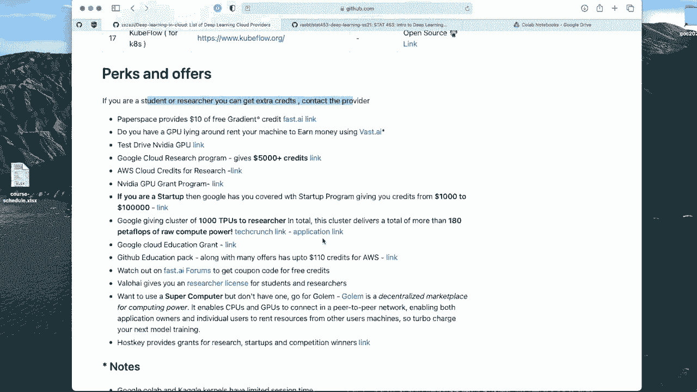

So for simplicity， I will walk you through。Google Colll， how we can use Google Co for project。

So let me click on this。And then it should yeah open up a new notebook here。

 So notice that this is a notebook environment。 It's， yeah， it's a blessing and occurs。

 Note environments are easy to use。 and what's nice is you can also see the results in there。

 but as code becomes more complicated。 Sometimes a cloud environment would be also nice where you have Python scripts。

 But yeah， you can explore the list and see what's best suited for you ultimately it's really up to you what you want to use for your class projects。

 So there's no requirement using one environment over the other。 It's really up to you。

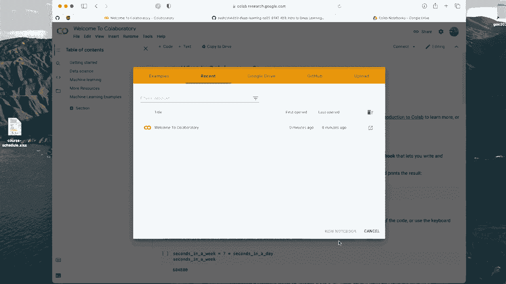

Because this is relatively beginner， friendlyy， let me cover this one here。

 So one important thing if you want to use this yeah is to actually select a GPU to make it available for that you have to go to runtime。

And then change runtime type and then choose GPU。 You can also use T PUus。

 but I recommend for this class to use GP。

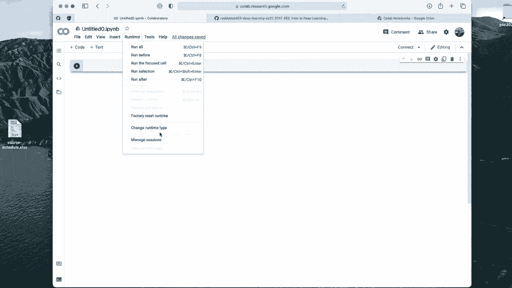

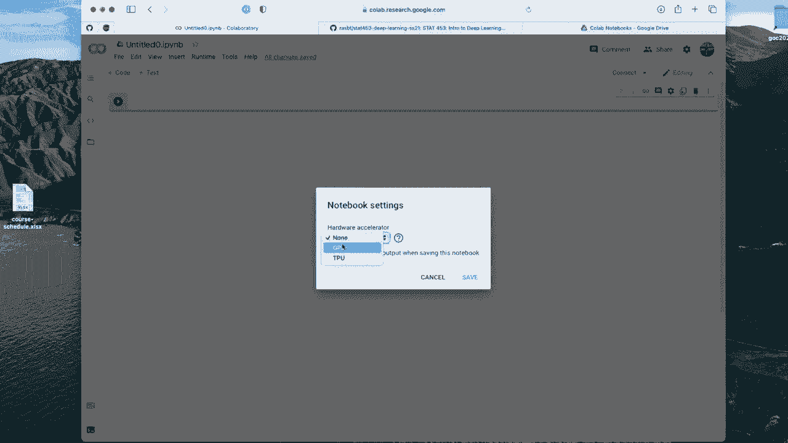

Alright， so and then we can check if Pythr is available。So， let me type。Torch。And then torch dots。

Version， just to see。I't know why it's so slow。 It's loading 1。7， which is a recent one。

 which is nice。 And also， I think this is like a Google specific thing because usually that is something that doesn't show up when you import torch on your normal computer。

 I think this just means that it has coa 10。1 support。Also。

 just to make sure that it indeed recognizes that GPU。sorryrry， good on。没了不？

Just to make sure it show's true， for example。We just try this If the GPU is not available。

 It should return。 or did I save this， It should return。Falults。Yep， so if you see faults。

 make sure you have。GPU checked here。All right。Now。What we can do is we can open notebooks so we can。

 for example， add a new notebook。

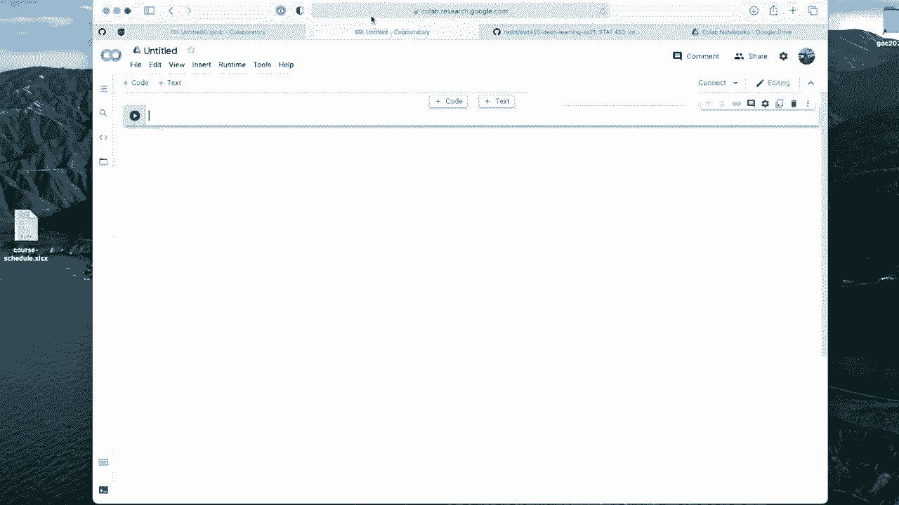

So it's a new window here okay， that might be also that's what I wanted to know open a notebook so you can actually open notebooks directly from GitHub。

 so for example， you could technically go to our class repository here and then let's choose what we cover last on Tuesday so。

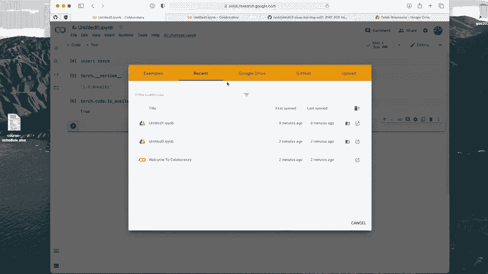

A a line with autograd and Pythrchs using that one。

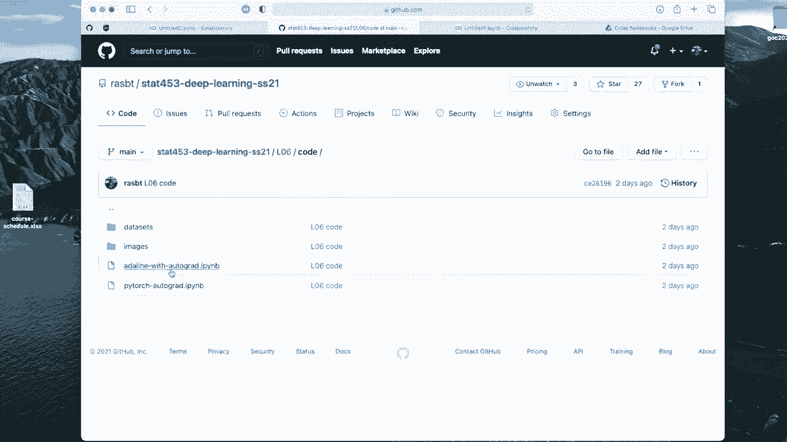

So I'm opening that here and， oh I'm copying it。 And then I can directly have the link here。

 So which is very nice。 So I can。You needs to search it first。 Yeah， I can directly open it。Okay。

 I think。Can click on it。Stay on page， this was not the right one。Yeah， let me try this again。

Think I need to click this one。

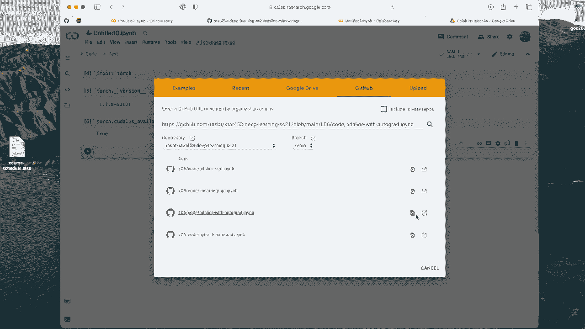

Open notebook and new tab。 Okay， sounds good。 So yeah。

 here we have now our yeah code so I can choose the runtime。The GPU。And then we can actually run it。

 right。 So up， let's do it。

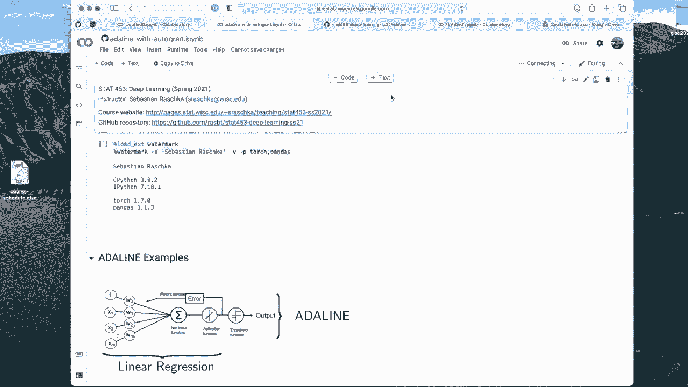

Watmark， this didn't work。 Oh， okay， so this is a warning message because it's a notebook note from Google。

 just like a warning Let's say run anyway。

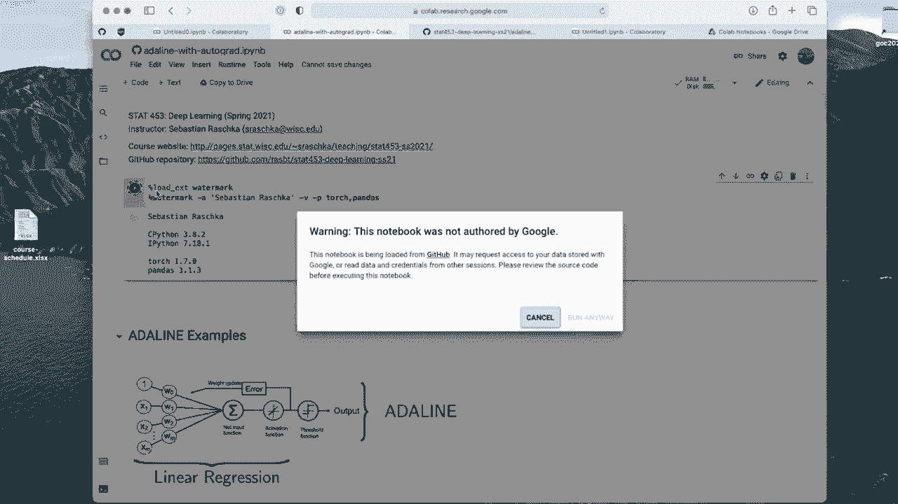

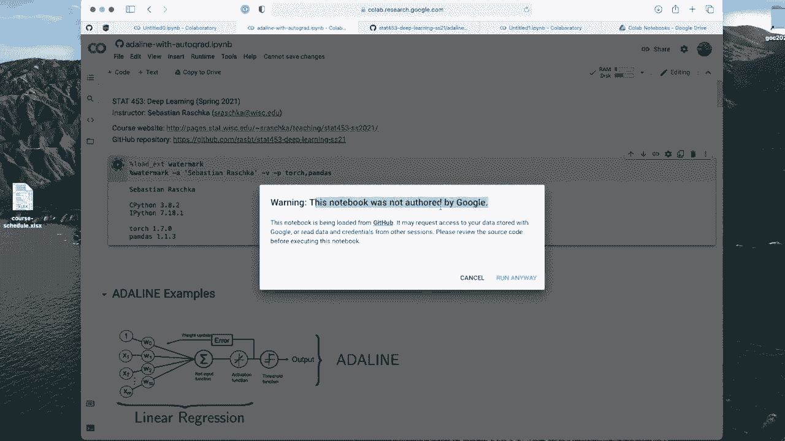

Okay， so we get an error。 What is the error。 Module watermark has not been found。

 So this is because Google Col comes with some packages pre installed， but， of course。

 it doesn't have every possibleyon Python package pre installed。

 So some packages we have to install ourselves。 It's actually not too complicated。 We can just。

Use this exclamation mark， which is a yeah terminal command for executing a bash terminal command。

 so we can run， for example， Pip install。 So Pip install。Momark， and then it should。Install it。Yep。

 so it's loading it and then successfully installed。 and then this should work。Right， this works。

 So this is just a general way of how you can install packages。

 then if you have packages that are not already installed in Google Colll。Okay， moving on。

Loing torch or pay torch， now loading our data set。Oops， another problem。 So yeah。

 the thing is we loaded the notebook， but we didn't not load the data， right。

 So if I go back here to the repository， there's this data sets subholderer with a iris data set。

 which this notebook doesn't know about Because the link is this one here。 So how。

 how can it know where to load the data from。 I mean， one way would be for CV files to just。Copy。

The link。Here， this should work。I guess。ItLoing because pandas can load directly from CV file。

 So this worked。So I can just show you that。Train should be loaded。But usually in practice。

 consider a case where you have a data set that is not on Github that is maybe on your computer。

 and it's also not a C V。 So you want to have a more general solution。

 So how can you do that for that， you have to mount your。Google Drive folder。

 So this is a little bit complicated。 I will， or I have already actually put together some slides that I will share with you after recording this video。

 so。Assume we have this data set locally。 Let's download this here。

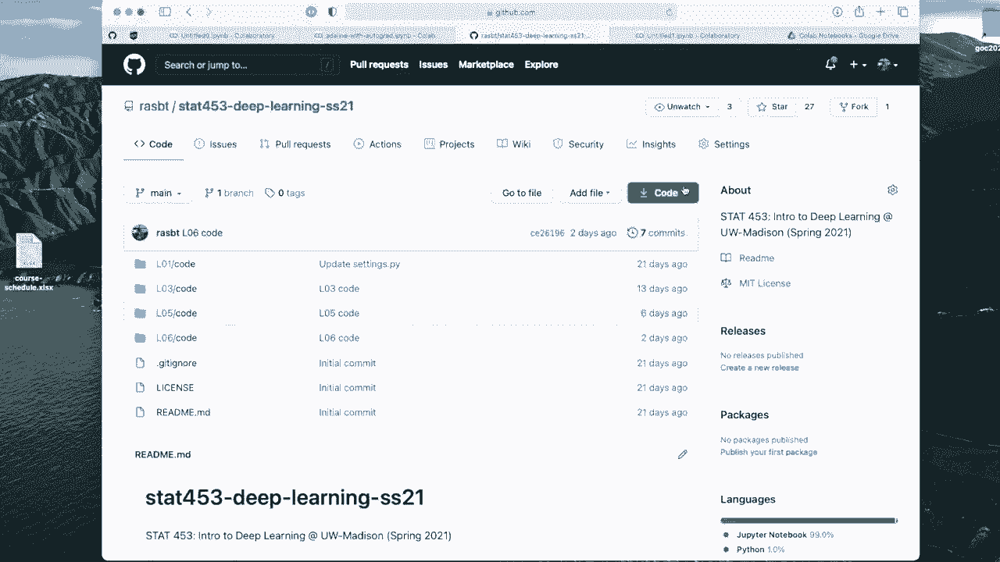

So I'm downloading it right now， so then I'm opening it here。And then let me go to my Google Drive。

 So I have a Google Drive folder here， my drive。 and then I have。Subholderer call notebooks。

 This should be originally or automatically generated。 actually， let me save this notebook。

So it says cannot sha same changes。 And this is because。Yeah。

 we we don't have permission for saving it yet。 So we have to make a copy。

 So it means basically doesn't。It's loadedud directly from Github。

 It doesn't allow us to override the Github repository， which makes sense。

 So let's make a copy of this in our Google Drive。嗯。It's completed。 Okay， new tap。

So this is our copy of Adeline。 If I load this directory now， or if I refresh this Google collapsese。

 you will see here。 This is now in my call notebooks folder。 So you can also directly。Go here。

If you have code on your computer and just drag and drop it here。

And then you can go right click open with Google Collaboratory。 that is also a way to do that。Now。

 assume I have my data set。That I want to connect with my notebook。So I。

 let's say I have a data set here on my hard drive or whole data folder。 I can just。

Take that and also drag and drop that here。So it's now data， data sets。 So it's the same structure。

As shown here。So it's next to my notebook。So let's see if we can load it now。Too many sessions， Okay。

 let me close this one。This one。Okay there are still too many sessions。Okay。

 let me terminate this one into this one。And maybe also this one。Right。Let's try again。Now it works。

Okay。So technically， we might think， okay， we can load the data now because it is relative to our notebooking in this dataset sub folder。

 So it's located here， right， however， in practice theres still a file not found error and this is because yeah。

 that's like a little quirk。 we have to mount our Google drive to or into this notebook。

So how we do that， if I recall， it's from Google dot call up。Implo。Mount， and then。sorry。Right。

I think it's sorry from Google imported drive and then drive。Mo。And then。

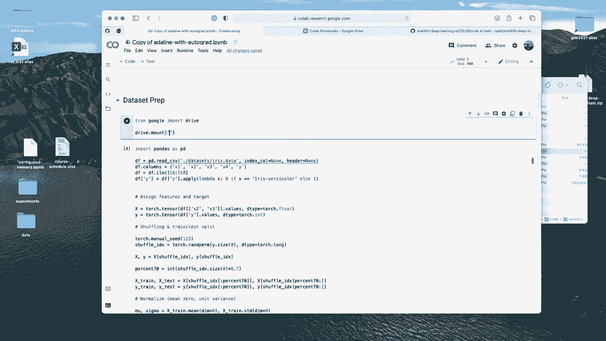

Let me just look this up because I've actually made my slides， just to make sure。

I type the right thing here。Okay， my content and drive。 interesting。 Okay， so from。

Google dot call up import drive， and then mount。Content。Right。

 I will share the slides with you after this video so we can do this。

Then it asks us to enter an authorization code， which we can do by following this link， me。

Conrm this。Yep。Then I can copy this and it here。Alright， this is my authorization code。 Now。

 it should be mounted。Take some time。 Okay， so now it should work。 So let me。Not the data。

 still a file not found。 Okay， so the reason is we have now mounted this drive。

 but it is it requires a little bit more information about that because the notebook。

 you can think of it。 It sits in some arbitrary replace on a Google server。

 and this data sits on my Google drive。 So you have to be a bit more specific and provide a concrete address。

 So it would be。Let's see content。My。😔，And then。Collup。😔，ドックス。So this is essentially。

If you follow here， my drive， Google call notebooks and then data sets。

 So this is what we have here now。 so this should now work。See， this。Finally worked。

It seems a little bit complicated， but technically it's not that complicated。

 I showed you a lot of things that don't work to motivate or to do it here step by step。

 but technically you can also just leave these lines in your notebook and then it should work so you only have to do it once if you and then for the next project you can copy and paste it。

But there is also one little addition I want to make and that is。

There are two computers involved here right now， or at least to server。

 One is Google Drive where your dataset is sitting and one is this notebook that is running on a different computer instance at Google and the communication between those computers can be a little bit snow because it goes over the Internet。

 So to speed things up when we work with more complicated data sets。

 it's actually better to copy this data。To the same computer that is running this notebook。 So。

 for example， what you could do is you can do on。A copypy， so。Can say。Be dream。So you can copy。Yeah。

 that's what I want。You can copy these data sets here。To a local folder for data sets。

So you copied it， and then you can again， use the original link。And if you have large data sets。

 the training will be faster when we use Pythtorge data loads if the data is located locally like that。

 So here I just copied it from Google Drive。To this local directory called data sets。

 So this is what I would recommend。 And even further than that。

 I would actually recommend if you have more complicated data sets to make a zip file， so。Here。

 for example， in my case， I can just go， go here， compress data sets。

I have this dataset sets dot zip file， and then I go to this folder here， and。Drag and drop it here。

So it's now datas。 zip。And then。I go here。And instead of copy3， because it's a single file。

 I will just copy data sets dot zip。To have just。I zip， so I'm just copying it here。

And then I can unzip it， unzip。Zip。I need an excation mark because this is not a Python command。

 This is a bash terminal command。And it asks me to overrite this because I already have a data set like this in my。

Drive。So yeah， this should。Work now， Okay， so in this then also。In that way。

 this is my recommended way using the zip file and then unzippbit it on on this machine。 Of course。

 for something simple like Iis， it's overkill， but later we will see we will be working with data las and。

 for example， large image data sets like Ms where you have 50000 images and it is just faster to upload。

Or copy a single file and then unpack it compared to uploading 50000 files like small little files。

 So in this way， it's like my recommended approach。 If you use Google Colll。 Alright， so this is。

 yeah， then how you used the GPU。 Actually， we haven't used the GPU in this notebook here yet。

Just to quickly continue。 So if you wanted to use the GPU， you have to do one additional step。

 You have to。Toch device。Use the GPU， actually。 So there's only one GPU in this computer。

 So we use the index 0， which stands for the first GPU。 This one would be the second GPU， third GPU。

 fourth GPU and the fourth Yes only one GPU。 so we can just oops。Transfer it to the one GPU。嗯。Oh。

 okay。 so one issue is this is our manual implementation。 So this， of course。

 doesn't support the GPU because it's not using the model class。 So let me。Yeah。

 doing this very spontaneously here。 Let me run this regularly。And then go to the automatic one。

So order line automatically， this is the one using module。 So if you do that。Then， this one。

Will technically support the GPU。 So we do this one。And then， it should。Run on the GPU。

 We have to make one more modification for the training data set。 I assume We'll see if that runs。

Alright， so yeah， see， it says some argument is on the CPU while it's expected to be on the GPU。

 So that is because we also have the same to do the same thing for the data set。So， let me see。

I assume we can simply。嗯。Do the same thing。For this one， and。为什么？Let me a typo here。Oh yeah one。Mi。

 so now it works。 So I also transferred the data to the GPU。 If you have the model on the GPU。

 it also as expects the data to be on the GPU。 So in the later code examples。

 I will have a flag to do this automatically where you only have at the top of the script。

 where you only have to specify it once。And then it will automatically update it everywhere where you wanted to use the correct device。

 Alright， so yeah， let is just a quick tutorial how to use the GPU。

 I have also these slides here for the Google Colll and I will also upload them。

 So I hope that was useful and let me know if you have any questions。

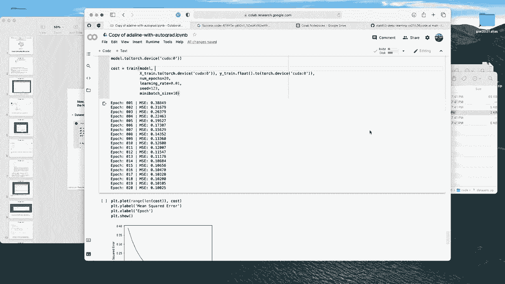