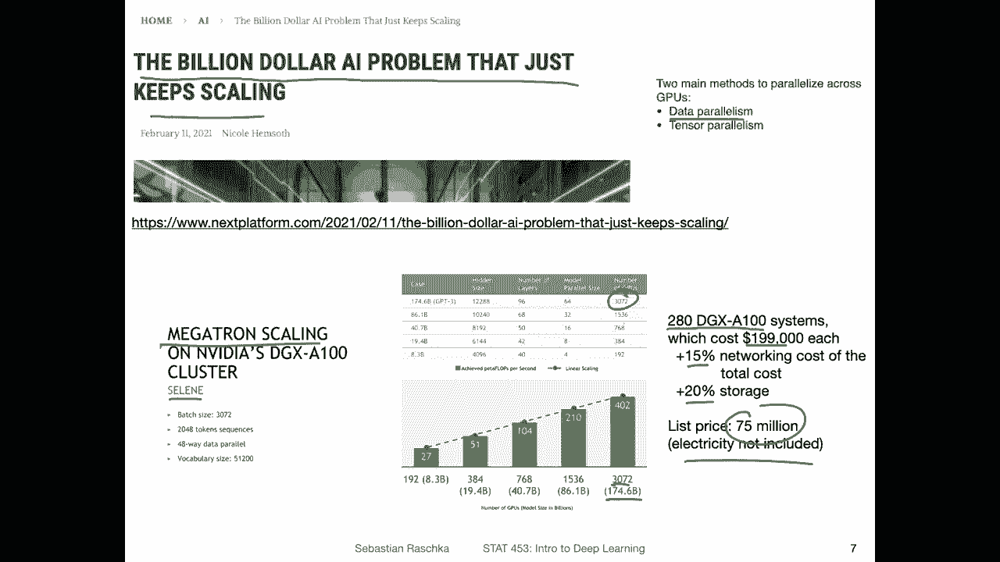
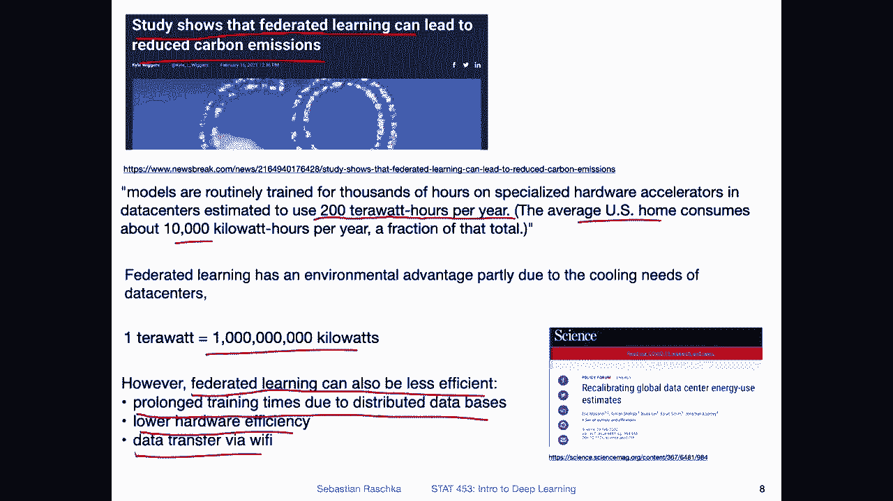
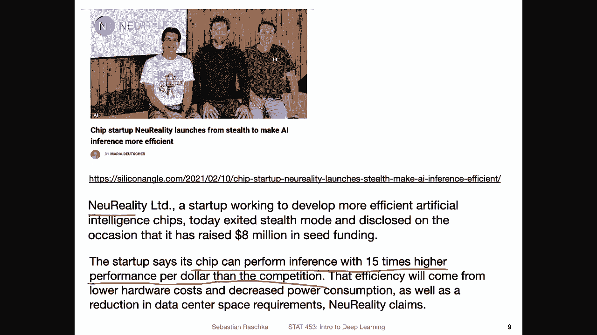
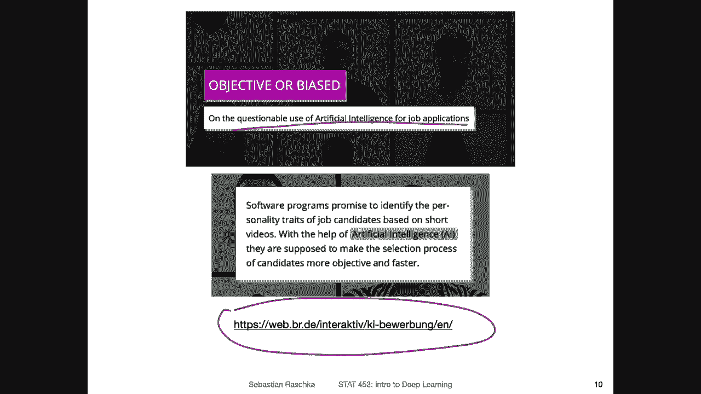
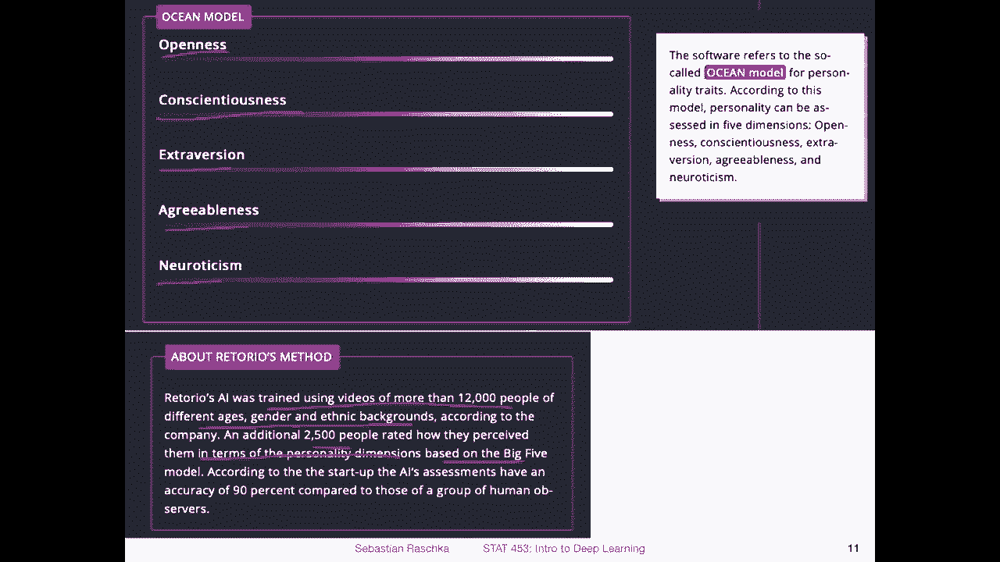
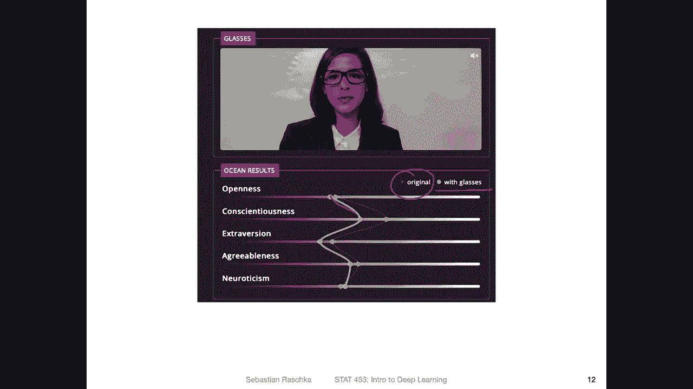
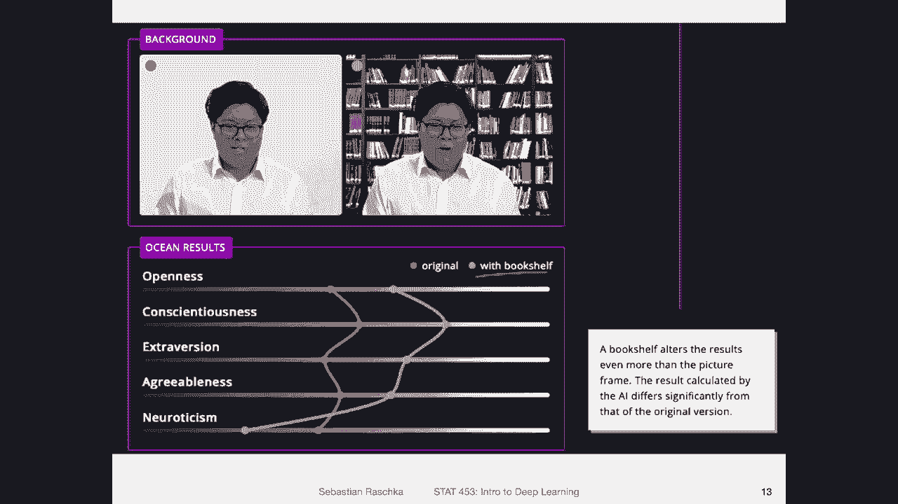
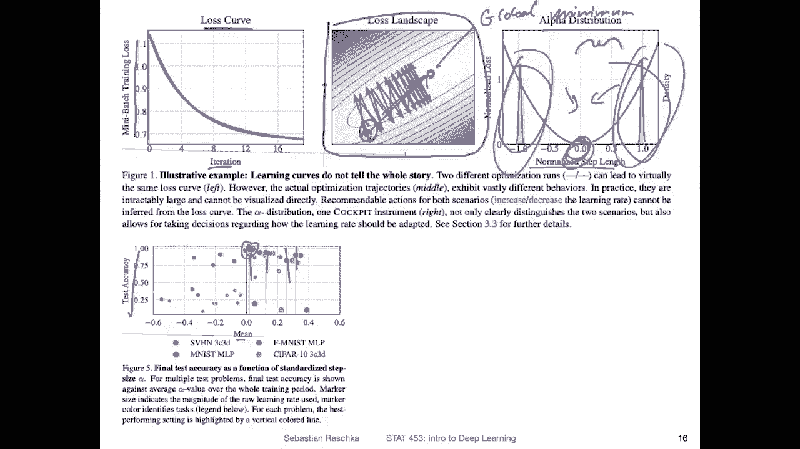

# P49：深度学习新闻 #4，2021 年 2 月 20 日 - ShowMeAI - BV1ub4y127jj

Yeah， hi， everyone。 I hope you had a nice week。 I just noticed we already completed week4。

 which means， yeah， one fourthth of the semester is already over。 time is running so fast。

 I hope you like the content on Pytorch and the cloud computing resources from last week。

 So in today's stuff in the news section， I just wanted to yeah give you a brief update again on what's happening in the deep learning world。

 Also， coincidentally， there were some interesting tools around Pytorch。😊，And also some。

 yeah interesting news regarding cloud computing and its implications on the environment and also yeah。

 maybe some not so nice applications of of deep learning regarding yeah ethical AI and these types of things。

 So yeah， there's a variety of news again this week。 And yeah， let's dive in and talk about it。

Yeah let's start with a fun library I saw this week called Free Wired Freely wired neural networks。

 So this is a Pythtor extension library for creating optimized freely wired neural networks to run on Kuda。

 the GPU essentially。So you have seen already in the lecture how yeah multi layerer perceptionceptrons work fully connected layers。

 So where each unit in one layer is connected to every unit in the following layer。

 and we will discuss that also in more detail next week in the course。 but yeah。

 here what's different is that we can arbitrarily connect these notess。 For example， consider。

In this drawing on the left hand side， consider this case of this unit。

 let's say this is the input layer。This is the first。Didn't they。

And then we have the second hidden layer。So we have this unit here， for example。

 that is only connected to one other unit in a typical connected context what we would see is we would see also a connection to this one here。

 but here here it's more arbitrarily connected or you can also see this input here is connected to this unit and this unit as you would expect in a fully connected layer。

 but then there's also a connection to a consequent layer。

We will see later some flavors of that also in the context of convolution networks and residual connections。

 it's also something that is popular and transformers。

 but here it's really more arbitrary than in other architectures。

 So its just a tool for allowing you to create these types of architectures。

 I thought that was like a cool thing。 if you want to run some crazy experiments that might might be something yeah interesting to look at。

So where would this be useful？ So， for example， one thing that came to mind is this paper exploring randomly wired neural networks for image recognition。

 So that is a paper I saw like two years ago， approximately。

 And here the researchers has proposed a method for。Yeah。

 randomly connecting yeah neural networks or getting these random connections。

 I think also involving convolutional errorss。 So in this way they used when I recall correctly。

 they used evolutionary algorithms or genetic algorithms to learn these by yeah optimizing fitness function and they found that this architecture。

 this randomly wired one。Performs better for example， than existing one based on Resnet。

 So Resnet is also something we will talk about in this course。 The Resnet architecture achieved 77。

1% accuracy on this dataset its imagenet and this randomly wired one achieved a higher accuracy。

 though it seems arbitrary。 So when I read that paper like two years ago。

 I thought really that's maybe the time when these hand designed convolution networks are going out of fashion where people start using these automatically wired ones。

 However， I must say personally， I haven't seen any。Yeah randomly wired network since。

 yeah since I read this paper actually， So maybe this is because it's hard to implement Also it's also。

 I would say computationally more intensive。 And maybe there's also less logic behind。

 So for regular CNN architecture， you can maybe make some arguments why it's supposed to perform better with a randomly wired one。

 it's maybe a little bit more like a black box and people don't like that。 But yeah， again。

 with this tool I showed you in the previous slide。

 there might be an opportunity to explore this further because now it's maybe easier to implement such randomly wired networks。

Yeah， also this week we got a new computer vision dataset set。 So in this new data。

 the researchers compiled 1。5 million images from 565 classes。

 So what's novel or interesting about this data is that it is focused on object categories that are important to humans。

 at least that's what the researchers aim for。Yeah。

 so this paper will be actually published in three days。

 so it's today the 20th and the paper is already available on the website of PNS。

If you want to take a closer look at it。And also the researchers provide code examples regarding pretrained convolutional networks trained on the dataset and also how you can load this data。

 There are some other interesting aspects from the data， how the data looks like the statistics。

 the basic statistics， but then also how they collected this data set。

 So I wanted to just briefly also walk through this because I thought that was interesting。

So here's an example of some of the 565 classes man house car， woman phone bed。

 so things that are relevant to humans。 And so here they also looked at these categories for example。

 60% of things all labeled are artificial 40% natural。 So for example。

 a car would be artificial and the tree would be natural and so forth。

 So they have some interesting yeah analysis here。Also， regarding the number of images note that。

 yeah the number of images is different for each class。

 so it's not a balanced data set it's imbalanced。Which makes certain things like the evaluation a bit more challenging。

 So instead of， for example， using the regular accuracy。

 something like the class balanced or balanced accuracy might be something more worthwhile or not worthwhile。

 but more reasonable to use here。 So some students who took the 4，51。Class last semester。

 we talked about the balanced accuracy that would be maybe one measure that would be also appropriate here。

 So and also notice that these images have different aspect ratios and resolutions。

 which is also shown here。 So if you work with the dataset set。

 you also have to make sure of course that yeah， you find a common denominator for the input sizes。

 if you work with certain architectures， which are restricted to certain input sizes。

But that being said， let's skip to the more interesting part how they collected this data set。

 So what they did is they try to kind of filter for labels that occur frequently in large text corpes。

 So it's like a proxy for saying how important class or word is or known。

 and they also had this concreteness rating。 So this was something yeah quite interesting。

 So here they employed yeah data from human observers。 So。

How that works is that they asked people to rate on a scale from  one to 5 how concrete a certain noun is。

 So in terms of how easily can you visualize the concept。 So as an example， for example。

 con consider on one end strawberry。If I tell you the word strawberry。

 I think you can easily visualize this， so it would have a very high concreteness。

But when I mention a noun like hope， for example， which is a little bit less concrete。

 So here it's kind of harder to visualize how hope looks like as a， as an object。 So in this way。

 it would have a very low of concreteness rating。 So by using these types of ratings。

 they also filtered for very concrete， very concrete things like items， and。

From that they extracted in the top 3，500 words based on frequency and correctness。

 they had a certain index forulating calculating that。Yeah。

 and then they had each now describing basic level category and excluding subordinate categories。

 so making sure it's not too hierarchical， like picking the yeah， common denominator categories。

And also merging synonyms， for example， automobile and car into one word。

And after they basically extracted these class labels they were interested in。

What they then did is they downloaded corresponding images from ImageNe， Flickr and Bing。

Then they also performed duplicate removal to make sure there are no duplicates。

 so here they used principal component analysis， so they did decomposed the images with principal component analysis and then when I remember correctly what they did is yeah they looked at the factor loadings of the PCA。

And then looked at the correlation between these vector loadings。

 So I believe they did that in a pairwise fashion to filter out then duplicates。Also。

 what they did is here they manually excluded misclassifications from all categories here they don't say anything specific here they say something with a 4% error rate and in the paper they say basically that they sampled 100 images randomly from each class。

And then they， as a human looked at how many of these images are incorrectly labeled。

 So if you look at them and you see， okay， this label label doesn't make sense if the rate was more than 4%。

 like four more than four images out of the 100， then they looked at all the images from this category and cleaned that out。

And otherwise， I think they left it as is。 so you can see or can think of it as in the worst case scenario。

 you can only have a classifier that is as good as 96% accuracy considering there are up to 4% mislabelled images in this dataset set。

 but it's still reasonable good。And then they merged these images from the different databases。

 removed the duplicates again。 So now checking for duplicates from imagenet versus the Flr and Bing images。

Then they， yeah， prune the data set， removing images or some of the images。 So that these， yeah。

 labeled or sorry that the examples are approximately between 7 and 5000 per class。

And then yeah they obtained this final dataset。 So 94% of the images are actually from Imnet。

 which is a big number，5% are only from Bing and 1% is only from Flickr。

 I actually don't recall exactly how imagenet images were collected。

 I think they were collected from Google but there might be also just an overlap between imagenet and Bing and that's why there's such a high number of imagenet images compared to the other images。

 but yeah， exactly why theres such a high imagenet percentage I don't know。

 but yeah so it's an interesting dataset's yeah just another cool dataset that can be used for yeah testing your models。

Yeah， moving from larger scale image data sets to large scale models。

 So there's also common or popular discussion nowadays that these AI or deep learning models become more and more expensive to train so。

Here was an article called the billion dollarll AI problem that just keeps scaling。 Yeah。

 luckily we haven't reached the point where you model training costs 1 billion。

 but it can easily end up costing multiple million dollars even nowadays when you consider these big models。

 So for example， here is a chart from the megaron model。From Nvidia。

 So here what they did is they trained on or they had a system called Celine。

And this consisted of 280 DGX A 100 systems where each of these systems， if you would buy them。

 would cost $200，000。 and then if you consider， let's say 15% on top of it for a networking cost like connecting everything。

And then also 20% for storing this。 Yeah， this would be easily or if you would consider the this price。

 it would easily end up being like $75 million just to buy the system。 And also in this article。

 they did a calculation like how expensive would it be to run this model if you would rent the hardware on AWS so the Amazon on server or service it would also easily be like around 80 million if you just rent this computational resource for three years。

 So in this way also I should say electricity is not included。

 it's becoming more and more expensive to train models。 So for this model。

 they really used like this huge system。Where they had around 3000 GPus。

 So 3000 gus and the model had around 200 billion parameters。

 So things become more and more expensive， which can be a problem。

 So also regarding yeah parallelization， there are two techniques。

So also it's kind of computation an interesting problem。

 One is a data parallelism where you split up the batch。

 So you make the batch larger and larger and larger and then you split it up onto multiple GPUus where each GPU receives fraction of that original mini batch and then each of the GPU computes the gradient and then you combine the gradients by averaging over these gradients to update the models。

 but there is also a limit for yeah doing that theres like limiting diminishing returns。

 as you would say， if you have high and higher data parallelism。

 So also newer methods consider tensor parallelism where you can efficiently。Compute， let's say。

 matrix multiplications across different GPus。 That can also be a little bit tricky， though。

 because you have to consider the connection between the GPus。 You have to make sure they are。

 yeah connected with fast connections like infinity band and these types of things。

 So it's actually not a trivial problem。 So if you have more GPSus。

 It's not necessary saying that it's easy to parallelize。

So it's just an interesting research problem， but yeah。

 one problem with that is really environmental friendliness also。

Yes， speaking of environmental friendliness， a recent study showed that federated learning can lead to reduced carbon emissions。

 So what is federated learning， Feerated learning means essentially computing things on multiple devices and then gathering the results from these devices。

 For example， these could be cell phones or different data centers。So， for example。

 you can think of if you， I'm not sure if you remember this when I was a kid， there was。

Something called folding at home for PlayStation。 and people could sign up for this service。

 And then if you had idle yeah idle cycles on your PlayStation。

 these were used by let's say some research center to help with protein folding or another example would be our H TC condor on campus where we have。

 yeah where we can use different computers like desktops in different offices if they are idle。

 which is actually pretty cool。 And they found if you do that it can lead to lower let's say carbon emissions。

 And yeah， likely this is due because。Of the heating。

 because if you have computers in different locations and they are only used a little bit。

 you may not need any extra heating。 sorry cooling for preventing the heat exposure or overheating of the device compared to let's say a big data center where you have to pump in constantly like lots of energy to keep it cool。

 And yeah， also just the numbers were just impressive。 I mean， these data centers nowadays。

 they use20 a terW hours per year。 compared to average US home。

 which only uses 10000 kiloWs per hour。 And I just looked up what a terat is。

 a ter is I wasn't actually sure I was I not sure if it's 1 million。 It's actually 1 billion kiloW。

It's like a huge amount of energy they use。 So if this federated learning can help， why not？ However。

 the researchers also noted that it there's like a little caveat。

 So it's actually not quite clear because federated learning can also be less efficient。For example。

 if you consider prolonged training times due to distributed databases。

 So if you want to train a model using multiple devices。

 but you have your database sitting in a location that has to be accessed。

 well that will probably make training longer。 So you have you have to keep your device running for longer time。

 but then also。You will have eventually then some more data data transfer via wfi。

 which also takes energy。 And then also you have to consider that these devices may be less efficient。

 like using the same energy， but being less efficient。 One example would be， for example。

 the new what is it M1 chip， the arm chips in the Macbox。

 they have the same speed as the top and inter CPUus。 However， they are more efficient。

 So in that way， you have to also consider certain devices are not as efficient。

 So if you use federated learning， this could also be maybe yeah less efficient。

 But I think it's still interesting that people started looking at that because yeah。

T we also have to be aware of the environment and be resourceful when we do deep learning。

And related to that， I also saw there another new startup I think it's pronounced new reality。

 but I'm not exactly sure。 So also one trend is really that people work on making chips for deep learning more efficient。

 So this would be yet another company that focuses on yeah deep learning chips or instead of GPUs like having specialized chips for deep learning and。

InThis article， they said basically the chip can perform inference with 15 times higher performance per dollar than the competition。

 Not that they don't say that the chip is faster than GPus。

 really here the focus is on the performance per dollar。 but it's not a bad thing。 I mean。

 maybe this chip overall is slower。 but you can see 15 times higher performance per dollar。

 So per dollar， it's not clear whether this means like manufacturing cost or also usage cost in terms of electricity。

 but I bet it's a mix of both。 So it's probably a chip that is smaller。

 less powerful than a GPU for example， but probably more energy efficient。 but well see。

Yeah， so here I have some news which is I think， yeah not such a good use of AI or deep learning。

 I find this always questionable like these types of applications。

 but I think it's still yeah important to talk about it。

 So here this is about a system trained to rate yeah applicants during job interviews。

I think also when people develop these systems， So the aim is really to make things more objective。

 like if you think of it as a human， you have probably some biases towards certain candidates and if you have an AI system。

 you may be hoping that this is less， let's say it's more objective。

 less subjective and probably also scales better so you can have more applicants but yeah。

 so I think I'm not sure but I think these are all developed in good faith。

 but they can also yeah be very problematic。 So here was a questionable use of AI for。

Job applications。 I also recommend you to read this full article。 It was a very interesting analysis。

 It's a short article， but very， very well written， so。Yeah。

 essentially here the researchers developed an AI to rate job applicants。

 so they trained the AI on videos from more than 12，000 people from different ages。

 gender and ethnic backgrounds and。

An additional 2500 people rated how they perceived them in terms of personality dimensions and so forth。

And I think it's not quite clear， but I think how this works is basically。

 they had people rating these job applicants and then。

Collected these scores and then trained the AI on these scores。 And that way you can think of it。

 maybe the model yeah just mimics what the humans are doing during the rating。

 So they had like these different rating terms like openness， conscientiousness， extraversion。

 agreeableness and neuroticism and these were like other different labels。For the personal traits。

 Yeah， and then the researchers employed actors to do mock interviews。

 So keeping everything constant like speech and content of the text during the interview。

 and they also repeated that multiple times。 So make sure that making sure that the results are stable and then they for example。

 varied different aspects。 So here， for example， they the actress was wearing glasses and comparing the results to not wearing glasses。

 And you can see in blue is the original without glasses。

And then in yellow with glasses and you can see based on these ratings by the AI that the squs for openness。

 conscientiousness， extratroversion， agreeableness were less when the person was wearing glasses So this is also one of the reasons why I'm not wearing glasses when I record my lecture No I'm just kidding Now I think this is like a little bit problematic because I think wearing glasses or not shouldn't influence any decision right so this is maybe something that is not going so well here with this AI and even worse。

So where the results were even more different， they had a person doing a mock interview with and without a bookshelf in the background where everything else was constant。

 So and you can see that with a bookshelf。 The squash improved or lot。

 So this is also a very questionable result by the eye。

 So there shouldn't be such a difference whether someone has a bookshelf in the background or not。

 And yeah， this is maybe also a reason why I have a bookshelf in my background here。

 Now I'm just again kidding。 But yeah， so this is again， it's actually a serious topic。

 I think this is something when you develop such systems， you should make sure that。

Such problems don't occur because I think this is incredibly yeah， unfair because really， I mean。

 it really shouldn't have anything to do with your skills as an applicant。

 whether what type of background you have and things like that。 So yeah， this is some。

 some very problematic result。 And I think in general。

 maybe this is an area where AI shouldn't be employed。

Yes， so why does this problem happen。 So there was one comment by Kaarina Swwike。

 which I think hits the nail on the head。 It's the fundamental problem with face recognition by machine learning is that we never know exactly which pattern in an image these machines are responding to。

 So yeah， deep learning can sometimes or often be more like a black box。

 So you never know really which parts of the image the machine learning system is using right。

 because you provide the whole image with background in everything。 So do you really know。

What the machine learning is paying attention to。I don't know if that solves the problem。

 but if you think of Zoom， for example， where you can easily switch these backgrounds。

 having these videos with data augmentation， swapping different backgrounds may help at least with this bookshelf situation。

 but there of course， more issues to be addressed here。

 but yeah this is something if you develop systems you should probably be aware of that and test also things like that and make sure that yeah these these things are filtered out and not causing problems。

Especially in a real world application。So yeah， related to looking into what deep learning does。

 how it behaves。 So I also saw another interesting tool on called cockpit。 It's also for Pytorch。

 So it's a practical debugging tool for training deep neural networks。

 I think it might be something that could be helpful in the class project， for instance。

So the authors say when engineers train deeping models， they are very much flying blind。

 So here they offer a collection of instruments to look into the inner workings。

Of machine learning models。 I don't know。 I somehow screwed up this sentence here。

 So it's really useful for troubleshooting during training。 And you can find a tool here on Github。

Just to show you one example here， so here they focused on the problem of learning rate tuning so usually when you want to find a good learning rate。

 you usually just try different things and see what works and yeah tune it by hand and see you make it larger and smaller and see whether it's better or not and then sometimes you also employ learning rate schedulers which decrease the learning rate over time。

 we will discuss that in a future lecture actually in two weeks。

But here's an example where the researchers looked at the loss curve。

 So they have mini batch training loss here plotted on the Y axis。

 So that's the loss per mini batch over the different iterations。 and orange and blue。

 these two lines are corresponding to different learning rate settings。Now。

 if they use a look at the lost landscape here in two dimensions， again， it's kind of hard to see。

 but here in orange， they have one setting， the orange one and in blue， the other one。So here。

 what they want to illustrate is that the orange one。Is only updating a little bit。

 and then it stops。 So the learning rate is likely too small。

 and the blue one has a learning rate that is is too large。 You can see it's overshooting。

So here would be the global minimum。Global minimum。 So they are overshooting here。

 So the blue learning rate is too large and the orange one is too small。 and they offer some tools。

 for example， this alpha distribution here。Ass a debugging tool。

 So this is like what they call a normalized step length and0 would be where you would directly be stepping into the right direction of the。

 yeah， of the minimum， the global minimum， or I think it is local minimum in that context。

It wasn't actually quite clear。 I think the paper， I think the tool looks great。

 the paper wasn't my favorite to read， it wasn't very well written， maybe it wasn't well written。

 I didn't understand it properly。 I don't know add a little bit of a hard time understanding certain things there。

 but what you want what theoretically would expect is stepping into this yeah into this direction directly。

 if you have a learning rate that does that it would be optimal。And with this tool。

 you can see whether you are too small， like in the orange case or too large。

 and then you want to adjust it more to the middle， Surpriingly， though。

 when they did some experiments on different data sets here。

 they found that the ones that resulted in the best generalization performance in terms of test accuracy were slightly above the zero。

 So here they found so these lines。These lines here correspond the solid lines on the。

Vertical lines here， they correspond to the models that have the best performance。

 And you can see those are。At least yeah， I would say 0 or larger than0 in terms of this normalized step length here。

 They have the mean normalized step length， so。But in any case， this， I think。

 might be a useful tool if you are tuning the learning rate。

 you can just maybe see where you are here compared to the0 and then maybe。

Focus on changing it to be somewhere in this region here。

 But this is something I haven't tried personally。 So this is also something that's new to me。

 I usually like many other people， tune the learning rate by hand。

 but it might be something useful to look at in the future。 So with that。

 I think that's all the news I have。 I think it's a long video。 But yeah， with that。

 let me end this video。 And I will see you back in class next week。

