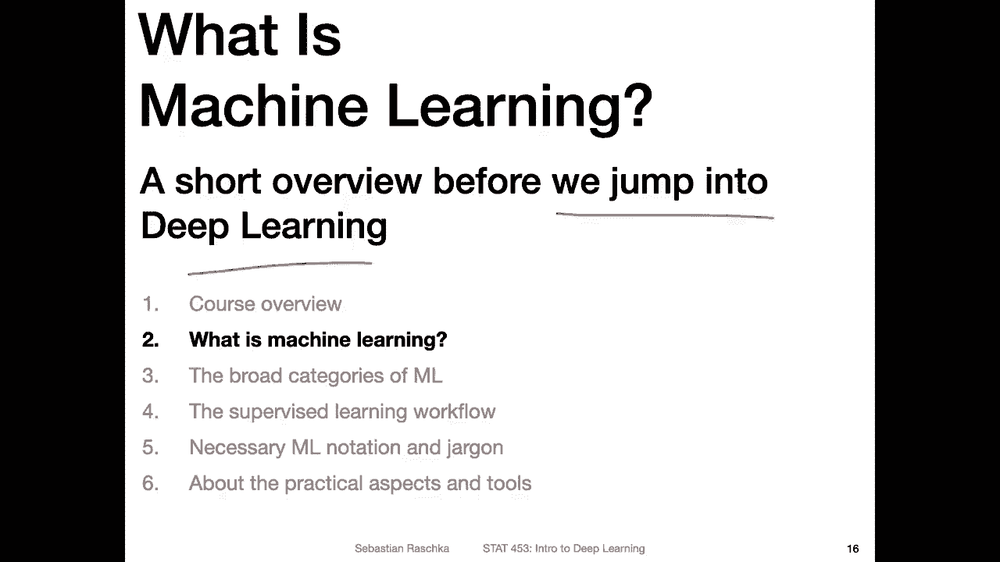
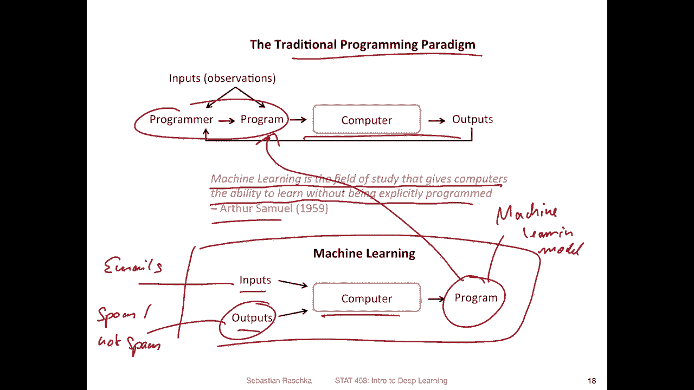
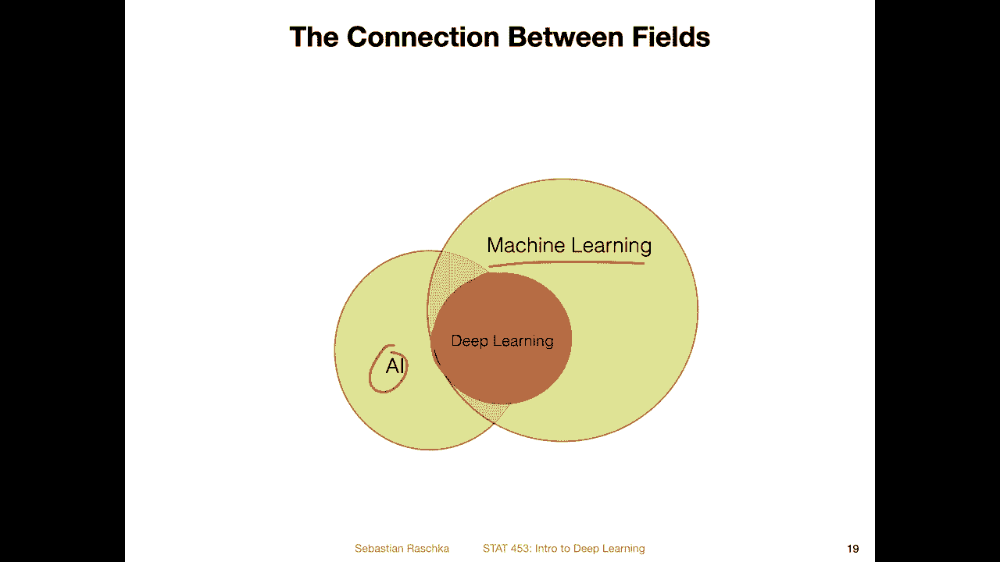
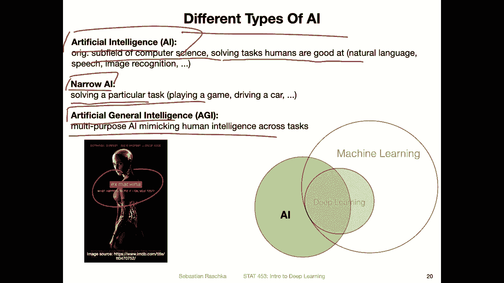
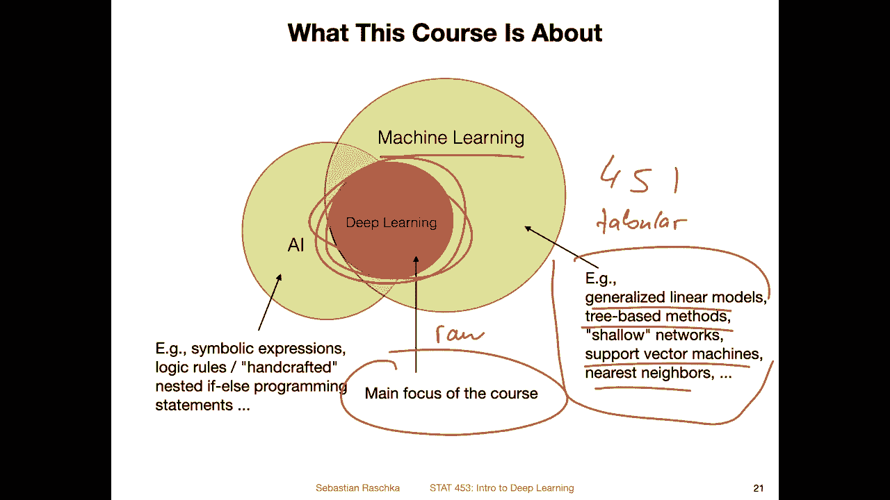
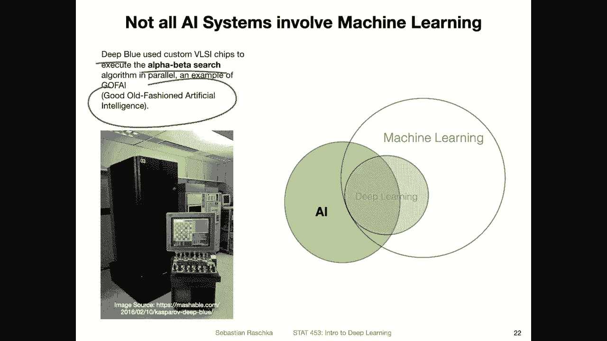
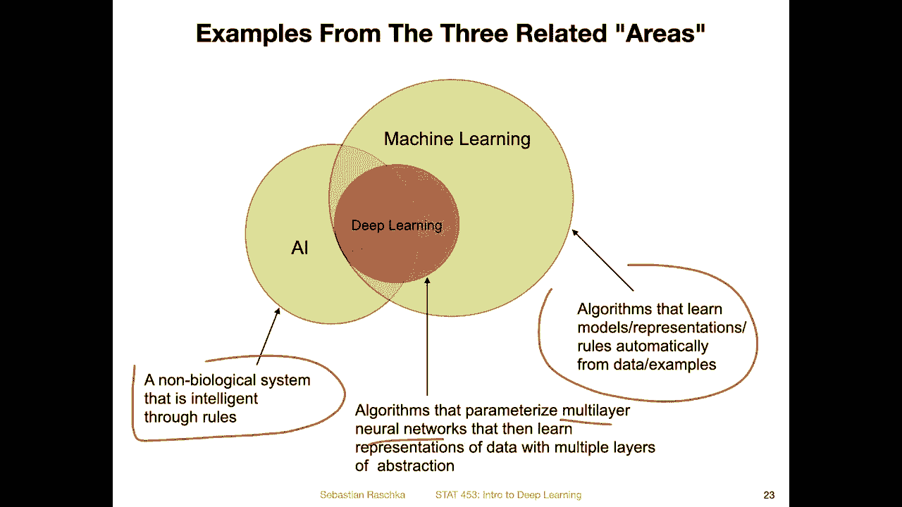
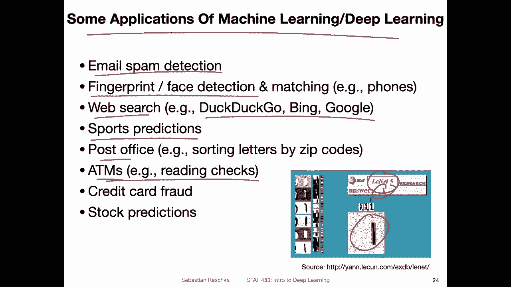
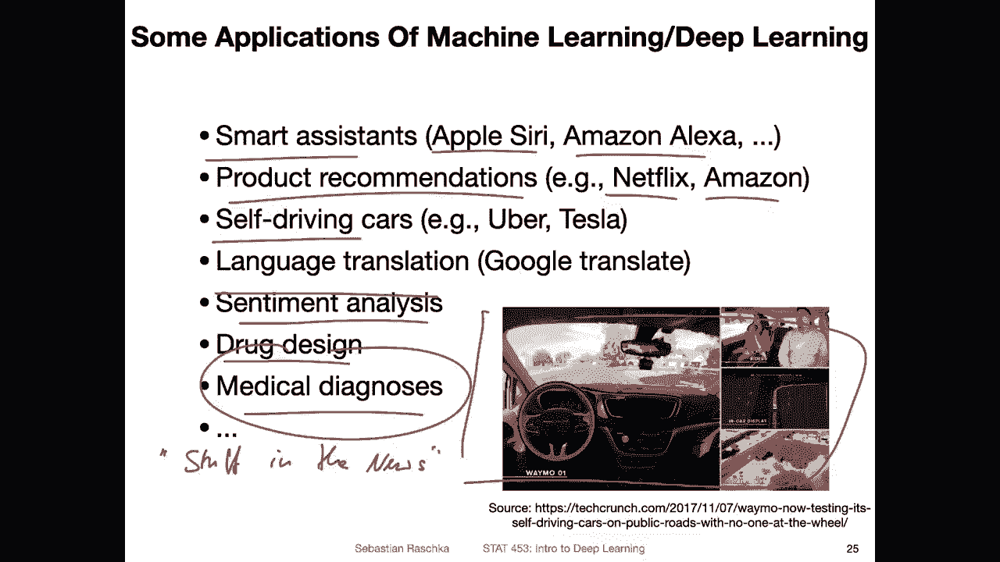
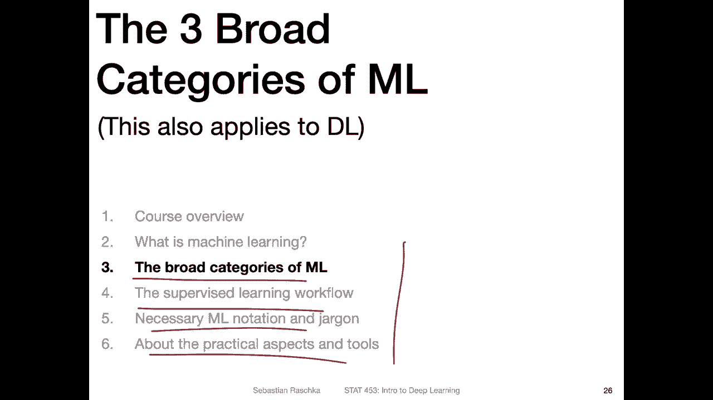

# P4：L1.2- 什么是机器学习？ - ShowMeAI - BV1ub4y127jj

Yeah， before we jump into deep learning， let me briefly define what machine learning is and what it is all about in a few minutes。

So it all goes back to the traditional programming paradigm So what do I mean by that it's like yeah the development of computer software to make our lives easier So I think one of the motivations behind developing software was to make common tasks more convenient for example replacing physical mail while let's say email although it's not 10% replaced but yeah with that like change now things a little bit more convenient compared to writing a letter by hand and then bringing it to the post office and then taking a few days until it's delivered and so forth email makes this whole communication aspect more convenient although I would say maybe email is not so great because everyone included I think think that email is maybe not making life easier but harder because theres no more email than physical mail。

In any case， so let's now imagine you have an email program and you want to make email more convenient。

 You want to filter out spam。 So unwanted email。 So imagine you want to design a。Sm filter。

So as a programmer。You want to design the spam filters。 So our program is the。Sm filter。

 And then we can give this to the computer who then will produceuse the outputs， which would be。

The label。Whether something is。Sm on。Not spam or maybe going one step。Further。

 just putting it into the right folder， like either the inbox or the spam box on our email program。

Now， how do we design this filter， I mean， as a programmer this could be a very tedious exercise。

 we would first take a look at examples of email so we would take a look at our inbox and then look at what could be some spam email we would then compared to non spam email。

 think about it and maybe come up with a rule that says for example， if let's say if。呃，email。

Hat the word。嗯。Let's say。Wen。😔，Money or something like that。In the subject。人。Classified as spam。

And then you can have an else。If something else and so forth， you can develop these rules。

 hard code them in your program and then， yeah， develop a spam folder like that。

 But I think it would be super tedious to do that because you would have to take a look at a lot of messages and do a lot of testing and see if your rule works and if。

Some additional L else if statement could improve it and not。

 And it is like a lot of work like to take a look at this。 And this is why machine learning is so。

 yeah， popular because it can make this life easier for us programmers for developing software that can。

 for example， classify things。So here， in contrast at the bottom。

 I have machine learning in contrast to that traditional programming paradigm。

 So in machine learning， instead of yeah， having the programmer look at these。

Inputs and making decisions， we provide the machine learning algorithm with inputs and outputs。

 again， outputs would be the labels for our email。 so we have a labeled data set。

So here this would be。Our emails and the outputs would be whether they are。Sm or not spam。

 So a human actually would have to label those。 So you have to have a human to assign these labels。

To show the computer what we want。 So it's basically this is what what we want。

 the desire desirable outcome。 So we have as a human we have to of course communicate to the computer what we want。

 we have to say okay， we want spam and non spam email labels So we provide these as examples and then the computer can learn rules to make this classification so the computers actually developing this program This is our。

Machine。Learning。😔，Model， and then the machine learning model can actually replace。

Our role as the programmer developing the program manually。

 we can actually give the program directly to the computer to produce new outputs on new data。

 So machine learning is the。In a way， the automatic learning from examples。

 So there's also a famous quote by Arthur Samuel。 This is a quote that you can find in almost every machine learning textbook。

 So the quote goes like this。 Ma learning is the field of study that gives computers the eibility to learn without being explicitly programmed so。

Here that means we are providing examples and then the algorithm learns automatically based on the data instead of having humans thinking about these routes that's machine learning in a nutshell。

Specifically， this is a subfield of machine learning called supervised learning。

 which I will talk about in a future video。So yeah。

 but you may wonder how is machine learning now related to deep learning and， for example。

 artificial intelligence， you probably all heard about AI and artificial intelligence。

 most of the time nowadays deep learning in AI used interchangeably， however。

 there is a distinction I wanted to briefly。Discuss So machine learning。

 I would say is the biggest field。 It's like， yeah the field encompassing deep learning。

 So deep learning is strictly a subfield of machine learning。 A subfield that focuses on yeah。

 neural networks， deep neural networks and AI is intersecting with both。

 I would say if there's one thing about this graphic is I made the。This one maybe。Not， that mean。

 not big enough， but maybe I made this， this part here too big。

 So there is also what I wanted to say here is there are also AI methods that don't use machine learning。

 So let me go through these things step by step。

So first of all， there are different types of AI， so usually we say generally AI is artificial intelligence。

 which is a subfield of computer science solving tasks humans are good at， for example。

 natural language， speech recognition， image recognition and so forth， and then we can subcategoize。

AI into two， yeah smaller categories， one is narrow AI。And one is artificial general intelligence。

So what is narrow AI N AI is a form of AI that is focused on solving a particular task。

 so only one task at a time， for example， image classification or playing a game driving a car let's say an algorithm for unlocking your phone So this would be a narrow AI because it can only do one task so it's not like a human。

 a human can do multiple things， I mean I can yeah go skiing， I can do cooking I can。

Bite emails I can yeah record a lecture and things like that， so I can do multiple things。

 but a narrow AI system can only do one thing that it has been developed for。 In contrast。

 artificial general intelligence is multipurpose AI mimic mimicking a human intelligence across multiple tasks。

So if you have seen the movie X Makinna， the robot in this movie， for example。

 I would say would be more like an AGI agent where it can do things a human can do。

 So multiple things not only classifying images for example。

 So that way there's a difference between narrow AI and AGI。

 However AGI is for most people what they want to accomplish。 It is like the far future goal。

 but we are not very close to that one yet so that's like people are actually arguing whether it's possible at all。

 whether it will be possible some people think it's like within 50 years。

 some people say within 1000 years。There's actually a nice book。 What was the name。

 Architects of Intelligence， where the author， I think his last name was Fort。

 I forgot the first name。 So the author interviewed。

Multiple experts in deep learning when they would predict AGI will be invented。

 And there's like a huge， yeah， huge span of predictions between， I don't know，20 and。

20 years and maybe 10000 years or maybe never things like that。

 So no one really has a good idea even when or if this will ever be invented。

 Na AI is something that we have nowadays in， in almost every aspect of our lives。

 And I will also talk more about examples of that。

So yeah so why did I why did I draw these circles like that So AI there was also something called good oldfashioned AI it does not always have to involve machine learning For example。

 when we developed our spam filter a few slides back when I designed these F and else rules as a programmer I was developing an intelligent system right if I add enough of these F and else rules。

 This system will be intelligent and will be able to sort my emails by spam and not spam However for that I didn't use machine learning。

 So in that way AI doesn't always have to use machine learning。Nowadays。

 most of the II systems use machine learning though。

 and also even more of them are using deep learning because deep learning is usually yeah very good at natural language and computer vision。

So and this is also the focus of this course。 and this course， we will be focusing on deep learning。

Regular machine learning that is not deep learning could be， for example， generalized linear models。

 for example， linear logistic regression， tree based methods and certain。

 yeah methods like random forests or。Grading boosting， support vector machines。

 can nearest neighbors。 This is all。Something we covered in。Machine learning statistics 4。

51 introduction to machine learning and the fall semester。 In this semester。

 we will be specifically focused on deep learning， which is deep neural networks。

 which are very good at our computer vision and natural language。

 which is something these methods are not good at。 So these methods。

Only because we call them traditional doesn't mean they are bad。 They are still really。

 really powerful and useful for tabular data。 I will explain what I mean by that later。

 So they are really good at learning from tabular data and deep learning is more suited for learning from raw data like images and speech and things like that。

 So it's it's not like one is better than the other。 The purposes are kind of different。

 So that's that's main difference basically。

Yeah， so yeah just one more example of an AI system that does not involve machine learning and deep learning so as far as I know I mean I was a little bit young back then。

 but as far as I know deep blue that was like a old chess computer is not based on machine learning。

 it is like using an alpha beta search which is a search algorithm for finding good chess moves and as far as I know for example this would be an example of a good old-fashed artificial intelligence that is not involving machine learning I may be wrong but then there are definitely examples of AI systems that don't use。

Machine running。So then in general we can say I is yeah a system that employs rules and is kind of intelligent through these rules by using these rules。

 for example， if you think back of OS spam filter， that we could develop by hand by having a lot of FNL statements。

 this can become intelligent as a narrow AI， but it doesn't necessarily have to involve machine learning。

And yeah machine learning is about algorithms that learn models or representations or rules automatically from data and examples to the label data。

 for example， if you think back of the slide that I showed you when we showed the algorithm examples of labeled email and then the algorithm would develop the program that would be what machine learning is about and then deep learning is also machine learning but it is specifically focused on multilayer neural networks。

 so they are a little bit more more complex than。Simple algorithms but not necessarily。

 they have usually more parameters， and we will see all about that in this course。

Yeah here are some applications of machine learning and deep learning and practice。

 So when we already covered the email spam detection another popular example of machine learning would be or deep learning specific would be fingerprint and face detection and matching on the phone So if you have a smartphone you probably either have fingerprint。

 sensor or camera that detects your face to unlock your phone or web search is also heavily using machine and deep learning for example。

 Dr Go Bing in Google sports predictions people use it for making predictions at the post office also machine learning and deep learning are used for yeah scanning in。

The letters the letters on the letters and the zip codes and then categorize yeah the letters by zip codes like image recognition and handwriting recognition and the same is true for ATMs for reading checks This was actually one of the earliest applications of deep learning or machine learning。

 It was a multilayer neural network in particular a convolution in neural network which we will be covering in this course it was called Lnet and it is goes back to the 90s so it's almost 30 years ago that was one of the early applications of deep learning I mean。

 I say deep learning back then the term deep learning wasn't invented。

 So back then people called it machine learning but it was deep neural network。So here's a fun video。

 It's a real old video from the 90s。 Yeah， illustrating how this works。 So here's a handwritten。

Image of yeah handwritten digit。 and then the machine learning here。

 machine learning system here recognizes which digit that is， and that can be then used in an ATM。

 for example， or for sorting the zip codes。So， of course。

 we will be developing much more sophisticated systems in these next couple of weeks。 but this is。

 I think， a yeah， nice， nice example of classic deep learning。

Yeah， other applications include， for example， smart assistance like Apple Siri like the voice assistant and also Amazon Alexexa and all these types of voice assistance nowadays or using deep learning。

 and then yeah product recommendations if you no Netflix or Amazon。

 they always recommend products based on yeah machine learning self-driving cars。

 unfortunately still not here yet。 I mean， I'm it's unfortunate， but yeah。

 that would be another great application， not application， but at least example of deep learning。

 It's actually a little bit complicated。 So there are many things at work from reinforcement learning to supervised learning with images。

 So here's like a little example from Waymo。 So that would be another。

Area where where AI deep learning machine learning are used language translation， sentiment analysis。

 drug design， medical diagnose and things like that。

 So I will also at the end of each week upload a video that I will call stuff。

In the news where I will yeah highlight some of the recent applications or interesting things in the deep learning world。

 where I will show you way more examples。 for example。

 I'm just thinking of this because when I mentioned medical diagnose is there was like a system recently。

 a new system for detecting CoviId from lung Xrays， left but lots of these systems lately。

 but there was a particularly good one， for example last week。In collaboration with doctors at NYu。

 And I will show you more examples of deep learning in the real world in these stuff in the news videos。

 But yeah， that is just a quick overview of machine learning。

Just to lay the groundwork。 And then in the next few videos。

 I will say a little bit more about the subcategories of machine learning。 It also applies。

 of course， to deep learning because we've learned that deep learning is a subcategory of machine learning And we will also talk more about the workflow and some jargon。

 And then about the tools we'll be using this course。 So this is still all lecture 1。

 And then yeah I will。Pasuse this video here and then record the next one on the broad categories of machine learning。

