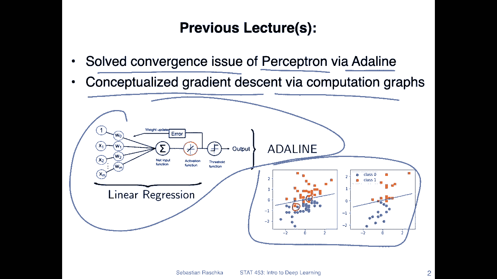
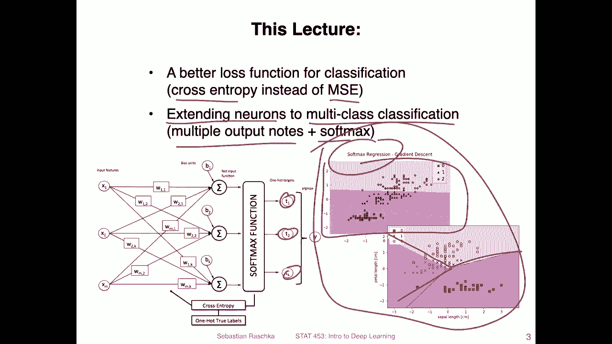
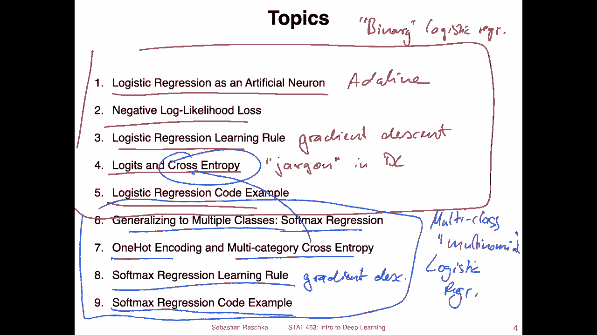

# P50：L8.0- 逻辑回归【课程概述】 - ShowMeAI - BV1ub4y127jj

Yeah， hi， everyone。 I hope you had a good weekend and everything went smoothly with the homework one submission。

 I noticed that there were yeah still some challenges around the understanding of single layer neural networks。

 So today， we will have another chance to take a look at it。 So today。

 I want to talk about logistic regression as a single layer neural network。 And that really helps。

 I think with understanding the basic concept of a forward and a backward pass。

 And then we will also in this lecture generalize this concept from binary classification to multiclass classification。

 because yeah， there will be also later on， more multiclass stuff going on because in real world scenarios。

 we often have data sets where we have more than two classes。 So in this lecture。

 we will talk about logistic regression as a binary classifier。

 and then multinial logistic regression also known as softm regression。

 which will be a good data for then understanding multi layerer perceptance。

 which is the topic of the next lecture。 All right， because there are lots of things to talk about。

 Let's get started。😊，Yeah let's briefly recap what we have done in the previous lectures so one thing we did in the previous lectures was implementing the perceptionceptron that's already long time ago it had convergence issues if data was not or the classes were not linearly separable but we solved that convergence issue by using Adeline which was based on a mean squared error loss function and gradient in descent and then last week we conceptualized gradient in descent using computation graphs so if you recall that is how Adeline looked like。

And。Here is a dataset set example that could， for example， not be easily solved by perceptron。

 I mean， a perceptron would also be able to come up with a decision boundary。

 but it would never converge， which is a little bit trickier to handle in practice because the decision boundary would jump back and forth if we train it here because we have these yeah data points like this one which are outliers So in this case or this one you can never get a perfect classification with 100% accuracy if you have a linear decision boundary in this case and a perceptron would have the challenge that it would flip back and forth。

So now we kind of continue with the concept of Adeline but we make some improvements。

 so one of these improvements is to use yeah loss function called cross entropy instead of the meansquad error and another improvement is to extend this neuron model to multiclass classification so for that we will be using multiple output notes and the so-called softmax activation function I briefly sketched it here on the left hand in the left hand corner we will talk about this in more detail later in this lecture。

But essentially we will have multiple outputs here and that will allow us to yeah classify data sets that have more than two classes。

 So here's an example of the iris data set where we have three flower classes iris versic color。

 bikinica and sattoa before we could only do binary classification Now you can see that could be three decision boundaries。

 So one way would be here this way we have three linear lines or same model the data looks a little bit different it could also look like this here。

 those are both so-called soft max regression models which we will be talking about today。

So yeah， just to give you a big picture overview a view of all the topics。

 it looks like a lot in nine topics。 However， I think they will be relatively yeah short。

 so I hope they will be short like shorter videos like 10 minutes max。

 but we will see videos always turn out to be later longer in practice than you might think when you make them the slides。

 So the topics I have in mind for today are basically discussing logistic regression as an artificial neuron。

 So showing you how logistic regression relates to the concept of。Edeline。

And then we will introduce the loss function of logistic regression。

 which is the negative look likelihood。And then also。

 I will show you how we can use gradient descent。Which we talked about before。

 we will use gradient descent to train the logistic regression model。

 And then here there's just some terminology called the logics and cross entropy。

 These are some terms you will find in deep learning。 Yeah。

 and a lot of deep learning concepts actually。 So logics and cross entropy are like， I would say。

Jargon。In deep learning。 So we will just briefly see what these terms mean。And yeah。

 then I will show you a logistic regression code example。 So all this stuff here， this is about the。

 I would say， regular。Well， let's call it binary。Bnoim。Logistic。Reggression。

 so that's the original logistic regression for binary classification， only for two classes。

 And then this one here or the second part。Would be。Multiclass。Or also called multinoial。Oops。

Logistic。Regression。And another word for multinoial logistic regression is softmax regression。

So we will talk about that。 and for that so here at first I will yeah introduce the model for that。

 we will need something called oneH encoding， which I will then introduce it' just like a format that we can use to represent categorical data。

And then I will also introduce the multi category cross entropis， which is an extension from the。

B cross be here。Then we will talk about the softmax regression learning rule。

 essentially gradient descent again，4。Softmax regression。

 And then I will also show you a code example。And then in the next lecture on Thursday。

 what we will do is we will just add a hidden layer to the softm regression model。

 and then we have a multi layer perceptron or a first small deep neural network。 All right。

 so with that， let's get started with logistic regression as an artificial neuron。

