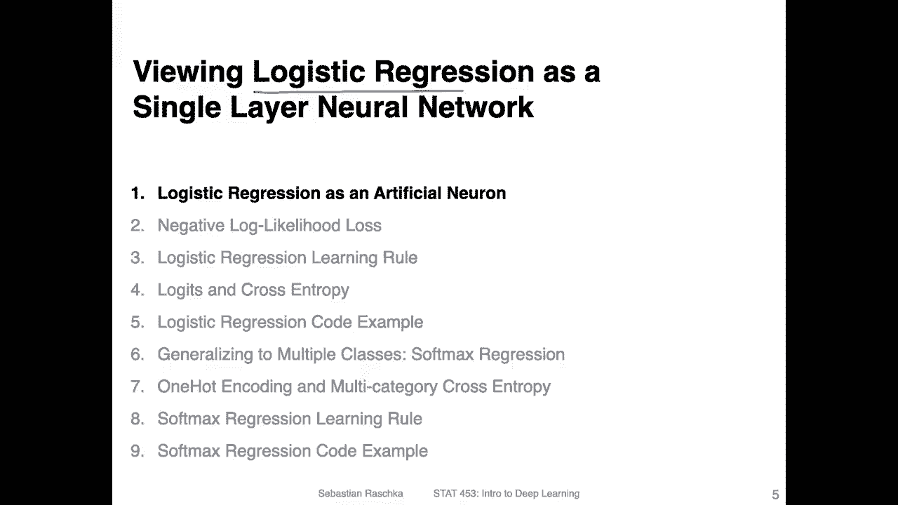
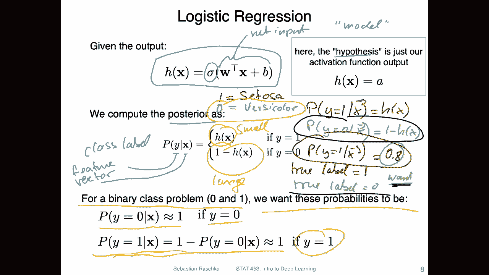

# 【双语字幕+资料下载】威斯康星 STAT453 ｜ 深度学习和生成模型导论(2021最新·完整版) - P51：L8.1- 逻辑回归作为单层神经网络 - ShowMeAI - BV1ub4y127jj

Alright， let's dive in into the topic of logistic regression by viewing it as a single layer neural network。

And yeah， this is why I emphasized the identity function in Adeline so much。

Because if we look at this figure here。This is a single layer neural network where we have the inputs x。

 the weights W， and then we compute the net input。Here and the activation here。

And then an output here where we， for example， could apply a threshold function。But for training。

 we can ignore the threshold function for training。

 we usually yeah use the output from the activation。

 So in add line this activation function was an identity function。So this was in Adeline。

And in Adeline， then we use the mean squared error as a loss function between we computed it between the activation and the true class tables。

So here a， this is the activation here， and then we had some true class ables y and computed the mean squared error。

 Now， the only difference really between a line and logistic regression is that we have a different activation function。

 So one difference is that we now use this logistic sigmoid function instead of the identity function。

 So in。A aline， again， we had yet just the identity function Z。 So input Z output Z。

 Now we have this。Non nonlinear function。 So this a nonlinear。Actation function。

I will show you in the next slides how it looks like。

And another difference between logistic regression and Adeline is that we now have a different loss function。

 I will cover the loss function in logistic regression in the next video。

 though so that we can keep this video a bit shorter。

Alright， so here is how the logistic sigmoid function looks like。

 So that's just from the previous slide。So what I showed you on the right hand side is this one I mean。

 there are two forms you can write it as usually this one is the more common form in deep learning or in deep learning context。

 we will be using this activation function also in the context of multilaycepttranslator So how you get from here to here oops from the left hand side to the right hand side is just by by dividing by E to the power of z。

 So if you divide this。By e to the above of z。You get the right hand because yep， this would be one。

 This would be one， and this part will be。E minus Z， right。Because。Of this relationship。 Alright， so。

Here how it looks like。 So we have the activation here plotted on the Y axis and the net input。

 which is passed to the activation function on the x axis。

 So this is really the input to the activation function here。And you can see that yeah。

 it's centered around0。 so it's centered around 0。 and if the input is 0。Then， the output will be。

Point5。And it saturates here at one。 So the maximum value is1 it approaches 1。

 and here on the other hand， it approaches 0。 So it's a function between0 and1。Alright。

 so but you can see you have to have very negative or very positive values。

 So this is yeah how this function looks like。

So yeah， I will explain to you how the logistic regression loss function works like in the next video here。

 I just wanted to summarize a few things， and it may be that you have to think a bit about this because it can look a little bit complicated at first glance。

 but essentially it's not that complicated。 So let me just use this notation here to summarize the logistic regression model where H you can think of it as the hypothesis in traditional machine learning or you can more simple terms Think of it as the model。

 This is our logistic regression model， which receives as input。Net input。

And then you have this logistic sigmoid activation function that I showed you in the previous slide。

Whi returns yeah a value between 0 and 1。 and you can actually think of this whole model here as a model that computes the posterior probability。

 the probability of class label Y， given a feature vector x。 So y is the class label。And x is the。

Pitchon。hoops， like to。So you can think of it as this and。Now， let's say we have。Yeah。

 we have class table。1， so let's， let's look at a concrete example。

 Let's consider the Iis data set where we have class Na1。S。Let's say it's a too。

Now for simplified case for a simplified scenario， think of it as a binary classification problem。

 we have。1 is thetosa and 0 S。Wy column， these two classes。Now。

If I want to compute the probability that a given feature vector belongs to Ctoa to class 1。

 I can write it as this P。Y equals， let's say one because it's shorter given x。

 And this is computed as。It's this one。 And the probability。Of y equals 0 is computed as x。

 which we can write as。1 minus h of x。So these are the feature vectors you these axis。No。😔，So。

Imagine the probability for the tourism。I。Pot8， then equivalently， the probability for。

Versy color would be point，2。Right， so if this is indeed true。

If the flower is indeed versica as a toer， then this would be actually pretty good。

 So let's say we assume we have a true label。Let's assume that。True label。It's， actually。Wen。

Then it would be actually pretty good to get a accuracy of 80%， the higher， the better though。

 so we want to actually have a high probability。But if the true label。Is 0。

 then a high probability would actually be bad if the。True label is0， what we want。

Is actually a high probability for。Pi。😔，Why， so I can just maybe use。Different colour。 what we want。

Here is we want to have a high probability for this case。 then if the true label is indeed0。

 then we want to have a 80%， maybe for this case。 So that is what I'm summarizing here at the bottom of this slide。

 So if we have a binary。Classification problem with possible class labels 0 and1。

 What we want is these probabilities to be close to one for the respective class。

 So if the class label， the true class label is 0， then we want the probability for y equals 0。

To be close to one。If the true label is one， then we want the probability for this scenario to be close to one。

So in this case， it's yeah， it's depending which probability we want to be maximized depends on the true label here。

 So we will look at that how， how we can do that with。Loss function in the next video。

 but this is like the basic setup。 So we want a high probability。Given， yeah， the certain class。

 So vice versa， we can also think of it like this if we have。Ass a tools are label。

We want this one to be large， which gives us the scenario for class1。 So if we have a sattoa。

Case make this one notch。Make this one。Small。However。

 let me go erase that because we don't have that much space。 if we have a true label， worthyy colour。

Then， make this one small。And make this one。Larch。So this is essentially what we want to achieve。

 and I will show you how we can do that in the next video。

