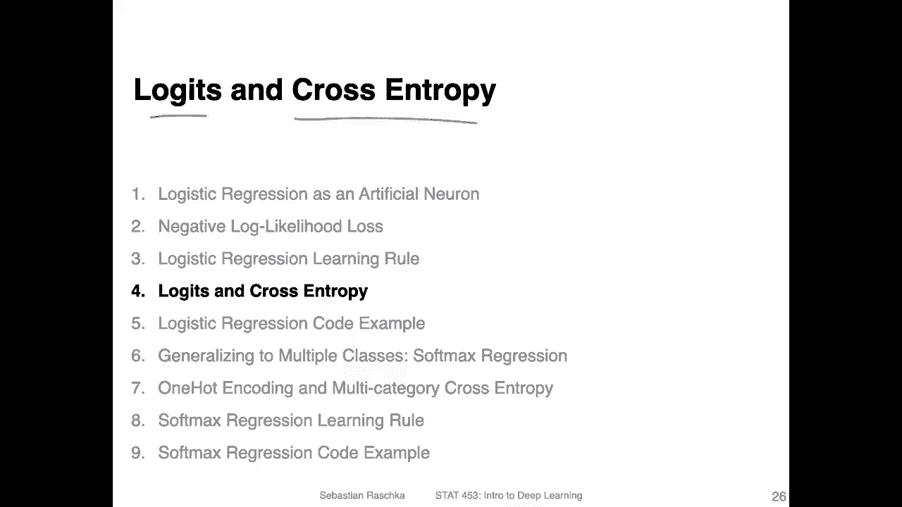
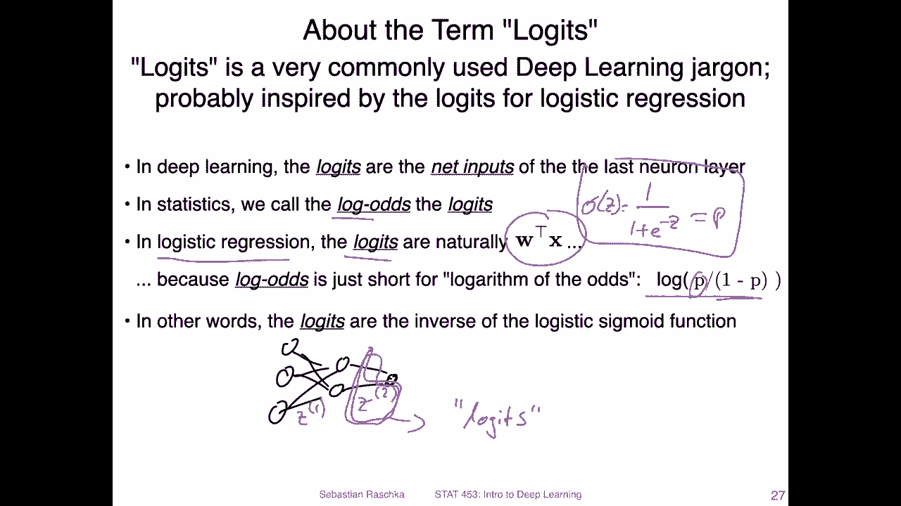
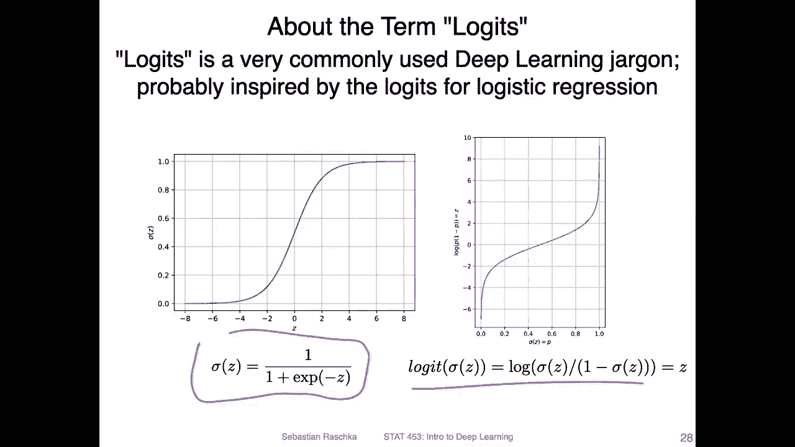
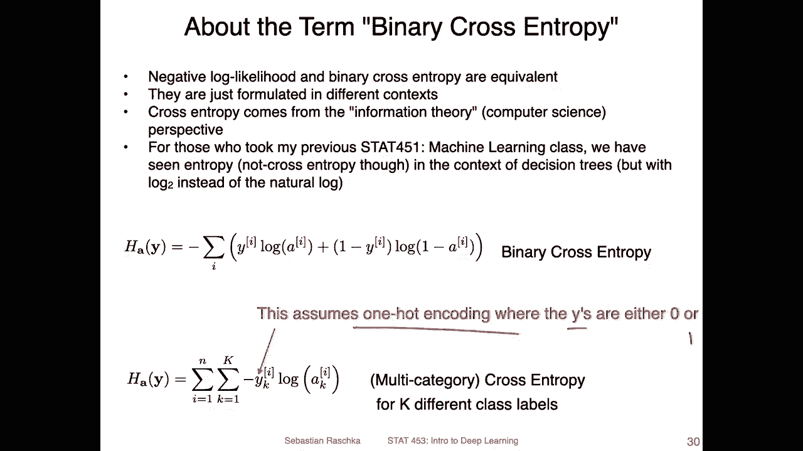
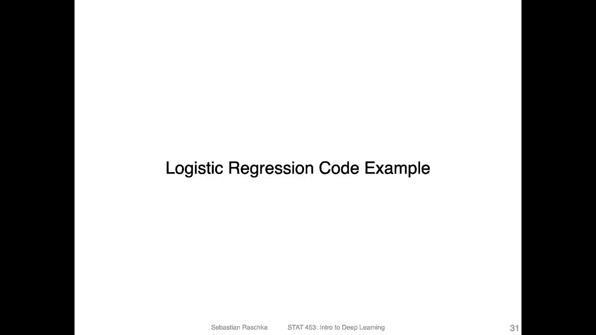

# 【双语字幕+资料下载】威斯康星 STAT453 ｜ 深度学习和生成模型导论(2021最新·完整版) - P54：L8.4- Logits 和交叉熵 - ShowMeAI - BV1ub4y127jj

Yeah， since we talked so much about logistic regression now I thought that might be a good opportunity now to introduce two terms logicits and cross entropy because that's what I will also use yeah quite often later in this class and that's because also it's a very common these are two common terms in the deep learning literature I sometimes refer to it as the deep learning jargon because yeah we sometimes use these terms a little bit differently in statistics compared to deep learning so I just wanted to briefly clarify how they relate to the concepts we just discussed if this doesn't make complete sense。

 I mean we will be using these terms later and you will then have something to refer back to。

Okay， so。In deep learning， when we have multi layerer neural networks that's say I will just draw a very simple one here。

We will actually talk about them on Thursday。 So if we have a multi layer perceptioncept like this。

Everything is connected to everything here。 It's a fully connected layer。

 And then we have this one output node and。In this network。

 we also have net inputs similar to Adeline or logistic regression， but now we have two net inputs。

 one is here， let's call that Z1 and one is here at Z2。 we will talk more about that on Thursday。

But yeah， indeed deep learning， it's very common to call this here the net inputs that come before the output to call them。

😔，The lodges。In statistics， the logics have a specific meaning。

 This is the logarithm of the odds or lockots。And。In the context of logistic regression。

 which we just covered， these los are naturally the net inputs。So where does that come from。

 This is the inverse of our logistic sigmite function。Oops。That someone。

Logistic sigitete function here。 just， I just abbreviated S P。 So the lock of P over 1 minus P。

 this function is the inverse of。This function。And yeah， so indeed deep learning， though。

It does not necessarily any relationship between the lock os and yeah the net inputs of the last there Its just like。

 I think it's derived。 the term is derived from logistic regression。

 People call that logicits in the context of logistic regression and then just generalize this wording to arbitrary multilayer perceptrons where we may not even have a sigmoid function。

 as we will see later。 So you can just think of it as the net inputs of the odd of the last layer basically。

So here here just for a reference。 So here on the left hand side。

 the logistic sigoid function and here on the right hand side， the logicit。

 So the logicit function is the inverse of the logistic sigoid function。

 So basically how it looks like。 I don't think I have to go into do that into that in much detail because we have seen that before。

 and this is essentially just flipped。

So there is another concept that is maybe a little bit confusing but it's exactly what we've covered before actually we had a seminar at UW last week where we also yeah it was briefly mentioned coincidentally there was like a question whether it's the same the negative log likelihood and cross entropy so yeah the negative log likelihood and the binary cross entropy equivalent and in practice in deep learning people just say cross entropy multicategory cross entropy which would be multi-class version of the negative log likelihood which we will cover later in this lecture when we talk about the softm function。

So。Just to keep it brief， the negative look likelihood that we just covered a few videos ago is the same as what people call the binary cross entropy。

 They were just formulated in different contexts。 So negative look likelihood comes more like from。

 I think it's like。It's probably from a statistics context。 I don't know the first paper。

Or reference that mentioned that。 But this is something usually I see in statistics papers and the binary cross entropy。

Thing has originated from the field of information theory。All computer science。

So we have actually seen that or not the cross entropy。

 but we have seen the self entropy or just entropy in statistics 4，5，1 for those who took this class。

In fall semester where we had used the entropy function in the context of the information theory and decision trees that we used the lock to instead of the natural algorithm。

 but yeah， it's kind of somewhat related if you have taken any class where you talked， for example。

 about the KL divergence。Or coolbe labla divergence。

 which measures the difference between two distributions。 The K L divergence is essentially。

The cross。Entropy。Mus the。Self entropy。Of course you don't have to know that it's just like a fun tidbit here the only thing you have to know is or should know because it's useful to know is that the negative look likelihood is the same as the binary cross entropy。

 this is like a useful thing to know and this is yeah what we've discussed in the previous videos and there is also a multicatego version that is the multicategory cross entropy which is just a generalization of the binary cross entropy to multiple classes。

So， in order to make that。Negative look likelihood or binary cross entropy work for multiple classes。

We assume a so-called one hot encoding where the class tables are either0 or one for some reason it was cut off here。

 But this is something we， of course， haven't discussed yet。 And if this doesn't make sense yet。

 we will actually discuss that after the logistic regression code example。

 when I will introduce the multinial logistic regression model。 So again。

 all I wanted to say here is the logicits and deep learning usually refer to the net inputs of the layer。

That just comes before the output。And the term binary cross entropy and negative look likelihood are essentially the same。

 All right， so in the next video I will show you a logistic regression code example。

 and then we will take a look at this multi category cross entropy。

