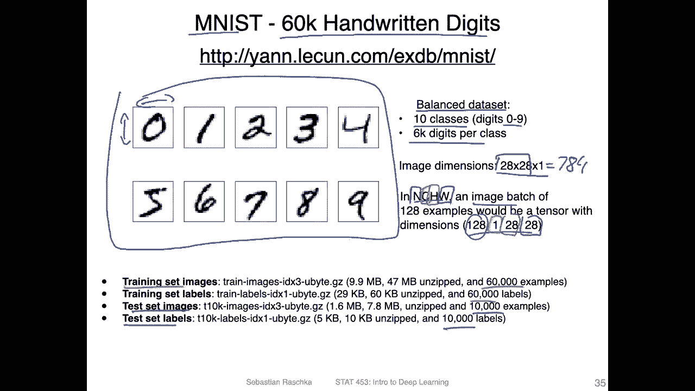
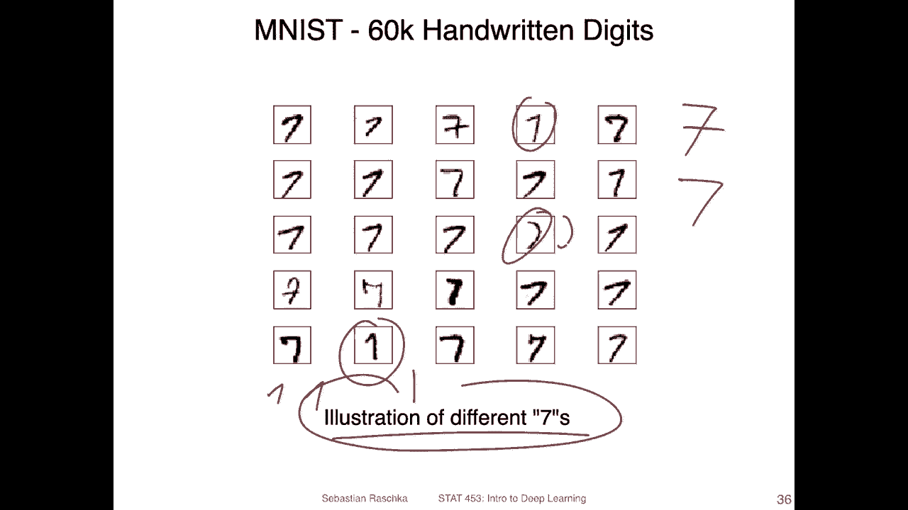
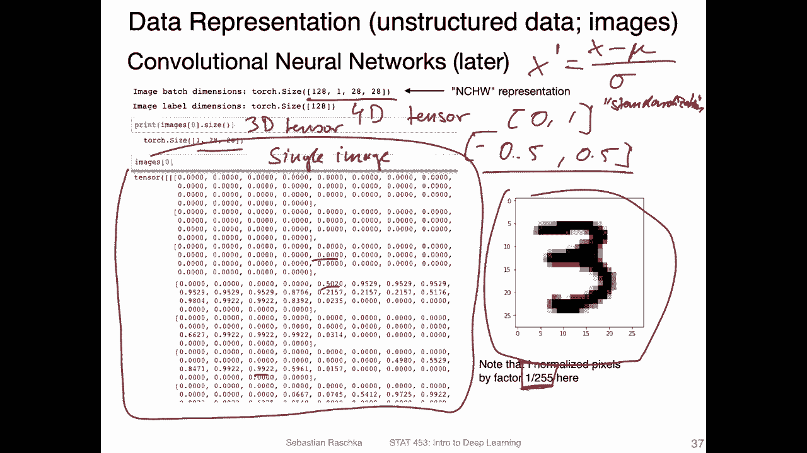
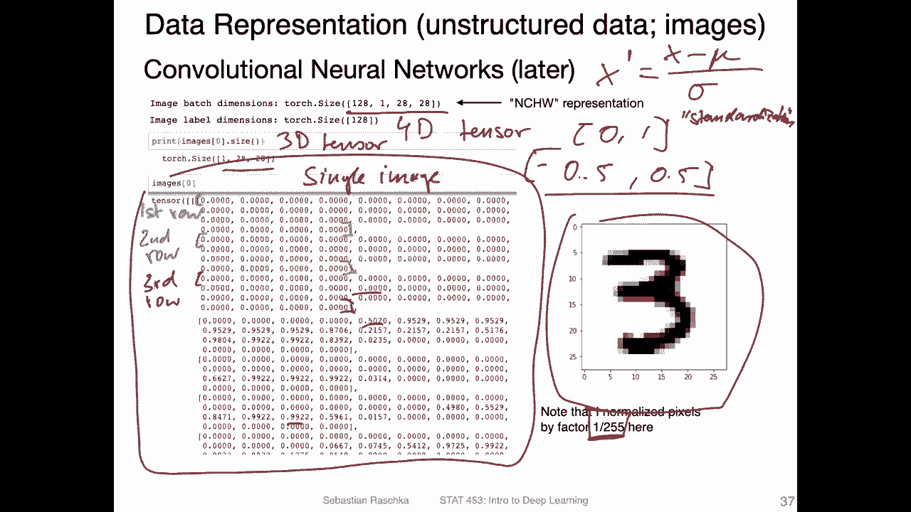
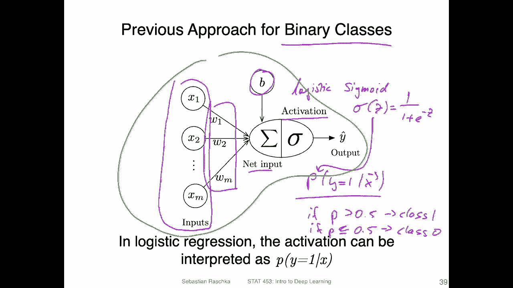
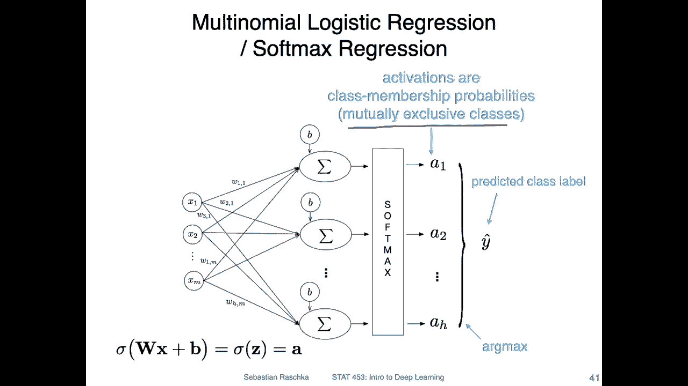

# 【双语字幕+资料下载】威斯康星 STAT453 ｜ 深度学习和生成模型导论(2021最新·完整版) - P56：L8.6- 多项 Logistic 回归／Softmax 回归 - ShowMeAI - BV1ub4y127jj

Yeah， let's now generalize the concept of logistic regression to multiple classes。

 This is also known as softmax regression or sometimes also called multiomial logistic regression。

So for this we will consider a relatively simple data set， the M list data set。

 I already introduced this in the introductory lectures， so these are 60。

00 hundredwritten digits in the training set。And yeah it's a nice and balanced data set。

 so balanced means that there's the same number of training examples per class。

 so in this case we have 10 classes， the handwritten digits0 to9 and there are 6000 digits per class。

 Here's an example of how these digits look like。And each of these training examples here。

Has an image dimension of 28 times 28 times 1。 So 28 for the height and 28 for the width。

 So this is the number of pixels。 So we have in total，784 pixels or features per training example。

In Pytch， we will be using a format so called N C HW。

 which is yeah how we represent a mini batch or an image batch。 So here。In this case。

 we have 128 examples in that mini batch， so the 128 is for this n here。

Then we have a colour channel。 We have only one colour channel because these are black and white images。

 So there are no red， green and blue colours。And then， we have。The height， so 28 pixels。

And for the width。We have also 28 pixels。 This is usually how we read in a data set into Pytorch。

 and we will be also looking at code examples for that。So yeah， just to recap。

 we have 60000 training examples。And then the corresponding labels， and then we have。

For the test images and test labels 10000 each。 so that's just how the dataset set looks like。Yeah。

 for softm regression， we will actually be concatenating。These images。

Or these features in the image to a long vector， like we discussed in the introductory lecture。

 So yeah， here's just an example of how。

Kind of diverse。 These handwritings are。 So these are all。The letter 7 sorry the number 7。

 So illustrations of different sevens。 So different people writing down a 7。

 and you can see it varies a lot。 So personally where I grew up in Germany。

 we usually write a 7 like this with this cross line here in the US。

 it's more common to write it like this， but you can see。

They are also very interesting flavors of this， for example， looks like a C almost here。

 this one is actually interesting because yeah in Germany， we write a one as follows like this。

 This is a one in Germany in the US one is usually written as this one So but you can see just by looking at these handwritings。

 it's sometimes maybe not even clear what the number is。

 So if I wouldn't tell you that these are different illustrations of7。

 Some people might think these might be once。 and yeah。

 this actually I don't even know it could be a C if you have data set of letters in digits。

 for example。

So yeah， like I mentioned in the context of Pythtor and when we work with unstructured data。

 also later with convolutional networks， we would be working with the format， the NCHW。As follows。

 So this would be。4 dimensional tensor。Think I introduced that in the first lecture of this course。

 so a long time ago。 So yeah， here's how it would look like in Pytorrch。

 where we have this four dimensional tensor。嗯。Actually， in this case， its a three dimensional ten。

 so I only represent one single image。That's a single image here at the bottom。

Representing the number three， and you can see there are different values from 0 to 0。5。

 I think the highest one would be approaching one。 and that is because I normalized。

These pixels by dividing them by 255。 And this is because， yeah。

 these values between or around 0 or in this case， between 0 and1 work better with gradient in decent。

 it would be even better， for example， to normalize these images such that they are centered at 0 so you can。

 for example， yeah， subtractor 0。5。 If you have the range between 0 and1， you can subtractor 0。

5 and then will be ranging between。inus。52。5And this would work even better。

 what people say that would work better with gradient in descent because now it's centered at0 and you can have positive and negative inputs equally。

 However， in practice， personally， I for these simple dataset sets， I don't notice a big difference。

 especially if we work with logistic regression。 Sometimes I put more effort into normalizing the input images。

 for example， doing the standard normal standardization the。What people call the st normal。Data。

 So it's giving your data the properties of a standard normal distribution。 But， of course。

 if your data is not normally distributed from begin with。

 it will also not be normally distributed after normalizing。 So what I mean is。For example。

 if you have， it's called that X prime， if you have a given feature。X。You subjecttract。

The mean of the feature and then divided by the standard deviation。

 So this would be called standardization。Well some people just call that ZCO normalization。嗯。

This is also recommended， we can do that here too， but since the images of the features。

 sorry the features are all equal， they are all from 0 to 25 255。For pixels。

 it wouldn't make a big difference with。We use yeah。

 this standardization or just scale them between the range minus 0。5 and 。5。

 So that's like a minor detail。

Alright， so but I am getting sidetracked here what I wanted to mention is the main point here is what we are doing now is we are concatenating。

 So if I go back we are concatenating the rows so。

If you consider。Fortunately， there's a line wrapping here if you consider this here as the first row。

Then I can maybe write this down first all。Os。First。😔，Ru。😔，Then。😔，Second。Ru。😔，Third。😔，R。😔。

And so forth， if we concatenate these rows， we get a one long vector here。

That's how it looks like。 So here I've concateated these rows。 just to illustrate this again。

 Let me jump back one more time。 So here in green， this would be really the first row on in this image here in blue。

 this would be。

Second row and the third row here in red would be this one。 if we concatenate them by that， I mean。

 if we make one long vector。 So the green one first， then。

The blue 1。And then the red one， we can use that as input for our logistic regression model。

 And in the case of the Ms data set， we have more than two classes。

 So we are going to use softmax regression。 Yeah， to just briefly recap on before I introduce the softmax model here is a drawing of the regular logistic regression model for the binary classification case。

 So as input， we have a feature vector。And then we have this weight vector。

 So we compute the dot product between the two at the bias unit， which gives us the net input。

 and then we put the net input through a non nonlinear activation function， the logistic。

Sick might function。Which we defined as follows。And。Then if so what it represents is the probability。

So this present represents the probability that a training example。Belongs to。Clas。One。

 if we wanted to compute the probability that it belongs to class 0， we can， yeah， we could。

We could compute it as。Oops。1 minus this， right。1 minus this probability。 This would give us。

The probability that it belongs to。Class 0。But back to this one here now。

 So we have a probability and。It belongs to class1。

 and then we can say if this probability is greater。F P is greater than 。5 than class。one。And。

If it's smaller， then。Pot5。Class。0。So how can we generalize this now to multiple classes so for that we can actually extend this model。

 so here is a drawing of a model that would work with a multiclass classification data where we have more than two classes so just to jump back one more time。

So this model here that I'm circling in green， this can actually be thought of as a model that is embedded in this bigger model here。

 So if we have the same inputs here， it's the same as before。

 our feature vector of dimensionality T M。

We can think of。Everything I'm drawing now in green。Ass the same model that I showed you before。

 right， So if you look at this， it's the same model。 I mean。

 it's of course a little bit skewed because these lines are a little bit different。

 but it's essentially the same model。 And so this would be one logistic regression model。

 And for that one， we have a feature vector。Of dimensionality M。 so we can have the feature vector。

 Let's write it one。1。Oops。it like this，1，1。1，2， and。We。😔，Let's say three if we have three classes。

So， if we have three features， let's do M to a bit more general。 So if we have M features。

 we have this feature vector here。And notice， no， I mean， we have。

Multiple of these logistic regression models。 The second model would be this one here， right。

 is's another logistic regression model， same inputs。And for this one。

 we can also have a feature vector for this one， we could have the feature vector。2，1。2，2 and2 m。

And then there's a third model here， right？So it's a third model。And for that。

 we also have a feature vector。 we can write it as on W3，1， W23，2 and W 3，3。So if I call this。

Feature vector， let's say let's call it W1。And this is。W2。And。😔，This is。W 3。Right。

 so I have now three feature vectors。 So if I。Stack them。 I can stack them to make a feature matrix。

 So this matrix here。 so I can write this matrix as。I think yeah， I would need to transpose this。😔。

So。We would have W1。Transpose。W 2。Tpose and。view3 transport。

So this would be my feature matrix of dimensionity H times M。

 where H is the number of output nodes here。So this would be one way I could generalize my logistic regression model。

Then we can yeah compute also the class membership probabilities here。

 However notice now the class membership probabilities work a little bit differently so because we don't have a binary classification problem now。

 but each node is still binary。 So here let's say green。

 this would be the probability that this is class 1。In blue。

 this is that probability that is class 2。But now each probability works like this。

That it is the probability that this is the class。 So the probability that is class 3 versus not being class 3 so。

What can happen is that or what will probably likely happen is that these probabilities don't sum up to one。

 So， for example， for a given input， if we have the digit 3， we may get a。Probability that this is。

Pot3， well， let's say。33%。But this is in class  one。That's a。40%。That this is class 2， and then。

70% that this is class 3。So。But yeah， these don't sum up to one。 So， for example。

 if the probability is 40% as is class 2， the probability that this is not class2 would be 60%。

And for this one， for the first one， the probability that it would be class。3 would be 67%。

In any case， these probabilities down some up to one。 if we also take a look at this one。

 these down some up to one， it can be a little bit weird。 So if we have a number。

 let's say the digit。3， how can it be 33%？Number one，40%， number two and 70% probability number3。

 it doesn't really。Make intuitive sense。I think。This would make sense if we have a data set when the classes are not mutually exclusive。

 for example， if you have something like a vehicle。

 there's a higher probability that an object in an image is a vehicle there's maybe also probability greater than 50% that this is a car and then maybe a probability。

 a certain probability that iss a certain brand of a car and so forth。

 So where we don't have mutually exclusive classes。

 but in the case of digits it would be more intuitive if these probabilitybil sum up to one and for that we have this multinoial logistic regression model or softmax regression model。

 So what I showed you in the previous case was more like a concatenation of individual logistic regression models here would be the real multinoial logistic regression model where we assume。

That the classes are mutually exclusive。 So what is the difference between this slide and the previous slide。

 So if I go back one more time in the previous slide。

It's hard to see now， but we had one sigmoid activation in each node here。

 So I'm getting rid now of this sigmoid activation。

And have a so called。Soft max activation。 And also notice that I'm drawing it a little bit differently before I was drawing it inside here because they were all independent from each other now。

The softmax activation is actually not independent for each node。

 So all the activation go into the same softmax activation。And then。Theres some computation going on。

 I will explain to you how that works in the next video and what comes out are these。

Activations that now sum up to one。 So these sum up to one。 So， for example。

 the first one may be 10% probability that it belongs to class 1。Then that might be 20%。

For class 2 and。70% for class 3 and so forth。And how can we then convert it into a class table。

 We would take the arc mix。 So the arc mix is。The position， the index position of the highest value。

 If I scan these three positions， let's say position。1， position 2。And position 3， the highest index。

70%。 This would be 3。 So this would return class A 3 if I apply the Archs。

If this is unclear we will walk through this step by step in the next video so this was just the introduction of how the softmax regression model looks like like it's basically here the concatetnation of individual logistic regression models and in the next videos we will talk about softmax and this arcmax and how we also compute the loss function。

