# 【双语字幕+资料下载】威斯康星 STAT453 ｜ 深度学习和生成模型导论(2021最新·完整版) - P57：L8.7.1- OneHot 编码和多类别交叉熵 - ShowMeAI - BV1ub4y127jj

Yeah， in the previous videos I showed you how the Somax regression model looks like。

 Now let's talk about the multi category cross entropy loss that we will need for training such a model。

And for that， we will also need the one hot encoding scheme for representing the class ables in a way that is compatible with a multi categoryeg cross entropys。

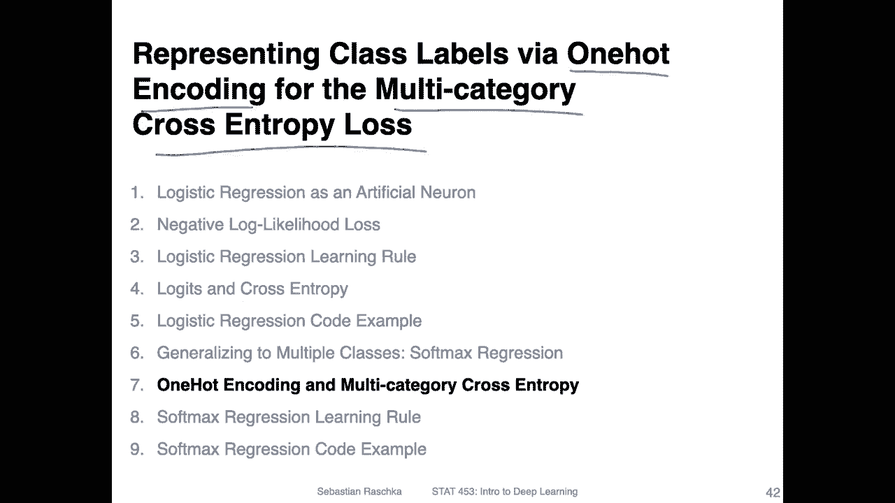

So yeah， this is just a recap a slide I already showed you in the previous video。

 It's how the basic setup looks like where we have an input feature vector。

 and then we have multiple sets of feature of sorry of weight vectors。

 we have multiple sets of weight vectors。 If we have H classes， we have H。Weight vectors。

 would wecombine into a matrix W。So we discussed that before。 I don't need to recap this， I think。

 But yeah， what we are focusing on now is how we。Computers softne activation that comes from these different net inputs。

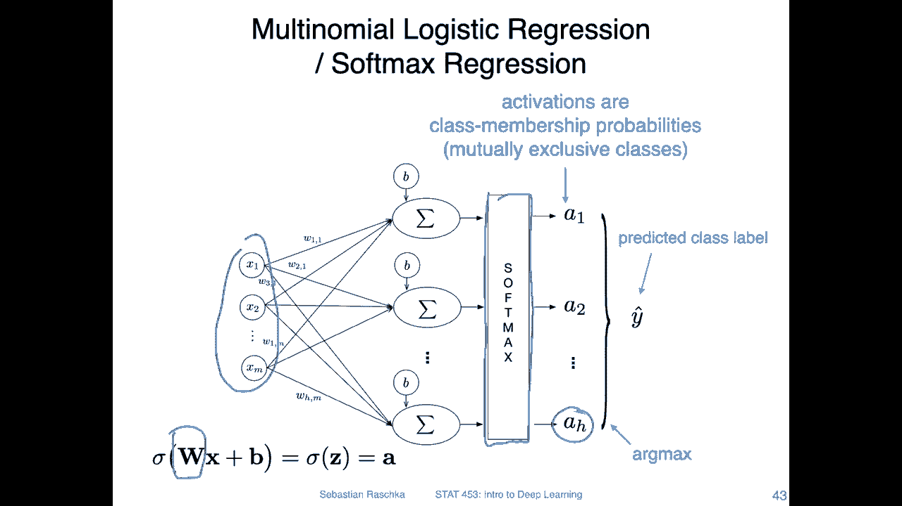

So here's an overview of how the Somax activation function looks like。

 It's fundamentally not very complicated。 It's essentially a normalization function。

 So it's in a way， you can think of it as a generalization of the logistic Sigoid function for making the probabilities to sum up to one。

So。Let's say we have a class A T， So the。Possible class tables are12 H。And。With a softm activation。

 we can compute the probability that a given output belongs to class T。So if I go back here。

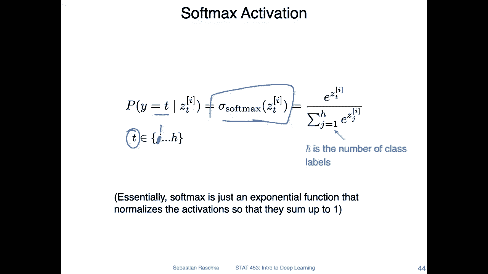

This is。It's say Z1， Z2 up to Z H。 We have H net inputs here。 And from that one。

 we can compute this a1， which is essentially the probability that。Class label belongs to class 1。

 given。The input vector to or here in this case， that's bright as as。Z1 is the net input。

 because here we have written this as a function， a softm activation function。

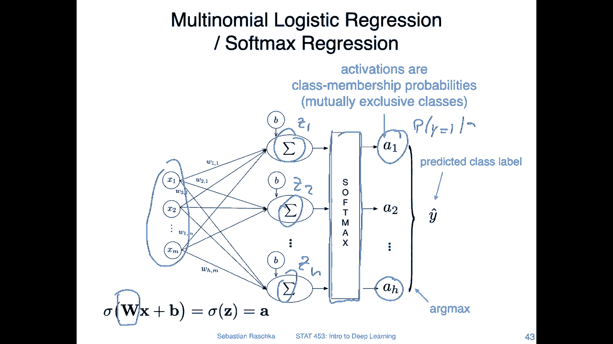

And how this works is there are two parts that it's essentially an exponential function。

 So you have E to the power of the net input as the numerator。 So I is the index。Over。The training。

Examples。And。Here in the numerator， we sum over all exponential terms so。嗯。

We have these exponential terms， J， also 12 H。And if we have H class tables。

 we have H activations and H net inputs。 So here we are summing over H sorry。

 J here we are summing from J to H。So this is yeah essentially a normalization term。

 So if we apply this the probability。Will be smaller than one between 0 and 1。

 And the probabilities from all the net inputs will sum up to  one。 so consequently。

If I go back one more time here， so the sum。Let me write this on the right hand side。

 the sum of all these。

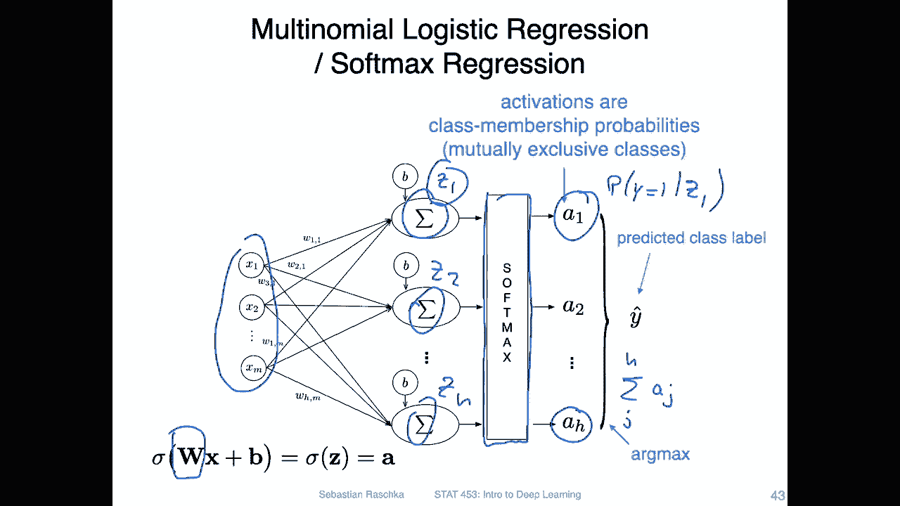

I。Should be one after this normalization function。So yeah。

 this is essentially how this softm activation works。

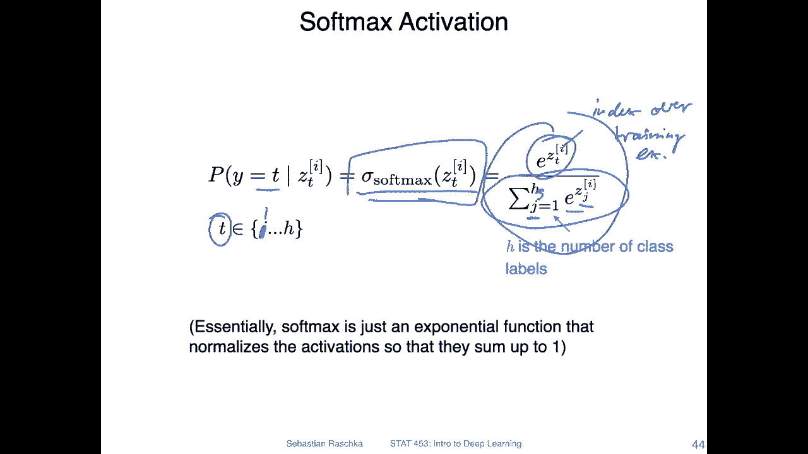

Now let's talk about the loss function。So before we can talk about the loss function。

 there's one more thing， we have to talk about the oneHt encoding。

 which is yeah an encoding scheme for categorical variables and we can also apply this to the class label variable So you can use that in different contexts。

 you can do that for encoding features。 you have probably seen that in the context of traditional machine learning。

 but yeah we can also apply this one hot encoding scheme to the class label variable or the class label vector。

 which is essentially also categorical variable。So imagine we have a data set that consists of yeah different class labels here。

 Each row represents one training example， So we have the first training example with class label 0。

 the second one with class label1 and class label 3 and then class label2 and the possible class tables are 3 So let's say we have class labels on。

in between， it's a set between os。0，1，2， and3 these are possible class labels。

Now we can convert this into a one hot encoding on the right hand side here。We have now。A column。

For each possible value， so class 0，1，2， and 3。And。Each row still represents one training example。

 So here this is still the first training example。 The second row is still the second training example。

 The third row is the third。 and this is the fourth。 I can maybe write this down。

So this still refers to the training examples， 1，2，3， and 4。And then。嗯。We can look at all these for。

Features here。 So for training example 1， let's focus on training example 1。

So training example1 has class A 0， right， So it has a one and indicator one in the column class 0 and all the other。

Columns are set to 0。 So here， this is a 0，0 and 0 because it's class 0。

 So the true class has a one in its position and the other ones are all 0。 And consequently。

 if we look at class number 2 here。That's why training example two。There this one has class A 1。

 and it has a one in the second column in belonging to class 1。And then。

Let's do one more third training example。 This is class 3。 It has a one here in the last column。

 So this is how the one hot encoding works。 You can think of it as an indicator variable。

 So you have like a one in the right column， and the other ones are 0。

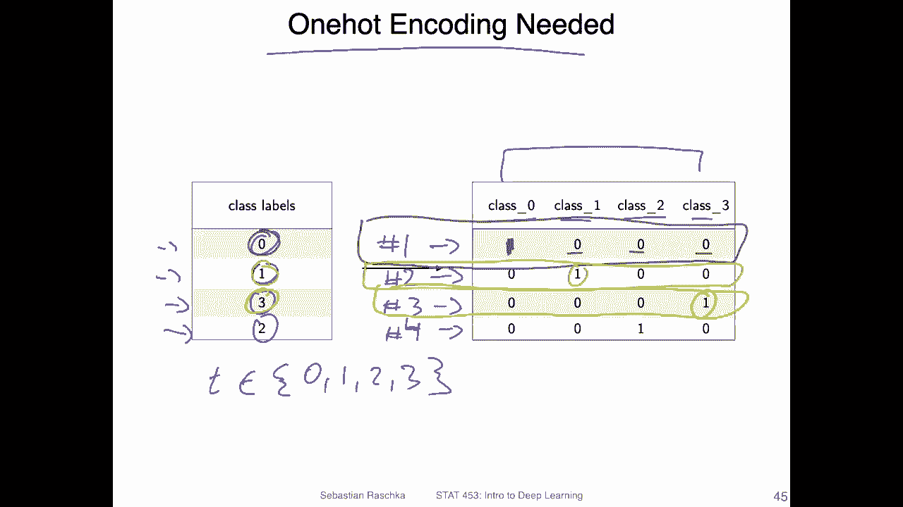

Yeah and here's now how the multicatego cross entropy looks like for the age different class labels。

 so we have class labels 12 H and essentially it's a generalization of the binary cross entropy。

 So if you recall the binary cross entropy is essentially the negative lock likelihood。

 which we discussed in the vast videos about logistic regression now so if you recall what we had was then。

This。Negative lock of the activation。 That's the same thing here。 So we also have a negative lock。

 But there's one more thing。 Now we have this Y I Y J here and the Y J。Is either one or0 right。

 according to the one hot encoding， this is either a1 or a 0。

 So this whole equation assumes a1 hot encoding。I will show you a concrete example in the next slide to further clarify that。

 but yeah， just to focus in on this overview here。Also， I， again， I is over the training examples。

 So let's only focus on this inner term here。 So what we have is we have for this y either a 1 or a 0。

And。Then we are， we are summing over this。Negative locks for these different activations。

 So the activations， each activation is a value。Between 0 and 1。 So we apply。

 So it should be actually larger than 0。 So we apply。Minus lock。Of this term between 0 and 1。

And then we sum over all of these for the output node， we have H output nodes and we sum over those。

So。If we use the one hott encoding， we have h classes， but only one class。

 the true label for one class is only one right， according to the one hot encoding。

 all the other ones are0。And I will clarify this with a concrete example because I think it's hard to visualize if you don't have a concrete example in mind。

 but yeah one more thing then here this first sum is then summing over the training examples。

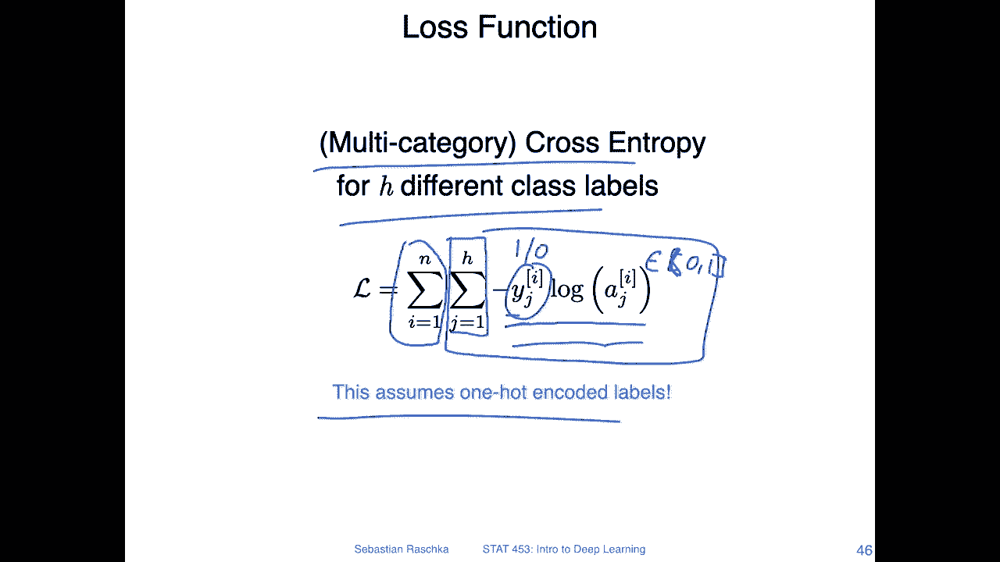

Alright， so let's take a look at a more concrete example。 or okay， I more slide in between。

 And then I will show you the concrete example。 So here's just the analogy to the binary cross entropy at the top。

 So at the top， you have the binary cross entropy。So yeah， you have also the negative term。

 like bring it inside， if you like。 So you have this negative term。

 negative cross negative look likelihood。 and this term is essentially the same as this term。

If the classable is one。Right， so this is a one。 this is a one that's the same。And this one。Is。

When we had a class table 0。 So if we have a class table 0， then we have1 minus-0， then this is a 1。

So essentially we have also this term here，1 minus a。

 we don't have that here here we have minus lock for all these classes。

 but essentially it's the same thing， it's just a generalization because if we have a 0。8 here。

For the activation， then we would have a 0。2 here for 1 minus the activation。

 right because I have to sum up to1。We set with a softm function。 it's the same thing。

 All the activations sum up to one。 So if we have。2 class labels，0 and1。

 If our class labels are either。0 and1。These equations are identical。Becauseuse。

It's just a different way of writing this here。 we write this as the sum but the sum is for binary classification。

 basically the sum between those two terms， so it's essentially exactly the same thing。

 but now with writing it like this using the one hot encoding we can generalize this to more than two classes。

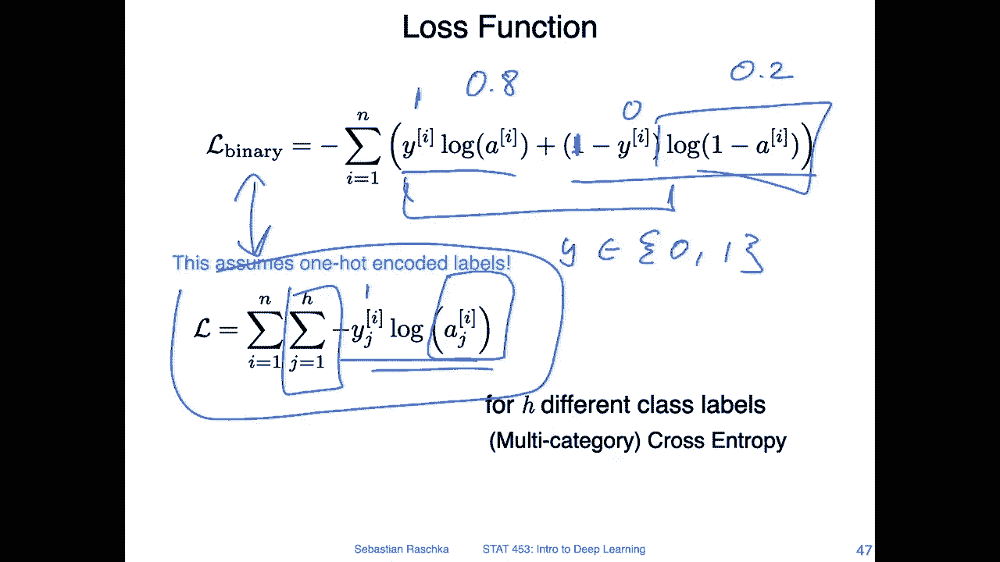

So here's a concrete example。So let's consider this example， where we have。1。Training examples。

Each row here represents one training example。Number one。But two。3 and。😔，Number4。

And the column index represents which class label it is。 So we have three possible classes。

 So the first column is。Class。1。Then this is class 2， and this is class 3。So we can see class 1。

 the true label is class sorry， training example 1， the true label is class 1。

Because the one is in the first column。 This one has the one in the second column。 So it's class。2。

 this should be class 3 because the one is in the third column， and this is also class 3。

Here on the right hand side， I generated some arbitrary softmax outputs。

So notice that all the columns should sum up to one。 So the sum of the columns。Should be one。

 in each case。You can double check this with a calculator。 if you like。

 they should all sum up to one because we have mutually exclusive classes。

 This is what we get when we apply the softm outputs。

 I will also show you a code example how we can actually compute that in Pytorch。

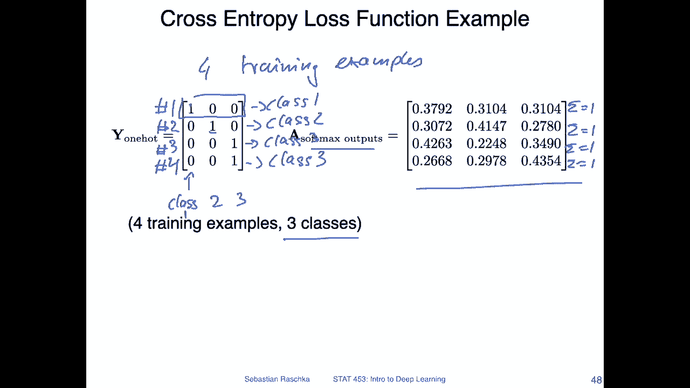

But let's continue with this example。So now let's compute the loss。So here at the bottom。

 so we are focusing， oh let's say we are focusing on the first training example。

 training example one。So this corresponds to this first row in the。Actation matrix。

And now what we are computing is， we are computing。The negative lock of the activation。So。Let me use。

Let me use blue here。 So we compute one。Times the lock of 0。37。And then 0 times the log of 0。31。

And0 times。31。So， this is what I'm。What I've written down here。 So -1。Times lock。嗯。3，7。

 and then the other terms here。So， this is。This is this one here that we are computing when we are summing。

For the first training example， we get a loss of 0。96。969692。

 So this is our loss for the first training example。

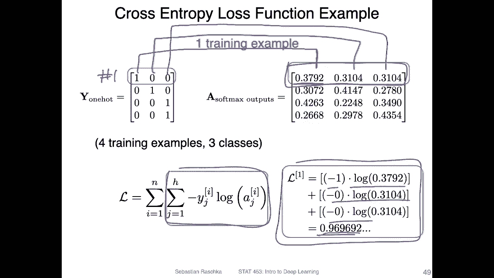

Okay， I hope that makes sense so we can then do the same thing for the other training examples。

 So here I use a color， a different color for each training example。So here。

 this one is computed here then。We have the red ones。For that。We have this box here， and then lastly。

For this role， we have this box here。 I don't have to go over the computation again， I think。

 because it's the same as for the first training example。

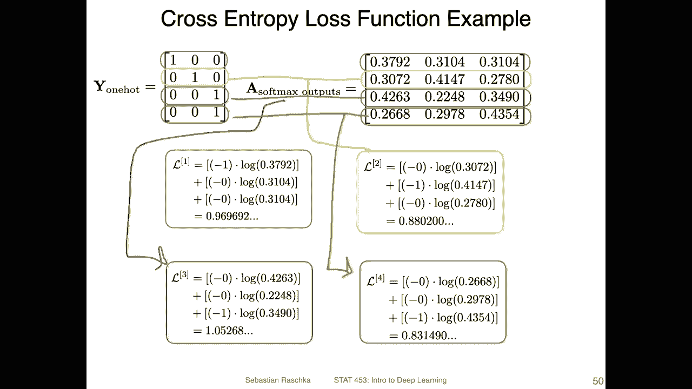

Yeah， and then one more step， we can put everything together。 So now the outer sum。

So we are summing overall。These losses here， and the sum。Of these is， sorry。

 it should be actually the mean， right。1 over。嗯。So， the mean 093。Otherwise。

 the sum would be four times that。Okay， so。Usually like I said。

 it's more stable in a deep learning context in practice if we compute the mean instead of the sum for the mini batch because then it's easier to find a good learning rate because let's say you find a good learning rate for a given mini batch and then you make the mini batch larger the loss will then be also if you make mini batch 10 times larger the loss will also be 10 times larger so you have to decrease the learning rate by a factor of 10 to get approximately the same performance so it's usually I find it easier to deal with the mean instead of the sum。

Okay， and yeah， I will show you now a code example how we can do this in Pythtorch。

 but this will be more like exactly what we have done in the slides and practice there are a few more tricks that will be the later shown when we talk about a Som implementation。

 but let me make a pause now and let me record this code example in a separate video because I think this video is probably already pretty long。

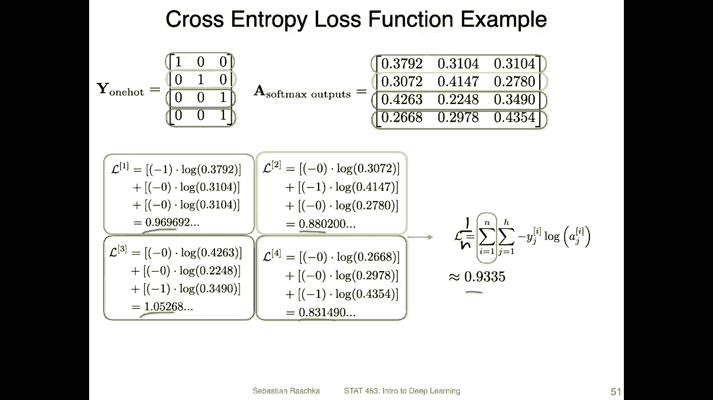

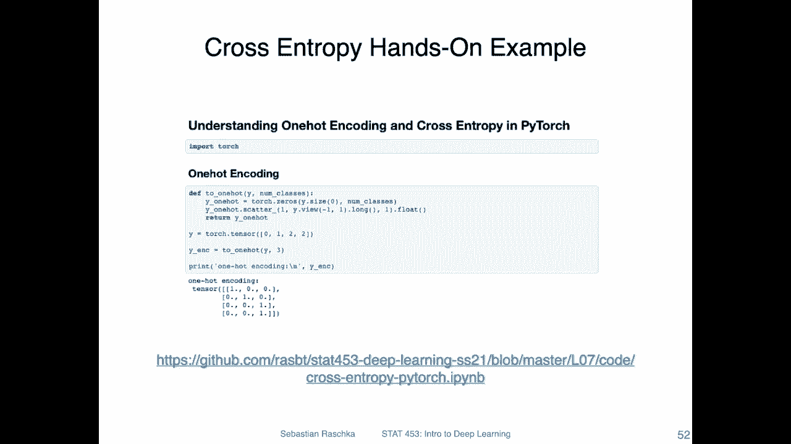