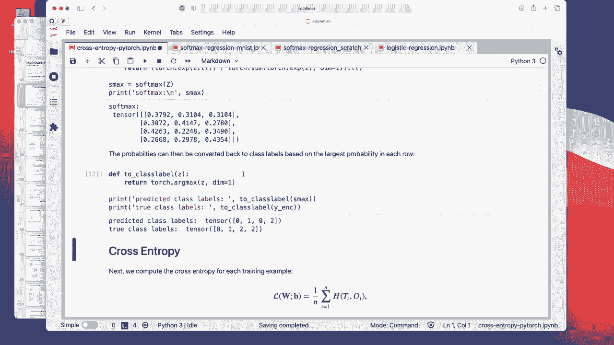
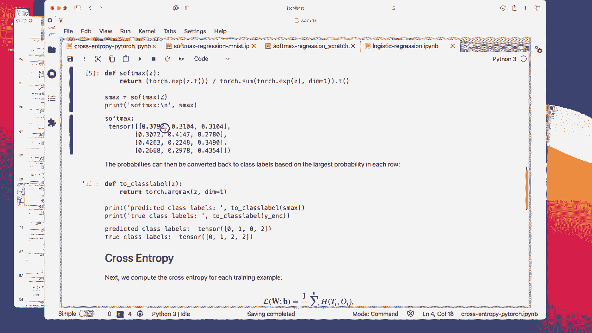
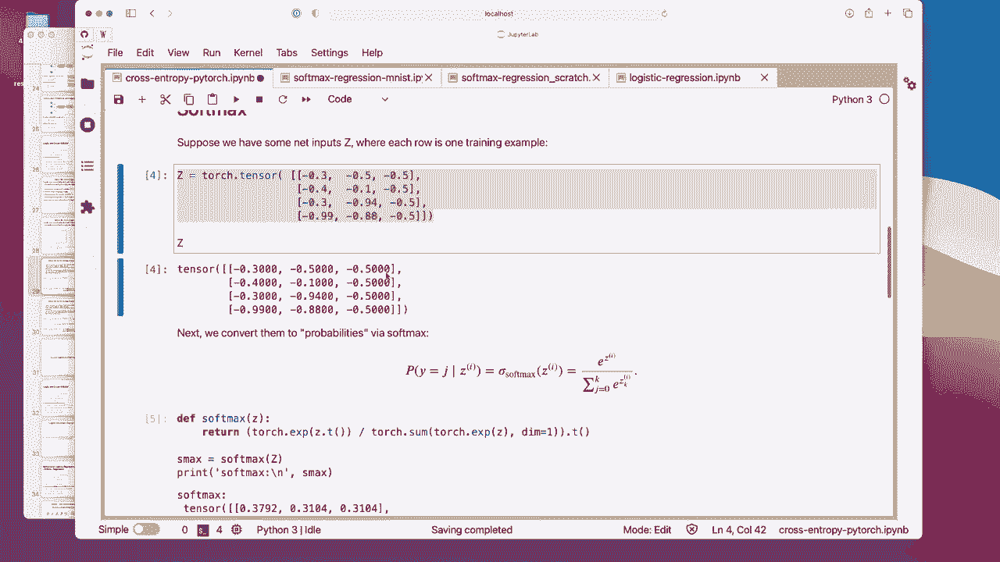

# 【双语字幕+资料下载】威斯康星 STAT453 ｜ 深度学习和生成模型导论(2021最新·完整版) - P58：L8.7.2- OneHot 编码和多类别交叉熵代码示例 - ShowMeAI - BV1ub4y127jj

Yeah， as promised， let me know show you a brief code example illustrating the concept of the cross entropy in code using Pytorch。

So I have prepared a notebook I will share it with you。 You can find the link， as usual on canvas。

Or here， just on Github。Me execute this just。

Regular boiler platelate。 So here I have a function for implementing the 1 hot encoding in Pytorch。

 It looks a little bit arbitrary with this scatter function。

I don't really need to go over this because I think there is no other context where I think this scatter function is really that useful so you don't have to really memorize how this works if you ever need a1 hot encoding yourself。

 you can just copy and paste this function It will do it for you and also。

When we do train a softm regression model later， I will show you also code example for that and the same for multilay perceptrons and so forth。

The loss functions in Pythwach， they already do the1 hot encoding for you。

 so you actually never have to worry about it yourself。

But if you ever have to do it yourself here you can just copy and paste this function。

 So this is just yeah how it works。 This is exactly the same example that I showed you on the slides where we have the class labels 0。

12 and 2。 and I have a total number of class labels here。

 This is the highest class label or the number of classes the same thing。

 So here we have three possible class labels right0，1 and2。

Also， note that your class labels should always start with 0。 So in this case， yeah。

 what we get back is for the four training examples here，4 rows。

 and each has this indicator whether it's。

This class， the one is denoting the class and 0 is， yeah， it's just the placeholder。

 So for the first training example， this represents class 0， class 1， class 2 and class 2。

Then here's this softmax activation。 Oh， sorry， this is actually the net inputs。 So this is。

AMatri of net inputs。 I created them just arbitrarily。

 So each row is again for each training example。 We have four training examples。

 So we have four rows。 and this is how our net inputs might look like。

So these are if I go maybe to the slides。

These are the net inputs here， these。And then now we have to apply this softm here。

 and then we get these activations。

So yes， just for reference how the softm function looks like。

And here's a code implementation of the softm function。So again。

 there is actually a soft mix in Pywach。 So you actually shouldn't use your own implementation because in the implementation Pywach is yeah。

 more efficient， faster。 it's more optimized， but it's here again to just illustrate how it works。

 So what we have is in the numerator this。

Poential term so。I'm going to go here E to the power of Z。 And then in the numerator。

 we sum over these exponential terms for all the activations。 If we have three classes。

 it will be a sum over。

3。

So that's what we have here。

Now let's do that。 So we have our Z here。 We have three classes，1，2，3 and four training examples， 1。

2，3，4。

So these are then the softm activations that yeah that we get back。

 Not that the columns should sum to one。Can just double check that。嗯。This。

So you can see they all sum to one。No， columns。

Looking good。 Allright， now just to illustrate how we get the class table。

 So if we look at this one again， I mentioned we have an arcm here。 arcm is you can think of it。

 Maybe I should demonstrate this。

It's giving you the position。哦。The highest value。So if I have an example。Let's say torch tensile。1，2。

3，4。 The archex would be the highest value。 So in this way， the archx should give me 0，1，2，3。

 the value 3。

嗯。Weird here， okay， what's going on？

Oh， okay， sorry。I I should。

4 yeah。 So yeah， I was just。Not paying attention。 Alright， so this gives me the value 3 as expected。

 So if I put。

A5 here， this would return 0 now because now the zeroth position has the highest value。

If you have a tie， I honestly don't know what happens when we have a tie。

 what I suspect is it will pick the first value， the lower value。Yep， that's exactly the case。

 So if we have a tie， it will always pick。

The lowest value。ok。So。

But yeah， in practice， it will be very unlikely that you have a tie here， I mean。Might happen， but。

 I mean， there could be something like this for the other classes where we have a tie。

 but usually it's， it's rare。

Alright， and this is， yeah， also only a tie because I put this as a tie。

 Usually it's very rare that you have exactly the same values because that means that the feature vectors look exactly the same。

And the vector that the weight vectors are exactly the same。

Allright。It'sConvers to class labels。 This is just to double check。

So。ThisThese were all true labels from the one encoding。

 is this just to double check that we that this one indeed converts back to this one。

And here， these are our predictions。 So we used the arc max to get the column with the highest probability。

 So we get this one。

This one。This one。 and this one。

And you can see there's one wrong prediction if we would compare those， right，0 and0。

 this is correct，1 and one is correct。Predicted class A 0。 The true label is2。 This is incorrect。

This one is correct。 So we make one mistake， actually。So it's also， I mean。

 I did this on purpose to show you how this whole thing works， because if we wouldn't make a mistake。

 we would get a loss of zero， which would be kind of boring， I think。

Alright， so yes， again， the cross entropy。 again， recall that there are two sums。

 So if I go back here。 So we have these two sums here， I kind of entangle them a little bit。

 So we have。

This is sum over the training examples。 And this one is the cross entropy for the。

10 en codingding。 So this one is the， you know。Not one here。So let's compute first the cross entro P。

For each training example， so。

What I'm doing here is， I'm computing these。

Terms。

I actually said that this loss will be zero， but that I don't know why I said that， the loss。

 even though you match the right class labels shouldn't be necessarily be zero except。

If your activations match exactly。Here one hot encoding matrix。

Because remember from the logistic regression lecture。

 we want to maximize the probability for the correct class。

 but it's only maximized if the probability is 100% right， so here even this is correct。

 even if 0 is the right class。 This is not 100% probability。 So here we still have a loss right。

 because it's minus lock 。37 just wanted to clarify， sorry， Where were we。

Yeah， so here for the training examples， the losses we get is 0。96。881。05 and 。83。 So this is。

Computing this one， really the inner loop。 So these correspond。

To these computations here。

Alright， so。

That is how we would implement this。Now， maybe I can just briefly show you also how that looks like。

 we are just taking the lock of these softm activations and then multiply it by the target。

 and remember the targets are just zeros and ones， right。

I didn't define it。 That's interesting。 Oh， it's in， sorry， it's。ItShould be。

 I'm calling it as y ink， which gets passed to Y target。 So let me。

Like this。 So it's zeros and ones。

So。I can maybe also print it if you and curious。 So this would would be。

One value and the other one should be zeros。

So one value and the other one zeros and each。Wron， there's only one。Value that is not0 in each row。

And then we are summing， we are just summing over this。 This is the auto sum here。 So the first row。

Would be 。68。So and so， Second row would be 0。88 then 1。05。 This is actually what we see here， right。

 So the summing is actually just selecting it's just selecting the yeah， the value here。

Okay。

Yeah， I'm cleaning this up here because when I upload this。

 so you have the clean version without my weird interjections here。 Alright， so in Pythrch。

There is a function called an L， L loss。Which。Takes the lock soft next as input。 So this function。

 the negative lock likelihood loss expects。

The lock of the softm values。 I'm just saying that we will use them in practice。

 We will actually use the cross entropy in practice。

 but I'm yet trying to explain how these functions and pythage work。

 So you can see this negative lock likelihood loss is the same as our cross entropy here。

Like， I explained in。

When we go up， I think I had a video on that in logics and cross entropy so。

Where I mentioned that the negative log likelihood and binary cross entropy equivalent in Pyr is's actually the negative log likelihood and the multicatery cross entropy equivalent I mean。

In a way， you can also think of it as a multi category 1。

 the multinial logistic regression then this would be still true。 So they are equivalent。

嗯。But notice it's really important to pay attention to this is that it takes the lock soft Max input。

So this might be counterintuitive because。There is aria lock inside， right。But。The Py version。

Does not perform this look here。 It expects that you perform at Flor pytorch。So。Pytorch， really。

Things you provide this serious input instead of the activation。

Just want to clarify this it's important to note because here we give the softm input。

Here we give the locks of nexus input。Right， because when I just give the softm input。

 I will get wrong results。 I will get some。I just luckily my glass was empty。 alright， sorry。

 So you notice that now we have negative values here right， So this is not what we want。

 So you have to pay attention that this is actually the lock。

I'm just emphasizing this because it's a common mistake in practice when people implement deep neural networks。

 they accidentally sometimes provide the wrong inputs and then get weird results and then the networks are not training。

In practice， actually， I recommend using this cross entropy function over the negative look likelihood function。

This is numerically more stable。 So if you train a deep neural networks。

 the gradients and everything will be more stable if you use that one。Mathematically。

Everything would be equivalent。If we use negative look like or cross entropy in Pythrarch。

 but numerically like stability wise on the computer， the cross entropy1 is more stable。

So and also for this one。Really pay attention to this one。 It's taking the los at as input。

 So it's taking our net inputs as input。 So here， again， this is our net input matrix。

When we compute the cross entropy， because we use the mathematical formulas。

 we compute first the softmax and then。

From the softm， we compute the cross entropy in Pytorch。

 they do all that work for us inside this function。 They do it for us。

 So here we give it the net inputs。

And you can see。Our function takes the softm， it gets the same results。

It's these other functions right， so they should be all identical。

 but in practice this is more stable， I recommend using this one。

And notice that I set reduction to none， which means it does not apply the sum or the average。

 which is this outer one here。

So by default， when you use this cross entropy。

It will perform the average you can test it like this， see it's the same same value。

If you wanted to， you can also say reduction to。Consider reduction to sum。sorry。这边X。

So you can see you can also do the sum， it's equivalent。

 but in practice I recommend using the mean because like I said。

 it's more stable in terms of choosing a good learning rate。

 it's easier to find a good learning rate if you use the mean compared to the sum。

Right， so this is like a core example of how all these types of losses and pagerotch work。

I recommend you just to play around with that。When we implement a softmax regression in a later video。

 I will use this function。 And also when we use later on。

 multilay perceptrons and convolution networks we will be using。

This function。 Allright， so in then in the next video。

 I will go over how we yeah compute the gradients for such mixed regression。

