# 【双语字幕+资料下载】威斯康星 STAT453 ｜ 深度学习和生成模型导论(2021最新·完整版) - P59：L8.8- 梯度下降的 Softmax 回归导数 - ShowMeAI - BV1ub4y127jj

All right， for the remaining two parts of this lecture。

 let's now talk about the Softmax regression learning rule with that I mean computing the gradient of the loss with respect to the weights and the bias unit so that we can then use gradient descent or stochastic gradient descent to train a softmax regression classifier。

And once we cover the big picture of how that works。

 we will then implement it in code and see how it works， actually。

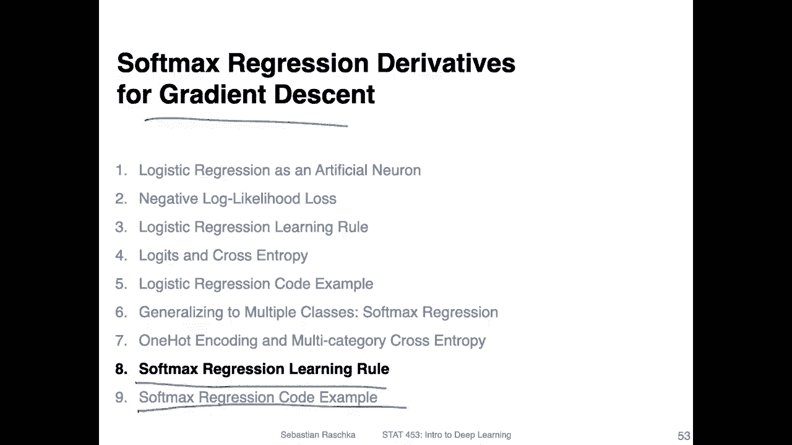

So the concept is actually the same as with Adeline and the logistic regression classifier that we talked about before。

 because yeah， also softm regression is still a single layer neural network。

 So what we have is or what we want first， what we want is。

The partial derivative of the loss with respect to a weight WI。

 or essentially also we can talk about the gradient of the loss with respect to the weight vector。

 that's what we ultimately want， but here it's just easier to write it as a partial derivative and then we will also or want to compute the partial derivative of the loss with respect to the bias unit。

So when we have these partial derivatives， we can then use srcchastic gradient in descent to update the weights。

 and it's the same as we've done it with adeline linear regression and logistic regression。

 So the same setup here， like I said， applies， we can use the chain rule。To， yeah。

 decompose this derivative into individual terms so we can compute the partial derivative of the loss with respect to the activation and then the partial derivative of the activation with respect to the net input and then the partial derivative of the net input with respect to weight W I。

The only difference here is compared to。The regular logistic regression is that we now。Have。

The softm。Actation。And just for reference in Adeline。We had an identity。Function as activation。

 and in the regular。Logistic。Togression。What we had was the sigmoid or， let's say the。Logistic。6ま。

As activation。 So the only thing that really changes is that we have now a different。

Acivation function and softm compared to what we've done before。 and then yeah also equivalently。

 we can compute the partial derivative of the loss with respect to the bias it's the same concept really。

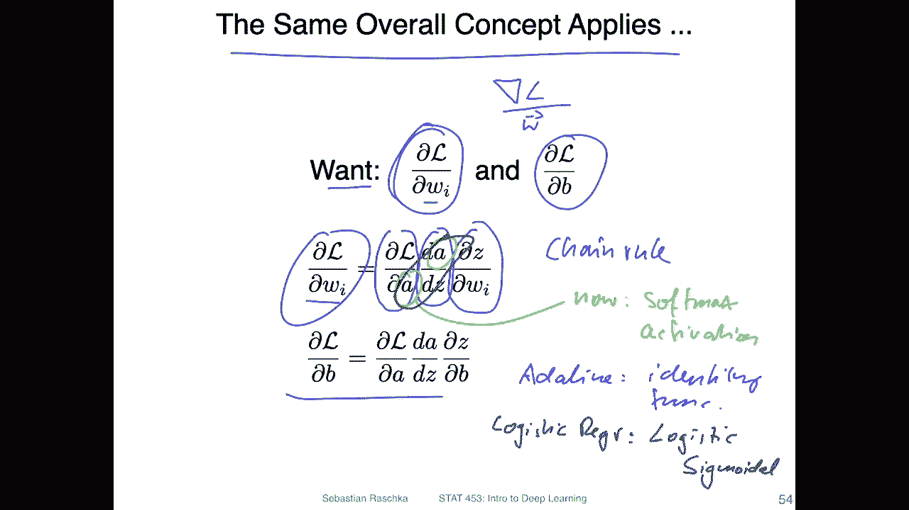

So here's a sketch of the computation graph of Som regression I always personally find it easy to think of a model if I look at a computation graph。

 I mean if you have a very large big model， of course you don't want to write all down all the units。

But a simplified version of the model， actually， I find usually helps in practice。

 So here notice that this is not。A multi layer neural network it。

 we will talk about the multi layer neural network in the next lecture。 So it's still one layer。

 and there is no hidden layer。 It may look like it， because。

What I did is I was drawing the net inputs as an intermediate step， usually when you later look at。

Yeah drawings of multi layerer neural networks。 the net input and the activation function are combined into one function or one node。

 actually。 So in that way， I was just writing those explicitly。 If I wanted to yeah illustrate。

A multi layer neural network， for example， a multi layerer perceptron with one hidden layer。

 Then I would have to add。Another， let's say， Z2 and a2。In between so before the loss basically。

 there would be another layer。 So yeah， so what I wanted to say is here we still only have one weight layer。

 So this is this one here， there is no additional weight layer in a multi layer case。

 we will talk about that in the next lecture， we will have another weight layer。So。

And here this would be where we apply the softmax activation。

 but notice that we don't have any weights here。 I was just drawing how it conceptually works。

 So remember from the softmax activation， what happens is that each activation that comes out of it depends on all inputs all that inputs because we have this normalization going on in Somax。

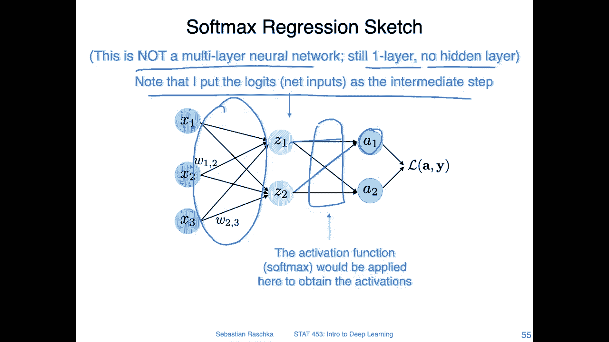

So yeah， then we can apply actually the multivari chain rule or we have to apply the multivariable chain rule because。

Let's consider the case where we want to compute the partial derivative of the weight W1，2。

This one here that I highlighted。 So if you look at it， so。What's involved here is x2。

This one goes into Z1。Z1 goes into a1 where on the softm。And then it goes to the loss。

 But you can also see it's connected to a2 because it's also involved in yeah， computing。

All the terms in the soft mix。 So there are multiple things。 now。

 all the blue ones that I circled that are involved in。The partial derivative of the loss。

 with respect to。W。1，2。 Alright， so for that， because there are no。Two parts， this a1 and this a2。

 we have to use the multivariable chain rule。 So for this upper part here。

 that's what I have here on the left hand side。 And for this lower part。

 this is what I have here on the right hand side。 It's essentially the same concept。

We compute a partial derivative of the loss with respect to the weight for the left part， its。

 we can thencompose it into the partial derivative of the loss with respect to a 1。

 A1 with respect to Z1 and Z1 with respect to W1，2 on the right hand side， the only difference。

Is here that instead of a1， I have a2 now。Right， because that's what， it's this path。

 So on the right hand side， we are looking really at。This path。And on the left hand side， we look at。

This path。Alright， so the derivatives， I was just writing them out here。

 I can actually walk you through this。 I yeah sketched that out in the next couple of slides。

 It actually took some time to yeah type this in latex， but。Then we will have it for reference so。

Here we have these three terms。The partial derivative of the loss with respect to the activation notice it's essentially the same except that we have here index 1 and here index 2。

 And here this is the partial derivative of the softm function with respect to。Then net input Z 1。

 And this is the pressure derivative of the software function with respect to。 Yeah， also Z 1， but。

Now， we have。The unit a2 here and here then unit a 1。Rightright。

 so maybe let's go through this in the next couple of slides。 I've sketched this out。

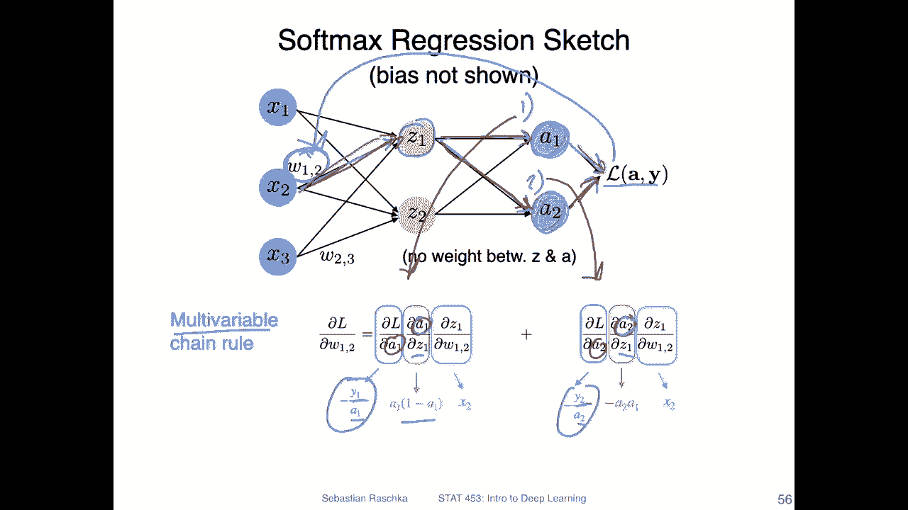

Yeah， let's start from the left hand side。 So what we have is the partial derivative of the loss with respect to a1。

 So the loss， if you recall， that's the multi categoryeg cross entropy here for just one training example。

 So I'm omitting the auto sum。 So we are just looking at the。Some over the class labels。

 class labels。嗯。J equals 1，2。H。And yeah， this is just the multi category cross entropis。

 And notice now。That， yeah， there is a sum over the labels， the true labels Y J and A J。

 And if I just look at the partial derivative of a with respect to one， all these terms will be。0。

 right， because then these will be constants。 There will be all constants， except for the case。

 of course， where we have a1。 So what I can do is I can just drop the sum， right， So。

 and this can be then a 1。Right， and yeah， what is the derivative then of， let's say。

 if we have something like log x， the derivative of this one。Would be one over x， right？

 So in the same way。If I take the partial derivative of this whole term here。

 this one is yeah is a scaling value here。 And then this one。

 the derivative of this part is one over a1。 So my derivative of this term is。Y1 over a1。

 And similarly， I could do the same thing for this part here。 for this part， it would be。

The same thing， except that we have no index  too， because。I mean， if you look at the left hand side。

 this would be the same。And what remains is really only the part with the index 2。

 we can also cancel the sum。 So this is how we get this partial derivative。

 And I should also say this is the last time I will really torture you with this one。

 because and the upcoming lectures next week when we talk about the multilay perceptionceptron。

 we don't want to walk through this every time because it's really just the same concept。

 So this is really the last time I'm doing it in detail。Data in this course， we， yeah。

 we will move at a faster pace and omit these types of details because this is， I think， really。

Good to understand once， but we don't have to do it every time because there are more interesting things to cover。

 like， yeah， multi perceptionceptron， finding good learning rates。

 optimizeims and convolution networks and recovery networks and so forth。 So， yeah。

 So if this is boring， it will be over in five minutes。

 And then we will move on to more exciting parts。

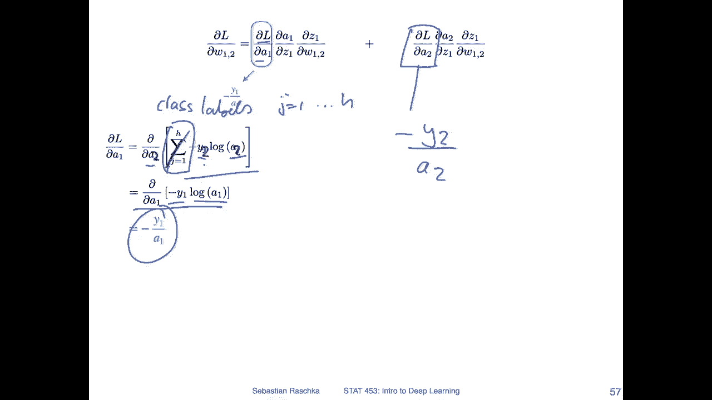

Yeah， now the second part， so this is slightly more yeah involved but also not that complicated so that's yeah look at the partial derivative of the softm unit a1 with respect to z1。

So， yeah， just spelling it out。 So this is， again， our softm activation。

 So here we are looking at the softm activation for Z。See one。

 and remember that we are summing over all the other units here for normalization。So for that。

 we have now。Quotient， so we have to use the quotient rule。So I've added it here for reference。

 So in that way， it's easy， or I find it easy to think of this as。F x， and this one is。G X。

 and then we can apply this rule here， so。LetWe delete this again because otherwise it's too crowded here。

OrMaybe it's fine。Let's say just F and this is G。So what we have is g times F prime。So。

Essentially bringing this one here， and then F prime。I。This part。

And then on the left on the right hand side， we do。F， so this part。Times the derivative of this part。

 G prime， and then divided by G squared here。Alright， so if we look at this。

 now we can simplify certain things， right， So if we look at this。

 we have here the partial the root of of。The exponential term。With respect to Z1。 So this， yeah。

 just cancels it right because the partial derivative of or the derivative of。

E to the power of something is E to the power of something。

 So this simplifies on the right hand side， same as on the previous slide。

 we have a partial derivative with respect to Z1。 We have this sum here。

 but we can cancel the sum because all the other terms will be， yeah zeros， because except for Z1。

 we can treat them as constants。So this goes away。 So if we cancel this sum and we cancel this one。

 what remains is this very simple。Term now。 So with that。

 we can now factorize this because note that we have a E to the pod Z1 here and here2。

 So we can bring that outside here。 So we just。Move that outside。

And then if we look at this so we can take the left part so we can。

Okay I say that so we can take this part without the square。 This is actually again， this is a w。

Softm for easy one。Right， so that is what I have written here on the left hand side。

 And then what remains on the right hand side is this term。 And now， if I divide this term by。

What I have here in the square brackets， if I divide by the sum of over E Z J。

 then this one will become one。 This one will become one。 and this is has then the division by this。

Some term。Right， so which is essentially1 minus the activation 1。So this is a 1。

 and this will be 1 minus a1。 And then if I put them together， I end up with this term。

 So it's actually not that complicated。

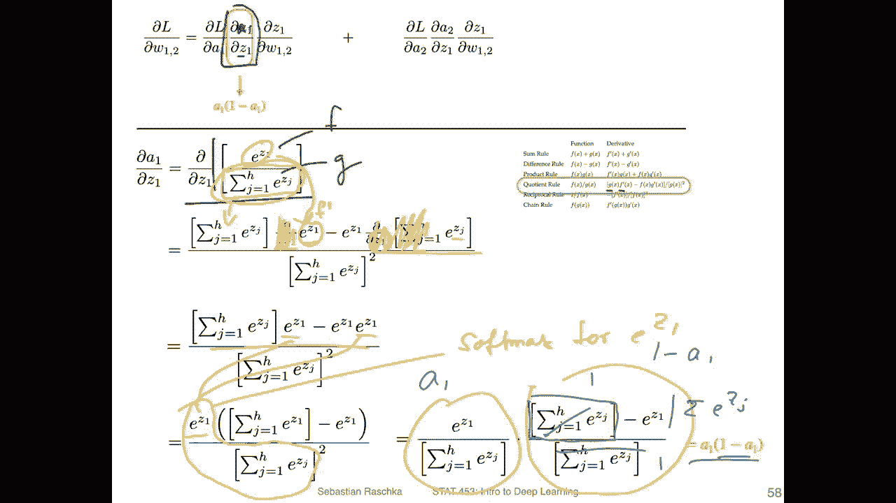

We can also do the same thing then for this second term here on the right hand side。So again。

 the same concept applies。 It's still a quotient。 The only difference is now that we have E Z1 here and E Z2 here。

Cause we are looking at a2。 But yeah， we can do the same thing using the quotient rule。

 So I don't want to have to walk through this， I think。 But yeah， notice here。

That this term will be 0 because we are looking at the partial derivative of z1 with respect to sorry。

 of the partial derivative of this per term with respect to Z1。 But since we have E Z2 here。

 this is actually constant。 So this whole thing becomes 0 and 0 times this one will also still be 0。

 So this simplifies here a lot。And on the right hand side， because we are looking at the1。

Partly derivativeive with respect to Z1， this one。Simplifies the partial derivative。Simplifies to。

E the one。And we have E Z2 times E Z1。 So this way we have this as the second activation and this as the first activation。

 so。In that way， we also have a very simple derivative。

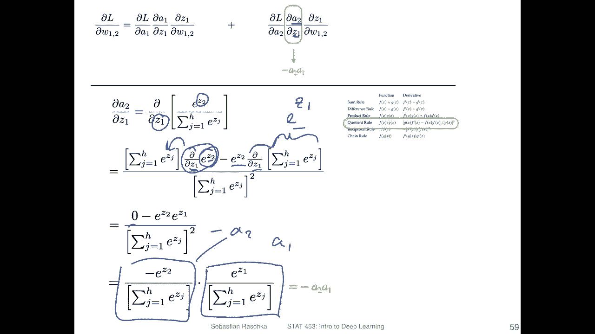

Yeah， and so lastly， the last term is the partial derivative of the net input with respect to one of the weights。

 W12。 And yeah， I think you have seen that many， many times in the context of adeline and logistic regression。

 So I don't have to tell you how we get the yet derivative of x 2 in this case。 All right， so。

 but now we have all three parts， right， So we have。

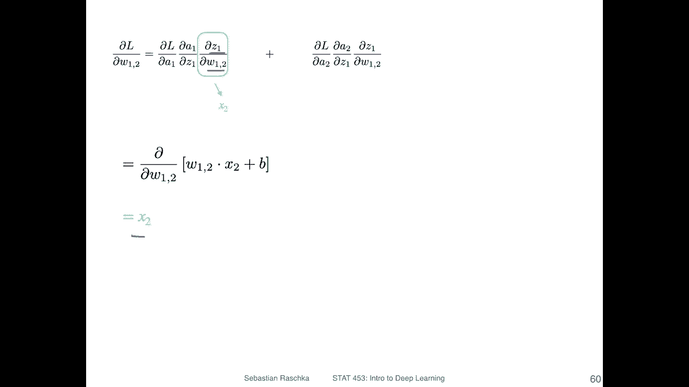

This part， this part and this part and also the same thing on the right hand side。

 So we can actually put all things together， so。This part let me just show this in different colors。

And。This part then the same thing on the right hand side so we can put them all together。

 And if you walk through this little thing here I did。

 you will see that this actually simplifies to a very， very simple learning rule。

 So if we put everything together。We have a very simple learning rule， which is。

This label for class 1 minus a1 times x2。 And this is something you may yeah。

 remember from Adeline or logistic regression。 It's exactly the same learning rule。

 except now So of the differences in logistic regression we just brought it as。Forllos where we。

 we didn't have an index， right， because we didn't have multiple units and we didn't have a one hot encoding。

 In this case， we have these different units。But except that it's exactly the same learning rule。

 It's a super simple learning rule， and it is also showing that softm regression or the softm activation works very well with the cross entropis。

Later we will also take take a look at multilayer proceptrons and you could actually combine softmax regression sorry Somax activation with a mean squared error loss it's totally fine to do that but the derivative will not be so nice that these terms cancel so this is actually I think a very nice combination because if we have such a simple partial derivative term it's easy to implement in code and it's numerically also more stable compared to yeah longer equations。

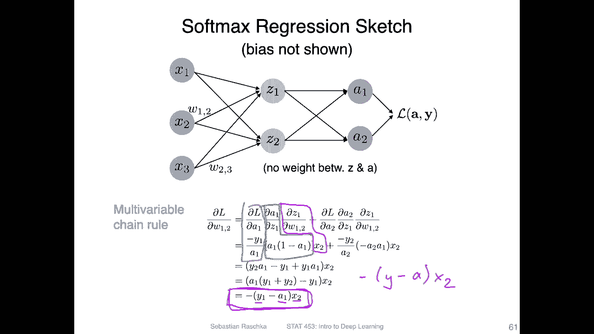

Yeah and lastly， we can also write this more compactly using linear algebra。

 so on the left hand side is what I have showed you on the previous slide so we can implement this learning rule instead of writing it as a partial derivative with respect to one of the weights we can write this compactly。

As the gradient of the loss with respect to the weight and we can write this as shown here where yeah。

 this is a capital W。 So this is really with respect to all the weights and we can write this with the design matrix here。

 the one hot encoded matrix So the design matrix is an n times M matrix know that we use a transpose snow So it's n times n。

And here this one， this would be the one hot encoded matrix。

 which is n times H where H is our number of class tables。 So in this case， H equals 2。

And a has the same yet dimension as Y。 So it's also n times H。 Yeah， why this is true。

 It's a little bit maybe not so obvious to see。 So I recommend maybe sketching this out if this is confusing。

 but also in practice how I would implement something like that is I would go in my code implement this one here with very simple。

 let's say Python 4 loops make sure that it works and then translate the four loops into dot products and matrix modifications。

 So this is really more complicated。 Also I find this sometimes really hard to do in practice。

 And this is also。Yeah， why I kind of admire people who did research in the 1980s and 1990s before。

 or maybe even the 2000s before there were tools like Pytor before we could compute these gradients automatically。

 So it's actually not so easy to do。 I mean， to implement this efficiently。

 So I have actually great respect for everyone who did that by hand back in the day。 So yeah。

 nowadays， we do this all automatically。 So。

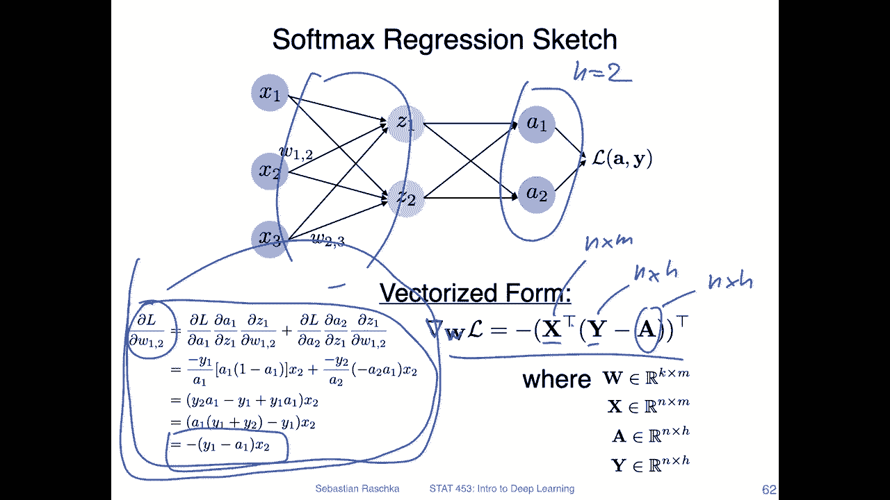

We will actually see that this， what I showed you actually works if I implement it in code。

 but then also show you that it gives the same results as Pytorch's AutoGd API。

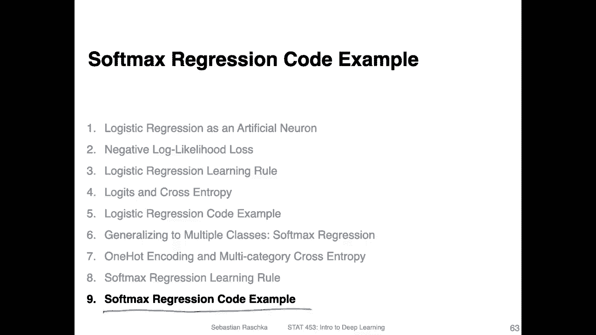