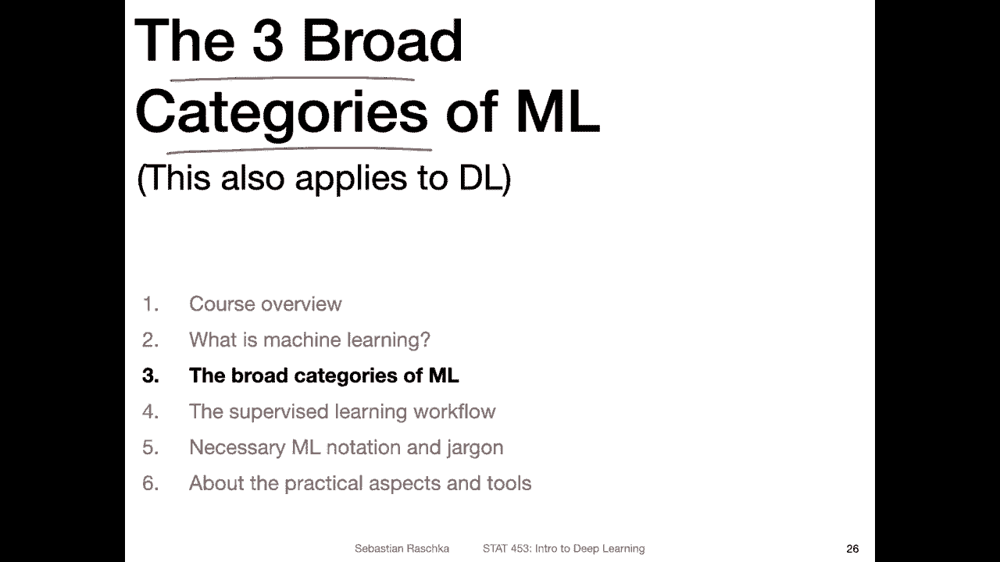
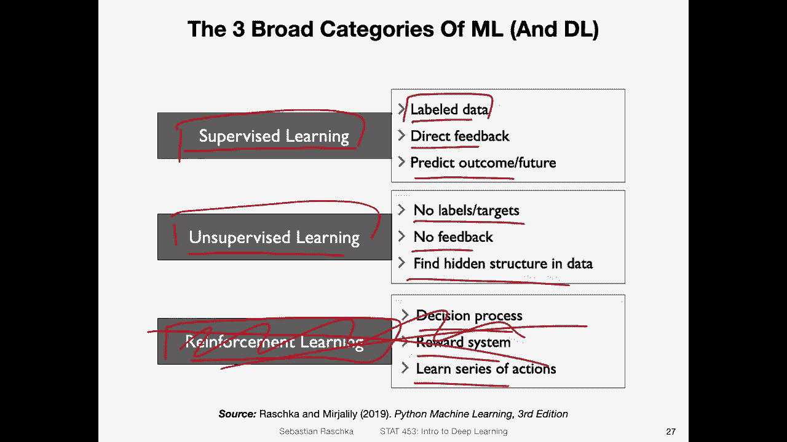
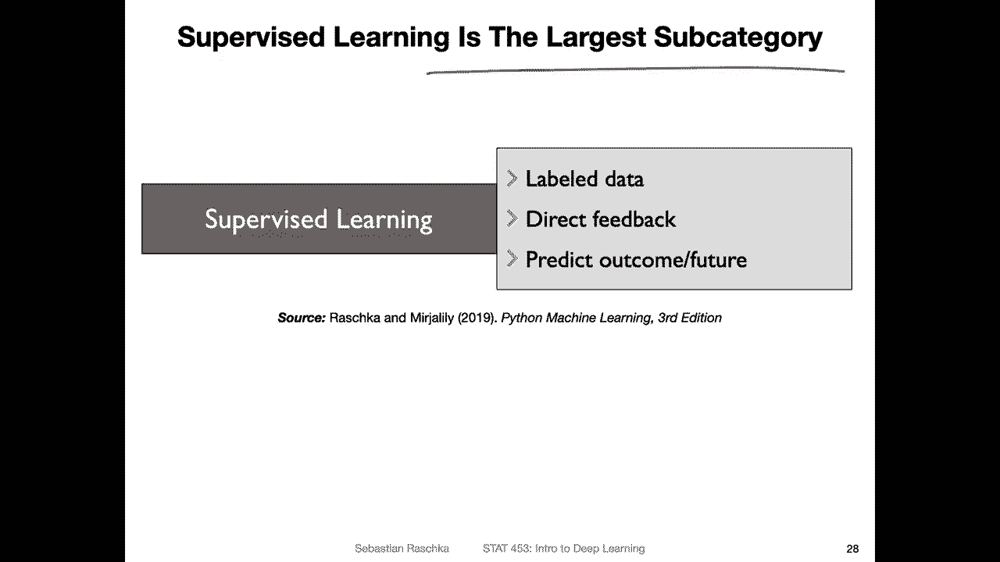
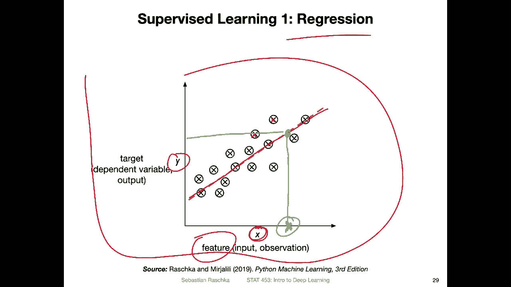
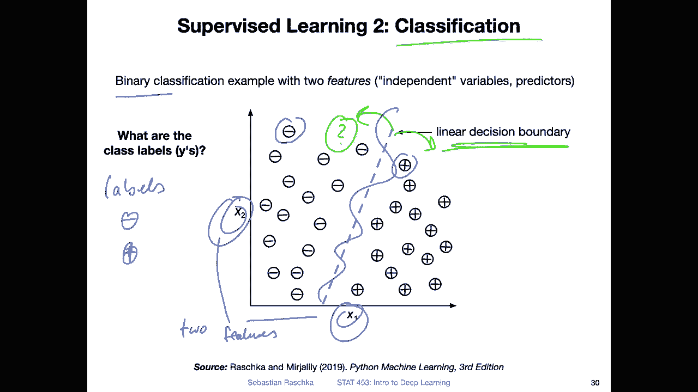
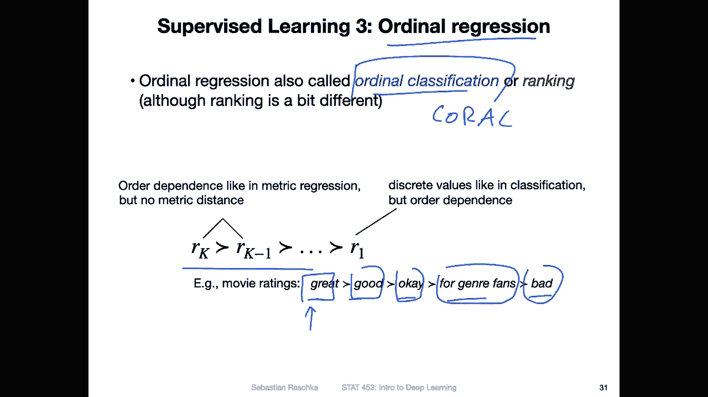
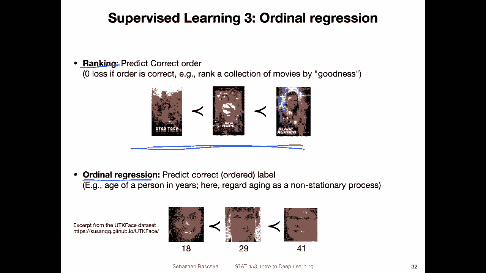
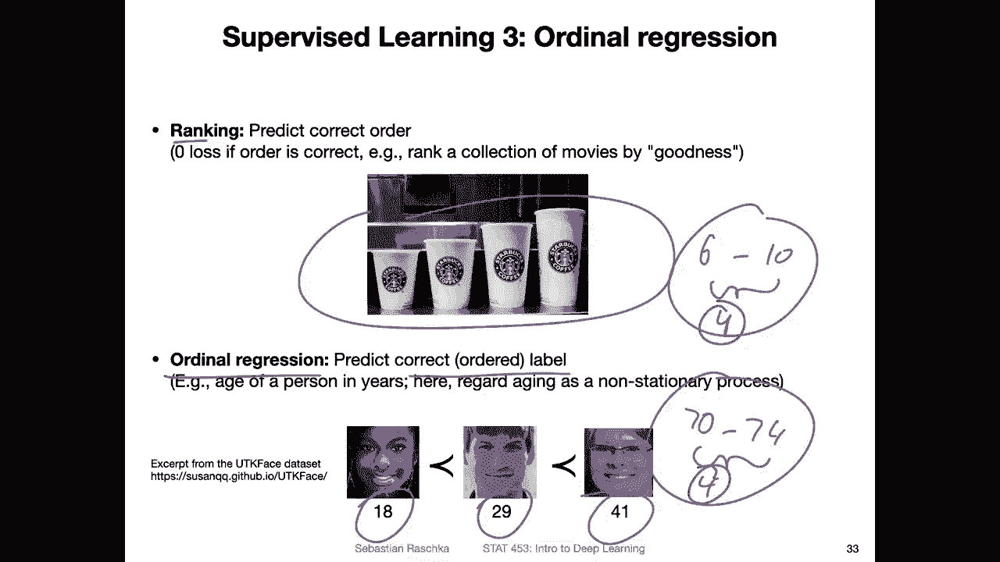
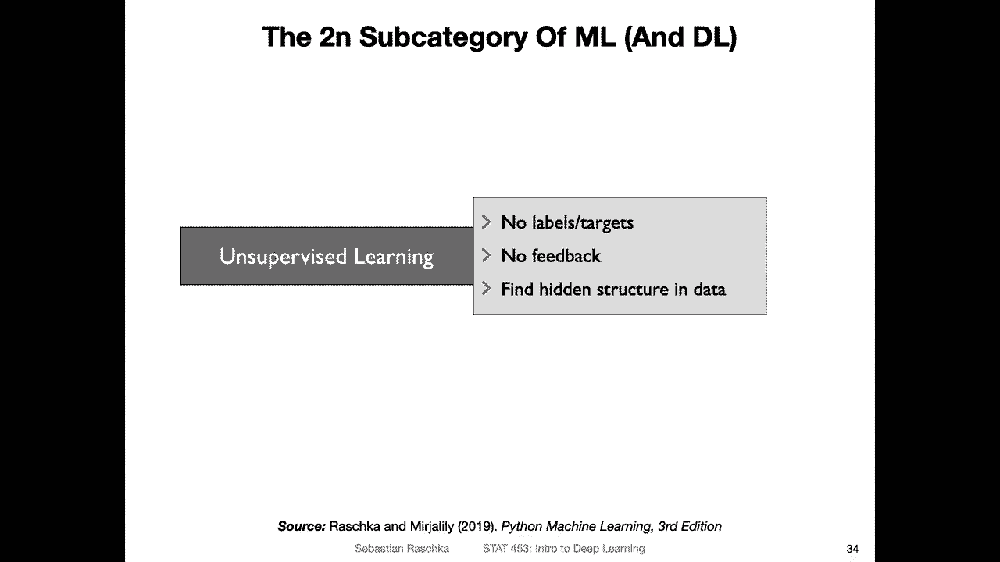

# 【双语字幕+资料下载】威斯康星 STAT453 ｜ 深度学习和生成模型导论(2021最新·完整版) - P5：L1.3.1- ML 的广泛类别第 1 部分：监督学习 - ShowMeAI - BV1ub4y127jj

Okay， let's now talk about the three broad categories of machine learning。

So the three broad categories of machine learning are supervised learning。

Unsupervised learning and reinforcement learning。So what is supervised learning。

 Supervised learning is， I would say the most common form of， yeah。

 machine learning or deep learning。 So supervised learning is the biggest subcategory。

And it involves label to data。So if you recall the spam classification example。

 that would be one example of a supervised problem where we want to predict whether an email is spam or not spam and the label data are then examples of spam and non- spam email and it also involves direct feedback so we can yeah we can say whether our prediction was correct or not basically so you have an example of an email that spam or not spam the model does a prediction and if you let's say during evaluation know the correct label you have direct feedback here。

During the training。I will talk about this a little bit more so let me just briefly go over the three categories and then I will talk more about supervissed learning and the others two。

 So unsupervised learning is in contrast to supervissed learning not involving any label to data so here we don't have labels or targets here we also then don't have feedback so we assign for example。

 a group to give an example， for example in clustering we have cluster memberships but we don't have any feedback here。

 So it's more really about finding a hidden structure in the data。

Reinforcement learning is the third category of machine learning and here this is more about learning a decision process。

 So think about the example of the self-driving car。

 So the process of driving the car it's like making multiple decisions。

 It's like the goal here might be to arrive at a destination but to get there you have to make a lot of decisions like stopping at a street night on turning around the corner and so forth。

 So here what we do is we employ in reward system that rewards the agent for making correct choices and it's not like predicting a single outcome or something it's more about learning a series of actions like steering the car through a difficult environment。

There are some examples where you can actually use supervised learning for self-driving cars too。

 for example， recognizing the streetlight itself it could be involving a con network。 for example。

 but yeah the process here is more like learning a series of actions。

 we won't be talking about reinforcement learning in this class now it's kind of out of the scope of this class。

 nowadays you can also use deep learning for reinforcement learning this is usually known as deep Q learning。

 but yeah this is really not in the scope of this class。

 So here we will be focusing more on supervised and unsupervised learning。

 and as you have seen from the introductory slides where I showed you the topics we already have plenty of things to talk about in this class。

So yeah a little bit more about supervised learning So supervised learning。

 like I said is the largest subcategory of machine learning。

 which is here focused on label to data So you already from other statistics classes have seen an example of supervised learning that would be。

 for example， regression So here is just a sketch of a linear regression model and here how this works is it's just a example with one observation or input or we call that in machine learning feature。

So our x variable， the explanatory variable， we call that the feature and the target here。

 the dependent variable that would be our yeah Y axis or the data on the y x here。

 And here we are fitting a linear。Oh yeah， model。 So we， for example。

 can then predict if we have a new observation what its target value might be， given this model。

 So these x is here， the training data， think of it as the training data and now think of it as let's say I have a new data point That is。

 let's say here。 sorry if I go up here。 So this is my my input， I only know the x value。

 So I know this x value to predict the y value， I would go up here。

 and then look up the y value here， So using this linear model。

 I can make predictions for new data points or this one here， which is not in my data set。

 it would be one example of a supervised learning problem。

Another example of supervis learning is classification and actually classification is much more common than regression if you look at literature and deep learning。

 so most systems are focused on classification， for example。

 recognizing objects and images like is this a cat or a dog or something like that so and we will see a lot of examples of classification also in this class。

 or if you think back of the ATM machine that I showed you earlier where it was recognizing these hand of written digits that was recognizing or classifying these digits。

 So whether it's a two or three or four and so forth。

Here is an example of a binary classification problem where we only have two possible labels。

 One possible label is the minus sign， and one is the plus sign。 So the labels here。

Either the minus sign or the plus sign here。My two possible labels is just for the sake of simplicity。

 And here I have two features。X 1 and x 2。And the goal is to predict for a new data point。

 whether it's a plus or a minus。 So if I have， for example， a new data point that is located here。

Because it's on the left side of the decision boundary。

 So this is a linear decision boundary learned by this machine learning system。

 It would predict a minus sign， and everything on the right side side would be predicted as a plus sign。

 for example。 So we will see more examples of that。 But here yeah。

 the goal is to learn a decision boundary。 So that's that's the goal in classification。

 And here this is a linear decision boundary。 but it can also be a complex decision boundary could be like something like this。

And deploying。While deep neural networks are actually learning very complex decision boundaries。Also。

 in practice， when we have real world data， we rarely only have two features。

 We usually have very high dimensional data， so we can't easily visualize it。 But yeah， that is。

 it's just like an overview of a very simple case of classification so that you know that two different types of supervised learning。

Regress and classification。 And yeah to make things more interested， there is actually a third type。

 which is also known as ordinaryal regression or ordinary classification。

 That is what I have worked a little bit on recently when I talked about this coral consistent rank logicits system we developed for deep learningrun。

 So ordinaryor regression is。

Very similar to classification， but there as a rank order。 So we have ranks that we want to predict。

 Think of it as， for example， as movie ratings like great is better than good。

 which is better than okay， which is better for than genre fans， which is better than bad。

So there's a ranking。 So these are classes you can actually use a classifier to classify， let's say。

 a written text or a movie。Into these classes， whether it's great good K movie。

 But here you have additional information。 You have like the ordering information among these labels。

 So there' is a little bit more information about that。

 So it's also called aal classification or auto regression。

So yeah， and here's another example like actually two types of subpro。

 One is ranking and one is ornal regression。 So ranking is closely related to or regression。

 but it's a little bit different because here it's more about predicting the correct order。

 we don't really care so much about the correct label because yeah。

 this is just my personal movie ranking So from yeah I would say favorite to least favorite because you probably never heard of these movies。

 I don't know。 let me take a example here。 so these cups in different sizes。

 And if you don't know the size of the cup if you only have a word to describe it like small medium large。

 I forgot they have specific names， even like Wendy and Gry or something like that。

But let's say you have these cups。 You don't know the exact sizes。 This will be like。

orderdering problem where you want to order them from small to large or an auto regression problem。

 you go a little bit beyond just ranking。 you also want to predict the correct label， for example。

 when we worked on the coral network we used an age dataset as an example because yeah we had large face image dataset sets available and deep learning or we used conversion networks particularly good for image data So it was a good example for demonstrating this auto regression networks。

 So here the task was predicting the age So the age also has ordering information。

You might wonder why don't you use a regular regression for that。

 You can think of it also as a nonstary problem， or just like the difference。

 let's say between a 6 and a 10 year old person is much bigger。 let's say between 6 and 10 years。

 it's only。For years， the difference might be much bigger than the difference of a person。 let's say。

 between let's say 70 and 74。 it's also only four years here。

 Maybe the differences are mostly defined by。How the skin looks like like wrinkles and things like that。

 But it's only maybe a slight difference between 70 and 74 here between the age 6 and 10。

 person might grow a lot like。The trial might be much larger， for example。

 or the features of the phase change more and things like that so。

Comparing these four units to these four units is kind of unfair。 And in that way。

 metric regression treats all the values Yeah the same。

 It wouldn't be really a good idea to use metric regression。 I mean， you can。

 but I think a regression would be a more natural choice here where you don't have defined differences that are not on a metric scale。

 for example。 But yeah， also in this class。 we won't talk about aud regression， really。

 we will be mostly focused on yeah， classification for supervissed learning。

 So I just wanted to cover this for the sake of completeness because yeah。

 there are three categories， really， like classification。

Regression and orderal regression and sabus learning。 So in the next video。

 I will then talk more about answerswe learning and also briefly about reinforcement learning。

