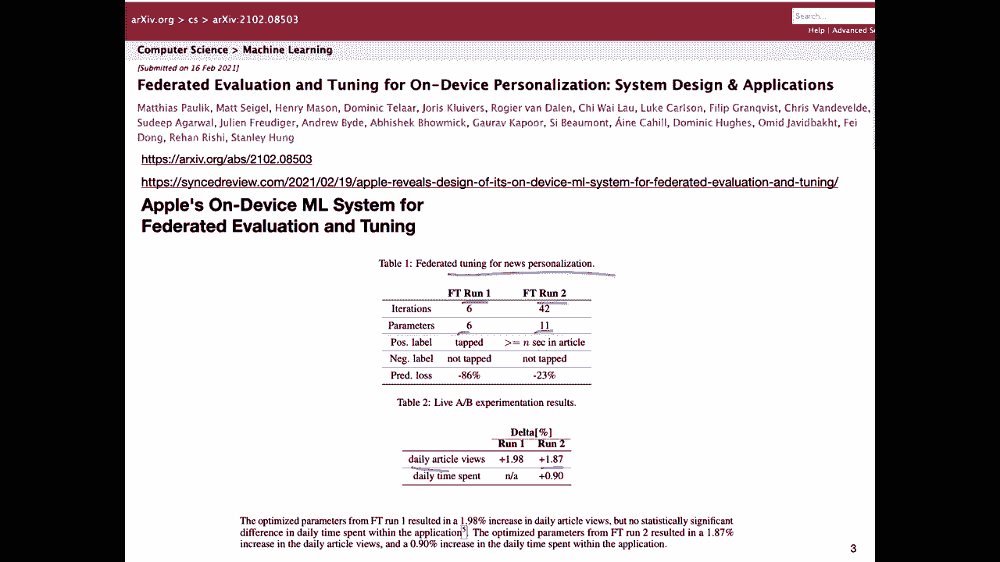
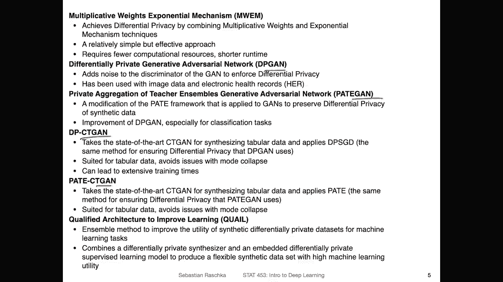
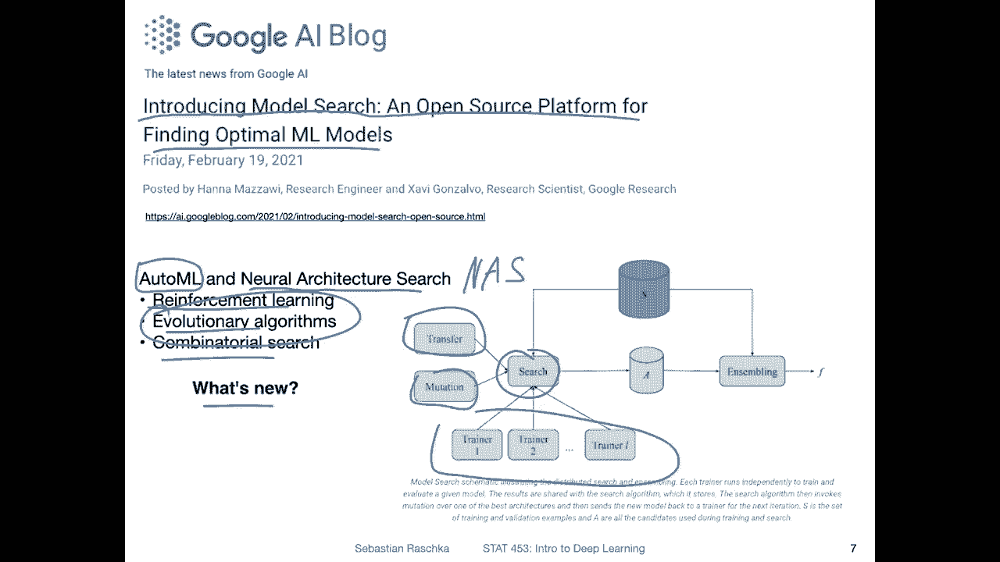
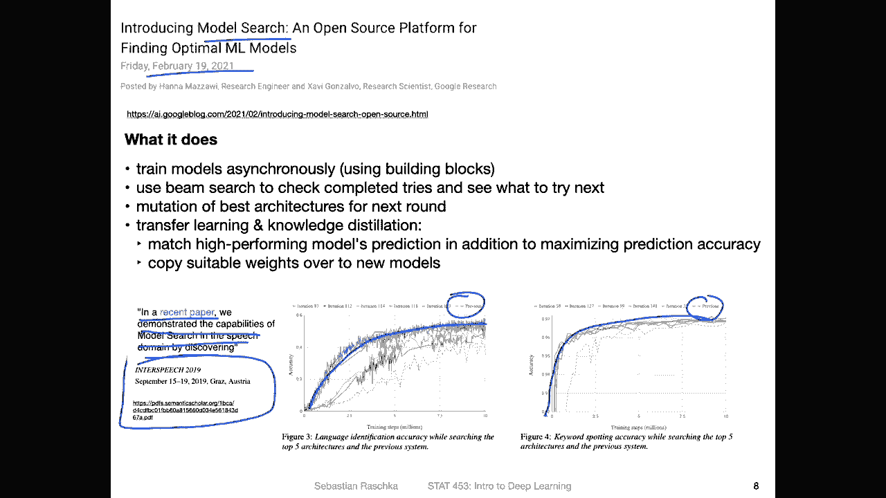
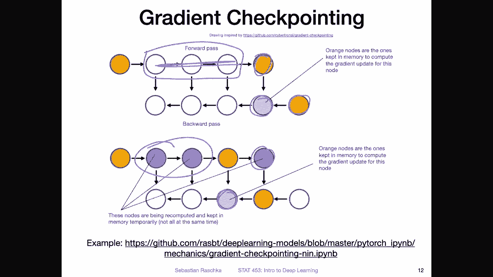
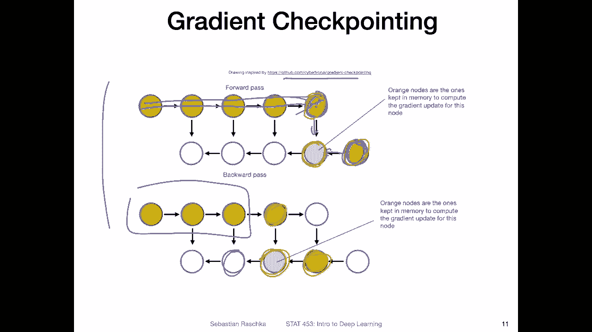
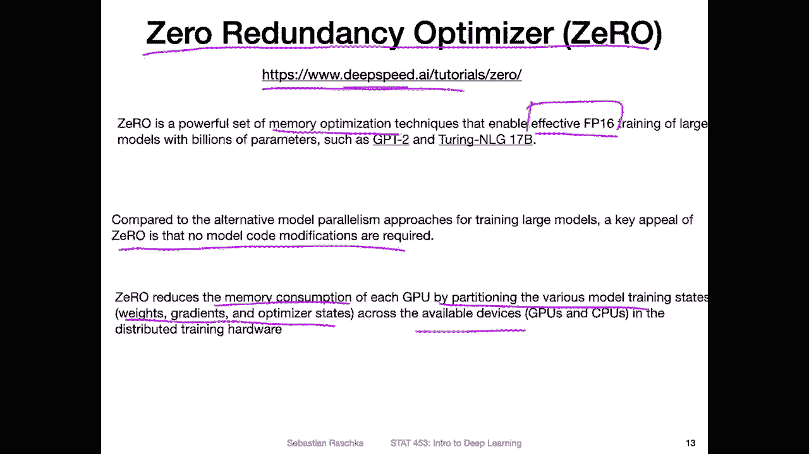
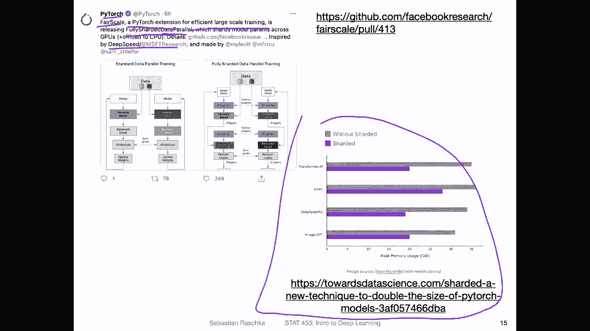

# 【双语字幕+资料下载】威斯康星 STAT453 ｜ 深度学习和生成模型导论(2021最新·完整版) - P61：深度学习新闻 #5，2021 年 2 月 27 日 - ShowMeAI - BV1ub4y127jj

Yeah， hi everyone。 I hope you had a nice week。 So last week we discussed a lot of topics related to computational challenges with deep learning。

 So what do we do if we have these larger models we both require more data and more GPUus and also more time to train these models So coincideally this week I found a lot of news related to the topic of making the training of deep learning models more efficient So that is by spreading out the computation across multiple devices in a process called federated learning。

 but then this also brings privacy concerns。 So there was also some interesting news related to yeah privacy protection。

And lastly， I find personally the most exciting topic is how we can train these deep neural networks still on a single GPU because yeah。

 truth is most of us only have access to one or few GPUus。

 So wouldn't it be nice if we could train just simply things on multiple GPUs like hundreds of them but yeah in real life it's not so easy So luckily there are still a bunch of techniques that allow us to train deep neural networks。

 even the large ones on single GPUus。 So I will also discuss this topic at the end of today's news session。

 but yeah because there are so many topics I wanted to cover today。

 Let me just dive in and get started。Yeah， let's start with Feerated learning。

 So last week I explained Feerated learning is yeah learning on or using multiple devices like splitting up a computation across multiple devices。

 So here was an interesting paper by researchers from Apple。

 So this paper was entitled Federated evaluation and tuning for ondevvised personalization。

 system design and Applic。So does this essentially Apple's undevvised machine learning system for federated evaluation and tuning。

 So federated learning is not new。 I mean， a lot of people and companies use federated learning that is using multiple machines to achieve something。

So but usually what other companies do is they use federated learning to tune a global neural network。

So imagine， for example， you have a server with your deep neural network model。

 and this is let's say an image classifier or something like that。

 So then this global model can learn from yeah， individual people。

 So if you have a cell phone or smartphone， it can access this model on the server。

 And by if you label your data， you can provide training data for this model。

 So there's usually one global model。I mean， not everyone is using that approach。

 but many people are used this approach where you essentially have or keep one global model。

 In contrast here in this paper， Apple describes a system。Where。There are global parameters。

But the model is trained locally。 So all the user data remains inaccessible to the server side。

 So that means here they focus on protecting your privacy。 So not sending any user data to a server。

 So all the training happens locally。 So you may get some parameters from the global model。

 but essentially you will get a personalized model on your your phone， for example。

 without sharing your personal data with a server， which I find actually pretty cool so。

Here's just a sketch of how this works， where。There are three types of information being shared。

 The red arrow is the task configuration and attachments。

 information then in green the task results and telemetry and then on blue these on device records and here this one the left box represents the end user device and you can see for the blue ones。

 the blue ones are the user data， the on device records they never really leave the device so on the right hand side is the developer interface So what the developer interface。

Has access to is yeah， the task configuration and the task results， because you as a developer。

 you still want to see whether the， yeah， the the learning model learns well。 however。

 you don't want to see any user data because that would be than a privacy implication or problem so。

Here's an example of that where they show how this can be used for tuning for news personalization so they have。

 for example， different models， let's call them run one and run two and yeah so here they involve different parameters and different metrics。

From an AB experimentation result。 So， for example。

 which model should be used on a local system and they only have access to information such as how much things improved for example。

 So here they have a delta percent so they can see basically that run2 improved the percent the daily article views increase it by 1。

87。 And if your metric is to maximize the number of article views， if that's your metric。

 then you can measure this by just looking at the results you don't have to have access to what types of articles the user reads。

Yes on the previous slide I highlighted these fundamentally different approaches to federated learning one is keeping one global model on the server and then sending user data to that server。

 which sounds from a privacy perspective a little bit I would say questionable the second approach sounded a little bit more privacy friendly where you do the training on the device and your user data never leaves the server。

 however the first approach with a global model is actually not that bad if you take some precautions。

So there's one area of research called differentiable privacy。 Let me write this down。

 differentiable。Privacy， so this deals with or this field develops methods for yeah adding some noise to a data set such that you can't identify yeah people from this data。

 So there was one interesting article by Microsoft but of course。This is a broad field。

 Many people are working on this。 I just highlight this article because it was just in the news so but be aware that it's not the only approach with this。

But again， just to highlight the problem。 So if you share data with a server or with anyone。

 essentially， even if you don't， let's say， have the names of the persons in that data。

 it may be possible to identify users or people from this data。

 So there was this $1 million Netflix price that has been quite some year ago。

 I think maybe a decade ago even。It was this $1 million price when Netflix had a data set that they shared on Kegggel and they asked people to develop recommendation systems and the best recommendation system。

 the best movie recommender。Or the person who developed this or the team would gain $1 million。

So in order to facilitate this competition， they shared a data set。 It had the title。

The title of the movie， the user ID， the date of the rating and the rating itself。

 So the user ID you can think of it here it is not identifying a particular person It's just for helping to make sure if two movies are rated whether they are rated by the same person or not。

 but you still don't know who the person is。Actually， I never really had Netflix。

 but I think they don't have these five star ratings anymore。 I think it's working differently now。

 I'm honestly not sure， but I think they don't do ratings anymore， but。

Probably back in the day they did anyways。 So the thing here。

 what happened is that people use the IMDB movie review database。

And using this IMDP movie database and looking at this Netflix data here on the left hand side。

 they were able to identify people in this dataset。 So how that worked was they。

By MDB by I think by email or username， they could identify the person。

 and then they were just matching the date of the rating and the rating itself。

To the records in IMDB。 and by that， they could identify the user ID here。

To whom it belongs by just matching the date of rating and rating。

 If you do that for a couple of movies， it becomes very easy to identify certain users by user I D。

 And then you could， yeah， you can see basically all the movies that the person watched and how they rated that movie。

 And that is， I think， a big privacy violation。 if you haven't agreed to if you are Netflix user and you haven't agreed to share that information of all the movies you watched。

Then yeah， that might be a privacy validation。 Maybe you only have a subset on IM DB。

 but you don't want certain people to see what other movies you watch。

 Then this would be problematic。 So differentiable privacy deals with this problem， how you can。

Kind of keep the utility of a dataset set So making the dataset still usable， but avoiding。

The identification of individuals。 So it's essentially the broad yeah。

 the broad approach is essentially adding or synthesizing noise and adding noise to this dataset so that the dataset has broadly the same characteristics。

So if you would， for example， compute the average rating， the average rating may not change。

 but there's some noise that for a user forgiven user。

 some of the rating is a little bit higher and lower than they were in real so in that way it's not so easy to go to MDB and unambiguously identify these users。

Yeah， and what's new here？Is that Microsoft released a tool set called smart noise。

 So in this smart noise yeah contains some Python API and other things to make this more easy to use in practice so。

There is also a sample Gitthub repository where you can take a look at at some examples。

 and I want to talk too much about the individual techniques。

 So they it's basically a framework for implementing different techniques。

 but what I found interesting is。

From this list here of the techniques they implement that many of these techniques they involve GNs。

 so GNs are generative adversarial networks， we will cover them later in this class and they are used essentially to learn the training data distribution and then generating samples。

 new samples from that training set distribution so we will cover that later in this class I just found it interesting that most techniques for differentiable privacy seem to employ generative adversarial networks nowadays or at least the techniques they implemented in this smart noise approach。

Yeah， related to the topic of data augment I've seen this article this week entitledHums are trying to take bias out of facial recognition programs。

It's not working it。So here in this article， the authors mention that one likely reason for this bias in face recognition is the lack of diversity in the data sets。

 and they say that one common mitigation approach is to provide algorithms with data sets that represent all groups equally and fairly。

So there was a paper called1 label 1 billion faces usage and consistency of Ra C in computer vision by Zid Khan and Yuun Fu who looked at this problem。

 So they look at the problem whether a diverse data sets can really help and they say yeah it only it can work but only for a very stereotypical sense of fairness so essentially it doesn't really work So heres a quote what they say is the people in the images appear to fit racial stereotypes For example an algorithm was more likely to label in an individual in an image as white if that person had blonde hair so yeah using even a more diverse data doesn't really help with a biased problem so it's still like yeah having these stereotype steps and stuff like that so。

There needs to be more work done on developing systems that are more fair。

 so it's not as easy as making a data more diverse。

Yeah an interesting yet unrelated topic is AutoML， which stands for automatic machine learning。

 What is automatic machine learning automatic machine learning is about finding yeah good machine learning algorithms and higher parametermeter settings and sometimes also preprocess steps given a certain problem。

So traditionally we humans， we try out different algorithms and typerometer settings and yeah data normalization steps and so forth to see what works well on a given data AutoMl is type is a type of approach of automating this process so it's less workforce for humans it's some system on top of machine learning that yeah learns this how to do it well basically so it's basically automating machine learning in a way。

A specific flavor of OML is neural architecture search。

 this is specific to neural networks where OML can be broader。

 it can also involve yeah traditional machine learning algorithms。

 a neural architecture search is a specific subfield of OTML for neural networks。

 sometimes also it's abbreviated asna for neural architecture search。So here in this article。

 the article is entitled introducingtro model search an open source platform for Find optimal machine learning models。

 There are a couple of other yeah open source platforms for OMl and I had like a little bit of a hard time seeing what's new here。

 but I think what's new is really that they yeah approach this problem a little bit differently。

 I mean， the method is slightly different than other methods。

 So methods I've seen before they're usually based on reinforcement learning。

 evolutionary algorithms or and or combin notatorial search and here it's also looking like a combination of those。

Where they have。Multiple trainers are trained asynchronously and then there is some beam search going on looking at the results and then considering the best models。

 they mutate them so making small changes to the best performing ones which is kind of reminding me of how evolutionary algorithms work and they also talk about knowledge distillation and having some transfer learning here。

 or not literally transfer learning more sorry more like weighted transfer。So here。

 when I recall correctly what they do is they transfer the weights from well performing models to new models they want to explore。

 so instead of starting from scratch。

Yeah， so the results look actually pretty good。 So compared to。Previous methods。

 So here the dotted lines are the previous methods。 They found that their methods here。

 they perform the new method performs better the model search method。 So， yeah。

 my thought is really that this is fundamentally， the building blocks are not that novel。

 But in the way they are put together。 This is a system that performs really well。

 So I think that's the takeaway that this is really。If you want to use it in practice。

 if you want to use something that performs really well， this might be a good approach。

Yeah what I found interesting though， when I read this， they said in a recent paper。

 we demonstrated the capabilities of model search in speech domain by discovering something I think I cut it off but yeah so this is from this 2021 article and I said in a recent paper I looked at up I looked at the paper it's from 2019 so it's actually not that recent anymore I still think this is an interesting approach so if you ever。

Want to attempt neural architecture search this might be one of the approaches to try。

 I should warn you though neural architecture search is of course very。

 very expensive because yeah I mean training a single deep neural network is already expensive and here in this approach imagine you have to train multiple ones asynchronously and yeah this is yet another computational challenge I would say for people who don't have access to hundreds or thousands of GPUus。

Yes， speaking of computational scaling or training large scale models on multiple GPUus。

 so I saw this paper here，terrappipe， token level pipeline parallelism for training large scale language models。

Which is kind of interesting， so it's related to the G3 language model which has 175 billion parametersmeter。

 and they found a way that they can train it five times more efficiently on 48 large GPUus。

 So they are these transformer models and there are different ways you can make them more efficient so。

One is。Partetatiitioning the operations here， that's in subfigu B。

Where I think this means that they just split the computation。

 Let's say the left and the right hand side and。Yeah， pass it on to multiple devices。

 So he had device 1 and2。 I think there has actually a label problem in that figure when I understand correctly。

 this should be actually part2 here everywhere。 Yeah。

 but here it's splitting up the computation across multiple devices by splitting it。

 splitting the layer basically。Another approach is this micro parallelism or micro micro batchchbased pipeline where they split up the batches。

 the mini batches into micro batches if I understand it this correctly here So they split it up into also multiple devices this way and here the novelties essentially that they have another method for parallelism where they split up the input the sequence input into tokens。

 I mean this is what you would do always you would always split it up into token。

 but then they distribute these tokens onto across different devices。

 So each device may have a small number of tokens only to consider。

 so you have parallelism across these tokens， which is I think the new approach here。

Yeah， but now let's get to the real interesting part because this concerns training large scale models on a single GPU。

 so I saw this tweet here， a screenshot of a talk by Zilvane Guar who worked at fast AP。

Yeah now let's get to the real interesting part training large scale models on a single GPU。

 so I saw this tweet here from a talk by Zilvin Google who works at Fast AI。

 which is a company yeah focusing on education around deep learning and developing awesome friendly APIs for Pytorch。

So。Here in this talk Zilva and Google summarize the main steps or main approaches for yeah making large model training possible on a single GPU。

 one obvious one that is the easiest also is to reduce the batch size So the input batch size because then if you reduce the batch size you have smaller matrix multiplication So that helps with yeah memory constraints because usually the yeah the problem with GPUus is that you have a fixed size memory。

 So usually common， I mean， not all of them but common cards between。

 let's say 12 and 20 gigytes of Ram。And this can be quite limiting， especially for these big models。

 And yeah， a bottleneck is usually matrix multiplication。

 especially if you have fully connected layers like the linear layers in Pytorrch。

 So reducing the batch size can help。Another approach is gradient accumulation is kind of related to the batch size。

 So if you have very small batches， what will happen is that your updates will be very noisy。

 So remember when we talked about online learning and stochastic gradient descent。

 we will also talk more about that when we talk about choosing learning rates and things like batch normalization。

 in any case， gradient。Accumulation is an approach where you essentially run backward in Pyr twice。

 So you accumulate the gradients from multiple mini batches before you do the update， basically。

 So in that way， it allows you to use smaller mini batches。

Another approach is gradient checkpointing。 I actually made a brief figure about that。

 I will explain it to you in the next slide， and then there are also these approaches like zero which has something to do with optimizer and then also shard it data distributed data parallel I will also yeah explain to you how that works in a separate slide。

 and there's also model parallelism and pipeline parallelism。

 These are related approaches where you put parts of the model onto separate GPus。

 So imagine you have a model with a lot of parameters and they don't fit into one GPU And this way you simply yeah split the model across different GPUus。

 I also have a small slide about that because I found yeah some interesting new tools that allow you to do that very conveniently。

So here is a visualization of gradient checkpointing， I made it for a notebook。

 I tried it all in practice earlier this year。So here this drawing， I should say。

 is inspired by another post though， that I recommend you to check out to read a more in detailed coverage of that if you're interested。

So we talked a little bit about gradientding descent and we have only done it for smaller models like softm regression。

 but of course the same concept applies if we have multilayer perceptrons and convolutional networks with multiple layers。

 so usually we compute first the forward pass。And then we have a loss function。 Let's say。

 this is our output， a loss。 So for that， you need。The forward pass。

 but then also the signal from the class label。 So let's say here you have the class label information and your prediction and you use that when you back propagate to your compute the gradients。

So traditionally what happens is that you keep all these orange nodes。

 the computations from these nodes in memory， so for different gradients you will need these individual steps from the forward pass and if you just run PyToch regularly for example。

 it will keep all these computations in memory because you will need them to update them so for example。

 just in a very broad conceptwise manner， so in order to update this node during back propagation you need these two nodes。

And then if you want to update this node， you need these two orange nodes。While you're doing that。

 though， you don't。 you don't need this part。 You will need it at the next step， right。

 But in that way。Keeping it in memory is actually efficient in the given moment because you will need the values later。

 but if you have memory limit limitation， this might be something where you want to offload this or you want to not keep it in memory so。

Graadient checkpointing how it works is as follows。 So you will。Compute the forward pass。

 but then you delete all this intermediate information because right now。

 you are only focusing on updating this data point。 So you only use this in this computation。

 You forget about this because let's say you can't keep it in memory。 it's too big。But then。

 when you。Update the second node here。For example， then in that way you recompute these nodes。

 for example and you also recompute these these ones。

 So the blue ones are the ones that are recomputed。 it's wasteful to recompute them every time。

 So essentially when you use gradient checkpointing。

 the model training becomes slower because you have to recompute things。

 but it still helps you dealing with the memory limitations because you don't keep everything in memory。

 So in both slides。

So here this is the regular approach。 Everything in orange is always kept in memory。

 So you can see with gradient and checkpointing here， you keep fewer things in memory。

 only the orange things in memory， but you need to recompute。

 So that's a tradeoff basically between memory and computational efficiency。 it's slower， but again。

 it helps you with memory limitations。

Yeah， so the remaining things on the slide are shing zero then model parallelism and pipeline parallelism。

 so it sounded like based on the tweet that it was for single GPU use。

 unfortunately it requires multiple GPUus。But still， it's， I think。

 a cool selection of things that we can use to make the model training more efficient。

 So I dont want to also discuss this in nitty gritty detail because that would be a lecture in itself。

 But just to give you a big picture overview。 So0 redundancy optimizer。

 that's a technique developed by， I think it was developed by Microsoft。

 which developed this deep speed library。 So there's a tutorial in this deep speed library that discusses what0 does in more detail。

😊，But the broad overview is that it is essentially about memory optimization using 16 bit floating point operations。

 and yeah， what's nice about it is in contrast to some other things that make model training more efficient。

 Ze does not require any major modification of your model code。 So in this way。

 it's more like a wrapper around your model， but it doesn't require you to modify the model significantly by yourself。

So yeah， what it does， it's also then reducing memory consumption。

 One is by yeah the 16 bit training， but it's also partitioning on the different states， weights。

 gradients and optimizer states across the available GPUus and CPUUus。

 So that's why yeah you need also multiple GPU。 However。

 that might be something worthwhile to consider if you have multiple GPUus and memory constraints。

So related to that there's also zero offload， which is yeah kind of related to offloading models。

 So here they even say that it works for models up to 13 billion parameters and they basically say that one of the bottlenecks is also using optimizers like Adam So Adam is something we will be covering soon in the lectures。

 which is Adam is still my favorite optimizer it's actually super nice it's very robust to。Yeah。

 for it's very robust for training deep neural networks it almost always converges compared to SGD and momentum where you need a little bit more fiddling。

 But we will talk more about that in class。And they say they developed this implementation。

 deepD speed CPU at， which is an implementation of Adam that is5 to seven times faster than the standard implementation。

 which I also found interesting。

So。Yeah， related to all these techniques， also to the sharding。

 I also saw a tweet by the Pytorch developers so involving a library called fair scale。

 which is developed by Facebook AI Research。And this is a pytwach extension for efficient large scale training。

 and it uses this fully sharded data， a data parallel approach。

 So sharding is essentially yeah also a form of splitting the weights。 So again。

 here has an article if you are interested in more detail how sharding work。

 So this article describes sharding and here on the left hand side this is yeah combination between。

Parallel data train。Distributing the mini batches across GPSus and the sharding。

 So it's a new thing that just got。Added to this library， I haven't tried it yet。

 but it also looks like another yet。Yeah， cutting edge interesting approach。

 So it's actually based on the Deep speed Microsoft Research Library。 But I think yeah。

 the goal here in fair scale is to make it a little bit more easier to use within Pytorch。

 So I looked at some things that fair scale provides。

 So what I also found interesting was this pipeline parallelism in fair scale。

 I found this particularly interesting because it looks like super easy to use。 So。

Heres a problem where you have， for example， the model that doesn't fit into a single GPU。

 and let's say you have a second GPU that you could use。 technically。

 what you could do is all the other tricks I mentioned before。

 like reducing the batch size and so forth here， what you could do is you can just put also different parts of the model on different GPU is simple very similar to the model parallelism。

 except that we use Pwach pipeline here。 So the Pwach sequential pipeline。 We discussed this。

 I think when we discussed the。Pytoch API in lecture 5。

So where I showed you how you can have multiple layers in a sequential API。

 so here you can also use the sequential API for the distributed training。

 So if you have multiple layers， let's say layer A and a layer B are two layers。

 C and D are two more layers， you can。Put them all into your sequential pipeline and then it will automatically take care of it。

 distributing it across devices。 So here， across two devices， two GPUus。

 and you can also say how balanced these are so you maybe can say if you have a stronger GPU put more onto the first GPU than the other GPU and so forth。

 and then also yeah there's a chunk perimeter。So， yeah。

 that is something I will probably try out pretty soon。 I haven't played around with that yet。

 but it looked super cool because it's yeah simple to use。 But yeah， if you have one GPU。

 this would of course be a bottleneck。 but so it would still be a problem。So in that way。

 I would rather consider reducing the batch size and gradient checkpointing if you have a single GPU。

 Allright， so it was probably a very long video I will just stop it at this point and I will see you back in class on Monday。

