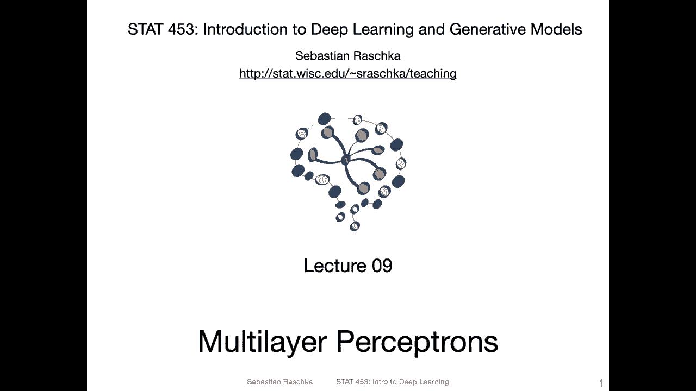
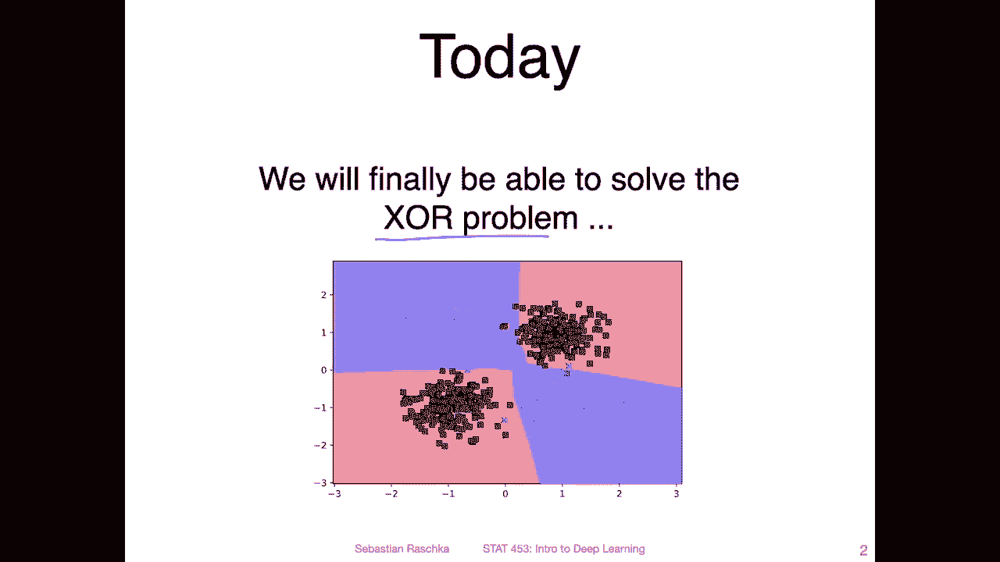
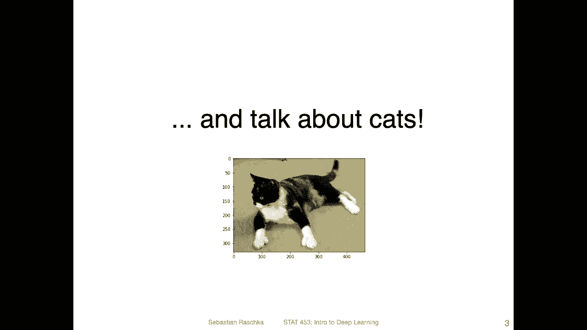

# 【双语字幕+资料下载】威斯康星 STAT453 ｜ 深度学习和生成模型导论(2021最新·完整版) - P62：L9.0- 多层感知器【课程概述】 - ShowMeAI - BV1ub4y127jj

Yeah， hi， everyone。 I hope it a nice weekend。 I saw you all submitted your project proposals as you were supposed to。

 So this week， I will be trying to get through them and give you some feedback on yeah your projects。

 So like I said， the grading will be rather generous for the proposals because the main goal is really to have a plan and to see what you are working on。

 So yeah， with that lecture wise today， we are finally starting to cover multilayer perceptionceptrons。

 that is multilayer neural networks。 has been yeah quite some lectures to get here。 But I hope yeah。

 all the previous lectures were useful for providing you some foundation。 and now。😊，Yeah。

 now we are getting to the fun part where we will be working with deeper and deeper neural networks。

 Now， the multiceptrons。 Then we will look at some tricks to make the learning more stable or better。

 And then， yeah， we will move on to convolutional networks。

 recurrent neural networks and then generative models。 All right， with that， let me get started then。

😊。

Yeah for today's lecture there are two main points。 first of all。

 today we will finally be able to solve the Xor problem。

 so the Xor problem is something I introduced earlier yeah a long time ago when we talked about the perceptron so that is a data that looks actually very simple it's only two features but the way these classes are arranged the perceptron adeline and logistic regression classifiers that we covered wouldn't be able to solve it but the multilayer perceptron will be able to solve it。

Yeah， however， Xor problems are not super interesting because yeah。

 where do you encounter an exO problem in real life， So in that way。

 we will also see how we can classify cats and dogs using a multi perceptron from yeah image data。😊。

So the broad topics I have in mind for today is yeah introducing the multi layer perceptron architecture。

 then talking a little bit more about the different nonlinear activation functions。

 So one nonlinear activation function you have already seen in the context of logistic regression。

 actually you' have seen， too。 You have seen the。Sigoidal。Logistic or logistic sigmite。

 is's probably the more common way to say it， the logistic sigmite function。And you have seen the。

Softm function。 The softm function is usually something that is yeah used before the output layer。

 but for the hidden layers in a multireceptron， there are。

 yeah different choices for non nonlinear activation functions。

 The logistic sigmoid would be one of them， but we will also take a look at some other ones。

Then I will show you some code examples implementing multi layerer perceptionceptron and Pytorch and yeah then we will talk a little bit about overfitting and underfitting。

 so these are really important topics yeah underfitting and overfitting that's related to how well our model fits the data。

 fitting the data not well enough is of course bad but also fitting the data too well can also be bad。

Yeah and then finally I will show you how we can apply this to a CAS versus Docs data。

 so here I will introduce how we can use custom data loaders。

 so that is something I think you will find very useful when you will be working on your own projects where you have your own datas。

Of course， a multilayer perceptionceptron is not yeah great for image data for that there are convolutional networks。

 but yeah introducing one thing at a time， we will first apply apply our multilay perception to this cats and dogs problem and then later we will yeah use convolutional networks to solve it a little bit better Alright。

 so that is yeah the overview and in the next video I will start explaining the multilayer perceptionceptron architecture。

