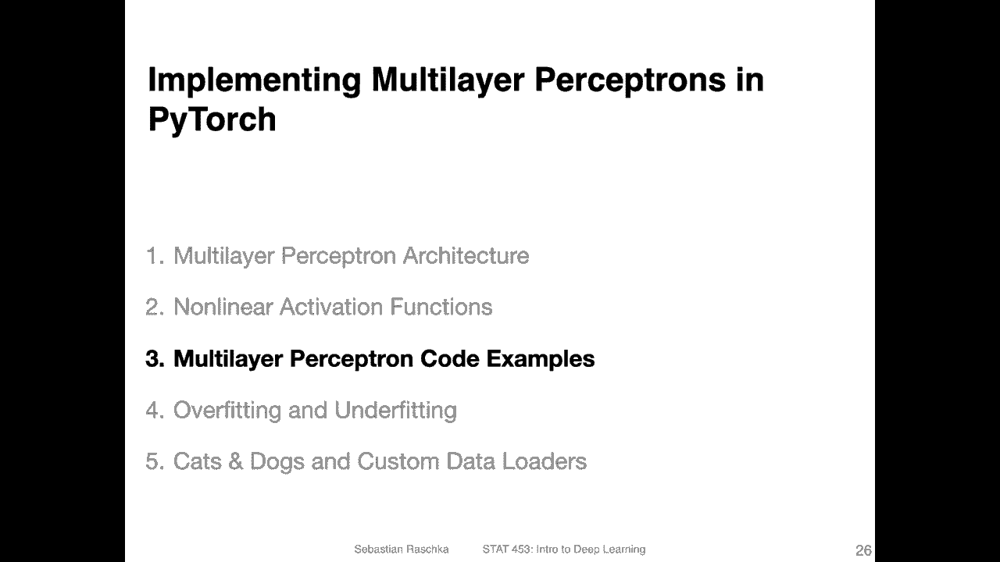
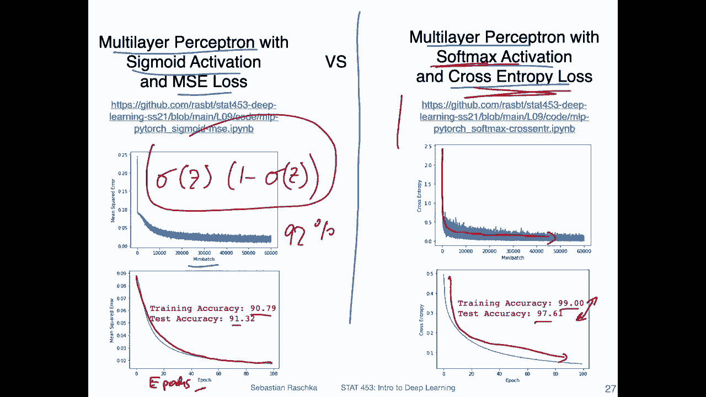
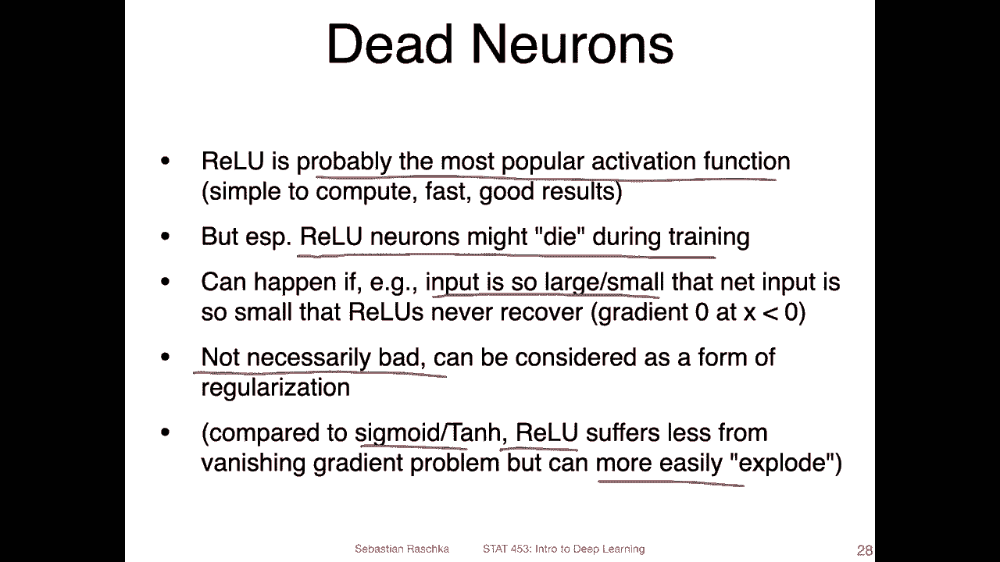
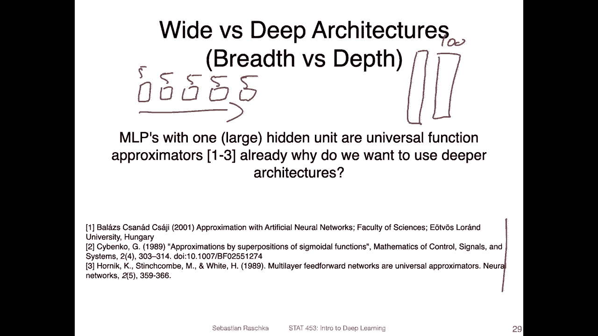
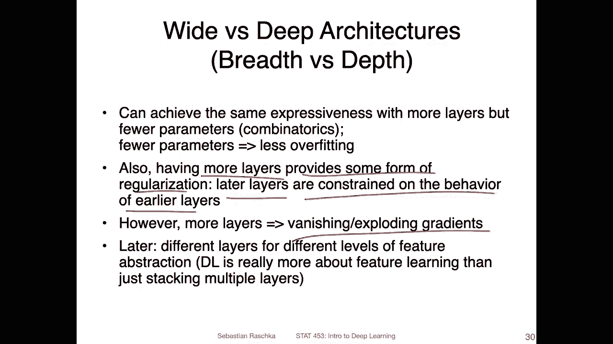

# 【双语字幕+资料下载】威斯康星 STAT453 ｜ 深度学习和生成模型导论(2021最新·完整版) - P65：L9.3.1- 多层感知器代码第 1／3 部分(幻灯片概述) - ShowMeAI - BV1ub4y127jj

Alright， let's now take a look at some code examples。

 but before that I have a few slides I wanted to go through just to summarize what we are going to take a look at in the code。

 but then also yeah to add a few things about multilayer perceptrons that I didn't mention in the previous slides。

So I prepared two code notebooks and I will also show you some Python scripts as alternative。

 so in these code notebooks I implemented a multilayer perceptron with a sigmoid activation and a mean squarearrows and a multilayer perceptron the same one。

 but with softm activation and cross entropys。So there are， let's take a look at the left hand side。

 There are two plots here。 So one is showing the loss for each mini batch。

 So you can see it goes down。 That's what you want to see。

 The trend goes down while we are training it。 It's a little bit noisy。

 This is expected because it's。Stochastic， gradient inence， so these updates are noisy。At the bottom。

 I'm plotting the loss computed of like computing over it over the whole training set。

 So after each training epoch I'm computing the loss of the whole training set。

 So this is why it's smoother here。 So you can see I'm training for 100 epochs。

 So X X is the number of epochs。Actually。YeahI think I probably wrote epochy。

 I can't see always the bottom of the slide because there is like for the pen， the color bar。

 but I think there it says epoch， anyways， So you can see this is training nicely。

 but the accuracy is quite low。 it only reaches 90% training accuracy，91% test accuracy。

 One good thing about it is it's not overfitting。 But if you recall from the softm regression lecture。

 we already achieved 92% something using just softm regression。 So yeah。

 the reason why I think this multiepron is not working well。

 My suspicion is it's because the sigmoid activation and the M e loss are not a good combination。

 Like I outlined earlier。When because the terms don't cancel so nicely compared to softm and cross entropy or even sigmoid and cross entropy。

 what happens is that we have yeah the derivative。Of。The syigmoid function in the chain rule。

 and this will be a number smaller than one， which can be a little bit problematic because yeah。

 you may have like these small numbers multiplying things with a small number。

 And then you have a vanishing gradientding problem So you make the gradient very small。

 and then maybe you don't update。 That could be one problem。 I can see with that。

 if you use the cross entropys Yeah， it's a little bit less of an issue。

 So cross entropys is usually better with sigmoid activation。

 or you can also use the softmax activation， which I would recommend because we have yeah。

 a mutually exclusive classes。 So like we talked about why not also using softmax activation You can play around actually you can take this code example and change softm to syigmoid。

 you will see there's not a big difference though， but。

Yeah here on the right hand side you can see though what the main takeaway is that again the loss goes down that's what you want to see but what you can see is also the training accuracy is 99% and the test accuracy 90 almost 98% there is a little bit of overfitting we will talk about overfitting after the Jupyter notebook video in the next video but yeah what you can see is the cross entropy loss actually works much better here than the MSE loss。

Yeah， a few more things。 I already talked about dead neurons。

 so we can also use the value activation function， which is very popular。

 You can actually try it in the code notebooks。It's like I said。

 probably the most popular activation function I use it all the time for most of my stuff because it works well usually however。

 theoretically there's this problem that it might have this that neuron problem like the relative might die during training that happens if the input is too large or too small so that the net input is yes。

 a negative。 So if you have a large input and a negative weight。

 then yeah the net input would be negative or if you have a positive weight。And very small input。

 very negative input。 Then also， the net input will be negative。 And if it's so negative。The。

 let's say it's extremely negative。 Then maybe it will never be possible to escape this。Problem。

 because even though you have the multi variable channel， you combine certain things。

 you may never be able to reach this threshold， have a positive number。

 so you will never maybe update a certain weight， and then you end up with a that neuron。However。

 like I said， it's maybe not necessarily bad because if you have a lot of neurons。

 your network has a tendency to overfit， then yeah。

 removing some neurons removes some parameters and it can maybe help actually achieving a better performance because yeah it's kind of simplifying the network like pruning excessive weights。

Also， one advantage of Verlu compared to， let's say the symoid or 10 h function is that it suffers less from the vanishing gradient problem that I explained on the previous slide because yeah the gradient is either 0 or 1。

 so you either have the dead neuron in the worst case or no gradient in the worst case。

 but in the other case， if you have a positive net input you always have a strong gradient of one but。

It could technically lead to exploding gradient problems if you have some values that are greater than one from other parts of the network。

 But yeah， I will talk more about vanishing and exploding gradients when we talk about there would be a good point for recurrent neural networks。

 We will talk about that when we talk about recurrent neural networks later。 But yeah， in general。

 just wanted to summarize these few points。

Another thing is。Shall we use a white or a deep multilepociron。

 So if we have to choose which one would be better so。Let's say we， we could make a。

Multilay perceptionceptron， where we only have a small number of units in each layer。

 let's say five in each but have a lot of layers。 or we could make a very wide network where we have。

 let's say， only one hidden layer。But then let's say we have 100 units in that layer。

So what is preferable？I mean， theoretically， there has been some work。On the universal approximation。

Theory or theorem， in that case， I think it's a theorem。 Even I haven't actually read these papers。

 I only know they exist。 So they are。Theorems showing that a multi layerer perceptron with one abitrarily large hidden layer can already approximate arbitrary functions。

 So in that case， if a multilayer perceptron with only one very。

 very big hidden layer can already do that， why would we even care about having multiple layers。

 I mean， the ability。To approximate arbitrary function doesn't mean it's yeah practical to train such a network。

 So first of all， there are some challenges with training， also just large matrix multiplications。

 But then also you need more parameters， really， to have the same expressiveness as using more layers。

With fewer number of parameterss， if you have fewer peris， but more layers。

 you have more combinatorially， more combinations possible。 So this way。

 you have the same expressiveness as with a multi perceptron with only few large hidden layers。

 But then if you have a lot of these layers。 then you may suffer from vanishing and exploding gradients that I just mentioned in the previous light。

 So usually there's a trade off in practice。For multi layer perceptionceptance。

 you never really go deeper than one or two layers because then you have like these vanishing exploding gradientding problems。

 but later we will talk about convolutional networks。

And other types of networks where we can actually go deeper without having these exploding and vanishing gradient problems。

 So there are some。Tricks and this is basically what deep learning is about。

 It is about yeah designing things cleverly so that we can go deeper without having vanishing sporting gradientding problems for multilayer perceptrons because it's not really a deep learning architecture。

1 or two hidden layers is enough， you will notice if you try it to implement a multilayer perceptionceptron with three or four layers。

 you will usually notice it doesn't train so well anymore because the arrows don't backproagate so far anymore。

 So a practical consideration is usually using one or two hidden layers and a multier perceptron if we talk about convolutional layers。

 we can go up to 500 or maybe 500， but let's say1001 50200。 that's even very common these days。

But conversion networks are a topic for another lecture。So， yeah， like I said。

 just to summarize again， we can achieve the same expressiveness with more layers。

 but fewer parameterss compared to having like one large layer with a lot of parameterss。

But also what's nice about having more layers than compared to one is that we have some form of regularization because later layers are constrained on the behavior of earlier layers。

 so we have also in that way having more layers can also sometimes in theory at least be helpful。

But then like I said， we have the vanishing exploringing grain problems and later we will talk more about that。

So。Now it's a time that I show you the code example。

 so let me pause this video and then start my Jupiter notebook。

